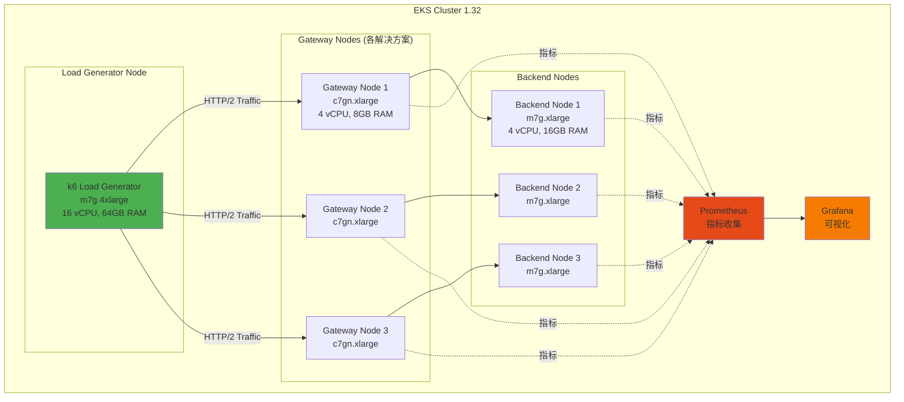

# Gateway API 实现性能基准测试计划

> 📅 **编写日期**: 2026-02-12 | ✍️ **作者**: devfloor9 | ⏱️ **阅读时间**: 约10分钟

为了在相同的 Amazon EKS 环境中客观比较5个 Gateway API 实现的系统性基准测试计划。通过定量掌握各解决方案的优缺点，可以基于数据进行架构决策。

:::tip 相关文档
本基准测试计划针对 [Gateway API 采用指南](/docs/infrastructure-optimization/gateway-api-adoption-guide) 中比较分析的5个解决方案。
:::

## 1. 基准测试目的

本基准测试旨在在相同的 EKS 环境中客观比较5个 Gateway API 实现，定量掌握各解决方案的优缺点。

**核心问题：**
- 哪个解决方案最快？（吞吐量、延迟）
- 资源效率最好的解决方案是什么？（CPU/Memory 相对性能）
- 在大规模环境中扩展性最优秀的解决方案是什么？
- 各解决方案的 trade-off 是什么？

## 2. 测试环境设计

## 3. 测试场景

### 1. 基本吞吐量（Throughput Test）

**目的：** 测量最大 RPS（Requests Per Second）

将并发连接数增加到100、500、1000、5000，测量各解决方案的最大吞吐量。

### 2. 延迟配置文件

**目的：** 测量 P50/P90/P99/P99.9 延迟

在恒定负载下测量响应时间分布以比较尾部延迟。

### 3. TLS 性能

**目的：** 测量 TLS 终止吞吐量和握手时间

在 HTTPS 流量中测量 TLS 终止性能和握手开销。

### 4. L7 路由复杂度

**目的：** 应用基于头的路由、URL 重写时的性能变化

测量复杂路由规则对性能的影响。

### 5. 扩展测试

**目的：** 路由数增加时的性能变化（10、50、100、500 routes）

测量大量 HTTPRoute 时的路由性能和内存使用。

### 6. 资源效率

**目的：** CPU/Memory 使用相对吞吐量

比较在相同资源约束下各解决方案的效率。

### 7. 故障恢复

**目的：** 控制器重启时的流量影响

测量 Gateway 控制器重启时的停机时间和恢复时间。

### 8. gRPC 性能

**目的：** gRPC 流吞吐量

测量 gRPC 协议支持和性能。

## 4. 测量指标

| 指标 | 单位 | 测量方法 |
|------|------|-----------|
| **RPS (Requests Per Second)** | req/s | k6 summary 或 Prometheus rate() |
| **Latency (P50/P90/P99)** | ms | k6 histogram_quantile 或 Grafana |
| **Error Rate** | % | (failed requests / total requests) × 100 |
| **CPU Usage** | % | Prometheus container_cpu_usage_seconds_total |
| **Memory Usage** | MB | Prometheus container_memory_working_set_bytes |
| **Connection Setup Time** | ms | k6 http_req_connecting |
| **TLS Handshake Time** | ms | k6 http_req_tls_handshaking |
| **Network Throughput** | Mbps | Prometheus rate(container_network_transmit_bytes_total) |

## 5. 预期结果（理论分析）

各解决方案的预期优势/劣势：

**AWS Native (ALB + NLB)**
- **优势**: 完全托管、自动扩展、AWS 集成
- **劣势**: ALB hop 导致的延迟增加、成本
- **预期性能**: 中等（吞吐量 10K RPS、P99 50ms）

**Cilium Gateway API (ENI 模式)**
- **优势**: eBPF 最高性能、原生路由、Hubble 可见性
- **劣势**: 配置复杂度、学习曲线
- **预期性能**: 最佳（吞吐量 30K RPS、P99 15ms）

**NGINX Gateway Fabric**
- **优势**: 经过验证的 NGINX 引擎、稳定性、丰富功能
- **劣势**: 内存使用量高
- **预期性能**: 良好（吞吐量 20K RPS、P99 25ms）

**Envoy Gateway**
- **优势**: L7 功能丰富、可扩展性、可观察性
- **劣势**: 资源开销
- **预期性能**: 中上（吞吐量 15K RPS、P99 30ms）

**kGateway (Solo.io)**
- **优势**: AI 路由、企业功能
- **劣势**: 需要企业许可证
- **预期性能**: 中上（吞吐量 18K RPS、P99 28ms）

## 6. 基准测试执行计划

| 阶段 | 内容 | 工具 | 所需时间 |
|------|------|------|-----------|
| 1. 环境构建 | EKS 集群及5个解决方案分别部署 | eksctl、Helm | 2天 |
| 2. 基本测试 | 吞吐量、延迟测量 | k6、Prometheus | 1天 |
| 3. TLS 测试 | HTTPS 性能测量 | k6 (TLS) | 0.5天 |
| 4. L7 测试 | 复杂路由规则测试 | k6 (custom) | 0.5天 |
| 5. 扩展测试 | 路由数增加测试 | kubectl、k6 | 1天 |
| 6. 资源测量 | CPU/Memory 性能分析 | Prometheus、Grafana | 1天 |
| 7. 结果分析 | 数据分析及报告编写 | Jupyter、Matplotlib | 2天 |

:::info
基准测试执行结果将更新到本文档。相关网络基准测试请参见 [CNI 性能比较](./cni-performance-comparison.md)。
:::

---

## 相关文档

- [Gateway API 采用指南](/docs/infrastructure-optimization/gateway-api-adoption-guide) — 5个解决方案详细比较分析
- [CNI 性能比较基准测试](./cni-performance-comparison.md) — VPC CNI vs Cilium 网络性能
- [基础设施性能基准测试](./infrastructure-performance.md) — 综合基础设施性能测试
