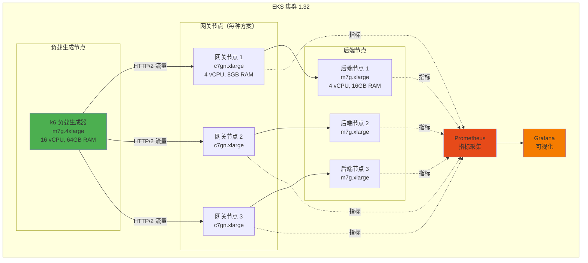

# Gateway API 实现性能基准测试计划

> 📅 **创建日期**：2026-02-12 | **更新日期**：2026-02-14 | ⏱️ **阅读时间**：约 5 分钟

在同一 Amazon EKS 环境中，对 5 种 Gateway API 实现进行系统化的基准测试计划。目标是量化识别每种方案的优缺点，以支持基于数据的架构决策。

:::tip 相关文档
本基准测试计划针对 [Gateway API 采用指南](/docs/eks-best-practices/networking-performance/gateway-api-adoption-guide) 中对比的 5 种方案。
:::

## 1. 基准测试目标

本基准测试旨在同一 EKS 环境中客观对比 5 种 Gateway API 实现，量化识别每种方案的优缺点。

**核心问题：**
- 哪种方案最快？（吞吐量、延迟）
- 哪种方案资源效率最高？（相对于 CPU/内存的性能）
- 哪种方案在大规模环境中扩展性最好？
- 每种方案的权衡是什么？

## 2. 测试环境设计

```mermaid
graph TB
    subgraph "EKS 集群 1.32"
        subgraph "负载生成节点"
            K6[k6 负载生成器<br/>m7g.4xlarge<br/>16 vCPU, 64GB RAM]
        end

        subgraph "网关节点（每种方案）"
            GW1[网关节点 1<br/>c7gn.xlarge<br/>4 vCPU, 8GB RAM]
            GW2[网关节点 2<br/>c7gn.xlarge]
            GW3[网关节点 3<br/>c7gn.xlarge]
        end

        subgraph "后端节点"
            BE1[后端节点 1<br/>m7g.xlarge<br/>4 vCPU, 16GB RAM]
            BE2[后端节点 2<br/>m7g.xlarge]
            BE3[后端节点 3<br/>m7g.xlarge]
        end

        PROM[Prometheus<br/>指标采集]
        GRAFANA[Grafana<br/>可视化]

        K6 -->|HTTP/2 流量| GW1
        K6 -->|HTTP/2 流量| GW2
        K6 -->|HTTP/2 流量| GW3

        GW1 --> BE1
        GW2 --> BE2
        GW3 --> BE3

        GW1 -.->|指标| PROM
        GW2 -.->|指标| PROM
        GW3 -.->|指标| PROM
        BE1 -.->|指标| PROM
        BE2 -.->|指标| PROM
        BE3 -.->|指标| PROM

        PROM --> GRAFANA
    end

    style K6 fill:#4CAF50
    style PROM fill:#E64A19
    style GRAFANA fill:#F57C00
```

## 3. 测试场景

### 1. 基本吞吐量（吞吐量测试）

**目的：** 测量最大 RPS（每秒请求数）

将并发连接从 100、500、1000 逐步增加到 5000，测量各方案的最大吞吐量。

### 2. 延迟剖面

**目的：** 测量 P50/P90/P99/P99.9 延迟

在稳定负载下测量响应时间分布，对比尾部延迟。

### 3. TLS 性能

**目的：** 测量 TLS 终止吞吐量和握手时间

测量 HTTPS 流量的 TLS 终止性能和握手开销。

### 4. L7 路由复杂性

**目的：** 测量基于 Header 的路由和 URL 重写对性能的影响

测量复杂路由规则对性能的影响。

### 5. 扩展测试

**目的：** 测量路由数量增加时（10、50、100、500 条路由）的性能变化

测量大量 HTTPRoute 下的路由性能和内存使用。

### 6. 资源效率

**目的：** 相对于 CPU/内存使用的吞吐量

在相同资源限制下对比各方案的效率。

### 7. 故障恢复

**目的：** 控制器重启期间的流量影响

测量 Gateway 控制器重启时的停机时间和恢复时间。

### 8. gRPC 性能

**目的：** gRPC 流式吞吐量

测量 gRPC 协议支持和性能。

## 4. 测量指标

| 指标 | 单位 | 测量方法 |
|------|------|-----------|
| **RPS（每秒请求数）** | req/s | k6 summary 或 Prometheus rate() |
| **延迟（P50/P90/P99）** | ms | k6 histogram_quantile 或 Grafana |
| **错误率** | % | (失败请求 / 总请求) x 100 |
| **CPU 使用率** | % | Prometheus container_cpu_usage_seconds_total |
| **内存使用** | MB | Prometheus container_memory_working_set_bytes |
| **连接建立时间** | ms | k6 http_req_connecting |
| **TLS 握手时间** | ms | k6 http_req_tls_handshaking |
| **网络吞吐量** | Mbps | Prometheus rate(container_network_transmit_bytes_total) |

## 5. 预期结果（理论分析）

各方案的预期优缺点：

**AWS 原生方案（ALB + NLB）**
- **优点**：完全托管、自动扩缩、AWS 集成
- **缺点**：ALB 跳转带来的延迟增加、成本
- **预期性能**：中等（吞吐量 10K RPS，P99 50ms）

**Cilium Gateway API（ENI 模式）**
- **优点**：最佳 eBPF 性能、原生路由、Hubble 可见性
- **缺点**：配置复杂、学习曲线
- **预期性能**：最高（吞吐量 30K RPS，P99 15ms）

**NGINX Gateway Fabric**
- **优点**：成熟的 NGINX 引擎、稳定性、丰富功能
- **缺点**：内存使用较高
- **预期性能**：高（吞吐量 20K RPS，P99 25ms）

**Envoy Gateway**
- **优点**：丰富的 L7 功能、可扩展性、可观测性
- **缺点**：资源开销
- **预期性能**：中高（吞吐量 15K RPS，P99 30ms）

**kGateway（Solo.io）**
- **优点**：AI 路由、企业级功能
- **缺点**：需要企业许可证
- **预期性能**：中高（吞吐量 18K RPS，P99 28ms）

## 6. 基准测试执行计划

| 阶段 | 描述 | 工具 | 时长 |
|------|------|------|-----------|
| 1. 环境搭建 | 部署 EKS 集群和 5 种方案 | eksctl、Helm | 2 天 |
| 2. 基本测试 | 测量吞吐量、延迟 | k6、Prometheus | 1 天 |
| 3. TLS 测试 | 测量 HTTPS 性能 | k6（TLS） | 0.5 天 |
| 4. L7 测试 | 测试复杂路由规则 | k6（自定义） | 0.5 天 |
| 5. 扩展测试 | 测试路由数量增加 | kubectl、k6 | 1 天 |
| 6. 资源测量 | CPU/内存 Profiling | Prometheus、Grafana | 1 天 |
| 7. 结果分析 | 数据分析和报告撰写 | Jupyter、Matplotlib | 2 天 |

:::info
基准测试执行结果将在本文档中更新。相关网络基准测试请参见 [CNI 性能对比](./cni-performance-comparison.md)。
:::

---

## 相关文档

- [Gateway API 采用指南](/docs/eks-best-practices/networking-performance/gateway-api-adoption-guide) — 5 种方案详细对比
- [CNI 性能对比基准测试](./cni-performance-comparison.md) — VPC CNI vs Cilium 网络性能
- [基础设施性能基准测试](./infrastructure-performance.md) — 综合基础设施性能测试
