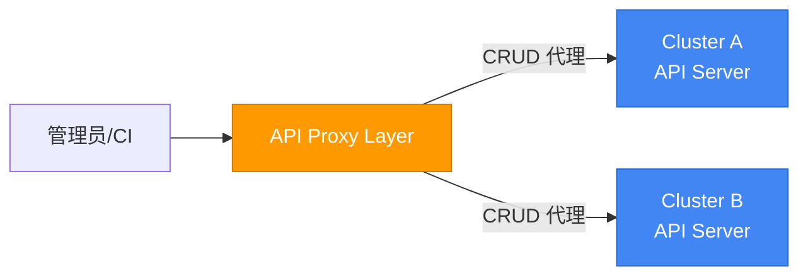
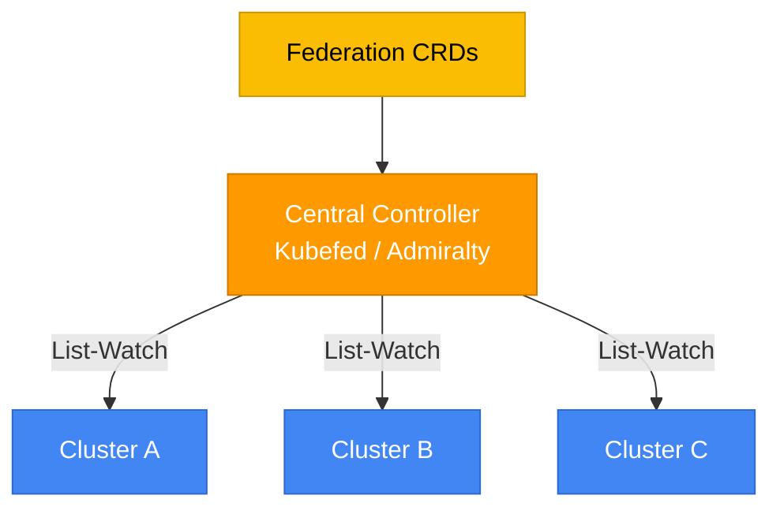
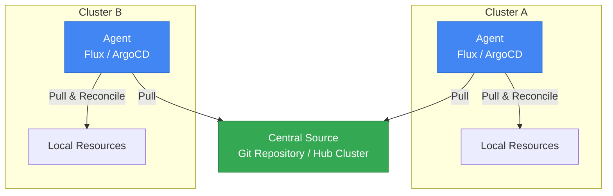
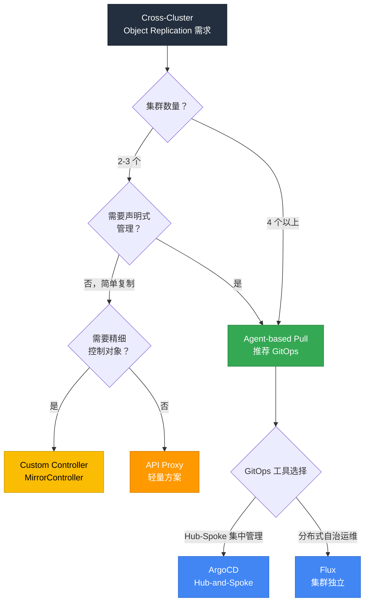
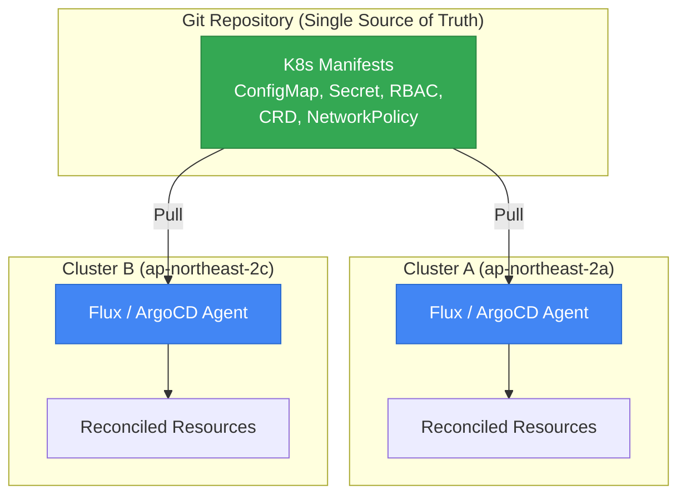
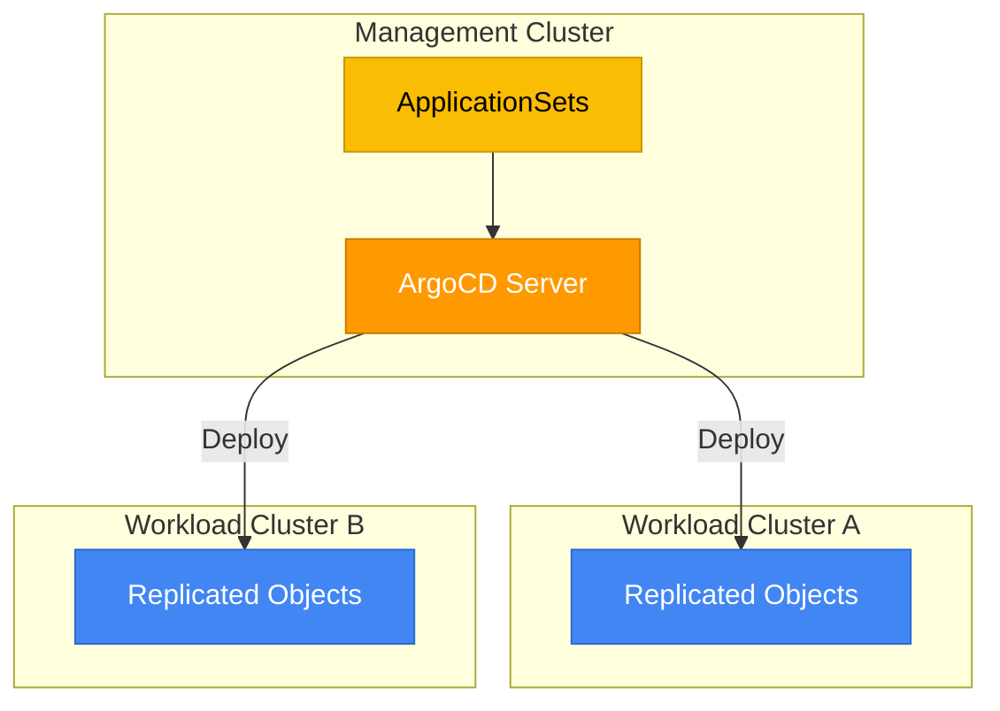
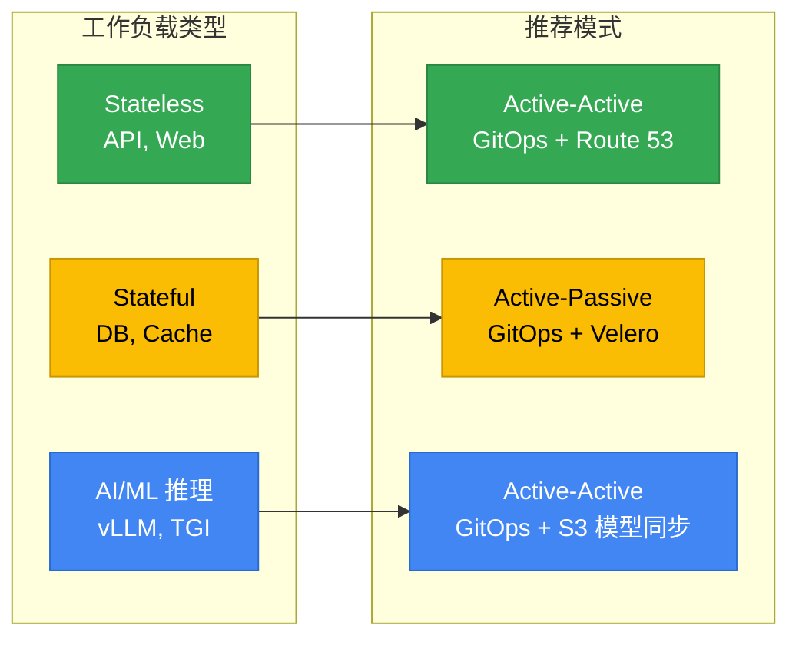
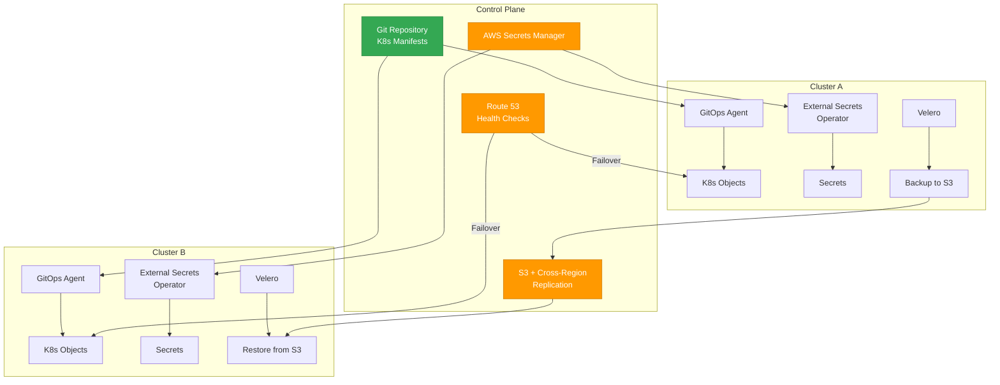

# Cross-Cluster Object Replication (HA) 架构指南

> 📅 **撰写日期**: 2026-03-24 | **修改日期**: 2026-03-24 | ⏱️ **阅读时间**: 约 12 分钟

> **📌 基准环境**: EKS 1.32+, ArgoCD 2.13+, Flux v2.4+, Velero 1.15+

## 1. 概述

在生产环境中，如果依赖单个 EKS 集群，集群故障时会导致整个服务中断。**Cross-Cluster Object Replication** 是通过将 Kubernetes 对象（ConfigMap、Secret、RBAC、CRD、NetworkPolicy 等）一致地复制到多个集群来确保高可用性的策略。

### 当前状况

EKS 不提供托管的 Cross-Cluster Object Replication 功能。因此需要**组合开源工具和架构模式**来自行实现。本指南比较各模式的优缺点，并提供根据工作负载类型的选择标准。

### 本指南的范围

| 包含 | 不包含 |
|------|--------|
| K8s 对象复制（ConfigMap、Secret、CRD、RBAC 等） | 应用数据复制（DB 副本） |
| 基于 GitOps 的声明式同步 | 基于服务网格的流量路由 |
| 有状态对象备份/恢复（Velero） | 存储层复制（EBS、EFS） |
| DNS 故障切换策略 | 应用级别 HA 模式 |

---

## 2. 多集群架构模式比较

实现 Cross-Cluster Object Replication 有三种核心模式。

### Pattern 1: API Proxy（Push 模型）

中央路由层直接向各集群的 API Server 代理 CRUD 请求。

- **工作方式**: 从中央向各集群直接 API 调用
- **优势**: 轻量且直观
- **局限**: 凭证安全薄弱、多集群 Watch 不可用、连接复杂度增加

### Pattern 2: Multi-cluster Controller（Kubefed 系列）

中央控制器基于 Informer 的 List-Watch 监视各集群状态，并通过 CRD 同步。

- **工作方式**: 中央控制器监视并同步各集群状态
- **优势**: 动态集群发现、可应用 Federation 策略
- **局限**: 10 个以上集群时 Watch 事件溢出、Informer 缓存大小限制、凭证明文存储风险

:::warning Kubefed 项目状态
Kubernetes SIG 已将 Kubefed(v2) 实质上置于维护模式。不建议在新项目中使用。
:::

### Pattern 3: Agent-based Pull 模型（推荐）

各集群的代理从中央源（Git 或 Hub 集群）Pull 目标状态并在本地 Reconcile。这与 kubelet 接收 Pod Spec 在本地运行的原理相同。

- **工作方式**: 各集群代理独立 Pull 目标状态并本地 Reconcile
- **优势**: 高扩展性、最终一致性、中央故障时本地仍可运行
- **局限**: 需要在所有集群部署代理

### 模式综合比较

| 视角 | API Proxy | Multi-cluster Controller | Agent-based Pull |
|------|-----------|--------------------------|-------------------|
| **工作方式** | 中央 → 集群 Push | 中央 Watch + CRD 同步 | 集群 → 中央 Pull |
| **扩展性** | 低（与连接数成正比） | 中（约 10 个集群） | 高（数百集群） |
| **复杂度** | 低 | 高 | 中 |
| **安全性** | 薄弱（多凭证） | 薄弱（明文存储） | 强（代理本地权限） |
| **故障隔离** | 低 | 中 | 高 |
| **Drift Detection** | 无 | 部分 | 内置 |
| **推荐场景** | PoC、小规模 | 遗留环境 | **生产环境（推荐）** |

### 决策流程图

---

## 3. 推荐方案架构

### Option A: GitOps（Flux / ArgoCD） — 大多数用例推荐

使用 Git 仓库作为 Single Source of Truth，各集群的 GitOps 代理独立 Pull & Reconcile。

**核心优势：**

- **Drift Detection**: 集群状态与 Git 不一致时自动检测并恢复
- **审计追踪**: 所有变更历史以 Git 提交记录保留
- **声明式管理**: 定义目标状态后代理自动 Reconcile
- **故障隔离**: 一个集群代理故障不影响其他集群

**Active-Active 配置：**

两个集群都从相同的 Git 仓库独立 Pull。通过 DNS（Route 53）分发流量，一个集群故障时其余集群立即处理全部流量。

**Active-Passive 配置：**

仅 Active 集群激活 GitOps 代理。Passive 集群将代理保持在 Suspended 状态，故障切换时激活。

### Option B: ArgoCD Hub-and-Spoke 模型

在 Management Cluster 安装 ArgoCD，通过 ApplicationSets 部署到多个工作负载集群。

**HA 配置策略：**

| 策略 | 说明 | 适合场景 |
|------|------|---------------|
| **Active-Passive 镜像** | 在两个区域部署 ArgoCD，Passive 禁用控制器。故障切换时手动 Scale-Up | DR 要求较低的环境 |
| **Active-Active Sync Windows** | 两个 ArgoCD 实例在不重叠的时间段执行 Sync（Sync Windows 功能） | 需要防止冲突的 Active-Active |

:::info ApplicationSets Generator
使用 ArgoCD ApplicationSets 的 `Cluster Generator` 可以自动将应用部署到 ArgoCD 中注册的所有集群。添加新集群时无需额外配置即可立即开始复制。
:::

### Option C: Custom Controller（MirrorController 模式）

当需要对对象复制进行精细控制时，开发专用控制器来管理源集群和目标集群之间的同步。

**适用场景：**

- 仅选择性复制具有特定 Label/Annotation 的对象
- 复制时需要对象转换（Transform）（例如：Namespace 变更、字段修改）
- 需要自定义冲突解决逻辑

**优缺点：**

| 优势 | 劣势 |
|------|------|
| 关注点分离明确 | 额外运维开销 |
| 核心逻辑复杂度降低 | 同步延迟可能性 |
| 复制策略精细控制 | 调试复杂度增加 |
| 冲突解决自定义 | 需要自行开发/维护 |

---

## 4. Active-Active vs Active-Passive 决策

### 比较表

| 视角 | Active-Active | Active-Passive |
|------|---------------|----------------|
| **对象同步** | 两个集群从相同 Git 源独立 Pull | 仅 Active Reconcile，Passive 待机 |
| **故障切换时间** | 几乎为 0（两侧已在服务） | 数分钟（需要激活 Passive） |
| **冲突解决** | 可能发生 Write 冲突 — 需要 Sync Windows 等防止 | 无冲突 — Writer 只有一个 |
| **运维复杂度** | 高（对象 ID、DNS、状态同步） | 低（标准故障切换模型） |
| **成本** | 高（两侧全容量运行） | 低（Passive 可缩小运行） |
| **适合场景** | 多区域 HA、全球负载均衡 | DR、成本敏感 HA |

### 按工作负载类型推荐模式

---

## 5. 辅助工具栈

仅靠对象复制无法实现完整的 Cross-Cluster HA。需要组合以下工具构建完整栈。

| 工具 | 角色 | 备注 |
|------|------|------|
| **Flux / ArgoCD** | K8s 对象复制（GitOps） | 核心复制机制 |
| **Route 53** | 基于 DNS 的故障切换/负载均衡 | Health Check + Failover Routing |
| **Global Accelerator** | 基于 Anycast IP 的全球路由 | 多区域 Active-Active 时 |
| **Velero** | 有状态对象备份/恢复（PV、etcd） | 结合 S3 Cross-Region Replication |
| **External Secrets Operator** | Secret 同步 | AWS Secrets Manager → 两侧集群 |
| **Crossplane / ACK** | AWS 资源定义同步 | 以 K8s 对象管理 IaC |

### 工具组合架构

---

## 6. 当前限制与未来展望

EKS 多集群管理领域中尚未以托管服务提供的功能。

| 领域 | 当前状态 | 替代方案 |
|------|-----------|------|
| **托管 ClusterSets** | 未发布 | RAM（Resource Access Manager）跨账户分组 |
| **内置 Cross-Cluster Replication** | 未发布 | GitOps（Flux/ArgoCD） |
| **多区域 EKS 集群** | 未发布 | 按区域独立集群 + GitOps 同步 |
| **托管 ArgoCD** | 开发中 | 自行安装/运维 ArgoCD |

:::tip 务实的方法
在上述功能发布之前，GitOps + 辅助工具栈的组合是最成熟且经过验证的方法。约 10% 的 EKS 客户已采用基于 Flux/ArgoCD 的 GitOps。
:::

---

## 7. 实战推荐组合

消除单集群依赖的最终推荐工具组合。

| 目的 | 推荐工具 | 配置方式 |
|------|-----------|-----------|
| **K8s 对象复制** | GitOps（Flux 或 ArgoCD） | 两个集群从相同 Git 仓库 Pull |
| **有状态数据保护** | Velero + S3 Cross-Region Replication | 定期备份 + 跨区域复制 |
| **Secret 同步** | External Secrets Operator | AWS Secrets Manager 作为共享源 |
| **DNS 故障切换** | Route 53 Health Checks | Active-Active 或 Failover Routing |
| **CRD/Custom Resource** | 包含在 GitOps 仓库中 | 与标准 K8s 对象相同管理 |
| **AWS 资源定义** | Crossplane 或 ACK | 以 K8s 原生方式同步 IaC |

### 实施优先级

1. **P0**: 部署 GitOps 代理 + 设计 Git 仓库结构
2. **P1**: 配置 External Secrets Operator + Route 53 Health Check
3. **P2**: 制定 Velero 备份策略 + S3 Cross-Region Replication
4. **P3**: 通过 Crossplane/ACK 同步 AWS 资源（如需要）

---

## 8. 相关文档

- [EKS 高可用架构指南](/docs/eks-best-practices/operations-reliability/eks-resiliency-guide) — Failure Domain 逐层应对策略
- [基于 GitOps 的集群运维](/docs/eks-best-practices/operations-reliability/gitops-cluster-operation) — Flux/ArgoCD 运维指南

---

## 9. 参考资料

- [ArgoCD ApplicationSets](https://argo-cd.readthedocs.io/en/stable/operator-manual/applicationset/) — 多集群自动部署
- [ArgoCD Sync Windows](https://argo-cd.readthedocs.io/en/stable/user-guide/sync_windows/) — Active-Active 冲突防止
- [Flux Multi-Tenancy](https://fluxcd.io/flux/guides/repository-structure/) — 多集群仓库结构
- [Velero Documentation](https://velero.io/docs/) — 集群备份/恢复
- [External Secrets Operator](https://external-secrets.io/) — 外部 Secret 同步
- [Crossplane](https://www.crossplane.io/) — K8s 原生 IaC
- [AWS Route 53 Health Checks](https://docs.aws.amazon.com/Route53/latest/DeveloperGuide/health-checks-creating.html) — DNS 故障切换
