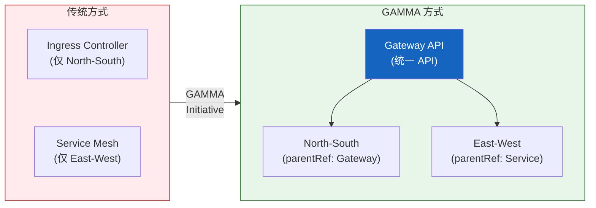

import {
  GammaInfographic,
  GammaSupportTable,
} from '@site/src/components/GatewayApiTables';

# GAMMA Initiative — 服务网格集成的未来

## 4.1 什么是 GAMMA？

**GAMMA（Gateway API for Mesh Management and Administration）**是将 Gateway API 扩展到服务网格领域的倡议。

- **GA 达成**: Gateway API v1.1.0（2025 年 10 月）
- **集成范围**: North-South（入口）+ East-West（服务网格）流量
- **核心概念**: 以往入口控制器和服务网格是完全独立的配置体系，而 GAMMA 将它们统一为单一 API
- **基于角色的配置**: Gateway API 的角色分离原则同样应用于网格流量

GAMMA 的出现使集群运维人员不再需要学习和管理两套不同的 API。现在可以用相同的 Gateway API 资源管理入口和网格。



## 4.2 核心目标与网格配置模式

<GammaInfographic />

## 4.3 GAMMA 支持现状

以下是主要服务网格实现的 GAMMA 支持状况。

<GammaSupportTable />

:::tip AWS 环境中的 GAMMA
在 AWS 环境中，可以通过 **VPC Lattice + ACK** 无 Sidecar 实现 GAMMA 模式。提供基于 IAM 的 mTLS、CloudWatch/X-Ray 可观测性、AWS FIS 故障注入等完整的托管服务网格功能。
:::

## 4.4 GAMMA 的优势

### 1. 缩短学习曲线

团队只需学习一个 API（Gateway API）即可管理入口和网格。

### 2. 配置一致性

使用相同的 YAML 结构和模式管理 North-South/East-West 流量。

```yaml
# 入口 (North-South)
spec:
  parentRefs:
    - kind: Gateway
      name: external-gateway

# 网格 (East-West)
spec:
  parentRefs:
    - kind: Service
      name: backend-service
```

### 3. 基于角色的分离

基础设施团队管理 Gateway、开发团队管理 HTTPRoute 的明确职责分离同样适用于网格流量。

### 4. 厂商中立性

可以用相同的 API 管理多种网格实现，防止厂商锁定。
