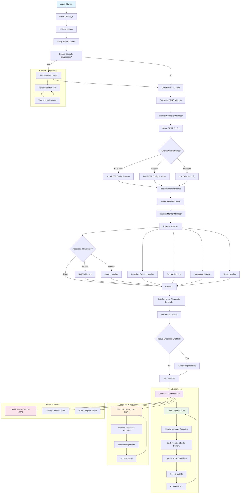

# EKS Node Monitoring Agent

> 📅 **创建**: 2025-08-26 | **更新**: 2026-06-19 | ⏱️ **阅读时间**: 约 9 分钟


## 概述

EKS Node Monitoring Agent（NMA）是 AWS 提供的节点健康监控工具。它自动检测并报告 EKS 集群节点上发生的硬件与系统级问题。该服务于 2024 年正式发布（GA），与节点自动修复（Node Auto Repair）功能配合，提升集群稳定性。

### 所解决的问题

传统 EKS 集群运维面临以下问题：

- 硬件故障的早期检测不足
- 系统级问题需要人工监控
- 对节点状态变化的响应滞后
- 问题检测与自动修复缺乏整合

NMA 正是为解决这些问题而设计。

### 主要特性

- **基于日志的问题检测**：实时分析系统日志并进行模式匹配
- **自动事件生成**：检测到问题时自动创建 Kubernetes Events 和 Node Conditions
- **CloudWatch 集成**：将检测到的问题发送至 CloudWatch 进行集中式监控
- **EKS Add-on 支持**：简化安装与管理

:::warning 重要

NMA 是自动检测节点健康问题的实用工具，但单独使用无法构成完整的监控方案。需要在充分考虑下述限制的前提下设定合理预期，并配合补充工具使用。

:::

:::tip 核心建议

**✅ 推荐用法**

- 将 NMA 作为节点状态检测层
- 配合 Container Insights 或 Prometheus 补充指标采集
- 与 Node Auto Repair 配合以实现自动修复
- 按各环境特性调整阈值

**❌ 应避免的用法**

- 仅依赖 NMA 进行全部监控
- 期望其应对突发硬件故障

:::

## 1. 设计目标

### 1.1 全面的节点健康监控

NMA 监控 EKS 节点上的多种系统组件：

- **Container Runtime**：检查 Docker/containerd 状态
- **Storage System**：监控磁盘空间与 I/O 性能
- **Networking**：验证网络连通性与配置
- **Kernel**：检查内核模块与系统状态
- **Accelerated Hardware**：GPU（NVIDIA）与 Neuron 芯片状态（检测到相应硬件时）

### 1.2 Kubernetes 原生集成

NMA 使用 controller-runtime 与 Kubernetes 紧密集成：

```go
mgr, err := controllerruntime.NewManager(controllerruntime.GetConfigOrDie(), controllerruntime.Options{
    Logger:                 log.FromContext(ctx),
    Scheme:                 scheme.Scheme,
    HealthProbeBindAddress: controllerHealthProbeAddress,
    BaseContext:            func() context.Context { return ctx },
    Metrics:                server.Options{BindAddress: controllerMetricsAddress},
})
```

### 1.3 支持多种 EKS 环境

如 REST 配置逻辑所示，NMA 支持多种 EKS 环境：

- **EKS Auto**：使用特殊的用户 impersonation 流程
- **Legacy RBAC**：支持传统权限模型
- **Standard**：标准的基于 Pod 的认证

## 2. 架构与工作原理

### 2.1 Agent 启动与初始化流程

下图展示 NMA 的启动过程及监控循环的整体流程。



### 2.2 监控器注册与管理

NMA 通过监控器配置管理各子系统。下面展示监控器注册的结构。

```go
var monitorConfigs = []monitorConfig{
    {
        Monitor:       &runtime.RuntimeMonitor{},
        ConditionType: rules.ContainerRuntimeReady,
    },
    {
        Monitor:       storage.NewStorageMonitor(),
        ConditionType: rules.StorageReady,
    },
    // ... 其他监控器
}
```

每个监控器都与相应的 Node Condition 关联并上报状态。

### 2.3 基于 Node Condition 的状态上报

NMA 利用 Kubernetes 的 Node Condition 机制上报各子系统状态：

- `ContainerRuntimeReady`：容器运行时状态
- `StorageReady`：存储子系统状态
- `NetworkingReady`：网络状态
- `KernelReady`：内核状态
- `AcceleratedHardwareReady`：GPU/Neuron 硬件状态（视情况）

### 2.4 实时诊断功能

通过 NodeDiagnostic CRD 按需执行诊断：

```go
diagnosticController := controllers.NewNodeDiagnosticController(mgr.GetClient(), hostname, runtimeContext)
```

借此运维人员可在特定节点上实时执行诊断命令。

### 2.5 可观测性（Observability）

NMA 通过多种端点提供可观测性：

- **Health Probe** (`:8081`)：Kubernetes 健康检查
- **Metrics** (`:8080`)：暴露 Prometheus 指标
- **PProf** (`:8082`)：Go 性能分析（可选）

### 2.6 控制台诊断日志

启用 `-console-diagnostics` 标志时，会定期将系统信息写入 `/dev/console`：

```go
if enableConsoleDiagnostics {
    startConsoleDiagnostics(ctx)
}
```

这提供了实例级别的可见性。

### 2.7 部署与运维特性

#### 2.7.1 基于 DaemonSet 的部署

如 `agent.tpl.yaml` 所示，NMA 以 DaemonSet 方式部署，在所有工作节点上运行：

```yaml
kind: DaemonSet
apiVersion: apps/v1
metadata:
  name: eks-node-monitoring-agent
  namespace: kube-system
```

#### 2.7.2 节点选择与约束

`values.yaml` 的 affinity 设置将运行限制在特定节点类型：

- 排除 Fargate 节点
- 排除 EKS Auto 计算类型
- 排除 HyperPod 节点
- 仅支持 AMD64/ARM64 架构

#### 2.7.3 权限管理

`agent.tpl.yaml` 的 RBAC 设置遵循最小权限原则：

```yaml
rules:
  # monitoring permissions
  - apiGroups: [""]
    resources: ["events"]
    verbs: ["create", "patch"]
  # nodediagnostic permissions
  - apiGroups: ["eks.amazonaws.com"]
    resources: ["nodediagnostics"]
    verbs: ["get", "watch", "list"]
```

#### 2.7.4 资源效率

`values.yaml` 中定义的资源限制使运行保持轻量：

```yaml
resources:
  requests:
    cpu: 10m
    memory: 30Mi
  limits:
    cpu: 250m
    memory: 100Mi
```

### 2.8 可检测的问题类型

NMA 检测的节点健康问题按**严重程度（Severity）**分为两类。该区分决定了 Node Auto Repair 是否执行操作，必须准确理解。

- **Condition**：需要节点 Replace 或 Reboot 的终止性问题。启用 Auto Repair 时会执行修复操作。
- **Event**：临时或非关键问题，或次优的节点配置。**不会触发 Auto Repair 操作**，仅记录用于排查/告警。

每个监控条件类型（`ContainerRuntimeReady`、`KernelReady`、`NetworkingReady`、`StorageReady`、`AcceleratedHardwareReady`）下映射了多个细分问题。即使同一条件类型，各细分问题的严重程度（Condition 还是 Event）也可能不同。

#### 2.8.1 Container Runtime 问题（`ContainerRuntimeReady`）

与因 containerd 负载/故障导致节点问题的场景直接相关。

| 名称 | 严重程度 | 说明 | 修复操作 |
|------|----------|------|----------|
| `PodStuckTerminating` | **Condition** | Pod 因 CRI 错误等过度延迟终止，状态无法推进 | **Replace** |
| `ContainerRuntimeFailed` | Event | 运行时创建容器失败（反复出现时为故障信号） | None |
| `KubeletFailed` | Event | kubelet 进入 failed 状态 | None |
| `DeprecatedContainerdConfiguration` | Event | 拉取了已弃用的镜像 manifest（v2 schema 1） | None |
| `Liveness/ReadinessProbeFailures` | Event | 检测到探针失败（可能为应用代码问题或超时不足） | None |
| `[Name]RepeatedRestart` / `ServiceFailedToStart` | Event | systemd 单元频繁重启 / 启动失败 | None |

→ **关键**：只有 containerd 完全损坏、Pod 无法终止的程度（`PodStuckTerminating`）才被归为 Condition 并触发节点替换。单纯的容器创建失败（`ContainerRuntimeFailed`）仅记录为 Event，不会自动修复。

#### 2.8.2 主要的 Kernel / Networking / Storage 问题

仅列出被归为 Condition（自动修复对象）的代表项。其余多数项为 Event。

| 条件类型 | Condition 问题（Replace） | 代表性 Event 问题 |
|------|------|------|
| `KernelReady` | `ForkFailedOutOfPIDs`（PID/内存耗尽） | `SoftLockup`、`KernelBug`、`ApproachingKernelPidMax`、`ConntrackExceededKernel` |
| `NetworkingReady` | `IPAMDNotRunning`、`IPAMDNotReady`、`InterfaceNotUp/Running`、`MissingLoopbackInterface` | `ConntrackExceeded`、`BandwidthIn/OutExceeded`、`PPSExceeded`、`NetworkSysctl` |
| `StorageReady` | （该表中项目均为 Event） | `EBSVolumeIOPS/ThroughputExceeded`、`IODelays`、`KubeletDiskUsageSlow` |

:::warning DiskPressure / MemoryPressure / PIDPressure 不属于自动修复对象

`DiskPressure`、`MemoryPressure`、`PIDPressure` 为标准 Kubernetes 条件，**Node Auto Repair 有意不响应**。这些更可能反映应用行为、工作负载配置或资源限制问题，而非节点级故障，因此难以定义合适的默认修复操作。此时交由 Kubernetes 的 [node-pressure eviction](https://kubernetes.io/docs/concepts/scheduling-eviction/node-pressure-eviction/) 行为处理。

→ 若 containerd 负载**以内存/磁盘压力或 PID 耗尽形式表现，节点不会被自动替换**。只有当负载被捕获为运行时自身故障（如 `PodStuckTerminating` 这类 Condition）时，Auto Repair 才会执行。

:::

#### 2.8.3 Accelerated Hardware 问题（`AcceleratedHardwareReady`）

检测 NVIDIA GPU 与 AWS Neuron 加速器健康。对于 NVIDIA XID 错误，仅 well-known 代码被归为 Condition（`NvidiaXID[Code]Error`）并触发修复；未登记的代码仅记录为 Event（`NvidiaXID[Code]Warning`）。各 XID 代码的修复操作（Reboot/Replace）请参阅 AWS 官方文档。

| 代表性问题 | 严重程度 | 修复操作 |
|------|------|------|
| `NvidiaXID[Code]Error`（well-known） | Condition | Replace 或 Reboot（因代码而异） |
| `NvidiaNVLinkError`、`NvidiaDoubleBitError` | Condition | Replace |
| `NeuronDMAError`、`NeuronHBMUncorrectableError` | Condition | Replace |
| `DCGMError`、`DCGMDiagnosticFailure` | Condition | None |
| `NvidiaThermalError`、`NvidiaPowerError`、`NvidiaPageRetirement` | Event | None |

## 3. Node Auto Repair 联动

NMA 单独使用仅提供可见性（暴露 NodeCondition 与事件）。只有与 Node Auto Repair 配合使用，才会对检测到的 Condition 执行自动替换/重启。

### 3.1 有无 NMA 时 Auto Repair 的响应对象

| 配置 | Auto Repair 响应的对象 |
|------|------|
| 仅 Auto Repair（无 NMA） | kubelet 的 `Ready` 条件、手动删除的 node object、加入集群失败的托管节点组实例 |
| Auto Repair + NMA | 在上述基础上**额外**响应 `AcceleratedHardwareReady`、`ContainerRuntimeReady`、`KernelReady`、`NetworkingReady`、`StorageReady` |

### 3.2 各 Condition 的修复等待时间与操作

为默认行为，对 EKS Auto Mode、托管节点组、Karpenter 通用适用。`Reboot` 仅托管节点组支持；Auto Mode 与 Karpenter 均以 `Replace` 执行。

| Condition | 修复等待时间 | 操作 |
|------|------|------|
| `AcceleratedHardwareReady` | 10 分钟 | Replace 或 Reboot |
| `ContainerRuntimeReady` | 30 分钟 | Replace |
| `KernelReady` | 30 分钟 | Replace |
| `NetworkingReady` | 30 分钟 | Replace |
| `StorageReady` | 30 分钟 | Replace |
| `Ready` | 30 分钟 | Replace |
| `DiskPressure` / `MemoryPressure` | 不适用 | None |

### 3.3 防止失控的安全护栏

为防止大规模故障时节点连锁替换，默认在以下情况停止新的修复操作（进行中的修复继续）。

- **托管节点组**：节点数超过 5 且组内超过 20% 的节点不健康时，或发生 ARC（Application Recovery Controller）zonal shift 时
- **Auto Mode / Karpenter**：NodePool 中超过 20% 的节点不健康时（独立 NodeClaim 为集群的 20%）

### 3.4 启用方式

- **EKS Auto Mode**：始终启用（不可配置）
- **Karpenter**：设置 feature gate `NodeRepair=true`
- **托管节点组**：控制台 "Enable node auto repair" 复选框 / CLI `--node-repair-config enabled=true` / eksctl `nodeRepairConfig.enabled: true`

托管节点组可通过 `maxUnhealthyNodeThresholdCount/Percentage`、`maxParallelNodesRepairedCount/Percentage` 以及按条件/原因的 `nodeRepairConfigOverrides`（例如对特定 NVIDIA XID 错误立即 Replace，其他代码 NoAction）来自定义详细行为。

## 4. 各部署方式的差异

### 4.1 Manual Mode（DaemonSet）

**优点：**

- 灵活的版本管理
- 基于 ConfigMap 的配置变更
- 可自定义配置

**缺点：**

- 对 kubelet 依赖高
- 节点引导时存在延迟
- 受 kubelet 故障影响

### 4.2 EKS Auto Mode

**优点：**

- 直接内置于 AMI
- 独立于 kubelet 运行
- 更高可用性
- 更快的问题检测

**缺点：**

- 更新时需替换 AMI
- 自定义受限

## 5. 技术限制

### 5.1 指标采集限制

- **NMA 并非指标采集工具**：无法采集性能指标（CPU、内存使用率等）
- **日志解析方式**：不使用 cAdvisor，纯粹基于日志分析
- **Prometheus 端点**：仅暴露有限的健康状态指标（端口 8080）

### 5.2 使用替代后端时的约束

:::warning 使用 CloudWatch 以外的后端时

- 无原生 ADOT 集成
- Prometheus 指标覆盖非常有限
- 无配置变更选项
- 官方文档与支持有限

:::

### 5.3 硬件故障检测限制

**可检测：**

- ✅ 渐进式性能下降
- ✅ I/O 错误增加
- ✅ 内存 ECC 错误

**不可检测：**

- ❌ 突发断电
- ❌ 瞬时硬件故障
- ❌ 网络完全中断

## 6. 推荐实施策略

### 6.1 多层监控架构

```
集成监控栈：
├── L1：状态检测（NMA）
│   └── 节点问题的早期检测
├── L2：指标采集（Container Insights/Prometheus）
│   └── 详细性能数据
├── L3：自动响应（Node Auto Repair）
│   └── 自动替换问题节点
└── L4：统一仪表盘（CloudWatch/Grafana）
    └── 综合监控视图
```

### 6.2 使用 Prometheus 时的推荐配置

将 NMA 与 Node Exporter 配合使用时，推荐如下配置。

```yaml
apiVersion: v1
kind: Service
metadata:
  name: monitoring-stack
spec:
  components:
    - name: nma
      purpose: "node state events"
      port: 8080
    - name: node-exporter
      purpose: "detailed system metrics"
      port: 9100
    - name: kube-state-metrics
      purpose: "cluster state metrics"
      port: 8080
```

## 7. 成本与性能考量

### 7.1 资源占用

NMA 是非常轻量的组件。基于 EKS 插件 / Helm chart 默认值，资源 requests 与 limits 如下。

| 资源 | requests | limits |
|------|----------|--------|
| CPU | 10m | 250m |
| Memory | 30Mi | 100Mi |

在 NVIDIA GPU 实例上还会额外启动 DCGM 服务组件（`nv-hostengine`），可通过 `dcgmAgent.resources.*` 单独调整。资源 requests/limits 可通过插件配置值（`monitoringAgent.resources.*`）按环境调整。

### 7.2 CloudWatch 成本

| 项目 | 成本 |
|------|------|
| 自定义指标 | $0.30/metric/month |
| 事件 | $1.00/million events |
| 日志 | $0.50/GB ingested |

## 8. 最佳实践

### 8.1 生产部署

1. **分阶段发布**：Dev → Staging → Production
2. **告警阈值调整**：考虑各环境特性
3. **谨慎启用自动修复**：初期仅监控
4. **定期测试**：每月进行故障模拟

### 8.2 与其他工具的集成

| 组合 | 说明 |
|------|------|
| NMA + Container Insights | 完全 AWS 原生的可见性 |
| NMA + Prometheus + Grafana | 基于开源的监控栈 |
| NMA + Datadog/New Relic | 企业级监控方案 |

## 参考资料

### 官方文档
- [Detect node health issues and enable automatic node repair](https://docs.aws.amazon.com/eks/latest/userguide/node-health.html) — NMA/Auto Repair 概述及 NodeCondition 列表
- [Detect node health issues with the EKS node monitoring agent](https://docs.aws.amazon.com/eks/latest/userguide/node-health-nma.html) — 检测问题的完整表（Condition/Event）、XID 代码、插件配置值
- [Automatically repair nodes in EKS clusters](https://docs.aws.amazon.com/eks/latest/userguide/node-repair.html) — 各条件的修复操作/超时、安全护栏、自定义
- [aws/eks-node-monitoring-agent](https://github.com/aws/eks-node-monitoring-agent) — NMA 源代码及 Helm chart

### 技术博客
- [Amazon EKS introduces node monitoring and auto repair capabilities](https://aws.amazon.com/blogs/containers/amazon-eks-introduces-node-monitoring-and-auto-repair-capabilities/) — 发布公告与架构说明

### 相关文档（内部）
- [EKS 故障诊断与响应](./eks-debugging/index.md) — 节点/工作负载问题的系统化诊断
- [Pod 健康检查与生命周期](./eks-pod-health-lifecycle.md) — 探针配置与 Graceful Shutdown
- [AWS Nitro 架构与性能调优](../networking-performance/nitro-architecture-performance-tuning.md) — 节点硬件层的各代特性与内核调优
