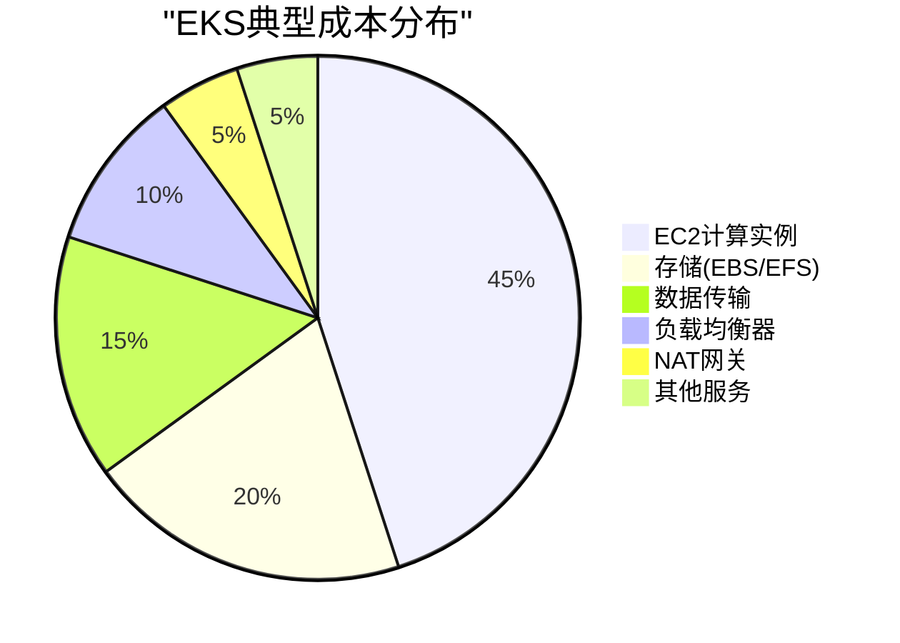

# AWS EKS成本管理

掌握AWS EKS环境中成本优化的综合策略和工具。

## 成本分析基础

### 成本分解



### 成本可见性工具

#### 1. AWS Cost Explorer

```python
import boto3
import json
from datetime import datetime, timedelta

def analyze_eks_costs(cluster_name):
    ce = boto3.client('ce')

    end_date = datetime.now().date()
    start_date = end_date - timedelta(days=30)

    response = ce.get_cost_and_usage(
        TimePeriod={
            'Start': start_date.strftime('%Y-%m-%d'),
            'End': end_date.strftime('%Y-%m-%d')
        },
        Granularity='DAILY',
        Metrics=['UnblendedCost'],
        Filter={
            'Tags': {
                'Key': 'kubernetes.io/cluster/' + cluster_name,
                'Values': ['owned']
            }
        },
        GroupBy=[
            {'Type': 'DIMENSION', 'Key': 'SERVICE'},
            {'Type': 'DIMENSION', 'Key': 'USAGE_TYPE'}
        ]
    )

    return response['ResultsByTime']
```

#### 2. Kubecost集成

```yaml
apiVersion: v1
kind: Namespace
metadata:
  name: kubecost
---
apiVersion: helm.toolkit.fluxcd.io/v2beta1
kind: HelmRelease
metadata:
  name: kubecost
  namespace: kubecost
spec:
  interval: 5m
  chart:
    spec:
      chart: cost-analyzer
      version: "1.106.0"
      sourceRef:
        kind: HelmRepository
        name: kubecost
        namespace: flux-system
  values:
    global:
      prometheus:
        enabled: false
        fqdn: http://prometheus-server.monitoring.svc.cluster.local

    kubecostProductConfigs:
      clusterName: "production-eks"
      currencyCode: "USD"

    # Spot实例集成
    spotDataFeeds:
      enabled: true
      awsSpotDataBucket: "s3://my-spot-data-bucket"
      awsSpotDataRegion: "us-west-2"
```

## 优化策略

### 1. Spot实例策略

#### Karpenter Spot配置

```yaml
apiVersion: karpenter.sh/v1beta1
kind: NodePool
metadata:
  name: spot-optimized
spec:
  template:
    spec:
      requirements:
        - key: karpenter.sh/capacity-type
          operator: In
          values: ["spot"]
        - key: kubernetes.io/arch
          operator: In
          values: ["amd64"]
        - key: node.kubernetes.io/instance-type
          operator: In
          values:
            # 多样化实例类型以提高可用性
            - m5.large
            - m5a.large
            - m5n.large
            - m6i.large
            - m6a.large

      # Spot中断处理
      userData: |
        #!/bin/bash
        /etc/eks/bootstrap.sh ${CLUSTER_NAME}

        # Spot中断处理器
        curl -o /usr/local/bin/spot-interrupt-handler \
          https://github.com/aws/aws-node-termination-handler/releases/download/v1.19.0/aws-node-termination-handler
        chmod +x /usr/local/bin/spot-interrupt-handler
        /usr/local/bin/spot-interrupt-handler &

  # 中断处理设置
  disruption:
    consolidationPolicy: WhenUnderutilized
    expireAfter: 30s

  # 成本优化限制
  limits:
    cpu: "1000"
    memory: "4000Gi"
```

#### Spot分配策略

```yaml
apiVersion: v1
kind: ConfigMap
metadata:
  name: spot-strategy
data:
  strategy.yaml: |
    allocation_strategy:
      type: "capacity-optimized-prioritized"
      priorities:
        - instance_type: m5.large
          weight: 100
        - instance_type: m5a.large
          weight: 90
        - instance_type: m6i.large
          weight: 80

    interruption_handling:
      rebalance_recommendations: true
      termination_grace_period: 120

    cost_optimization:
      max_price_percentage: 80  # 最高支付按需价格的80%
      fallback_to_on_demand: true
```

### 2. 预留实例(RI)和Savings Plans

#### 使用模式分析

```python
def analyze_ri_recommendations(cluster_name):
    ce = boto3.client('ce')

    response = ce.get_reservation_purchase_recommendation(
        Service='Amazon Elastic Compute Cloud',
        AccountScope='PAYER',
        LookbackPeriodInDays='SIXTY_DAYS',
        TermInYears='ONE_YEAR',
        PaymentOption='PARTIAL_UPFRONT',
        ServiceSpecification={
            'EC2Specification': {
                'OfferingClass': 'STANDARD'
            }
        }
    )

    recommendations = []
    for rec in response['Recommendations']:
        savings = float(rec['EstimatedMonthlySavingsAmount'])
        if savings > 100:  # 只关注每月节省超过$100的建议
            recommendations.append({
                'instance_type': rec['InstanceDetails']['InstanceType'],
                'monthly_savings': savings,
                'upfront_cost': rec['UpfrontCost'],
                'roi_months': float(rec['UpfrontCost']) / savings
            })

    return sorted(recommendations, key=lambda x: x['monthly_savings'], reverse=True)
```

### 3. 资源合理配置

#### VPA(垂直Pod自动扩缩容)配置

```yaml
apiVersion: autoscaling.k8s.io/v1
kind: VerticalPodAutoscaler
metadata:
  name: app-vpa
spec:
  targetRef:
    apiVersion: apps/v1
    kind: Deployment
    name: application

  updatePolicy:
    updateMode: "Auto"  # 或 "Off" 仅用于推荐

  resourcePolicy:
    containerPolicies:
    - containerName: app
      minAllowed:
        cpu: 100m
        memory: 128Mi
      maxAllowed:
        cpu: 2
        memory: 2Gi
      controlledResources: ["cpu", "memory"]
```

#### 资源配额和限制范围

```yaml
apiVersion: v1
kind: ResourceQuota
metadata:
  name: namespace-quota
  namespace: production
spec:
  hard:
    requests.cpu: "100"
    requests.memory: "200Gi"
    limits.cpu: "200"
    limits.memory: "400Gi"
    persistentvolumeclaims: "10"
    services.loadbalancers: "2"
---
apiVersion: v1
kind: LimitRange
metadata:
  name: namespace-limits
  namespace: production
spec:
  limits:
  - max:
      cpu: "4"
      memory: "8Gi"
    min:
      cpu: "100m"
      memory: "128Mi"
    default:
      cpu: "500m"
      memory: "1Gi"
    defaultRequest:
      cpu: "200m"
      memory: "256Mi"
    type: Container
```

### 4. 存储优化

#### EBS卷优化

```yaml
apiVersion: storage.k8s.io/v1
kind: StorageClass
metadata:
  name: gp3-optimized
provisioner: ebs.csi.aws.com
parameters:
  type: gp3
  iops: "3000"
  throughput: "125"
  encrypted: "true"
  # 启用卷快照以降低成本
  csi.storage.k8s.io/snapshotter-secret-name: ebs-snapshot-secret
  csi.storage.k8s.io/snapshotter-secret-namespace: kube-system
reclaimPolicy: Delete
allowVolumeExpansion: true
volumeBindingMode: WaitForFirstConsumer
```

#### 存储生命周期管理

```yaml
apiVersion: batch/v1
kind: CronJob
metadata:
  name: unused-pv-cleanup
spec:
  schedule: "0 2 * * *"  # 每天凌晨2点运行
  jobTemplate:
    spec:
      template:
        spec:
          containers:
          - name: cleanup
            image: bitnami/kubectl:latest
            command:
            - /bin/bash
            - -c
            - |
              # 查找未使用的PV
              for pv in $(kubectl get pv -o json | jq -r '.items[] | select(.status.phase=="Released") | .metadata.name'); do
                echo "删除未使用的PV: $pv"
                kubectl delete pv $pv
              done

              # 查找孤立的PVC
              for pvc in $(kubectl get pvc -A -o json | jq -r '.items[] | select(.status.phase=="Pending" and (now - (.metadata.creationTimestamp | fromdateiso8601)) > 86400) | "\(.metadata.namespace)/\(.metadata.name)"'); do
                echo "删除孤立的PVC: $pvc"
                kubectl delete pvc -n $(echo $pvc | cut -d/ -f1) $(echo $pvc | cut -d/ -f2)
              done
```

### 5. 网络成本优化

#### 降低数据传输成本

```yaml
apiVersion: v1
kind: Service
metadata:
  name: internal-service
  annotations:
    # 使用内部负载均衡器避免数据传输费用
    service.beta.kubernetes.io/aws-load-balancer-internal: "true"
    # 启用跨区负载均衡
    service.beta.kubernetes.io/aws-load-balancer-cross-zone-load-balancing-enabled: "false"
spec:
  type: LoadBalancer
  selector:
    app: internal-app
```

#### VPC端点优化

```terraform
resource "aws_vpc_endpoint" "s3" {
  vpc_id       = aws_vpc.main.id
  service_name = "com.amazonaws.${var.region}.s3"

  tags = {
    Name = "eks-s3-endpoint"
    Cost = "optimization"
  }
}

resource "aws_vpc_endpoint" "ecr" {
  vpc_id              = aws_vpc.main.id
  service_name        = "com.amazonaws.${var.region}.ecr.dkr"
  vpc_endpoint_type   = "Interface"
  subnet_ids          = aws_subnet.private[*].id
  security_group_ids  = [aws_security_group.vpc_endpoint.id]

  tags = {
    Name = "eks-ecr-endpoint"
    Purpose = "减少NAT网关数据传输成本"
  }
}
```

## 成本监控和告警

### CloudWatch成本告警

```yaml
apiVersion: cloudformation.amazonaws.com/v1alpha1
kind: Stack
metadata:
  name: cost-alarms
spec:
  template: |
    Resources:
      DailyCostAlarm:
        Type: AWS::CloudWatch::Alarm
        Properties:
          AlarmName: EKS-Daily-Cost-Exceeded
          MetricName: EstimatedCharges
          Namespace: AWS/Billing
          Statistic: Maximum
          Period: 86400
          EvaluationPeriods: 1
          Threshold: 500  # 每日$500
          ComparisonOperator: GreaterThanThreshold
          AlarmActions:
            - !Ref SNSTopic

      WeeklyCostAnomaly:
        Type: AWS::CE::AnomalyMonitor
        Properties:
          MonitorName: EKS-Cost-Anomaly
          MonitorType: DIMENSIONAL
          MonitorDimension: SERVICE
          MonitorSpecification:
            Tags:
              Key: kubernetes.io/cluster/production
              Values: ["owned"]
```

### 成本报告自动化

```python
import boto3
import pandas as pd
from datetime import datetime, timedelta

def generate_cost_report(cluster_name, output_file):
    ce = boto3.client('ce')

    # 获取过去30天的成本
    end_date = datetime.now().date()
    start_date = end_date - timedelta(days=30)

    response = ce.get_cost_and_usage_with_resources(
        TimePeriod={
            'Start': start_date.strftime('%Y-%m-%d'),
            'End': end_date.strftime('%Y-%m-%d')
        },
        Granularity='DAILY',
        Metrics=['UnblendedCost', 'UsageQuantity'],
        GroupBy=[
            {'Type': 'DIMENSION', 'Key': 'SERVICE'},
            {'Type': 'TAG', 'Key': 'Environment'},
            {'Type': 'TAG', 'Key': 'Team'}
        ],
        Filter={
            'Tags': {
                'Key': 'kubernetes.io/cluster/' + cluster_name,
                'Values': ['owned']
            }
        }
    )

    # 转换为DataFrame
    data = []
    for result in response['ResultsByTime']:
        date = result['TimePeriod']['Start']
        for group in result['Groups']:
            service = group['Keys'][0]
            environment = group['Keys'][1] if len(group['Keys']) > 1 else 'Unknown'
            team = group['Keys'][2] if len(group['Keys']) > 2 else 'Unknown'
            cost = float(group['Metrics']['UnblendedCost']['Amount'])

            data.append({
                'Date': date,
                'Service': service,
                'Environment': environment,
                'Team': team,
                'Cost': cost
            })

    df = pd.DataFrame(data)

    # 生成汇总报告
    summary = df.groupby(['Service', 'Environment', 'Team'])['Cost'].sum().reset_index()
    summary = summary.sort_values('Cost', ascending=False)

    # 保存报告
    with pd.ExcelWriter(output_file) as writer:
        summary.to_excel(writer, sheet_name='Summary', index=False)
        df.to_excel(writer, sheet_name='Daily Details', index=False)

    return summary

# 每周运行
if __name__ == "__main__":
    report = generate_cost_report('production-eks', 'eks_cost_report.xlsx')
    print(f"总成本: ${report['Cost'].sum():.2f}")
    print(f"Top 5成本驱动因素:\n{report.head()}")
```

## FinOps最佳实践

### 1. 标签策略

```yaml
apiVersion: v1
kind: ConfigMap
metadata:
  name: tagging-policy
data:
  required-tags.json: |
    {
      "Environment": ["dev", "staging", "production"],
      "Team": ["platform", "api", "frontend", "data"],
      "CostCenter": ["engineering", "operations", "research"],
      "Project": "<project-name>",
      "Owner": "<email>",
      "Lifecycle": ["permanent", "temporary", "poc"]
    }
```

### 2. 成本分配

```python
def allocate_costs_by_namespace():
    """基于命名空间CPU/内存使用分配成本"""

    # 获取命名空间资源使用
    v1 = client.CoreV1Api()
    metrics = client.CustomObjectsApi()

    namespace_usage = {}

    for ns in v1.list_namespace().items:
        ns_name = ns.metadata.name

        # 获取命名空间指标
        try:
            usage = metrics.get_namespaced_custom_object(
                group="metrics.k8s.io",
                version="v1beta1",
                namespace=ns_name,
                plural="pods"
            )

            total_cpu = 0
            total_memory = 0

            for pod in usage.get('items', []):
                for container in pod.get('containers', []):
                    cpu = container['usage'].get('cpu', '0')
                    memory = container['usage'].get('memory', '0')

                    # 转换为标准单位
                    total_cpu += parse_cpu(cpu)
                    total_memory += parse_memory(memory)

            namespace_usage[ns_name] = {
                'cpu_cores': total_cpu,
                'memory_gb': total_memory / (1024**3)
            }
        except:
            continue

    # 计算成本分配
    total_cost = get_cluster_cost()  # 从AWS获取总成本
    total_cpu = sum(u['cpu_cores'] for u in namespace_usage.values())
    total_memory = sum(u['memory_gb'] for u in namespace_usage.values())

    allocations = {}
    for ns, usage in namespace_usage.items():
        cpu_ratio = usage['cpu_cores'] / total_cpu if total_cpu > 0 else 0
        memory_ratio = usage['memory_gb'] / total_memory if total_memory > 0 else 0

        # 50/50权重分配
        cost_ratio = (cpu_ratio + memory_ratio) / 2
        allocations[ns] = {
            'cost': total_cost * cost_ratio,
            'percentage': cost_ratio * 100,
            'cpu_cores': usage['cpu_cores'],
            'memory_gb': usage['memory_gb']
        }

    return allocations
```

## 成本优化检查清单

- [ ] **计算优化**
  - [ ] 使用Spot实例(节省高达90%)
  - [ ] 实施Karpenter自动扩缩容
  - [ ] 配置VPA进行合理配置
  - [ ] 购买预留实例或Savings Plans

- [ ] **存储优化**
  - [ ] 使用GP3替代GP2(节省20%)
  - [ ] 实施存储生命周期策略
  - [ ] 清理未使用的PV/PVC
  - [ ] 使用EFS用于共享存储

- [ ] **网络优化**
  - [ ] 配置VPC端点
  - [ ] 优化跨区数据传输
  - [ ] 使用内部负载均衡器
  - [ ] 实施服务网格减少东西向流量

- [ ] **监控和治理**
  - [ ] 部署Kubecost或OpenCost
  - [ ] 设置成本告警
  - [ ] 实施标签策略
  - [ ] 定期审查成本报告

## 预期成果

通过实施这些策略，组织通常可以实现：

| 优化领域 | 预期节省 | 实施复杂度 |
|---------|---------|------------|
| Spot实例 | 50-90% | 中等 |
| 预留实例 | 30-50% | 低 |
| 资源合理配置 | 20-40% | 中等 |
| 存储优化 | 15-30% | 低 |
| 网络优化 | 10-25% | 高 |

**总体目标：降低40-60%的EKS运营成本，同时保持或提高性能和可靠性。**