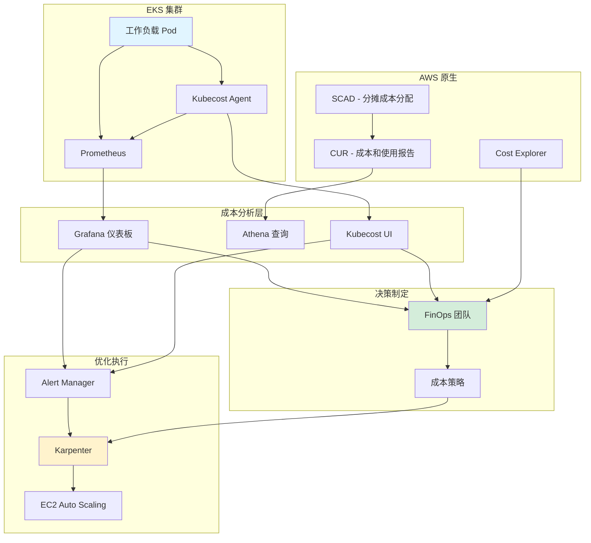
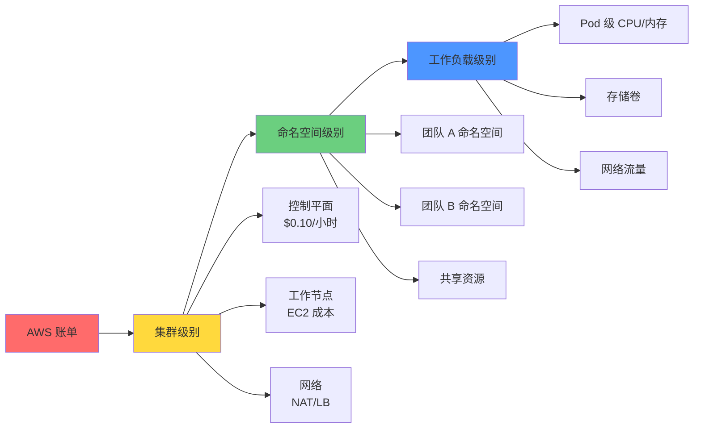

# 大规模 EKS 环境成本管理指南

> **📌 更新**：2025-02-09 - 反映 Karpenter v1.6 GA 和 EKS Auto Mode 成本分析

> 📅 **创建日期**：2025-02-05 | **修改日期**：2026-02-14 | ⏱️ **阅读时间**：约 11 分钟

## 概述

Amazon EKS 环境的成本管理是云运营中最重要的挑战之一。截至 2024 年，AWS 客户的总支出预计将超过 1000 亿美元，而平均有 30-35% 的云成本被浪费。特别是在 Kubernetes 环境中，68% 的组织经历了成本超支。

本指南涵盖了在 EKS 环境中实现 30-90% 成本节省的实战策略。从 FinOps 原则到使用 Karpenter 的高级优化，再到实际企业的成功案例，内容全面详尽。

:::tip EKS Auto Mode 成本考虑因素
2025 年 GA 的 EKS Auto Mode 内置 Karpenter，提供自动成本优化：

- **额外成本**：EKS Auto Mode 节点需支付 EC2 价格约 10% 的溢价
- **节省效果**：通过自动 Spot 优化、装箱和节点整合降低运营成本
- **对比分析**：需要评估相对于自管理集群的总拥有成本（TCO）
- **适用场景**：希望在没有专职 FinOps 工程师的情况下实现成本优化的团队
:::

### 核心内容

- **FinOps 基础**：Kubernetes 环境专用的成本管理原则和成熟度模型
- **成本结构分析**：EKS 成本的 3 层模型和浪费因素识别
- **工具使用**：SCAD、Kubecost、OpenCost 等成本管理工具对比
- **Karpenter 优化**：通过下一代自动扩缩容实现 25-40% 成本节省
- **实战案例**：实现 70% 以上成本节省的企业策略

### 学习目标

完成本指南后，您将能够：

- 准确理解和分析 EKS 环境的成本结构
- 评估组织的 FinOps 成熟度并制定改进路线图
- 选择和实施适当的成本管理工具
- 使用 Karpenter 和 Spot 实例进行成本优化
- 在 30 天内实现 10-20% 成本节省

## 前置要求

### 所需工具

| 工具 | 版本 | 用途 |
|------|------|------|
| kubectl | 1.28+ | Kubernetes 集群管理 |
| helm | 3.12+ | 成本管理工具安装 |
| aws-cli | 2.13+ | AWS 资源管理 |
| eksctl | 0.150+ | EKS 集群配置 |

### 所需权限

```json
{
  "Version": "2012-10-17",
  "Statement": [
    {
      "Effect": "Allow",
      "Action": [
        "ce:GetCostAndUsage",
        "ce:GetCostForecast",
        "eks:DescribeCluster",
        "ec2:DescribeInstances",
        "ec2:DescribeSpotPriceHistory",
        "cloudwatch:GetMetricStatistics"
      ],
      "Resource": "*"
    }
  ]
}
```

### 前置知识

- Kubernetes 基本概念（Pod、Deployment、Service）
- AWS EKS 架构理解
- 容器资源管理（requests、limits）
- 基本云成本结构

## 架构

### EKS 成本监控系统结构



### 3 层成本分配模型



## 实施

### 第 1 步：FinOps 成熟度评估

第一步是评估组织当前的 FinOps 成熟度。

#### 成熟度模型

| 阶段 | 特征 | 成本分配准确度 | 自动化水平 |
|------|------|----------------|------------|
| **Crawl（爬行）** | 手动流程，基本可见性 | 低于 50% | 几乎没有 |
| **Walk（行走）** | 自动跟踪，主动优化 | 70-90% | 部分自动化 |
| **Run（奔跑）** | 完全自动化，业务对齐 | 90% 以上 | 完全自动化 |

#### 自评检查清单

**Crawl 阶段（基础）**

- [ ] 通过 AWS Cost Explorer 检查月度成本
- [ ] 能够按 EKS 集群区分成本
- [ ] 能够识别主要成本增长原因

**Walk 阶段（成长）**

- [ ] 按命名空间/团队分配成本
- [ ] 设置自动成本告警
- [ ] 进行周度成本审查会议
- [ ] 运行资源合理配置策略

**Run 阶段（成熟）**

- [ ] 运营实时成本仪表板
- [ ] Pod 级别成本跟踪
- [ ] 自动化优化工作流
- [ ] 将成本与业务指标关联

### 第 2 步：理解 EKS 成本结构

#### 成本组成部分

**1. 控制平面成本**

```
成本：$0.10/小时 = $72/月（每个集群）
特征：固定成本，无法优化
建议：通过集群整合减少数量
```

**2. 工作节点成本（占比最大）**

| 定价模型 | 成本 | 节省率 | 中断风险 |
|----------|------|--------|----------|
| 按需 | 基准价 | 0% | 无 |
| Savings Plans | -28~-72% | 最高 72% | 无 |
| 预留实例 | -40~-75% | 最高 75% | 无 |
| Spot 实例 | -50~-90% | 最高 90% | 有（2 分钟警告） |

**3. 隐藏成本因素**

```yaml
# 容易忽略的成本项目
hidden_costs:
  load_balancers:
    - classic_lb: "$18/月（基础）+ 数据传输"
    - alb: "$22.50/月（基础）+ LCU 成本"
    - nlb: "$20/月（基础）+ NLCU 成本"

  nat_gateways:
    cost: "$32.40/月/可用区 + $0.045/GB 处理"
    optimization: "使用 NAT 实例或 VPC 端点"

  data_transfer:
    - inter_az: "$0.01/GB（可用区间）"
    - inter_region: "$0.02/GB（区域间）"
    - internet_egress: "$0.09/GB（前 10TB）"

  ebs_volumes:
    - gp3: "$0.08/GB/月"
    - unused_volumes: "平均 20-30% 未使用"
```

#### 成本浪费模式识别

**过度配置（平均浪费 30%）**

```bash
# 检查命名空间资源效率
kubectl get pods -A -o json | jq -r '
  .items[] |
  select(.status.phase=="Running") |
  {
    namespace: .metadata.namespace,
    pod: .metadata.name,
    containers: [
      .spec.containers[] | {
        name: .name,
        cpu_request: .resources.requests.cpu,
        mem_request: .resources.requests.memory
      }
    ]
  }
' | jq -s 'group_by(.namespace) |
  map({
    namespace: .[0].namespace,
    total_pods: length
  })'
```

**闲置资源（夜间/周末）**

```python
# 使用率分析脚本示例
import boto3
from datetime import datetime, timedelta

cloudwatch = boto3.client('cloudwatch')

def analyze_idle_resources(cluster_name, hours=168):  # 1 周
    metrics = cloudwatch.get_metric_statistics(
        Namespace='ContainerInsights',
        MetricName='node_cpu_utilization',
        Dimensions=[{'Name': 'ClusterName', 'Value': cluster_name}],
        StartTime=datetime.now() - timedelta(hours=hours),
        EndTime=datetime.now(),
        Period=3600,
        Statistics=['Average']
    )

    idle_hours = sum(1 for m in metrics['Datapoints'] if m['Average'] < 10)
    idle_percentage = (idle_hours / hours) * 100

    return {
        'idle_hours': idle_hours,
        'idle_percentage': idle_percentage,
        'potential_savings': f"{idle_percentage}% of node costs"
    }
```

**区域成本差异（最高 40%）**

| 区域 | t3.xlarge 按需 | 节省机会 |
|------|---------------|----------|
| us-east-1（弗吉尼亚） | $0.1664/小时 | 基准 |
| ap-northeast-2（首尔） | $0.2016/小时 | +21% |
| eu-west-1（爱尔兰） | $0.1856/小时 | +12% |

### 第 3 步：实施成本管理工具

#### AWS Split Cost Allocation Data（SCAD）

**优点**：AWS 原生，无额外成本，Pod 级别可见性

**启用方法**

```bash
# 1. 启用成本和使用报告
aws cur put-report-definition \
  --report-definition file://cur-definition.json

# cur-definition.json
cat > cur-definition.json << 'EOF'
{
  "ReportName": "eks-cost-report",
  "TimeUnit": "HOURLY",
  "Format": "Parquet",
  "Compression": "Parquet",
  "AdditionalSchemaElements": ["RESOURCES", "SPLIT_COST_ALLOCATION_DATA"],
  "S3Bucket": "your-cur-bucket",
  "S3Prefix": "cur-reports",
  "S3Region": "us-east-1",
  "AdditionalArtifacts": ["ATHENA"],
  "RefreshClosedReports": true,
  "ReportVersioning": "OVERWRITE_REPORT"
}
EOF

# 2. 在 EKS 集群上启用 SCAD
aws eks update-cluster-config \
  --name your-cluster \
  --resources-vpc-config splitCostAllocationEnabled=true
```

**Athena 查询示例**

```sql
-- 按命名空间的每日成本
SELECT
    line_item_usage_start_date,
    split_line_item_split_cost_kubernetes_namespace as namespace,
    SUM(line_item_unblended_cost) as daily_cost
FROM eks_cost_report
WHERE split_line_item_split_cost_kubernetes_namespace IS NOT NULL
GROUP BY 1, 2
ORDER BY 1 DESC, 3 DESC
LIMIT 100;

-- 按 Pod 的最高成本
SELECT
    split_line_item_split_cost_kubernetes_pod as pod_name,
    split_line_item_split_cost_kubernetes_namespace as namespace,
    SUM(line_item_unblended_cost) as total_cost,
    AVG(line_item_unblended_cost) as avg_hourly_cost
FROM eks_cost_report
WHERE line_item_usage_start_date >= DATE_ADD('day', -7, CURRENT_DATE)
GROUP BY 1, 2
ORDER BY 3 DESC
LIMIT 20;
```

**限制**

- 24-48 小时数据延迟
- 仅在 CUR 中可见（Cost Explorer 不支持）
- 无法重新处理历史数据

#### Kubecost 实施

**优点**：实时可见性，15 天免费保留，优化建议

**安装（Helm）**

```bash
# 1. 添加 Helm 仓库
helm repo add kubecost https://kubecost.github.io/cost-analyzer/
helm repo update

# 2. 创建生产 values.yaml
cat > kubecost-values.yaml << 'EOF'
global:
  prometheus:
    enabled: true
    fqdn: http://prometheus-server.monitoring.svc.cluster.local

kubecostProductConfigs:
  clusterName: "production-eks"
  awsSpotDataRegion: "ap-northeast-2"
  awsSpotDataBucket: "your-spot-data-bucket"

  # AWS 集成
  athenaProjectID: "your-project-id"
  athenaBucketName: "your-athena-results"
  athenaRegion: "ap-northeast-2"
  athenaDatabase: "athenacurcfn_eks_cost_report"
  athenaTable: "eks_cost_report"

# 资源分配
kubecostModel:
  resources:
    requests:
      cpu: "500m"
      memory: "512Mi"
    limits:
      cpu: "1000m"
      memory: "1Gi"

# Ingress 设置（可选）
ingress:
  enabled: true
  annotations:
    kubernetes.io/ingress.class: alb
    alb.ingress.kubernetes.io/scheme: internal
    alb.ingress.kubernetes.io/target-type: ip
  hosts:
    - kubecost.your-domain.com
EOF

# 3. 安装
helm install kubecost kubecost/cost-analyzer \
  --namespace kubecost \
  --create-namespace \
  -f kubecost-values.yaml

# 4. 验证安装
kubectl get pods -n kubecost
kubectl port-forward -n kubecost svc/kubecost-cost-analyzer 9090:9090
```

**主要功能使用**

```bash
# 按命名空间的成本 API 调用
curl "http://localhost:9090/model/allocation/compute?window=7d&aggregate=namespace"

# 成本告警设置
cat > kubecost-alert.yaml << 'EOF'
apiVersion: v1
kind: ConfigMap
metadata:
  name: alert-configs
  namespace: kubecost
data:
  alerts.json: |
    [
      {
        "type": "budget",
        "threshold": 1000,
        "window": "daily",
        "aggregation": "namespace",
        "filter": "namespace:production",
        "ownerContact": ["team-platform@company.com"]
      },
      {
        "type": "efficiency",
        "threshold": 0.5,
        "window": "7d",
        "aggregation": "deployment",
        "ownerContact": ["team-devops@company.com"]
      }
    ]
EOF

kubectl apply -f kubecost-alert.yaml
```

#### 工具选择指南

| 工具 | 最佳使用场景 | 成本 | 实施复杂度 |
|------|-------------|------|-----------|
| **SCAD** | AWS 原生优选，长期分析 | 免费 | 低 |
| **Kubecost（免费）** | 中小规模，需要实时 | 免费 | 中等 |
| **Kubecost（企业版）** | 大规模，高级功能 | $~/月 | 中等 |
| **OpenCost** | 开源优选，自定义 | 免费 | 高 |
| **CloudHealth** | 多云治理 | $$$$ | 高 |
| **CAST AI** | 完全自动化优选 | % 节省额 | 低 |

**决策树**

```
组织规模？
├─ 小型（< 5 个集群）
│  └─ 预算？
│     ├─ 有限 → SCAD + Cost Explorer
│     └─ 充裕 → Kubecost 免费版
│
├─ 中型（5-20 个集群）
│  └─ 需要实时？
│     ├─ 是 → Kubecost 企业版
│     └─ 否 → SCAD + Athena + Grafana
│
└─ 大型（20+ 个集群）
   └─ 多云？
      ├─ 是 → CloudHealth / CloudCheckr
      └─ 否 → Kubecost 企业版 + SCAD
```

### 第 4 步：使用 Karpenter 优化成本

Karpenter 是下一代 Kubernetes 自动扩缩容器，相比 Cluster Autoscaler 可实现 25-40% 成本节省。

#### Karpenter 的成本节省机制

**1. 实时最优实例选择**

```yaml
# NodePool 设置示例
apiVersion: karpenter.sh/v1
kind: NodePool
metadata:
  name: default
spec:
  template:
    spec:
      requirements:
        # 允许多种实例类型
        - key: karpenter.sh/capacity-type
          operator: In
          values: ["spot", "on-demand"]
        - key: kubernetes.io/arch
          operator: In
          values: ["amd64"]
        - key: karpenter.k8s.aws/instance-category
          operator: In
          values: ["c", "m", "r"]
        - key: karpenter.k8s.aws/instance-generation
          operator: Gt
          values: ["5"]  # 仅 5 代以上

      nodeClassRef:
        name: default

  # 成本优化设置
  disruption:
    consolidationPolicy: WhenUnderutilized
    consolidateAfter: 30s
    expireAfter: 720h  # 30 天

  limits:
    cpu: "1000"
    memory: "1000Gi"

---
apiVersion: karpenter.k8s.aws/v1
kind: EC2NodeClass
metadata:
  name: default
spec:
  amiFamily: AL2
  role: "KarpenterNodeRole-your-cluster"
  subnetSelectorTerms:
    - tags:
        karpenter.sh/discovery: "your-cluster"
  securityGroupSelectorTerms:
    - tags:
        karpenter.sh/discovery: "your-cluster"

  # Spot 实例优化
  instanceStorePolicy: RAID0

  # 通过用户数据添加成本标签
  userData: |
    #!/bin/bash
    echo "export CLUSTER_NAME=your-cluster" >> /etc/environment
```

**2. 装箱（Bin Packing）算法**

Karpenter 用最少的节点放置最多的 Pod：

```
之前（Cluster Autoscaler）：
节点 1：[Pod A(2 CPU)] [Pod B(1 CPU)] - 总计 3/4 CPU 使用
节点 2：[Pod C(2 CPU)] --------------- - 总计 2/4 CPU 使用
节点 3：[Pod D(1 CPU)] --------------- - 总计 1/4 CPU 使用
总成本：3 个节点

之后（Karpenter）：
节点 1：[Pod A(2 CPU)] [Pod B(1 CPU)] [Pod D(1 CPU)] - 总计 4/4 CPU 使用
节点 2：[Pod C(2 CPU)] ---------------------------- - 总计 2/4 CPU 使用
总成本：2 个节点（节省 33%）
```

**3. Spot 实例集成**

```yaml
# Spot 优先策略
apiVersion: karpenter.sh/v1
kind: NodePool
metadata:
  name: spot-optimized
spec:
  template:
    spec:
      requirements:
        - key: karpenter.sh/capacity-type
          operator: In
          values: ["spot"]

        # 多种实例类型分散中断风险
        - key: node.kubernetes.io/instance-type
          operator: In
          values:
            - "c5.xlarge"
            - "c5a.xlarge"
            - "c5n.xlarge"
            - "c6i.xlarge"
            - "m5.xlarge"
            - "m5a.xlarge"

      # Spot 中断处理
      taints:
        - key: spot
          value: "true"
          effect: NoSchedule

  disruption:
    consolidationPolicy: WhenUnderutilized
    # Spot 整合（Spot → Spot 移动）
    budgets:
      - nodes: "10%"
        reason: "Underutilized"
```

**在工作负载上标记允许 Spot**

```yaml
apiVersion: apps/v1
kind: Deployment
metadata:
  name: spot-friendly-app
spec:
  replicas: 10
  template:
    spec:
      # 允许 Spot 节点
      tolerations:
        - key: spot
          operator: Equal
          value: "true"
          effect: NoSchedule

      # 与 PodDisruptionBudget 一起使用
      affinity:
        podAntiAffinity:
          preferredDuringSchedulingIgnoredDuringExecution:
            - weight: 100
              podAffinityTerm:
                labelSelector:
                  matchLabels:
                    app: spot-friendly-app
                topologyKey: kubernetes.io/hostname

---
apiVersion: policy/v1
kind: PodDisruptionBudget
metadata:
  name: spot-friendly-app-pdb
spec:
  minAvailable: 7  # 保持最少 7 个 Pod
  selector:
    matchLabels:
      app: spot-friendly-app
```

#### Karpenter 安装（EKS 自管理）

```bash
# 1. 创建 IAM 角色
export CLUSTER_NAME="your-cluster"
export AWS_ACCOUNT_ID="$(aws sts get-caller-identity --query Account --output text)"
export AWS_REGION="ap-northeast-2"

cat > karpenter-trust-policy.json << EOF
{
  "Version": "2012-10-17",
  "Statement": [
    {
      "Effect": "Allow",
      "Principal": {
        "Federated": "arn:aws:iam::${AWS_ACCOUNT_ID}:oidc-provider/oidc.eks.${AWS_REGION}.amazonaws.com/id/EXAMPLED539D4633E53DE1B71EXAMPLE"
      },
      "Action": "sts:AssumeRoleWithWebIdentity",
      "Condition": {
        "StringEquals": {
          "oidc.eks.${AWS_REGION}.amazonaws.com/id/EXAMPLED539D4633E53DE1B71EXAMPLE:sub": "system:serviceaccount:karpenter:karpenter",
          "oidc.eks.${AWS_REGION}.amazonaws.com/id/EXAMPLED539D4633E53DE1B71EXAMPLE:aud": "sts.amazonaws.com"
        }
      }
    }
  ]
}
EOF

aws iam create-role \
  --role-name "KarpenterControllerRole-${CLUSTER_NAME}" \
  --assume-role-policy-document file://karpenter-trust-policy.json

# 2. 附加 Karpenter 策略
aws iam attach-role-policy \
  --role-name "KarpenterControllerRole-${CLUSTER_NAME}" \
  --policy-arn "arn:aws:iam::aws:policy/AmazonEKSWorkerNodePolicy"

# 3. 使用 Helm 安装 Karpenter
helm upgrade --install karpenter oci://public.ecr.aws/karpenter/karpenter \
  --version v1.1.1 \
  --namespace karpenter \
  --create-namespace \
  --set settings.clusterName=${CLUSTER_NAME} \
  --set settings.clusterEndpoint=$(aws eks describe-cluster --name ${CLUSTER_NAME} --query "cluster.endpoint" --output text) \
  --set serviceAccount.annotations."eks\.amazonaws\.com/role-arn"="arn:aws:iam::${AWS_ACCOUNT_ID}:role/KarpenterControllerRole-${CLUSTER_NAME}" \
  --set controller.resources.requests.cpu=1 \
  --set controller.resources.requests.memory=1Gi \
  --wait

# 4. 验证
kubectl get pods -n karpenter
kubectl logs -n karpenter -l app.kubernetes.io/name=karpenter
```

#### 生产 NodePool 策略

**多环境策略**

```yaml
# 生产：按需优先
---
apiVersion: karpenter.sh/v1
kind: NodePool
metadata:
  name: production-on-demand
spec:
  template:
    spec:
      requirements:
        - key: karpenter.sh/capacity-type
          operator: In
          values: ["on-demand"]
        - key: node.kubernetes.io/instance-type
          operator: In
          values: ["m5.2xlarge", "m5.4xlarge"]
      taints:
        - key: workload
          value: production
          effect: NoSchedule
  limits:
    cpu: "500"

---
# 开发/预发布：仅 Spot
apiVersion: karpenter.sh/v1
kind: NodePool
metadata:
  name: development-spot
spec:
  template:
    spec:
      requirements:
        - key: karpenter.sh/capacity-type
          operator: In
          values: ["spot"]
        - key: karpenter.k8s.aws/instance-category
          operator: In
          values: ["c", "m", "r", "t3"]
      taints:
        - key: workload
          value: development
          effect: NoSchedule
  disruption:
    consolidationPolicy: WhenUnderutilized
    consolidateAfter: 30s

---
# GPU 工作负载
apiVersion: karpenter.sh/v1
kind: NodePool
metadata:
  name: gpu-workloads
spec:
  template:
    spec:
      requirements:
        - key: karpenter.k8s.aws/instance-category
          operator: In
          values: ["g4dn", "p3"]
        - key: karpenter.sh/capacity-type
          operator: In
          values: ["spot", "on-demand"]
      taints:
        - key: nvidia.com/gpu
          value: "true"
          effect: NoSchedule
  limits:
    cpu: "200"
```

### 第 5 步：成本分配和标签策略

#### 分层标签架构

```yaml
# 标签标准定义
cost_allocation_tags:
  business:
    - cost_center: "CC-12345"
    - business_unit: "Engineering"
    - product: "Platform"
    - environment: "production"

  technical:
    - cluster: "prod-eks-01"
    - namespace: "backend-services"
    - team: "platform-team"
    - component: "api-gateway"

  governance:
    - owner: "john.doe@company.com"
    - managed_by: "terraform"
    - compliance: "pci-dss"

  financial:
    - billing_code: "PROJ-2024-001"
    - budget_category: "infrastructure"
    - charge_method: "chargeback"
```

**自动标签 Lambda 函数**

```python
# lambda_tag_enforcer.py
import boto3
import json

ec2 = boto3.client('ec2')
eks = boto3.client('eks')

def lambda_handler(event, context):
    """
    当 EKS 节点启动时自动添加成本标签
    """
    instance_id = event['detail']['instance-id']

    # 查询实例信息
    instance = ec2.describe_instances(InstanceIds=[instance_id])
    tags = instance['Reservations'][0]['Instances'][0].get('Tags', [])

    # 提取集群名称
    cluster_tag = next((t['Value'] for t in tags
                       if t['Key'].startswith('kubernetes.io/cluster/')), None)

    if not cluster_tag:
        return {'statusCode': 400, 'body': 'Not an EKS node'}

    # 查询 EKS 集群元数据
    cluster = eks.describe_cluster(name=cluster_tag)
    cluster_tags = cluster['cluster'].get('tags', {})

    # 创建成本标签
    cost_tags = [
        {'Key': 'CostCenter', 'Value': cluster_tags.get('cost_center', 'unallocated')},
        {'Key': 'Environment', 'Value': cluster_tags.get('environment', 'unknown')},
        {'Key': 'Team', 'Value': cluster_tags.get('team', 'unassigned')},
        {'Key': 'ManagedBy', 'Value': 'karpenter'},
        {'Key': 'AutoTagged', 'Value': 'true'}
    ]

    # 应用标签
    ec2.create_tags(Resources=[instance_id], Tags=cost_tags)

    return {
        'statusCode': 200,
        'body': json.dumps(f'Tagged instance {instance_id}')
    }
```

**EventBridge 规则**

```json
{
  "source": ["aws.ec2"],
  "detail-type": ["EC2 Instance State-change Notification"],
  "detail": {
    "state": ["running"]
  }
}
```

#### 使用 Policy as Code 强制标签

```yaml
# OPA/Gatekeeper 策略
apiVersion: templates.gatekeeper.sh/v1
kind: ConstraintTemplate
metadata:
  name: k8srequiredtags
spec:
  crd:
    spec:
      names:
        kind: K8sRequiredTags
      validation:
        openAPIV3Schema:
          type: object
          properties:
            tags:
              type: array
              items:
                type: string

  targets:
    - target: admission.k8s.gatekeeper.sh
      rego: |
        package k8srequiredtags

        violation[{"msg": msg}] {
          input.review.kind.kind == "Namespace"
          provided := {tag | input.review.object.metadata.labels[tag]}
          required := {tag | tag := input.parameters.tags[_]}
          missing := required - provided
          count(missing) > 0
          msg := sprintf("Namespace must have required tags: %v", [missing])
        }

---
apiVersion: constraints.gatekeeper.sh/v1beta1
kind: K8sRequiredTags
metadata:
  name: namespace-must-have-cost-tags
spec:
  match:
    kinds:
      - apiGroups: [""]
        kinds: ["Namespace"]
  parameters:
    tags:
      - "cost-center"
      - "team"
      - "environment"
```

### 第 6 步：监控和告警设置

#### Grafana 成本仪表板

```yaml
# Prometheus 自定义指标
apiVersion: v1
kind: ConfigMap
metadata:
  name: prometheus-cost-rules
  namespace: monitoring
data:
  cost-rules.yml: |
    groups:
      - name: cost_efficiency
        interval: 5m
        rules:
          # 按命名空间的每小时成本
          - record: namespace:cost_per_hour:sum
            expr: |
              sum by (namespace) (
                label_replace(
                  kube_pod_container_resource_requests{resource="cpu"}
                  * on(node) group_left(label_node_kubernetes_io_instance_type)
                  kube_node_labels{label_node_kubernetes_io_instance_type!=""}
                  * on(label_node_kubernetes_io_instance_type)
                  aws_ec2_instance_type_cost_per_hour,
                  "namespace", "$1", "exported_namespace", "(.*)"
                )
              )

          # 资源效率
          - record: namespace:resource_efficiency:ratio
            expr: |
              sum by (namespace) (
                rate(container_cpu_usage_seconds_total[5m])
              ) / sum by (namespace) (
                kube_pod_container_resource_requests{resource="cpu"}
              )

          # 浪费成本
          - record: namespace:wasted_cost_per_hour:sum
            expr: |
              namespace:cost_per_hour:sum
              * (1 - namespace:resource_efficiency:ratio)

---
# Grafana 仪表板 JSON（部分）
apiVersion: v1
kind: ConfigMap
metadata:
  name: grafana-cost-dashboard
  namespace: monitoring
data:
  eks-cost-dashboard.json: |
    {
      "dashboard": {
        "title": "EKS Cost Analysis",
        "panels": [
          {
            "title": "Total Daily Cost Trend",
            "targets": [
              {
                "expr": "sum(namespace:cost_per_hour:sum) * 24"
              }
            ],
            "type": "graph"
          },
          {
            "title": "Top 10 Expensive Namespaces",
            "targets": [
              {
                "expr": "topk(10, sum by (namespace) (namespace:cost_per_hour:sum))"
              }
            ],
            "type": "table"
          },
          {
            "title": "Resource Efficiency by Namespace",
            "targets": [
              {
                "expr": "namespace:resource_efficiency:ratio"
              }
            ],
            "type": "bargauge"
          }
        ]
      }
    }
```

#### 多渠道告警设置

```yaml
# AlertManager 配置
apiVersion: v1
kind: ConfigMap
metadata:
  name: alertmanager-config
  namespace: monitoring
data:
  alertmanager.yml: |
    global:
      slack_api_url: 'https://hooks.slack.com/services/YOUR/WEBHOOK/URL'

    route:
      receiver: 'default'
      group_by: ['alertname', 'namespace']
      group_wait: 30s
      group_interval: 5m
      repeat_interval: 4h

      routes:
        - match:
            severity: critical
          receiver: 'pagerduty-critical'

        - match:
            severity: warning
            alert_type: cost
          receiver: 'slack-cost-alerts'

    receivers:
      - name: 'default'
        slack_configs:
          - channel: '#platform-alerts'
            title: 'EKS Alert'
            text: '{{ range .Alerts }}{{ .Annotations.description }}{{ end }}'

      - name: 'slack-cost-alerts'
        slack_configs:
          - channel: '#finops-alerts'
            title: 'Cost Alert: {{ .GroupLabels.namespace }}'
            text: |
              {{ range .Alerts }}
              *Alert:* {{ .Labels.alertname }}
              *Namespace:* {{ .Labels.namespace }}
              *Current Cost:* ${{ .Annotations.current_cost }}/hour
              *Threshold:* ${{ .Annotations.threshold }}/hour
              *Recommendation:* {{ .Annotations.recommendation }}
              {{ end }}

      - name: 'pagerduty-critical'
        pagerduty_configs:
          - service_key: 'YOUR_PAGERDUTY_KEY'

---
# 成本告警规则
apiVersion: monitoring.coreos.com/v1
kind: PrometheusRule
metadata:
  name: cost-alerts
  namespace: monitoring
spec:
  groups:
    - name: cost_thresholds
      interval: 5m
      rules:
        - alert: HighNamespaceCost
          expr: |
            namespace:cost_per_hour:sum > 50
          for: 1h
          labels:
            severity: warning
            alert_type: cost
          annotations:
            description: 'Namespace {{ $labels.namespace }} is costing ${{ $value }}/hour'
            current_cost: '{{ $value }}'
            threshold: '50'
            recommendation: 'Review resource requests and consider rightsizing'

        - alert: UnusualCostSpike
          expr: |
            (
              namespace:cost_per_hour:sum
              / namespace:cost_per_hour:sum offset 24h
            ) > 1.5
          for: 30m
          labels:
            severity: warning
            alert_type: cost
          annotations:
            description: 'Namespace {{ $labels.namespace }} cost increased by {{ $value | humanizePercentage }}'

        - alert: LowResourceEfficiency
          expr: |
            namespace:resource_efficiency:ratio < 0.3
          for: 2h
          labels:
            severity: info
            alert_type: efficiency
          annotations:
            description: 'Namespace {{ $labels.namespace }} has only {{ $value | humanizePercentage }} resource efficiency'
            recommendation: 'Reduce resource requests or increase actual usage'
```

### 第 7 步：自动化优化

#### 自动合理配置管道

```python
# auto_rightsizing.py
import boto3
import kubernetes
from datetime import datetime, timedelta

def calculate_recommendations(namespace, days=7):
    """
    分析过去 7 天的实际使用量并计算推荐资源
    """
    prom = PrometheusConnect(url="http://prometheus:9090")

    # 实际 CPU 使用量（P95）
    cpu_query = f'''
        quantile_over_time(0.95,
            sum by (pod) (
                rate(container_cpu_usage_seconds_total{{namespace="{namespace}"}}[5m])
            )[{days}d:5m]
        )
    '''
    cpu_actual = prom.custom_query(query=cpu_query)

    # 实际内存使用量（P95）
    mem_query = f'''
        quantile_over_time(0.95,
            sum by (pod) (
                container_memory_working_set_bytes{{namespace="{namespace}"}}
            )[{days}d:5m]
        )
    '''
    mem_actual = prom.custom_query(query=mem_query)

    # 当前请求量
    k8s = kubernetes.client.CoreV1Api()
    pods = k8s.list_namespaced_pod(namespace)

    recommendations = []
    for pod in pods.items:
        pod_name = pod.metadata.name

        # 当前 requests
        current_cpu = sum(float(c.resources.requests.get('cpu', '0').rstrip('m'))
                         for c in pod.spec.containers if c.resources.requests)
        current_mem = sum(parse_memory(c.resources.requests.get('memory', '0'))
                         for c in pod.spec.containers if c.resources.requests)

        # 实际使用量（P95 + 20% 缓冲）
        actual_cpu = next((float(m['value'][1]) for m in cpu_actual
                          if m['metric']['pod'] == pod_name), 0) * 1.2
        actual_mem = next((float(m['value'][1]) for m in mem_actual
                          if m['metric']['pod'] == pod_name), 0) * 1.2

        # 计算成本节省
        if current_cpu > actual_cpu * 1.5:  # 过度配置 50% 以上
            recommendations.append({
                'pod': pod_name,
                'namespace': namespace,
                'current_cpu': current_cpu,
                'recommended_cpu': int(actual_cpu),
                'current_memory': current_mem,
                'recommended_memory': int(actual_mem),
                'potential_savings_pct': ((current_cpu - actual_cpu) / current_cpu) * 100
            })

    return recommendations

def apply_recommendations(recommendations, dry_run=True):
    """
    将建议应用到实际部署（更新 Deployment/StatefulSet）
    """
    apps_v1 = kubernetes.client.AppsV1Api()

    for rec in recommendations:
        namespace = rec['namespace']
        pod_name = rec['pod']

        # 查找 Pod 的所有者（Deployment/StatefulSet）
        core_v1 = kubernetes.client.CoreV1Api()
        pod = core_v1.read_namespaced_pod(pod_name, namespace)
        owner = pod.metadata.owner_references[0]

        if owner.kind == 'ReplicaSet':
            # 查找 Deployment
            rs = apps_v1.read_namespaced_replica_set(owner.name, namespace)
            deploy_name = rs.metadata.owner_references[0].name

            # 更新 Deployment
            deploy = apps_v1.read_namespaced_deployment(deploy_name, namespace)

            for container in deploy.spec.template.spec.containers:
                container.resources.requests['cpu'] = f"{rec['recommended_cpu']}m"
                container.resources.requests['memory'] = f"{rec['recommended_memory']}Mi"

            if not dry_run:
                apps_v1.patch_namespaced_deployment(
                    deploy_name, namespace, deploy
                )
                print(f"✅ Updated {deploy_name} in {namespace}")
            else:
                print(f"🔍 Would update {deploy_name}: CPU {rec['current_cpu']}m → {rec['recommended_cpu']}m")

# 执行
if __name__ == '__main__':
    namespaces = ['backend-services', 'frontend', 'data-processing']

    for ns in namespaces:
        print(f"\n📊 Analyzing namespace: {ns}")
        recs = calculate_recommendations(ns)

        if recs:
            print(f"Found {len(recs)} optimization opportunities:")
            for r in recs:
                print(f"  - {r['pod']}: {r['potential_savings_pct']:.1f}% savings")

            apply_recommendations(recs, dry_run=False)
```

## 验证

### 衡量成本节省效果

#### 1. 建立基准

```bash
# 记录优化前的月度成本
aws ce get-cost-and-usage \
  --time-period Start=2025-01-01,End=2025-01-31 \
  --granularity MONTHLY \
  --metrics UnblendedCost \
  --filter file://eks-filter.json

# eks-filter.json
{
  "Tags": {
    "Key": "kubernetes.io/cluster/your-cluster",
    "Values": ["owned"]
  }
}
```

**基准指标**

| 指标 | 测量方法 | 目标 |
|------|----------|------|
| 月度总成本 | AWS Cost Explorer | -30% |
| CPU 效率 | 实际使用/请求比率 | 60% 以上 |
| 内存效率 | 实际使用/请求比率 | 70% 以上 |
| Spot 使用率 | Spot 节点/总节点 | 50% 以上 |
| 未分配成本 | 无标签成本 | 5% 以下 |

#### 2. 周度跟踪

```sql
-- Athena 查询：周度成本趋势
SELECT
    DATE_TRUNC('week', line_item_usage_start_date) as week,
    SUM(line_item_unblended_cost) as weekly_cost,
    SUM(CASE WHEN line_item_usage_type LIKE '%SpotUsage%'
        THEN line_item_unblended_cost ELSE 0 END) as spot_cost,
    SUM(CASE WHEN line_item_usage_type LIKE '%SpotUsage%'
        THEN line_item_unblended_cost ELSE 0 END) / SUM(line_item_unblended_cost) * 100 as spot_percentage
FROM eks_cost_report
WHERE line_item_usage_start_date >= DATE_ADD('month', -3, CURRENT_DATE)
GROUP BY 1
ORDER BY 1 DESC;
```

#### 3. ROI 计算

```python
# roi_calculator.py
def calculate_finops_roi(
    baseline_monthly_cost,
    current_monthly_cost,
    implementation_hours,
    avg_hourly_rate=100,
    tool_monthly_cost=0
):
    """
    计算 FinOps 投资回报率
    """
    # 月度节省额
    monthly_savings = baseline_monthly_cost - current_monthly_cost

    # 实施成本
    implementation_cost = implementation_hours * avg_hourly_rate

    # 净节省（首年）
    annual_savings = monthly_savings * 12
    annual_tool_cost = tool_monthly_cost * 12
    net_annual_savings = annual_savings - annual_tool_cost - implementation_cost

    # ROI
    roi_percentage = (net_annual_savings / implementation_cost) * 100

    # 回收期
    payback_months = implementation_cost / monthly_savings

    return {
        'monthly_savings': monthly_savings,
        'annual_savings': annual_savings,
        'implementation_cost': implementation_cost,
        'net_annual_savings': net_annual_savings,
        'roi_percentage': roi_percentage,
        'payback_months': payback_months
    }

# 示例
result = calculate_finops_roi(
    baseline_monthly_cost=50000,   # $50k/月
    current_monthly_cost=32000,    # $32k/月（节省 36%）
    implementation_hours=160,      # 1 个月全职
    tool_monthly_cost=500          # Kubecost 企业版
)

print(f"""
FinOps ROI 分析
--------------
月度节省：${result['monthly_savings']:,.0f}
年度节省：${result['annual_savings']:,.0f}
实施成本：${result['implementation_cost']:,.0f}
净年度节省：${result['net_annual_savings']:,.0f}
ROI：{result['roi_percentage']:.0f}%
回收期：{result['payback_months']:.1f} 个月
""")
```

#### 4. 验证检查清单

**30 天后验证**

- [ ] 月度总成本减少 10-20%
- [ ] 通过 Kubecost 或 SCAD 获得 Pod 级别可见性
- [ ] 按命名空间分配成本达到 70% 以上
- [ ] 成本告警正常运作
- [ ] 进行至少 1 次团队月度成本审查

**90 天后验证**

- [ ] 月度总成本减少 30-40%
- [ ] Karpenter 部署完成且正常运行
- [ ] Spot 实例比率达到 50% 以上
- [ ] CPU 效率达到 60% 以上
- [ ] 内存效率达到 70% 以上
- [ ] 未分配成本低于 5%
- [ ] 运行自动化合理配置策略

**180 天后验证**

- [ ] 月度总成本减少 40-60%
- [ ] FinOps 成熟度达到"Walk"以上
- [ ] 建立自动化优化工作流
- [ ] 将成本与业务指标关联
- [ ] 达到 300% 以上 ROI

## 故障排除

### 常见问题及解决方法

#### 问题 1：SCAD 数据未显示在 CUR 中

**症状**

```bash
# Athena 查询结果为空
SELECT * FROM eks_cost_report
WHERE split_line_item_split_cost IS NOT NULL
LIMIT 10;
# 0 rows returned
```

**原因**

- SCAD 启用后 24-48 小时延迟
- EKS 集群上未启用 SCAD
- CUR 缺少 SPLIT_COST_ALLOCATION_DATA 架构元素

**解决方法**

```bash
# 1. 确认集群 SCAD 启用
aws eks describe-cluster --name your-cluster \
  --query 'cluster.resourcesVpcConfig.splitCostAllocationEnabled'

# 2. 检查 CUR 定义
aws cur describe-report-definitions \
  --query 'ReportDefinitions[?ReportName==`eks-cost-report`].AdditionalSchemaElements'

# 3. 必要时重新启用
aws eks update-cluster-config \
  --name your-cluster \
  --resources-vpc-config splitCostAllocationEnabled=true
```

#### 问题 2：Karpenter 未配置节点

**症状**

```bash
kubectl get pods
# STATUS: Pending（未调度）

kubectl logs -n karpenter -l app.kubernetes.io/name=karpenter
# No suitable node class found
```

**原因**

- NodePool 要求与工作负载不匹配
- IAM 权限不足
- 子网/安全组标签缺失
- 实例类型容量不足

**解决方法**

```bash
# 1. 比较 NodePool 和 Pod 要求
kubectl get nodepool default -o yaml
kubectl get pod <pending-pod> -o yaml | grep -A 10 "nodeSelector\|affinity\|tolerations"

# 2. 检查 Karpenter 权限
aws iam get-role-policy \
  --role-name KarpenterControllerRole-your-cluster \
  --policy-name KarpenterControllerPolicy

# 3. 检查子网标签
aws ec2 describe-subnets \
  --filters "Name=tag:karpenter.sh/discovery,Values=your-cluster"

# 4. 检查安全组标签
aws ec2 describe-security-groups \
  --filters "Name=tag:karpenter.sh/discovery,Values=your-cluster"

# 5. 检查 EC2 容量
aws ec2 describe-instance-type-offerings \
  --location-type availability-zone \
  --filters "Name=instance-type,Values=m5.xlarge" \
  --region ap-northeast-2
```

**NodePool 调试**

```yaml
# 使用广泛要求进行测试
apiVersion: karpenter.sh/v1
kind: NodePool
metadata:
  name: debug-nodepool
spec:
  template:
    spec:
      requirements:
        - key: karpenter.sh/capacity-type
          operator: In
          values: ["on-demand"]  # 排除 Spot
        - key: kubernetes.io/arch
          operator: In
          values: ["amd64"]
        # 无实例类型限制
      nodeClassRef:
        name: default
```

#### 问题 3：Kubecost 成本差异大

**症状**

- Kubecost UI 成本与 AWS 账单差异超过 20%
- 特定命名空间成本异常高

**原因**

- Prometheus 指标缺失
- AWS Spot 价格数据错误
- 共享资源分配方法错误

**解决方法**

```bash
# 1. 检查 Prometheus 指标
kubectl port-forward -n kubecost svc/kubecost-prometheus-server 9090:80
# 在浏览器中打开 http://localhost:9090
# 查询：up{job="kubecost-cost-model"}

# 2. 验证 Kubecost 配置
kubectl get configmap -n kubecost kubecost-cost-analyzer -o yaml | grep -A 20 "kubecostProductConfigs"

# 3. 重新配置 AWS 集成
cat > kubecost-aws-fix.yaml << 'EOF'
kubecostProductConfigs:
  awsSpotDataRegion: "ap-northeast-2"
  awsSpotDataBucket: "your-bucket"
  spotLabel: "karpenter.sh/capacity-type"
  spotLabelValue: "spot"

  # CUR 集成
  athenaProjectID: "your-project"
  athenaBucketName: "s3://your-athena-results"
  athenaRegion: "ap-northeast-2"
  athenaDatabase: "athenacurcfn_eks_cost_report"
  athenaTable: "eks_cost_report"
  athenaWorkgroup: "primary"
EOF

helm upgrade kubecost kubecost/cost-analyzer \
  -n kubecost \
  -f kubecost-aws-fix.yaml

# 4. 强制重新计算成本
kubectl delete pod -n kubecost -l app=cost-model
```

#### 问题 4：Spot 实例中断影响服务

**症状**

- 2 分钟警告后 Pod 突然终止
- 可用性下降

**解决策略**

```yaml
# 1. 加强 PodDisruptionBudget
apiVersion: policy/v1
kind: PodDisruptionBudget
metadata:
  name: critical-app-pdb
spec:
  minAvailable: 80%  # 始终保持 80% Pod
  selector:
    matchLabels:
      app: critical-app

---
# 2. 使用多样化 Spot 池
apiVersion: karpenter.sh/v1
kind: NodePool
metadata:
  name: diversified-spot
spec:
  template:
    spec:
      requirements:
        - key: karpenter.sh/capacity-type
          operator: In
          values: ["spot"]
        - key: node.kubernetes.io/instance-type
          operator: In
          values:
            # 15+ 多样化实例类型
            - "c5.xlarge"
            - "c5.2xlarge"
            - "c5a.xlarge"
            - "c5a.2xlarge"
            - "c6i.xlarge"
            - "c6i.2xlarge"
            - "m5.xlarge"
            - "m5.2xlarge"
            - "m5a.xlarge"
            - "m5a.2xlarge"
            - "m6i.xlarge"
            - "m6i.2xlarge"
            - "r5.xlarge"
            - "r5a.xlarge"
            - "r6i.xlarge"

---
# 3. 实施优雅关闭
apiVersion: apps/v1
kind: Deployment
metadata:
  name: spot-aware-app
spec:
  template:
    spec:
      containers:
        - name: app
          lifecycle:
            preStop:
              exec:
                command: ["/bin/sh", "-c", "sleep 120"]  # 等待 2 分钟
          terminationGracePeriodSeconds: 130
```

**Spot 中断监控**

```bash
# 安装 AWS Node Termination Handler
helm repo add eks https://aws.github.io/eks-charts
helm install aws-node-termination-handler \
  --namespace kube-system \
  eks/aws-node-termination-handler \
  --set enableSpotInterruptionDraining=true \
  --set enableScheduledEventDraining=true
```

#### 问题 5：数据传输成本高

**症状**

- AWS 账单中数据传输成本高于预期
- "DataTransfer-Regional-Bytes"项目激增

**原因**

- 可用区间不必要的流量
- 出站互联网流量未优化
- NAT 网关过度使用

**解决方法**

```yaml
# 1. 启用拓扑感知路由
apiVersion: v1
kind: Service
metadata:
  name: backend-service
  annotations:
    service.kubernetes.io/topology-mode: Auto
spec:
  selector:
    app: backend
  ports:
    - port: 80
  # 优先同可用区内流量
  topologyKeys:
    - "topology.kubernetes.io/zone"
    - "kubernetes.io/hostname"
    - "*"

---
# 2. Karpenter 单可用区整合设置
apiVersion: karpenter.sh/v1
kind: NodePool
metadata:
  name: single-az-consolidation
spec:
  disruption:
    consolidationPolicy: WhenUnderutilized
    consolidateAfter: 30s
  template:
    spec:
      requirements:
        # 将工作负载固定到特定可用区
        - key: topology.kubernetes.io/zone
          operator: In
          values: ["ap-northeast-2a"]
```

**使用 VPC 端点**

```bash
# 为 S3、ECR 等 AWS 服务创建 VPC 端点
aws ec2 create-vpc-endpoint \
  --vpc-id vpc-xxxxx \
  --service-name com.amazonaws.ap-northeast-2.s3 \
  --route-table-ids rtb-xxxxx

aws ec2 create-vpc-endpoint \
  --vpc-id vpc-xxxxx \
  --vpc-endpoint-type Interface \
  --service-name com.amazonaws.ap-northeast-2.ecr.dkr \
  --subnet-ids subnet-xxxxx subnet-yyyyy \
  --security-group-ids sg-xxxxx
```

## 结论

### 核心总结

本指南涵盖了在 EKS 环境中实现 30-90% 成本节省的全面策略。

**立即可执行的 10 项行动**

1. **在 AWS Cost Explorer 中了解 EKS 成本现状**（30 分钟）
2. **启用 SCAD 获得 Pod 级别可见性**（1 小时）
3. **安装 Kubecost 免费版并检查仪表板**（2 小时）
4. **向命名空间添加成本分配标签**（1 小时）
5. **识别过度配置的工作负载并调整大小**（4 小时）
6. **选择可使用 Spot 实例的工作负载**（2 小时）
7. **部署 1 个 Karpenter NodePool（开发环境）**（4 小时）
8. **设置成本告警（超过阈值时）**（1 小时）
9. **建立周度成本审查会议**（30 分钟）
10. **编写 90 天优化路线图**（2 小时）

**预期节省时间表**

| 期间 | 节省率 | 主要活动 |
|------|--------|----------|
| **0-30 天** | 10-20% | 建立可见性工具，快速胜利（调整大小） |
| **31-90 天** | 30-40% | 部署 Karpenter，Spot 集成，自动化 |
| **91-180 天** | 40-60% | 高级优化，文化建立，持续改进 |
| **180 天+** | 60-90% | 完全自动化，预测分析，业务对齐 |

**成功因素**

- **高管支持**：将 FinOps 视为战略举措
- **专职团队**：至少 1 名全职 FinOps 工程师
- **明确 KPI**：可衡量的成本效率目标
- **文化变革**：将成本意识作为工程卓越的一部分
- **持续改进**：周度审查和季度战略调整

**要避免的陷阱**

- **无可见性就优化**：从数据收集开始
- **过度优化**：不要牺牲稳定性
- **工具过度投资**：选择与成熟度匹配的工具
- **一次性项目**：作为持续流程运营
- **团队孤立**：所有利益相关者参与

### 其他学习资源

**官方文档**

- [AWS EKS 最佳实践 - 成本优化](https://docs.aws.amazon.com/eks/latest/best-practices/cost-opt.html)
- [Karpenter 文档](https://karpenter.sh/)
- [Kubecost 架构](https://docs.kubecost.com/)
- [FinOps 基金会](https://www.finops.org/framework/)

**实战案例**

- [AWS 容器博客 - 成本优化](https://aws.amazon.com/blogs/containers/)
- [FinOps 基金会 - 费率优化](https://www.finops.org/framework/capabilities/rate-optimization/)

**相关文档**

- [4. Karpenter 自动扩缩容](./karpenter-autoscaling.md)
- [1. Gateway API 采用指南](./gateway-api-adoption-guide/)
- [GitOps 集群运营](../operations-observability/gitops-cluster-operation.md)
- [混合节点指南](../hybrid-infrastructure/hybrid-nodes-adoption-guide.md)

**社区**

- [FinOps 基金会](https://www.finops.org/)
- [Karpenter Slack](https://kubernetes.slack.com/archives/C02SFFZSA2K)
- [AWS 容器路线图](https://github.com/aws/containers-roadmap)

---

**反馈和贡献**

有关本文档的反馈或改进建议，请在 [GitHub Issues](https://github.com/devfloor9/engineering-playbook/issues) 中提交。

**文档版本**：v2.0（2025-02-05）
**下次审查**：2025-05-05
