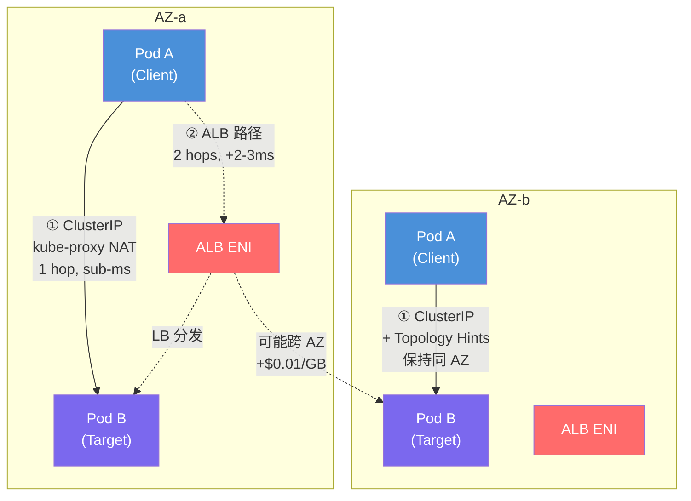
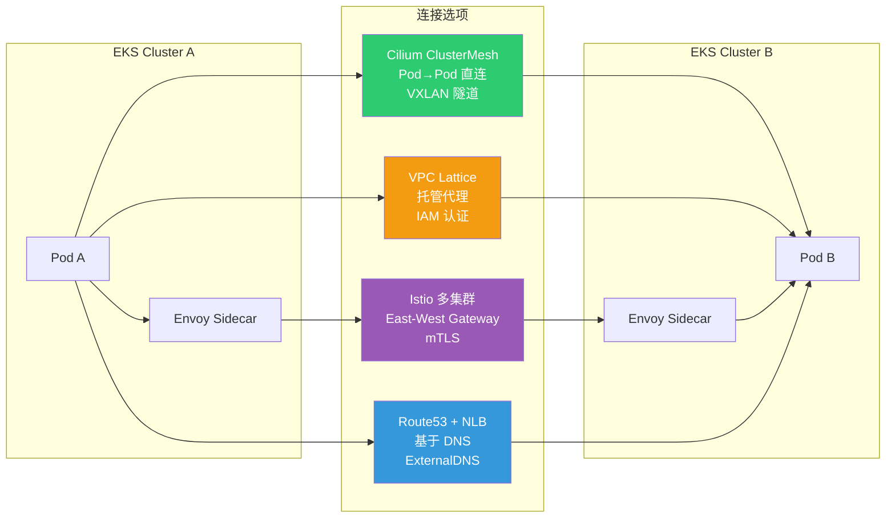

import { ServiceTypeComparison, LatencyCostComparison, CostSimulation, ScenarioMatrix } from '@site/src/components/EastWestTrafficTables';

# EKS East-West 流量优化指南

> 📅 **创建日期**: 2026-02-09 | **修改日期**: 2026-02-14 | ⏱️ **阅读时间**: 约 21 分钟

## 概述

本文整理了从**延迟（latency）最小化**和**成本效率化**角度优化 Amazon EKS 内部服务间通信（East-West 流量）的方案。从单集群开始，逐步覆盖多 AZ（Availability Zone）配置，以及多集群/多账户环境的扩展场景。

East-West（服务↔服务）的跳数从 1 增加到 2 时，p99 延迟会以毫秒级增加，跨 AZ 通信会产生 AWS 带宽费用（每 GB $0.01）。本指南分析了从 **Kubernetes 原生功能（Topology Aware Routing·InternalTrafficPolicy）到 Cilium ClusterMesh、AWS VPC Lattice、Istio 服务网格**各层级的选项，并定量比较延迟、开销和成本。

### 背景与问题

默认 Kubernetes 网络中 East-West 流量面临的问题：

- **缺乏 AZ 感知**：默认 ClusterIP 服务将流量随机（iptables）或轮询（IPVS）分发到集群所有 Pod，不考虑 AZ
- **不必要的跨 AZ 流量**：当 Pod 分布在多个 AZ 时，流量随机发送到其他 AZ，导致延迟增加和费用产生
- **跨 AZ 数据传输费用**：同区域内 AZ 间每 GB 约 $0.01 双向收费
- **DNS 查询延迟**：对集中式 CoreDNS 的跨 AZ DNS 查询及 QPS 限制问题
- **经 LB 时的额外跳数**：在 East-West 使用 Internal ALB/NLB 会产生不必要的网络跳数和固定成本

### 核心收益

应用本指南的优化策略后，可以期待以下改善：

| 项目 | 改善效果 |
|------|----------|
| 网络延迟 | 通过 Topology Aware Routing 实现同 AZ 路由，达到 p99 sub-ms |
| 成本节省 | 消除跨 AZ 流量，10 TB/月基准约节省 $100 |
| 运维简化 | 基于 ClusterIP 无需 LB 即可优化服务间通信 |
| DNS 性能 | 通过 NodeLocal DNSCache 将 DNS 查询延迟从数 ms 降至 sub-ms |
| 扩展性 | 提供向多集群/多账户环境一致的扩展路径 |

### L4 vs L7 流量优化策略

East-West 流量优化在传输层（L4）和应用层（L7）需要不同的方法：

- **L4 流量（TCP/UDP）**：核心是在无额外协议处理的情况下确保直接连接路径。设计为 Pod 间 1-hop 通信而不经过不必要的代理或负载均衡器，可最小化延迟。对于数据库等 StatefulSet 服务，适合通过 Headless Service 让客户端以 DNS 轮询直连目标 Pod 的模式。

- **L7 流量（HTTP/gRPC）**：当需要基于内容的路由、重试等高级流量控制时，使用应用层代理。通过 ALB 或 Istio sidecar 可以应用路径路由、gRPC 方法路由、熔断器等 L7 功能。但 L7 代理由于数据包检查和处理会增加负载和延迟，对简单流量可能过度。

---

## 前置要求

### 必要知识

- Kubernetes 网络基础概念（Service、Endpoint、kube-proxy）
- AWS VPC 网络（Subnet、AZ、ENI）
- DNS 解析机制（CoreDNS、/etc/resolv.conf）

### 所需工具

| 工具 | 版本 | 用途 |
|------|------|------|
| kubectl | 1.27+ | 集群资源管理 |
| eksctl | 0.170+ | EKS 集群创建和管理 |
| AWS CLI | 2.x | AWS 资源确认 |
| Helm | 3.12+ | Chart 部署（NodeLocal DNSCache 等） |
| AWS Load Balancer Controller | 2.6+ | ALB/NLB 集成（需要时） |

### 环境要求

| 项目 | 要求 |
|------|------|
| EKS 版本 | 1.27+（支持 Topology Aware Routing） |
| VPC CNI | v1.12+ 或 Cilium（ClusterMesh 场景） |
| AZ 配置 | 同区域内至少 2 个 AZ |
| IAM 权限 | EKS 集群管理员、ELB 创建/管理权限 |

---

## 架构

### 架构概览：单集群流量路径比较

下图展示了 ClusterIP 和 Internal ALB 路径的差异：



:::info 核心差异

- **ClusterIP 路径**: Pod → kube-proxy (iptables/IPVS NAT) → target Pod（1 hop）
- **Internal ALB 路径**: Pod → AZ-local ALB ENI → target Pod（2 hops）
- 应用 Topology Aware Routing 后，ClusterIP 路径在同 AZ 内完成
:::

### 多集群连接选项比较



### Kubernetes 服务类型比较

服务间通信的连接方式不同，性能和成本也有差异：

<ServiceTypeComparison />

### Instance 模式 vs IP 模式

使用 Internal LB 时，理解 Instance 模式和 IP 模式的区别很重要：

- **Instance 模式**：LB → NodePort → kube-proxy → Pod。接收 NodePort 的节点的 kube-proxy 将数据包转发到目标 Pod 所在的其他 AZ 节点，**产生跨 AZ 通信**
- **IP 模式**：LB → Pod IP 直连。从每个 AZ 直接将流量发送到 Pod IP，**不经过中间节点直接连接到同 AZ 的 Pod**

:::warning Instance 模式注意
Instance 模式下通过 NodePort 经由会增加跨 AZ 流量。AWS 最佳实践建议内部 LB 尽可能使用 **IP 模式**以减少不必要的 AZ 间流量。使用 IP 模式需要 AWS Load Balancer Controller。
:::

### 架构决策

:::info 技术选择标准

**为什么选择 ClusterIP 作为默认？**

- 原生 Kubernetes 功能，无额外费用
- 1-hop 通信实现最低延迟
- 与 Topology Aware Routing 结合实现 AZ 感知
- 与服务网格、Gateway API 集成便利

**为什么选择性使用 Internal ALB？**

- 持续产生每小时费用（$0.0225/h）+ LCU 计费
- 额外网络跳数带来 2-3ms RTT 开销
- 适合 EC2→EKS 迁移等过渡期使用
:::

---

## 实施

### 步骤 1：启用 Topology Aware Routing

在多 AZ 环境中降低延迟和成本的关键是让流量尽可能在同 AZ 内处理。在 Kubernetes 1.27+ 版本中启用 Topology Aware Routing 后，EndpointSlice 会记录每个端点的 AZ 信息（hints），kube-proxy 仅将流量路由到与客户端相同 Zone 的 Pod。

```yaml
apiVersion: v1
kind: Service
metadata:
  name: my-service
  namespace: production
  annotations:
    # 启用 Topology Aware Routing
    service.kubernetes.io/topology-mode: Auto
spec:
  selector:
    app: my-app
  ports:
    - name: http
      port: 80
      targetPort: 8080
      protocol: TCP
  type: ClusterIP
```

**验证：**

```bash
# 确认 EndpointSlice 是否设置了 topology hints
kubectl get endpointslices -l kubernetes.io/service-name=my-service -o yaml

# 检查输出中的 hints 字段
# hints:
#   forZones:
#     - name: ap-northeast-2a
```

:::warning Topology Aware Routing 工作条件

- 每个 AZ 必须有**足够的端点**
- 如果 Pod 集中在特定 AZ，该服务会禁用 hints 并路由到全部
- 如果 EndpointSlice 控制器判断各 AZ 的 Pod 比例不均等，则不会生成 hints
:::

### 步骤 2：设置 InternalTrafficPolicy Local

比 Topology Aware Routing 范围更窄的功能，仅将流量发送到同一节点（Local Node）上运行的端点。完全消除节点间（当然也包括 AZ 间）的网络跳数，使延迟最小化，跨 AZ 成本也趋近于 0。

```yaml
apiVersion: v1
kind: Service
metadata:
  name: my-local-service
  namespace: production
spec:
  selector:
    app: my-app
  ports:
    - name: http
      port: 80
      targetPort: 8080
  type: ClusterIP
  # 仅将流量发送到同一节点的端点
  internalTrafficPolicy: Local
```

:::danger InternalTrafficPolicy: Local 注意事项
当本地节点上没有目标 Pod 时，**流量会被丢弃**。使用此策略的服务必须在所有节点（或至少在发起服务调用的节点）上部署至少一个 Pod。请务必同时使用 Pod Topology Spread 或 PodAffinity。
:::

:::info Topology Aware Routing vs InternalTrafficPolicy
这两个功能**不能同时使用**，需选择性应用：

- **多 AZ 环境**：优先考虑保证 AZ 级别分发的 Topology Aware Routing
- **同一节点内频繁调用**：对紧耦合的 Pod 对使用 InternalTrafficPolicy(Local) + Pod 共置
:::

### 步骤 3：Pod Topology Spread Constraints

要发挥基于拓扑优化的效果，应用副本的部署策略很重要。Topology Aware Routing 要正常工作，每个 AZ 必须有足够的端点。

```yaml
apiVersion: apps/v1
kind: Deployment
metadata:
  name: my-app
  namespace: production
spec:
  replicas: 6
  selector:
    matchLabels:
      app: my-app
  template:
    metadata:
      labels:
        app: my-app
    spec:
      # 按 AZ 均等分布
      topologySpreadConstraints:
        - maxSkew: 1
          topologyKey: topology.kubernetes.io/zone
          whenUnsatisfiable: DoNotSchedule
          labelSelector:
            matchLabels:
              app: my-app
        # 按节点分布（可选）
        - maxSkew: 1
          topologyKey: kubernetes.io/hostname
          whenUnsatisfiable: ScheduleAnyway
          labelSelector:
            matchLabels:
              app: my-app
      containers:
        - name: my-app
          image: my-app:latest
          ports:
            - containerPort: 8080
          resources:
            requests:
              cpu: 100m
              memory: 128Mi
```

**使用 Pod Affinity 实现共置（co-location）：**

对频繁通信的服务 A 和 B 应用 PodAffinity 规则，使其部署在同一节点或同一 AZ：

```yaml
spec:
  affinity:
    podAffinity:
      # 优先部署在有服务 B 的节点
      preferredDuringSchedulingIgnoredDuringExecution:
        - weight: 100
          podAffinityTerm:
            labelSelector:
              matchLabels:
                app: service-b
            topologyKey: topology.kubernetes.io/zone
```

:::tip 自动扩缩注意事项
HPA 扩容时可以根据 Spread Constraints 分布新 Pod，但**缩容时控制器不考虑 AZ 均衡而任意移除 Pod**，可能导致不均衡。建议使用 Descheduler 在不均衡发生时进行重新调整。
:::

### 步骤 4：部署 NodeLocal DNSCache

DNS 查询延迟和失败在微服务环境中可能意外增加延迟。NodeLocal DNSCache 以 DaemonSet 形式在每个节点运行 DNS 缓存代理，显著缩短 DNS 响应时间。

```bash
# 下载并部署 NodeLocal DNSCache manifest
kubectl apply -f https://raw.githubusercontent.com/kubernetes/kubernetes/master/cluster/addons/dns/nodelocaldns/nodelocaldns.yaml
```

或使用 Helm chart：

```bash
helm repo add deliveryhero https://charts.deliveryhero.io/
helm install node-local-dns deliveryhero/node-local-dns \
  --namespace kube-system \
  --set config.localDnsIp=169.254.20.10
```

**NodeLocal DNSCache 工作原理：**

```yaml
# 每个 Pod 的 /etc/resolv.conf 指向本地缓存
# nameserver 169.254.20.10 (NodeLocal DNS IP)
# 在节点内部缓存频繁查询的 DNS
```

**效果：**

- p99 DNS lookup 延迟：数 ms → sub-ms
- CoreDNS QPS 负载减轻
- 在 10,000+ Pod 环境中节省数十 ms DNS 等待时间
- 减少跨 AZ DNS 费用

:::tip NodeLocal DNSCache 适用标准
AWS 官方博客建议在**节点数量较多的集群**中使用 NodeLocal DNSCache，并与 CoreDNS 扩容配合使用。根据工作负载规模，考虑每节点额外守护进程的资源消耗（CPU/内存）后再应用。
:::

### 步骤 5：配置 Internal LB IP 模式（需要时）

当需要 L7 功能或处于 EC2→EKS 迁移过渡期时，以 IP 模式配置 Internal ALB：

**Internal NLB（IP 模式）：**

```yaml
apiVersion: v1
kind: Service
metadata:
  name: my-service-nlb
  namespace: production
  annotations:
    # 使用 AWS Load Balancer Controller
    service.beta.kubernetes.io/aws-load-balancer-type: external
    service.beta.kubernetes.io/aws-load-balancer-nlb-target-type: ip
    service.beta.kubernetes.io/aws-load-balancer-scheme: internal
    # 禁用跨区域 LB（保持 AZ 本地流量）
    service.beta.kubernetes.io/aws-load-balancer-attributes: load_balancing.cross_zone.enabled=false
spec:
  type: LoadBalancer
  selector:
    app: my-app
  ports:
    - name: http
      port: 80
      targetPort: 8080
      protocol: TCP
```

**Internal ALB（Ingress 资源）：**

```yaml
apiVersion: networking.k8s.io/v1
kind: Ingress
metadata:
  name: my-service-alb
  namespace: production
  annotations:
    kubernetes.io/ingress.class: alb
    alb.ingress.kubernetes.io/scheme: internal
    alb.ingress.kubernetes.io/target-type: ip
    alb.ingress.kubernetes.io/healthcheck-path: /health
spec:
  rules:
    - host: my-service.internal
      http:
        paths:
          - path: /
            pathType: Prefix
            backend:
              service:
                name: my-service
                port:
                  number: 80
```

### 步骤 6：Istio 服务网格（可选）

当有安全要求（mTLS、Zero-Trust）或需要高级流量管理时，可选择性引入 Istio。

**Istio 的主要优势：**

- **基于 Locality 的路由**：利用 Envoy sidecar 间的 locality 信息路由到同 AZ 或同区域的实例
- **透明 mTLS**：无需修改应用代码即可实现 Mutual TLS 加密
- **高级流量管理**：重试、超时、熔断器、金丝雀部署

**性能开销（Istio 1.24 基准）：**

| 指标 | 数值 |
|------|------|
| 每 sidecar CPU | ~0.2 vCPU（1000 rps 基准） |
| 每 sidecar 内存 | ~60 MB（1000 rps 基准） |
| 额外延迟（p99） | ~5ms（客户端+服务端 2 次代理经由） |
| 性能影响 | 平均 5~10% 吞吐量下降 |

:::warning Istio 引入注意事项

- sidecar 资源消耗可能增加 EC2 成本
- 启用 mTLS 时 CPU 使用量额外增加
- 需要管理控制平面（Istiod）、学习 CRD（VirtualService、DestinationRule）
- 调试难度上升（需追踪 sidecar 和控制平面）
- 对**延迟敏感度极高的服务**应谨慎决定是否应用网格
:::

```yaml
# Istio Locality Load Balancing 配置示例
apiVersion: networking.istio.io/v1beta1
kind: DestinationRule
metadata:
  name: my-service
spec:
  host: my-service.production.svc.cluster.local
  trafficPolicy:
    outlierDetection:
      consecutive5xxErrors: 5
      interval: 30s
      baseEjectionTime: 30s
    connectionPool:
      tcp:
        maxConnections: 100
      http:
        h2UpgradePolicy: DEFAULT
        maxRequestsPerConnection: 10
```

### 多集群连接策略

当服务分布在多个集群或多个 AWS 账户时，需要集群间连接策略。

#### Cilium ClusterMesh

Cilium ClusterMesh 是 CNI Cilium 提供的多集群网络功能，将多个集群像一个网络一样连接。无需经过单独的网关或代理，基于 eBPF 实现 Pod-to-Pod 直接通信。

```bash
# 启用 ClusterMesh（Cilium CLI）
cilium clustermesh enable --context cluster1
cilium clustermesh enable --context cluster2

# 连接集群
cilium clustermesh connect --context cluster1 --destination-context cluster2

# 检查状态
cilium clustermesh status --context cluster1
```

**优点：** 最低延迟，无额外请求费用，透明的服务发现
**缺点：** 所有集群必须使用 Cilium CNI，需要 Cilium 运维知识

#### AWS VPC Lattice

Amazon VPC Lattice 是完全托管的应用网络服务，在多个 VPC 和账户间提供一致的服务连接、基于 IAM 的认证和监控。

```yaml
# 通过 Kubernetes Gateway API 集成 Lattice
apiVersion: gateway.networking.k8s.io/v1beta1
kind: Gateway
metadata:
  name: my-lattice-gateway
  annotations:
    application-networking.k8s.aws/lattice-vpc-association: "true"
spec:
  gatewayClassName: amazon-vpc-lattice
  listeners:
    - name: http
      protocol: HTTP
      port: 80
```

**费用结构：** 每服务 $0.025/小时 + $0.025/GB + 每 100 万请求 $0.10
**适用场景：** 数十个以上微服务分布在多个账户，需要集中安全管控

#### Istio 多集群网格

如果已经使用 Istio，可以扩展为多集群服务网格。在 Flat network 环境下可实现 Envoy-to-Envoy 直通通信，在隔离网络中则经由 East-West Gateway。

**优点：** 服务网格全部功能跨集群使用，全局 mTLS，跨集群故障转移
**缺点：** 4 种选项中运维复杂度最高，需要管理证书/sidecar 同步等

#### Route53 + ExternalDNS

最简单的多集群连接方式，将每个集群的服务注册到 Route53 Private Hosted Zone，通过 DNS 访问。

```yaml
# ExternalDNS 配置示例
apiVersion: v1
kind: Service
metadata:
  name: my-service
  annotations:
    external-dns.alpha.kubernetes.io/hostname: my-service.internal.example.com
spec:
  type: LoadBalancer
  ...
```

**适用场景：** 2-3 个集群，服务调用不频繁的情况，DR 配置

---

## 主要选项延迟与成本比较

### 各选项性能·成本比较

<LatencyCostComparison />

### 10 TB/月 East-West 流量成本模拟

假设：同区域 3-AZ EKS 集群，总计 10 TB（= 10,240 GB）服务间流量

<CostSimulation />

:::tip 成本优化核心洞察

- 使用 **InternalTrafficPolicy Local** 保证节点本地可实现零成本和最低延迟。但 Pod Affinity 及近邻部署是必须的
- **20 个以上服务、多账户**时 Lattice 提供运维便利性（接受额外成本）
- **混合策略**对大多数工作负载最经济：ALB 仅在需要 L7·WAF 的特定路径上投入，其余保持 ClusterIP 路径
:::

---

## 验证与监控

### Topology Aware Routing 验证

```bash
# 检查 EndpointSlice 的 hints
kubectl get endpointslices -l kubernetes.io/service-name=my-service \
  -o jsonpath='{range .items[*].endpoints[*]}{.addresses}{"\t"}{.zone}{"\t"}{.hints.forZones[*].name}{"\n"}{end}'

# 预期输出：
# ["10.0.1.15"]    ap-northeast-2a    ap-northeast-2a
# ["10.0.2.23"]    ap-northeast-2b    ap-northeast-2b
# ["10.0.3.41"]    ap-northeast-2c    ap-northeast-2c
```

```bash
# 确认 Pod 按 AZ 均等分布
kubectl get pods -l app=my-app -o wide | awk '{print $7}' | sort | uniq -c

# 预期输出：
# 2 ip-10-0-1-xxx.ap-northeast-2.compute.internal  (AZ-a)
# 2 ip-10-0-2-xxx.ap-northeast-2.compute.internal  (AZ-b)
# 2 ip-10-0-3-xxx.ap-northeast-2.compute.internal  (AZ-c)
```

### 监控：Internal ALB

使用 ALB 的服务通过 CloudWatch 指标监控：

| 指标 | 目标 | 警告 | 严重 |
|------|------|------|------|
| `TargetResponseTime` | 低于 100ms | 100-300ms | 超过 300ms |
| `HTTPCode_ELB_5XX_Count` | 0 | 1-10/分钟 | 超过 10/分钟 |
| `HTTPCode_Target_5XX_Count` | 0 | 1-5/分钟 | 超过 5/分钟 |
| `ActiveConnectionCount` | 正常范围 | 80% 容量 | 90% 容量 |

```bash
# 从 ALB access log 分析 5xx 错误原因
# 通过 error_reason 字段识别 502/504 根因
aws logs filter-log-events \
  --log-group-name /aws/alb/my-internal-alb \
  --filter-pattern "elb_status_code=5*"
```

### 监控：ClusterIP（无 LB 时）

ClusterIP 服务没有 ELB 指标，需要单独计量：

- **服务网格**：通过 Istio/Linkerd 或 Envoy sidecar 获取 L7 指标
- **基于 eBPF 的工具**：通过 Hubble、Cilium、Pixie 获取 TCP reset 和 5xx 统计
- **应用级别**：通过 Prometheus/OpenTelemetry 获取 5xx 计数

```yaml
# Prometheus ServiceMonitor 示例
apiVersion: monitoring.coreos.com/v1
kind: ServiceMonitor
metadata:
  name: my-service-monitor
spec:
  selector:
    matchLabels:
      app: my-app
  endpoints:
    - port: metrics
      interval: 15s
      path: /metrics
```

### 跨 AZ 成本监控

```bash
# 从 AWS Cost and Usage Report 确认 Regional Data Transfer 成本
aws ce get-cost-and-usage \
  --time-period Start=2026-02-01,End=2026-02-28 \
  --granularity MONTHLY \
  --metrics "BlendedCost" \
  --filter '{"Dimensions":{"Key":"USAGE_TYPE","Values":["APN2-DataTransfer-Regional-Bytes"]}}'
```

:::tip 使用 Kubecost
安装 Kubecost 可以按命名空间可视化跨 AZ 流量成本。通过 `RegionalDataTransferCost` 指标可以识别哪些服务间通信产生最多的跨 AZ 成本。
:::

---

## 按场景推荐矩阵

根据服务特性、安全需求和运维复杂度的推荐方案组合：

<ScenarioMatrix />

:::info 混合策略
在实际环境中，往往**混合使用**多种策略而非只用一种。例如：

- 集群内部：ClusterIP + Topology Hints
- 非网格服务：通过 InternalTrafficPolicy 优化
- 多集群间：通过 Lattice 连接
- 特定 L7 路径：投入 ALB
:::

---

## EC2→EKS 迁移指南

### 分阶段迁移策略

从 EC2 迁移服务到 EKS 的过渡期，建议利用 Internal ALB 进行渐进式转换：

**第 1 阶段：在 EKS 内部从 ClusterIP 开始**

```bash
# EKS 服务间通信使用 DNS http://service.namespace.svc.cluster.local
# 保持代码可移植性
```

**第 2 阶段：同时服务 EC2 和 EKS**

```yaml
# 在 Internal ALB 上设置两个 Target Group
# EC2 Instance TG + EKS Pod TG（AWS LB Controller）
# 通过加权监听器规则渐进转换（例：90/10）
apiVersion: elbv2.k8s.aws/v1beta1
kind: TargetGroupBinding
metadata:
  name: my-service-tgb
spec:
  serviceRef:
    name: my-service
    port: 80
  targetGroupARN: arn:aws:elasticloadbalancing:ap-northeast-2:123456789012:targetgroup/my-eks-tg/xxx
  targetType: ip
```

**第 3 阶段：100% EKS 转换后移除 ALB**

完全转换到 EKS 后，移除 ALB 并回归 ClusterIP 以消除持续的 ALB 成本。

:::tip 迁移核心原则

- **稳态（steady-state）**：使用 ClusterIP 保持最低成本·最低延迟
- **过渡期**：使用 Internal ALB 进行 EC2/EKS 双路由（weighted target groups）
- **转换完成后**：移除 ALB 以删除成本项本身
:::

---

## 故障排除

### 问题：Topology Aware Routing 不生效

**症状：**

```
EndpointSlice 中 hints 字段为空
流量仍然跨 AZ 分发
```

**原因分析：**

```bash
# 检查 EndpointSlice 状态
kubectl get endpointslices -l kubernetes.io/service-name=my-service -o yaml

# 确认各 AZ 的 Pod 分布
kubectl get pods -l app=my-app -o json | \
  jq -r '.items[] | "\(.spec.nodeName) \(.status.podIP)"' | \
  while read node ip; do
    zone=$(kubectl get node $node -o jsonpath='{.metadata.labels.topology\.kubernetes\.io/zone}')
    echo "$zone $ip"
  done | sort | uniq -c
```

**解决方法：**

1. 确认 Pod **在所有 AZ 均等分布**（每 AZ 至少 2 个以上）
2. 在 Deployment 中添加 `topologySpreadConstraints`
3. 确认 EndpointSlice 控制器生成 hints 的条件：
   - 各 AZ 的端点比例需大致均等
   - 如果某个 AZ 集中了 50% 以上的端点，将不会生成 hints

### 问题：InternalTrafficPolicy Local 流量丢弃

**症状：**

```
在特定节点调用服务时出现 connection refused 或 timeout
kubectl logs 中显示 "no endpoints available" 消息
```

**原因分析：**

```bash
# 确认本地节点上是否有目标 Pod
kubectl get pods -l app=target-service -o wide

# 检查特定节点的端点
kubectl get endpoints my-local-service -o yaml
```

**解决方法：**

1. 以 DaemonSet 在所有节点部署目标服务
2. 通过 PodAffinity 强制调用者和目标位于同一节点
3. 或移除 InternalTrafficPolicy 转为 Topology Aware Routing（AZ 级别）

```yaml
# 替代方案：转为 Topology Aware Routing
apiVersion: v1
kind: Service
metadata:
  name: my-service
  annotations:
    service.kubernetes.io/topology-mode: Auto
spec:
  # 移除 internalTrafficPolicy: Local
  selector:
    app: my-app
```

### 问题：跨 AZ 成本未减少

**症状：**

```
应用 Topology Aware Routing 后，AWS Cost Explorer 中 Regional Data Transfer 成本仍未下降
```

**原因分析：**

```bash
# 确认实际流量路径（使用 Cilium Hubble 时）
hubble observe --namespace production --protocol TCP \
  --to-label app=target-service --output json | \
  jq '.source.labels, .destination.labels'

# 确认是否经由 NAT Gateway
kubectl exec -it test-pod -- traceroute target-service.production.svc.cluster.local
```

**解决方法：**

1. **按 AZ 分离部署 NAT Gateway**（防止外部通信时跨 AZ）
2. 确认 NLB/ALB 是否设置为 **IP 模式**
3. 确认 CoreDNS 是否在跨 AZ 运行 → 应用 NodeLocal DNSCache
4. 使用 Kubecost 按命名空间识别跨 AZ 流量原因

### 问题：NodeLocal DNSCache 相关问题

**症状：**

```
部署 NodeLocal DNSCache 后 DNS 解析失败
Pod 无法查询外部域名
```

**解决方法：**

```bash
# 检查 NodeLocal DNS Pod 状态
kubectl get pods -n kube-system -l k8s-app=node-local-dns

# DNS 解析测试
kubectl exec -it test-pod -- nslookup kubernetes.default.svc.cluster.local
kubectl exec -it test-pod -- nslookup google.com

# 检查 resolv.conf
kubectl exec -it test-pod -- cat /etc/resolv.conf
# 确认 nameserver 是否为 169.254.20.10（NodeLocal IP）
```

:::danger 生产环境注意
在生产环境中更改网络设置时，务必以**金丝雀部署**方式先从小规模服务开始应用，并比较变更前后的性能指标。Topology Aware Routing 或 InternalTrafficPolicy 变更会立即改变流量路径，必须在加强监控的状态下进行。
:::

---

## 总结

### 核心要点

:::tip 架构选择指南

**1. 低成本 + 超低延迟**

- ClusterIP + Topology Aware Routing + NodeLocal DNSCache
- 需要时添加 InternalTrafficPolicy(Local)
- 10 TB/月基准相比 ALB 约节省 $98，相比 VPC Lattice 节省 $400+

**2. L4 稳定性和固定 IP 需求**

- Internal NLB（IP 模式）
- 流量 > 5 TB/月时需仔细审查成本

**3. L7 路由·WAF·gRPC 方法级控制**

- Internal ALB + K8s Gateway API
- 仅在需要的路径部署以防止 LCU 增加

**4. 全企业 Zero-Trust，多集群**

- Istio Ambient → Sidecar 转换仅对需要的工作负载缩小范围
- Sidecar → 节点代理（Ambient） → Sidecar-less（eBPF） 顺序减少开销

**5. 多账户·服务 > 50 个**

- 使用托管 VPC Lattice + IAM 策略降低复杂度

:::

### 下一步

实施完成后请检查以下事项：

- [ ] 启用 Topology Aware Routing 并确认 EndpointSlice hints
- [ ] 通过 Pod Topology Spread Constraints 保证 AZ 均等分布
- [ ] 部署 NodeLocal DNSCache 并确认 DNS 响应时间改善
- [ ] 设置跨 AZ 成本监控面板（Kubecost 或 CUR）
- [ ] 识别不必要的 Internal LB 并评估转换为 ClusterIP
- [ ] 制定已完成迁移服务的 ALB 移除计划

---

## 参考资料

1. [AWS Elastic Load Balancing 定价 - LCU/NLCU 价格](https://aws.amazon.com/elasticloadbalancing/pricing/)
2. [AWS 数据传输定价 - 跨 AZ $0.01/GB](https://aws.amazon.com/ec2/pricing/on-demand/#Data_Transfer)
3. [AWS ELB 最佳实践 - 延迟优化](https://docs.aws.amazon.com/elasticloadbalancing/latest/application/application-load-balancers.html)
4. [AWS Network Load Balancer](https://aws.amazon.com/elasticloadbalancing/network-load-balancer/)
5. [AWS VPC Lattice 定价](https://aws.amazon.com/vpc/lattice/pricing/)
6. [Istio 1.24 性能和可扩展性](https://istio.io/latest/docs/ops/deployment/performance-and-scalability/)
7. [Kubernetes NodeLocal DNSCache](https://kubernetes.io/docs/tasks/administer-cluster/nodelocaldns/)
8. [Kubernetes Topology Aware Routing](https://kubernetes.io/docs/concepts/services-networking/topology-aware-routing/)
9. [Cilium ClusterMesh 文档](https://docs.cilium.io/en/stable/network/clustermesh/)
10. [AWS EKS 最佳实践 - 成本优化](https://docs.aws.amazon.com/eks/latest/best-practices/cost-opt.html)
11. [Kubernetes Pod Topology Spread Constraints](https://kubernetes.io/docs/concepts/scheduling-eviction/topology-spread-constraints/)
