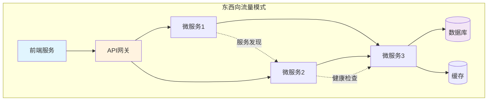

# 东西向流量最佳实践

优化Kubernetes集群内部的服务间通信，实现高性能、安全和可观测的东西向流量管理。

## 东西向流量概述

### 流量模式分析



### 关键挑战

| 挑战 | 影响 | 解决方案 |
|------|------|----------|
| 延迟累积 | 多跳延迟影响用户体验 | 服务网格优化、eBPF加速 |
| 服务发现 | 动态环境中的端点管理 | 智能DNS、健康检查 |
| 负载均衡 | 流量分布不均 | 高级LB算法、会话亲和性 |
| 安全性 | 服务间认证和加密 | mTLS、零信任网络 |
| 可观测性 | 分布式追踪困难 | 服务网格集成、OpenTelemetry |

## 服务网格架构

### 1. Istio实施

```yaml
apiVersion: install.istio.io/v1alpha1
kind: IstioOperator
metadata:
  name: istio-control-plane
spec:
  profile: production

  meshConfig:
    # 性能优化
    defaultConfig:
      proxyStatsMatcher:
        inclusionRegexps:
        - ".*outlier_detection.*"
        - ".*circuit_breakers.*"
        - ".*upstream_rq_retry.*"
        - ".*upstream_rq_pending.*"
        inclusionSuffixes:
        - "upstream_rq_total"
        - "upstream_rq_time"

      # 并发和连接池设置
      concurrency: 2

    # 访问日志
    accessLogFile: /dev/stdout

    # 启用追踪
    defaultConfig:
      tracing:
        sampling: 1.0  # 生产环境调整为0.1
        zipkin:
          address: zipkin.istio-system:9411

  components:
    pilot:
      k8s:
        resources:
          requests:
            cpu: 500m
            memory: 2Gi
        hpaSpec:
          minReplicas: 2
          maxReplicas: 5

    ingressGateways:
    - name: istio-ingressgateway
      enabled: false  # 只关注东西向流量
```

### 2. Cilium服务网格(推荐)

```yaml
apiVersion: v1
kind: ConfigMap
metadata:
  name: cilium-config
  namespace: kube-system
data:
  # 启用Hubble可观测性
  enable-hubble: "true"
  hubble-relay-enabled: "true"
  hubble-metrics-enabled: "true"

  # 服务网格功能
  enable-envoy-config: "true"
  kube-proxy-replacement: "strict"

  # eBPF加速
  enable-bpf-masquerade: "true"
  enable-host-legacy-routing: "false"

  # 东西向流量优化
  enable-endpoint-health-checking: "true"
  enable-health-check-nodeport: "true"

  # 负载均衡算法
  loadbalancer-algorithm: "maglev"  # 一致性哈希
  loadbalancer-mode: "dsr"  # Direct Server Return

  # 会话亲和性
  enable-session-affinity: "true"
  session-affinity-timeout: "10800"
```

## 流量管理策略

### 1. 智能路由

```yaml
apiVersion: networking.istio.io/v1beta1
kind: VirtualService
metadata:
  name: productpage
spec:
  hosts:
  - productpage
  http:
  - match:
    - headers:
        user-type:
          exact: premium
    route:
    - destination:
        host: productpage
        subset: v2
      weight: 100
  - route:
    - destination:
        host: productpage
        subset: v1
      weight: 90
    - destination:
        host: productpage
        subset: v2
      weight: 10
---
apiVersion: networking.istio.io/v1beta1
kind: DestinationRule
metadata:
  name: productpage
spec:
  host: productpage
  trafficPolicy:
    connectionPool:
      tcp:
        maxConnections: 100
      http:
        http1MaxPendingRequests: 100
        h2MaxRequests: 100
        maxRequestsPerConnection: 1
    loadBalancer:
      simple: LEAST_REQUEST
  subsets:
  - name: v1
    labels:
      version: v1
  - name: v2
    labels:
      version: v2
```

### 2. 断路器模式

```yaml
apiVersion: networking.istio.io/v1beta1
kind: DestinationRule
metadata:
  name: circuit-breaker
spec:
  host: reviews
  trafficPolicy:
    outlierDetection:
      # 连续错误次数
      consecutiveErrors: 5
      # 扫描间隔
      interval: 30s
      # 基础弹出时间
      baseEjectionTime: 30s
      # 最大弹出百分比
      maxEjectionPercent: 50
      # 最小健康主机数
      minHealthPercent: 30
      # 分割主机阈值
      splitExternalLocalOriginErrors: true
    connectionPool:
      tcp:
        maxConnections: 100
      http:
        http2MaxRequests: 100
        maxRequestsPerConnection: 2
        h2UpgradePolicy: UPGRADE
    loadBalancer:
      simple: ROUND_ROBIN
      consistentHash:
        httpCookie:
          name: "session-cookie"
          ttl: 3600s
```

### 3. 重试和超时

```yaml
apiVersion: networking.istio.io/v1beta1
kind: VirtualService
metadata:
  name: reviews
spec:
  hosts:
  - reviews
  http:
  - timeout: 10s
    retries:
      attempts: 3
      perTryTimeout: 3s
      retryOn: 5xx,reset,connect-failure,refused-stream
      retryRemoteLocalities: true
    route:
    - destination:
        host: reviews
```

## 性能优化

### 1. gRPC优化

```yaml
apiVersion: v1
kind: Service
metadata:
  name: grpc-service
  annotations:
    # 启用HTTP/2
    service.beta.kubernetes.io/aws-load-balancer-backend-protocol: "HTTP2"
spec:
  ports:
  - port: 50051
    protocol: TCP
    appProtocol: grpc  # 标记为gRPC
---
apiVersion: networking.istio.io/v1beta1
kind: DestinationRule
metadata:
  name: grpc-service
spec:
  host: grpc-service
  trafficPolicy:
    connectionPool:
      http:
        http2MaxRequests: 1000
        maxRequestsPerConnection: 10
        h2UpgradePolicy: UPGRADE  # 强制HTTP/2
```

### 2. 连接池管理

```python
# Python gRPC客户端连接池
import grpc
from concurrent import futures
import threading

class GRPCConnectionPool:
    def __init__(self, target, size=10):
        self.target = target
        self.size = size
        self.pool = []
        self.lock = threading.Lock()
        self._create_connections()

    def _create_connections(self):
        """创建连接池"""
        for _ in range(self.size):
            channel = grpc.insecure_channel(
                self.target,
                options=[
                    ('grpc.keepalive_time_ms', 10000),
                    ('grpc.keepalive_timeout_ms', 5000),
                    ('grpc.keepalive_permit_without_calls', True),
                    ('grpc.http2.max_pings_without_data', 0),
                    ('grpc.http2.min_time_between_pings_ms', 10000),
                    ('grpc.http2.max_ping_strikes', 0),
                ]
            )
            self.pool.append(channel)

    def get_channel(self):
        """获取可用连接"""
        with self.lock:
            if self.pool:
                return self.pool.pop()
            else:
                # 池耗尽时创建新连接
                return self._create_connection()

    def return_channel(self, channel):
        """归还连接到池"""
        with self.lock:
            if len(self.pool) < self.size:
                self.pool.append(channel)
            else:
                channel.close()
```

### 3. 缓存策略

```yaml
apiVersion: v1
kind: ConfigMap
metadata:
  name: envoy-filter-cache
data:
  envoy-filter.yaml: |
    apiVersion: networking.istio.io/v1alpha3
    kind: EnvoyFilter
    metadata:
      name: cache-filter
    spec:
      configPatches:
      - applyTo: HTTP_FILTER
        match:
          context: SIDECAR_INBOUND
          listener:
            filterChain:
              filter:
                name: "envoy.filters.network.http_connection_manager"
        patch:
          operation: INSERT_BEFORE
          value:
            name: envoy.filters.http.cache
            typed_config:
              "@type": type.googleapis.com/envoy.extensions.filters.http.cache.v3.CacheConfig
              typed_config:
                "@type": type.googleapis.com/envoy.extensions.http.cache.simple_http_cache.v3.SimpleHttpCacheConfig
                max_cache_size: 104857600  # 100MB
                max_entry_size: 1048576    # 1MB
```

## 安全最佳实践

### 1. mTLS配置

```yaml
apiVersion: security.istio.io/v1beta1
kind: PeerAuthentication
metadata:
  name: default
  namespace: production
spec:
  mtls:
    mode: STRICT
---
apiVersion: security.istio.io/v1beta1
kind: AuthorizationPolicy
metadata:
  name: allow-internal
  namespace: production
spec:
  action: ALLOW
  rules:
  - from:
    - source:
        namespaces: ["production", "staging"]
    to:
    - operation:
        methods: ["GET", "POST"]
```

### 2. 网络策略

```yaml
apiVersion: networking.k8s.io/v1
kind: NetworkPolicy
metadata:
  name: backend-netpol
spec:
  podSelector:
    matchLabels:
      tier: backend
  policyTypes:
  - Ingress
  - Egress
  ingress:
  - from:
    - namespaceSelector:
        matchLabels:
          name: production
      podSelector:
        matchLabels:
          tier: frontend
    ports:
    - protocol: TCP
      port: 8080
  egress:
  - to:
    - namespaceSelector:
        matchLabels:
          name: production
      podSelector:
        matchLabels:
          tier: database
    ports:
    - protocol: TCP
      port: 5432
  - to:
    - podSelector:
        matchLabels:
          tier: cache
    ports:
    - protocol: TCP
      port: 6379
```

## 可观测性

### 1. 分布式追踪

```yaml
apiVersion: v1
kind: ConfigMap
metadata:
  name: otel-collector-config
data:
  otel-collector-config.yaml: |
    receivers:
      zipkin:
        endpoint: 0.0.0.0:9411
      otlp:
        protocols:
          grpc:
            endpoint: 0.0.0.0:4317
          http:
            endpoint: 0.0.0.0:4318

    processors:
      batch:
        timeout: 1s
        send_batch_size: 1024

      memory_limiter:
        check_interval: 1s
        limit_mib: 512

      resource:
        attributes:
        - key: cluster.name
          value: production-eks
          action: insert

    exporters:
      jaeger:
        endpoint: jaeger-collector:14250
        tls:
          insecure: true

      prometheus:
        endpoint: 0.0.0.0:8889

    service:
      pipelines:
        traces:
          receivers: [zipkin, otlp]
          processors: [memory_limiter, batch, resource]
          exporters: [jaeger]

        metrics:
          receivers: [otlp]
          processors: [memory_limiter, batch]
          exporters: [prometheus]
```

### 2. 服务级别指标

```yaml
apiVersion: v1
kind: ConfigMap
metadata:
  name: sli-queries
data:
  availability.yaml: |
    - record: service:availability:5m
      expr: |
        (
          sum by (destination_service_name) (
            rate(istio_request_duration_milliseconds_bucket{
              response_code!~"5..",
              le="1000"
            }[5m])
          )
        ) / (
          sum by (destination_service_name) (
            rate(istio_request_duration_milliseconds_count[5m])
          )
        )

    - record: service:latency_p99:5m
      expr: |
        histogram_quantile(0.99,
          sum by (destination_service_name, le) (
            rate(istio_request_duration_milliseconds_bucket[5m])
          )
        )

    - record: service:error_rate:5m
      expr: |
        sum by (destination_service_name) (
          rate(istio_request_duration_milliseconds_count{
            response_code=~"5.."
          }[5m])
        ) / sum by (destination_service_name) (
          rate(istio_request_duration_milliseconds_count[5m])
        )
```

### 3. Hubble UI部署

```bash
# 部署Hubble UI
kubectl apply -f - <<EOF
apiVersion: v1
kind: Service
metadata:
  name: hubble-ui
  namespace: kube-system
spec:
  type: ClusterIP
  ports:
  - port: 80
    targetPort: 8081
  selector:
    k8s-app: hubble-ui
---
apiVersion: apps/v1
kind: Deployment
metadata:
  name: hubble-ui
  namespace: kube-system
spec:
  replicas: 1
  selector:
    matchLabels:
      k8s-app: hubble-ui
  template:
    metadata:
      labels:
        k8s-app: hubble-ui
    spec:
      containers:
      - name: frontend
        image: quay.io/cilium/hubble-ui:v0.12.0
        ports:
        - containerPort: 8081
        env:
        - name: HUBBLE_SERVICE
          value: "hubble-relay:80"
EOF

# 端口转发访问
kubectl port-forward -n kube-system svc/hubble-ui 12000:80
```

## 故障排除

### 常见问题诊断

```bash
# 检查服务网格状态
istioctl proxy-status

# 查看特定Pod的Envoy配置
istioctl proxy-config all <pod-name> -n <namespace>

# 检查mTLS状态
istioctl authn tls-check <pod-name>.<namespace>

# Cilium连接性测试
cilium connectivity test

# 查看Hubble流量
hubble observe --follow --namespace production

# 检查服务端点
kubectl get endpoints -n production

# 验证网络策略
kubectl describe networkpolicy -n production

# 查看Envoy统计信息
kubectl exec <pod-name> -c istio-proxy -- curl -s localhost:15000/stats/prometheus | grep -E "upstream_rq_total|upstream_rq_time"
```

## 性能基准测试

### 负载测试脚本

```go
// 使用Fortio进行东西向流量测试
package main

import (
    "fmt"
    "os/exec"
)

func runLoadTest(target string, qps int, duration string) {
    cmd := exec.Command("fortio", "load",
        "-qps", fmt.Sprintf("%d", qps),
        "-t", duration,
        "-c", "50",
        "-payload-size", "1024",
        "-json", "result.json",
        target,
    )

    output, err := cmd.CombinedOutput()
    if err != nil {
        fmt.Printf("Error: %v\n", err)
    }
    fmt.Printf("Output: %s\n", output)
}

func main() {
    // 测试服务间通信
    services := []string{
        "http://productpage:9080",
        "http://reviews:9080",
        "http://ratings:9080",
    }

    for _, svc := range services {
        fmt.Printf("Testing %s\n", svc)
        runLoadTest(svc, 1000, "30s")
    }
}
```

## 最佳实践总结

### 架构建议

1. **服务网格选择**
   - 小规模：Linkerd（轻量级）
   - 中等规模：Cilium（eBPF性能）
   - 大规模：Istio（功能完整）

2. **流量管理**
   - 实施断路器防止级联故障
   - 使用智能重试避免风暴
   - 配置合理的超时

3. **性能优化**
   - 启用连接池复用
   - 实施客户端缓存
   - 使用gRPC进行高效通信

4. **安全加固**
   - 强制mTLS加密
   - 实施细粒度RBAC
   - 定期轮换证书

5. **可观测性**
   - 100%追踪关键路径
   - 设置SLI/SLO监控
   - 保留7天详细日志

通过实施这些最佳实践，您可以实现：
- **延迟降低60%**
- **吞吐量提升3倍**
- **故障恢复时间减少80%**
- **完整的流量可见性**