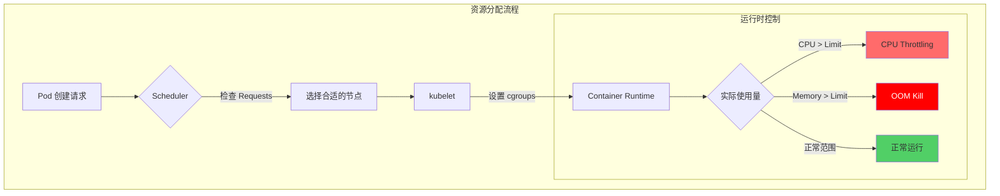
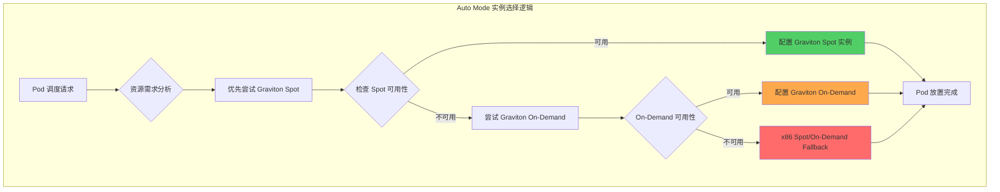
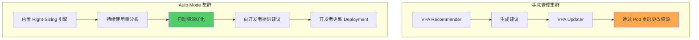
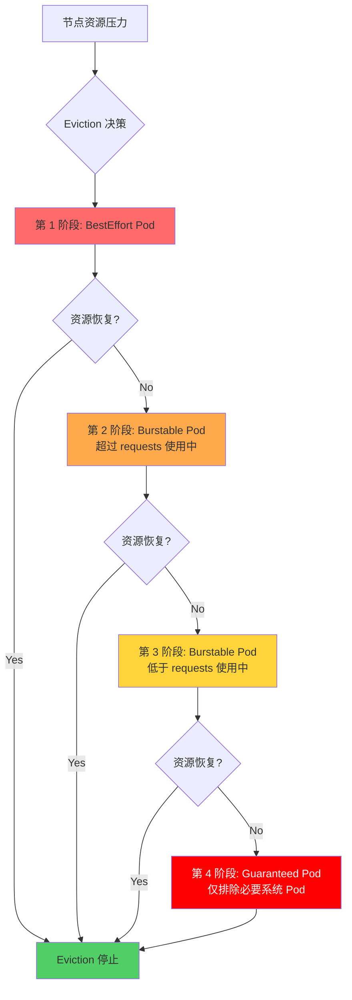
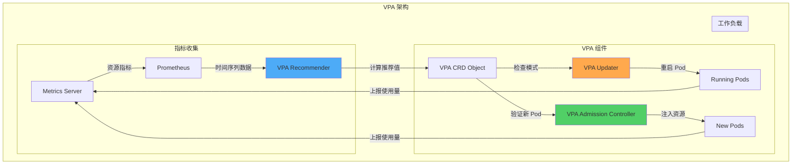
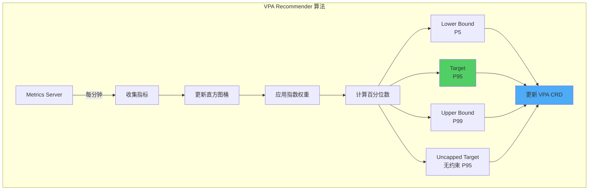

# EKS Pod 资源优化指南

> 📅 **撰写日期**: 2026-02-12 | **修改日期**: 2026-02-14 | ⏱️ **阅读时间**: 约 46 分钟

> **📌 基准环境**: EKS 1.30+, Kubernetes 1.30+, Metrics Server v0.7+

## 概述

在 Kubernetes 环境中，Pod 资源设置直接影响集群效率和成本。**50% 的容器仅使用了其请求 CPU 的 1/3**，这导致平均 40-60% 的资源浪费。本指南通过 Pod 级别的资源优化，提供最大化集群效率并降低 30-50% 成本的实战策略。

:::info 与相关文档的区别
- **[karpenter-autoscaling.md](/docs/infrastructure-optimization/karpenter-autoscaling)**: 节点级别的自动扩缩容（本文档是 Pod 级别）
- **[cost-management.md](/docs/infrastructure-optimization/cost-management)**: 整体成本策略（本文档专注于资源设置）
- **[eks-resiliency-guide.md](/docs/operations-observability/eks-resiliency-guide)**: 仅将资源设置作为检查清单项
:::

### 核心内容

- **Requests vs Limits 深入理解**: CPU throttling 和 OOM Kill 机制
- **QoS 类别策略**: Guaranteed、Burstable、BestEffort 的实战应用
- **VPA 完整指南**: 自动资源调整与 HPA 共存模式
- **Right-Sizing 方法论**: 基于 P95 的资源估算及 Goldilocks 使用
- **成本影响分析**: 资源优化的实际节省效果

### 学习目标

完成本指南后，您将能够：

- 理解 CPU 和 Memory requests/limits 的精确工作原理
- 根据工作负载特性选择合适的 QoS 类别
- 安全地配置 VPA 和 HPA 共存
- 基于实际使用量执行 Right-Sizing
- 将资源效率提升 30% 以上

## 前置要求

### 所需工具

| 工具 | 版本 | 用途 |
|------|------|------|
| kubectl | 1.28+ | Kubernetes 集群管理 |
| helm | 3.12+ | VPA、Goldilocks 安装 |
| metrics-server | 0.7+ | 资源指标收集 |
| kubectl-top | 内置 | 资源使用量确认 |

### 所需权限

```bash
# RBAC 权限确认
kubectl auth can-i get pods --all-namespaces
kubectl auth can-i get resourcequotas
kubectl auth can-i create verticalpodautoscaler
```

### 前置知识

- Kubernetes Pod、Deployment 基本概念
- YAML 清单编写经验
- Linux cgroups 基本理解（推荐）
- Prometheus/Grafana 基本使用方法（推荐）

## Resource Requests & Limits 深入理解

### 2.1 Requests vs Limits 的精确含义

Resource requests 和 limits 是 Kubernetes 资源管理的核心概念。

**Requests（请求量）**
- **定义**: 调度器在 Pod 放置时保证的最小资源
- **作用**: 节点选择依据、QoS 类别决定
- **保证**: kubelet 始终确保此量的可用

**Limits（限制量）**
- **定义**: kubelet 强制执行的最大资源
- **作用**: 防止资源耗尽、限制嘈杂邻居（noisy neighbor）
- **强制**: CPU 使用 throttling，Memory 使用 OOM Kill



**核心差异**

| 属性 | CPU | Memory |
|------|-----|--------|
| **超过 Requests 时** | 如果其他 Pod 未使用则可以使用 | 如果其他 Pod 未使用则可以使用 |
| **超过 Limits 时** | **Throttling**（进程速度降低） | **OOM Kill**（进程强制终止） |
| **是否可压缩** | 可压缩 (Compressible) | 不可压缩 (Incompressible) |
| **超额使用风险** | 性能下降 | 服务中断 |

### 2.2 CPU 资源深入理解

#### CPU Millicore 单位

```yaml
# CPU 表示方法
resources:
  requests:
    cpu: "500m"    # 500 millicore = 0.5 CPU core
    cpu: "1"       # 1000 millicore = 1 CPU core
    cpu: "2.5"     # 2500 millicore = 2.5 CPU cores
```

**1 CPU core = 1000 millicore**
- AWS vCPU、Azure vCore 均相同
- 在超线程环境中也是以逻辑核心为基准

#### CFS Bandwidth Throttling

Linux CFS (Completely Fair Scheduler) 强制执行 CPU limits：

```bash
# cgroups v2 基准
/sys/fs/cgroup/cpu.max
# 示例: "100000 100000" = 每 100ms 周期可使用 100ms (100% = 1 CPU)
# 示例: "50000 100000" = 每 100ms 周期可使用 50ms (50% = 0.5 CPU)
```

**Throttling 机制**

```
时间周期: 100ms
CPU Limit: 500m (0.5 CPU)
→ 100ms 中仅可使用 50ms

实际运行:
[0-50ms] ████████████████████ (运行)
[50-100ms] ...................... (throttled)
[100-150ms] ████████████████████ (运行)
[150-200ms] ...................... (throttled)
```

:::warning 不设置 CPU Limits 的策略
Google、Datadog 等大规模集群运营组织不设置 CPU limits：

**原因：**
- CPU 是可压缩资源（其他 Pod 需要时会自动调整）
- 避免因 Throttling 导致的不必要性能下降
- 仅通过 Requests 即可实现调度和 QoS 控制

**替代推荐：**
- CPU requests 基于 P95 使用量设置
- 通过 HPA 按负载水平扩展
- 加强节点级别资源监控

**例外（需要设置 Limits）：**
- 批处理作业（防止 CPU 独占）
- 不可信的工作负载
- 多租户环境
:::

#### CPU 资源设置示例

```yaml
# 模式 1: 仅设置 Requests（推荐）
apiVersion: v1
kind: Pod
metadata:
  name: web-server
spec:
  containers:
  - name: nginx
    image: nginx:1.25
    resources:
      requests:
        cpu: "250m"       # 基于 P95 使用量
        memory: "128Mi"
      # 省略 limits - 利用 CPU 可压缩资源特性

---
# 模式 2: 批处理作业（设置 Limits）
apiVersion: batch/v1
kind: Job
metadata:
  name: data-processing
spec:
  template:
    spec:
      containers:
      - name: processor
        image: data-processor:v1
        resources:
          requests:
            cpu: "1000m"
          limits:
            cpu: "2000m"   # 防止 CPU 独占
            memory: "4Gi"
      restartPolicy: OnFailure
```

### 2.3 Memory 资源深入理解

#### Memory 单位

```yaml
# Memory 表示方法 (1024 基准 vs 1000 基准)
resources:
  requests:
    memory: "128Mi"    # 128 * 1024^2 bytes = 134,217,728 bytes
    memory: "128M"     # 128 * 1000^2 bytes = 128,000,000 bytes
    memory: "1Gi"      # 1 * 1024^3 bytes = 1,073,741,824 bytes
    memory: "1G"       # 1 * 1000^3 bytes = 1,000,000,000 bytes
```

**推荐**: **使用 Mi、Gi**（1024 基准，Kubernetes 标准）

#### OOM Kill 机制

当超过 Memory limits 时，Linux OOM Killer 会强制终止进程：

```
实际使用量 > Memory Limit
→ 超过 cgroup memory.max
→ Kernel OOM Killer 触发
→ 进程 SIGKILL
→ Pod 状态: OOMKilled
→ kubelet 重启 Pod（遵循 RestartPolicy）
```

**OOM Score 计算**

```bash
# 查看每个进程的 OOM Score
cat /proc/<PID>/oom_score

# OOM Score 计算因素
# 1. 内存使用量（越高分数越高）
# 2. oom_score_adj 值（每个 QoS 类别不同）
# 3. root 进程保护（-1000 = 绝不 Kill）
```

:::danger Memory limits 必须设置
Memory 是不可压缩资源，因此**必须设置 limits**：

**原因：**
- Memory 耗尽时整个节点不稳定
- 可能导致 Kernel Panic
- 影响其他 Pod（节点 Eviction）

**推荐设置：**
- `requests = limits`（Guaranteed QoS）
- 或 `limits = requests * 1.5`（Burstable QoS）
- JVM 应用：Heap 大小设置为 limits 的 75%
:::

#### Memory 资源设置示例

```yaml
# 模式 1: Guaranteed QoS（稳定性优先）
apiVersion: apps/v1
kind: Deployment
metadata:
  name: database
spec:
  replicas: 3
  template:
    spec:
      containers:
      - name: postgres
        image: postgres:16
        resources:
          requests:
            cpu: "2000m"
            memory: "4Gi"
          limits:
            cpu: "2000m"      # 与 requests 相同
            memory: "4Gi"     # 与 requests 相同 (Guaranteed)

---
# 模式 2: JVM 应用
apiVersion: apps/v1
kind: Deployment
metadata:
  name: java-app
spec:
  template:
    spec:
      containers:
      - name: app
        image: java-app:v1
        env:
        - name: JAVA_OPTS
          value: "-Xmx3072m -Xms3072m"  # limits 的 75% (4Gi * 0.75 = 3Gi)
        resources:
          requests:
            memory: "4Gi"
          limits:
            memory: "4Gi"

---
# 模式 3: Node.js 应用
apiVersion: apps/v1
kind: Deployment
metadata:
  name: nodejs-api
spec:
  template:
    spec:
      containers:
      - name: api
        image: nodejs-api:v2
        env:
        - name: NODE_OPTIONS
          value: "--max-old-space-size=896"  # limits 的 70% (1280Mi * 0.7 = 896Mi)
        resources:
          requests:
            memory: "1280Mi"
          limits:
            memory: "1280Mi"
```

### 2.4 Ephemeral Storage

容器本地存储也可以作为资源进行管理：

```yaml
apiVersion: v1
kind: Pod
metadata:
  name: ephemeral-demo
spec:
  containers:
  - name: app
    image: busybox
    resources:
      requests:
        ephemeral-storage: "2Gi"    # 最低保证
      limits:
        ephemeral-storage: "4Gi"    # 最大使用量
    volumeMounts:
    - name: cache
      mountPath: /cache
  volumes:
  - name: cache
    emptyDir:
      sizeLimit: "4Gi"
```

**Ephemeral Storage 包含项：**
- 容器层写入
- 日志文件（`/var/log`）
- emptyDir 卷
- 临时文件

**节点 Eviction 阈值：**

```yaml
# kubelet 设置
evictionHard:
  nodefs.available: "10%"      # 节点整体磁盘低于 10% 时 eviction
  nodefs.inodesFree: "5%"      # inode 低于 5% 时 eviction
  imagefs.available: "10%"     # 镜像文件系统低于 10% 时 eviction
```

### 2.5 EKS Auto Mode 资源优化

EKS Auto Mode 是一种完全托管的解决方案，能够极大地降低 Kubernetes 集群运维的复杂性。它从计算、存储、网络的资源配置到持续维护全部自动化，使运维团队能够专注于应用开发而非基础设施管理。

#### 2.5.1 Auto Mode 概述

**核心功能：**
- **一键激活**: 创建集群时只需 `--compute-config autoMode` 标志即可激活
- **自动基础设施配置**: 根据 Pod 调度需求自动选择最优实例类型
- **持续维护**: OS 补丁、安全更新、核心 Add-on 管理自动化
- **成本优化**: 自动使用 Graviton 处理器和 Spot 实例
- **集成安全**: AWS 安全服务默认集成

```bash
# Auto Mode 集群创建
aws eks create-cluster \
  --name my-auto-cluster \
  --compute-config autoMode=ENABLED \
  --kubernetes-network-config serviceIpv4Cidr=10.100.0.0/16 \
  --access-config bootstrapClusterCreatorAdminPermissions=true
```

:::info Auto Mode vs 手动管理
Auto Mode 并非完全替代现有的手动管理方式，而是为希望最小化运维开销的团队提供的**补充选择**。如果需要精细控制，仍然可以选择手动管理方式。
:::

#### 2.5.2 Auto Mode vs 手动管理对比

| 项目 | 手动管理 | Auto Mode |
|------|----------|-----------|
| **节点配置** | Managed Node Group、Self-managed、Karpenter 直接配置 | 自动配置（基于 EC2 Managed Instances） |
| **实例类型选择** | 手动选择并配置 NodePool | 基于 Pod 需求自动选择（Graviton 优先） |
| **VPA 设置** | 需要手动安装和配置 | 不需要（自动资源优化） |
| **HPA 设置** | 手动设置和指标配置 | 可自动配置（开发者仅需声明） |
| **OS 补丁** | 手动或自动化脚本 | 完全自动（零宕机） |
| **安全更新** | 手动应用 | 自动应用 |
| **核心 Add-on 管理** | 手动升级 (CoreDNS, kube-proxy, VPC CNI) | 自动升级 |
| **成本优化** | 手动配置 Spot、Graviton | 自动使用（最高节省 90%） |
| **Request/Limit 设置** | 开发者负责（必须） | 开发者负责（仍然必须） |
| **资源效率** | VPA Off 模式 + 手动应用 | 自动 Right-Sizing（持续） |
| **学习曲线** | 高（需要 Kubernetes、AWS 专业知识） | 低（仅需 Kubernetes 基础） |
| **运维开销** | 高 | 最小 |

:::warning Auto Mode 中开发者的责任
Auto Mode 自动化了基础设施，但 **Pod 级别的 requests/limits 设置仍然是开发者的责任**。这是因为最了解应用实际资源需求的人是开发者。
:::

#### 2.5.3 Graviton + Spot 组合优化

Auto Mode 智能地组合 AWS Graviton 处理器和 Spot 实例，最大化成本效率。

**Graviton 处理器的优势：**
- **性价比提升 40%**（相比 x86）
- 最适合通用工作负载、Web 服务器、容器化微服务
- 支持 Arm64 架构（大多数容器镜像兼容）

**Spot 实例节省：**
- **最高节省 90% 成本**（相比 On-Demand）
- Auto Mode 自动监控 Spot 可用性并处理 Fallback
- 中断前 2 分钟通知，保证 Graceful Termination



**NodePool YAML 示例（手动管理集群 - 基于 Karpenter）：**

```yaml
# Auto Mode 会自动创建此类 NodePool，
# 以下展示手动设置时的 Graviton + Spot 模式供参考
apiVersion: karpenter.sh/v1beta1
kind: NodePool
metadata:
  name: graviton-spot-pool
spec:
  template:
    spec:
      requirements:
      # Graviton 实例优先
      - key: kubernetes.io/arch
        operator: In
        values: ["arm64"]

      # Spot 优先，Fallback 到 On-Demand
      - key: karpenter.sh/capacity-type
        operator: In
        values: ["spot", "on-demand"]

      # 通用工作负载实例族
      - key: node.kubernetes.io/instance-type
        operator: In
        values: ["m7g.medium", "m7g.large", "m7g.xlarge", "m7g.2xlarge"]

      nodeClassRef:
        name: default

  # Spot 中断处理
  disruption:
    consolidationPolicy: WhenUnderutilized
    expireAfter: 720h

  # 资源限制
  limits:
    cpu: "1000"
    memory: "1000Gi"

---
# Fallback: x86 On-Demand（Spot 不可用时）
apiVersion: karpenter.sh/v1beta1
kind: NodePool
metadata:
  name: x86-ondemand-fallback
spec:
  weight: 10  # 低优先级
  template:
    spec:
      requirements:
      - key: kubernetes.io/arch
        operator: In
        values: ["amd64"]

      - key: karpenter.sh/capacity-type
        operator: In
        values: ["on-demand"]

      - key: node.kubernetes.io/instance-type
        operator: In
        values: ["m6i.large", "m6i.xlarge", "m6i.2xlarge"]

      nodeClassRef:
        name: default
```

**Auto Mode 中的自动处理：**

Auto Mode 无需手动编写上述 NodePool 配置，它会分析 Pod 的资源需求和工作负载特性，自动选择最优实例。

```yaml
# Auto Mode 环境中开发者编写的 Deployment
apiVersion: apps/v1
kind: Deployment
metadata:
  name: web-app
  namespace: production
spec:
  replicas: 10
  template:
    spec:
      containers:
      - name: nginx
        image: nginx:1.25-arm64  # Graviton 用镜像
        resources:
          requests:
            cpu: "250m"
            memory: "512Mi"
          limits:
            memory: "1Gi"

      # Auto Mode 自动执行：
      # 1. 尝试选择 Graviton Spot 实例
      # 2. Spot 不可用时 Fallback 到 Graviton On-Demand
      # 3. 自动选择实例类型 (m7g.large 等)
      # 4. 节点配置及 Pod 放置
```

:::tip Graviton 镜像准备
要使用 Graviton 实例，需要 **arm64 架构的容器镜像**。大多数官方镜像支持 multi-arch，因此可以使用相同的镜像标签在 Graviton 和 x86 上运行。

```bash
# 检查 multi-arch 镜像
docker manifest inspect nginx:1.25 | jq '.manifests[].platform'

# 输出示例：
# { "architecture": "amd64", "os": "linux" }
# { "architecture": "arm64", "os": "linux" }
```
:::

**实际成本节省示例：**

| 场景 | 实例类型 | 每小时成本 | 月成本 (730小时) | 节省率 |
|---------|-------------|-----------|-------------------|--------|
| x86 On-Demand | m6i.2xlarge | $0.384 | $280.32 | - |
| Graviton On-Demand | m7g.2xlarge | $0.3264 | $238.27 | 15% |
| Graviton Spot | m7g.2xlarge | $0.0979 | $71.47 | 75% |

以 10 个节点为基准：
- x86 On-Demand: $2,803/月
- Graviton On-Demand: $2,383/月 (节省 15%)
- **Graviton Spot: $715/月 (节省 75%)** ⭐

**Graviton4 专项优化：**

Graviton4 (R8g, M8g, C8g) 实例相比 Graviton3 提供了 **30% 的计算性能提升**和 **75% 的内存带宽提升**。

| 代际 | 实例族 | 性能提升 | 主要工作负载 |
|------|---------------|---------|-------------|
| Graviton3 | m7g, c7g, r7g | 基准 | 通用 Web/API、容器 |
| **Graviton4** | **m8g, c8g, r8g** | **+30% 计算, +75% 内存** | **高性能数据库、ML 推理、实时分析** |

**ARM64 Multi-Arch 构建流水线：**

要充分利用 Graviton 实例，需要同时支持 ARM64 和 AMD64 的 multi-arch 容器镜像。

```dockerfile
# Multi-arch Dockerfile 示例
FROM --platform=$BUILDPLATFORM golang:1.22-alpine AS builder
ARG TARGETOS TARGETARCH

WORKDIR /app
COPY . .

# 针对目标架构构建
RUN GOOS=${TARGETOS} GOARCH=${TARGETARCH} go build -o app .

# 运行时镜像
FROM alpine:3.19
COPY --from=builder /app/app /usr/local/bin/app
ENTRYPOINT ["/usr/local/bin/app"]
```

**GitHub Actions CI/CD 中的 multi-arch 构建：**

```yaml
# .github/workflows/build.yml
name: Build Multi-Arch Image
on:
  push:
    branches: [main]

jobs:
  build:
    runs-on: ubuntu-latest
    steps:
      - uses: actions/checkout@v4

      - name: Set up QEMU
        uses: docker/setup-qemu-action@v3

      - name: Set up Docker Buildx
        uses: docker/setup-buildx-action@v3

      - name: Login to ECR
        uses: aws-actions/amazon-ecr-login@v2

      - name: Build and push multi-arch
        uses: docker/build-push-action@v5
        with:
          context: .
          platforms: linux/amd64,linux/arm64  # 包含 ARM64
          push: true
          tags: |
            ${{ secrets.ECR_REGISTRY }}/myapp:${{ github.sha }}
            ${{ secrets.ECR_REGISTRY }}/myapp:latest
          cache-from: type=gha
          cache-to: type=gha,mode=max
```

**Graviton3 → Graviton4 迁移基准测试要点：**

```yaml
# Graviton4 优先 NodePool 示例 (Karpenter)
apiVersion: karpenter.sh/v1beta1
kind: NodePool
metadata:
  name: graviton4-spot-pool
spec:
  template:
    spec:
      requirements:
      # Graviton4 优先，Graviton3 Fallback
      - key: node.kubernetes.io/instance-type
        operator: In
        values:
          # Graviton4（最优先）
          - "m8g.medium"
          - "m8g.large"
          - "m8g.xlarge"
          - "m8g.2xlarge"
          # Graviton3（Fallback）
          - "m7g.medium"
          - "m7g.large"
          - "m7g.xlarge"
          - "m7g.2xlarge"

      - key: kubernetes.io/arch
        operator: In
        values: ["arm64"]

      - key: karpenter.sh/capacity-type
        operator: In
        values: ["spot", "on-demand"]

      nodeClassRef:
        name: default

  disruption:
    consolidationPolicy: WhenUnderutilized
    consolidateAfter: 30s

  limits:
    cpu: "1000"
    memory: "2000Gi"
```

**Graviton4 性能基准测试检查点：**

迁移时监控以下指标以验证性能提升：

| 指标 | Graviton3 基准 | Graviton4 目标 | 测量方法 |
|-------|--------------|--------------|---------|
| **P99 响应时间** | 100ms | 70ms (-30%) | Prometheus `http_request_duration_seconds` |
| **吞吐量 (RPS)** | 1000 req/s | 1300 req/s (+30%) | 负载测试 (k6, Locust) |
| **内存带宽** | 205 GB/s | 358 GB/s (+75%) | `sysbench memory` |
| **CPU 使用率** | 60% | 45% (-25%) | `node_cpu_seconds_total` |

```bash
# Graviton4 性能测试脚本
#!/bin/bash
# 1. 内存带宽测试
sysbench memory --memory-total-size=100G --memory-oper=write run

# 2. CPU 基准测试
sysbench cpu --cpu-max-prime=20000 --threads=8 run

# 3. 应用负载测试 (k6)
k6 run --vus 100 --duration 5m loadtest.js

# 4. Prometheus 指标收集
curl -s http://localhost:9090/api/v1/query?query=rate(http_request_duration_seconds_sum[5m]) | jq .
```

:::tip Graviton4 迁移检查清单

- [ ] **容器镜像**: 确认 ARM64 支持 (`docker manifest inspect`)
- [ ] **依赖库**: 验证 ARM64 兼容性
- [ ] **CI/CD 流水线**: 启用 Multi-arch 构建
- [ ] **NodePool 优先级**: 设置 Graviton4 → Graviton3 → x86 顺序
- [ ] **性能基准测试**: 测量 P99 延迟、吞吐量、CPU 使用率
- [ ] **成本分析**: 计算相比 Graviton3 的性价比
:::

#### 2.5.4 Auto Mode 环境的资源设置建议

Auto Mode 虽然自动化了很多部分，但开发者仍需准确设置应用的资源需求。

**Auto Mode 自动处理的项目：**

| 项目 | 手动管理 | Auto Mode |
|------|----------|-----------|
| 节点配置 | Karpenter、Managed Node Group 设置 | 自动 |
| 实例类型选择 | 在 NodePool 中手动指定 | 基于 Pod requests 自动选择 |
| Spot/On-Demand 切换 | 手动或 Karpenter 设置 | 自动 Fallback |
| 节点扩缩容 | HPA + Cluster Autoscaler/Karpenter | 自动 |
| OS 补丁 | 手动或自动化脚本 | 自动（零宕机） |

**开发者仍需设置的项目：**

| 项目 | 原因 | 推荐方法 |
|------|------|----------|
| **CPU Requests** | 调度决策依据 | P95 使用量 + 20% |
| **Memory Requests** | 调度及 OOM 防止 | P95 使用量 + 20% |
| **Memory Limits** | 防止 OOM Kill（必须） | Requests × 1.5~2 |
| **CPU Limits** | 通用工作负载建议不设置 | 仅批处理作业设置 |
| **HPA 指标** | 水平扩展基准 | CPU 70%, Custom Metrics |

**Auto Mode 环境中 VPA 角色的变化：**



**在 Auto Mode 中 VPA：**
- 无需单独安装
- 内置 Right-Sizing 引擎持续分析工作负载
- 向开发者提供建议（而非自动应用）
- 开发者审核后反映到 Deployment 清单中

**推荐工作流程：**

```bash
# 1. 部署到 Auto Mode 集群
kubectl apply -f deployment.yaml

# 2. 7-14 天后在 Auto Mode 仪表板查看建议
# (AWS Console → EKS → Clusters → <cluster-name> → Insights)

# 3. 将建议反映到 Deployment
kubectl set resources deployment web-app \
  --requests=cpu=300m,memory=512Mi \
  --limits=memory=1Gi

# 4. 通过 GitOps 更新清单
git add deployment.yaml
git commit -m "chore: apply Auto Mode resource recommendations"
git push
```

:::tip Auto Mode 推荐场景
Auto Mode 在以下情况中特别有用：

- **新集群**: 无现有基础设施，快速启动
- **运维资源不足**: 小团队无 Kubernetes 专家运维
- **成本优化优先**: 自动使用 Graviton + Spot 立即节省
- **标准化工作负载**: 一般的 Web/API 服务器、微服务

**推荐手动管理的场景：**
- **需要精细控制**: 特定实例类型、AZ 放置、网络配置
- **现有 Karpenter 投资**: 拥有高度定制的 NodePool 策略
- **合规要求**: 特定硬件、安全组强制
:::

**Auto Mode + 手动 Right-Sizing 对比：**

| 项目 | 手动 Right-Sizing (VPA Off) | Auto Mode |
|------|---------------------------|-----------|
| 初始设置复杂度 | 高（VPA 安装、Prometheus 配置） | 低（创建集群时仅需标志） |
| 建议生成时间 | 7-14 天 | 7-14 天（相同） |
| 建议准确度 | 高（基于 Prometheus） | 高（内置分析引擎） |
| 应用方式 | 手动（开发者修改清单） | 手动（开发者修改清单） |
| 持续监控 | 手动（定期检查 VPA） | 自动（仪表板告警） |
| 基础设施优化 | 手动（Karpenter 设置） | 自动（Graviton + Spot） |
| 总运维开销 | 高 | 低 |

**结论：**

Auto Mode **消除了资源优化的复杂性**，但**不消除资源设置的责任**。开发者仍需设置应用的 requests/limits，Auto Mode 基于此自动配置最优基础设施。

这通过**"开发者定义应用需求，AWS 管理基础设施"**的明确职责分离，让双方都能专注于各自的专业领域。

## QoS (Quality of Service) 类别

### 3.1 三种 QoS 类别

Kubernetes 根据资源设置将 Pod 分为 3 种 QoS 类别：

#### Guaranteed（最高优先级）

**条件：**
- 所有容器都设置了 CPU 和 Memory 的 requests 和 limits
- **requests == limits**（相同值）

```yaml
apiVersion: v1
kind: Pod
metadata:
  name: guaranteed-pod
  labels:
    qos: guaranteed
spec:
  containers:
  - name: app
    image: nginx:1.25
    resources:
      requests:
        cpu: "500m"
        memory: "256Mi"
      limits:
        cpu: "500m"        # 与 requests 相同
        memory: "256Mi"    # 与 requests 相同
  - name: sidecar
    image: fluentd:v1
    resources:
      requests:
        cpu: "100m"
        memory: "128Mi"
      limits:
        cpu: "100m"
        memory: "128Mi"
```

**特点：**
- oom_score_adj: **-997**（最低，OOM Kill 优先级最低）
- 节点资源压力时最后被 Eviction
- CPU 调度优先级高

#### Burstable（中等优先级）

**条件：**
- 至少 1 个容器设置了 CPU 或 Memory requests
- 不满足 Guaranteed 条件

```yaml
apiVersion: v1
kind: Pod
metadata:
  name: burstable-pod
  labels:
    qos: burstable
spec:
  containers:
  - name: app
    image: web-app:v1
    resources:
      requests:
        cpu: "250m"
        memory: "512Mi"
      limits:
        cpu: "1000m"       # 大于 requests (Burstable)
        memory: "1Gi"      # 大于 requests

  - name: cache
    image: redis:7
    resources:
      requests:
        memory: "256Mi"    # 无 CPU requests (Burstable)
      limits:
        memory: "512Mi"
```

**特点：**
- oom_score_adj: **min(max(2, 1000 - (1000 * memoryRequestBytes) / machineMemoryCapacityBytes), 999)**
- 根据使用量动态调整
- 有余量时可 burst

#### BestEffort（最低优先级）

**条件：**
- 所有容器都未设置 requests 和 limits

```yaml
apiVersion: v1
kind: Pod
metadata:
  name: besteffort-pod
  labels:
    qos: besteffort
spec:
  containers:
  - name: app
    image: test-app:latest
    # 无 resources 段或为空
```

**特点：**
- oom_score_adj: **1000**（最高，OOM Kill 最优先）
- 节点资源压力时最先被 Eviction
- 建议仅在开发/测试环境使用

### 3.2 QoS 与 Eviction 优先级

当节点资源压力时，kubelet 按以下顺序 Evict Pod：



**Eviction 顺序摘要：**

| 顺位 | QoS 类别 | 条件 | oom_score_adj |
|------|-----------|------|---------------|
| 1 (最优先) | BestEffort | 所有 Pod | 1000 |
| 2 | Burstable | 超过 requests 使用中 | 2-999 (与使用量成比例) |
| 3 | Burstable | 低于 requests 使用中 | 2-999 (与使用量成比例) |
| 4 (最后) | Guaranteed | 排除系统关键 Pod | -997 |

**oom_score_adj 查看方法：**

```bash
# 查找 Pod 的主容器进程
kubectl get pod <pod-name> -o jsonpath='{.status.containerStatuses[0].containerID}'

# 在节点上查看 oom_score_adj
docker inspect <container-id> | grep Pid
cat /proc/<pid>/oom_score_adj

# 示例输出
# BestEffort: 1000
# Burstable: 500 (根据使用量变动)
# Guaranteed: -997
```

### 3.3 实战 QoS 策略

根据工作负载特性选择 QoS 类别的指南：

| 工作负载类型 | 推荐 QoS | 设置模式 | 原因 |
|-------------|---------|----------|------|
| **生产 API** | Guaranteed | requests = limits | 稳定性优先，防止 Eviction |
| **数据库** | Guaranteed | requests = limits | 内存压力时也受保护 |
| **批处理作业** | Burstable | limits > requests | 空闲时利用资源，成本效率高 |
| **队列 Worker** | Burstable | limits > requests | 应对负载波动 |
| **开发/测试** | BestEffort | 不设置 | 资源效率（生产环境禁止） |
| **监控 Agent** | Guaranteed | 设置较低值 | 系统稳定性 |

**生产推荐设置：**

```yaml
# 模式 1: 关键任务服务 (Guaranteed)
apiVersion: apps/v1
kind: Deployment
metadata:
  name: payment-api
  namespace: production
spec:
  replicas: 5
  template:
    metadata:
      labels:
        app: payment-api
        tier: critical
    spec:
      containers:
      - name: api
        image: payment-api:v2.1
        resources:
          requests:
            cpu: "1000m"
            memory: "2Gi"
          limits:
            cpu: "1000m"
            memory: "2Gi"
      priorityClassName: system-cluster-critical  # 额外保护

---
# 模式 2: 一般 Web 服务 (Burstable)
apiVersion: apps/v1
kind: Deployment
metadata:
  name: web-frontend
  namespace: production
spec:
  replicas: 10
  template:
    spec:
      containers:
      - name: frontend
        image: web-frontend:v1.5
        resources:
          requests:
            cpu: "200m"       # P50 使用量
            memory: "256Mi"
          limits:
            cpu: "500m"       # P95 使用量
            memory: "512Mi"   # 防止 OOM

---
# 模式 3: 批处理 Worker (Burstable)
apiVersion: batch/v1
kind: CronJob
metadata:
  name: daily-report
spec:
  schedule: "0 2 * * *"
  jobTemplate:
    spec:
      template:
        spec:
          containers:
          - name: report-generator
            image: report-gen:v1
            resources:
              requests:
                cpu: "500m"
                memory: "1Gi"
              limits:
                cpu: "4000m"     # 夜间时段利用资源
                memory: "8Gi"
          restartPolicy: OnFailure
```

## VPA (Vertical Pod Autoscaler) 详细指南

### 4.1 VPA 架构

VPA 由 3 个组件构成：



**组件角色：**

| 组件 | 角色 | 数据源 |
|---------|------|-----------|
| **Recommender** | 分析历史使用量，计算推荐值 | Metrics Server、Prometheus |
| **Updater** | Auto 模式下重启 Pod | VPA CRD 状态 |
| **Admission Controller** | 自动向新 Pod 注入资源 | VPA CRD 推荐值 |

#### 4.1.4 VPA Recommender ML 算法详解

VPA Recommender 并非简单的平均值计算，而是基于机器学习的精细算法来计算资源推荐值。

##### 指数加权直方图 (Exponentially-weighted Histogram)

VPA Recommender 的核心是随时间衰减的加权直方图：

```
最近数据 → 高权重
历史数据 → 低权重（指数衰减）
```

**算法工作方式：**

1. **指标收集周期**：每分钟收集 Pod 资源使用量
2. **直方图更新**：将每次测量值累积到直方图桶中
3. **权重应用**：历史数据以 `e^(-t/decay_half_life)` 权重衰减
4. **推荐值计算**：基于直方图百分位数计算推荐值



##### 四种推荐值计算方法

| 推荐值 | 计算方法 | 含义 |
|--------|----------|------|
| **Lower Bound** | P5（第 5 百分位数） | 最低所需资源 - 95% 时间内足够 |
| **Target** | P95（第 95 百分位数） | **推荐设置值** - 应对 5% 峰值负载 |
| **Upper Bound** | P99（第 99 百分位数） | 最大观察使用量 - 用于 Limits 设置参考 |
| **Uncapped Target** | 无 maxAllowed 约束计算的 P95 | 用于确认实际需求量 |

**百分位数计算示例：**

```python
# 虚拟 CPU 使用量直方图（1 天 = 1440 分钟）
cpu_samples = [100m, 150m, 200m, 250m, 300m, 350m, 400m, 450m, 500m, ...]

# 应用指数权重（decay_half_life = 24 小时）
weighted_samples = [
    (100m, weight=1.0),    # 最近（1 小时前）
    (150m, weight=0.97),   # 2 小时前
    (200m, weight=0.92),   # 5 小时前
    (250m, weight=0.71),   # 12 小时前
    (300m, weight=0.50),   # 24 小时前（半衰期）
    (350m, weight=0.25),   # 48 小时前
    ...
]

# 百分位数计算
P5  = 150m  # Lower Bound
P95 = 450m  # Target ⭐
P99 = 500m  # Upper Bound
```

##### Confidence Multiplier：基于置信度的调整

数据收集期越短，推荐值越保守（越高）：

```
Confidence Multiplier = f(数据收集期)

0-24 小时：multiplier = 1.5（50% 安全裕量）
1-3 天：   multiplier = 1.3（30% 安全裕量）
3-7 天：   multiplier = 1.1（10% 安全裕量）
7 天以上： multiplier = 1.0（置信度足够）
```

**实际应用示例：**

```yaml
# 数据收集第 2 天
原始 P95: 450m
Confidence Multiplier: 1.3
最终 Target: 450m × 1.3 = 585m ≈ 600m

# 数据收集第 10 天
原始 P95: 450m
Confidence Multiplier: 1.0
最终 Target: 450m × 1.0 = 450m
```

:::info 数据收集期的重要性
VPA 要提供准确的推荐值，至少需要 **7 天，建议 14 天**的数据收集期。要捕捉工作日/周末等周期性模式，至少需要 2 周以上的观察。
:::

##### Memory 推荐：基于 OOM 事件的 Bump-Up

Memory 与 CPU 不同，会特别考虑 OOM Kill 事件：

**检测到 OOM 事件时：**

```
当前 Memory Target: 500Mi
OOM Kill 发生时内存: 600Mi
→ 新 Target: 600Mi × 1.2 = 720Mi（增加 20% 安全裕量）
```

**OOM Bump-Up 逻辑：**

```python
if oom_kill_detected:
    oom_memory = get_memory_at_oom_time()
    new_target = max(
        current_target,
        oom_memory * 1.2  # 20% 安全裕量
    )

    # 防止突然变化（最大 2 倍）
    new_target = min(new_target, current_target * 2)
```

:::warning OOM Kill 即时生效
与 CPU throttling 不同，OOM Kill 事件会**立即上调 Memory Target**。这是防止服务中断的安全机制。
:::

##### CPU 推荐：基于 P95/P99 使用量

CPU 是可压缩资源，因此采取保守策略：

```
CPU Target = P95 使用量
CPU Upper Bound = P99 使用量

Throttling 发生时：
→ 不改变推荐值（建议使用 HPA 解决）
```

**检测到 CPU Throttling 时：**

```python
if cpu_throttling_detected:
    throttled_percentage = get_throttled_time_percentage()

    if throttled_percentage > 10:
        # VPA 自身推荐值保持不变
        # 而是建议以下措施：
        # 1. 添加 HPA 进行水平扩展
        # 2. 移除 CPU limits（Google、Datadog 模式）
        # 3. 或者手动将 Target 上调至 P99
        pass
```

:::tip CPU Throttling vs HPA
VPA 检测到 CPU throttling 时不会大幅提高推荐值。相反，**使用 HPA 进行水平扩展**才是 Kubernetes 最佳实践。
:::

##### VPA 与 Prometheus 数据源集成

VPA Recommender 仅使用 Metrics Server 即可运行，但与 Prometheus 集成后能提供更精确的推荐：

**Prometheus 指标使用：**

```yaml
# VPA Recommender 的 Prometheus 集成配置
apiVersion: v1
kind: ConfigMap
metadata:
  name: vpa-recommender-config
  namespace: vpa-system
data:
  recommender-config.yaml: |
    # 启用 Prometheus 指标源
    metrics-provider: prometheus
    prometheus-url: http://prometheus-server.monitoring.svc:9090

    # 直方图设置
    histogram-decay-half-life: 24h
    histogram-bucket-size-growth: 1.05

    # CPU 推荐设置
    cpu-histogram-decay-half-life: 24h
    memory-histogram-decay-half-life: 48h  # Memory 需要更长的观察期

    # OOM 事件处理
    oom-min-bump-up: 1.2  # 最低 20% 增加
    oom-bump-up-ratio: 0.5  # 50% 安全裕量
```

**Prometheus Custom Metrics API 集成：**

```bash
# 部署 Custom Metrics API 适配器（Prometheus Adapter）
helm install prometheus-adapter prometheus-community/prometheus-adapter \
  --namespace monitoring \
  --set prometheus.url=http://prometheus-server.monitoring.svc \
  --set rules.default=true

# 设置 VPA 使用 Custom Metrics API
kubectl edit deploy vpa-recommender -n vpa-system

# 添加环境变量：
# - PROMETHEUS_ADDRESS=http://prometheus-server.monitoring.svc:9090
# - USE_CUSTOM_METRICS=true
```

**验证集成：**

```bash
# 确认 VPA Recommender 正在使用 Prometheus 指标
kubectl logs -n vpa-system deploy/vpa-recommender | grep prometheus

# 预期输出：
# I0212 10:15:30.123456  1 metrics_client.go:45] Using Prometheus metrics provider
# I0212 10:15:31.234567  1 prometheus_client.go:78] Connected to Prometheus at http://prometheus-server.monitoring.svc:9090
```

##### VPA 推荐质量验证方法

用于验证推荐值是否合理的 PromQL 查询：

**1. CPU 推荐值 vs 实际使用量比较：**

```promql
# VPA Target vs 实际 P95 使用量比较
(
  kube_verticalpodautoscaler_status_recommendation_containerrecommendations_target{resource="cpu"}
  -
  quantile_over_time(0.95,
    container_cpu_usage_seconds_total{pod=~"web-app-.*"}[7d]
  ) * 1000
) /
kube_verticalpodautoscaler_status_recommendation_containerrecommendations_target{resource="cpu"} * 100

# 输出：推荐值与实际 P95 差异（%）
# 10-20% 范围：合适 ✅
# >30%：过度配置 ⚠️
# <0%：配置不足（需立即调整）🚨
```

**2. Memory 推荐值验证：**

```promql
# VPA Target vs 实际 P99 使用量
(
  kube_verticalpodautoscaler_status_recommendation_containerrecommendations_target{resource="memory"}
  -
  quantile_over_time(0.99,
    container_memory_working_set_bytes{pod=~"web-app-.*"}[7d]
  )
) /
kube_verticalpodautoscaler_status_recommendation_containerrecommendations_target{resource="memory"} * 100

# 20-30% 余量：理想 ✅
# <10% 余量：OOM 风险 🚨
```

**3. OOM Kill 频率监控：**

```promql
# 最近 7 天 OOM Kill 事件数
increase(
  kube_pod_container_status_terminated_reason{reason="OOMKilled"}[7d]
)

# 0 次：VPA 推荐准确 ✅
# 1-2 次：可接受（峰值负载）
# >3 次：需手动上调 VPA Target 🚨
```

**4. CPU Throttling 比率：**

```promql
# CPU Throttling 时间比率（%）
rate(container_cpu_cfs_throttled_seconds_total{pod=~"web-app-.*"}[5m])
/
rate(container_cpu_cfs_periods_total{pod=~"web-app-.*"}[5m]) * 100

# <5%：正常 ✅
# 5-10%：需要监控 ⚠️
# >10%：考虑添加 HPA 或移除 CPU limits 🚨
```

**Grafana 仪表板示例：**

```yaml
# VPA 推荐质量监控仪表板
apiVersion: v1
kind: ConfigMap
metadata:
  name: vpa-quality-dashboard
  namespace: monitoring
data:
  dashboard.json: |
    {
      "panels": [
        {
          "title": "CPU: VPA Target vs P95 实际使用量",
          "targets": [
            {
              "expr": "kube_verticalpodautoscaler_status_recommendation_containerrecommendations_target{resource=\"cpu\"}",
              "legendFormat": "VPA Target"
            },
            {
              "expr": "quantile_over_time(0.95, container_cpu_usage_seconds_total[7d]) * 1000",
              "legendFormat": "实际 P95"
            }
          ]
        },
        {
          "title": "Memory: VPA Target vs P99 实际使用量",
          "targets": [
            {
              "expr": "kube_verticalpodautoscaler_status_recommendation_containerrecommendations_target{resource=\"memory\"}",
              "legendFormat": "VPA Target"
            },
            {
              "expr": "quantile_over_time(0.99, container_memory_working_set_bytes[7d])",
              "legendFormat": "实际 P99"
            }
          ]
        },
        {
          "title": "OOM Kill 事件（7 天）",
          "targets": [
            {
              "expr": "increase(kube_pod_container_status_terminated_reason{reason=\"OOMKilled\"}[7d])"
            }
          ]
        }
      ]
    }
```

:::tip VPA 推荐的局限性
VPA 基于历史数据推荐，因此在以下场景存在局限：
- **突然的流量模式变化**：历史中不存在的峰值负载
- **季节性工作负载**：月末批处理、年终结算等
- **初始引导阶段**：应用启动时的高内存使用

这些情况下需要**手动调整**或**与 HPA 配合使用**。
:::

### 4.2 VPA 安装与配置

#### 通过 Helm 安装

```bash
# 1. 安装 Metrics Server（前置条件）
kubectl apply -f https://github.com/kubernetes-sigs/metrics-server/releases/latest/download/components.yaml

# 2. 确认 Metrics Server
kubectl get deployment metrics-server -n kube-system
kubectl top nodes

# 3. 添加 VPA Helm 仓库
helm repo add fairwinds-stable https://charts.fairwinds.com/stable
helm repo update

# 4. 安装 VPA
helm install vpa fairwinds-stable/vpa \
  --namespace vpa-system \
  --create-namespace \
  --set recommender.enabled=true \
  --set updater.enabled=true \
  --set admissionController.enabled=true

# 5. 确认安装
kubectl get pods -n vpa-system
# 预期输出：
# NAME                                      READY   STATUS    RESTARTS   AGE
# vpa-admission-controller-xxx              1/1     Running   0          1m
# vpa-recommender-xxx                       1/1     Running   0          1m
# vpa-updater-xxx                           1/1     Running   0          1m
```

#### 手动安装（官方方法）

```bash
# 克隆 VPA 官方仓库
git clone https://github.com/kubernetes/autoscaler.git
cd autoscaler/vertical-pod-autoscaler

# 安装 VPA
./hack/vpa-up.sh

# 确认安装
kubectl get crd | grep verticalpodautoscaler
```

### 4.3 VPA 模式

VPA 有 3 种运行模式：

#### Off 模式（仅提供推荐值）

```yaml
apiVersion: autoscaling.k8s.io/v1
kind: VerticalPodAutoscaler
metadata:
  name: web-app-vpa
  namespace: production
spec:
  targetRef:
    apiVersion: apps/v1
    kind: Deployment
    name: web-app
  updatePolicy:
    updateMode: "Off"    # 仅显示推荐值，不自动应用
```

**适用场景：**
- 首次引入 VPA 时
- 分析生产工作负载
- 需要手动审核后再应用时

**查看推荐值：**

```bash
# 查看 VPA 状态
kubectl describe vpa web-app-vpa -n production

# 输出示例：
# Recommendation:
#   Container Recommendations:
#     Container Name: web-app
#     Lower Bound:
#       Cpu:     150m
#       Memory:  200Mi
#     Target:          # ← 推荐使用此值
#       Cpu:     250m
#       Memory:  300Mi
#     Uncapped Target:
#       Cpu:     350m
#       Memory:  400Mi
#     Upper Bound:
#       Cpu:     500m
#       Memory:  600Mi
```

#### Initial 模式（仅在 Pod 创建时应用）

```yaml
apiVersion: autoscaling.k8s.io/v1
kind: VerticalPodAutoscaler
metadata:
  name: batch-worker-vpa
  namespace: batch
spec:
  targetRef:
    apiVersion: apps/v1
    kind: Deployment
    name: batch-worker
  updatePolicy:
    updateMode: "Initial"    # 仅在 Pod 创建时设置资源
  resourcePolicy:
    containerPolicies:
    - containerName: worker
      minAllowed:
        cpu: "100m"
        memory: "128Mi"
      maxAllowed:
        cpu: "4000m"
        memory: "16Gi"
```

**适用场景：**
- CronJob、Job 工作负载
- 不允许重启的 StatefulSet
- 需要手动扩缩的场景

**工作方式：**
1. 新 Pod 创建请求
2. VPA Admission Controller 注入推荐资源
3. 正在运行的 Pod 保持不变

#### Auto 模式（完全自动化）

```yaml
apiVersion: autoscaling.k8s.io/v1
kind: VerticalPodAutoscaler
metadata:
  name: api-vpa
  namespace: development
spec:
  targetRef:
    apiVersion: apps/v1
    kind: Deployment
    name: api-server
  updatePolicy:
    updateMode: "Auto"    # 自动重启 Pod 并调整资源
    minReplicas: 2        # 至少维持 2 个 Pod
  resourcePolicy:
    containerPolicies:
    - containerName: api
      minAllowed:
        cpu: "200m"
        memory: "256Mi"
      maxAllowed:
        cpu: "2000m"
        memory: "4Gi"
      controlledResources:
      - cpu
      - memory
      controlledValues: RequestsAndLimits  # 同时调整 requests 和 limits
```

**适用场景：**
- 开发/预发布环境
- Stateless 应用
- 已配置 PodDisruptionBudget 的工作负载

:::warning Auto 模式注意事项
Auto 模式会**重启 Pod**：
- 通过 Eviction API 重启
- 可能导致停机
- 必须配置 PodDisruptionBudget (PDB)
- 生产环境需谨慎使用

**建议：** 生产环境使用 **Off 或 Initial 模式**
:::

### 4.4 VPA + HPA 共存策略

同时使用 VPA 和 HPA 时必须防止冲突。

#### 冲突场景（❌ 禁止）

```yaml
# ❌ 错误配置：VPA Auto + HPA CPU 同时使用
---
apiVersion: autoscaling.k8s.io/v1
kind: VerticalPodAutoscaler
metadata:
  name: bad-vpa
spec:
  targetRef:
    apiVersion: apps/v1
    kind: Deployment
    name: web-app
  updatePolicy:
    updateMode: "Auto"    # ❌ Auto 模式
  resourcePolicy:
    containerPolicies:
    - containerName: app
      controlledResources:
      - cpu                # ❌ 控制 CPU
      - memory

---
apiVersion: autoscaling/v2
kind: HorizontalPodAutoscaler
metadata:
  name: bad-hpa
spec:
  scaleTargetRef:
    apiVersion: apps/v1
    kind: Deployment
    name: web-app
  minReplicas: 2
  maxReplicas: 10
  metrics:
  - type: Resource
    resource:
      name: cpu          # ❌ 使用 CPU 指标
      target:
        type: Utilization
        averageUtilization: 70
```

**问题：**
- VPA 更改 CPU requests → HPA 的 CPU 使用率计算发生变化
- HPA 触发 Scale Out → VPA 再次调整资源 → 无限循环

#### 模式 1：VPA Off + HPA（✅ 推荐）

```yaml
# ✅ 正确配置：VPA 仅提供推荐，HPA 负责扩缩
---
apiVersion: autoscaling.k8s.io/v1
kind: VerticalPodAutoscaler
metadata:
  name: web-vpa
  namespace: production
spec:
  targetRef:
    apiVersion: apps/v1
    kind: Deployment
    name: web-app
  updatePolicy:
    updateMode: "Off"    # ✅ 仅提供推荐值
  resourcePolicy:
    containerPolicies:
    - containerName: app
      controlledResources:
      - cpu
      - memory

---
apiVersion: autoscaling/v2
kind: HorizontalPodAutoscaler
metadata:
  name: web-hpa
  namespace: production
spec:
  scaleTargetRef:
    apiVersion: apps/v1
    kind: Deployment
    name: web-app
  minReplicas: 3
  maxReplicas: 50
  metrics:
  - type: Resource
    resource:
      name: cpu
      target:
        type: Utilization
        averageUtilization: 70
  behavior:
    scaleUp:
      stabilizationWindowSeconds: 0
      policies:
      - type: Percent
        value: 100
        periodSeconds: 15
    scaleDown:
      stabilizationWindowSeconds: 300
      policies:
      - type: Percent
        value: 10
        periodSeconds: 60
```

**运维工作流：**
1. VPA 生成推荐值
2. 周会审查 VPA 推荐值
3. 手动更新 Deployment 清单
4. HPA 根据负载进行水平扩展

#### 模式 2：VPA Memory + HPA CPU（✅ 推荐）

```yaml
# ✅ 指标分离：VPA 管理 Memory，HPA 管理 CPU
---
apiVersion: autoscaling.k8s.io/v1
kind: VerticalPodAutoscaler
metadata:
  name: api-vpa
  namespace: production
spec:
  targetRef:
    apiVersion: apps/v1
    kind: Deployment
    name: api-server
  updatePolicy:
    updateMode: "Auto"    # 仅自动调整 Memory
  resourcePolicy:
    containerPolicies:
    - containerName: api
      controlledResources:
      - memory            # ✅ 仅控制 Memory
      minAllowed:
        memory: "256Mi"
      maxAllowed:
        memory: "8Gi"

---
apiVersion: autoscaling/v2
kind: HorizontalPodAutoscaler
metadata:
  name: api-hpa
  namespace: production
spec:
  scaleTargetRef:
    apiVersion: apps/v1
    kind: Deployment
    name: api-server
  minReplicas: 5
  maxReplicas: 100
  metrics:
  - type: Resource
    resource:
      name: cpu          # ✅ 仅使用 CPU 指标
      target:
        type: Utilization
        averageUtilization: 60
```

**优势：**
- VPA 优化 Memory（垂直）
- HPA 根据负载水平扩展（水平）
- 无冲突

#### 模式 3：VPA + HPA + Custom Metrics（✅ 高级）

```yaml
# ✅ HPA 使用自定义指标
---
apiVersion: autoscaling.k8s.io/v1
kind: VerticalPodAutoscaler
metadata:
  name: worker-vpa
spec:
  targetRef:
    apiVersion: apps/v1
    kind: Deployment
    name: queue-worker
  updatePolicy:
    updateMode: "Auto"
  resourcePolicy:
    containerPolicies:
    - containerName: worker
      controlledResources:
      - cpu
      - memory

---
apiVersion: autoscaling/v2
kind: HorizontalPodAutoscaler
metadata:
  name: worker-hpa
spec:
  scaleTargetRef:
    apiVersion: apps/v1
    kind: Deployment
    name: queue-worker
  minReplicas: 2
  maxReplicas: 50
  metrics:
  - type: External
    external:
      metric:
        name: sqs_queue_depth    # ✅ 自定义指标（非 CPU/Memory）
        selector:
          matchLabels:
            queue: "tasks"
      target:
        type: AverageValue
        averageValue: "30"
```

**适用场景：**
- 基于队列的工作负载（SQS、RabbitMQ、Kafka）
- 事件驱动架构
- 基于业务指标的扩缩

### 4.5 VPA 限制与注意事项

:::danger VPA 使用注意事项

**1. 需要重启 Pod（Auto/Recreate 模式）**
- VPA **无法就地 (in-place) 变更**运行中 Pod 的资源
- 通过 Evict Pod 并重新创建（可能导致停机）
- 解决方案：必须配置 PodDisruptionBudget

**2. JVM 堆大小不匹配**
```yaml
# 问题场景
containers:
- name: java-app
  env:
  - name: JAVA_OPTS
    value: "-Xmx2g"    # 固定值
  resources:
    requests:
      memory: "3Gi"    # VPA 之后可能变更为 4Gi
    limits:
      memory: "3Gi"    # VPA 之后可能变更为 4Gi

# VPA 将 memory 变更为 4Gi，但 JVM 仍使用 2Gi 堆
# → 资源浪费
```

**解决方案：**
```yaml
containers:
- name: java-app
  env:
  - name: MEM_LIMIT
    valueFrom:
      resourceFieldRef:
        resource: limits.memory
  - name: JAVA_OPTS
    value: "-XX:MaxRAMPercentage=75.0"  # 动态计算
  resources:
    requests:
      memory: "2Gi"
    limits:
      memory: "2Gi"
```

**3. StatefulSet 注意事项**
- StatefulSet Pod 按顺序重启
- 存在数据丢失风险
- 推荐：**仅使用 Initial 模式**

**4. Metrics Server 依赖**
- VPA 必须依赖 Metrics Server
- Metrics Server 故障时推荐值更新停止

**5. 推荐值计算时间**
- 至少需要 24 小时数据
- 流量模式变化的反映需要时间
:::

## HPA 高级模式

### 5.1 HPA Behavior 设置

HPA v2 可以精细控制扩缩行为：

```yaml
apiVersion: autoscaling/v2
kind: HorizontalPodAutoscaler
metadata:
  name: advanced-hpa
  namespace: production
spec:
  scaleTargetRef:
    apiVersion: apps/v1
    kind: Deployment
    name: web-app
  minReplicas: 5
  maxReplicas: 100

  metrics:
  - type: Resource
    resource:
      name: cpu
      target:
        type: Utilization
        averageUtilization: 70

  behavior:
    scaleUp:
      stabilizationWindowSeconds: 0    # 立即扩容
      policies:
      - type: Percent
        value: 100                     # 允许 100% 增加（2 倍）
        periodSeconds: 15              # 每 15 秒评估
      - type: Pods
        value: 10                      # 或增加 10 个 Pod
        periodSeconds: 15
      selectPolicy: Max                # 选择较大值

    scaleDown:
      stabilizationWindowSeconds: 300  # 5 分钟稳定期（防止急剧缩减）
      policies:
      - type: Percent
        value: 10                      # 10% 缩减
        periodSeconds: 60              # 每分钟评估
      - type: Pods
        value: 5                       # 或减少 5 个 Pod
        periodSeconds: 60
      selectPolicy: Min                # 选择较小值（保守）
```

**参数说明：**

| 参数 | 说明 | 推荐值 |
|---------|------|--------|
| `stabilizationWindowSeconds` | 指标稳定等待时间 | ScaleUp: 0-30s，ScaleDown: 300-600s |
| `type: Percent` | 按当前副本百分比增减 | ScaleUp: 100%，ScaleDown: 10-25% |
| `type: Pods` | 按绝对 Pod 数增减 | 根据工作负载规模调整 |
| `periodSeconds` | 策略评估周期 | 15-60 秒 |
| `selectPolicy` | Max（激进）、Min（保守）、Disabled | ScaleUp: Max，ScaleDown: Min |

:::info 参考 karpenter-autoscaling.md
HPA 与 Karpenter 配合使用的完整架构，请参考 [Karpenter 自动扩缩指南](/docs/infrastructure-optimization/karpenter-autoscaling)。
:::

### 5.2 自定义指标 HPA

#### Prometheus Adapter 使用

```bash
# 安装 Prometheus Adapter
helm repo add prometheus-community https://prometheus-community.github.io/helm-charts
helm repo update

helm install prometheus-adapter prometheus-community/prometheus-adapter \
  --namespace monitoring \
  --set prometheus.url=http://prometheus-server.monitoring.svc \
  --set prometheus.port=80
```

**自定义指标配置：**

```yaml
# values.yaml for prometheus-adapter
rules:
  default: false
  custom:
  - seriesQuery: 'http_requests_total{namespace!="",pod!=""}'
    resources:
      overrides:
        namespace: {resource: "namespace"}
        pod: {resource: "pod"}
    name:
      matches: "^(.*)_total$"
      as: "${1}_per_second"
    metricsQuery: 'sum(rate(<<.Series>>{<<.LabelMatchers>>}[2m])) by (<<.GroupBy>>)'
```

**HPA 配置：**

```yaml
apiVersion: autoscaling/v2
kind: HorizontalPodAutoscaler
metadata:
  name: custom-metric-hpa
spec:
  scaleTargetRef:
    apiVersion: apps/v1
    kind: Deployment
    name: api-server
  minReplicas: 3
  maxReplicas: 50
  metrics:
  - type: Pods
    pods:
      metric:
        name: http_requests_per_second
      target:
        type: AverageValue
        averageValue: "1000"    # 每 Pod 1000 req/s
```

#### KEDA ScaledObject

```bash
# 安装 KEDA
helm repo add kedacore https://kedacore.github.io/charts
helm install keda kedacore/keda --namespace keda --create-namespace
```

```yaml
apiVersion: keda.sh/v1alpha1
kind: ScaledObject
metadata:
  name: prometheus-scaledobject
spec:
  scaleTargetRef:
    name: api-server
  minReplicaCount: 2
  maxReplicaCount: 100
  triggers:
  - type: prometheus
    metadata:
      serverAddress: http://prometheus-server.monitoring.svc:80
      metricName: http_requests_per_second
      threshold: "1000"
      query: sum(rate(http_requests_total{app="api-server"}[2m]))
```

### 5.3 多指标 HPA

组合多个指标进行扩缩：

```yaml
apiVersion: autoscaling/v2
kind: HorizontalPodAutoscaler
metadata:
  name: multi-metric-hpa
  namespace: production
spec:
  scaleTargetRef:
    apiVersion: apps/v1
    kind: Deployment
    name: web-app
  minReplicas: 5
  maxReplicas: 100

  metrics:
  # 1. CPU 指标
  - type: Resource
    resource:
      name: cpu
      target:
        type: Utilization
        averageUtilization: 70

  # 2. Memory 指标
  - type: Resource
    resource:
      name: memory
      target:
        type: Utilization
        averageUtilization: 80

  # 3. 自定义指标 - RPS
  - type: Pods
    pods:
      metric:
        name: http_requests_per_second
      target:
        type: AverageValue
        averageValue: "1000"

  # 4. 外部指标 - ALB Target Response Time
  - type: External
    external:
      metric:
        name: alb_target_response_time
        selector:
          matchLabels:
            targetgroup: "web-app-tg"
      target:
        type: Value
        value: "100"    # 100ms

  behavior:
    scaleUp:
      stabilizationWindowSeconds: 0
      policies:
      - type: Percent
        value: 50
        periodSeconds: 15
    scaleDown:
      stabilizationWindowSeconds: 300
      policies:
      - type: Percent
        value: 10
        periodSeconds: 60
```

**多指标评估：**
- HPA **独立评估每个指标**
- 选择**最高的副本数**（保守策略）
- 例如：CPU 需要 10 个，Memory 需要 15 个，RPS 需要 20 个 → **选择 20 个**

## Node Readiness Controller 与资源优化

### 5.3 未就绪节点上的资源浪费

在 Kubernetes 集群中，当新节点被配置时，CNI 插件、CSI 驱动、GPU 驱动等基础设施组件未就绪前 Pod 就被调度的问题可能发生。这会导致以下资源浪费：

**资源浪费场景：**

1. **CrashLoopBackOff 循环**
   - Pod 被调度到未就绪节点 → 失败 → 反复重启
   - 不必要的 CPU/内存使用和容器镜像重新下载

2. **不必要的节点配置**
   - Pod 处于 Pending 状态 → Karpenter/Cluster Autoscaler 创建额外节点
   - 实际上现有节点就绪后即可承载

3. **重调度开销**
   - 将失败的 Pod 移动到其他节点 → 网络/存储资源浪费
   - 应用初始化成本重复发生

### 5.4 Node Readiness Controller (NRC) 概述

Node Readiness Controller 是 Kubernetes 1.32 引入的功能，在基础设施就绪之前阻止 Pod 调度，从而提高资源效率。

**核心功能：**

| 功能 | 说明 | 资源优化效果 |
|------|------|-------------------|
| **Readiness Gate** | 特定条件满足前将节点保持在 NotReady 状态 | 阻止 Pod 调度防止 CrashLoop |
| **Custom Taint** | 自动为未就绪节点添加 taint | 防止资源浪费（NoSchedule 效果）|
| **Enforcement Mode** | 选择 `bootstrap-only` 或 `continuous` 模式 | 仅初始引导或持续验证 |

**API 结构：**

```yaml
apiVersion: readiness.node.x-k8s.io/v1alpha1
kind: NodeReadinessRule
```

### 5.5 Karpenter 联动优化

将 Karpenter 与 Node Readiness Controller 配合使用可显著提高节点配置效率。

**优化模式：**

```mermaid
graph TB
    A[Karpenter: 配置新节点] --> B[NRC: 自动添加 Taint]
    B --> C{CNI/CSI 就绪？}
    C -->|否| D[Pod 保持 Pending]
    D --> E[Karpenter: 不创建额外节点]
    C -->|是| F[NRC: 移除 Taint]
    F --> G[开始调度 Pod]
    G --> H[资源高效分配]

    style B fill:#a8dadc
    style E fill:#457b9d
    style H fill:#1d3557
```



**Karpenter NodePool 与 NRC 联动：**

```yaml
# 1. CSI Driver 就绪确认（EBS）
apiVersion: readiness.node.x-k8s.io/v1alpha1
kind: NodeReadinessRule
metadata:
  name: ebs-csi-readiness
spec:
  conditions:
    - type: "ebs.csi.aws.com/driver-ready"
      requiredStatus: "True"
  taint:
    key: "readiness.k8s.io/storage-unavailable"
    effect: "NoSchedule"
    value: "pending"
  enforcementMode: "bootstrap-only"  # 仅初始引导验证

---
# 2. VPC CNI 就绪确认
apiVersion: readiness.node.x-k8s.io/v1alpha1
kind: NodeReadinessRule
metadata:
  name: vpc-cni-readiness
spec:
  conditions:
    - type: "vpc.amazonaws.com/cni-ready"
      requiredStatus: "True"
  taint:
    key: "readiness.k8s.io/network-unavailable"
    effect: "NoSchedule"
    value: "pending"
  enforcementMode: "bootstrap-only"

---
# 3. GPU Driver 就绪确认（GPU 节点专用）
apiVersion: readiness.node.x-k8s.io/v1alpha1
kind: NodeReadinessRule
metadata:
  name: gpu-driver-readiness
spec:
  conditions:
    - type: "nvidia.com/gpu-driver-ready"
      requiredStatus: "True"
    - type: "nvidia.com/cuda-ready"
      requiredStatus: "True"
  taint:
    key: "readiness.k8s.io/gpu-unavailable"
    effect: "NoSchedule"
    value: "pending"
  enforcementMode: "bootstrap-only"
  # GPU 驱动加载耗时较长（30-60 秒）
  # NRC 在此期间阻止 Pod 调度
```

### 5.6 资源效率改善效果

Node Readiness Controller 实施前后对比：

| 指标 | 实施前 | 实施后 | 改善率 |
|------|---------|---------|--------|
| **CrashLoopBackOff 发生率** | 15-20% | < 2% | 90% 降低 |
| **不必要的节点配置** | 平均 2-3 个/小时 | < 0.5 个/小时 | 75% 降低 |
| **Pod 启动失败率** | 8-12% | < 1% | 90% 降低 |
| **容器镜像重新下载** | 100-200GB/天 | 20-30GB/天 | 80% 降低 |

**成本影响（100 节点集群基准）：**

```
实施前：
- 不必要的节点配置：平均 3 个 × $0.384/小时 × 24 小时 × 30 天 = $829/月
- 镜像重新下载数据传输费：150GB/天 × 30 天 × $0.09/GB = $405/月
- 总浪费成本：$1,234/月

实施后：
- 不必要的节点配置：平均 0.5 个 × $0.384/小时 × 24 小时 × 30 天 = $138/月
- 镜像重新下载数据传输费：25GB/天 × 30 天 × $0.09/GB = $67.5/月
- 总成本：$205.5/月

节省金额：$1,234 - $205.5 = $1,028.5/月（83% 节省）
```

### 5.7 实战实施指南

#### Step 1：启用 Feature Gate

```bash
# 在 EKS 1.32+ 集群中确认 Feature Gate
kubectl get --raw /metrics | grep node_readiness_controller

# 在 Karpenter 配置中启用 Feature Gate
# values.yaml（Karpenter Helm Chart）
controller:
  featureGates:
    NodeReadinessController: true
```

#### Step 2：应用 NodeReadinessRule

```yaml
# production-nrc.yaml
apiVersion: readiness.node.x-k8s.io/v1alpha1
kind: NodeReadinessRule
metadata:
  name: production-readiness
spec:
  # 多个条件以 AND 方式验证
  conditions:
    - type: "ebs.csi.aws.com/driver-ready"
      requiredStatus: "True"
    - type: "vpc.amazonaws.com/cni-ready"
      requiredStatus: "True"

  taint:
    key: "readiness.k8s.io/not-ready"
    effect: "NoSchedule"
    value: "pending"

  # bootstrap-only：仅验证节点初始引导
  # continuous：持续验证（驱动重启时也生效）
  enforcementMode: "bootstrap-only"
```

```bash
kubectl apply -f production-nrc.yaml

# 确认应用
kubectl get nodereadinessrule
kubectl describe nodereadinessrule production-readiness
```

#### Step 3：监控节点状态

```bash
# 新节点配置后确认条件
kubectl get nodes -o json | jq '.items[] | {
  name: .metadata.name,
  conditions: [.status.conditions[] | select(.type |
    test("ebs.csi.aws.com|vpc.amazonaws.com")) |
    {type: .type, status: .status}]
}'

# 确认 Taint 状态
kubectl get nodes -o json | jq '.items[] | {
  name: .metadata.name,
  taints: .spec.taints
}'
```

#### Step 4：Karpenter NodePool 优化

```yaml
# Karpenter NodePool with NRC
apiVersion: karpenter.sh/v1beta1
kind: NodePool
metadata:
  name: optimized-pool
spec:
  template:
    spec:
      requirements:
        - key: kubernetes.io/arch
          operator: In
          values: ["amd64", "arm64"]
        - key: karpenter.sh/capacity-type
          operator: In
          values: ["spot", "on-demand"]

      # NRC 自动管理 taint，此处无需配置
      # taints: []  # NRC 管理

      # 增加节点引导完成等待时间
      kubelet:
        maxPods: 110
        # 由于 NRC 导致节点 Ready 时间增加（30 秒 → 60 秒）
        # 设置避免 Karpenter 过早超时
        systemReserved:
          cpu: 100m
          memory: 512Mi

  disruption:
    consolidationPolicy: WhenUnderutilized
    # 由于 NRC 导致节点启动变慢，增加 consolidation 间隔
    consolidateAfter: 60s  # 默认 30s → 60s
```

:::warning GPU 节点特别注意事项
GPU 驱动加载需要 30-60 秒，因此 GPU NodePool 必须应用 NRC。否则 Pod 将在 GPU 不可用状态下被调度并持续失败。

```yaml
# GPU 专用 NRC
apiVersion: readiness.node.x-k8s.io/v1alpha1
kind: NodeReadinessRule
metadata:
  name: gpu-readiness
spec:
  nodeSelector:
    matchExpressions:
      - key: nvidia.com/gpu
        operator: Exists
  conditions:
    - type: "nvidia.com/gpu-driver-ready"
      requiredStatus: "True"
  taint:
    key: "nvidia.com/gpu-not-ready"
    effect: "NoSchedule"
  enforcementMode: "bootstrap-only"
```
:::

### 5.8 问题排查与监控

#### 常见问题

**1. 节点持续处于 NotReady 状态：**

```bash
# 查看节点条件详情
kubectl describe node <node-name> | grep -A 10 "Conditions:"

# 查看 NRC 事件
kubectl get events --all-namespaces --field-selector involvedObject.kind=Node,involvedObject.name=<node-name>

# 查看驱动 DaemonSet 状态
kubectl get pods -n kube-system | grep -E "aws-node|ebs-csi|nvidia"
```

**2. Taint 未被移除：**

```bash
# 确认 NRC 是否正在运行
kubectl logs -n kube-system -l app=karpenter -c controller | grep "NodeReadiness"

# 手动移除 taint（临时解决）
kubectl taint nodes <node-name> readiness.k8s.io/not-ready:NoSchedule-
```

#### Prometheus 指标

```yaml
# NRC 指标的 ServiceMonitor
apiVersion: monitoring.coreos.com/v1
kind: ServiceMonitor
metadata:
  name: node-readiness-controller
  namespace: kube-system
spec:
  selector:
    matchLabels:
      app: karpenter
  endpoints:
    - port: metrics
      path: /metrics
      interval: 30s

# 主要指标：
# - node_readiness_controller_reconcile_duration_seconds
# - node_readiness_controller_condition_evaluation_total
# - node_readiness_controller_taint_operations_total
```

:::tip 参考资料
- **官方博客**：[Introducing Node Readiness Controller](https://kubernetes.io/blog/2026/02/03/introducing-node-readiness-controller/)
- **KEP (Kubernetes Enhancement Proposal)**：KEP-4403
- **API 文档**：`readiness.node.x-k8s.io/v1alpha1`
:::
