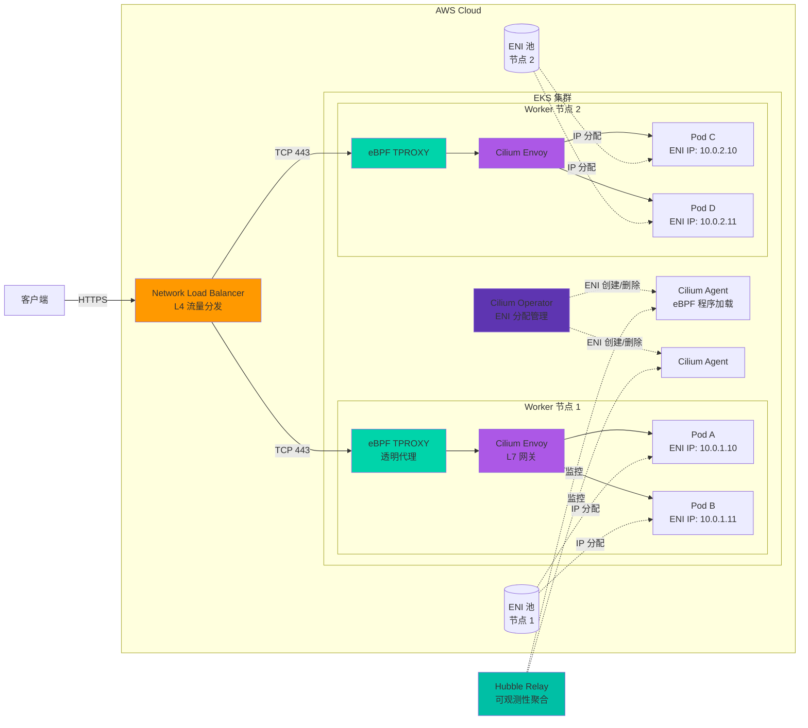
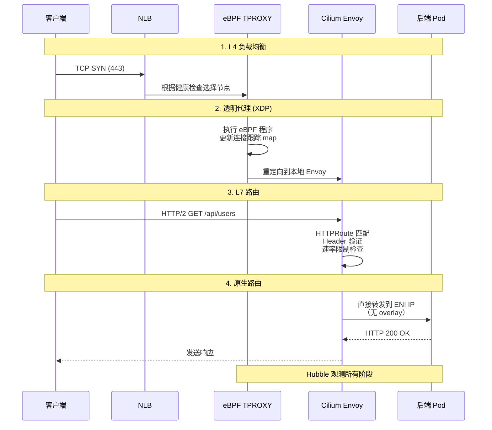
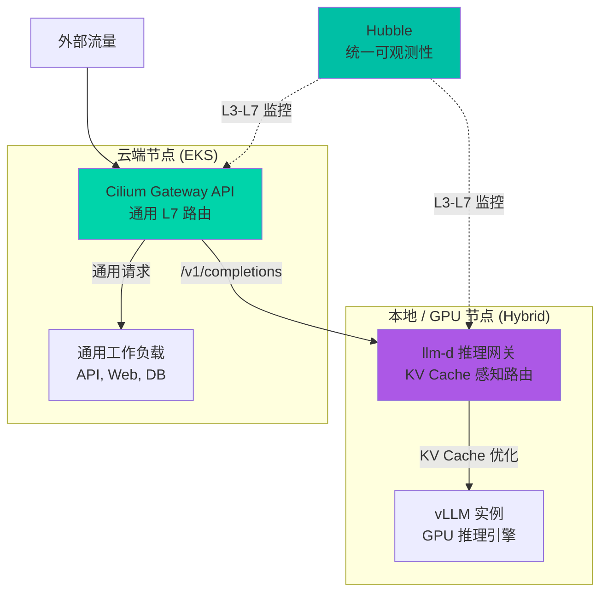

import { EksRequirementsTable } from '@site/src/components/GatewayApiTables';

> 📅 **撰写日期**: 2026-02-14 | **修改日期**: 2026-02-14 | ⏱️ **阅读时间**: 约 10 分钟


:::info
本文档是从 [Gateway API 采用指南](/docs/infrastructure-optimization/gateway-api-adoption-guide) 中提取的高级指南。
:::

Cilium ENI 模式结合 Gateway API 为 Kubernetes 提供了高性能的 AWS 原生网络解决方案。本指南涵盖 ENI 模式架构、高级配置、性能优化和生产最佳实践。

## 1. 什么是 Cilium ENI 模式？

Cilium ENI 模式是一种高性能网络解决方案，直接利用 AWS 的 Elastic Network Interface 为 Pod 分配 VPC IP 地址。与传统的 overlay 网络不同，ENI 模式提供以下特性。

### 核心特性

**直接使用 AWS ENI**<br/>
每个 Pod 获得一个实际的 VPC IP 地址，完全集成到 AWS 网络栈中。这使得 Pod 可以直接使用 Security Groups、NACLs 和 VPC Flow Logs 等 AWS 原生网络功能。

**基于 eBPF 的高性能网络**<br/>
Cilium 利用 Linux 内核的 eBPF（extended Berkeley Packet Filter）技术在内核层面进行数据包处理。与传统的基于 iptables 的方案相比，性能提升 10 倍以上，同时最大限度地降低 CPU 开销。


**原生路由（消除 Overlay 开销）**<br/>
直接使用 VPC 路由表，无需 VXLAN 或 Geneve 等 overlay 封装。这最大限度地减少了网络跳数，从根本上防止了 MTU 问题。

:::tip
Cilium ENI 模式是在 AWS EKS 上实现最佳性能的推荐配置。根据 Datadog 的基准测试，ENI 模式与 overlay 模式相比可降低 40% 的延迟并提升 35% 的吞吐量。
:::

## 2. 架构概览

Cilium ENI 模式与 Gateway API 组合的架构配置如下。



### 主要组件

**1. Network Load Balancer (NLB)**
- AWS 托管 L4 负载均衡器
- 极低延迟（微秒级）
- 支持跨可用区负载均衡
- 可分配静态 IP 或 Elastic IP
- 支持 TLS 透传模式

**2. eBPF TPROXY（透明代理）**
- 在 XDP（eXpress Data Path）层拦截数据包
- 通过内核旁路实现超低延迟处理
- 连接跟踪表以 eBPF maps 方式管理
- 每个 CPU 核心独立处理（无锁设计）

**3. Cilium Envoy（L7 网关）**
- 基于 Envoy Proxy 的 L7 处理引擎
- 实现 HTTPRoute、TLSRoute 等 Gateway API 资源
- 动态监听器/路由配置（xDS API）
- 请求/响应转换、Header 操作、速率限制

**4. Cilium Operator**
- ENI 创建和删除编排
- IP 地址池管理（包括 Prefix Delegation）
- 集群范围的策略同步
- CiliumNode CRD 状态管理

**5. Cilium Agent (DaemonSet)**
- 在每个节点上加载和管理 eBPF 程序
- CNI 插件实现
- Endpoint 状态追踪
- 网络策略执行

**6. ENI (Elastic Network Interface)**
- AWS VPC 网络接口
- 每种实例类型有最大 ENI 数量限制（如 m5.large = 3）
- 每个 ENI 最大 IP 数量（如 m5.large = 10/ENI）
- 使用 Prefix Delegation 时，每个 ENI 最多 16 个 /28 块

**7. Hubble（可观测性）**
- 实时网络流量可视化
- 自动生成服务依赖关系图
- L7 协议可见性（HTTP、gRPC、Kafka、DNS）
- Prometheus 指标导出

### 流量处理四阶段



**阶段 1：L4 负载均衡（NLB）**
- 接收客户端的 TCP 连接请求
- 根据 Target Group 健康检查状态选择健康节点
- 使用 Flow Hash 算法（基于五元组）维持连接持久性

**阶段 2：透明代理（eBPF TPROXY）**
- XDP hook 在网络驱动层拦截数据包
- 更新 eBPF 连接跟踪 map（O(1) 查找）
- 重定向到本地 Cilium Envoy（同一节点）
- 不经过内核栈（超低延迟）

**阶段 3：L7 路由（Cilium Envoy）**
- HTTPRoute 规则匹配（路径、Header、方法）
- 速率限制、认证策略执行
- 请求转换（Header 添加/删除、URL 重写）
- 后端选择（加权负载均衡）

**阶段 4：原生路由（ENI 直连）**
- 直接转发到 Pod 的 ENI IP（无 VXLAN/Geneve）
- 基于 VPC 路由表转发
- Pod 级别的 Security Group 执行
- Hubble 记录所有流量（L3/L4/L7 元数据）

## 3. 安装与配置

### 前置要求

```bash
# 必需工具
- eksctl >= 0.167.0
- kubectl >= 1.28
- helm >= 3.12
- AWS CLI >= 2.13

# 必需的 AWS 权限
- ec2:CreateNetworkInterface
- ec2:AttachNetworkInterface
- ec2:DeleteNetworkInterface
- ec2:DescribeNetworkInterfaces
- ec2:AssignPrivateIpAddresses
```

### 步骤 1：使用 ENI 模式创建 EKS 集群

```bash
# 创建不包含 AWS VPC CNI 的 EKS 集群
eksctl create cluster \
  --name cilium-gateway-demo \
  --region us-west-2 \
  --version 1.32 \
  --nodegroup-name workers \
  --node-type m5.xlarge \
  --nodes 3 \
  --without-nodegroup \
  --vpc-cidr 10.0.0.0/16

# 禁用 AWS VPC CNI 后创建节点组
kubectl -n kube-system delete daemonset aws-node

eksctl create nodegroup \
  --cluster cilium-gateway-demo \
  --name cilium-workers \
  --node-type m5.xlarge \
  --nodes 3 \
  --nodes-min 3 \
  --nodes-max 6 \
  --node-labels role=worker
```

### 步骤 2：使用 ENI 模式安装 Cilium

```bash
# 添加 Cilium Helm 仓库
helm repo add cilium https://helm.cilium.io/
helm repo update

# 使用 ENI 模式安装 Cilium
helm install cilium cilium/cilium \
  --version 1.19.0 \
  --namespace kube-system \
  --set eni.enabled=true \
  --set ipam.mode=eni \
  --set eni.updateEC2AdapterLimitViaAPI=true \
  --set eni.awsEnablePrefixDelegation=true \
  --set tunnel=disabled \
  --set gatewayAPI.enabled=true \
  --set kubeProxyReplacement=true \
  --set k8sServiceHost=<API_SERVER_ENDPOINT> \
  --set k8sServicePort=443

# 等待 Cilium 就绪
kubectl -n kube-system rollout status ds/cilium
```

**关键配置选项：**

<EksRequirementsTable locale="en" />

### 步骤 3：安装 Gateway API CRD

```bash
# 安装 Gateway API v1.4.0 CRD
kubectl apply -f https://github.com/kubernetes-sigs/gateway-api/releases/download/v1.4.0/standard-install.yaml

# 验证 CRD 已安装
kubectl get crd | grep gateway.networking.k8s.io
```

### 步骤 4：创建 GatewayClass

```yaml
apiVersion: gateway.networking.k8s.io/v1
kind: GatewayClass
metadata:
  name: cilium
spec:
  controllerName: io.cilium/gateway-controller
```

### 步骤 5：创建带有 NLB 的 Gateway

```yaml
apiVersion: gateway.networking.k8s.io/v1
kind: Gateway
metadata:
  name: production-gateway
  namespace: gateway-system
  annotations:
    # 使用 AWS NLB
    service.beta.kubernetes.io/aws-load-balancer-type: "nlb"
    # 启用跨可用区负载均衡
    service.beta.kubernetes.io/aws-load-balancer-cross-zone-load-balancing-enabled: "true"
    # 分配 Elastic IP
    service.beta.kubernetes.io/aws-load-balancer-eip-allocations: eipalloc-xxxxx,eipalloc-yyyyy
spec:
  gatewayClassName: cilium
  listeners:
  - name: https
    protocol: HTTPS
    port: 443
    hostname: "*.example.com"
    tls:
      mode: Terminate
      certificateRefs:
      - name: tls-cert
        kind: Secret
```

### 步骤 6：部署示例应用

```yaml
apiVersion: apps/v1
kind: Deployment
metadata:
  name: echo-server
  namespace: default
spec:
  replicas: 3
  selector:
    matchLabels:
      app: echo
  template:
    metadata:
      labels:
        app: echo
    spec:
      containers:
      - name: echo
        image: ealen/echo-server:latest
        ports:
        - containerPort: 80
---
apiVersion: v1
kind: Service
metadata:
  name: echo-service
spec:
  selector:
    app: echo
  ports:
  - port: 80
    targetPort: 80
```

### 步骤 7：创建 HTTPRoute

```yaml
apiVersion: gateway.networking.k8s.io/v1
kind: HTTPRoute
metadata:
  name: echo-route
  namespace: default
spec:
  parentRefs:
  - name: production-gateway
    namespace: gateway-system
    sectionName: https
  hostnames:
  - "echo.example.com"
  rules:
  - matches:
    - path:
        type: PathPrefix
        value: /
    backendRefs:
    - name: echo-service
      port: 80
```

### 步骤 8：验证

```bash
# 检查 Gateway 状态
kubectl get gateway -n gateway-system

# 获取 NLB 端点
NLB_ENDPOINT=$(kubectl get svc -n gateway-system -l "gateway.networking.k8s.io/gateway-name=production-gateway" -o jsonpath='{.items[0].status.loadBalancer.ingress[0].hostname}')

# 测试路由
curl -H "Host: echo.example.com" https://$NLB_ENDPOINT/

# 查看 Hubble 流量
kubectl exec -n kube-system ds/cilium -- hubble observe --follow
```

## 4. 性能优化

### ENI Prefix Delegation 配置

Prefix Delegation 允许每个 ENI 分配 16 个 IP 地址（/28 块），显著提高 Pod 密度。

```yaml
# Cilium ConfigMap
apiVersion: v1
kind: ConfigMap
metadata:
  name: cilium-config
  namespace: kube-system
data:
  # 启用 prefix delegation
  enable-ipv4: "true"
  ipam: "eni"
  eni-tags: "cluster=production"
  aws-enable-prefix-delegation: "true"

  # 预分配 ENI/IP
  eni-max-above-watermark: "2"
  eni-min-allocate: "10"

  # 释放未使用的 ENI
  eni-gc-interval: "5m"
  eni-gc-tags: "cluster=production,state=available"
```

**收益：**
- **之前**：m5.xlarge（3 ENI × 15 IP）= 最多 45 个 Pod
- **之后**：m5.xlarge（3 ENI × 16 prefix × 16 IP）= 最多 768 个 Pod

### eBPF Host Routing 优化

```bash
# 启用 eBPF host routing
helm upgrade cilium cilium/cilium \
  --namespace kube-system \
  --reuse-values \
  --set bpf.hostRouting=true \
  --set bpf.masquerade=true
```

**收益：**
- 通过 eBPF 直接路由（无 iptables）
- 延迟降低 50%
- CPU 使用率降低 40%

### XDP 加速

```bash
# 启用 XDP 加速（需要 kernel 5.10+）
helm upgrade cilium cilium/cilium \
  --namespace kube-system \
  --reuse-values \
  --set loadBalancer.acceleration=native \
  --set loadBalancer.mode=dsr
```

**收益：**
- 在网络驱动层处理数据包
- P99 延迟低于 5ms
- 吞吐量提升 2 倍

## 5. 基于 Hubble 的可观测性

### 安装 Hubble UI

```bash
# 启用 Hubble 和 UI
helm upgrade cilium cilium/cilium \
  --namespace kube-system \
  --reuse-values \
  --set hubble.enabled=true \
  --set hubble.relay.enabled=true \
  --set hubble.ui.enabled=true

# 端口转发 Hubble UI
kubectl port-forward -n kube-system svc/hubble-ui 12000:80

# 访问：http://localhost:12000
```

### Hubble CLI 可观测性

```bash
# 安装 Hubble CLI
HUBBLE_VERSION=$(curl -s https://raw.githubusercontent.com/cilium/hubble/master/stable.txt)
curl -L --remote-name-all https://github.com/cilium/hubble/releases/download/$HUBBLE_VERSION/hubble-linux-amd64.tar.gz
tar zxf hubble-linux-amd64.tar.gz
sudo mv hubble /usr/local/bin

# 端口转发 Hubble Relay
kubectl port-forward -n kube-system svc/hubble-relay 4245:80

# 观测流量
hubble observe --server localhost:4245

# 按命名空间过滤
hubble observe --namespace default

# 按标签过滤
hubble observe --from-label app=frontend --to-label app=backend

# 查看 L7 HTTP 流量
hubble observe --protocol http

# DNS 查询可见性
hubble observe --protocol dns
```

### 服务拓扑可视化

```bash
# 生成服务依赖关系图
hubble observe --namespace default -o json | \
  jq -r '[.source.labels[] as $s | .destination.labels[] as $d | "\($s) -> \($d)"]' | \
  sort | uniq

# 示例输出：
# app=frontend -> app=backend
# app=backend -> app=database
# app=gateway -> app=frontend
```

## 6. 生产最佳实践

### 1. ENI 配额管理

```bash
# 检查当前 ENI 限制
aws service-quotas get-service-quota \
  --service-code ec2 \
  --quota-code L-DF5E4CA3 \
  --region us-west-2

# 如需要可申请配额增加
aws service-quotas request-service-quota-increase \
  --service-code ec2 \
  --quota-code L-DF5E4CA3 \
  --desired-value 5000 \
  --region us-west-2
```

### 2. Security Group 优化

```yaml
# 为 Pod 应用 Security Group
apiVersion: v1
kind: Pod
metadata:
  name: secure-pod
  annotations:
    vpc.amazonaws.com/security-groups: "sg-xxxxx"
spec:
  containers:
  - name: app
    image: nginx
```

### 3. 监控告警

```yaml
# Cilium 的 Prometheus 告警
apiVersion: v1
kind: ConfigMap
metadata:
  name: cilium-alerts
  namespace: kube-system
data:
  cilium.rules: |
    groups:
    - name: cilium
      rules:
      # ENI 分配失败
      - alert: CiliumENIAllocationFailure
        expr: rate(cilium_operator_eni_allocation_failure_total[5m]) > 0
        annotations:
          summary: "ENI 分配失败"

      # 高丢包率
      - alert: CiliumHighPacketDrop
        expr: rate(cilium_drop_count_total[5m]) > 100
        annotations:
          summary: "检测到高丢包率"

      # eBPF 程序加载失败
      - alert: CiliumBPFProgramFailed
        expr: cilium_bpf_map_ops_total{outcome="failure"} > 0
        annotations:
          summary: "eBPF 程序操作失败"
```

### 4. 灾难恢复

```bash
# 备份 Cilium 配置
kubectl get ciliumconfig -A -o yaml > cilium-config-backup.yaml
kubectl get gatewayclass,gateway,httproute -A -o yaml > gateway-backup.yaml

# 备份 Hubble 数据（可选）
kubectl exec -n kube-system deployment/hubble-relay -- hubble observe -o jsonpb > hubble-flows-backup.json
```

## 7. 混合节点架构与 AI/ML 工作负载

当使用 EKS Hybrid Nodes 集成云端和本地（或 GPU 专用数据中心）环境时，Cilium 在 CNI 统一和统一可观测性方面发挥着关键作用。

### 为什么 Cilium 对混合节点至关重要

AWS VPC CNI **仅在 VPC 内的 EC2 实例上运行**。当本地 GPU 服务器通过 EKS Hybrid Nodes 加入集群时，VPC CNI 无法使用，导致云端和本地节点之间出现 CNI 割裂。

在混合节点环境中，有三种主要的 CNI 配置方式。

| 方面 | VPC CNI + Calico | VPC CNI + Cilium | Cilium 统一（推荐） |
|--------|-----------------|-----------------|------------------------------|
| 云端节点 CNI | VPC CNI | VPC CNI | Cilium ENI 模式 |
| 本地节点 CNI | Calico（单独安装） | Cilium（单独安装） | Cilium VXLAN/Native |
| 本地网络 | Calico VXLAN/BGP | Cilium VXLAN 或 BGP | Cilium VXLAN 或 BGP |
| CNI 统一 | ❌ 2 种 CNI | ❌ 2 种 CNI | ✅ 单一 CNI |
| 网络策略引擎 | 双引擎（VPC CNI + Calico） | 双引擎（VPC CNI + Cilium） | 单一 eBPF 引擎 |
| 可观测性 | CloudWatch + 独立工具 | CloudWatch + Hubble（仅本地） | Hubble 统一（整个集群） |
| Gateway API | 需要单独实现 | Cilium Gateway API 仅限本地 | Cilium Gateway API 内置 |
| eBPF 加速 | ❌ 云端节点不支持 | ❌ 云端节点不支持 | ✅ 所有节点均支持 eBPF |
| 运维复杂度 | 高（2 种 CNI + 2 种策略引擎） | 中（2 种 CNI，利用 Cilium 经验） | 低（单一技术栈） |

:::warning 本地节点的 Overlay 网络
无论选择哪种 CNI，**overlay 网络（VXLAN/Geneve）是本地节点的默认配置**。在没有 AWS VPC 路由表的情况下，Pod CIDR 通信需要封装。

要消除 overlay 开销，需要 **BGP 对等**。Cilium BGP Control Plane v2 可以向本地路由器通告 Pod CIDR 以实现原生路由，但这需要本地网络基础设施支持 BGP。
:::

:::info Admission Webhook 路由问题与解决方案
为使 EKS 控制平面（在 AWS VPC 中）能够到达混合节点上的 webhook Pod，Pod CIDR 必须可路由。[AWS 官方文档](https://docs.aws.amazon.com/eks/latest/userguide/hybrid-nodes-webhooks.html)提供了两种方式。

**当 Pod CIDR 可路由时：**

- BGP（推荐）、静态路由或自定义路由来通告本地 Pod CIDR

**当 Pod CIDR 不可路由时（无 BGP）：**

- **在云端节点上运行 webhook**（AWS 官方推荐）— 使用 `nodeSelector` 或 `nodeAffinity` 将 webhook Pod 固定到云端节点。API server 可以在 VPC 内直接访问它们。
- **使用 Cilium overlay（VXLAN）模式作为整个集群的单一 CNI** — [参考文章](https://medium.com/@the.jfnadeau/eks-cilium-as-the-only-cni-driver-with-simplified-hybrid-nodes-and-admission-webhooks-routing-1f351d11f9dd)。在 overlay 模式下，只需要节点间的单播通信，因此 API server 可以通过 VXLAN 隧道到达 webhook Pod。但这会牺牲云端节点上 ENI 原生路由的优势。
:::

:::tip Cilium 统一方案的 IPAM 注意事项
Cilium 的 `ipam.mode=eni` **仅在 AWS EC2 实例上运行**。对于包含本地节点的混合集群，有三种方式实现 Cilium 统一：

1. **ClusterMesh（推荐）**：分别运行云端集群（ENI 模式）和本地集群（cluster-pool 模式），通过 [Cilium ClusterMesh](https://docs.cilium.io/en/stable/network/clustermesh/) 连接。每个环境使用优化的 IPAM，同时保持统一的可观测性。
2. **Multi-pool IPAM**：在单一集群中使用基于节点标签的 IPAM 池分配（Cilium 1.15+）。云端节点使用 ENI 池，本地节点使用 cluster-pool。
3. **统一 Cluster-pool IPAM**：放弃 ENI 模式，在整个集群中使用 `cluster-pool` + VXLAN。最简单的方式，但会失去云端 ENI 原生路由的优势。
:::

### 推荐架构：Cilium + Cilium Gateway API + llm-d

对于混合节点上的 AI/ML 推理工作负载，此架构**以最少的组件实现最优性能**。



**组件角色：**

| 组件 | 角色 | 范围 |
|-----------|------|-------|
| **Cilium CNI** | 统一的云端+本地网络 | 整个集群 |
| **Cilium Gateway API** | 通用 L7 路由（HTTPRoute、TLS 终止） | 南北向流量 |
| **llm-d** | LLM 推理专用网关（KV Cache 感知、前缀感知） | 仅 AI 推理流量 |
| **Hubble** | 完整的 L3-L7 流量可观测性 | 整个集群 |

:::warning llm-d 不是通用 Gateway API 实现
llm-d 基于 Envoy 的推理网关**专为 LLM 推理请求设计**。对于通用的 Web/API 流量路由，请使用 Cilium Gateway API 或其他通用 Gateway API 实现。详见 [llm-d 文档](/docs/agentic-ai-platform/llm-d-eks-automode)。
:::

### 备选架构对比

| 选项 | 技术栈 | 优点 | 缺点 |
|--------|-------|------|------|
| **选项 1（推荐）** | Cilium CNI + Cilium Gateway API + llm-d | 组件最少、Hubble 统一可观测性、单一供应商 | Cilium Gateway API 的 L7 功能可能少于 Envoy Gateway |
| **选项 2** | Cilium CNI + Envoy Gateway + llm-d | CNCF 标准、丰富的 L7 功能 | 需要管理额外组件（Envoy Gateway） |
| **选项 3** | Cilium CNI + kgateway + llm-d | kgateway 的 AI 路由功能 | 组件最多、需要许可证验证 |
| **选项 4（未来）** | Cilium CNI + Gateway API Inference Extension | 所有流量使用单一 Gateway、标准化 InferenceModel/InferencePool CRD | 仍处于 alpha 阶段（预计 2025 Q3 进入 beta） |

### Gateway API Inference Extension（未来方向）

[Gateway API Inference Extension](https://gateway-api.sigs.k8s.io/geps/gep-3567/) 为 Gateway API 添加了 AI/ML 推理专用资源。一旦 GA，**单一通用 Gateway API 实现即可同时处理常规流量和 AI 推理流量**。

**关键 CRD：**

```yaml
# InferenceModel：定义 AI 模型端点
apiVersion: inference.gateway.networking.k8s.io/v1alpha1
kind: InferenceModel
metadata:
  name: llama-3-70b
spec:
  modelName: meta-llama/Llama-3-70B-Instruct
  poolRef:
    name: gpu-pool
  criticality: Critical

---
# InferencePool：定义 GPU 后端池
apiVersion: inference.gateway.networking.k8s.io/v1alpha1
kind: InferencePool
metadata:
  name: gpu-pool
spec:
  targetPortNumber: 8000
  selector:
    matchLabels:
      app: vllm
```

**当前状态（2025）：**

- `InferenceModel`、`InferencePool` CRD：v1alpha1
- 实现方案：llm-d、Envoy Gateway、kgateway 提供实验性支持
- 预计 GA：2026 年上半年

:::tip 当前推荐策略
在 Gateway API Inference Extension 达到 GA 之前，采用**选项 1（Cilium + Cilium Gateway API + llm-d）**，待标准稳定后再逐步将 llm-d 迁移到基于 Inference Extension 的配置。
:::

## 相关文档

- [Gateway API 采用指南](/docs/infrastructure-optimization/gateway-api-adoption-guide) - Gateway API 采用策略完整指南
- [llm-d + EKS 部署指南](/docs/agentic-ai-platform/llm-d-eks-automode) - llm-d 分布式推理栈配置
- [Cilium 官方文档](https://docs.cilium.io/) - Cilium 安装、配置和运维
- [Gateway API 官方文档](https://gateway-api.sigs.k8s.io/) - Kubernetes Gateway API 规范和资源
- [Gateway API Inference Extension](https://gateway-api.sigs.k8s.io/geps/gep-3567/) - AI/ML 推理专用 Gateway API 扩展
- [AWS EKS 最佳实践](https://aws.github.io/aws-eks-best-practices/) - EKS 最佳实践指南
