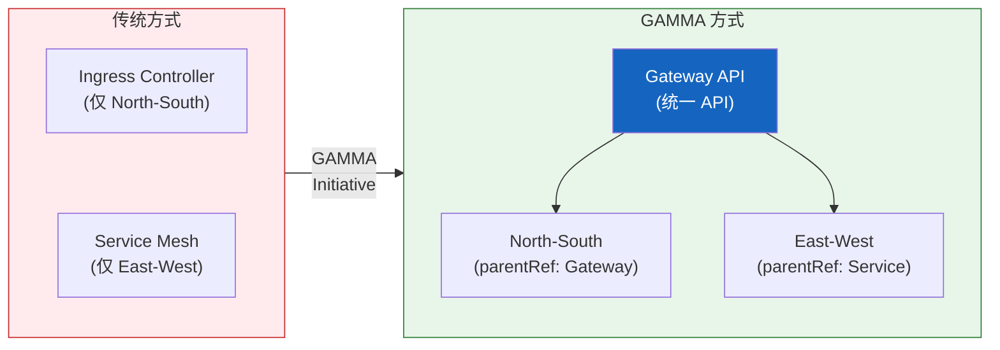

import {
  GammaInfographic,
  GammaSupportTable,
} from '@site/src/components/GatewayApiTables';

# GAMMA Initiative — 服务网格集成的未来

## 4.1 什么是 GAMMA？

**GAMMA（Gateway API for Mesh Management and Administration）** 是将 Gateway API 扩展到服务网格领域的倡议。

- **GA 达成**：Gateway API v1.1.0（2025年10月）
- **集成范围**：North-South（入口流量）+ East-West（服务网格）流量
- **核心概念**：过去，入口控制器和服务网格拥有完全独立的配置体系，而 GAMMA 将其统一为单一 API
- **基于角色的配置**：将 Gateway API 的角色分离原则同样应用于网格流量

GAMMA 的出现使集群运维人员不再需要学习和管理两种不同的 API。入口流量和网格流量都可以使用相同的 Gateway API 资源进行管理。



## 4.2 核心目标 & 网格配置模式

<GammaInfographic locale="zh" />

## 4.3 GAMMA 支持现状

以下是主要服务网格实现的 GAMMA 支持现状。

<GammaSupportTable locale="zh" />

:::tip AWS 环境中的 GAMMA
在 AWS 环境中，可以使用 **VPC Lattice + ACK** 无需 Sidecar 即可实现 GAMMA 模式。提供基于 IAM 的 mTLS、CloudWatch/X-Ray 可观测性以及通过 AWS FIS 进行故障注入等完整的托管服务网格功能。
:::

## 4.4 GAMMA 的优势

### 1. 缩短学习曲线

团队只需学习一种 API（Gateway API）即可管理入口流量和网格流量。

### 2. 配置一致性

使用相同的 YAML 结构和模式管理 North-South/East-West 所有流量。

```yaml
# 入口流量 (North-South)
spec:
  parentRefs:
    - kind: Gateway
      name: external-gateway

# 网格流量 (East-West)
spec:
  parentRefs:
    - kind: Service
      name: backend-service
```

### 3. 基于角色的分离

基础设施团队管理 Gateway、开发团队管理 HTTPRoute 的明确职责分离同样适用于网格流量。

### 4. 厂商中立性

可以使用相同的 API 管理多种网格实现，防止厂商锁定。
