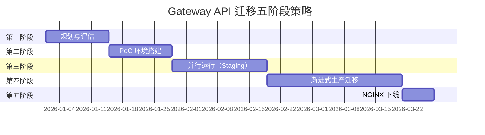

import Tabs from '@theme/Tabs';
import TabItem from '@theme/TabItem';

> 📅 **撰写日期**: 2026-02-14 | **修改日期**: 2026-02-14 | ⏱️ **阅读时间**: 约 3 分钟


:::info
本文档是 [Gateway API 采用指南](/docs/infrastructure-optimization/gateway-api-adoption-guide) 的高级指南。提供从 NGINX Ingress 到 Gateway API 的实际迁移策略。
:::

## 1. 迁移方法

Gateway API 迁移需要分阶段、风险最小化的方法。以下五阶段策略可实现零停机迁移。



---

## 2. 五阶段详细计划

<Tabs>
<TabItem value="phase1" label="第一阶段：准备" default>

**第一阶段：规划与评估（2 周）**

**目标：**
- 盘点当前 NGINX Ingress 资源
- 评估技术选型
- 制定风险管理计划

**任务：**

1. **现状分析**
```bash
# 导出所有 Ingress 资源
kubectl get ingress -A -o yaml > nginx-ingress-inventory.yaml

# 分析注解使用情况
kubectl get ingress -A -o json | \
  jq -r '.items[].metadata.annotations | keys[]' | \
  sort | uniq -c | sort -rn

# 检查 TLS 证书数量
kubectl get ingress -A -o json | \
  jq -r '.items[].spec.tls[].secretName' | sort | uniq | wc -l
```

2. **技术选型**
- 回顾第 5 节方案对比
- 进行利益相关者访谈
- 评估预算和运维能力

3. **风险评估**
```yaml
# 风险登记表示例
risks:
  - id: R1
    description: "迁移期间的流量丢失"
    probability: Medium
    impact: Critical
    mitigation: "蓝绿部署，渐进式流量切换"

  - id: R2
    description: "性能下降"
    probability: Low
    impact: High
    mitigation: "迁移前基准测试，回滚计划"

  - id: R3
    description: "TLS 证书管理问题"
    probability: Medium
    impact: Medium
    mitigation: "在 PoC 中测试，使用 cert-manager 自动化"
```

**交付物：**

- [ ] NGINX Ingress 清单表格
- [ ] 技术选型决策文档
- [ ] 迁移项目计划
- [ ] 风险登记表与缓解策略

</TabItem>
<TabItem value="phase2" label="第二阶段：搭建">

**第二阶段：PoC 环境搭建（2 周）**

**目标：**
- 在隔离环境中验证选定方案
- 开发迁移脚本
- 培训团队

**任务：**

1. **创建 PoC 集群**
```bash
# 创建测试 EKS 集群
eksctl create cluster \
  --name gateway-api-poc \
  --region us-west-2 \
  --version 1.32 \
  --nodegroup-name poc-workers \
  --node-type m5.large \
  --nodes 2
```

2. **安装选定方案**（示例：Cilium）
```bash
# 安装 Cilium Gateway API
helm install cilium cilium/cilium \
  --namespace kube-system \
  --set gatewayAPI.enabled=true \
  --set kubeProxyReplacement=true
```

3. **功能验证**
- 将 3-5 个代表性 Ingress 资源迁移到 HTTPRoute
- 测试认证、速率限制、URL 重写
- 性能基准测试（基线 vs Gateway API）

4. **文档记录**
```markdown
# PoC 报告模板

## 测试摘要
- **持续时间**: 2026-01-15 至 2026-01-28
- **方案**: Cilium Gateway API v1.19
- **测试用例**: 12 个（11 通过，1 个问题）

## 性能结果
| 指标 | NGINX Ingress | Cilium Gateway | 改进 |
|--------|---------------|----------------|-------------|
| P95 延迟 | 45ms | 12ms | 降低 73% |
| RPS（单实例） | 8,500 | 24,000 | 提升 182% |

## 遇到的问题
1. **问题**: 速率限制配置复杂度
   **解决方案**: 创建辅助脚本（见 scripts/rate-limit-helper.sh）

## 建议
✅ 进入第三阶段（并行运行）
```

**交付物：**

- [ ] PoC 集群运行选定方案
- [ ] 迁移脚本模板
- [ ] PoC 测试报告
- [ ] 团队培训材料

</TabItem>
<TabItem value="phase3" label="第三阶段：并行运行">

**第三阶段：并行运行（Staging）（3 周）**

**目标：**
- 在 staging 环境中将 Gateway API 与 NGINX 并行部署
- 使用类生产流量验证
- 完善运维流程

**任务：**

1. **在 Staging 中部署 Gateway API**
```yaml
# GatewayClass
apiVersion: gateway.networking.k8s.io/v1
kind: GatewayClass
metadata:
  name: cilium
spec:
  controllerName: io.cilium/gateway-controller

---
# Gateway（与 NGINX 并行）
apiVersion: gateway.networking.k8s.io/v1
kind: Gateway
metadata:
  name: staging-gateway
  namespace: gateway-system
spec:
  gatewayClassName: cilium
  listeners:
  - name: https
    protocol: HTTPS
    port: 8443  # 与 NGINX (443) 使用不同端口
    tls:
      certificateRefs:
      - name: staging-tls
```

2. **流量镜像**（如支持）
```yaml
# AWS ALB 示例：镜像 10% 流量到 Gateway API
apiVersion: gateway.networking.k8s.io/v1
kind: HTTPRoute
metadata:
  name: mirrored-route
spec:
  rules:
  - backendRefs:
    - name: app-service
      port: 80
      weight: 90  # 90% 到 NGINX
    - name: app-service-via-gateway
      port: 80
      weight: 10  # 10% 到 Gateway API（测试）
```

3. **监控配置**
```yaml
# Cilium 的 Prometheus ServiceMonitor
apiVersion: monitoring.coreos.com/v1
kind: ServiceMonitor
metadata:
  name: cilium-gateway
spec:
  selector:
    matchLabels:
      app.kubernetes.io/name: cilium
  endpoints:
  - port: prometheus
    interval: 30s
```

**交付物：**

- [ ] Gateway API 在 staging 中部署完成
- [ ] 7 天并行运行数据
- [ ] 监控仪表板配置完成
- [ ] 事件响应流程文档化

</TabItem>
<TabItem value="phase4" label="第四阶段：切换">

**第四阶段：渐进式生产迁移（4 周）**

**目标：**
- 零停机迁移生产流量
- 监控并验证每个步骤
- 具备快速回滚能力

**任务：**

1. **第 1 周：部署 Gateway API（0% 流量）**
```bash
# 部署 Gateway API 基础设施
kubectl apply -f production/gatewayclass.yaml
kubectl apply -f production/gateway.yaml

# 验证就绪状态
kubectl wait --for=condition=Ready gateway/production-gateway -n gateway-system --timeout=300s
```

2. **第 2 周：金丝雀迁移（10% 流量）**
```yaml
# 90/10 流量分配的 HTTPRoute
apiVersion: gateway.networking.k8s.io/v1
kind: HTTPRoute
metadata:
  name: api-canary
spec:
  parentRefs:
  - name: production-gateway
  rules:
  - backendRefs:
    - name: api-service-nginx
      port: 80
      weight: 90  # NGINX Ingress
    - name: api-service-gateway
      port: 80
      weight: 10  # Gateway API
```

**监控：**
```bash
# 对比错误率
kubectl top pods -l app=api-service
kubectl logs -l app=api-service --tail=1000 | grep ERROR | wc -l

# 延迟对比
curl -w "@curl-format.txt" https://api.example.com/health
```

3. **第 3 周：增加到 50% 流量**
```bash
# 更新 HTTPRoute 权重
kubectl patch httproute api-canary --type=json \
  -p='[{"op": "replace", "path": "/spec/rules/0/backendRefs/0/weight", "value": 50},
       {"op": "replace", "path": "/spec/rules/0/backendRefs/1/weight", "value": 50}]'

# 监控 48 小时
```

4. **第 4 周：完成迁移（100% 流量）**
```bash
# 更新到 100% Gateway API
kubectl patch httproute api-canary --type=json \
  -p='[{"op": "replace", "path": "/spec/rules/0/backendRefs/0/weight", "value": 0},
       {"op": "replace", "path": "/spec/rules/0/backendRefs/1/weight", "value": 100}]'

# 在进入第五阶段前监控 7 天
```

**回滚计划：**
```bash
# 紧急回滚脚本
#!/bin/bash
# rollback-to-nginx.sh

echo "正在回滚到 NGINX Ingress..."

# 将流量恢复到 100% NGINX
kubectl patch httproute api-canary --type=json \
  -p='[{"op": "replace", "path": "/spec/rules/0/backendRefs/0/weight", "value": 100},
       {"op": "replace", "path": "/spec/rules/0/backendRefs/1/weight", "value": 0}]'

# 验证 NGINX Ingress 健康状态
kubectl get ingress -A
kubectl describe ingress <ingress-name>

echo "回滚完成。请验证流量流向。"
```

**交付物：**

- [ ] 第 1 周：Gateway API 基础设施部署完成（0% 流量）
- [ ] 第 2 周：金丝雀验证完成（10% 流量）
- [ ] 第 3 周：半量迁移验证完成（50% 流量）
- [ ] 第 4 周：完全迁移完成（100% 流量）
- [ ] 迁移期间无 P1/P2 事件

</TabItem>
<TabItem value="phase5" label="第五阶段：完成">

**第五阶段：NGINX 下线（1 周）**

**目标：**
- 安全移除 NGINX Ingress Controller
- 归档配置以供审计
- 关闭迁移项目

**任务：**

1. **最终验证**（第 1-2 天）
```bash
# 验证所有流量已切换到 Gateway API
kubectl get httproute -A

# 检查是否还有剩余的 Ingress 资源
kubectl get ingress -A

# 验证指标
# - 错误率没有增加
# - 延迟在可接受范围内
# - 没有客户投诉
```

2. **归档 NGINX 配置**（第 3 天）
```bash
# 备份所有 NGINX 资源
kubectl get ingress,configmap,secret -A -o yaml > nginx-archive-$(date +%Y%m%d).yaml

# 存储到版本控制
git add nginx-archive-*.yaml
git commit -m "Archive NGINX Ingress configuration before decommission"
git push
```

3. **删除 NGINX 资源**（第 4-5 天）
```bash
# 删除 NGINX Ingress Controller
helm uninstall nginx-ingress -n ingress-nginx

# 删除命名空间
kubectl delete namespace ingress-nginx

# 删除剩余的 Ingress 资源
kubectl delete ingress --all -A

# 验证清理完成
kubectl get all -n ingress-nginx  # 应该为空
```

4. **迁移后回顾**（第 6-7 天）
```yaml
# 迁移回顾模板
## 做得好的方面
- 渐进式流量迁移防止了事故发生
- 监控提供了清晰的可见性
- 团队培训效果良好

## 可改进的方面
- PoC 阶段比预期耗时更长
- 需要更好的权重更新自动化

## 行动项
- [ ] 为未来集群记录迁移流程
- [ ] 为常见 Gateway API 问题创建运维手册
- [ ] 安排 Gateway API 功能的季度培训

## 指标
- **总持续时间**: 11 周（计划 12 周）
- **事件**: 0 个 P1/P2，2 个 P3（均在 1 小时内解决）
- **性能**: 延迟改善 15%
- **成本**: 无变化（Cilium 开源）
```

**交付物：**

- [ ] NGINX Ingress 完全下线
- [ ] 配置已归档到版本控制
- [ ] 迁移后报告
- [ ] 团队回顾完成

</TabItem>
</Tabs>

---

## 相关文档

- **[Gateway API 采用指南](/docs/infrastructure-optimization/gateway-api-adoption-guide)** - Gateway API 迁移完整指南
- **[Cilium ENI 模式 + Gateway API](/docs/infrastructure-optimization/gateway-api-adoption-guide/cilium-eni-gateway-api)** - Cilium 高级配置指南
- [Gateway API 官方文档](https://gateway-api.sigs.k8s.io/)
- [AWS Load Balancer Controller](https://kubernetes-sigs.github.io/aws-load-balancer-controller/)
