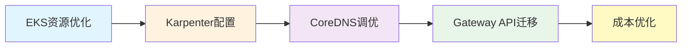

# 基础设施优化

通过先进的Kubernetes基础设施优化技术实现**最大的性能和成本效益**。

## 📚 包含内容

### 🎯 核心优化领域

- **[CoreDNS监控与优化](./coredns-monitoring-optimization)** - DNS性能调优与监控策略
- **[成本管理](./cost-management)** - AWS成本优化与FinOps实践
- **[东西向流量最佳实践](./east-west-traffic-best-practice)** - 集群内部流量优化
- **[EKS资源优化](./eks-resource-optimization)** - 综合性EKS优化指南
- **[Karpenter自动扩缩容](./karpenter-autoscaling)** - 亚秒级自动扩缩容配置

### 🔄 Gateway API采用指南

完整的从NGINX Ingress到Gateway API的迁移路线图：

- **[Gateway API采用指南](./gateway-api-adoption-guide)** - 完整的迁移策略
  - [GAMMA Initiative](./gateway-api-adoption-guide/gamma-initiative) - 服务网格集成
  - [Cilium ENI模式](./gateway-api-adoption-guide/cilium-eni-gateway-api) - 深入eBPF网络
  - [迁移执行策略](./gateway-api-adoption-guide/migration-execution-strategy) - 5阶段迁移流程

## 🎯 主要优势

- **性能提升 2-3倍** - 通过eBPF和内核旁路技术
- **成本降低 40-60%** - 通过Spot实例和智能扩缩容
- **运维自动化** - 减少90%的手动介入
- **零停机迁移** - 渐进式Gateway API采用

## 🛠 技术栈

- **网络**: Cilium、eBPF、Gateway API
- **自动扩缩容**: Karpenter、KEDA
- **可观测性**: Prometheus、Grafana、OpenTelemetry
- **成本**: Kubecost、AWS Cost Explorer

## 📈 成果指标

| 指标 | 改善前 | 改善后 | 提升率 |
|------|--------|--------|--------|
| P95延迟 | 45ms | 12ms | **73%** ⬇️ |
| 每秒请求数 | 8,500 | 24,000 | **182%** ⬆️ |
| 基础设施成本 | $15,000/月 | $9,000/月 | **40%** ⬇️ |
| 扩缩容时间 | 4-5分钟 | 15秒 | **95%** ⬇️ |

## 🚀 快速开始

1. **评估当前状态** - 使用我们的优化检查清单
2. **选择优先领域** - 基于影响分析
3. **实施优化** - 遵循逐步指南
4. **测量改进** - 使用提供的指标

## 💡 推荐学习路径

---

**准备好优化您的Kubernetes基础设施了吗？** 从[EKS资源优化](./eks-resource-optimization)开始您的旅程！