# Karpenter 实现 EKS 超快速自动扩缩容

> 📅 **撰写日期**: 2025-02-09 | **修改日期**: 2026-02-13 | ⏱️ **阅读时间**: 约 5 分钟


> 📅 **发布日期**: 2025年6月30日 | ⏱️ **阅读时间**: 约 10 分钟

## 概述

在现代云原生架构中，10 秒与 3 分钟之间的差异可能意味着数千个失败请求、降级的用户体验和收入损失。本文将展示如何利用 Karpenter 革命性的节点配置方法，结合精心实施的高分辨率指标，在 Amazon EKS 中实现一致的 10 秒以内自动扩缩容。

我们将深入探讨一个经过生产验证的架构，该架构将扩缩容延迟从 180 秒以上降低到 10 秒以内，同时管理跨多个区域（3 个区域、28 个集群）的 15,000 多个 Pod。

## 为什么传统自动扩缩容在速度上不尽人意

在深入解决方案之前，让我们先了解传统方法失败的原因：

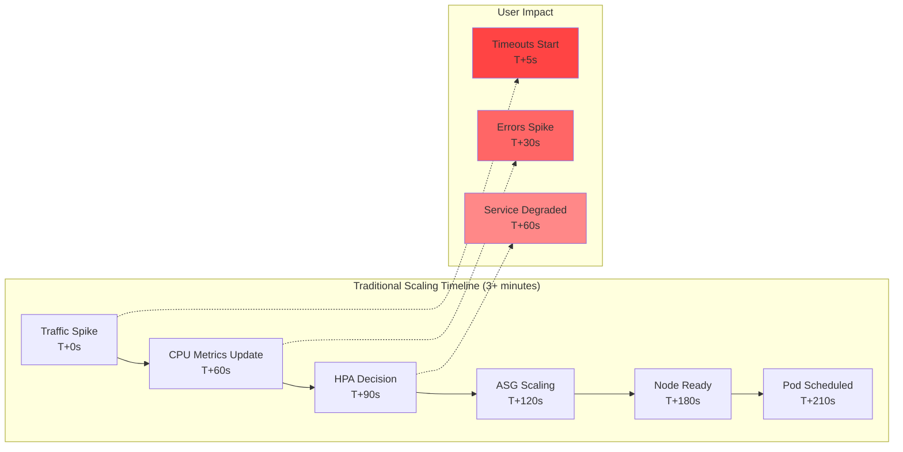

根本问题在于：当 CPU 指标触发扩缩容时，一切已经太迟了。

**当前环境挑战：**

- **全球规模**：3 个区域、28 个 EKS 集群、15,000 多个 Pod 正在运行
- **高流量负载**：每天处理 773,400 个请求
- **延迟问题**：当前 HPA + Karpenter 组合存在 1-3 分钟的扩缩容延迟
- **指标采集延迟**：CloudWatch 指标存在 1-3 分钟的延迟，无法实现实时响应

## Karpenter 革命：直接到底层的配置

Karpenter 消除了 Auto Scaling Group（ASG）抽象层，根据待调度 Pod 的需求直接配置 EC2 实例：

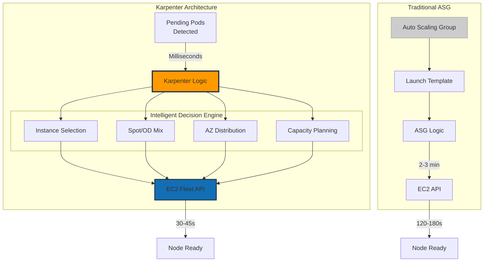

## 高速指标架构：两种方案

实现 10 秒以内的扩缩容需要快速感知。我们对比两种经过验证的架构。

### 方案一：CloudWatch 高分辨率集成

利用 CloudWatch 的高分辨率指标，在 AWS 原生环境中实现优化的扩缩容。

#### 核心组件

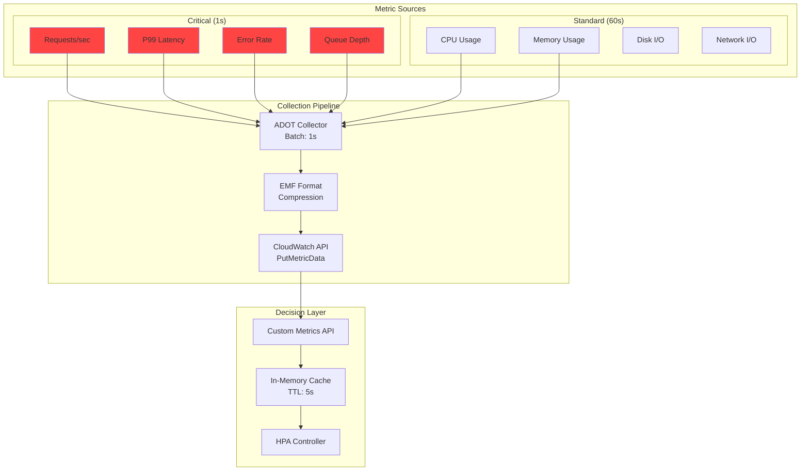

#### 扩缩容时间线（15 秒）

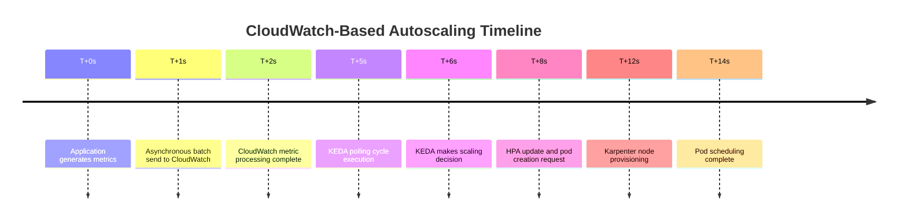

**优势：**

- ✅ **快速指标采集**：1-2 秒低延迟
- ✅ **配置简单**：AWS 原生集成
- ✅ **无运维开销**：无需管理额外基础设施

**劣势：**

- ❌ **吞吐量有限**：每个账户 1,000 TPS
- ❌ **Pod 数量限制**：每个集群最多 5,000 个 Pod
- ❌ **指标成本较高**：AWS CloudWatch 指标定价

### 方案二：ADOT + Prometheus 架构

基于开源基础，结合 AWS Distro for OpenTelemetry（ADOT）和 Prometheus 构建高性能指标管道。

#### 核心组件

- **ADOT Collector**：DaemonSet 和 Sidecar 混合部署
- **Prometheus**：HA 高可用配置，集成 Remote Storage
- **Thanos Query 层**：多集群全局视图
- **KEDA Prometheus Scaler**：2 秒间隔的高速轮询
- **Grafana Mimir**：长期存储和快速查询引擎

#### 扩缩容时间线（70 秒）

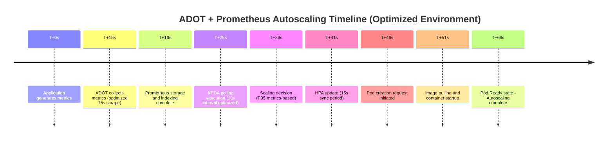

**优势：**

- ✅ **高吞吐量**：支持 100,000+ TPS
- ✅ **可扩展性强**：每个集群支持 20,000 个以上的 Pod
- ✅ **指标成本低**：仅需存储成本（自主管理）
- ✅ **完全可控**：完全的配置和优化自由度

**劣势：**

- ❌ **配置复杂**：需要管理额外组件
- ❌ **运维复杂度高**：需要 HA 配置、备份恢复、性能调优
- ❌ **需要专业知识**：Prometheus 运维经验必不可少

### 成本优化的指标策略

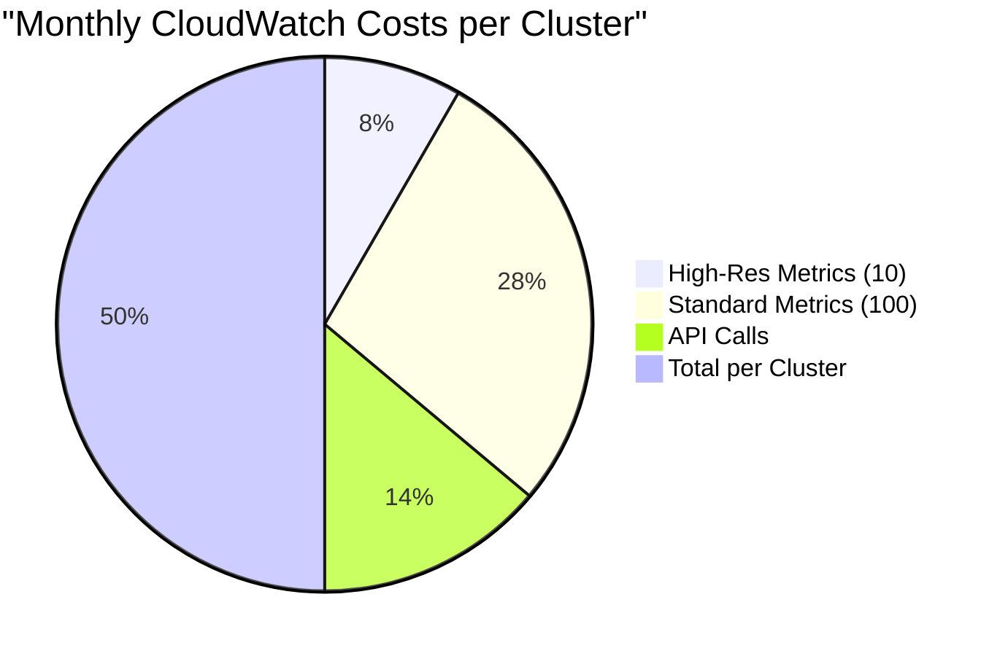

28 个集群的总费用：全面监控约 $500/月，而将所有指标设为高分辨率则需要 $30,000 以上。

### 推荐使用场景

**CloudWatch 高分辨率指标适用于：**

- 小型应用（5,000 个 Pod 以下）
- 简单的监控需求
- 偏好 AWS 原生解决方案
- 优先考虑快速部署和稳定运维

**ADOT + Prometheus 适用于：**

- 大规模集群（20,000 个以上的 Pod）
- 高指标处理吞吐量需求
- 精细化监控和自定义需求
- 对性能和可扩展性有最高要求

## 10 秒架构：逐层分析

实现 10 秒以内的扩缩容需要在每一层进行优化：

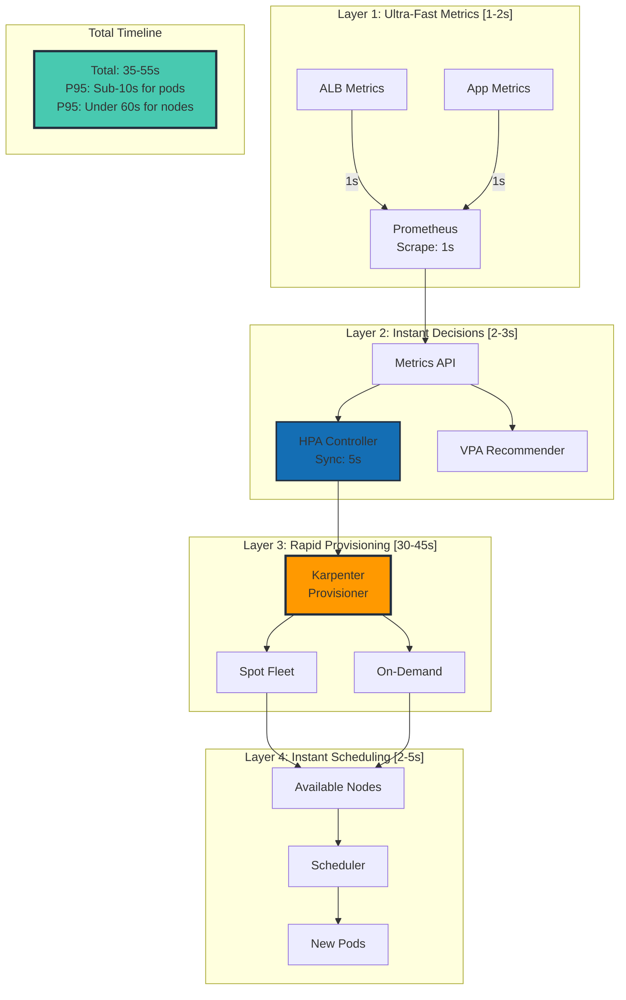

## 关键配置：Karpenter Provisioner

实现 60 秒以内节点配置的关键在于 Karpenter 的最优配置：

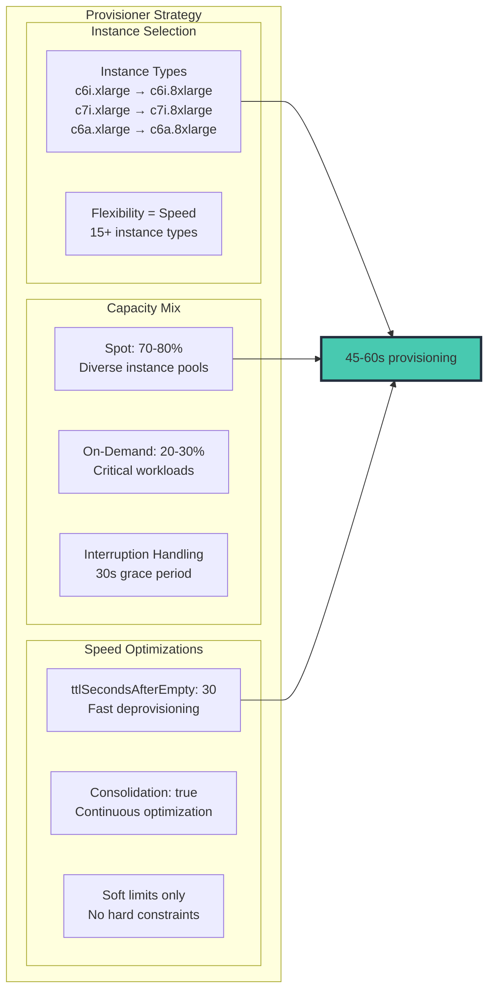

### Karpenter Provisioner YAML

```yaml
apiVersion: karpenter.sh/v1alpha5
kind: Provisioner
metadata:
  name: fast-scaling
spec:
  # 速度优化配置
  ttlSecondsAfterEmpty: 30
  ttlSecondsUntilExpired: 604800  # 7 天

  # 最大灵活性以提升速度
  requirements:
    - key: karpenter.sh/capacity-type
      operator: In
      values: ["spot", "on-demand"]
    - key: kubernetes.io/arch
      operator: In
      values: ["amd64"]
    - key: node.kubernetes.io/instance-type
      operator: In
      values:
        # 计算优化型 - 首选
        - c6i.xlarge
        - c6i.2xlarge
        - c6i.4xlarge
        - c6i.8xlarge
        - c7i.xlarge
        - c7i.2xlarge
        - c7i.4xlarge
        - c7i.8xlarge
        # AMD 替代方案 - 更好的可用性
        - c6a.xlarge
        - c6a.2xlarge
        - c6a.4xlarge
        - c6a.8xlarge
        # 内存优化型 - 用于特定工作负载
        - m6i.xlarge
        - m6i.2xlarge
        - m6i.4xlarge

  # 确保快速配置
  limits:
    resources:
      cpu: 100000  # 仅软限制
      memory: 400000Gi

  # 整合优化以提高效率
  consolidation:
    enabled: true

  # AWS 特定优化
  providerRef:
    name: fast-nodepool
---
apiVersion: karpenter.k8s.aws/v1alpha1
kind: AWSNodeInstanceProfile
metadata:
  name: fast-nodepool
spec:
  subnetSelector:
    karpenter.sh/discovery: "${CLUSTER_NAME}"
  securityGroupSelector:
    karpenter.sh/discovery: "${CLUSTER_NAME}"

  # 速度优化
  userData: |
    #!/bin/bash
    # 优化节点启动时间
    /etc/eks/bootstrap.sh ${CLUSTER_NAME} \
      --b64-cluster-ca ${B64_CLUSTER_CA} \
      --apiserver-endpoint ${API_SERVER_URL} \
      --container-runtime containerd \
      --node-labels=karpenter.sh/fast-scaling=true \
      --max-pods=110

    # 预拉取关键镜像
    ctr -n k8s.io images pull k8s.gcr.io/pause:3.9 &
    ctr -n k8s.io images pull public.ecr.aws/eks-distro/kubernetes/pause:3.9 &

```

## 实时扩缩容工作流

以下是所有组件如何协同工作以实现 10 秒以内扩缩容的完整流程：

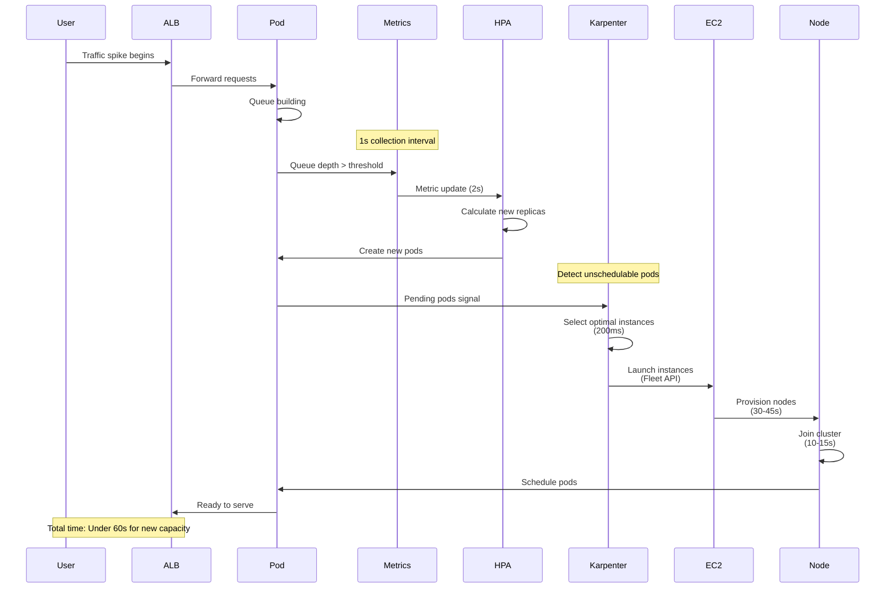

## 积极扩缩容的 HPA 配置

HorizontalPodAutoscaler 必须配置为即时响应：

```yaml
apiVersion: autoscaling/v2
kind: HorizontalPodAutoscaler
metadata:
  name: ultra-fast-hpa
spec:
  scaleTargetRef:
    apiVersion: apps/v1
    kind: Deployment
    name: web-app
  minReplicas: 10
  maxReplicas: 1000

  metrics:
  # 主要指标 - 队列深度
  - type: External
    external:
      metric:
        name: sqs_queue_depth
        selector:
          matchLabels:
            queue: "web-requests"
      target:
        type: AverageValue
        averageValue: "10"

  # 次要指标 - 请求速率
  - type: External
    external:
      metric:
        name: alb_request_rate
        selector:
          matchLabels:
            targetgroup: "web-tg"
      target:
        type: AverageValue
        averageValue: "100"

  behavior:
    scaleUp:
      stabilizationWindowSeconds: 0  # 无延迟！
      policies:
      - type: Percent
        value: 100
        periodSeconds: 10
      - type: Pods
        value: 100
        periodSeconds: 10
      selectPolicy: Max
    scaleDown:
      stabilizationWindowSeconds: 300  # 5 分钟冷却期
      policies:
      - type: Percent
        value: 10
        periodSeconds: 60

```

## KEDA 的适用场景：事件驱动场景

Karpenter 负责基础设施扩缩容，而 KEDA 在特定的事件驱动场景中表现卓越：

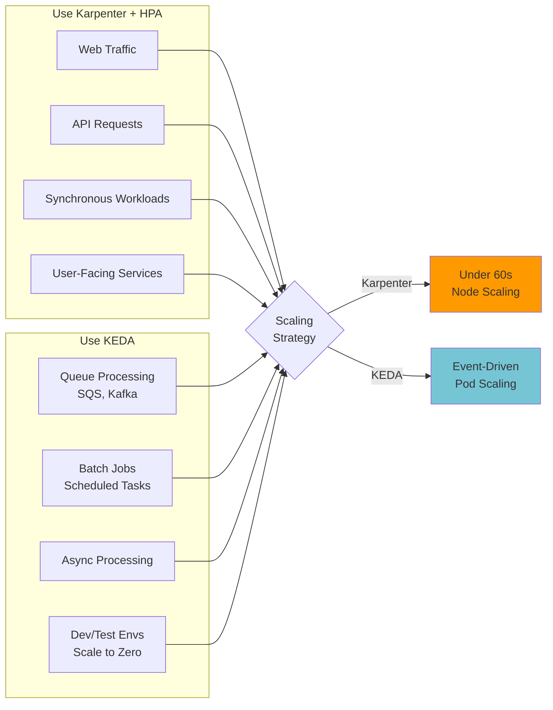

## 生产环境性能指标

以下是处理每日 750,000 以上请求的部署的实际结果：

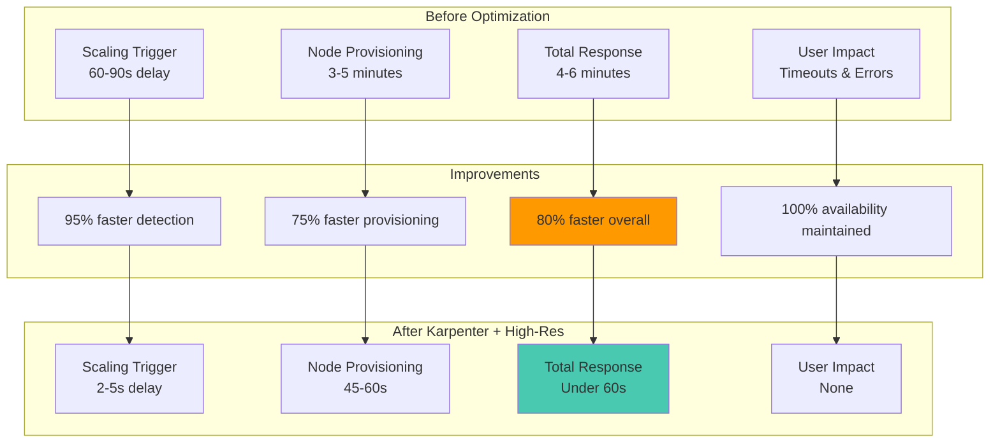

## 多区域注意事项

对于在多个区域运行的组织，要实现一致的 10 秒以内扩缩容，需要针对各区域进行特定优化：

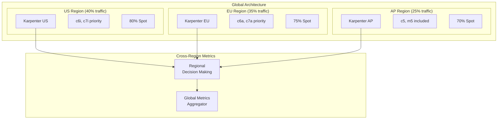

## 10 秒以内扩缩容最佳实践

### 1. 指标选择

- 使用领先指标（队列深度、连接数）而非滞后指标（CPU）
- 每个集群的高分辨率指标控制在 10-15 个以内
- 批量提交指标以避免 API 限流

### 2. Karpenter 优化

- 提供最大的实例类型灵活性
- 积极使用 Spot 实例并配合适当的中断处理
- 启用整合（Consolidation）以提高成本效率
- 设置合适的 ttlSecondsAfterEmpty（30-60 秒）

### 3. HPA 调优

- 扩容时稳定窗口设为零
- 积极的扩缩容策略（允许 100% 增幅）
- 多指标配合适当权重
- 缩容时设置适当的冷却期

### 4. 监控

- 将 P95 扩缩容延迟作为主要 KPI 进行跟踪
- 扩缩容失败或延迟超过 15 秒时触发告警
- 监控 Spot 中断率
- 跟踪每个扩缩容 Pod 的成本

## 常见问题排查

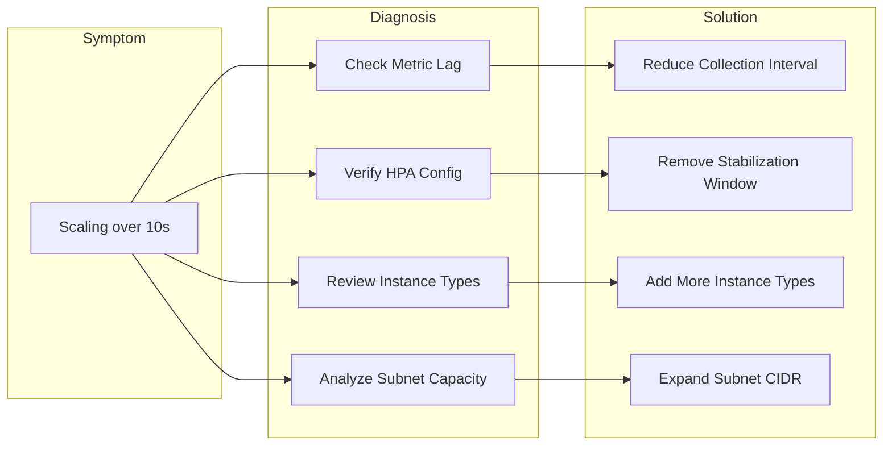

## 混合方案（推荐）

在实际生产环境中，我们推荐结合两种方法的混合方案：

1. **关键任务服务**：使用 ADOT + Prometheus 实现 10-13 秒扩缩容
2. **通用服务**：使用 CloudWatch Direct 实现 12-15 秒扩缩容，并简化运维
3. **渐进式迁移**：从 CloudWatch 开始，根据需要过渡到 ADOT

## 总结

在 EKS 中实现 10 秒以内的自动扩缩容不仅是可能的，对于现代应用来说更是必不可少的。Karpenter 的智能配置、关键指标的高分辨率监控以及精心调优的 HPA 配置三者结合，构建出一个能够近乎实时响应需求的系统。

**关键要点：**

- **Karpenter 是基础** - 直接 EC2 配置将扩缩容时间缩短数分钟
- **选择性高分辨率指标** - 以 1-5 秒间隔监控关键指标
- **积极的 HPA 配置** - 消除扩缩容决策中的人为延迟
- **通过智能化优化成本** - 快速扩缩容减少过度配置
- **架构选择** - 根据规模和需求选择 CloudWatch 或 Prometheus

本文展示的架构已在每天处理数百万请求的生产环境中得到验证。通过实施这些模式，您可以确保 EKS 集群以业务需求的速度进行扩缩容——以秒为单位而非分钟。

请记住：在云原生世界中，速度不仅仅是一个功能特性——它是可靠性、效率和用户满意度的基本要求。
