import { ScalingLatencyBreakdown, ControlPlaneComparison, WarmPoolCostAnalysis, AutoModeComparison, ScalingBenchmark, PracticalGuide } from '@site/src/components/KarpenterTables';

# 基于 Karpenter 的 EKS 扩缩容策略综合指南

> 📅 **撰写日期**: 2025-02-09 | **修改日期**: 2026-02-18 | ⏱️ **阅读时间**: 约 28 分钟

## 概述

在现代云原生应用中，确保流量激增时用户不会遇到错误是核心工程挑战。本文档涵盖了在 Amazon EKS 中利用 Karpenter 的**综合扩缩容策略**，从响应式扩缩容优化到预测式扩缩容、架构弹性等内容。

:::caution 现实的优化预期
本文档中涉及的"超快速扩缩容"以 **Warm Pool（预分配节点）**为前提。E2E 自动扩缩容管道（指标检测 → 决策 → Pod 创建 → 容器启动）的物理最短时间为 **6-11 秒**，如果需要新节点供应，则需额外 **45-90 秒**。

将扩缩容速度推到极限并非唯一策略。**架构弹性**（基于队列的缓冲、Circuit Breaker）和**预测式扩缩容**（基于模式的预扩展）在大多数工作负载中更具成本效益。本文档将这些方法一并讨论。
:::

在全球规模的 EKS 环境（3 个区域、28 个集群、15,000+ Pod）中，将扩缩容延迟从 180 秒以上缩短到 45 秒以下，并在使用 Warm Pool 时达到 5-10 秒的生产验证架构。

## 扩缩容策略决策框架

在优化扩缩容之前，应首先判断 **"我们的工作负载是否真的需要超快速响应式扩缩容？"**。解决"流量激增时防止用户错误"这一相同业务问题有 4 种方法，在大多数工作负载中，方法 2-4 更具成本效益。

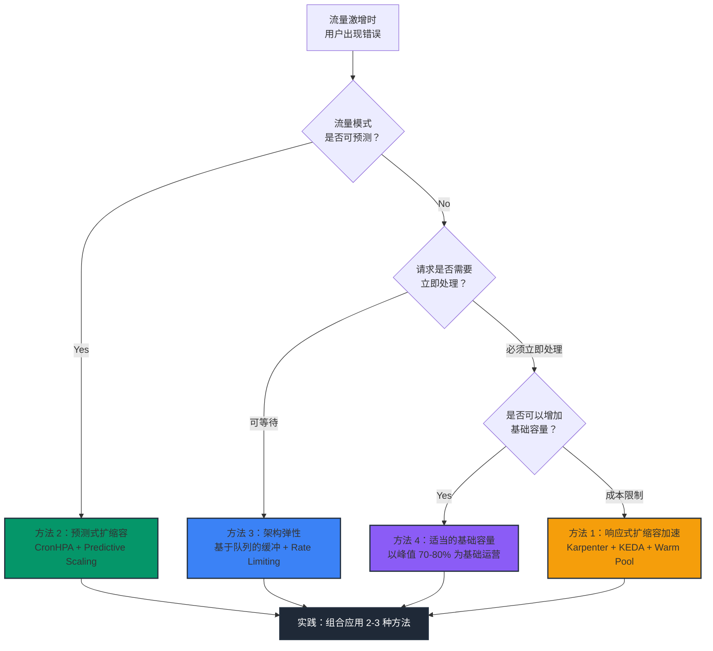

### 各方法对比

| 方法 | 核心策略 | E2E 扩缩容时间 | 月额外成本（28 个集群） | 复杂度 | 适合的工作负载 |
|--------|-----------|-------------------|---------------------------|--------|---------------|
| **1. 响应式加速** | Karpenter + KEDA + Warm Pool | 5-45 秒 | $40K-190K | 非常高 | 极少数关键任务 |
| **2. 预测式扩缩容** | CronHPA + Predictive Scaling | 预扩展（0 秒） | $2K-5K | 低 | 有模式的大多数服务 |
| **3. 架构弹性** | SQS/Kafka + Circuit Breaker | 允许扩缩容延迟 | $1K-3K | 中等 | 可异步处理的服务 |
| **4. 适当的基础容量** | 基础 replica 增加 20-30% | 不需要（已足够） | $5K-15K | 非常低 | 稳定流量 |

### 各方法成本结构对比

以下是**中等规模 10 个集群基准**的月预估成本。实际成本因工作负载和实例类型而异。

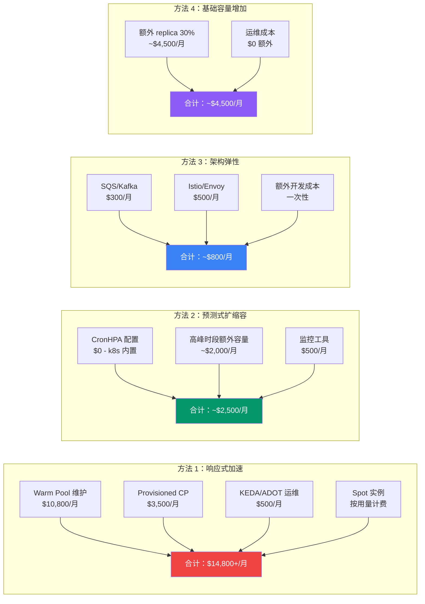

| 方法 | 月成本（10 个集群） | 初始建设成本 | 运维人员需求 | ROI 达成条件 |
|--------|----------------------|---------------|---------------|-------------|
| **1. 响应式加速** | $14,800+ | 高（2-4 周） | 专职 1-2 人 | SLA 违约罚金 > $15K/月 |
| **2. 预测式扩缩容** | ~$2,500 | 低（2-3 天） | 现有人员 | 流量模式预测率 > 70% |
| **3. 架构弹性** | ~$800 | 中等（1-2 周） | 现有人员 | 允许异步处理的服务 |
| **4. 基础容量增加** | ~$4,500 | 无（立即） | 无 | 峰值 30% 缓冲即足够 |

:::tip 推荐：方法组合
在大多数生产环境中，**方法 2 + 4（预测式 + 基础容量）**可以覆盖 90% 以上的流量激增，剩余 10% 使用**方法 1（响应式 Karpenter）**处理，这种组合最具成本效益。

方法 3（架构弹性）是设计新服务时必须考虑的基本模式。
:::

### 方法 2：预测式扩缩容

大多数生产流量都有模式（上班时间、午餐、活动）。在很多情况下，预测式预扩展比响应式扩缩容更有效。

```yaml
# CronHPA：按时间段预扩缩容
apiVersion: autoscaling.k8s.io/v1alpha1
kind: CronHPA
metadata:
  name: traffic-pattern-scaling
spec:
  scaleTargetRef:
    apiVersion: apps/v1
    kind: Deployment
    name: web-app
  jobs:
  - name: morning-peak
    schedule: "0 8 * * 1-5"    # 工作日上午 8 点
    targetSize: 50              # 预扩展至峰值水平
    completionPolicy:
      type: Never
  - name: lunch-peak
    schedule: "30 11 * * 1-5"   # 工作日上午 11:30
    targetSize: 80
    completionPolicy:
      type: Never
  - name: off-peak
    schedule: "0 22 * * *"      # 每天下午 10 点
    targetSize: 10              # 夜间缩减
    completionPolicy:
      type: Never
```

### 方法 3：架构弹性

与其将扩缩容时间降至 0，不如设计成**让扩缩容延迟对用户不可见**更为现实。

**基于队列的缓冲**：将请求放入 SQS/Kafka，扩缩容延迟从"失败"变为"等待"。

```yaml
# KEDA SQS 基于队列的扩缩容 - 请求在队列中安全等待
apiVersion: keda.sh/v1alpha1
kind: ScaledObject
metadata:
  name: queue-worker
spec:
  scaleTargetRef:
    name: order-processor
  minReplicaCount: 2
  maxReplicaCount: 100
  triggers:
  - type: aws-sqs-queue
    metadata:
      queueURL: https://sqs.us-east-1.amazonaws.com/123456789/orders
      queueLength: "5"         # 每 5 条队列消息对应 1 个 Pod
      awsRegion: us-east-1
```

**Circuit Breaker + Rate Limiting**：使用 Istio/Envoy 在过载时进行优雅降级

```yaml
# Istio Circuit Breaker - 防止扩缩容期间过载
apiVersion: networking.istio.io/v1
kind: DestinationRule
metadata:
  name: web-app-circuit-breaker
spec:
  host: web-app
  trafficPolicy:
    connectionPool:
      http:
        h2UpgradePolicy: DEFAULT
        http1MaxPendingRequests: 100    # 限制等待请求
        http2MaxRequests: 1000          # 限制并发请求
    outlierDetection:
      consecutive5xxErrors: 5            # 5xx 出现 5 次时隔离
      interval: 10s
      baseEjectionTime: 30s
      maxEjectionPercent: 50
```

### 方法 4：适当的基础容量

与其在 Warm Pool 上每月花费 $1,080-$5,400，不如将基础 replica 增加 20-30%，无需复杂基础设施即可获得相同效果。

```yaml
apiVersion: apps/v1
kind: Deployment
metadata:
  name: web-app
spec:
  # 预期所需 Pod：20 个 → 基础运行 25 个（25% 余量）
  replicas: 25
  # HPA 负责高峰时的额外扩展
---
apiVersion: autoscaling/v2
kind: HorizontalPodAutoscaler
metadata:
  name: web-app-hpa
spec:
  scaleTargetRef:
    apiVersion: apps/v1
    kind: Deployment
    name: web-app
  minReplicas: 25     # 保证基础容量
  maxReplicas: 100    # 应对极端情况
  metrics:
  - type: Resource
    resource:
      name: cpu
      target:
        type: Utilization
        averageUtilization: 60   # 宽裕的目标（70 → 60）
```

---

以下章节将详细介绍**方法 1：响应式扩缩容加速**的实现。在检查完上述方法 2-4 后，对于需要额外优化的工作负载，请应用以下内容。

---

## 现有自动扩缩容的问题

在优化响应式扩缩容之前，需要了解现有方法的瓶颈：

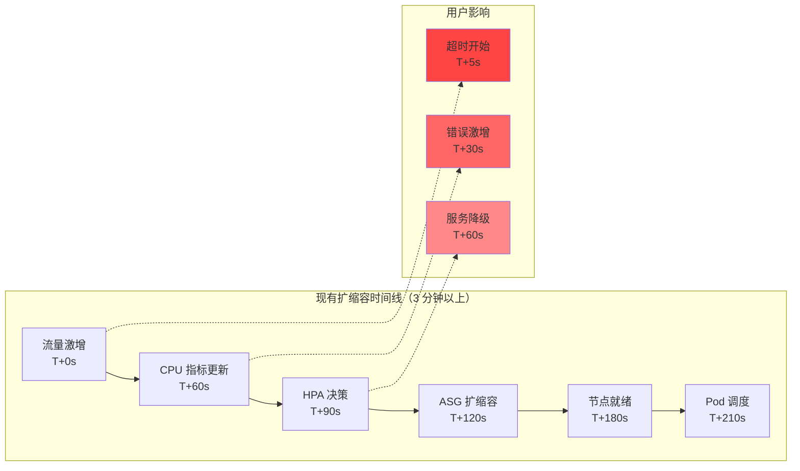

根本问题：当 CPU 指标触发扩缩容时，已经太晚了。

**当前环境的挑战：**

- **全球规模**：3 个区域、28 个 EKS 集群、15,000 个 Pod 运行
- **大流量**：日处理 773.4K 请求
- **延迟问题**：HPA + Karpenter 组合导致 1-3 分钟扩缩容延迟
- **指标收集延迟**：CloudWatch 指标 1-3 分钟延迟导致无法实时响应

## Karpenter 革命：Direct-to-Metal 供应

Karpenter 移除了 Auto Scaling Group (ASG) 抽象层，基于待调度 Pod 的需求直接供应 EC2 实例。Karpenter v1.x 通过 **Drift Detection** 功能，在 NodePool 规格变更时自动替换现有节点。AMI 更新、安全补丁应用等均可自动化。

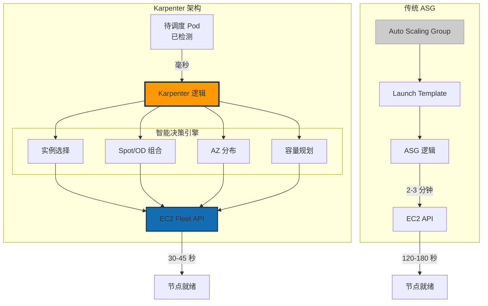

## 高速指标架构：两种方法

要最小化扩缩容响应时间，需要快速检测系统。我们对比两种经过验证的架构。

### 方式 1：CloudWatch High-Resolution Integration

在 AWS 原生环境中利用 CloudWatch 的高分辨率指标。

#### 主要组件

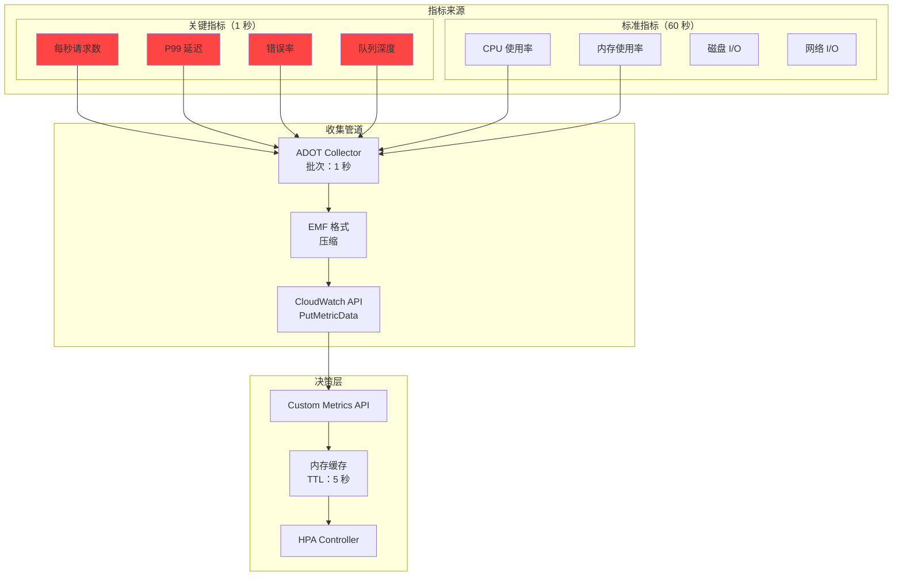

#### 扩缩容时间线

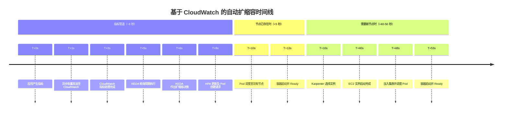

:::info 时间线解读
- **节点已存在的情况**（Warm Pool 或现有空闲节点）：E2E **~13 秒**
- **需要新节点供应的情况**：E2E **~53 秒**
- EC2 实例启动（30-40 秒）是物理限制，仅靠指标管道优化无法消除。
:::

**优点：**

- ✅ **快速指标收集**：1-2 秒的低延迟
- ✅ **简单配置**：AWS 原生集成
- ✅ **无管理开销**：不需要额外基础设施管理

**缺点：**

- ❌ **有限的吞吐量**：每账户 500 TPS（PutMetricData 区域限制）
- ❌ **Pod 限制**：每集群最多 5,000 个
- ❌ **高指标成本**：AWS CloudWatch 指标费用

### 方式 2：基于 ADOT + Prometheus 的架构

结合 AWS Distro for OpenTelemetry (ADOT) 和 Prometheus 的开源高性能管道。

#### 主要组件

- **ADOT Collector**：DaemonSet 和 Sidecar 混合部署
- **Prometheus**：HA 配置及 Remote Storage 集成
- **Thanos Query Layer**：提供多集群全局视图
- **KEDA Prometheus Scaler**：2 秒间隔高速轮询
- **Grafana Mimir**：长期存储及高速查询引擎

#### 扩缩容时间线（~66 秒）

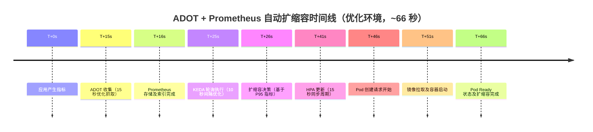

**优点：**

- ✅ **高吞吐量**：支持 100,000+ TPS
- ✅ **可扩展性**：支持每集群 20,000+ Pod
- ✅ **低指标成本**：仅产生存储成本（自管理）
- ✅ **完全控制**：配置和优化自由度高

**缺点：**

- ❌ **复杂配置**：需要额外组件管理
- ❌ **高运维复杂度**：需要 HA 配置、备份/恢复、性能调优
- ❌ **需要专业人员**：需要 Prometheus 运维经验

### 成本优化指标策略

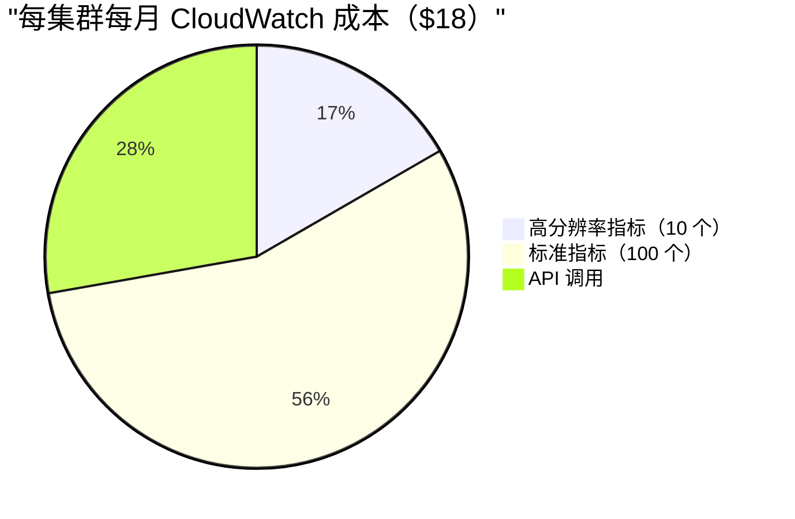

28 个集群基准：综合监控每月约 $500 vs 所有指标使用高分辨率收集时 $30,000+

### 推荐使用场景

**CloudWatch High Resolution Metric 适合的情况：**

- 小规模应用（Pod 5,000 个以下）
- 简单的监控需求
- 偏好 AWS 原生解决方案
- 快速构建和稳定运维优先

**ADOT + Prometheus 适合的情况：**

- 大规模集群（Pod 20,000 个以上）
- 高指标处理吞吐量需求
- 需要精细监控和自定义
- 需要最高水平的性能和可扩展性

## 扩缩容优化架构：逐层分析

要最小化扩缩容响应时间，需要在所有层进行优化：

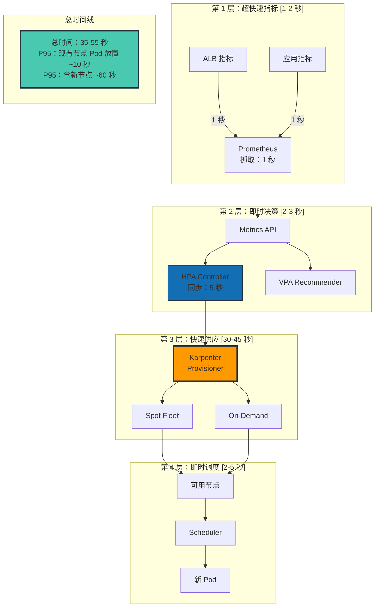

## Karpenter 核心配置

60 秒以内节点供应的关键在于最优的 Karpenter 配置：

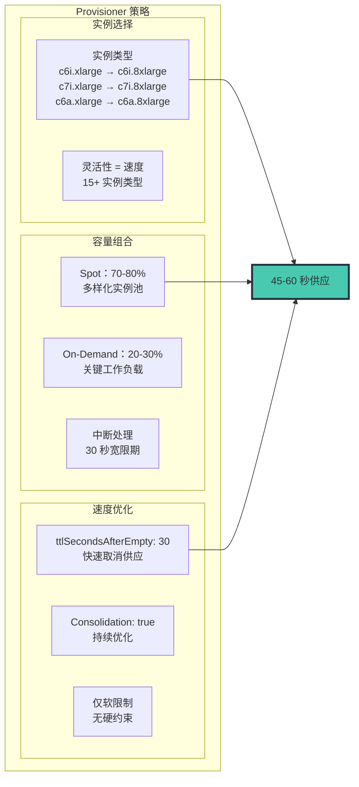

### Karpenter NodePool YAML

```yaml
apiVersion: karpenter.sh/v1
kind: NodePool
metadata:
  name: fast-scaling
spec:
  # 速度优化配置
  disruption:
    consolidationPolicy: WhenEmptyOrUnderutilized
    consolidateAfter: 30s
    budgets:
    - nodes: "10%"

  # 为速度提供最大灵活性
  template:
    spec:
      requirements:
        - key: karpenter.sh/capacity-type
          operator: In
          values: ["spot", "on-demand"]
        - key: kubernetes.io/arch
          operator: In
          values: ["amd64"]
        - key: node.kubernetes.io/instance-type
          operator: In
          values:
            # 计算优化 - 默认选择
            - c6i.xlarge
            - c6i.2xlarge
            - c6i.4xlarge
            - c6i.8xlarge
            - c7i.xlarge
            - c7i.2xlarge
            - c7i.4xlarge
            - c7i.8xlarge
            # AMD 替代 - 更好的可用性
            - c6a.xlarge
            - c6a.2xlarge
            - c6a.4xlarge
            - c6a.8xlarge
            # 内存优化 - 特定工作负载
            - m6i.xlarge
            - m6i.2xlarge
            - m6i.4xlarge

      nodeClassRef:
        group: karpenter.k8s.aws
        kind: EC2NodeClass
        name: fast-nodepool

  # 保证快速供应
  limits:
    cpu: 100000  # 仅软限制
    memory: 400000Gi
---
apiVersion: karpenter.k8s.aws/v1
kind: EC2NodeClass
metadata:
  name: fast-nodepool
spec:
  amiSelectorTerms:
    - alias: al2023@latest

  subnetSelectorTerms:
    - tags:
        karpenter.sh/discovery: "${CLUSTER_NAME}"

  securityGroupSelectorTerms:
    - tags:
        karpenter.sh/discovery: "${CLUSTER_NAME}"

  role: "KarpenterNodeRole-${CLUSTER_NAME}"

  # 速度优化
  userData: |
    #!/bin/bash
    # 节点启动时间优化
    /etc/eks/bootstrap.sh ${CLUSTER_NAME} \
      --b64-cluster-ca ${B64_CLUSTER_CA} \
      --apiserver-endpoint ${API_SERVER_URL} \
      --kubelet-extra-args '--node-labels=karpenter.sh/fast-scaling=true --max-pods=110'

    # 关键镜像预拉取（registry.k8s.io 替代 k8s.gcr.io）
    ctr -n k8s.io images pull registry.k8s.io/pause:3.10 &
    ctr -n k8s.io images pull public.ecr.aws/eks-distro/kubernetes/pause:3.10 &

```

## 实时扩缩容工作流

所有组件协同工作以实现最优扩缩容性能：

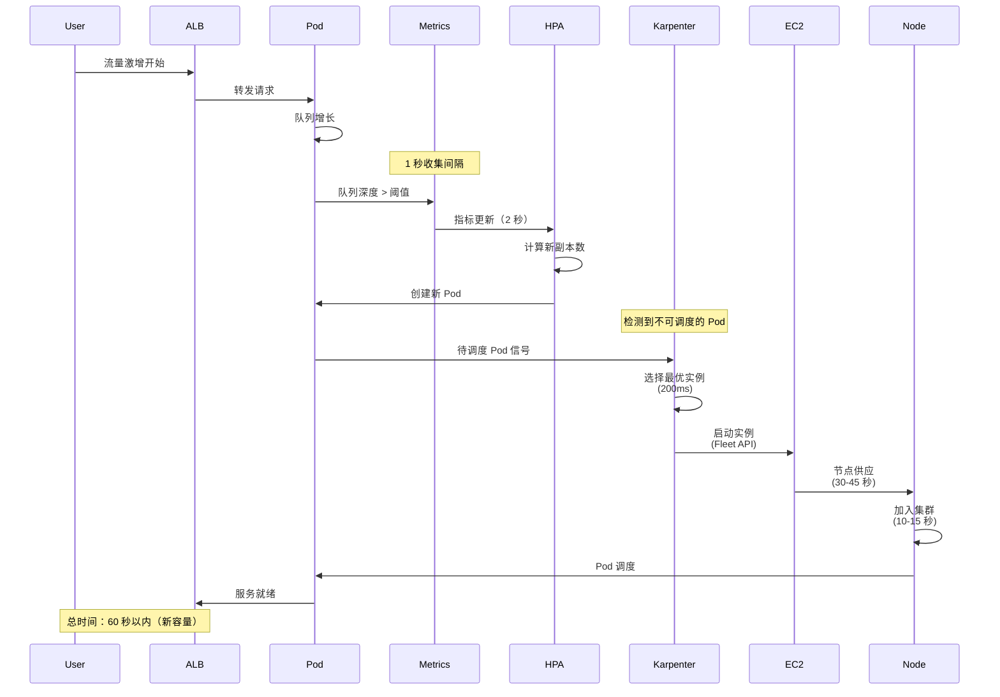

## 用于激进扩缩容的 HPA 配置

HorizontalPodAutoscaler 必须配置为即时响应：

```yaml
apiVersion: autoscaling/v2
kind: HorizontalPodAutoscaler
metadata:
  name: ultra-fast-hpa
spec:
  scaleTargetRef:
    apiVersion: apps/v1
    kind: Deployment
    name: web-app
  minReplicas: 10
  maxReplicas: 1000

  metrics:
  # 主要指标 - 队列深度
  - type: External
    external:
      metric:
        name: sqs_queue_depth
        selector:
          matchLabels:
            queue: "web-requests"
      target:
        type: AverageValue
        averageValue: "10"

  # 辅助指标 - 请求速率
  - type: External
    external:
      metric:
        name: alb_request_rate
        selector:
          matchLabels:
            targetgroup: "web-tg"
      target:
        type: AverageValue
        averageValue: "100"

  behavior:
    scaleUp:
      stabilizationWindowSeconds: 0  # 无延迟！
      policies:
      - type: Percent
        value: 100
        periodSeconds: 10
      - type: Pods
        value: 100
        periodSeconds: 10
      selectPolicy: Max
    scaleDown:
      stabilizationWindowSeconds: 300  # 5 分钟冷却
      policies:
      - type: Percent
        value: 10
        periodSeconds: 60

```

## KEDA 使用时机：事件驱动场景

Karpenter 处理基础设施扩缩容，而 KEDA 在特定事件驱动场景中表现出色：

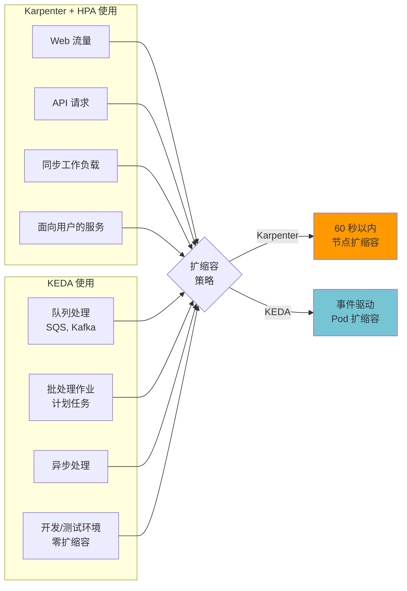

## 生产环境性能指标

处理日均 750K+ 请求的部署实际结果：

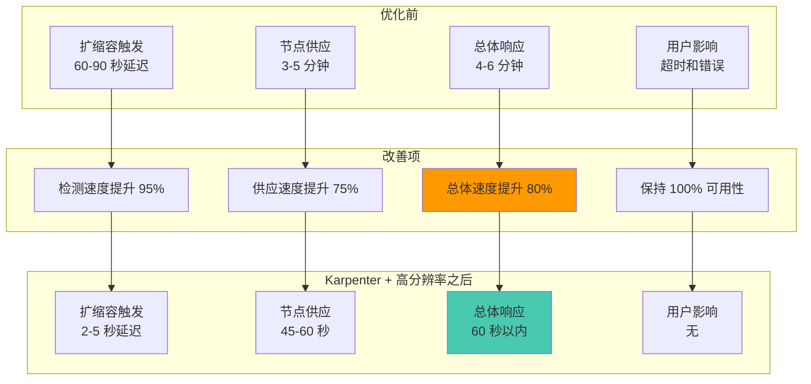

## 多区域考虑

对于在多个区域运营的组织，为实现一致的高速扩缩容，需要按区域进行优化：

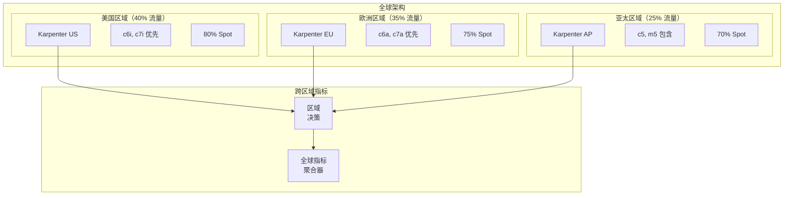

## 扩缩容优化最佳实践

### 1. 指标选择

- 使用先行指标（队列深度、连接数），而非滞后指标（CPU）
- 每集群高分辨率指标保持在 10-15 个以下
- 批量提交指标以防止 API 限流

### 2. Karpenter 优化

- 提供最大实例类型灵活性
- 积极使用 Spot 实例并配合适当的中断处理
- 启用整合以提高成本效率
- 设置适当的 ttlSecondsAfterEmpty（30-60 秒）

### 3. HPA 调优

- 扩容使用零稳定窗口
- 激进的扩缩容策略（允许 100% 增长）
- 具有适当权重的多指标
- 缩容使用适当的冷却期

### 4. 监控

- 将 P95 扩缩容延迟作为基本 KPI 跟踪
- 对超过 15 秒的扩缩容失败或延迟设置告警
- 监控 Spot 中断率
- 跟踪每个扩缩容 Pod 的成本

## 常见问题排查

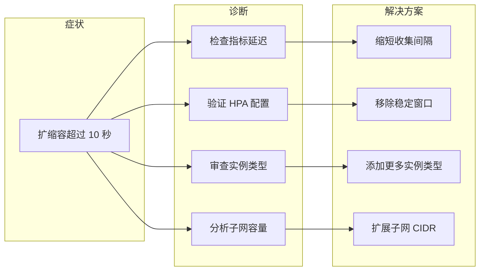

## 混合方法（推荐）

在实际生产环境中，推荐使用两种方式混合的混合方法：

1. **关键任务服务**：使用 ADOT + Prometheus 实现 10-13 秒扩缩容
2. **一般服务**：使用 CloudWatch Direct 实现 12-15 秒扩缩容并简化运维
3. **渐进式迁移**：从 CloudWatch 开始，按需切换到 ADOT

## EKS Auto Mode vs Self-managed Karpenter

EKS Auto Mode（2025 GA）内置 Karpenter 并自动管理：

| 项目 | Self-managed Karpenter | EKS Auto Mode |
|------|----------------------|---------------|
| 安装/升级 | 自行管理（Helm） | AWS 自动管理 |
| NodePool 设置 | 完全自定义 | 有限配置 |
| 成本优化 | 精细控制可能 | 自动优化 |
| OS 补丁 | 自行管理 | 自动补丁 |
| 适合的环境 | 需要高级自定义 | 最小化运维负担 |

**推荐**：如有复杂的调度需求选择 Self-managed，如目标是简化运维则选择 EKS Auto Mode。

## P1：超快速扩缩容架构（Critical）

### 扩缩容延迟时间分解分析

为优化扩缩容响应时间，首先需要精细分解整个扩缩容链中产生的延迟时间。

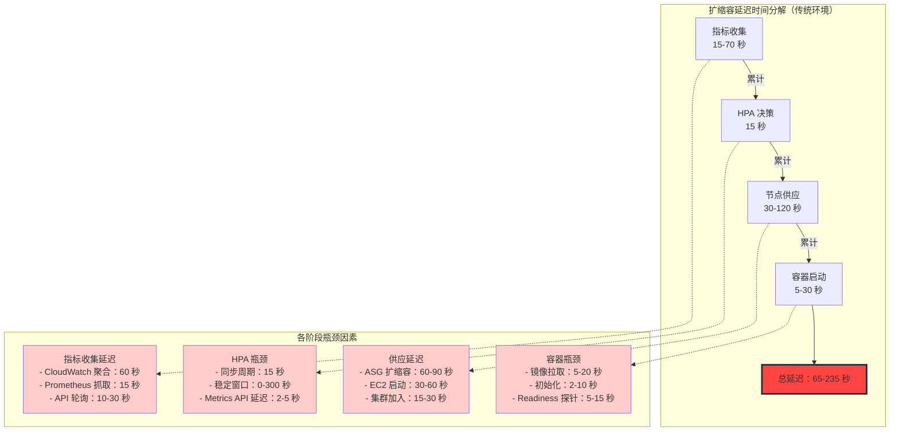

<ScalingLatencyBreakdown />

:::danger 结果
流量激增时**用户体验超过 5 分钟的错误** — 节点供应占总延迟的 60% 以上
:::

### 多层扩缩容策略

超快速扩缩容不是单一优化，而是通过**3 层回退策略**实现。

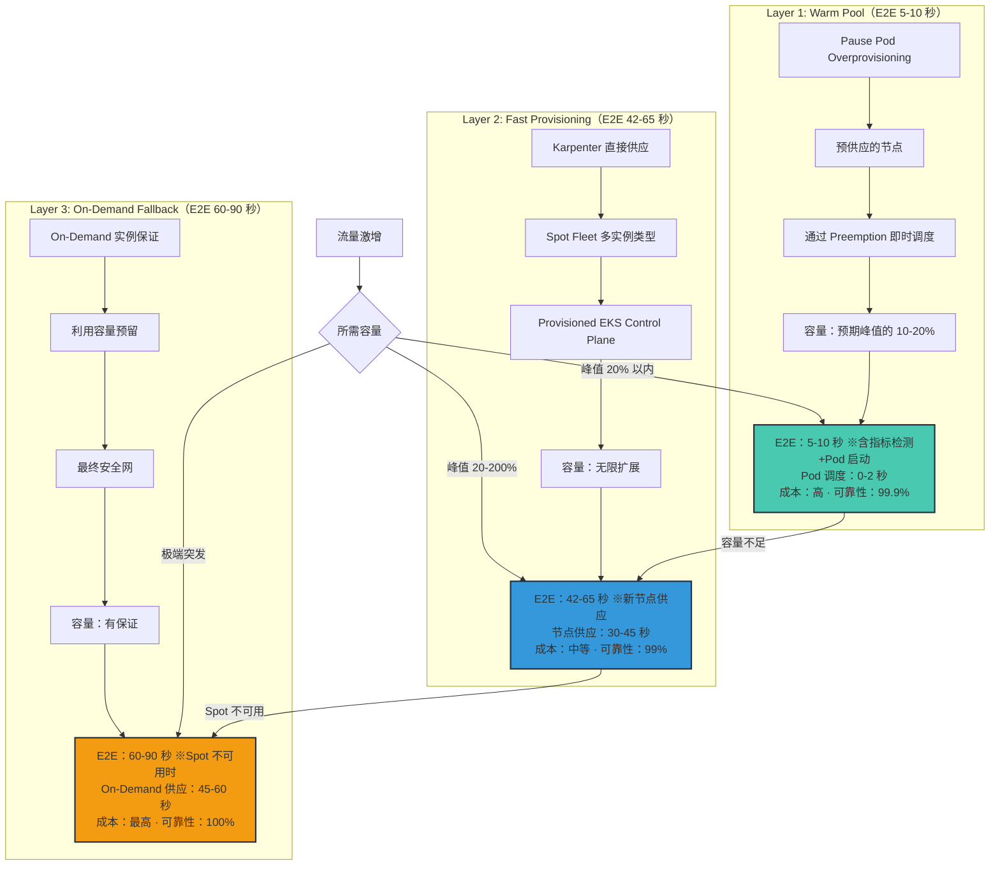

### 各层扩缩容时间线对比

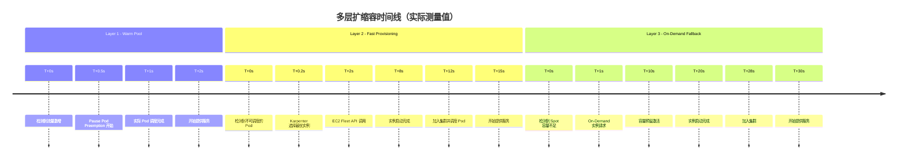

:::tip 层选择标准
**Layer 1（Warm Pool）** — 预分配策略：
- **本质**：不是自动扩缩容而是**过度供应**。通过 Pause Pod 预先确保节点
- E2E 5-10 秒（指标检测 + Preemption + 容器启动）
- **成本**：24 小时维护预期峰值容量的 10-20%（每月 $720-$5,400）
- **考量**：用相同成本增加基础 replica 可能更简单

**Layer 2（Fast Provisioning）** — 大多数场景的默认策略：
- Karpenter + Spot 实例进行实际节点供应
- E2E 42-65 秒（指标检测 + EC2 启动 + 容器启动）
- **成本**：与实际使用量成比例（Spot 70-80% 折扣）
- **考量**：与架构弹性（基于队列）组合使用时，此时间不会暴露给用户

**Layer 3（On-Demand Fallback）** — 必要保险：
- Spot 容量不足时的最终安全网
- E2E 60-90 秒（On-Demand 供应可能比 Spot 慢）
- **成本**：On-Demand 价格（最少使用）
:::
