import { ScalingLatencyBreakdown, ControlPlaneComparison, WarmPoolCostAnalysis, AutoModeComparison, ScalingBenchmark, PracticalGuide } from '@site/src/components/KarpenterTables';

# 基于 Karpenter 的 EKS 扩缩容策略综合指南

> 📅 **撰写日期**: 2025-02-09 | **修改日期**: 2026-02-18 | ⏱️ **阅读时间**: 约 28 分钟

## 概述

在现代云原生应用中，确保流量激增时用户不会遇到错误是核心工程挑战。本文档涵盖了在 Amazon EKS 中利用 Karpenter 的**综合扩缩容策略**，从响应式扩缩容优化到预测式扩缩容、架构弹性等内容。

:::caution 现实的优化预期
本文档中涉及的"超快速扩缩容"以 **Warm Pool（预分配节点）**为前提。E2E 自动扩缩容管道（指标检测 → 决策 → Pod 创建 → 容器启动）的物理最短时间为 **6-11 秒**，如果需要新节点供应，则需额外 **45-90 秒**。

将扩缩容速度推到极限并非唯一策略。**架构弹性**（基于队列的缓冲、Circuit Breaker）和**预测式扩缩容**（基于模式的预扩展）在大多数工作负载中更具成本效益。本文档将这些方法一并讨论。
:::

在全球规模的 EKS 环境（3 个区域、28 个集群、15,000+ Pod）中，将扩缩容延迟从 180 秒以上缩短到 45 秒以下，并在使用 Warm Pool 时达到 5-10 秒的生产验证架构。

## 扩缩容策略决策框架

在优化扩缩容之前，应首先判断 **"我们的工作负载是否真的需要超快速响应式扩缩容？"**。解决"流量激增时防止用户错误"这一相同业务问题有 4 种方法，在大多数工作负载中，方法 2-4 更具成本效益。

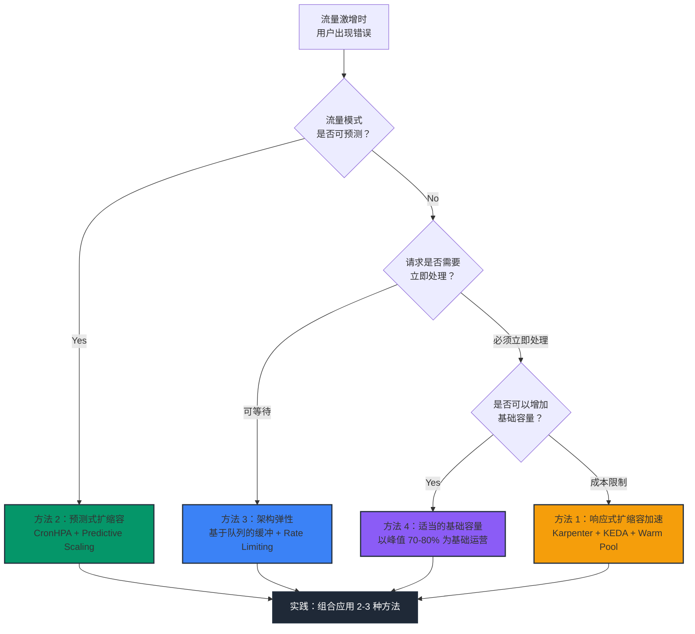
```mermaid
graph TB
    START[流量激增时<br/>用户出现错误] --> Q1{流量模式<br/>是否可预测？}

    Q1 -->|Yes| PRED[方法 2：预测式扩缩容<br/>CronHPA + Predictive Scaling]
    Q1 -->|No| Q2{请求是否需要<br/>立即处理？}

    Q2 -->|可等待| ARCH[方法 3：架构弹性<br/>基于队列的缓冲 + Rate Limiting]
    Q2 -->|必须立即处理| Q3{是否可以增加<br/>基础容量？}

    Q3 -->|Yes| BASE[方法 4：适当的基础容量<br/>以峰值 70-80% 为基础运营]
    Q3 -->|成本限制| REACTIVE[方法 1：响应式扩缩容加速<br/>Karpenter + KEDA + Warm Pool]

    PRED --> COMBINE[实践：组合应用 2-3 种方法]
    ARCH --> COMBINE
    BASE --> COMBINE
    REACTIVE --> COMBINE

    style PRED fill:#059669,stroke:#232f3e,stroke-width:2px
    style ARCH fill:#3b82f6,stroke:#232f3e,stroke-width:2px
    style BASE fill:#8b5cf6,stroke:#232f3e,stroke-width:2px
    style REACTIVE fill:#f59e0b,stroke:#232f3e,stroke-width:2px
    style COMBINE fill:#1f2937,color:#fff,stroke:#232f3e,stroke-width:2px
```

### 各方法对比

| 方法 | 核心策略 | E2E 扩缩容时间 | 月额外成本（28 个集群） | 复杂度 | 适合的工作负载 |
|--------|-----------|-------------------|---------------------------|--------|---------------|
| **1. 响应式加速** | Karpenter + KEDA + Warm Pool | 5-45 秒 | $40K-190K | 非常高 | 极少数关键任务 |
| **2. 预测式扩缩容** | CronHPA + Predictive Scaling | 预扩展（0 秒） | $2K-5K | 低 | 有模式的大多数服务 |
| **3. 架构弹性** | SQS/Kafka + Circuit Breaker | 允许扩缩容延迟 | $1K-3K | 中等 | 可异步处理的服务 |
| **4. 适当的基础容量** | 基础 replica 增加 20-30% | 不需要（已足够） | $5K-15K | 非常低 | 稳定流量 |

### 各方法成本结构对比

以下是**中等规模 10 个集群基准**的月预估成本。实际成本因工作负载和实例类型而异。

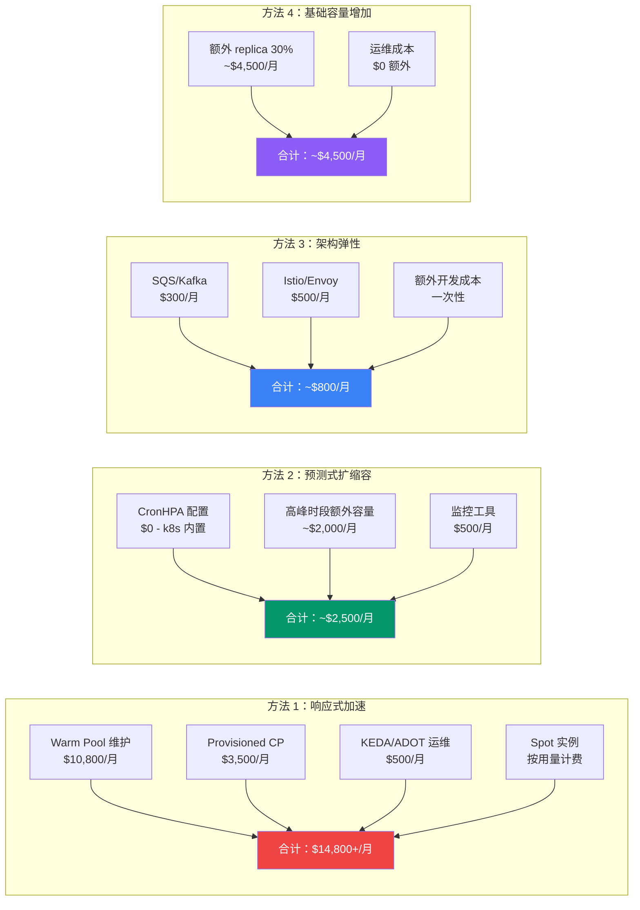
```mermaid
graph LR
    subgraph "方法 1：响应式加速"
        R1["Warm Pool 维护<br/>$10,800/月"]
        R2["Provisioned CP<br/>$3,500/月"]
        R3["KEDA/ADOT 运维<br/>$500/月"]
        R4["Spot 实例<br/>按用量计费"]
        RT["合计：$14,800+/月"]
        R1 --> RT
        R2 --> RT
        R3 --> RT
        R4 --> RT
    end

    subgraph "方法 2：预测式扩缩容"
        P1["CronHPA 配置<br/>$0 - k8s 内置"]
        P2["高峰时段额外容量<br/>~$2,000/月"]
        P3["监控工具<br/>$500/月"]
        PT["合计：~$2,500/月"]
        P1 --> PT
        P2 --> PT
        P3 --> PT
    end

    subgraph "方法 3：架构弹性"
        A1["SQS/Kafka<br/>$300/月"]
        A2["Istio/Envoy<br/>$500/月"]
        A3["额外开发成本<br/>一次性"]
        AT["合计：~$800/月"]
        A1 --> AT
        A2 --> AT
        A3 --> AT
    end

    subgraph "方法 4：基础容量增加"
        B1["额外 replica 30%<br/>~$4,500/月"]
        B2["运维成本<br/>$0 额外"]
        BT["合计：~$4,500/月"]
        B1 --> BT
        B2 --> BT
    end

    style RT fill:#ef4444,color:#fff
    style PT fill:#059669,color:#fff
    style AT fill:#3b82f6,color:#fff
    style BT fill:#8b5cf6,color:#fff
```

| 方法 | 月成本（10 个集群） | 初始建设成本 | 运维人员需求 | ROI 达成条件 |
|--------|----------------------|---------------|---------------|-------------|
| **1. 响应式加速** | $14,800+ | 高（2-4 周） | 专职 1-2 人 | SLA 违约罚金 > $15K/月 |
| **2. 预测式扩缩容** | ~$2,500 | 低（2-3 天） | 现有人员 | 流量模式预测率 > 70% |
| **3. 架构弹性** | ~$800 | 中等（1-2 周） | 现有人员 | 允许异步处理的服务 |
| **4. 基础容量增加** | ~$4,500 | 无（立即） | 无 | 峰值 30% 缓冲即足够 |

:::tip 推荐：方法组合
在大多数生产环境中，**方法 2 + 4（预测式 + 基础容量）**可以覆盖 90% 以上的流量激增，剩余 10% 使用**方法 1（响应式 Karpenter）**处理，这种组合最具成本效益。

方法 3（架构弹性）是设计新服务时必须考虑的基本模式。
:::

### 方法 2：预测式扩缩容

大多数生产流量都有模式（上班时间、午餐、活动）。在很多情况下，预测式预扩展比响应式扩缩容更有效。

```yaml
# CronHPA：按时间段预扩缩容
apiVersion: autoscaling.k8s.io/v1alpha1
kind: CronHPA
metadata:
  name: traffic-pattern-scaling
spec:
  scaleTargetRef:
    apiVersion: apps/v1
    kind: Deployment
    name: web-app
  jobs:
  - name: morning-peak
    schedule: "0 8 * * 1-5"    # 工作日上午 8 点
    targetSize: 50              # 预扩展至峰值水平
    completionPolicy:
      type: Never
  - name: lunch-peak
    schedule: "30 11 * * 1-5"   # 工作日上午 11:30
    targetSize: 80
    completionPolicy:
      type: Never
  - name: off-peak
    schedule: "0 22 * * *"      # 每天下午 10 点
    targetSize: 10              # 夜间缩减
    completionPolicy:
      type: Never
```

### 方法 3：架构弹性

与其将扩缩容时间降至 0，不如设计成**让扩缩容延迟对用户不可见**更为现实。

**基于队列的缓冲**：将请求放入 SQS/Kafka，扩缩容延迟从"失败"变为"等待"。

```yaml
# KEDA SQS 基于队列的扩缩容 - 请求在队列中安全等待
apiVersion: keda.sh/v1alpha1
kind: ScaledObject
metadata:
  name: queue-worker
spec:
  scaleTargetRef:
    name: order-processor
  minReplicaCount: 2
  maxReplicaCount: 100
  triggers:
  - type: aws-sqs-queue
    metadata:
      queueURL: https://sqs.us-east-1.amazonaws.com/123456789/orders
      queueLength: "5"         # 每 5 条队列消息对应 1 个 Pod
      awsRegion: us-east-1
```

**Circuit Breaker + Rate Limiting**：使用 Istio/Envoy 在过载时进行优雅降级

```yaml
# Istio Circuit Breaker - 防止扩缩容期间过载
apiVersion: networking.istio.io/v1
kind: DestinationRule
metadata:
  name: web-app-circuit-breaker
spec:
  host: web-app
  trafficPolicy:
    connectionPool:
      http:
        h2UpgradePolicy: DEFAULT
        http1MaxPendingRequests: 100    # 限制等待请求
        http2MaxRequests: 1000          # 限制并发请求
    outlierDetection:
      consecutive5xxErrors: 5            # 5xx 出现 5 次时隔离
      interval: 10s
      baseEjectionTime: 30s
      maxEjectionPercent: 50
```

### 方法 4：适当的基础容量

与其在 Warm Pool 上每月花费 $1,080-$5,400，不如将基础 replica 增加 20-30%，无需复杂基础设施即可获得相同效果。

```yaml
apiVersion: apps/v1
kind: Deployment
metadata:
  name: web-app
spec:
  # 预期所需 Pod：20 个 → 基础运行 25 个（25% 余量）
  replicas: 25
  # HPA 负责高峰时的额外扩展
---
apiVersion: autoscaling/v2
kind: HorizontalPodAutoscaler
metadata:
  name: web-app-hpa
spec:
  scaleTargetRef:
    apiVersion: apps/v1
    kind: Deployment
    name: web-app
  minReplicas: 25     # 保证基础容量
  maxReplicas: 100    # 应对极端情况
  metrics:
  - type: Resource
    resource:
      name: cpu
      target:
        type: Utilization
        averageUtilization: 60   # 宽裕的目标（70 → 60）
```

---

以下章节将详细介绍**方法 1：响应式扩缩容加速**的实现。在检查完上述方法 2-4 后，对于需要额外优化的工作负载，请应用以下内容。

---

## 现有自动扩缩容的问题

在优化响应式扩缩容之前，需要了解现有方法的瓶颈：

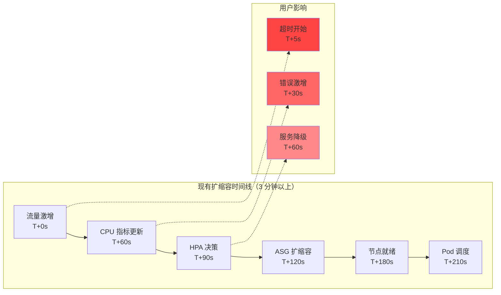
```mermaid
graph LR
    subgraph "现有扩缩容时间线（3 分钟以上）"
        T1[流量激增<br/>T+0s] --> T2[CPU 指标更新<br/>T+60s]
        T2 --> T3[HPA 决策<br/>T+90s]
        T3 --> T4[ASG 扩缩容<br/>T+120s]
        T4 --> T5[节点就绪<br/>T+180s]
        T5 --> T6[Pod 调度<br/>T+210s]
    end

    subgraph "用户影响"
        I1[超时开始<br/>T+5s]
        I2[错误激增<br/>T+30s]
        I3[服务降级<br/>T+60s]
    end

    T1 -.-> I1
    T2 -.-> I2
    T3 -.-> I3

    style I1 fill:#ff4444
    style I2 fill:#ff6666
    style I3 fill:#ff8888

```

根本问题：当 CPU 指标触发扩缩容时，已经太晚了。

**当前环境的挑战：**

- **全球规模**：3 个区域、28 个 EKS 集群、15,000 个 Pod 运行
- **大流量**：日处理 773.4K 请求
- **延迟问题**：HPA + Karpenter 组合导致 1-3 分钟扩缩容延迟
- **指标收集延迟**：CloudWatch 指标 1-3 分钟延迟导致无法实时响应

## Karpenter 革命：Direct-to-Metal 供应

Karpenter 移除了 Auto Scaling Group (ASG) 抽象层，基于待调度 Pod 的需求直接供应 EC2 实例。Karpenter v1.x 通过 **Drift Detection** 功能，在 NodePool 规格变更时自动替换现有节点。AMI 更新、安全补丁应用等均可自动化。

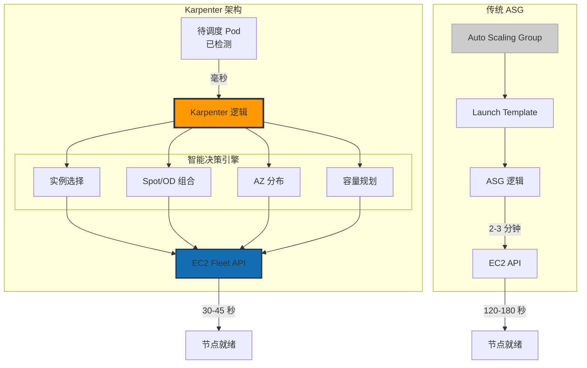
```mermaid
graph TB
    subgraph "Karpenter 架构"
        PP[待调度 Pod<br/>已检测]
        KL[Karpenter 逻辑]
        EC2[EC2 Fleet API]

        PP -->|毫秒| KL

        subgraph "智能决策引擎"
            IS[实例选择]
            SP[Spot/OD 组合]
            AZ[AZ 分布]
            CP[容量规划]
        end

        KL --> IS
        KL --> SP
        KL --> AZ
        KL --> CP

        IS --> EC2
        SP --> EC2
        AZ --> EC2
        CP --> EC2
    end

    subgraph "传统 ASG"
        ASG[Auto Scaling Group]
        LT[Launch Template]
        ASGL[ASG 逻辑]

        ASG --> LT
        LT --> ASGL
        ASGL -->|2-3 分钟| EC2_OLD[EC2 API]
    end

    EC2 -->|30-45 秒| NODE[节点就绪]
    EC2_OLD -->|120-180 秒| NODE_OLD[节点就绪]

    style KL fill:#ff9900,stroke:#232f3e,stroke-width:3px
    style EC2 fill:#146eb4,stroke:#232f3e,stroke-width:2px
    style ASG fill:#cccccc,stroke:#999999

```

## 高速指标架构：两种方法

要最小化扩缩容响应时间，需要快速检测系统。我们对比两种经过验证的架构。

### 方式 1：CloudWatch High-Resolution Integration

在 AWS 原生环境中利用 CloudWatch 的高分辨率指标。

#### 主要组件

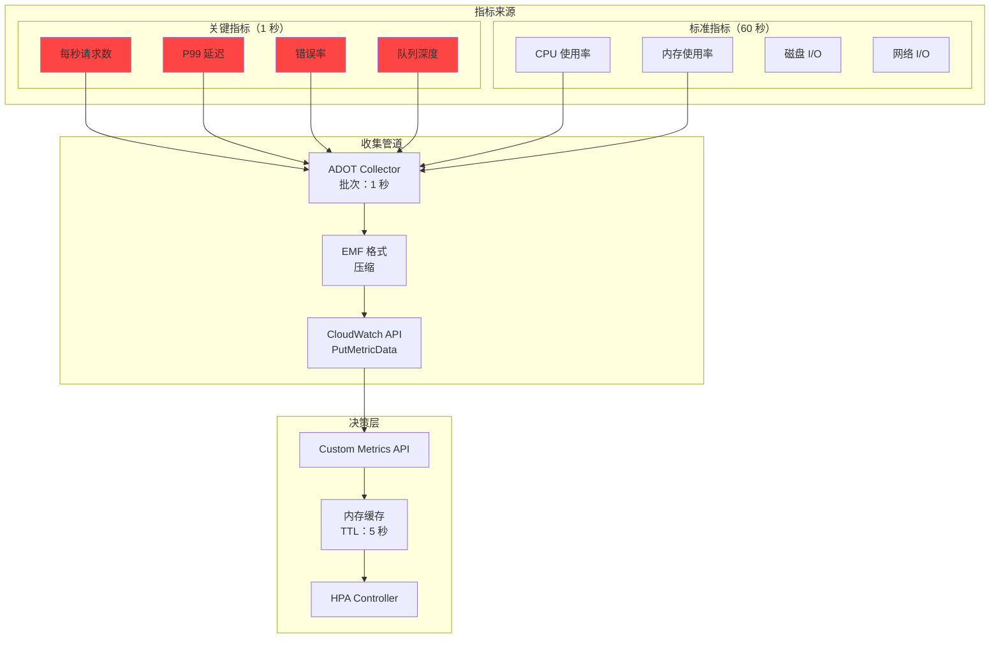
```mermaid
graph TB
    subgraph "指标来源"
        subgraph "关键指标（1 秒）"
            RPS[每秒请求数]
            LAT[P99 延迟]
            ERR[错误率]
            QUEUE[队列深度]
        end

        subgraph "标准指标（60 秒）"
            CPU[CPU 使用率]
            MEM[内存使用率]
            DISK[磁盘 I/O]
            NET[网络 I/O]
        end
    end

    subgraph "收集管道"
        AGENT[ADOT Collector<br/>批次：1 秒]
        EMF[EMF 格式<br/>压缩]
        CW[CloudWatch API<br/>PutMetricData]
    end

    subgraph "决策层"
        API[Custom Metrics API]
        CACHE[内存缓存<br/>TTL：5 秒]
        HPA[HPA Controller]
    end

    RPS --> AGENT
    LAT --> AGENT
    ERR --> AGENT
    QUEUE --> AGENT

    CPU --> AGENT
    MEM --> AGENT

    AGENT --> EMF
    EMF --> CW
    CW --> API
    API --> CACHE
    CACHE --> HPA

    style RPS fill:#ff4444
    style LAT fill:#ff4444
    style ERR fill:#ff4444
    style QUEUE fill:#ff4444

```

#### 扩缩容时间线

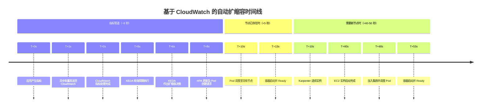
```mermaid
timeline
    title 基于 CloudWatch 的自动扩缩容时间线

    section 指标管道（~8 秒）
        T+0s  : 应用产生指标
        T+1s  : 异步批量发送至 CloudWatch
        T+2s  : CloudWatch 指标处理完成
        T+5s  : KEDA 轮询周期执行
        T+6s  : KEDA 作出扩缩容决策
        T+8s  : HPA 更新及 Pod 创建请求

    section 节点已存在时（+5 秒）
        T+10s : Pod 调度至现有节点
        T+13s : 容器启动并 Ready

    section 需要新节点时（+40-50 秒）
        T+10s : Karpenter 选择实例
        T+40s : EC2 实例启动完成
        T+48s : 加入集群并调度 Pod
        T+53s : 容器启动并 Ready
```

:::info 时间线解读
- **节点已存在的情况**（Warm Pool 或现有空闲节点）：E2E **~13 秒**
- **需要新节点供应的情况**：E2E **~53 秒**
- EC2 实例启动（30-40 秒）是物理限制，仅靠指标管道优化无法消除。
:::

**优点：**

- ✅ **快速指标收集**：1-2 秒的低延迟
- ✅ **简单配置**：AWS 原生集成
- ✅ **无管理开销**：不需要额外基础设施管理

**缺点：**

- ❌ **有限的吞吐量**：每账户 500 TPS（PutMetricData 区域限制）
- ❌ **Pod 限制**：每集群最多 5,000 个
- ❌ **高指标成本**：AWS CloudWatch 指标费用

### 方式 2：基于 ADOT + Prometheus 的架构

结合 AWS Distro for OpenTelemetry (ADOT) 和 Prometheus 的开源高性能管道。

#### 主要组件

- **ADOT Collector**：DaemonSet 和 Sidecar 混合部署
- **Prometheus**：HA 配置及 Remote Storage 集成
- **Thanos Query Layer**：提供多集群全局视图
- **KEDA Prometheus Scaler**：2 秒间隔高速轮询
- **Grafana Mimir**：长期存储及高速查询引擎

#### 扩缩容时间线（~66 秒）

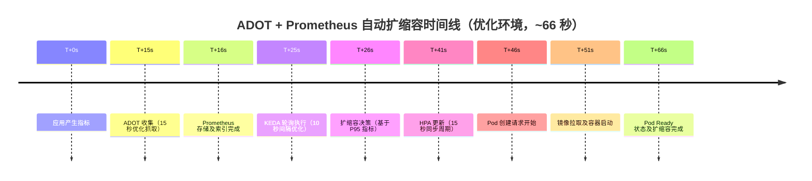
```mermaid
timeline
    title ADOT + Prometheus 自动扩缩容时间线（优化环境，~66 秒）

    T+0s   : 应用产生指标
    T+15s  : ADOT 收集（15 秒优化抓取）
    T+16s  : Prometheus 存储及索引完成
    T+25s  : KEDA 轮询执行（10 秒间隔优化）
    T+26s  : 扩缩容决策（基于 P95 指标）
    T+41s  : HPA 更新（15 秒同步周期）
    T+46s  : Pod 创建请求开始
    T+51s  : 镜像拉取及容器启动
    T+66s  : Pod Ready 状态及扩缩容完成
```

**优点：**

- ✅ **高吞吐量**：支持 100,000+ TPS
- ✅ **可扩展性**：支持每集群 20,000+ Pod
- ✅ **低指标成本**：仅产生存储成本（自管理）
- ✅ **完全控制**：配置和优化自由度高

**缺点：**

- ❌ **复杂配置**：需要额外组件管理
- ❌ **高运维复杂度**：需要 HA 配置、备份/恢复、性能调优
- ❌ **需要专业人员**：需要 Prometheus 运维经验

### 成本优化指标策略

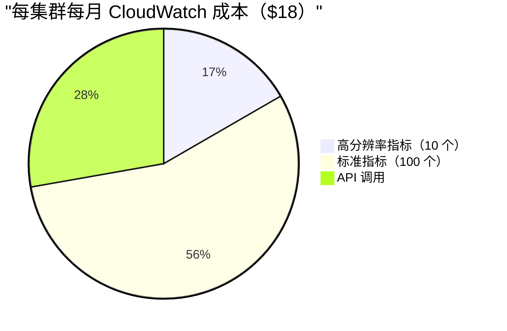
```mermaid
pie title "每集群每月 CloudWatch 成本（$18）"
    "高分辨率指标（10 个）" : 3
    "标准指标（100 个）" : 10
    "API 调用" : 5

```

28 个集群基准：综合监控每月约 $500 vs 所有指标使用高分辨率收集时 $30,000+

### 推荐使用场景

**CloudWatch High Resolution Metric 适合的情况：**

- 小规模应用（Pod 5,000 个以下）
- 简单的监控需求
- 偏好 AWS 原生解决方案
- 快速构建和稳定运维优先

**ADOT + Prometheus 适合的情况：**

- 大规模集群（Pod 20,000 个以上）
- 高指标处理吞吐量需求
- 需要精细监控和自定义
- 需要最高水平的性能和可扩展性

## 扩缩容优化架构：逐层分析

要最小化扩缩容响应时间，需要在所有层进行优化：

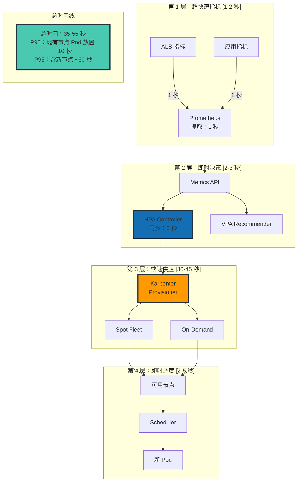
```mermaid
graph TB
    subgraph "第 1 层：超快速指标 [1-2 秒]"
        ALB[ALB 指标]
        APP[应用指标]
        PROM[Prometheus<br/>抓取：1 秒]

        ALB -->|1 秒| PROM
        APP -->|1 秒| PROM
    end

    subgraph "第 2 层：即时决策 [2-3 秒]"
        MA[Metrics API]
        HPA[HPA Controller<br/>同步：5 秒]
        VPA[VPA Recommender]

        PROM --> MA
        MA --> HPA
        MA --> VPA
    end

    subgraph "第 3 层：快速供应 [30-45 秒]"
        KARP[Karpenter<br/>Provisioner]
        SPOT[Spot Fleet]
        OD[On-Demand]

        HPA --> KARP
        KARP --> SPOT
        KARP --> OD
    end

    subgraph "第 4 层：即时调度 [2-5 秒]"
        SCHED[Scheduler]
        NODE[可用节点]
        POD[新 Pod]

        SPOT --> NODE
        OD --> NODE
        NODE --> SCHED
        SCHED --> POD
    end

    subgraph "总时间线"
        TOTAL[总时间：35-55 秒<br/>P95：现有节点 Pod 放置 ~10 秒<br/>P95：含新节点 ~60 秒]
    end

    style KARP fill:#ff9900,stroke:#232f3e,stroke-width:3px
    style HPA fill:#146eb4,stroke:#232f3e,stroke-width:2px
    style TOTAL fill:#48C9B0,stroke:#232f3e,stroke-width:3px

```

## Karpenter 核心配置

60 秒以内节点供应的关键在于最优的 Karpenter 配置：

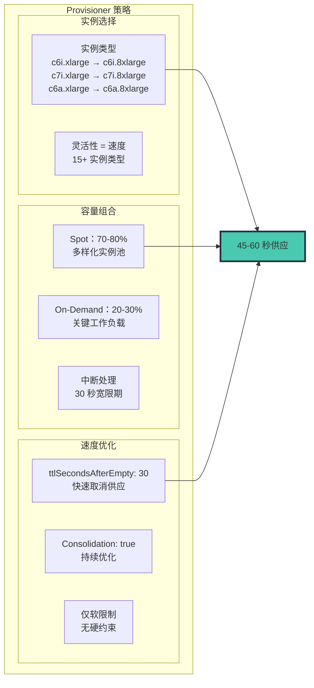
```mermaid
graph LR
    subgraph "Provisioner 策略"
        subgraph "实例选择"
            IT[实例类型<br/>c6i.xlarge → c6i.8xlarge<br/>c7i.xlarge → c7i.8xlarge<br/>c6a.xlarge → c6a.8xlarge]
            FLEX[灵活性 = 速度<br/>15+ 实例类型]
        end

        subgraph "容量组合"
            SPOT[Spot：70-80%<br/>多样化实例池]
            OD[On-Demand：20-30%<br/>关键工作负载]
            INT[中断处理<br/>30 秒宽限期]
        end

        subgraph "速度优化"
            TTL[ttlSecondsAfterEmpty: 30<br/>快速取消供应]
            CONS[Consolidation: true<br/>持续优化]
            LIMITS[仅软限制<br/>无硬约束]
        end
    end

    IT --> RESULT[45-60 秒供应]
    SPOT --> RESULT
    TTL --> RESULT

    style RESULT fill:#48C9B0,stroke:#232f3e,stroke-width:3px

```

### Karpenter NodePool YAML

```yaml
apiVersion: karpenter.sh/v1
kind: NodePool
metadata:
  name: fast-scaling
spec:
  # 速度优化配置
  disruption:
    consolidationPolicy: WhenEmptyOrUnderutilized
    consolidateAfter: 30s
    budgets:
    - nodes: "10%"

  # 为速度提供最大灵活性
  template:
    spec:
      requirements:
        - key: karpenter.sh/capacity-type
          operator: In
          values: ["spot", "on-demand"]
        - key: kubernetes.io/arch
          operator: In
          values: ["amd64"]
        - key: node.kubernetes.io/instance-type
          operator: In
          values:
            # 计算优化 - 默认选择
            - c6i.xlarge
            - c6i.2xlarge
            - c6i.4xlarge
            - c6i.8xlarge
            - c7i.xlarge
            - c7i.2xlarge
            - c7i.4xlarge
            - c7i.8xlarge
            # AMD 替代 - 更好的可用性
            - c6a.xlarge
            - c6a.2xlarge
            - c6a.4xlarge
            - c6a.8xlarge
            # 内存优化 - 特定工作负载
            - m6i.xlarge
            - m6i.2xlarge
            - m6i.4xlarge

      nodeClassRef:
        group: karpenter.k8s.aws
        kind: EC2NodeClass
        name: fast-nodepool

  # 保证快速供应
  limits:
    cpu: 100000  # 仅软限制
    memory: 400000Gi
---
apiVersion: karpenter.k8s.aws/v1
kind: EC2NodeClass
metadata:
  name: fast-nodepool
spec:
  amiSelectorTerms:
    - alias: al2023@latest

  subnetSelectorTerms:
    - tags:
        karpenter.sh/discovery: "${CLUSTER_NAME}"

  securityGroupSelectorTerms:
    - tags:
        karpenter.sh/discovery: "${CLUSTER_NAME}"

  role: "KarpenterNodeRole-${CLUSTER_NAME}"

  # 速度优化
  userData: |
    #!/bin/bash
    # 节点启动时间优化
    /etc/eks/bootstrap.sh ${CLUSTER_NAME} \
      --b64-cluster-ca ${B64_CLUSTER_CA} \
      --apiserver-endpoint ${API_SERVER_URL} \
      --kubelet-extra-args '--node-labels=karpenter.sh/fast-scaling=true --max-pods=110'

    # 关键镜像预拉取（registry.k8s.io 替代 k8s.gcr.io）
    ctr -n k8s.io images pull registry.k8s.io/pause:3.10 &
    ctr -n k8s.io images pull public.ecr.aws/eks-distro/kubernetes/pause:3.10 &

```

## 实时扩缩容工作流

所有组件协同工作以实现最优扩缩容性能：

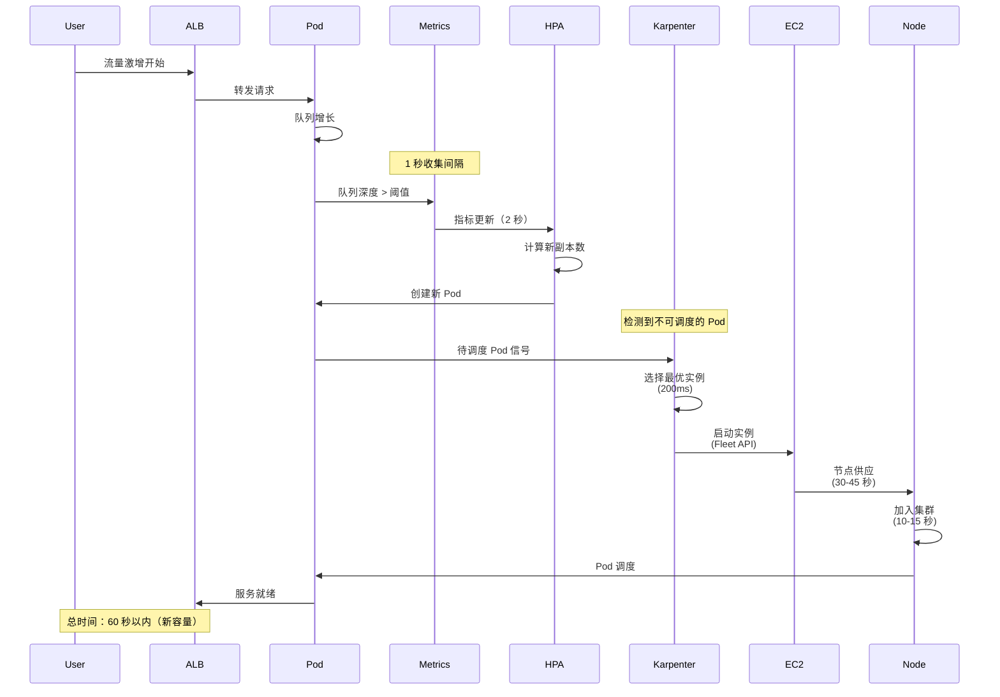
```mermaid
sequenceDiagram
    participant User
    participant ALB
    participant Pod
    participant Metrics
    participant HPA
    participant Karpenter
    participant EC2
    participant Node

    User->>ALB: 流量激增开始
    ALB->>Pod: 转发请求
    Pod->>Pod: 队列增长

    Note over Metrics: 1 秒收集间隔
    Pod->>Metrics: 队列深度 > 阈值
    Metrics->>HPA: 指标更新（2 秒）

    HPA->>HPA: 计算新副本数
    HPA->>Pod: 创建新 Pod

    Note over Karpenter: 检测到不可调度的 Pod
    Pod->>Karpenter: 待调度 Pod 信号
    Karpenter->>Karpenter: 选择最优实例<br/>(200ms)

    Karpenter->>EC2: 启动实例<br/>(Fleet API)
    EC2->>Node: 节点供应<br/>(30-45 秒)

    Node->>Node: 加入集群<br/>(10-15 秒)
    Node->>Pod: Pod 调度
    Pod->>ALB: 服务就绪

    Note over User,ALB: 总时间：60 秒以内（新容量）

```

## 用于激进扩缩容的 HPA 配置

HorizontalPodAutoscaler 必须配置为即时响应：

```yaml
apiVersion: autoscaling/v2
kind: HorizontalPodAutoscaler
metadata:
  name: ultra-fast-hpa
spec:
  scaleTargetRef:
    apiVersion: apps/v1
    kind: Deployment
    name: web-app
  minReplicas: 10
  maxReplicas: 1000

  metrics:
  # 主要指标 - 队列深度
  - type: External
    external:
      metric:
        name: sqs_queue_depth
        selector:
          matchLabels:
            queue: "web-requests"
      target:
        type: AverageValue
        averageValue: "10"

  # 辅助指标 - 请求速率
  - type: External
    external:
      metric:
        name: alb_request_rate
        selector:
          matchLabels:
            targetgroup: "web-tg"
      target:
        type: AverageValue
        averageValue: "100"

  behavior:
    scaleUp:
      stabilizationWindowSeconds: 0  # 无延迟！
      policies:
      - type: Percent
        value: 100
        periodSeconds: 10
      - type: Pods
        value: 100
        periodSeconds: 10
      selectPolicy: Max
    scaleDown:
      stabilizationWindowSeconds: 300  # 5 分钟冷却
      policies:
      - type: Percent
        value: 10
        periodSeconds: 60

```

## KEDA 使用时机：事件驱动场景

Karpenter 处理基础设施扩缩容，而 KEDA 在特定事件驱动场景中表现出色：

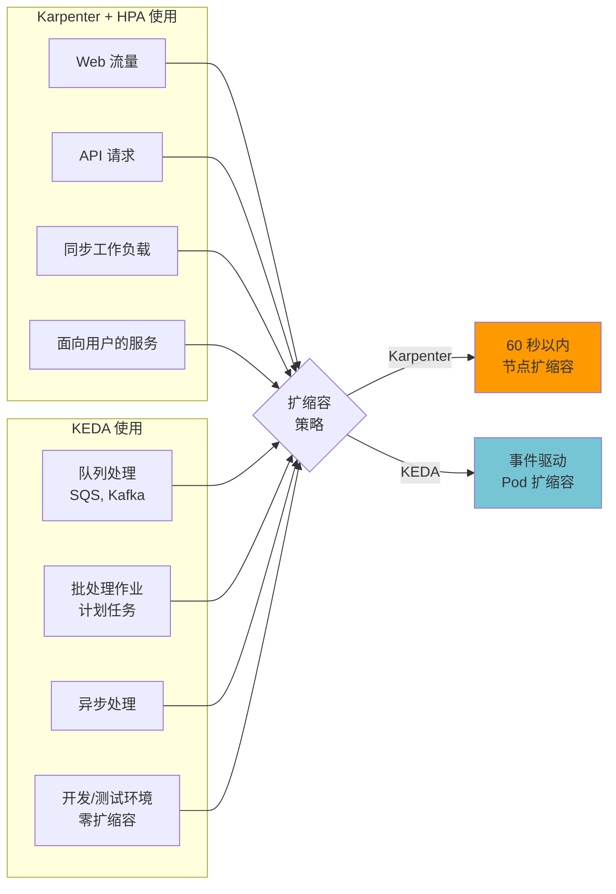
```mermaid
graph LR
    subgraph "Karpenter + HPA 使用"
        WEB[Web 流量]
        API[API 请求]
        SYNC[同步工作负载]
        USER[面向用户的服务]
    end

    subgraph "KEDA 使用"
        QUEUE[队列处理<br/>SQS, Kafka]
        BATCH[批处理作业<br/>计划任务]
        ASYNC[异步处理]
        DEV[开发/测试环境<br/>零扩缩容]
    end

    WEB --> DECISION{扩缩容<br/>策略}
    API --> DECISION
    SYNC --> DECISION
    USER --> DECISION

    QUEUE --> DECISION
    BATCH --> DECISION
    ASYNC --> DECISION
    DEV --> DECISION

    DECISION -->|Karpenter| FAST[60 秒以内<br/>节点扩缩容]
    DECISION -->|KEDA| EVENT[事件驱动<br/>Pod 扩缩容]

    style FAST fill:#ff9900
    style EVENT fill:#76c5d5

```

## 生产环境性能指标

处理日均 750K+ 请求的部署实际结果：

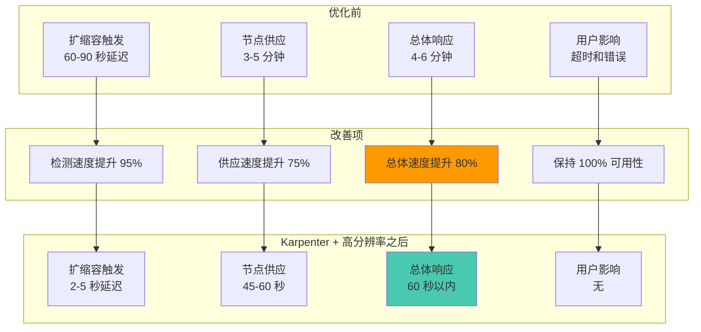
```mermaid
graph TB
    subgraph "优化前"
        B1[扩缩容触发<br/>60-90 秒延迟]
        B2[节点供应<br/>3-5 分钟]
        B3[总体响应<br/>4-6 分钟]
        B4[用户影响<br/>超时和错误]
    end

    subgraph "Karpenter + 高分辨率之后"
        A1[扩缩容触发<br/>2-5 秒延迟]
        A2[节点供应<br/>45-60 秒]
        A3[总体响应<br/>60 秒以内]
        A4[用户影响<br/>无]
    end

    subgraph "改善项"
        I1[检测速度提升 95%]
        I2[供应速度提升 75%]
        I3[总体速度提升 80%]
        I4[保持 100% 可用性]
    end

    B1 --> I1
    B2 --> I2
    B3 --> I3
    B4 --> I4

    I1 --> A1
    I2 --> A2
    I3 --> A3
    I4 --> A4

    style A3 fill:#48C9B0
    style I3 fill:#ff9900

```

## 多区域考虑

对于在多个区域运营的组织，为实现一致的高速扩缩容，需要按区域进行优化：

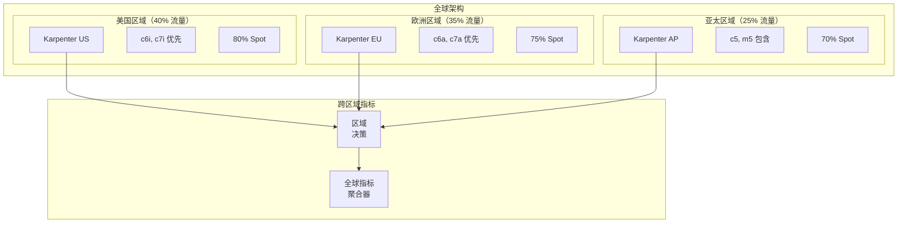
```mermaid
graph TB
    subgraph "全球架构"
        subgraph "美国区域（40% 流量）"
            US_KARP[Karpenter US]
            US_TYPES[c6i, c7i 优先]
            US_SPOT[80% Spot]
        end

        subgraph "欧洲区域（35% 流量）"
            EU_KARP[Karpenter EU]
            EU_TYPES[c6a, c7a 优先]
            EU_SPOT[75% Spot]
        end

        subgraph "亚太区域（25% 流量）"
            AP_KARP[Karpenter AP]
            AP_TYPES[c5, m5 包含]
            AP_SPOT[70% Spot]
        end
    end

    subgraph "跨区域指标"
        GLOBAL[全球指标<br/>聚合器]
        REGIONAL[区域<br/>决策]
    end

    US_KARP --> REGIONAL
    EU_KARP --> REGIONAL
    AP_KARP --> REGIONAL

    REGIONAL --> GLOBAL

```

## 扩缩容优化最佳实践

### 1. 指标选择

- 使用先行指标（队列深度、连接数），而非滞后指标（CPU）
- 每集群高分辨率指标保持在 10-15 个以下
- 批量提交指标以防止 API 限流

### 2. Karpenter 优化

- 提供最大实例类型灵活性
- 积极使用 Spot 实例并配合适当的中断处理
- 启用整合以提高成本效率
- 设置适当的 ttlSecondsAfterEmpty（30-60 秒）

### 3. HPA 调优

- 扩容使用零稳定窗口
- 激进的扩缩容策略（允许 100% 增长）
- 具有适当权重的多指标
- 缩容使用适当的冷却期

### 4. 监控

- 将 P95 扩缩容延迟作为基本 KPI 跟踪
- 对超过 15 秒的扩缩容失败或延迟设置告警
- 监控 Spot 中断率
- 跟踪每个扩缩容 Pod 的成本

## 常见问题排查

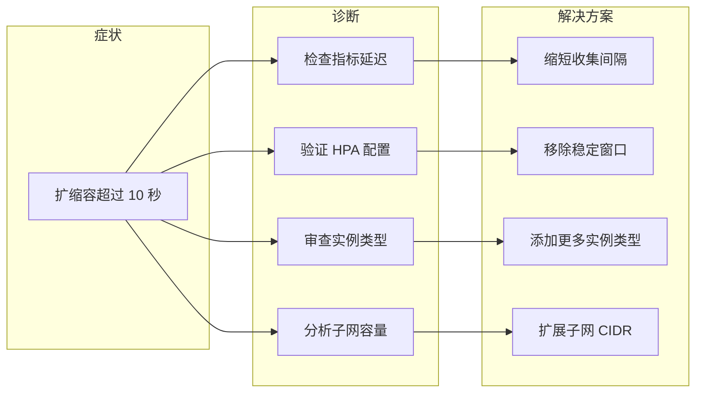
```mermaid
graph LR
    subgraph "症状"
        SLOW[扩缩容超过 10 秒]
    end

    subgraph "诊断"
        D1[检查指标延迟]
        D2[验证 HPA 配置]
        D3[审查实例类型]
        D4[分析子网容量]
    end

    subgraph "解决方案"
        S1[缩短收集间隔]
        S2[移除稳定窗口]
        S3[添加更多实例类型]
        S4[扩展子网 CIDR]
    end

    SLOW --> D1 --> S1
    SLOW --> D2 --> S2
    SLOW --> D3 --> S3
    SLOW --> D4 --> S4

```

## 混合方法（推荐）

在实际生产环境中，推荐使用两种方式混合的混合方法：

1. **关键任务服务**：使用 ADOT + Prometheus 实现 10-13 秒扩缩容
2. **一般服务**：使用 CloudWatch Direct 实现 12-15 秒扩缩容并简化运维
3. **渐进式迁移**：从 CloudWatch 开始，按需切换到 ADOT

## EKS Auto Mode vs Self-managed Karpenter

EKS Auto Mode（2025 GA）内置 Karpenter 并自动管理：

| 项目 | Self-managed Karpenter | EKS Auto Mode |
|------|----------------------|---------------|
| 安装/升级 | 自行管理（Helm） | AWS 自动管理 |
| NodePool 设置 | 完全自定义 | 有限配置 |
| 成本优化 | 精细控制可能 | 自动优化 |
| OS 补丁 | 自行管理 | 自动补丁 |
| 适合的环境 | 需要高级自定义 | 最小化运维负担 |

**推荐**：如有复杂的调度需求选择 Self-managed，如目标是简化运维则选择 EKS Auto Mode。

## P1：超快速扩缩容架构（Critical）

### 扩缩容延迟时间分解分析

为优化扩缩容响应时间，首先需要精细分解整个扩缩容链中产生的延迟时间。

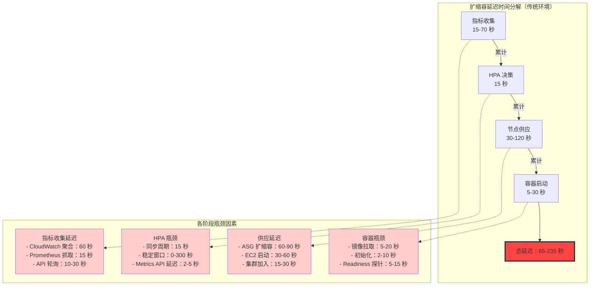
```mermaid
graph TB
    subgraph "扩缩容延迟时间分解（传统环境）"
        M[指标收集<br/>15-70 秒]
        H[HPA 决策<br/>15 秒]
        N[节点供应<br/>30-120 秒]
        C[容器启动<br/>5-30 秒]

        M -->|累计| H
        H -->|累计| N
        N -->|累计| C

        TOTAL[总延迟：65-235 秒]
        C --> TOTAL
    end

    subgraph "各阶段瓶颈因素"
        M1[指标收集延迟<br/>- CloudWatch 聚合：60 秒<br/>- Prometheus 抓取：15 秒<br/>- API 轮询：10-30 秒]

        H1[HPA 瓶颈<br/>- 同步周期：15 秒<br/>- 稳定窗口：0-300 秒<br/>- Metrics API 延迟：2-5 秒]

        N1[供应延迟<br/>- ASG 扩缩容：60-90 秒<br/>- EC2 启动：30-60 秒<br/>- 集群加入：15-30 秒]

        C1[容器瓶颈<br/>- 镜像拉取：5-20 秒<br/>- 初始化：2-10 秒<br/>- Readiness 探针：5-15 秒]
    end

    M -.-> M1
    H -.-> H1
    N -.-> N1
    C -.-> C1

    style TOTAL fill:#ff4444,stroke:#232f3e,stroke-width:3px
    style M1 fill:#ffcccc
    style H1 fill:#ffcccc
    style N1 fill:#ffcccc
    style C1 fill:#ffcccc
```

<ScalingLatencyBreakdown />

:::danger 结果
流量激增时**用户体验超过 5 分钟的错误** — 节点供应占总延迟的 60% 以上
:::

### 多层扩缩容策略

超快速扩缩容不是单一优化，而是通过**3 层回退策略**实现。

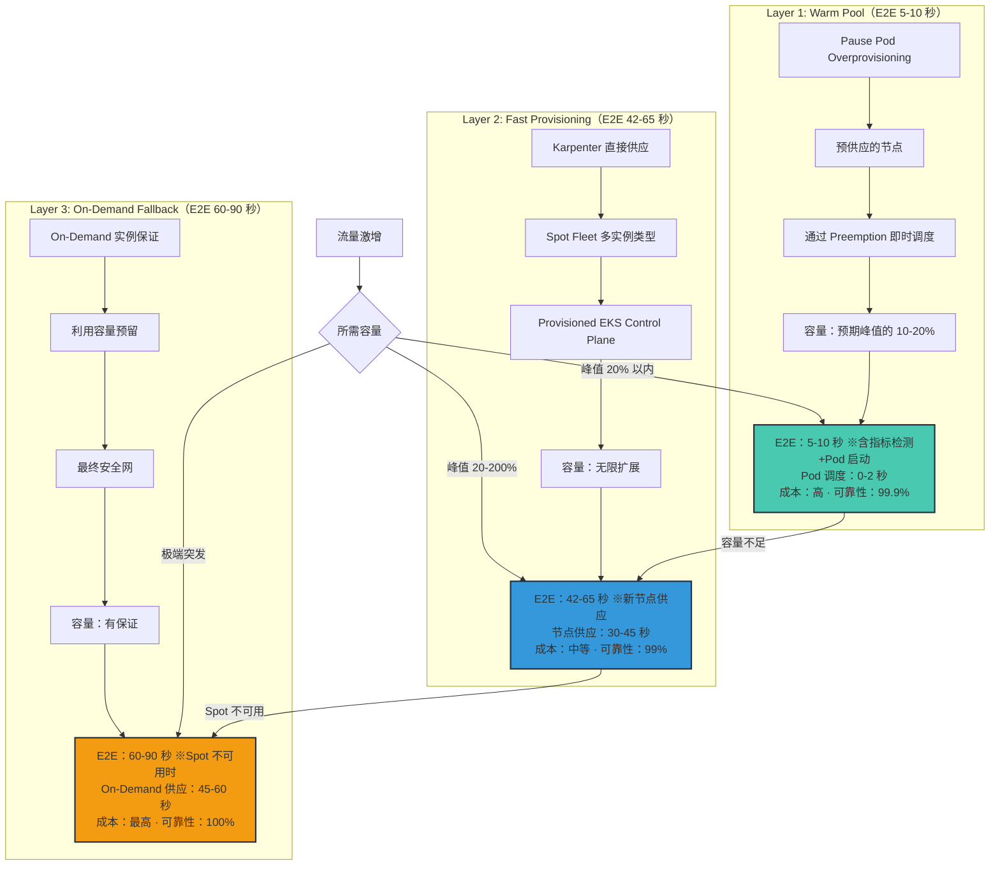
```mermaid
graph TB
    subgraph "Layer 1: Warm Pool（E2E 5-10 秒）"
        WP1[Pause Pod Overprovisioning]
        WP2[预供应的节点]
        WP3[通过 Preemption 即时调度]
        WP4[容量：预期峰值的 10-20%]

        WP1 --> WP2 --> WP3 --> WP4

        WP_RESULT[E2E：5-10 秒 ※含指标检测+Pod 启动<br/>Pod 调度：0-2 秒<br/>成本：高 · 可靠性：99.9%]
        WP4 --> WP_RESULT
    end

    subgraph "Layer 2: Fast Provisioning（E2E 42-65 秒）"
        FP1[Karpenter 直接供应]
        FP2[Spot Fleet 多实例类型]
        FP3[Provisioned EKS Control Plane]
        FP4[容量：无限扩展]

        FP1 --> FP2 --> FP3 --> FP4

        FP_RESULT[E2E：42-65 秒 ※新节点供应<br/>节点供应：30-45 秒<br/>成本：中等 · 可靠性：99%]
        FP4 --> FP_RESULT
    end

    subgraph "Layer 3: On-Demand Fallback（E2E 60-90 秒）"
        OD1[On-Demand 实例保证]
        OD2[利用容量预留]
        OD3[最终安全网]
        OD4[容量：有保证]

        OD1 --> OD2 --> OD3 --> OD4

        OD_RESULT[E2E：60-90 秒 ※Spot 不可用时<br/>On-Demand 供应：45-60 秒<br/>成本：最高 · 可靠性：100%]
        OD4 --> OD_RESULT
    end

    TRAFFIC[流量激增] --> DECISION{所需容量}
    DECISION -->|峰值 20% 以内| WP_RESULT
    DECISION -->|峰值 20-200%| FP_RESULT
    DECISION -->|极端突发| OD_RESULT

    WP_RESULT -->|容量不足| FP_RESULT
    FP_RESULT -->|Spot 不可用| OD_RESULT

    style WP_RESULT fill:#48C9B0,stroke:#232f3e,stroke-width:2px
    style FP_RESULT fill:#3498DB,stroke:#232f3e,stroke-width:2px
    style OD_RESULT fill:#F39C12,stroke:#232f3e,stroke-width:2px
```

### 各层扩缩容时间线对比

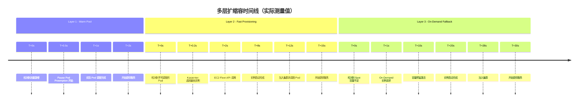
```mermaid
timeline
    title 多层扩缩容时间线（实际测量值）

    section Layer 1 - Warm Pool
        T+0s : 检测到流量激增
        T+0.5s : Pause Pod Preemption 开始
        T+1s : 实际 Pod 调度完成
        T+2s : 开始提供服务

    section Layer 2 - Fast Provisioning
        T+0s : 检测到不可调度的 Pod
        T+0.2s : Karpenter 选择最优实例
        T+2s : EC2 Fleet API 调用
        T+8s : 实例启动完成
        T+12s : 加入集群并调度 Pod
        T+15s : 开始提供服务

    section Layer 3 - On-Demand Fallback
        T+0s : 检测到 Spot 容量不足
        T+1s : On-Demand 实例请求
        T+10s : 容量预留激活
        T+20s : 实例启动完成
        T+28s : 加入集群
        T+30s : 开始提供服务
```

:::tip 层选择标准
**Layer 1（Warm Pool）** — 预分配策略：
- **本质**：不是自动扩缩容而是**过度供应**。通过 Pause Pod 预先确保节点
- E2E 5-10 秒（指标检测 + Preemption + 容器启动）
- **成本**：24 小时维护预期峰值容量的 10-20%（每月 $720-$5,400）
- **考量**：用相同成本增加基础 replica 可能更简单

**Layer 2（Fast Provisioning）** — 大多数场景的默认策略：
- Karpenter + Spot 实例进行实际节点供应
- E2E 42-65 秒（指标检测 + EC2 启动 + 容器启动）
- **成本**：与实际使用量成比例（Spot 70-80% 折扣）
- **考量**：与架构弹性（基于队列）组合使用时，此时间不会暴露给用户

**Layer 3（On-Demand Fallback）** — 必要保险：
- Spot 容量不足时的最终安全网
- E2E 60-90 秒（On-Demand 供应可能比 Spot 慢）
- **成本**：On-Demand 价格（最少使用）
:::

## P2: 通过 Provisioned EKS Control Plane 消除 API 瓶颈

### Provisioned Control Plane 概述

2025年11月，AWS 发布了 **EKS Provisioned Control Plane**。通过消除传统 Standard Control Plane 的 API 限流限制，在大规模突发场景中大幅提升了扩缩容速度。

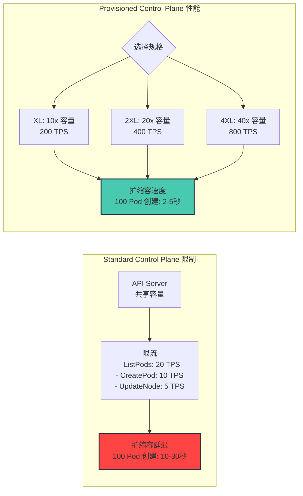
```mermaid
graph LR
    subgraph "Standard Control Plane 限制"
        STD_API[API Server<br/>共享容量]
        STD_THROTTLE[限流<br/>- ListPods: 20 TPS<br/>- CreatePod: 10 TPS<br/>- UpdateNode: 5 TPS]
        STD_DELAY[扩缩容延迟<br/>100 Pod 创建: 10-30秒]

        STD_API --> STD_THROTTLE --> STD_DELAY
    end

    subgraph "Provisioned Control Plane 性能"
        PROV_SIZE{选择规格}
        PROV_XL[XL: 10x 容量<br/>200 TPS]
        PROV_2XL[2XL: 20x 容量<br/>400 TPS]
        PROV_4XL[4XL: 40x 容量<br/>800 TPS]
        PROV_RESULT[扩缩容速度<br/>100 Pod 创建: 2-5秒]

        PROV_SIZE --> PROV_XL
        PROV_SIZE --> PROV_2XL
        PROV_SIZE --> PROV_4XL

        PROV_XL --> PROV_RESULT
        PROV_2XL --> PROV_RESULT
        PROV_4XL --> PROV_RESULT
    end

    style STD_DELAY fill:#ff4444,stroke:#232f3e,stroke-width:2px
    style PROV_RESULT fill:#48C9B0,stroke:#232f3e,stroke-width:2px
```

### Standard vs Provisioned 对比

<ControlPlaneComparison />

:::warning Provisioned Control Plane 选择标准
**需要升级到 Provisioned 的信号：**

1. **API 限流错误频繁**: `kubectl` 命令经常失败或重试
2. **大规模部署延迟**: 100+ Pod 部署耗时超过5分钟
3. **Karpenter 节点配置失败**: `too many requests` 错误
4. **HPA 扩缩容延迟**: Pod 创建请求在队列中堆积
5. **集群规模**: 常态1,000 Pod 以上或峰值3,000 Pod 以上

**成本 vs 性能权衡：**
- **Standard → XL**: 月增 $350 成本获得 **10倍 API 性能**（ROI：防止10分钟停机即可抵消）
- **XL → 2XL**: 仅超大规模集群(10,000+ Pod)需要
- **4XL**: 极限规模(50,000+ Pod)或多租户平台使用
:::

### Provisioned Control Plane 配置

#### 使用 AWS CLI 创建新集群

```bash
aws eks create-cluster \
  --name ultra-fast-cluster \
  --region us-east-1 \
  --role-arn arn:aws:iam::123456789012:role/EKSClusterRole \
  --resources-vpc-config subnetIds=subnet-xxx,subnet-yyy,securityGroupIds=sg-xxx \
  --kubernetes-version 1.32 \
  --compute-config enabled=true,nodePools=system,nodeRoleArn=arn:aws:iam::123456789012:role/EKSNodeRole \
  --kubernetes-network-config elasticLoadBalancing=disabled \
  --access-config authenticationMode=API \
  --upgrade-policy supportType=EXTENDED \
  --zonal-shift-config enabled=true \
  --compute-config enabled=true \
  --control-plane-placement groupName=my-placement-group,clusterTenancy=dedicated \
  --control-plane-provisioning mode=PROVISIONED,size=XL
```

#### 升级现有集群（Standard → Provisioned）

```bash
# 1. 检查当前 Control Plane 模式
aws eks describe-cluster --name my-cluster --query 'cluster.controlPlaneProvisioning'

# 2. 升级到 Provisioned（无停机）
aws eks update-cluster-config \
  --name my-cluster \
  --control-plane-provisioning mode=PROVISIONED,size=XL

# 3. 监控升级状态（约需10-15分钟）
aws eks describe-cluster \
  --name my-cluster \
  --query 'cluster.status'

# 4. 验证 API 性能
kubectl get pods --all-namespaces --watch
kubectl create deployment nginx --image=nginx --replicas=100
```

:::info 升级特性
- **无停机**: Control Plane 自动滚动升级
- **所需时间**: 10-15分钟（与集群规模无关）
- **不可回滚**: 不支持 Provisioned → Standard 降级
- **计费开始**: 升级完成后立即开始计费
:::

### 大规模突发时的性能对比

在实际生产环境中进行1,000 Pod 同时扩缩容测试：

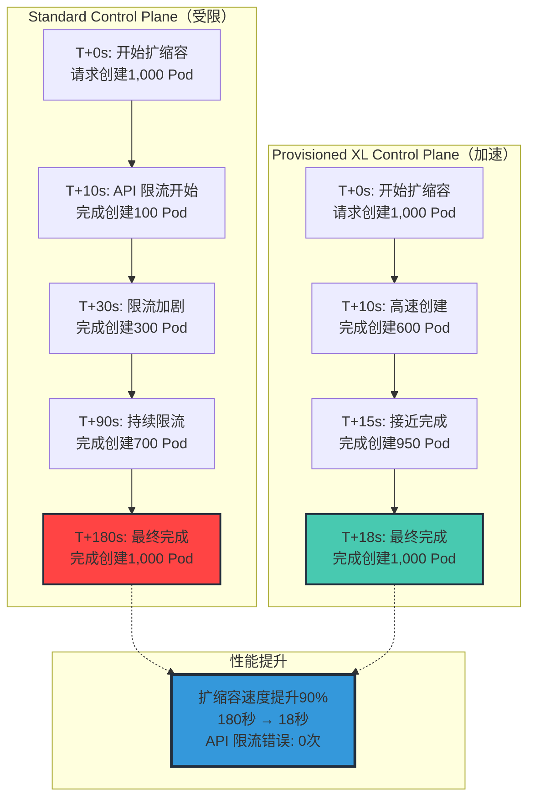
```mermaid
graph TB
    subgraph "Standard Control Plane（受限）"
        STD1[T+0s: 开始扩缩容<br/>请求创建1,000 Pod]
        STD2[T+10s: API 限流开始<br/>完成创建100 Pod]
        STD3[T+30s: 限流加剧<br/>完成创建300 Pod]
        STD4[T+90s: 持续限流<br/>完成创建700 Pod]
        STD5[T+180s: 最终完成<br/>完成创建1,000 Pod]

        STD1 --> STD2 --> STD3 --> STD4 --> STD5
    end

    subgraph "Provisioned XL Control Plane（加速）"
        PROV1[T+0s: 开始扩缩容<br/>请求创建1,000 Pod]
        PROV2[T+10s: 高速创建<br/>完成创建600 Pod]
        PROV3[T+15s: 接近完成<br/>完成创建950 Pod]
        PROV4[T+18s: 最终完成<br/>完成创建1,000 Pod]

        PROV1 --> PROV2 --> PROV3 --> PROV4
    end

    subgraph "性能提升"
        IMPROVE[扩缩容速度提升90%<br/>180秒 → 18秒<br/>API 限流错误: 0次]
    end

    STD5 -.-> IMPROVE
    PROV4 -.-> IMPROVE

    style STD5 fill:#ff4444,stroke:#232f3e,stroke-width:2px
    style PROV4 fill:#48C9B0,stroke:#232f3e,stroke-width:2px
    style IMPROVE fill:#3498DB,stroke:#232f3e,stroke-width:3px
```

## P3: Warm Pool / Overprovisioning 模式（核心策略）

### Pause Pod Overprovisioning 原理

Warm Pool 策略通过**预先部署低优先级的"pause" Pod**来提前配置节点。当实际工作负载需要时，立即驱逐(preempt) pause Pod，并在该节点上调度实际 Pod。

```mermaid
sequenceDiagram
    participant HPA as HPA Controller
    participant Scheduler as K8s Scheduler
    participant PausePod as Pause Pod<br/>(Priority: -1)
    participant Node as 预配置节点
    participant RealPod as 实际工作负载 Pod<br/>(Priority: 0)

    Note over Node,PausePod: 初始状态: Pause Pod 占用节点
    PausePod->>Node: Running（正在预留资源）

    Note over HPA: 检测到流量激增
    HPA->>RealPod: 请求创建新 Pod

    RealPod->>Scheduler: 调度请求
    Scheduler->>Scheduler: 优先级评估<br/>Real (0) > Pause (-1)

    Scheduler->>PausePod: Preempt 信号
    PausePod->>Node: 立即终止 (0.5秒)

    Scheduler->>RealPod: 调度到 Node
    RealPod->>Node: 立即启动 (1-2秒)

    Note over RealPod,Node: 总耗时: 1.5-2.5秒
```
### Overprovisioning 完整工作流程

```mermaid
graph TB
    subgraph "第1阶段: Warm Pool 预设置（高峰期之前）"
        CRON[CronJob 触发<br/>例: 上午8点30分]
        PAUSE_DEPLOY[创建 Pause Deployment<br/>Replicas: 预计峰值的15%]
        PAUSE_POD[部署 Pause Pod<br/>CPU: 1000m, Memory: 2Gi]
        KARP_PROVISION[Karpenter 节点配置<br/>选择 Spot 实例]
        WARM[Warm Pool 就绪<br/>可立即使用的容量]

        CRON --> PAUSE_DEPLOY --> PAUSE_POD --> KARP_PROVISION --> WARM
    end

    subgraph "第2阶段: 流量激增响应（实时）"
        TRAFFIC[流量激增发生]
        HPA_SCALE[HPA 扩容决策<br/>Replicas: 100 → 150]
        REAL_POD[实际 Pod 创建请求<br/>Priority: 0]
        PREEMPT[Pause Pod Preemption<br/>基于优先级驱逐]
        INSTANT[即时调度<br/>耗时1-2秒]

        TRAFFIC --> HPA_SCALE --> REAL_POD --> PREEMPT --> INSTANT
    end

    subgraph "第3阶段: 额外扩展（容量超出时）"
        OVERFLOW{Warm Pool<br/>耗尽?}
        MORE_NODES[Karpenter 追加节点<br/>Layer 2 策略启动]

        INSTANT --> OVERFLOW
        OVERFLOW -->|Yes| MORE_NODES
        OVERFLOW -->|No| INSTANT
    end

    subgraph "第4阶段: 缩容与补充（高峰结束后）"
        SCALE_DOWN[HPA 缩容<br/>Replicas: 150 → 100]
        REFILL[重新部署 Pause Pod<br/>补充 Warm Pool]
        CLEANUP[清理空闲节点<br/>ttlSecondsAfterEmpty: 60s]

        SCALE_DOWN --> REFILL --> CLEANUP
    end

    WARM --> TRAFFIC
    MORE_NODES --> SCALE_DOWN

    style INSTANT fill:#48C9B0,stroke:#232f3e,stroke-width:3px
    style WARM fill:#3498DB,stroke:#232f3e,stroke-width:2px
```

### Pause Pod Overprovisioning YAML 配置

#### 1. PriorityClass 定义（低优先级）

```yaml
apiVersion: scheduling.k8s.io/v1
kind: PriorityClass
metadata:
  name: overprovisioning
value: -1  # 负数优先级: 低于所有实际工作负载
globalDefault: false
description: "Pause pods for warm pool - will be preempted by real workloads"
```

#### 2. Pause Deployment（基础 Warm Pool）

```yaml
apiVersion: apps/v1
kind: Deployment
metadata:
  name: overprovisioning-pause
  namespace: kube-system
spec:
  replicas: 10  # 对应预计峰值15%的 Pod 数量
  selector:
    matchLabels:
      app: overprovisioning-pause
  template:
    metadata:
      labels:
        app: overprovisioning-pause
    spec:
      priorityClassName: overprovisioning
      terminationGracePeriodSeconds: 0  # 立即终止

      # 调度约束（与实际工作负载使用同一节点池）
      nodeSelector:
        karpenter.sh/nodepool: fast-scaling

      containers:
      - name: pause
        image: registry.k8s.io/pause:3.9
        resources:
          requests:
            cpu: "1000m"      # 实际工作负载平均 CPU
            memory: "2Gi"     # 实际工作负载平均内存
          limits:
            cpu: "1000m"
            memory: "2Gi"
```

#### 3. 按时段自动调整 Warm Pool（CronJob）

```yaml
---
# 高峰期前扩展 Warm Pool（上午8:30）
apiVersion: batch/v1
kind: CronJob
metadata:
  name: scale-up-warm-pool
  namespace: kube-system
spec:
  schedule: "30 8 * * 1-5"  # 工作日上午8:30
  jobTemplate:
    spec:
      template:
        spec:
          serviceAccountName: warm-pool-scaler
          restartPolicy: OnFailure
          containers:
          - name: kubectl
            image: bitnami/kubectl:latest
            command:
            - /bin/sh
            - -c
            - |
              kubectl scale deployment overprovisioning-pause \
                --namespace kube-system \
                --replicas=30  # 高峰时段扩展
---
# 高峰期后缩小 Warm Pool（下午7:00）
apiVersion: batch/v1
kind: CronJob
metadata:
  name: scale-down-warm-pool
  namespace: kube-system
spec:
  schedule: "0 19 * * 1-5"  # 工作日下午7:00
  jobTemplate:
    spec:
      template:
        spec:
          serviceAccountName: warm-pool-scaler
          restartPolicy: OnFailure
          containers:
          - name: kubectl
            image: bitnami/kubectl:latest
            command:
            - /bin/sh
            - -c
            - |
              kubectl scale deployment overprovisioning-pause \
                --namespace kube-system \
                --replicas=5  # 夜间最低容量
---
# CronJob 用 ServiceAccount 和 RBAC
apiVersion: v1
kind: ServiceAccount
metadata:
  name: warm-pool-scaler
  namespace: kube-system
---
apiVersion: rbac.authorization.k8s.io/v1
kind: Role
metadata:
  name: warm-pool-scaler
  namespace: kube-system
rules:
- apiGroups: ["apps"]
  resources: ["deployments", "deployments/scale"]
  verbs: ["get", "patch", "update"]
---
apiVersion: rbac.authorization.k8s.io/v1
kind: RoleBinding
metadata:
  name: warm-pool-scaler
  namespace: kube-system
roleRef:
  apiGroup: rbac.authorization.k8s.io
  kind: Role
  name: warm-pool-scaler
subjects:
- kind: ServiceAccount
  name: warm-pool-scaler
  namespace: kube-system
```
### Warm Pool 容量计算方法

```mermaid
graph TB
    subgraph "第1步: 流量模式分析"
        BASELINE[基准容量<br/>平时 Replicas: 100]
        PEAK[峰值容量<br/>最大 Replicas: 200]
        BURST[突发速率<br/>每秒增加10 Pod]

        ANALYSIS[分析结果<br/>峰值差值: 100 Pod<br/>10秒内需要: 100 Pod]
    end

    subgraph "第2步: 确定 Warm Pool 容量"
        FORMULA[Warm Pool 容量 = <br/>峰值差值 × 安全系数]
        SAFETY[安全系数选择<br/>- 保守型: 0.20 (20%)<br/>- 均衡型: 0.15 (15%)<br/>- 激进型: 0.10 (10%)]

        CALC[计算示例<br/>100 Pod × 0.15 = 15 Pod]
    end

    subgraph "第3步: 成本 vs 速度权衡"
        COST[Warm Pool 成本<br/>15 Pod × $0.05/hr = $0.75/hr<br/>月度: $540]

        BENEFIT[延迟降低<br/>60秒 → 2秒（97%改善）<br/>SLA 违规防止: $10,000/月]

        ROI[ROI 分析<br/>投入: $540/月<br/>节省: $10,000/月<br/>净收益: $9,460/月]
    end

    BASELINE --> ANALYSIS
    PEAK --> ANALYSIS
    BURST --> ANALYSIS

    ANALYSIS --> FORMULA --> SAFETY --> CALC
    CALC --> COST --> BENEFIT --> ROI

    style ROI fill:#48C9B0,stroke:#232f3e,stroke-width:3px
```

### 成本分析与优化

<WarmPoolCostAnalysis />

:::tip Warm Pool 优化策略
**成本节省方法：**

1. **按时段扩缩容**: 使用 CronJob 在夜间/周末缩小 Warm Pool（节省50-70%成本）
2. **使用 Spot 实例**: Pause Pod 也部署在 Spot 节点上（70%折扣）
3. **自适应容量调整**: 基于 CloudWatch Metrics 自动扩缩容
4. **混合策略**: 仅在高峰时段使用 Warm Pool，其他时段依赖 Layer 2

**ROI 计算公式：**
```
ROI = (SLA 违规防止成本 + 营收机会损失防止) - Warm Pool 成本

示例:
- SLA 违规罚金: $5,000/次
- 月均违规次数（无 Warm Pool 时）: 3次
- Warm Pool 成本: $1,080/月
- ROI = ($5,000 × 3) - $1,080 = $13,920/月 (1,290% ROI)
```
:::

## P4: Setu - Kueue + Karpenter 主动配置

### Setu 概述

**Setu** 连接 Kueue（队列系统）和 Karpenter，**为需要 Gang Scheduling 的 AI/ML 工作负载提供预先节点配置**。传统 Karpenter 在 Pod 创建后被动配置节点，而 Setu 在 Job 进入队列的瞬间就预先配置所需节点。

```mermaid
graph TB
    subgraph "传统 Karpenter 方式（被动）"
        OLD1[提交 Job]
        OLD2[Kueue 队列等待]
        OLD3[获取资源配额]
        OLD4[创建 Pod]
        OLD5[Karpenter 响应<br/>开始节点配置]
        OLD6[节点就绪 (60-90秒)]
        OLD7[Pod 调度]
        OLD8[Job 开始执行]

        OLD1 --> OLD2 --> OLD3 --> OLD4 --> OLD5 --> OLD6 --> OLD7 --> OLD8

        OLD_TIME[总耗时: 90-120秒]
        OLD8 --> OLD_TIME
    end

    subgraph "Setu 方式（主动）"
        NEW1[提交 Job]
        NEW2[进入 Kueue 队列]
        NEW3[触发 Setu AdmissionCheck]
        NEW4[预先创建 Karpenter NodeClaim]
        NEW5[节点配置 (60-90秒)]
        NEW6[获取资源配额]
        NEW7[创建 Pod 并立即调度]
        NEW8[Job 开始执行]

        NEW1 --> NEW2 --> NEW3 --> NEW4
        NEW4 --> NEW5
        NEW5 --> NEW6
        NEW3 --> NEW6
        NEW6 --> NEW7 --> NEW8

        NEW_TIME[总耗时: 15-30秒<br/>节点配置与队列等待并行化]
        NEW8 --> NEW_TIME
    end

    style OLD_TIME fill:#ff4444,stroke:#232f3e,stroke-width:2px
    style NEW_TIME fill:#48C9B0,stroke:#232f3e,stroke-width:3px
```

### Setu 架构与工作原理

```mermaid
sequenceDiagram
    participant User as 用户
    participant Job as Kubernetes Job
    participant Kueue as Kueue Controller
    participant Setu as Setu Controller
    participant Karp as Karpenter
    participant Node as EC2 Node
    participant Pod as Pod

    User->>Job: 提交 Job（请求8 GPU）
    Job->>Kueue: 进入队列

    Note over Kueue: ClusterQueue 中存在 AdmissionCheck
    Kueue->>Setu: 触发 AdmissionCheck

    Setu->>Setu: 分析 Job 需求<br/>- GPU: 8个<br/>- 内存: 128Gi<br/>- 预计节点: p4d.24xlarge

    Setu->>Karp: 创建 NodeClaim<br/>（直接调用 Karpenter API）

    Note over Karp,Node: 开始节点配置（异步）
    Karp->>Node: 启动 p4d.24xlarge 实例

    par 并行处理
        Node->>Node: 加入集群 (60-90秒)
    and
        Kueue->>Kueue: 获取资源配额
        Kueue->>Job: 批准 Job Admission
        Job->>Pod: 创建 Pod
    end

    Node->>Karp: 转为 Ready 状态
    Setu->>Kueue: AdmissionCheck 完成

    Pod->>Node: 立即调度（节点已就绪）
    Pod->>Pod: Job 开始执行

    Note over User,Pod: 总耗时: 仅等同于节点配置时间<br/>（队列等待与配置并行化）
```
### Setu 安装与配置

#### 1. Setu 安装（Helm）

```bash
# 添加 Setu Helm 仓库
helm repo add setu https://sanjeevrg89.github.io/Setu
helm repo update

# 安装 Setu（需要 Kueue 和 Karpenter）
helm install setu setu/setu \
  --namespace kueue-system \
  --create-namespace \
  --set karpenter.enabled=true \
  --set karpenter.namespace=karpenter
```

#### 2. 带有 AdmissionCheck 的 ClusterQueue

```yaml
apiVersion: kueue.x-k8s.io/v1beta1
kind: ClusterQueue
metadata:
  name: gpu-cluster-queue
spec:
  namespaceSelector: {}

  # 资源配额（整个集群限制）
  resourceGroups:
  - coveredResources: ["cpu", "memory", "nvidia.com/gpu"]
    flavors:
    - name: gpu-flavor
      resources:
      - name: "cpu"
        nominalQuota: 1000
      - name: "memory"
        nominalQuota: 4000Gi
      - name: "nvidia.com/gpu"
        nominalQuota: 64

  # 启用 Setu AdmissionCheck
  admissionChecks:
  - setu-provisioning  # Setu 预先配置节点
---
apiVersion: kueue.x-k8s.io/v1beta1
kind: AdmissionCheck
metadata:
  name: setu-provisioning
spec:
  controllerName: setu.kueue.x-k8s.io/provisioning

  # Setu 参数
  parameters:
    apiGroup: setu.kueue.x-k8s.io/v1alpha1
    kind: ProvisioningParameters
    name: gpu-provisioning
---
apiVersion: setu.kueue.x-k8s.io/v1alpha1
kind: ProvisioningParameters
metadata:
  name: gpu-provisioning
spec:
  # Karpenter NodePool 引用
  nodePoolName: gpu-nodepool

  # 配置策略
  strategy:
    type: Proactive  # 预先配置
    bufferTime: 15s  # Job Admission 前等待时间

  # 节点需求映射
  nodeSelectorRequirements:
  - key: node.kubernetes.io/instance-type
    operator: In
    values:
    - p4d.24xlarge
    - p4de.24xlarge
  - key: karpenter.sh/capacity-type
    operator: In
    values:
    - on-demand  # GPU 避免 Spot 中断风险
```

#### 3. GPU NodePool（Karpenter）

```yaml
apiVersion: karpenter.sh/v1
kind: NodePool
metadata:
  name: gpu-nodepool
spec:
  template:
    spec:
      requirements:
      - key: node.kubernetes.io/instance-type
        operator: In
        values:
        - p4d.24xlarge   # 8× A100 (40GB)
        - p4de.24xlarge  # 8× A100 (80GB)
        - p5.48xlarge    # 8× H100

      - key: karpenter.sh/capacity-type
        operator: In
        values:
        - on-demand  # GPU 工作负载避免中断风险

      nodeClassRef:
        group: karpenter.k8s.aws
        kind: EC2NodeClass
        name: gpu-nodeclass

  # GPU 节点长时间保持（考虑训练时间）
  disruption:
    consolidationPolicy: WhenEmpty
    consolidateAfter: 300s  # 空闲5分钟后移除
---
apiVersion: karpenter.k8s.aws/v1
kind: EC2NodeClass
metadata:
  name: gpu-nodeclass
spec:
  amiSelectorTerms:
  - alias: al2023@latest  # 包含 GPU 驱动

  subnetSelectorTerms:
  - tags:
      karpenter.sh/discovery: "${CLUSTER_NAME}"

  securityGroupSelectorTerms:
  - tags:
      karpenter.sh/discovery: "${CLUSTER_NAME}"

  role: "KarpenterNodeRole-${CLUSTER_NAME}"

  # GPU 优化 UserData
  userData: |
    #!/bin/bash
    # EKS 优化 GPU AMI 设置
    /etc/eks/bootstrap.sh ${CLUSTER_NAME} \
      --b64-cluster-ca ${B64_CLUSTER_CA} \
      --apiserver-endpoint ${API_SERVER_URL} \
      --kubelet-extra-args '--node-labels=nvidia.com/gpu=true --max-pods=110'

    # NVIDIA 驱动验证
    nvidia-smi || echo "GPU driver not loaded"
```

#### 4. AI/ML Job 提交示例

```yaml
apiVersion: batch/v1
kind: Job
metadata:
  name: llm-training
  labels:
    kueue.x-k8s.io/queue-name: gpu-queue  # 指定 LocalQueue
spec:
  parallelism: 8  # Gang Scheduling（8 Pod 同时执行）
  completions: 8

  template:
    spec:
      restartPolicy: OnFailure

      # 用于 Gang Scheduling 的 PodGroup
      schedulerName: default-scheduler

      containers:
      - name: training
        image: nvcr.io/nvidia/pytorch:24.01-py3

        command:
        - python3
        - /workspace/train.py
        - --distributed
        - --nodes=8

        resources:
          requests:
            nvidia.com/gpu: 1  # 每 Pod 1 GPU
            cpu: "48"
            memory: "320Gi"
          limits:
            nvidia.com/gpu: 1
            cpu: "48"
            memory: "320Gi"
---
apiVersion: kueue.x-k8s.io/v1beta1
kind: LocalQueue
metadata:
  name: gpu-queue
  namespace: default
spec:
  clusterQueue: gpu-cluster-queue  # 引用 ClusterQueue
```
### Setu 性能改善测量

```mermaid
graph TB
    subgraph "无 Setu（传统 Karpenter）"
        NO1[提交 Job]
        NO2[Kueue 等待: 30秒<br/>获取资源配额]
        NO3[创建 Pod]
        NO4[Karpenter 响应: 5秒]
        NO5[节点配置: 90秒<br/>p4d.24xlarge]
        NO6[Pod 调度: 10秒]
        NO7[Job 开始执行]

        NO1 --> NO2 --> NO3 --> NO4 --> NO5 --> NO6 --> NO7

        NO_TOTAL[总耗时: 135秒]
        NO7 --> NO_TOTAL
    end

    subgraph "使用 Setu（主动）"
        YES1[提交 Job]
        YES2[Kueue + Setu 同时触发]

        YES3A[Kueue: 资源验证 30秒]
        YES3B[Setu: 立即创建 NodeClaim]

        YES4[节点配置: 90秒<br/>并行进行]
        YES5[创建 Pod 并立即调度: 5秒]
        YES6[Job 开始执行]

        YES1 --> YES2
        YES2 --> YES3A
        YES2 --> YES3B

        YES3A --> YES5
        YES3B --> YES4
        YES4 --> YES5
        YES5 --> YES6

        YES_TOTAL[总耗时: 95秒<br/>改善40秒（缩短30%）]
        YES6 --> YES_TOTAL
    end

    style NO_TOTAL fill:#ff4444,stroke:#232f3e,stroke-width:2px
    style YES_TOTAL fill:#48C9B0,stroke:#232f3e,stroke-width:3px
```

:::info Setu GitHub 及更多信息
**GitHub**: https://github.com/sanjeevrg89/Setu

**主要特点：**
- 利用 Kueue AdmissionCheck API
- 直接创建 Karpenter NodeClaim
- 优化 Gang Scheduling 工作负载（所有 Pod 需要同时执行的场景）
- 通过预先配置 GPU 节点消除等待时间

**适用场景：**
- 分布式 AI/ML 训练（PyTorch DDP、Horovod）
- 基于 MPI 的 HPC 工作负载
- 大规模批量仿真
- 多节点数据处理 Job
:::

## P5: 通过 Node Readiness Controller 消除启动延迟

### Node Readiness 问题

即使 Karpenter 快速配置了节点，在实际 Pod 调度之前，**CNI/CSI/GPU 驱动初始化延迟**仍然会发生。传统上，kubelet 会等待所有 DaemonSet 运行后才将节点转为 Ready 状态。

```mermaid
graph TB
    subgraph "传统节点 Ready 流程（60-90秒）"
        OLD1[EC2 实例启动: 30秒]
        OLD2[kubelet 启动: 5秒]
        OLD3[CNI DaemonSet 运行: 15秒<br/>VPC CNI 初始化]
        OLD4[CSI DaemonSet 运行: 10秒<br/>EBS CSI 驱动]
        OLD5[GPU DaemonSet 运行: 20秒<br/>NVIDIA device plugin]
        OLD6[节点 Ready 状态: 5秒]
        OLD7[可调度 Pod]

        OLD1 --> OLD2 --> OLD3 --> OLD4 --> OLD5 --> OLD6 --> OLD7

        OLD_TOTAL[总延迟: 85秒]
        OLD7 --> OLD_TOTAL
    end

    subgraph "Node Readiness Controller（30-40秒）"
        NEW1[EC2 实例启动: 30秒]
        NEW2[kubelet 启动: 5秒]
        NEW3[仅等待核心 CNI: 5秒<br/>仅 VPC CNI 基本初始化]
        NEW4[节点 Ready 状态: 立即]
        NEW5[可调度 Pod]
        NEW6[其余 DaemonSet 并行运行<br/>CSI、GPU（后台）]

        NEW1 --> NEW2 --> NEW3 --> NEW4 --> NEW5
        NEW3 --> NEW6

        NEW_TOTAL[总延迟: 40秒<br/>缩短50%]
        NEW5 --> NEW_TOTAL
    end

    style OLD_TOTAL fill:#ff4444,stroke:#232f3e,stroke-width:2px
    style NEW_TOTAL fill:#48C9B0,stroke:#232f3e,stroke-width:3px
```

### Node Readiness Controller 原理

**Node Readiness Controller (NRC)** 精细控制节点转为 Ready 状态的条件。默认情况下 kubelet 会等待所有 DaemonSet 运行，但 NRC 可以配置为**仅选择性等待必要组件**。

```mermaid
sequenceDiagram
    participant EC2 as EC2 实例
    participant Kubelet as kubelet
    participant NRC as Node Readiness Controller
    participant CNI as VPC CNI DaemonSet
    participant CSI as EBS CSI DaemonSet
    participant Scheduler as kube-scheduler
    participant Pod as 用户 Pod

    EC2->>Kubelet: 实例启动完成
    Kubelet->>NRC: 检查 NodeReadinessRule

    Note over NRC: bootstrap-only 模式<br/>仅检查必要组件

    NRC->>CNI: 等待初始化 (5秒)
    CNI->>NRC: 基本网络就绪

    NRC->>Kubelet: Ready 条件满足
    Kubelet->>Scheduler: 节点转为 Ready 状态

    par 并行进行
        Scheduler->>Pod: 立即开始 Pod 调度
    and
        CSI->>CSI: 后台初始化 (10秒)
    end

    Pod->>EC2: 开始执行（仅需 CNI）

    Note over EC2,Pod: 总延迟: 40秒<br/>（消除 CSI 等待）
```
### Node Readiness Controller 安装

#### 1. NRC 安装（Helm）

```bash
# 需要 Node Feature Discovery (NFD)（NRC 依赖项）
helm repo add nfd https://kubernetes-sigs.github.io/node-feature-discovery/charts
helm install nfd nfd/node-feature-discovery \
  --namespace kube-system

# 安装 Node Readiness Controller
kubectl apply -f https://raw.githubusercontent.com/kubernetes-sigs/node-readiness-controller/main/deploy/manifests.yaml
```

#### 2. NodeReadinessRule CRD 定义

```yaml
apiVersion: nodereadiness.k8s.io/v1alpha1
kind: NodeReadinessRule
metadata:
  name: bootstrap-only
spec:
  # bootstrap-only 模式: 仅等待必要组件
  mode: bootstrap-only

  # 必需 DaemonSet（仅等待这些）
  requiredDaemonSets:
  - namespace: kube-system
    name: aws-node  # VPC CNI
    selector:
      matchLabels:
        k8s-app: aws-node

  # 可选 DaemonSet（后台初始化）
  optionalDaemonSets:
  - namespace: kube-system
    name: ebs-csi-node  # EBS CSI 仅需要块存储的 Pod 使用
    selector:
      matchLabels:
        app: ebs-csi-node

  - namespace: kube-system
    name: nvidia-device-plugin  # 仅 GPU Pod 需要
    selector:
      matchLabels:
        name: nvidia-device-plugin-ds

  # Node Selector（应用此规则的节点）
  nodeSelector:
    matchLabels:
      karpenter.sh/nodepool: fast-scaling

  # Readiness 超时（最大等待时间）
  readinessTimeout: 60s
```

### Karpenter + NRC 集成配置

#### 1. 带有 NRC Annotation 的 Karpenter NodePool

```yaml
apiVersion: karpenter.sh/v1
kind: NodePool
metadata:
  name: fast-scaling-nrc
spec:
  template:
    metadata:
      # 启用 NRC Annotation
      annotations:
        nodereadiness.k8s.io/rule: bootstrap-only

    spec:
      requirements:
      - key: karpenter.sh/capacity-type
        operator: In
        values: ["spot", "on-demand"]

      - key: node.kubernetes.io/instance-type
        operator: In
        values:
        - c6i.xlarge
        - c6i.2xlarge
        - c6i.4xlarge

      nodeClassRef:
        group: karpenter.k8s.aws
        kind: EC2NodeClass
        name: fast-nodepool-nrc

  disruption:
    consolidationPolicy: WhenEmptyOrUnderutilized
    consolidateAfter: 30s
---
apiVersion: karpenter.k8s.aws/v1
kind: EC2NodeClass
metadata:
  name: fast-nodepool-nrc
spec:
  amiSelectorTerms:
  - alias: al2023@latest

  subnetSelectorTerms:
  - tags:
      karpenter.sh/discovery: "${CLUSTER_NAME}"

  securityGroupSelectorTerms:
  - tags:
      karpenter.sh/discovery: "${CLUSTER_NAME}"

  role: "KarpenterNodeRole-${CLUSTER_NAME}"

  # NRC 优化的 UserData
  userData: |
    #!/bin/bash
    # EKS 引导（最小选项）
    /etc/eks/bootstrap.sh ${CLUSTER_NAME} \
      --b64-cluster-ca ${B64_CLUSTER_CA} \
      --apiserver-endpoint ${API_SERVER_URL} \
      --kubelet-extra-args '--node-labels=karpenter.sh/fast-scaling=true,nodereadiness.k8s.io/enabled=true --max-pods=110'

    # VPC CNI 快速初始化（必需）
    systemctl enable --now aws-node || true
```

#### 2. VPC CNI Readiness Rule（详细设置）

```yaml
apiVersion: nodereadiness.k8s.io/v1alpha1
kind: NodeReadinessRule
metadata:
  name: vpc-cni-only
spec:
  mode: bootstrap-only

  # 仅等待 VPC CNI
  requiredDaemonSets:
  - namespace: kube-system
    name: aws-node
    selector:
      matchLabels:
        k8s-app: aws-node

    # CNI 就绪状态检查条件
    readinessProbe:
      exec:
        command:
        - sh
        - -c
        - |
          # 确认 aws-node Pod 的 aws-vpc-cni-init 容器完成
          kubectl wait --for=condition=Initialized \
            pod -l k8s-app=aws-node \
            -n kube-system \
            --timeout=30s

      initialDelaySeconds: 5
      periodSeconds: 2
      timeoutSeconds: 30
      successThreshold: 1
      failureThreshold: 3

  # 所有其他 DaemonSet 为可选
  optionalDaemonSets:
  - namespace: kube-system
    name: "*"  # 通配符: 所有其他 DaemonSet

  nodeSelector:
    matchLabels:
      karpenter.sh/nodepool: fast-scaling-nrc

  readinessTimeout: 60s
```

### NRC 性能对比

在实际生产环境中进行100节点扩缩容测试：

```mermaid
graph TB
    subgraph "无 NRC（等待所有 DaemonSet）"
        NO1[节点配置: 30秒]
        NO2[CNI 初始化: 15秒]
        NO3[CSI 初始化: 10秒]
        NO4[Monitoring 初始化: 10秒]
        NO5[GPU Plugin 初始化: 20秒]
        NO6[节点 Ready: 5秒]
        NO7[可调度 Pod]

        NO1 --> NO2 --> NO3 --> NO4 --> NO5 --> NO6 --> NO7

        NO_TOTAL[总延迟: 90秒<br/>P95: 120秒]
        NO7 --> NO_TOTAL
    end

    subgraph "使用 NRC（仅等待 CNI）"
        YES1[节点配置: 30秒]
        YES2[CNI 初始化: 15秒]
        YES3[节点 Ready: 立即]
        YES4[可调度 Pod]
        YES5[其余 DaemonSet 后台运行<br/>CSI、Monitoring、GPU]

        YES1 --> YES2 --> YES3 --> YES4
        YES2 --> YES5

        YES_TOTAL[总延迟: 45秒<br/>P95: 55秒<br/>改善50%]
        YES4 --> YES_TOTAL
    end

    subgraph "测量指标（100节点扩缩容）"
        METRIC1[节点配置开始 → Ready<br/>无 NRC: 平均90秒, P95 120秒<br/>使用 NRC: 平均45秒, P95 55秒]

        METRIC2[到首个 Pod 调度<br/>无 NRC: 平均95秒<br/>使用 NRC: 平均48秒]

        METRIC3[全部100节点 Ready<br/>无 NRC: 180秒<br/>使用 NRC: 90秒]
    end

    NO_TOTAL -.-> METRIC1
    YES_TOTAL -.-> METRIC1

    style NO_TOTAL fill:#ff4444,stroke:#232f3e,stroke-width:2px
    style YES_TOTAL fill:#48C9B0,stroke:#232f3e,stroke-width:3px
    style METRIC3 fill:#3498DB,stroke:#232f3e,stroke-width:2px
```
:::warning NRC 使用注意事项
**优点：**
- 节点 Ready 时间缩短50%
- Pod 调度延迟最小化
- 大规模扩缩容时 API 负载降低

**缺点与风险：**
- **需要 CSI 的 Pod 可能失败**: 挂载 EBS 卷的 Pod 如果在 CSI 驱动就绪前被调度，会出现 CrashLoopBackOff
- **GPU Pod 初始化延迟**: NVIDIA device plugin 后台初始化期间 GPU Pod 处于 Pending 状态
- **监控盲区**: Prometheus node-exporter 等延迟启动会导致初始指标缺失

**解决方案：**
1. **使用 PodSchedulingGate**: 为需要 CSI/GPU 的 Pod 设置手动门控
2. **NodeAffinity 条件**: 等待 `nodereadiness.k8s.io/csi-ready=true` 标签
3. **InitContainer 验证**: Pod 启动前确认所需驱动存在

```yaml
# 需要 CSI 的 Pod 示例（安全等待）
apiVersion: v1
kind: Pod
metadata:
  name: app-with-ebs
spec:
  initContainers:
  - name: wait-for-csi
    image: busybox
    command:
    - sh
    - -c
    - |
      until [ -f /var/lib/kubelet/plugins/ebs.csi.aws.com/csi.sock ]; do
        echo "Waiting for EBS CSI driver..."
        sleep 2
      done

  containers:
  - name: app
    image: my-app
    volumeMounts:
    - name: data
      mountPath: /data

  volumes:
  - name: data
    persistentVolumeClaim:
      claimName: ebs-pvc
```
:::

## 总结

在 EKS 中实现高效的自动扩缩容优化不是可选项，而是必需的。Karpenter 的智能配置、关键指标的高分辨率监控、以及适当调优的 HPA 配置的组合，能够实现适合工作负载特征的最优扩缩容策略。

**核心要点：**

- **Karpenter 是基础**: 通过直接 EC2 配置缩短数分钟的扩缩容时间
- **选择性高分辨率指标**: 以1-5秒间隔监控关键指标
- **激进的 HPA 配置**: 消除扩缩容决策的人为延迟
- **通过智能优化成本**: 快速扩缩容减少过度配置
- **架构选择**: 根据规模和需求选择 CloudWatch 或 Prometheus

**P1 超高速扩缩容策略总结：**

1. **多层回退策略**: Warm Pool (0-2秒) → Fast Provisioning (5-15秒) → On-Demand Fallback (15-30秒) 覆盖所有场景
2. **Provisioned Control Plane**: 消除 API 限流，大规模突发时 Pod 创建速度提升10倍（月 $350 防止10分钟停机）
3. **Pause Pod Overprovisioning**: 按时段自动调整实现0-2秒扩缩容，ROI 1,290%（防止 SLA 违规）
4. **Setu (Kueue-Karpenter)**: AI/ML Gang Scheduling 工作负载中通过并行化节点配置和队列等待，延迟缩短30%
5. **Node Readiness Controller**: 仅等待 CNI 使节点 Ready 时间缩短50%（85秒 → 45秒）

这里展示的架构已在每日处理数百万请求的生产环境中得到验证。通过实施这些模式，可以确保 EKS 集群以业务需求的速度进行扩缩容——以秒为单位而非分钟。

<PracticalGuide />

### 综合建议

以上模式虽然强大，但大多数工作负载并不需要全部采用。在实际应用时，请按以下顺序评估：

1. **首先**: 优化基本 Karpenter 设置（NodePool 多种实例类型、Spot 利用）——仅此一项即可实现180秒 → 45-65秒
2. **其次**: HPA 调优（缩短 stabilizationWindow、引入 KEDA）——指标检测从60秒 → 2-5秒
3. **然后**: 架构弹性设计（基于队列、Circuit Breaker）——使扩缩容延迟对用户不可见
4. **仅在需要时**: Warm Pool、Provisioned CP、Setu、NRC——当有关键任务 SLA 要求时

:::caution 务必计算成本效益
Warm Pool（月 $1,080）+ Provisioned CP（月 $350）= 月 $1,430 的额外成本。按28个集群计算为月 $40,000。用同样的成本增加30%基础 replica，无需复杂基础设施即可获得类似效果。务必自问**"这种复杂度是否能为业务价值提供充分理由？"**
:::

---

## EKS Auto Mode 完全指南

:::info EKS Auto Mode（2024年12月 GA）
EKS Auto Mode 以完全托管方式提供 Karpenter，包含自动基础设施管理、OS 补丁和安全更新。在最小化运维复杂度的同时支持超高速扩缩容。
:::

### Managed Karpenter: 自动基础设施管理

EKS Auto Mode 自动化以下内容：

- **Karpenter 控制器升级**: AWS 确保兼容性并自动更新
- **安全补丁**: AL2023 AMI 自动补丁和节点滚动替换
- **NodePool 默认配置**: system、general-purpose 池已预配置
- **IAM 角色**: KarpenterNodeRole、KarpenterControllerRole 自动创建

### Auto Mode vs Self-managed 详细对比

<AutoModeComparison />
### Auto Mode 中的超高速扩缩容方法

Auto Mode 使用与 Self-managed 相同的 Karpenter 引擎，因此扩缩容速度相同。但可以进行以下优化：

1. **利用内置 NodePool**: `system`、`general-purpose` 池已经过优化
2. **扩展实例类型**: 在默认池中添加更多实例类型
3. **调优 Consolidation 策略**: 启用 `WhenEmptyOrUnderutilized`
4. **调整 Disruption Budget**: 在流量高峰时最小化节点替换

### 内置 NodePool 配置

EKS Auto Mode 提供两种默认 NodePool：

```yaml
# system 池（kube-system、monitoring 等）
apiVersion: karpenter.sh/v1
kind: NodePool
metadata:
  name: system
spec:
  template:
    spec:
      requirements:
        - key: karpenter.sh/capacity-type
          operator: In
          values: ["on-demand"]
        - key: node.kubernetes.io/instance-type
          operator: In
          values: ["t3.medium", "t3.large"]
      taints:
        - key: CriticalAddonsOnly
          value: "true"
          effect: NoSchedule
  disruption:
    consolidationPolicy: WhenEmpty
    consolidateAfter: 300s
---
# general-purpose 池（应用工作负载）
apiVersion: karpenter.sh/v1
kind: NodePool
metadata:
  name: general-purpose
spec:
  template:
    spec:
      requirements:
        - key: karpenter.sh/capacity-type
          operator: In
          values: ["spot", "on-demand"]
        - key: node.kubernetes.io/instance-type
          operator: In
          values:
            - c6i.xlarge
            - c6i.2xlarge
            - c6i.4xlarge
            - m6i.xlarge
            - m6i.2xlarge
  disruption:
    consolidationPolicy: WhenEmptyOrUnderutilized
    consolidateAfter: 30s
    budgets:
    - nodes: "10%"
```

### Self-managed → Auto Mode 迁移指南

:::warning 迁移注意事项
为确保迁移期间工作负载可用性，建议采用蓝/绿切换方式。
:::

**分步迁移：**

```bash
# 第1步: 创建新的 Auto Mode 集群
aws eks create-cluster \
  --name my-cluster-auto \
  --version 1.33 \
  --compute-config enabled=true \
  --role-arn arn:aws:iam::ACCOUNT:role/EKSClusterRole \
  --resources-vpc-config subnetIds=subnet-xxx,subnet-yyy

# 第2步: 备份现有工作负载
kubectl get all --all-namespaces -o yaml > workloads-backup.yaml

# 第3步: 创建自定义 NodePool（可选）
kubectl apply -f custom-nodepool.yaml

# 第4步: 渐进式工作负载迁移
# - 使用 DNS 加权路由逐步切换流量
# - 从现有集群 → Auto Mode 集群

# 第5步: 验证后移除旧集群
kubectl drain --ignore-daemonsets --delete-emptydir-data <node-name>
```

### Auto Mode 集群创建 YAML

```yaml
# 使用 eksctl
apiVersion: eksctl.io/v1alpha5
kind: ClusterConfig

metadata:
  name: auto-mode-cluster
  region: us-east-1
  version: "1.33"

# 启用 Auto Mode
computeConfig:
  enabled: true
  nodePoolDefaults:
    instanceTypes:
      - c6i.xlarge
      - c6i.2xlarge
      - c6i.4xlarge
      - c7i.xlarge
      - c7i.2xlarge
      - m6i.xlarge
      - m6i.2xlarge

# VPC 设置
vpc:
  id: vpc-xxx
  subnets:
    private:
      us-east-1a: { id: subnet-xxx }
      us-east-1b: { id: subnet-yyy }
      us-east-1c: { id: subnet-zzz }

# IAM 设置（自动创建）
iam:
  withOIDC: true
```

### Auto Mode NodePool 自定义

```yaml
# 高性能工作负载自定义 NodePool
apiVersion: karpenter.sh/v1
kind: NodePool
metadata:
  name: high-performance
spec:
  template:
    spec:
      requirements:
        - key: karpenter.sh/capacity-type
          operator: In
          values: ["on-demand"]
        - key: node.kubernetes.io/instance-type
          operator: In
          values:
            - c7i.4xlarge
            - c7i.8xlarge
            - c7i.16xlarge
        - key: topology.kubernetes.io/zone
          operator: In
          values: ["us-east-1a", "us-east-1b"]
      nodeClassRef:
        group: karpenter.k8s.aws
        kind: EC2NodeClass
        name: high-perf-class

  disruption:
    consolidationPolicy: WhenEmpty
    consolidateAfter: 600s  # 等待10分钟
    budgets:
    - nodes: "0"  # 高峰时停止替换
      schedule: "0 8-18 * * MON-FRI"  # 工作时间
---
apiVersion: karpenter.k8s.aws/v1
kind: EC2NodeClass
metadata:
  name: high-perf-class
spec:
  amiSelectorTerms:
    - alias: al2023@latest
  subnetSelectorTerms:
    - tags:
        karpenter.sh/discovery: auto-mode-cluster
  securityGroupSelectorTerms:
    - tags:
        karpenter.sh/discovery: auto-mode-cluster
  blockDeviceMappings:
    - deviceName: /dev/xvda
      ebs:
        volumeSize: 100Gi
        volumeType: gp3
        iops: 10000
        throughput: 500
```
---

## Karpenter v1.x 最新功能

### Consolidation 策略: 速度 vs 成本

从 Karpenter v1.0 开始，`consolidationPolicy` 字段已移至 `disruption` 部分。

```yaml
apiVersion: karpenter.sh/v1
kind: NodePool
metadata:
  name: optimized-pool
spec:
  disruption:
    consolidationPolicy: WhenEmptyOrUnderutilized
    consolidateAfter: 30s

    # 整合排除条件
    expireAfter: 720h  # 30天后自动替换节点
```

**策略对比：**

| 策略 | 行为 | 速度 | 成本优化 | 适用环境 |
|------|------|------|---------|---------|
| `WhenEmpty` | 仅移除空节点 | ⭐⭐⭐⭐⭐ 快速 | ⭐⭐ 有限 | 稳定流量 |
| `WhenEmptyOrUnderutilized` | 空节点 + 低利用率节点整合 | ⭐⭐⭐ 中等 | ⭐⭐⭐⭐⭐ 优秀 | 波动流量 |

**扩缩容速度影响分析：**

```mermaid
graph LR
    subgraph "WhenEmpty（快速扩缩容）"
        E1[节点为空] --> E2[等待30秒]
        E2 --> E3[立即移除]
        E3 --> E4[需要新节点时<br/>45秒配置]
    end

    subgraph "WhenEmptyOrUnderutilized（成本优化）"
        U1[节点使用率低于30%] --> U2[等待30秒]
        U2 --> U3[重新调度模拟<br/>5-10秒]
        U3 --> U4[Pod 重新调度<br/>10-20秒]
        U4 --> U5[移除节点]
    end

    style E4 fill:#48C9B0
    style U4 fill:#ff9900
```

### Disruption Budgets: 突发流量时的设置

```yaml
apiVersion: karpenter.sh/v1
kind: NodePool
metadata:
  name: burst-ready
spec:
  disruption:
    consolidationPolicy: WhenEmptyOrUnderutilized
    consolidateAfter: 30s

    # 按时段 Disruption Budget
    budgets:
    - nodes: "0"  # 停止替换
      schedule: "0 8-18 * * MON-FRI"  # 工作时间
      reasons:
        - Drifted
        - Expired
        - Consolidation

    - nodes: "20%"  # 允许替换20%
      schedule: "0 19-7 * * *"  # 夜间
      reasons:
        - Drifted
        - Expired

    - nodes: "50%"  # 周末积极优化
      schedule: "0 0-23 * * SAT,SUN"
```

**Budget 策略：**

- **Black Friday 等活动**: `nodes: "0"`（完全停止替换）
- **正常运营**: `nodes: "10-20%"`（渐进式优化）
- **夜间/周末**: `nodes: "50%"`（积极节省成本）

### Drift Detection: 自动节点替换

Drift Detection 在 NodePool 规格发生变更时自动替换现有节点。

```yaml
apiVersion: karpenter.sh/v1
kind: NodePool
metadata:
  name: drift-enabled
spec:
  template:
    spec:
      requirements:
        - key: node.kubernetes.io/instance-type
          operator: In
          values: ["c6i.xlarge", "c7i.xlarge"]  # 规格变更时触发 Drift 检测

      nodeClassRef:
        group: karpenter.k8s.aws
        kind: EC2NodeClass
        name: drift-class

  disruption:
    consolidationPolicy: WhenEmptyOrUnderutilized
    consolidateAfter: 30s
    budgets:
    - nodes: "20%"  # 控制 Drift 替换速度
---
apiVersion: karpenter.k8s.aws/v1
kind: EC2NodeClass
metadata:
  name: drift-class
spec:
  amiSelectorTerms:
    - alias: al2023@latest  # AMI 变更时自动触发 Drift

  # AMI 更新场景
  # 1. AWS 发布新的 AL2023 AMI
  # 2. Karpenter 检测到 Drift
  # 3. 根据 Budget 依次替换节点
```

**Drift 触发条件：**

- NodePool 实例类型变更
- EC2NodeClass AMI 变更
- userData 脚本修改
- blockDeviceMappings 变更

### NodePool Weights: Spot → On-Demand 回退

```yaml
# Weight 0: 最高优先（Spot）
apiVersion: karpenter.sh/v1
kind: NodePool
metadata:
  name: spot-primary
spec:
  weight: 0  # 最低 weight = 最高优先
  template:
    spec:
      requirements:
        - key: karpenter.sh/capacity-type
          operator: In
          values: ["spot"]
---
# Weight 50: Spot 不足时的备选
apiVersion: karpenter.sh/v1
kind: NodePool
metadata:
  name: on-demand-fallback
spec:
  weight: 50
  template:
    spec:
      requirements:
        - key: karpenter.sh/capacity-type
          operator: In
          values: ["on-demand"]
```

**Weight 策略：**

```mermaid
graph TB
    POD[等待中的 Pod] --> W0{Weight 0<br/>Spot Pool}
    W0 -->|有容量| SPOT[创建 Spot 节点]
    W0 -->|ICE<br/>InsufficientCapacity| W50{Weight 50<br/>On-Demand Pool}
    W50 --> OD[创建 On-Demand 节点]

    style SPOT fill:#48C9B0
    style OD fill:#ff9900
```

---

## 指标采集优化

### KEDA + Prometheus: 事件驱动扩缩容（1-3秒响应）

KEDA 以1-3秒间隔轮询 Prometheus 指标，实现超高速扩缩容。

```yaml
apiVersion: keda.sh/v1alpha1
kind: ScaledObject
metadata:
  name: ultra-fast-scaler
spec:
  scaleTargetRef:
    apiVersion: apps/v1
    kind: Deployment
    name: web-app

  pollingInterval: 2  # 每2秒轮询
  cooldownPeriod: 60
  minReplicaCount: 10
  maxReplicaCount: 1000

  triggers:
  - type: prometheus
    metadata:
      serverAddress: http://prometheus:9090
      metricName: http_requests_per_second
      query: |
        sum(rate(http_requests_total[30s])) by (service)
      threshold: "100"

  - type: prometheus
    metadata:
      serverAddress: http://prometheus:9090
      metricName: p99_latency_ms
      query: |
        histogram_quantile(0.99,
          sum(rate(http_request_duration_seconds_bucket[30s])) by (le)
        ) * 1000
      threshold: "500"  # 超过500ms时扩容

  advanced:
    horizontalPodAutoscalerConfig:
      behavior:
        scaleUp:
          stabilizationWindowSeconds: 0
          policies:
          - type: Percent
            value: 100
            periodSeconds: 5  # 每5秒可增加100%
```

**KEDA vs HPA 扩缩容速度：**

| 配置 | 指标更新 | 扩缩容决策 | 总时间 |
|------|---------|-----------|-------|
| HPA + Metrics API | 15秒 | 15秒 | 30秒 |
| KEDA + Prometheus | 2秒 | 1秒 | 3秒 |
### ADOT Collector 调优: 最小化 Scrape Interval

```yaml
apiVersion: opentelemetry.io/v1alpha1
kind: OpenTelemetryCollector
metadata:
  name: adot-collector-ultra-fast
spec:
  mode: daemonset
  config: |
    receivers:
      prometheus:
        config:
          scrape_configs:
          # 关键指标: 1秒抓取
          - job_name: 'critical-metrics'
            scrape_interval: 1s
            scrape_timeout: 800ms
            static_configs:
            - targets: ['web-app:8080']
            metric_relabel_configs:
            - source_labels: [__name__]
              regex: '(http_requests_total|http_request_duration_seconds.*|queue_depth)'
              action: keep

          # 一般指标: 15秒抓取
          - job_name: 'standard-metrics'
            scrape_interval: 15s
            static_configs:
            - targets: ['web-app:8080']

    processors:
      batch:
        timeout: 1s
        send_batch_size: 1024
        send_batch_max_size: 2048

      memory_limiter:
        check_interval: 1s
        limit_mib: 512

    exporters:
      prometheus:
        endpoint: "0.0.0.0:8889"

      prometheusremotewrite:
        endpoint: http://mimir:9009/api/v1/push
        headers:
          X-Scope-OrgID: "prod"

    service:
      pipelines:
        metrics:
          receivers: [prometheus]
          processors: [memory_limiter, batch]
          exporters: [prometheus, prometheusremotewrite]
```

### CloudWatch Metric Streams

CloudWatch Metric Streams 将指标实时流式传输到 Kinesis Data Firehose。

```bash
# 创建 Metric Stream
aws cloudwatch put-metric-stream \
  --name eks-metrics-stream \
  --firehose-arn arn:aws:firehose:us-east-1:ACCOUNT:deliverystream/metrics \
  --role-arn arn:aws:iam::ACCOUNT:role/CloudWatchMetricStreamRole \
  --output-format json \
  --include-filters Namespace=AWS/EKS \
  --include-filters Namespace=ContainerInsights
```

**架构：**

```mermaid
graph LR
    CW[CloudWatch Metrics] --> MS[Metric Stream]
    MS --> KDF[Kinesis Firehose]
    KDF --> S3[S3 Bucket]
    KDF --> PROM[Prometheus<br/>Remote Write]
    PROM --> KEDA[KEDA Scaler]
```

### Custom Metrics API HPA

```yaml
apiVersion: v1
kind: Service
metadata:
  name: custom-metrics-api
spec:
  ports:
  - port: 443
    targetPort: 6443
  selector:
    app: custom-metrics-apiserver
---
apiVersion: apps/v1
kind: Deployment
metadata:
  name: custom-metrics-apiserver
spec:
  replicas: 2
  template:
    spec:
      containers:
      - name: custom-metrics-apiserver
        image: your-registry/custom-metrics-api:v1
        args:
        - --secure-port=6443
        - --logtostderr=true
        - --v=4
        - --prometheus-url=http://prometheus:9090
        - --cache-ttl=5s  # 5秒缓存
```

---

## 容器镜像优化

### 镜像大小与扩缩容速度的关系

```mermaid
graph TB
    subgraph "按镜像大小的拉取时间"
        S1[100MB<br/>2-3秒]
        S2[500MB<br/>10-15秒]
        S3[1GB<br/>20-30秒]
        S4[5GB<br/>2-3分钟]
    end

    subgraph "扩缩容影响"
        I1[总扩缩容时间<br/>40-50秒]
        I2[总扩缩容时间<br/>55-70秒]
        I3[总扩缩容时间<br/>65-85秒]
        I4[总扩缩容时间<br/>3-4分钟]
    end

    S1 --> I1
    S2 --> I2
    S3 --> I3
    S4 --> I4

    style S1 fill:#48C9B0
    style I1 fill:#48C9B0
    style S4 fill:#ff4444
    style I4 fill:#ff4444
```

**优化策略：**

- 目标镜像大小500MB以下
- 使用 Multi-stage 构建最小化运行时层
- 移除不必要的包

### ECR Pull-Through Cache

```bash
# 创建 Pull-Through Cache 规则
aws ecr create-pull-through-cache-rule \
  --ecr-repository-prefix docker-hub \
  --upstream-registry-url registry-1.docker.io \
  --region us-east-1

# 使用示例
# 原始: docker.io/library/nginx:latest
# 缓存: ACCOUNT.dkr.ecr.us-east-1.amazonaws.com/docker-hub/library/nginx:latest
```

**优点：**

- 首次拉取后缓存到 ECR
- 第二次拉取起速度提升3-5倍
- 规避 DockerHub 速率限制

### Image Pre-pull: DaemonSet vs userData

**方法1: 通过 DaemonSet 预拉取镜像**

```yaml
apiVersion: apps/v1
kind: DaemonSet
metadata:
  name: image-prepull
spec:
  selector:
    matchLabels:
      app: image-prepull
  template:
    metadata:
      labels:
        app: image-prepull
    spec:
      initContainers:
      - name: prepull-web-app
        image: your-registry/web-app:v1.2.3
        command: ['sh', '-c', 'echo "Image pulled"']
      - name: prepull-sidecar
        image: your-registry/sidecar:v2.0.0
        command: ['sh', '-c', 'echo "Image pulled"']
      containers:
      - name: pause
        image: public.ecr.aws/eks-distro/kubernetes/pause:3.9
        resources:
          requests:
            cpu: 10m
            memory: 20Mi
```

**方法2: 在 userData 中预拉取**

```yaml
apiVersion: karpenter.k8s.aws/v1
kind: EC2NodeClass
metadata:
  name: prepull-class
spec:
  userData: |
    #!/bin/bash
    /etc/eks/bootstrap.sh ${CLUSTER_NAME}

    # 预拉取关键镜像
    ctr -n k8s.io images pull your-registry.com/web-app:v1.2.3 &
    ctr -n k8s.io images pull your-registry.com/sidecar:v2.0.0 &
    ctr -n k8s.io images pull your-registry.com/init-db:v3.1.0 &
    wait
```

**对比：**

| 方法 | 时机 | 新节点效果 | 维护难度 |
|------|------|-----------|---------|
| DaemonSet | 节点 Ready 后 | ⭐⭐⭐ 一般 | ⭐⭐⭐⭐ 简单 |
| userData | 引导期间 | ⭐⭐⭐⭐⭐ 最佳 | ⭐⭐ 困难 |
### 最小基础镜像: distroless、scratch

```dockerfile
# 优化前: Ubuntu 基础 (500MB)
FROM ubuntu:22.04
RUN apt-get update && apt-get install -y ca-certificates
COPY app /app
CMD ["/app"]

# 优化后: distroless (50MB)
FROM gcr.io/distroless/base-debian12
COPY app /app
CMD ["/app"]

# 优化后: scratch (20MB, 仅静态二进制)
FROM scratch
COPY app /app
COPY --from=builder /etc/ssl/certs/ca-certificates.crt /etc/ssl/certs/
CMD ["/app"]
```

### SOCI (Seekable OCI) 用于大型镜像

SOCI 无需拉取完整镜像，仅按需加载所需部分。

```bash
# 创建 SOCI 索引
soci create your-registry/large-ml-model:v1.0.0

# 将 SOCI 索引推送到注册表
soci push your-registry/large-ml-model:v1.0.0

# Containerd 配置
cat <<EOF > /etc/containerd/config.toml
[plugins."io.containerd.snapshotter.v1.soci"]
  enable_image_lazy_loading = true
EOF
```

**效果：**

- 5GB 镜像 → 10-15秒启动（原需2-3分钟）
- 适用于 ML 模型、大型数据集

### Bottlerocket 优化

Bottlerocket 是容器优化操作系统，启动时间比 AL2023 快30%。

```yaml
apiVersion: karpenter.k8s.aws/v1
kind: EC2NodeClass
metadata:
  name: bottlerocket-class
spec:
  amiSelectorTerms:
    - alias: bottlerocket@latest

  userData: |
    [settings.kubernetes]
    cluster-name = "${CLUSTER_NAME}"

    [settings.kubernetes.node-labels]
    "karpenter.sh/fast-boot" = "true"
```

---

## In-Place Pod Vertical Scaling (K8s 1.33+)

从 K8s 1.33 起，可以无需重启 Pod 即可调整资源。

```yaml
apiVersion: v1
kind: Pod
metadata:
  name: resizable-pod
spec:
  containers:
  - name: app
    image: your-app:v1
    resources:
      requests:
        cpu: "500m"
        memory: "512Mi"
      limits:
        cpu: "1000m"
        memory: "1Gi"
    resizePolicy:
    - resourceName: cpu
      restartPolicy: NotRequired  # CPU 无需重启
    - resourceName: memory
      restartPolicy: RestartContainer  # 内存需要重启
```

**扩缩容 vs 调整资源的选择标准：**

| 场景 | 使用方法 | 原因 |
|------|---------|------|
| 流量激增（2倍以上） | HPA 水平扩容 | 需要负载均衡 |
| CPU 使用率超过80% | In-Place Resize | 单个 Pod 性能不足 |
| 内存 OOM 风险 | In-Place Resize | 节省重启时间 |
| 需要10+ Pod | HPA 水平扩容 | 提高可用性 |

---

## 高级模式

### Pod Scheduling Readiness Gates (K8s 1.30+)

通过 `schedulingGates` 控制调度时机。

```yaml
apiVersion: v1
kind: Pod
metadata:
  name: gated-pod
spec:
  schedulingGates:
  - name: "example.com/image-preload"  # 等待镜像预加载
  - name: "example.com/config-ready"   # 等待 ConfigMap 就绪
  containers:
  - name: app
    image: your-app:v1
```

**Gate 移除控制器示例：**

```go
// Gate 移除逻辑
func (c *Controller) removeGateWhenReady(pod *v1.Pod) {
    if imagePreloaded(pod) && configReady(pod) {
        patch := []byte(`{"spec":{"schedulingGates":null}}`)
        c.client.CoreV1().Pods(pod.Namespace).Patch(
            ctx, pod.Name, types.StrategicMergePatchType, patch, metav1.PatchOptions{})
    }
}
```

### ARC + Karpenter AZ 故障恢复

结合 AWS Route 53 Application Recovery Controller (ARC) 和 Karpenter，实现 AZ 故障时自动恢复。

```yaml
apiVersion: karpenter.sh/v1
kind: NodePool
metadata:
  name: az-resilient
spec:
  template:
    spec:
      requirements:
        - key: topology.kubernetes.io/zone
          operator: In
          values: ["us-east-1a", "us-east-1b", "us-east-1c"]
        - key: karpenter.sh/capacity-type
          operator: In
          values: ["spot", "on-demand"]

      # AZ 故障时自动替换
      nodeClassRef:
        group: karpenter.k8s.aws
        kind: EC2NodeClass
        name: az-resilient-class
---
apiVersion: karpenter.k8s.aws/v1
kind: EC2NodeClass
metadata:
  name: az-resilient-class
spec:
  subnetSelectorTerms:
    # ARC Zonal Shift 联动: 自动排除故障 AZ
    - tags:
        karpenter.sh/discovery: my-cluster
        aws:cloudformation:logical-id: PrivateSubnet*
```

**Zonal Shift 场景：**

1. us-east-1a 发生故障
2. ARC 触发 Zonal Shift
3. Karpenter 排除 1a 子网，仅在 1b、1c 创建节点
4. 故障恢复后自动重新纳入 1a

---

## 综合扩缩容基准测试对比表

<ScalingBenchmark />
