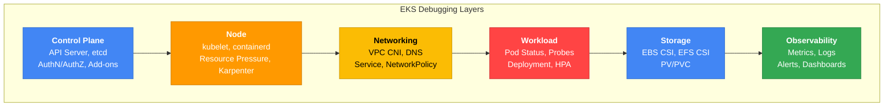
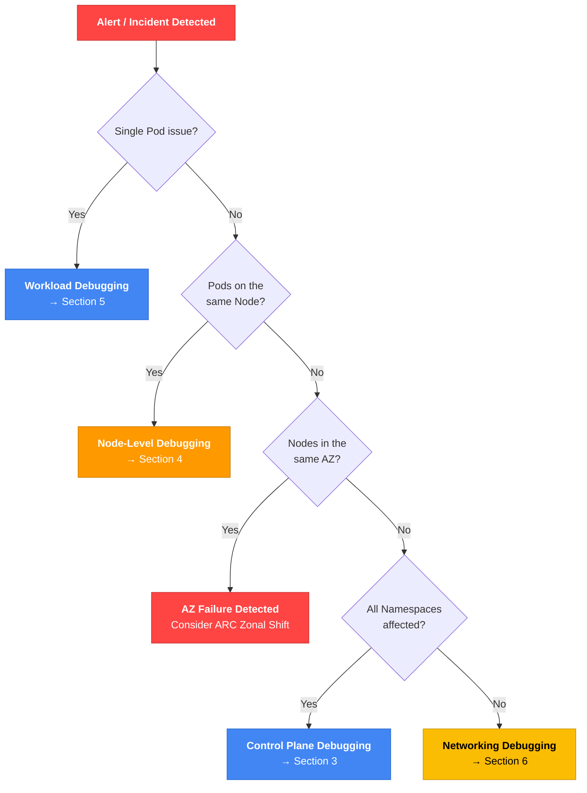
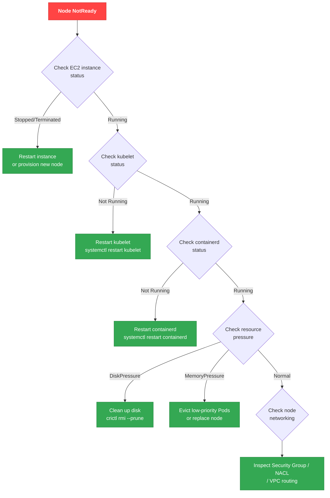
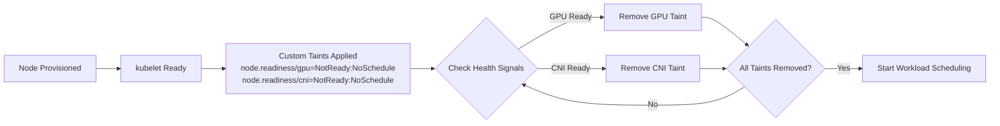
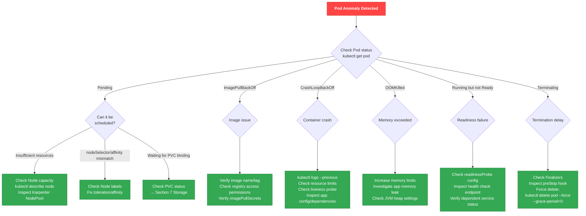
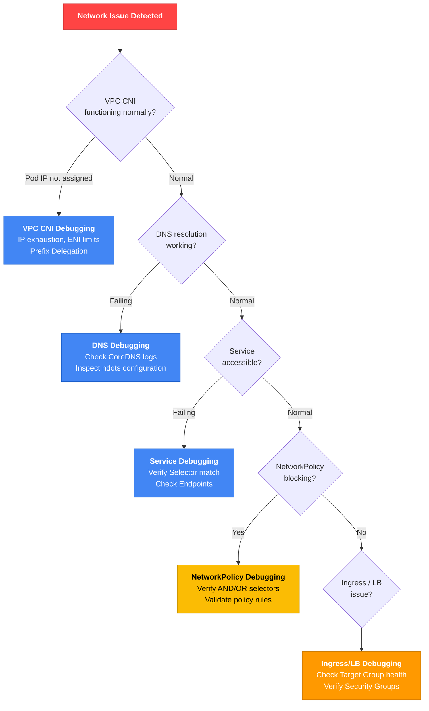
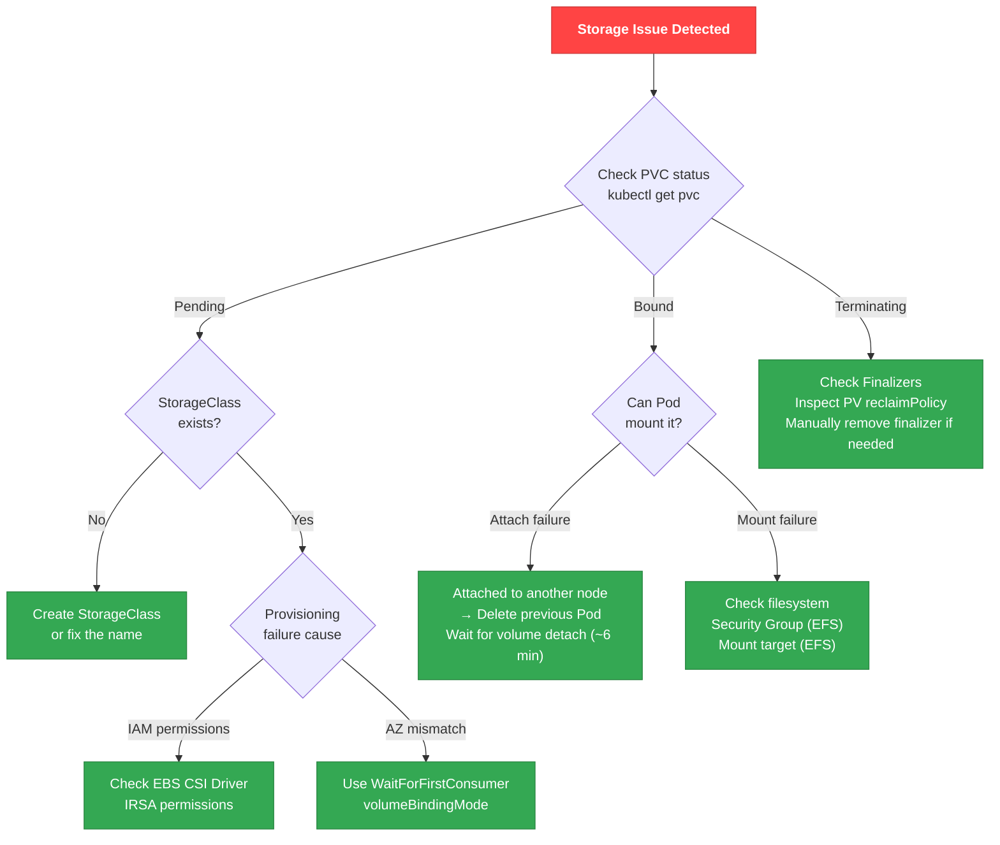
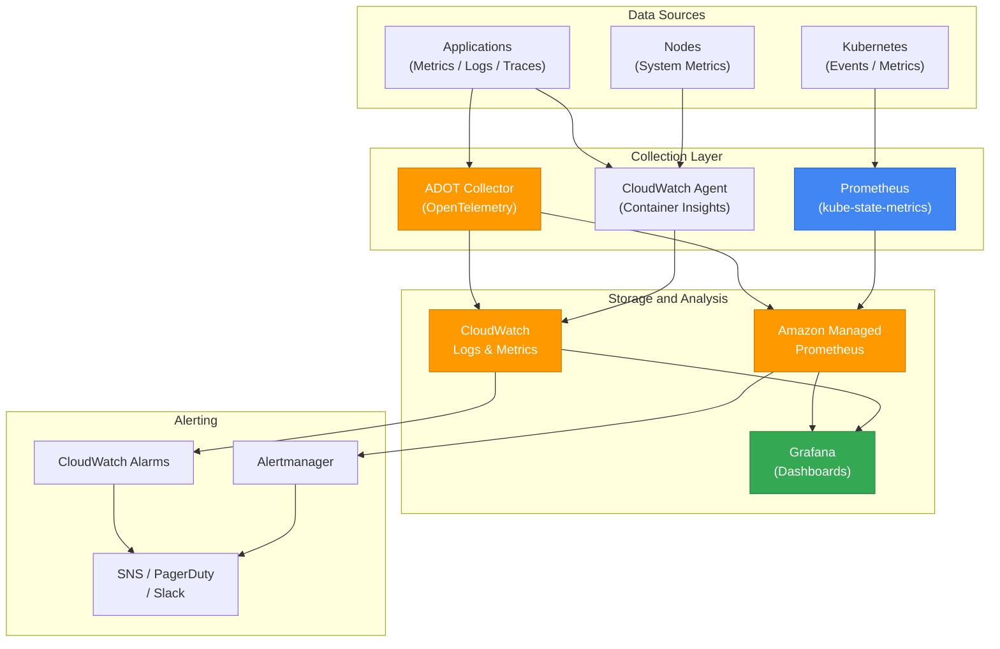
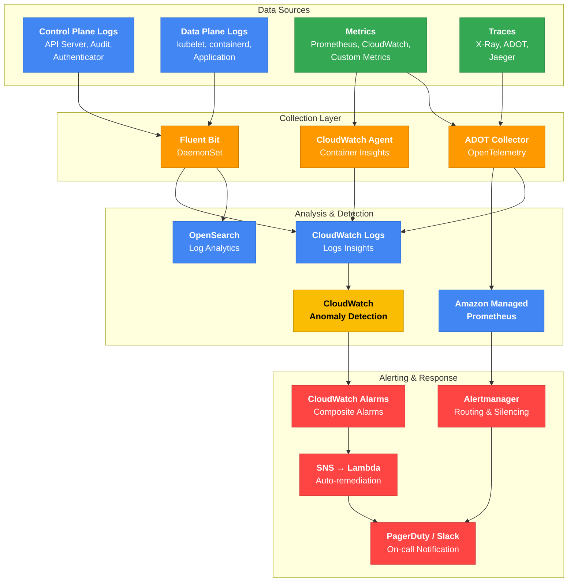

import { IncidentEscalationTable, ZonalShiftImpactTable, ControlPlaneLogTable, ClusterHealthTable, NodeGroupErrorTable, ErrorQuickRefTable } from '@site/src/components/EksDebugTables';

> 📅 **撰写日期**: 2026-02-10 | **修改日期**: 2026-02-13 | ⏱️ **阅读时间**: 约 20 分钟

# EKS 故障诊断与响应指南

> **📌 参考环境**: EKS 1.30+, kubectl 1.30+, AWS CLI v2

## 1. 概述

EKS 运维中出现的问题涵盖多个层面，包括 Control Plane、Node、网络、工作负载、存储和可观测性。本文档是一份综合调试指南，旨在帮助 SRE、DevOps 工程师和平台团队**系统性地诊断并快速解决**这些问题。

所有命令和示例均可直接执行，同时提供了 Decision Tree 和流程图以便快速决策。

### EKS 调试层级



### 调试方法论

诊断 EKS 问题有两种方法。

| 方法 | 描述 | 适用场景 |
|------|------|----------|
| **自顶向下（症状 → 原因）** | 从用户报告的症状出发，逐步追溯到根本原因 | 服务中断或性能下降等即时事件响应 |
| **自底向上（基础设施 → 应用）** | 从基础设施层开始逐层向上检查 | 预防性检查、迁移后验证 |

:::tip 推荐的一般方法
对于生产环境事件，推荐使用**自顶向下**方法。首先识别症状（第 2 节 - 事件分类），然后导航到该层级对应的调试章节。
:::

---

## 2. 事件分类（快速故障评估）

### 前 5 分钟检查清单

当事件发生时，最重要的操作是**范围识别**和**初始响应**。

#### 30 秒：初始诊断

```bash
# Check cluster status
aws eks describe-cluster --name <cluster-name> --query 'cluster.status' --output text

# Check node status
kubectl get nodes

# Check unhealthy Pods
kubectl get pods --all-namespaces | grep -v Running | grep -v Completed
```

#### 2 分钟：范围识别

```bash
# Check recent events (all namespaces)
kubectl get events --all-namespaces --sort-by='.lastTimestamp' | tail -20

# Aggregate Pod status in a specific namespace
kubectl get pods -n <namespace> --no-headers | awk '{print $2}' | sort | uniq -c | sort -rn

# Check distribution of unhealthy Pods by node
kubectl get pods --all-namespaces -o wide --field-selector=status.phase!=Running | \
  awk 'NR>1 {print $8}' | sort | uniq -c | sort -rn
```

#### 5 分钟：初始响应

```bash
# Detailed information for the problematic Pod
kubectl describe pod <pod-name> -n <namespace>

# Previous container logs (for CrashLoopBackOff)
kubectl logs <pod-name> -n <namespace> --previous

# Check resource usage
kubectl top nodes
kubectl top pods -n <namespace> --sort-by=cpu
```

### 范围识别决策树



### AZ 故障检测

:::warning AWS Health API 要求
`aws health describe-events` API 需要 **AWS Business 或 Enterprise Support** 计划。如果您没有 Support 计划，请直接查看 [AWS Health Dashboard 控制台](https://health.aws.amazon.com/health/home)，或创建 EventBridge 规则来捕获 Health 事件。
:::

```bash
# Check AWS Health API for EKS/EC2 events (requires Business/Enterprise Support plan)
aws health describe-events \
  --filter '{"services":["EKS","EC2"],"eventStatusCodes":["open"]}' \
  --region us-east-1

# Alternative: Detect AZ failures without a Support plan — create EventBridge rule
aws events put-rule \
  --name "aws-health-eks-events" \
  --event-pattern '{
    "source": ["aws.health"],
    "detail-type": ["AWS Health Event"],
    "detail": {
      "service": ["EKS", "EC2"],
      "eventTypeCategory": ["issue"]
    }
  }'

# Aggregate unhealthy Pods by AZ (only pods scheduled to a node)
kubectl get pods --all-namespaces -o json | jq -r '
  .items[] |
  select(.status.phase != "Running" and .status.phase != "Succeeded") |
  select(.spec.nodeName != null) |
  .spec.nodeName
' | sort -u | while read node; do
  zone=$(kubectl get node "$node" -o jsonpath='{.metadata.labels.topology\.kubernetes\.io/zone}' 2>/dev/null)
  [ -n "$zone" ] && echo "$zone"
done | sort | uniq -c | sort -rn

# Check ARC Zonal Shift status
aws arc-zonal-shift list-zonal-shifts \
  --resource-identifier arn:aws:eks:region:account:cluster/name
```

#### 使用 ARC Zonal Shift 进行 AZ 故障响应

```bash
# Enable Zonal Shift on EKS
aws eks update-cluster-config \
  --name <cluster-name> \
  --zonal-shift-config enabled=true

# Start manual Zonal Shift (move traffic away from impaired AZ)
aws arc-zonal-shift start-zonal-shift \
  --resource-identifier arn:aws:eks:region:account:cluster/name \
  --away-from us-east-1a \
  --expires-in 3h \
  --comment "AZ impairment detected"
```

:::warning Zonal Shift 注意事项
Zonal Shift 的最大持续时间为 **3 天**，可以延长。一旦启动 Shift，流向受影响 AZ 中 Node 上运行的 Pod 的新流量将被阻断，因此在执行前请确认其他 AZ 中有足够的容量。
:::

:::danger Zonal Shift 仅阻断流量
ARC Zonal Shift **仅在 Load Balancer / Service 层面更改流量路由**。

<ZonalShiftImpactTable />

Karpenter NodePool 和 ASG（Managed Node Group）的 AZ 配置不会自动更新。完整的 AZ 疏散需要额外步骤：

1. **启动 Zonal Shift** → 阻断新流量（自动）
2. **排空受影响 AZ 中的 Node** → 迁移现有 Pod
3. **从 Karpenter NodePool 或 ASG 子网中移除受影响的 AZ** → 阻止新 Node 创建

```bash
# 1. Identify and drain nodes in the affected AZ
for node in $(kubectl get nodes -l topology.kubernetes.io/zone=us-east-1a -o name); do
  kubectl cordon $node
  kubectl drain $node --ignore-daemonsets --delete-emptydir-data --grace-period=60
done

# 2. Temporarily exclude the affected AZ from Karpenter NodePool
kubectl patch nodepool default --type=merge -p '{
  "spec": {"template": {"spec": {"requirements": [
    {"key": "topology.kubernetes.io/zone", "operator": "In", "values": ["us-east-1b", "us-east-1c"]}
  ]}}}
}'

# 3. For Managed Node Groups, update ASG subnets (via console or IaC)
```

请记住在 Zonal Shift 取消后恢复这些更改。
:::

### CloudWatch 异常检测

```bash
# Set up Anomaly Detection alarm for Pod restart counts
aws cloudwatch put-anomaly-detector \
  --single-metric-anomaly-detector '{
    "Namespace": "ContainerInsights",
    "MetricName": "pod_number_of_container_restarts",
    "Dimensions": [
      {"Name": "ClusterName", "Value": "<cluster-name>"},
      {"Name": "Namespace", "Value": "production"}
    ],
    "Stat": "Average"
  }'
```

### 事件响应升级矩阵

<IncidentEscalationTable />

:::info 高可用架构指南参考
有关架构级别的故障恢复策略（TopologySpreadConstraints、PodDisruptionBudget、多 AZ 部署等），请参阅 [EKS 高可用架构指南](./eks-resiliency-guide.md)。
:::

---

## 3. EKS Control Plane 调试

### Control Plane 日志类型

EKS Control Plane 可以向 CloudWatch Logs 发送 5 种日志类型。

<ControlPlaneLogTable />

### 启用日志

```bash
# Enable all control plane logs
aws eks update-cluster-config \
  --region <region> \
  --name <cluster-name> \
  --logging '{"clusterLogging":[{"types":["api","audit","authenticator","controllerManager","scheduler"],"enabled":true}]}'
```

:::tip 成本优化
启用所有日志类型会增加 CloudWatch Logs 成本。对于生产环境，建议将 `audit` 和 `authenticator` 作为必须启用项，其余类型仅在需要调试时启用。
:::

### CloudWatch Logs Insights 查询

#### API Server 错误（400+）分析

```sql
fields @timestamp, @message
| filter @logStream like /kube-apiserver-audit/
| filter responseStatus.code >= 400
| stats count() by responseStatus.code
| sort count desc
```

#### 认证失败追踪

```sql
fields @timestamp, @message
| filter @logStream like /authenticator/
| filter @message like /error/ or @message like /denied/
| sort @timestamp desc
```

#### aws-auth ConfigMap 变更检测

```sql
fields @timestamp, @message
| filter @logStream like /kube-apiserver-audit/
| filter objectRef.resource = "configmaps" and objectRef.name = "aws-auth"
| filter verb in ["update", "patch", "delete"]
| sort @timestamp desc
```

#### API 限流检测

```sql
fields @timestamp, @message
| filter @logStream like /kube-apiserver/
| filter @message like /throttle/ or @message like /rate limit/
| stats count() by bin(5m)
```

#### 未授权访问尝试（安全事件）

```sql
fields @timestamp, @message
| filter @logStream like /kube-apiserver-audit/
| filter responseStatus.code = 403
| stats count() by user.username
| sort count desc
```

### 认证/授权调试

#### IAM 认证验证

```bash
# Check current IAM credentials
aws sts get-caller-identity

# Check cluster authentication mode
aws eks describe-cluster --name <cluster-name> \
  --query 'cluster.accessConfig.authenticationMode' --output text
```

#### aws-auth ConfigMap（CONFIG_MAP 模式）

```bash
# Check aws-auth ConfigMap
kubectl describe configmap aws-auth -n kube-system
```

#### EKS Access Entries（API / API_AND_CONFIG_MAP 模式）

```bash
# Create Access Entry
aws eks create-access-entry \
  --cluster-name <cluster-name> \
  --principal-arn arn:aws:iam::ACCOUNT:role/ROLE-NAME \
  --type STANDARD

# List Access Entries
aws eks list-access-entries --cluster-name <cluster-name>
```

#### IRSA（IAM Roles for Service Accounts）调试检查清单

```bash
# 1. Verify annotation on ServiceAccount
kubectl get sa <sa-name> -n <namespace> -o yaml

# 2. Check AWS environment variables inside the Pod
kubectl exec -it <pod-name> -- env | grep AWS

# 3. Verify OIDC Provider
aws eks describe-cluster --name <cluster-name> \
  --query 'cluster.identity.oidc.issuer' --output text

# 4. Verify OIDC Provider ARN and conditions in IAM Role Trust Policy
aws iam get-role --role-name <role-name> \
  --query 'Role.AssumeRolePolicyDocument'
```

:::warning 常见的 IRSA 错误

- ServiceAccount 注解中的 Role ARN 拼写错误
- IAM Role Trust Policy 中的 namespace/sa 名称不匹配
- OIDC Provider 未与集群关联
- Pod 未指定 `spec.serviceAccountName` 来使用 ServiceAccount
:::

### Service Account Token 过期（HTTP 401 Unauthorized）

在 Kubernetes 1.21+ 中，Service Account Token **默认有效期为 1 小时**，由 kubelet 自动刷新。但是，如果您使用的旧版 SDK 缺少 Token 刷新逻辑，长时间运行的工作负载可能会遇到 `401 Unauthorized` 错误。

**症状：**

- Pod 在一段时间后（通常为 1 小时）突然返回 `HTTP 401 Unauthorized` 错误
- 重启后暂时恢复正常，之后 401 错误再次出现

**原因：**

- Projected Service Account Token 默认在 1 小时后过期
- kubelet 会自动刷新 Token，但如果应用程序只读取一次 Token 文件并缓存，则会继续使用过期的 Token

**最低 SDK 版本要求：**

| 语言 | SDK | 最低版本 |
|------|-----|----------|
| Go | client-go | v0.15.7+ |
| Python | kubernetes | 12.0.0+ |
| Java | fabric8 | 5.0.0+ |

:::tip Token 刷新验证
请验证您的 SDK 是否支持自动 Token 刷新。如果不支持，您的应用程序必须定期重新读取 `/var/run/secrets/kubernetes.io/serviceaccount/token` 文件。
:::

### EKS Pod Identity 调试

EKS Pod Identity 是 IRSA 的替代方案，为 Pod 授予 AWS IAM 权限提供了更简单的设置方式。

```bash
# Check Pod Identity Associations
aws eks list-pod-identity-associations --cluster-name $CLUSTER
aws eks describe-pod-identity-association --cluster-name $CLUSTER \
  --association-id $ASSOC_ID

# Check Pod Identity Agent status
kubectl get pods -n kube-system -l app.kubernetes.io/name=eks-pod-identity-agent
kubectl logs -n kube-system -l app.kubernetes.io/name=eks-pod-identity-agent --tail=50
```

**Pod Identity 调试检查清单：**

- 确认 eks-pod-identity-agent Add-on 已安装
- 确认正确的关联已链接到 Pod 的 ServiceAccount
- 确认 IAM Role Trust Policy 包含 `pods.eks.amazonaws.com` 服务主体

:::info Pod Identity 与 IRSA 对比
Pod Identity 比 IRSA 设置更简单，并且更易于进行跨账户访问。建议新工作负载使用 Pod Identity。
:::

### EKS Add-on 故障排除

```bash
# List Add-ons
aws eks list-addons --cluster-name <cluster-name>

# Check Add-on status in detail
aws eks describe-addon --cluster-name <cluster-name> --addon-name <addon-name>

# Update Add-on (resolve conflicts with PRESERVE to keep existing settings)
aws eks update-addon --cluster-name <cluster-name> --addon-name <addon-name> \
  --addon-version <version> --resolve-conflicts PRESERVE
```

| Add-on | 常见错误模式 | 诊断方法 | 解决方案 |
|--------|-------------|----------|----------|
| **CoreDNS** | Pod CrashLoopBackOff、DNS 超时 | `kubectl logs -n kube-system -l k8s-app=kube-dns` | 检查 ConfigMap，`kubectl rollout restart deployment coredns -n kube-system` |
| **kube-proxy** | Service 通信失败、iptables 错误 | `kubectl logs -n kube-system -l k8s-app=kube-proxy` | 验证 DaemonSet 镜像版本，`kubectl rollout restart daemonset kube-proxy -n kube-system` |
| **VPC CNI** | Pod IP 分配失败、ENI 错误 | `kubectl logs -n kube-system -l k8s-app=aws-node` | 检查 IPAMD 日志，验证 ENI/IP 限制（参见第 6 节） |
| **EBS CSI** | PVC Pending、卷挂载失败 | `kubectl logs -n kube-system -l app.kubernetes.io/name=aws-ebs-csi-driver` | 检查 IRSA 权限，验证 AZ 匹配（参见第 7 节） |

### 集群健康状态问题代码

在诊断 EKS 集群本身的基础设施级别问题时，请检查集群健康状态。

```bash
# Check cluster health issues
aws eks describe-cluster --name $CLUSTER \
  --query 'cluster.health' --output json
```

<ClusterHealthTable />

:::danger 不可恢复的问题
`VPC_NOT_FOUND` 和 `KMS_KEY_NOT_FOUND` 是不可恢复的。必须重新创建集群。
:::

---
## 4. 节点级调试

### 节点加入失败调试

当节点无法加入集群时，可能存在多种原因。以下是 8 种最常见的原因及其诊断方法。

**节点加入失败的常见原因：**

1. **节点 IAM Role 未在 aws-auth ConfigMap 中注册**（或未创建 Access Entry）— 节点无法通过 API server 认证
2. **bootstrap 脚本中的 ClusterName 与实际集群名称不匹配** — kubelet 尝试连接到错误的集群
3. **节点安全组不允许与控制平面通信** — 需要 TCP 443（API server）和 TCP 10250（kubelet）端口
4. **公有子网中未启用自动分配公网 IP** — 在仅启用公共端点的集群上无法访问互联网
5. **VPC DNS 配置问题** — `enableDnsHostnames` 或 `enableDnsSupport` 被禁用
6. **STS 区域端点被禁用** — IAM 认证过程中 STS 调用失败
7. **在 aws-auth 中注册了实例配置文件 ARN 而非节点 IAM Role ARN** — aws-auth 中只应注册 Role ARN
8. **缺少 `eks:kubernetes.io/cluster-name` 标签**（自管理节点）— EKS 无法识别该节点属于集群

**诊断命令：**

```bash
# Check node bootstrap logs (after SSM access)
sudo journalctl -u kubelet --no-pager | tail -50
sudo cat /var/log/cloud-init-output.log | tail -50

# Check security group rules
aws ec2 describe-security-groups --group-ids $CLUSTER_SG \
  --query 'SecurityGroups[].IpPermissions' --output table

# Check VPC DNS settings
aws ec2 describe-vpc-attribute --vpc-id $VPC_ID --attribute enableDnsHostnames
aws ec2 describe-vpc-attribute --vpc-id $VPC_ID --attribute enableDnsSupport
```

:::warning 在 aws-auth 中应注册的 ARN
aws-auth ConfigMap 需要的是 **IAM Role ARN**（`arn:aws:iam::ACCOUNT:role/...`），而非实例配置文件 ARN（`arn:aws:iam::ACCOUNT:instance-profile/...`）。这是一个极其常见的错误，也是节点加入失败的主要原因之一。
:::

### Node NotReady 决策树



### kubelet / containerd 调试

```bash
# Connect to node via SSM
aws ssm start-session --target <instance-id>

# Check kubelet status
systemctl status kubelet
journalctl -u kubelet -n 100 -f

# Check containerd status
systemctl status containerd

# Check container runtime status
crictl pods
crictl ps -a

# Check logs for a specific container
crictl logs <container-id>
```

:::info SSM 访问前提条件
SSM 访问需要将 `AmazonSSMManagedInstanceCore` 策略附加到节点的 IAM Role。此策略在 EKS 托管节点组中默认包含，但如果使用自定义 AMI，请确认 SSM Agent 已安装。
:::

### 资源压力诊断与解决

```bash
# Check node conditions
kubectl describe node <node-name>
```

| 状况 | 阈值 | 诊断命令 | 解决方案 |
|-----------|-----------|--------------------|------------|
| **DiskPressure** | 可用磁盘 &lt; 10% | `df -h`（SSM 访问后） | 使用 `crictl rmi --prune` 清理未使用的镜像，使用 `crictl rm` 移除已停止的容器 |
| **MemoryPressure** | 可用内存 &lt; 100Mi | `free -m`（SSM 访问后） | 驱逐低优先级 Pod，调整内存 requests/limits，替换节点 |
| **PIDPressure** | 可用 PID &lt; 5% | `ps aux \| wc -l`（SSM 访问后） | 增大 `kernel.pid_max`，定位并重启导致 PID 泄漏的容器 |

### Karpenter 节点供应调试

```bash
# Check Karpenter controller logs
kubectl logs -f deployment/karpenter -n kube-system

# Check NodePool status
kubectl get nodepool
kubectl describe nodepool <nodepool-name>

# Check EC2NodeClass
kubectl get ec2nodeclass
kubectl describe ec2nodeclass <nodeclass-name>

# When provisioning fails, verify:
# 1. NodePool limits have not been exceeded
# 2. EC2NodeClass subnet/security group selectors are correct
# 3. Service Quotas are sufficient for the instance types
# 4. Pod nodeSelector/affinity matches NodePool requirements
```

:::warning Karpenter v1 API 变更
在 Karpenter v1.0+ 中，`Provisioner` 已重命名为 `NodePool`，`AWSNodeTemplate` 已重命名为 `EC2NodeClass`。如果您使用的是 v0.x 配置，则需要进行迁移。请将 API group 更新为 `karpenter.sh/v1`。
:::

### 托管节点组错误代码

检查托管节点组的健康状态以诊断供应和运维问题。

```bash
# Check node group health status
aws eks describe-nodegroup --cluster-name $CLUSTER --nodegroup-name $NODEGROUP \
  --query 'nodegroup.health' --output json
```

<NodeGroupErrorTable />

**AccessDenied 错误恢复 — 检查 eks:node-manager ClusterRole：**

`AccessDenied` 错误通常在 `eks:node-manager` ClusterRole 或 ClusterRoleBinding 被删除或修改时发生。

```bash
# Check eks:node-manager ClusterRole
kubectl get clusterrole eks:node-manager
kubectl get clusterrolebinding eks:node-manager
```

:::danger AccessDenied 恢复
如果 `eks:node-manager` ClusterRole/ClusterRoleBinding 缺失，EKS **不会自动恢复它们**。您必须使用以下方法之一手动恢复：

**方法 1：手动重新创建（推荐）**

```yaml
# eks-node-manager-role.yaml
apiVersion: rbac.authorization.k8s.io/v1
kind: ClusterRole
metadata:
  name: eks:node-manager
rules:
  - apiGroups: ['']
    resources: [pods]
    verbs: [get, list, watch, delete]
  - apiGroups: ['']
    resources: [nodes]
    verbs: [get, list, watch, patch]
  - apiGroups: ['']
    resources: [pods/eviction]
    verbs: [create]
---
apiVersion: rbac.authorization.k8s.io/v1
kind: ClusterRoleBinding
metadata:
  name: eks:node-manager
roleRef:
  apiGroup: rbac.authorization.k8s.io
  kind: ClusterRole
  name: eks:node-manager
subjects:
  - apiGroup: rbac.authorization.k8s.io
    kind: User
    name: eks:node-manager
```

```bash
kubectl auth reconcile -f eks-node-manager-role.yaml
```

**方法 2：重新创建节点组**

```bash
# RBAC resources are created together when creating a new node group
eksctl create nodegroup --cluster=<cluster-name> --name=<new-nodegroup-name>
```

**方法 3：升级节点组**

```bash
# Upgrade process may trigger RBAC re-setup
eksctl upgrade nodegroup --cluster=<cluster-name> --name=<nodegroup-name>
```

> **注意**：Kubernetes 默认系统 ClusterRole（`system:*`）由 API server 自动协调，但 EKS 特有的 ClusterRole（`eks:*`）不会自动恢复。删除前请务必备份 RBAC 资源。
:::

### 使用 Node Readiness Controller 调试节点引导

:::info 新 Kubernetes 特性（2026 年 2 月）
[Node Readiness Controller](https://github.com/kubernetes-sigs/node-readiness-controller) 是 Kubernetes 官方博客公布的新项目，它以声明式方式解决节点引导过程中的过早调度问题。
:::

#### 问题场景

在标准 Kubernetes 中，一旦节点达到 `Ready` 状态，工作负载就会被调度。然而，节点可能实际上尚未完全准备就绪：

| 未完成的组件 | 症状 | 影响 |
|---|---|---|
| GPU 驱动/固件加载中 | `nvidia-smi` 失败，Pod `CrashLoopBackOff` | GPU 工作负载失败 |
| CNI 插件初始化中 | Pod IP 未分配，`NetworkNotReady` | 网络通信失败 |
| CSI 驱动未注册 | PVC `Pending`，卷挂载失败 | 存储不可访问 |
| 安全代理未安装 | 合规性违规 | 安全策略未满足 |

#### Node Readiness Controller 工作原理

Node Readiness Controller **以声明式方式管理自定义 taint**，延迟工作负载调度直到所有基础设施要求都得到满足：



#### 调试检查清单

当节点处于 `Ready` 状态但 Pod 未被调度时：

```bash
# 1. Check custom readiness taints on the node
kubectl get node <node-name> -o jsonpath='{.spec.taints}' | jq .

# 2. Filter for node.readiness related taints
kubectl get nodes -o json | jq '
  .items[] |
  select(.spec.taints // [] | any(.key | startswith("node.readiness"))) |
  {name: .metadata.name, taints: [.spec.taints[] | select(.key | startswith("node.readiness"))]}
'

# 3. Check Pod tolerations vs node taint mismatch
kubectl describe pod <pending-pod> | grep -A 20 "Events:"
```

#### 相关特性：Pod Scheduling Readiness（K8s 1.30 GA）

`schedulingGates` 允许从 Pod 侧控制调度就绪状态：

```yaml
apiVersion: v1
kind: Pod
metadata:
  name: gated-pod
spec:
  schedulingGates:
    - name: "example.com/gpu-validation"  # Scheduling waits until this gate is removed
  containers:
    - name: app
      image: app:latest
```

```bash
# Find Pods with schedulingGates
kubectl get pods -o json | jq '
  .items[] |
  select(.spec.schedulingGates != null and (.spec.schedulingGates | length > 0)) |
  {name: .metadata.name, namespace: .metadata.namespace, gates: .spec.schedulingGates}
'
```

#### 相关特性：Pod Readiness Gates（AWS LB Controller）

AWS Load Balancer Controller 使用 `elbv2.k8s.aws/pod-readiness-gate-inject` 注解来延迟 Pod `Ready` 状态转换，直到 ALB/NLB 目标注册完成：

```bash
# Check Readiness Gate status
kubectl get pod <pod-name> -o jsonpath='{.status.conditions}' | jq '
  [.[] | select(.type | contains("target-health"))]
'

# Check if readiness gate injection is enabled for namespace
kubectl get namespace <ns> -o jsonpath='{.metadata.labels.elbv2\.k8s\.aws/pod-readiness-gate-inject}'
```

:::tip Readiness 特性对比

| 特性 | 目标 | 控制机制 | 状态 |
|---------|--------|-------------------|--------|
| **Node Readiness Controller** | Node | 基于 Taint | 新特性（2026 年 2 月） |
| **Pod Scheduling Readiness** | Pod | schedulingGates | GA（K8s 1.30） |
| **Pod Readiness Gates** | Pod | Readiness Conditions | GA（AWS LB Controller） |
:::

### 使用 eks-node-viewer

[eks-node-viewer](https://github.com/awslabs/eks-node-viewer) 是一款在终端中实时可视化节点资源利用率的工具。

```bash
# Basic usage (CPU-based)
eks-node-viewer

# View both CPU and memory
eks-node-viewer --resources cpu,memory

# View a specific NodePool only
eks-node-viewer --node-selector karpenter.sh/nodepool=<nodepool-name>
```

---

## 5. 工作负载调试

### Pod 状态调试流程图



### 基本调试命令

```bash
# Check Pod status
kubectl get pods -n <namespace>
kubectl describe pod <pod-name> -n <namespace>

# Check current/previous container logs
kubectl logs <pod-name> -n <namespace>
kubectl logs <pod-name> -n <namespace> --previous

# Check namespace events
kubectl get events -n <namespace> --sort-by='.lastTimestamp'

# Check resource usage
kubectl top pods -n <namespace>
```

### 使用 kubectl debug

#### Ephemeral Container（向运行中的 Pod 添加调试容器）

```bash
# Basic ephemeral container
kubectl debug <pod-name> -it --image=busybox --target=<container-name>

# Image with network debugging tools
kubectl debug <pod-name> -it --image=nicolaka/netshoot --target=<container-name>
```

#### Pod Copy（克隆 Pod 进行调试）

```bash
# Clone a Pod and start with a different image
kubectl debug <pod-name> --copy-to=debug-pod --image=ubuntu

# Change the command when cloning a Pod
kubectl debug <pod-name> --copy-to=debug-pod --container=<container-name> -- sh
```

#### Node 调试（直接访问节点）

```bash
# Node debugging (host filesystem is mounted at /host)
kubectl debug node/<node-name> -it --image=ubuntu
```

:::tip kubectl debug 与 SSM 对比
`kubectl debug node/` 即使在未安装 SSM Agent 的节点上也可使用。但是，要访问宿主机网络命名空间，需要添加 `--profile=sysadmin` 选项。
:::

### Deployment Rollout 调试

```bash
# Check rollout status
kubectl rollout status deployment/<name>

# Rollout history
kubectl rollout history deployment/<name>

# Roll back to the previous version
kubectl rollout undo deployment/<name>

# Roll back to a specific revision
kubectl rollout undo deployment/<name> --to-revision=2

# Restart Deployment (Rolling restart)
kubectl rollout restart deployment/<name>
```

### HPA / VPA 调试

```bash
# Check HPA status
kubectl get hpa
kubectl describe hpa <hpa-name>

# Verify metrics-server is running
kubectl get deployment metrics-server -n kube-system
kubectl top pods  # If this command fails, metrics-server has an issue

# Check scaling failure reasons in HPA events
kubectl describe hpa <hpa-name> | grep -A 5 "Events"
```

**HPA 扩缩容失败分析：**

| 症状 | 原因 | 解决方案 |
|---------|-------|------------|
| `unable to get metrics` | metrics-server 未安装或故障 | 检查 metrics-server Pod 状态并重启 |
| `current metrics unknown` | 从目标 Pod 收集指标失败 | 确认 Pod 已设置 resource requests |
| `target not found` | scaleTargetRef 不匹配 | 确认 Deployment/StatefulSet 名称和 apiVersion |
| 扩容后立即缩容 | 未配置 stabilizationWindow | 设置 `behavior.scaleDown.stabilizationWindowSeconds` |

### Probe 调试与最佳实践

```yaml
# Recommended Probe configuration example
apiVersion: apps/v1
kind: Deployment
metadata:
  name: web-app
spec:
  template:
    spec:
      containers:
      - name: app
        image: my-app:latest
        ports:
        - containerPort: 8080
        # Startup Probe: Confirms app startup completion (essential for slow-starting apps)
        startupProbe:
          httpGet:
            path: /healthz
            port: 8080
          failureThreshold: 30    # Wait up to 300 seconds (30 x 10s)
          periodSeconds: 10
        # Liveness Probe: Checks if the app is alive (deadlock detection)
        livenessProbe:
          httpGet:
            path: /healthz
            port: 8080
          initialDelaySeconds: 30
          periodSeconds: 10
          timeoutSeconds: 5
          failureThreshold: 3
          successThreshold: 1
        # Readiness Probe: Checks if the app can receive traffic
        readinessProbe:
          httpGet:
            path: /ready
            port: 8080
          initialDelaySeconds: 10
          periodSeconds: 5
          timeoutSeconds: 3
          failureThreshold: 3
          successThreshold: 1
```

:::danger Probe 配置注意事项

- **不要在 Liveness Probe 中包含外部依赖**（例如数据库连接检查）。当外部服务宕机时，这可能触发级联故障，导致所有 Pod 重启。
- **不要在没有 startupProbe 的情况下设置过高的 initialDelaySeconds**。由于 liveness/readiness probe 在 startupProbe 成功之前不会启用，对于启动缓慢的应用程序应使用 startupProbe。
- Readiness Probe 失败不会重启 Pod；它只会将 Pod 从 Service Endpoints 中移除。
:::

---
## 6. 网络调试

### 网络调试工作流



### VPC CNI 调试

```bash
# Check VPC CNI Pod status
kubectl get pods -n kube-system -l k8s-app=aws-node

# Check VPC CNI logs
kubectl logs -n kube-system -l k8s-app=aws-node --tail=50

# Check current VPC CNI version
kubectl describe daemonset aws-node -n kube-system | grep Image
```

**解决 IP 耗尽问题：**

```bash
# Check available IPs per subnet
aws ec2 describe-subnets --subnet-ids <subnet-id> \
  --query 'Subnets[].{ID:SubnetId,AZ:AvailabilityZone,Available:AvailableIpAddressCount}'

# Enable Prefix Delegation (16x IP capacity increase)
kubectl set env daemonset aws-node -n kube-system ENABLE_PREFIX_DELEGATION=true
```

**ENI 限制和 IP 配额：**

每种 EC2 实例类型都有可附加的 ENI 数量限制以及每个 ENI 的 IP 数量限制。启用 Prefix Delegation 可以显著增加每个 ENI 的 IP 分配量。

### DNS 故障排查

```bash
# Check CoreDNS Pod status
kubectl get pods -n kube-system -l k8s-app=kube-dns

# Check CoreDNS logs
kubectl logs -n kube-system -l k8s-app=kube-dns --tail=50

# Test DNS resolution
kubectl run -it --rm debug --image=busybox --restart=Never -- nslookup kubernetes.default

# Check CoreDNS configuration
kubectl get configmap coredns -n kube-system -o yaml

# Restart CoreDNS
kubectl rollout restart deployment coredns -n kube-system
```

:::warning ndots 问题
在 Kubernetes 默认的 `resolv.conf` 配置中，`ndots:5` 会导致对少于 5 个点的域名优先尝试集群内部 DNS 后缀。当访问外部域名时，这会导致 4 次额外的不必要 DNS 查询，增加延迟。

解决方案：通过 Pod spec 中的 `dnsConfig.options` 设置 `ndots:2`，或在外部域名末尾添加 `.`（例如 `api.example.com.`）。

注意：VPC DNS 限流阈值为**每个 ENI 1,024 包/秒**。
:::

### Service 调试

```bash
# Check Service status
kubectl get svc <service-name>

# Check Endpoints (whether backend Pods are connected)
kubectl get endpoints <service-name>

# Detailed Service information (verify selector)
kubectl describe svc <service-name>

# Check Selector
kubectl get svc <service-name> -o jsonpath='{.spec.selector}'

# Find Pods matching the Selector
kubectl get pods -l <key>=<value>
```

**常见 Service 问题：**

| 症状 | 检查项 | 解决方案 |
|------|--------|----------|
| Endpoints 为空 | Service selector 与 Pod label 不匹配 | 修复 labels |
| ClusterIP 不可达 | kube-proxy 是否正常运行 | `kubectl logs -n kube-system -l k8s-app=kube-proxy` |
| NodePort 不可达 | Security Group 是否允许 30000-32767 端口 | 添加 SG 入站规则 |
| LoadBalancer 处于 Pending 状态 | 是否安装了 AWS Load Balancer Controller | 安装 controller 并验证 IAM 权限 |

### NetworkPolicy 调试

NetworkPolicy 中最常见的错误是混淆 **AND 与 OR 选择器**。

```yaml
# AND logic (combining two selectors within the same from entry)
# Allow only "Pods with role client in the alice namespace"
- from:
  - namespaceSelector:
      matchLabels:
        user: alice
    podSelector:
      matchLabels:
        role: client

# OR logic (separating into distinct from entries)
# Allow "all Pods in the alice namespace" OR "Pods with role client in any namespace"
- from:
  - namespaceSelector:
      matchLabels:
        user: alice
  - podSelector:
      matchLabels:
        role: client
```

:::danger AND 与 OR 注意事项
上述两个 YAML 示例仅相差一个缩进级别，但会产生完全不同的安全策略。在 AND 逻辑中，`namespaceSelector` 和 `podSelector` 位于**同一个 `- from` 条目**内，而在 OR 逻辑中，它们是**分开的 `- from` 条目**。
:::

### 使用 netshoot

[netshoot](https://github.com/nicolaka/netshoot) 是一个包含所有网络调试所需工具的容器镜像。

```bash
# Add as an ephemeral container to an existing Pod
kubectl debug <pod-name> -it --image=nicolaka/netshoot

# Run a standalone debugging Pod
kubectl run tmp-shell --rm -i --tty --image nicolaka/netshoot

# Available tools inside include:
# - curl, wget: HTTP testing
# - dig, nslookup: DNS testing
# - tcpdump: Packet capture
# - iperf3: Bandwidth testing
# - ss, netstat: Socket status inspection
# - traceroute, mtr: Route tracing
```

**实际调试场景：验证 Pod 间通信**

```bash
# Test connectivity to another Service from a netshoot Pod
kubectl run tmp-shell --rm -i --tty --image nicolaka/netshoot -- bash

# Verify DNS resolution
dig <service-name>.<namespace>.svc.cluster.local

# Test TCP connectivity
curl -v http://<service-name>.<namespace>.svc.cluster.local:<port>/health

# Capture packets (traffic to a specific Pod IP)
tcpdump -i any host <pod-ip> -n
```

---

## 7. 存储调试

### 存储调试决策树



### EBS CSI Driver 调试

```bash
# Check EBS CSI Driver Pod status
kubectl get pods -n kube-system -l app.kubernetes.io/name=aws-ebs-csi-driver

# Check Controller logs
kubectl logs -n kube-system -l app=ebs-csi-controller -c ebs-plugin --tail=100

# Check Node logs
kubectl logs -n kube-system -l app=ebs-csi-node -c ebs-plugin --tail=100

# Verify IRSA ServiceAccount
kubectl describe sa ebs-csi-controller-sa -n kube-system
```

**EBS CSI Driver 错误模式：**

| 错误信息 | 原因 | 解决方案 |
|----------|------|----------|
| `could not create volume` | IAM 权限不足 | 向 IRSA Role 添加 `ec2:CreateVolume`、`ec2:AttachVolume` 等权限 |
| `volume is already attached to another node` | 未从前一个节点分离 | 清理之前的 Pod/节点，等待 EBS 卷分离（约 6 分钟） |
| `could not attach volume: already at max` | 实例 EBS 卷数量上限已达到 | 使用更大的实例类型（Nitro 实例：最多 128 个卷） |
| `failed to provision volume with StorageClass` | StorageClass 不存在或配置错误 | 验证 StorageClass 名称和参数 |

**推荐 StorageClass 配置：**

```yaml
apiVersion: storage.k8s.io/v1
kind: StorageClass
metadata:
  name: topology-aware-ebs
provisioner: ebs.csi.aws.com
parameters:
  type: gp3
  encrypted: "true"
volumeBindingMode: WaitForFirstConsumer
allowVolumeExpansion: true
```

:::tip WaitForFirstConsumer
使用 `volumeBindingMode: WaitForFirstConsumer` 可以将 PVC 绑定延迟到 Pod 调度时进行。这确保了**卷在 Pod 被调度到的同一可用区中创建**，从而避免可用区不匹配问题。
:::

### EFS CSI Driver 调试

```bash
# Check EFS CSI Driver Pod status
kubectl get pods -n kube-system -l app.kubernetes.io/name=aws-efs-csi-driver

# Check Controller logs
kubectl logs -n kube-system -l app=efs-csi-controller -c efs-plugin --tail=100

# Check EFS filesystem status
aws efs describe-file-systems --file-system-id <fs-id>

# Verify Mount Targets (must exist in each AZ)
aws efs describe-mount-targets --file-system-id <fs-id>
```

**EFS 检查清单：**

- 验证 Pod 运行的所有可用区子网中是否存在 Mount Target
- 验证 Mount Target 的 Security Group 是否允许 **TCP 2049 (NFS)** 端口
- 验证节点的 Security Group 是否允许到 EFS Mount Target 的 TCP 2049 出站流量

### PV/PVC 状态检查与卡住问题解决

```bash
# Check PVC status
kubectl get pvc -n <namespace>

# Check PV status
kubectl get pv

# If PVC is stuck in Terminating (remove finalizer)
kubectl patch pvc <pvc-name> -n <namespace> -p '{"metadata":{"finalizers":null}}'

# Change PV from Released to Available (for reuse)
kubectl patch pv <pv-name> -p '{"spec":{"claimRef":null}}'
```

:::danger 手动移除 Finalizer 警告
手动移除 finalizer 可能导致关联的存储资源（如 EBS 卷）未被清理。请先确认卷未在使用中，并检查 AWS 控制台以确保不会产生孤立卷。
:::

---

## 8. 可观测性与监控

### 可观测性技术栈架构



### Container Insights 设置

```bash
# Install Container Insights Add-on
aws eks create-addon \
  --cluster-name <cluster-name> \
  --addon-name amazon-cloudwatch-observability

# Verify installation
kubectl get pods -n amazon-cloudwatch
```

### 指标调试：PromQL 查询

#### CPU 限流检测

```promql
sum(rate(container_cpu_cfs_throttled_periods_total{namespace="production"}[5m]))
/ sum(rate(container_cpu_cfs_periods_total{namespace="production"}[5m])) > 0.25
```

:::info CPU 限流阈值
限流超过 25% 会导致性能下降。请考虑移除或增加 CPU limits。许多组织采用仅设置 CPU requests 而不设置 CPU limits 的策略。
:::

#### OOMKilled 检测

```promql
kube_pod_container_status_last_terminated_reason{reason="OOMKilled"} > 0
```

#### Pod 重启率

```promql
sum(rate(kube_pod_container_status_restarts_total[15m])) by (namespace, pod) > 0
```

#### 节点 CPU 使用率（超过 80% 告警）

```promql
100 - (avg by(instance)(rate(node_cpu_seconds_total{mode="idle"}[5m])) * 100) > 80
```

#### 节点内存使用率（超过 85% 告警）

```promql
(1 - node_memory_MemAvailable_bytes / node_memory_MemTotal_bytes) * 100 > 85
```

### 日志调试：CloudWatch Logs Insights

#### 错误日志分析

```sql
fields @timestamp, @message, kubernetes.container_name, kubernetes.pod_name
| filter @message like /ERROR|FATAL|Exception/
| sort @timestamp desc
| limit 50
```

#### 延迟分析

```sql
fields @timestamp, @message
| filter @message like /latency|duration|elapsed/
| parse @message /latency[=:]\s*(?<latency_ms>\d+)/
| stats avg(latency_ms), max(latency_ms), p99(latency_ms) by bin(5m)
```

#### 特定 Pod 的错误模式分析

```sql
fields @timestamp, @message
| filter kubernetes.pod_name like /api-server/
| filter @message like /error|Error|ERROR/
| stats count() by bin(1m)
| sort bin asc
```

#### OOMKilled 事件跟踪

```sql
fields @timestamp, @message
| filter @message like /OOMKilled|oom-kill|Out of memory/
| sort @timestamp desc
| limit 20
```

#### 容器重启事件

```sql
fields @timestamp, @message, kubernetes.pod_name
| filter @message like /Back-off restarting failed container|CrashLoopBackOff/
| stats count() by kubernetes.pod_name
| sort count desc
```

### 告警规则：PrometheusRule 示例

```yaml
apiVersion: monitoring.coreos.com/v1
kind: PrometheusRule
metadata:
  name: kubernetes-alerts
spec:
  groups:
  - name: kubernetes-pods
    rules:
    - alert: PodCrashLooping
      expr: rate(kube_pod_container_status_restarts_total[15m]) * 60 * 5 > 0
      for: 1h
      labels:
        severity: warning
      annotations:
        summary: "Pod {{ $labels.namespace }}/{{ $labels.pod }} is crash looping"
        description: "Pod {{ $labels.pod }} has been restarting over the last 15 minutes."

    - alert: PodOOMKilled
      expr: kube_pod_container_status_last_terminated_reason{reason="OOMKilled"} > 0
      for: 0m
      labels:
        severity: critical
      annotations:
        summary: "Pod {{ $labels.namespace }}/{{ $labels.pod }} OOMKilled"
        description: "Pod {{ $labels.pod }} was terminated due to out of memory. Memory limits adjustment is required."

  - name: kubernetes-nodes
    rules:
    - alert: NodeNotReady
      expr: kube_node_status_condition{condition="Ready",status="true"} == 0
      for: 5m
      labels:
        severity: critical
      annotations:
        summary: "Node {{ $labels.node }} is NotReady"

    - alert: NodeHighCPU
      expr: 100 - (avg by(instance)(rate(node_cpu_seconds_total{mode="idle"}[5m])) * 100) > 80
      for: 10m
      labels:
        severity: warning
      annotations:
        summary: "Node {{ $labels.instance }} CPU usage above 80%"

    - alert: NodeHighMemory
      expr: (1 - node_memory_MemAvailable_bytes / node_memory_MemTotal_bytes) * 100 > 85
      for: 10m
      labels:
        severity: warning
      annotations:
        summary: "Node {{ $labels.instance }} memory usage above 85%"
```

### ADOT (AWS Distro for OpenTelemetry) 调试

ADOT 是 AWS 托管的 OpenTelemetry 发行版，用于收集 traces、metrics 和 logs 并将其发送到各种 AWS 服务（X-Ray、CloudWatch、AMP 等）。

```bash
# Check ADOT Add-on status
aws eks describe-addon --cluster-name $CLUSTER \
  --addon-name adot --query 'addon.{status:status,version:addonVersion}'

# Check ADOT Collector Pods
kubectl get pods -n opentelemetry-operator-system
kubectl logs -n opentelemetry-operator-system -l app.kubernetes.io/name=opentelemetry-operator --tail=50

# Check OpenTelemetryCollector CR
kubectl get otelcol -A
kubectl describe otelcol -n $NAMESPACE $COLLECTOR_NAME
```

**常见 ADOT 问题：**

| 症状 | 原因 | 解决方案 |
|------|------|----------|
| Operator Pod `CrashLoopBackOff` | 未安装 CertManager | ADOT operator webhook 证书管理需要 CertManager。`kubectl apply -f https://github.com/cert-manager/cert-manager/releases/download/v1.13.0/cert-manager.yaml` |
| Collector 无法发送到 AMP | IAM 权限不足 | 向 IRSA/Pod Identity 添加 `aps:RemoteWrite` 权限 |
| X-Ray traces 未接收到 | IAM 权限不足 | 向 IRSA/Pod Identity 添加 `xray:PutTraceSegments`、`xray:PutTelemetryRecords` 权限 |
| CloudWatch metrics 未接收到 | IAM 权限不足 | 向 IRSA/Pod Identity 添加 `cloudwatch:PutMetricData` 权限 |
| Collector Pod `OOMKilled` | 资源不足 | 在收集大量 traces/metrics 时增加 Collector 的 resources.limits.memory |

:::warning ADOT 权限分离
AMP remote write、X-Ray 和 CloudWatch 各需要不同的 IAM 权限。如果 Collector 向多个后端发送数据，请验证 IAM Role 中包含所有必需的权限。
:::

---

## 9. 事件检测机制与日志架构

### 9.1 事件检测策略概述

要在 EKS 环境中快速检测事件，必须系统性地构建 4 层管道：**数据源 -> 收集 -> 分析与检测 -> 告警与响应**。各层之间必须有机连接，以最小化 MTTD（平均检测时间）。



**4 层架构说明：**

| 层级 | 职责 | 关键组件 |
|------|------|----------|
| **数据源** | 从集群生成所有可观测信号 | Control Plane Logs、Data Plane Logs、Metrics、Traces |
| **收集层** | 标准化并转发来自各种来源的数据到中心位置 | Fluent Bit、CloudWatch Agent、ADOT Collector |
| **分析与检测** | 分析收集的数据并检测异常 | CloudWatch Logs Insights、AMP、OpenSearch、Anomaly Detection |
| **告警与响应** | 通过适当的渠道通知检测到的事件并执行自动修复 | CloudWatch Alarms、Alertmanager、SNS -> Lambda、PagerDuty/Slack |

### 9.2 推荐日志架构

#### 方案 A：AWS 原生技术栈（中小型集群）

以 AWS 托管服务为核心的架构，最大限度减少运维开销。

| 层级 | 组件 | 用途 |
|------|------|------|
| 收集 | Fluent Bit (DaemonSet) | 节点/容器日志收集 |
| 传输 | CloudWatch Logs | 中心日志存储 |
| 分析 | CloudWatch Logs Insights | 基于查询的分析 |
| 检测 | CloudWatch Anomaly Detection | 基于 ML 的异常检测 |
| 告警 | CloudWatch Alarms -> SNS | 基于阈值/异常的告警 |

**Fluent Bit DaemonSet 部署示例：**

```yaml
apiVersion: apps/v1
kind: DaemonSet
metadata:
  name: fluent-bit
  namespace: amazon-cloudwatch
  labels:
    app.kubernetes.io/name: fluent-bit
spec:
  selector:
    matchLabels:
      app.kubernetes.io/name: fluent-bit
  template:
    metadata:
      labels:
        app.kubernetes.io/name: fluent-bit
    spec:
      serviceAccountName: fluent-bit
      containers:
        - name: fluent-bit
          image: public.ecr.aws/aws-observability/aws-for-fluent-bit:2.32.0
          resources:
            limits:
              memory: 200Mi
            requests:
              cpu: 100m
              memory: 100Mi
          volumeMounts:
            - name: varlog
              mountPath: /var/log
              readOnly: true
            - name: varlibdockercontainers
              mountPath: /var/lib/docker/containers
              readOnly: true
            - name: fluent-bit-config
              mountPath: /fluent-bit/etc/
      volumes:
        - name: varlog
          hostPath:
            path: /var/log
        - name: varlibdockercontainers
          hostPath:
            path: /var/lib/docker/containers
        - name: fluent-bit-config
          configMap:
            name: fluent-bit-config
```

:::tip Fluent Bit 与 Fluentd 对比
Fluent Bit 的内存使用量比 Fluentd 少 10 倍以上（约 10MB vs 约 100MB）。在 EKS 环境中，将 Fluent Bit 部署为 DaemonSet 是标准模式。使用 `amazon-cloudwatch-observability` Add-on 会自动安装 Fluent Bit。
:::

#### 方案 B：开源技术栈（大规模/多集群）

结合开源工具与 AWS 托管服务的架构，在大规模环境中确保可扩展性和灵活性。

| 层级 | 组件 | 用途 |
|------|------|------|
| 收集 | Fluent Bit + ADOT Collector | 统一的日志/指标/追踪收集 |
| 指标 | Amazon Managed Prometheus (AMP) | 时序指标存储 |
| 日志 | Amazon OpenSearch Service | 大规模日志分析 |
| 追踪 | AWS X-Ray / Jaeger | 分布式追踪 |
| 可视化 | Amazon Managed Grafana | 统一仪表板 |
| 告警 | Alertmanager + PagerDuty/Slack | 高级路由、分组、静默 |

:::info 多集群架构
在多集群环境中，推荐采用 hub-and-spoke 架构，每个集群中的 ADOT Collector 将指标发送到中心 AMP 工作区。Grafana 可以从单个仪表板监控所有集群。
:::

### 9.3 事件检测模式

#### 模式 1：基于阈值的检测

最基础的检测方法。当超过预定义的阈值时触发告警。

```yaml
# PrometheusRule - Threshold-based alert example
apiVersion: monitoring.coreos.com/v1
kind: PrometheusRule
metadata:
  name: eks-threshold-alerts
  namespace: monitoring
spec:
  groups:
    - name: eks-thresholds
      rules:
        - alert: HighPodRestartRate
          expr: increase(kube_pod_container_status_restarts_total[1h]) > 5
          for: 10m
          labels:
            severity: warning
          annotations:
            summary: "Pod {{ $labels.namespace }}/{{ $labels.pod }} restart count increasing"
            description: "{{ $value }} restarts detected within 1 hour"

        - alert: NodeMemoryPressure
          expr: (1 - node_memory_MemAvailable_bytes / node_memory_MemTotal_bytes) > 0.85
          for: 5m
          labels:
            severity: critical
          annotations:
            summary: "Node {{ $labels.instance }} memory usage above 85%"

        - alert: PVCNearlyFull
          expr: kubelet_volume_stats_used_bytes / kubelet_volume_stats_capacity_bytes > 0.9
          for: 15m
          labels:
            severity: warning
          annotations:
            summary: "PVC {{ $labels.persistentvolumeclaim }} capacity above 90%"
```

#### 模式 2：异常检测

使用 ML 学习正常模式并检测偏差。在难以预定义阈值时非常有用。

```bash
# CloudWatch Anomaly Detection setup
aws cloudwatch put-anomaly-detector \
  --single-metric-anomaly-detector '{
    "Namespace": "ContainerInsights",
    "MetricName": "pod_cpu_utilization",
    "Dimensions": [
      {"Name": "ClusterName", "Value": "'$CLUSTER'"},
      {"Name": "Namespace", "Value": "production"}
    ],
    "Stat": "Average"
  }'

# Create alarm based on Anomaly Detection
aws cloudwatch put-metric-alarm \
  --alarm-name "eks-cpu-anomaly" \
  --alarm-description "EKS CPU utilization anomaly detected" \
  --evaluation-periods 3 \
  --comparison-operator LessThanLowerOrGreaterThanUpperThreshold \
  --threshold-metric-id ad1 \
  --metrics '[
    {
      "Id": "m1",
      "MetricStat": {
        "Metric": {
          "Namespace": "ContainerInsights",
          "MetricName": "pod_cpu_utilization",
          "Dimensions": [
            {"Name": "ClusterName", "Value": "'$CLUSTER'"}
          ]
        },
        "Period": 300,
        "Stat": "Average"
      }
    },
    {
      "Id": "ad1",
      "Expression": "ANOMALY_DETECTION_BAND(m1, 2)"
    }
  ]' \
  --alarm-actions $SNS_TOPIC_ARN
```

:::warning 异常检测学习期
异常检测需要至少 2 周的学习期。在部署新服务后，请同时使用基于阈值的告警作为并行手段。
:::

#### 模式 3：复合告警

逻辑组合多个独立告警，以减少噪声并准确检测实际事件。

```bash
# Combine individual alarms with AND/OR
aws cloudwatch put-composite-alarm \
  --alarm-name "eks-service-degradation" \
  --alarm-rule 'ALARM("high-error-rate") AND (ALARM("high-latency") OR ALARM("pod-restart-spike"))' \
  --alarm-actions $SNS_TOPIC_ARN \
  --alarm-description "Service degradation detected: error rate increase + latency increase or Pod restart spike"
```

:::tip 复合告警技巧
单独的告警往往会产生大量误报（False Positive）。通过复合告警组合多个信号可以准确检测真实事件。例如："错误率上升 AND 延迟增加"表示服务中断，而"错误率上升 AND Pod 重启"表示应用崩溃。
:::

#### 模式 4：基于日志的指标过滤器

检测 CloudWatch Logs 中的特定模式，将其转换为指标并设置告警。

```bash
# Convert OOMKilled events to metrics
aws logs put-metric-filter \
  --log-group-name "/aws/eks/$CLUSTER/cluster" \
  --filter-name "OOMKilledEvents" \
  --filter-pattern '{ $.reason = "OOMKilled" || $.reason = "OOMKilling" }' \
  --metric-transformations \
    metricName=OOMKilledCount,metricNamespace=EKS/Custom,metricValue=1,defaultValue=0

# Detect 403 Forbidden events (security threat)
aws logs put-metric-filter \
  --log-group-name "/aws/eks/$CLUSTER/cluster" \
  --filter-name "UnauthorizedAccess" \
  --filter-pattern '{ $.responseStatus.code = 403 }' \
  --metric-transformations \
    metricName=ForbiddenAccessCount,metricNamespace=EKS/Security,metricValue=1,defaultValue=0
```

### 9.4 事件检测成熟度模型

将组织的事件检测能力分为 4 个级别，以诊断当前状态并提供向下一级别成长的路线图。

| 级别 | 阶段 | 检测方法 | 工具 | 目标 MTTD |
|------|------|----------|------|-----------|
| Level 1 | 基础 | 人工监控 + 基础告警 | CloudWatch Alarms | &lt; 30 分钟 |
| Level 2 | 标准 | 阈值 + 日志指标过滤器 | CloudWatch + Prometheus | &lt; 10 分钟 |
| Level 3 | 高级 | 异常检测 + 复合告警 | Anomaly Detection + AMP | &lt; 5 分钟 |
| Level 4 | 自动化 | 自动检测 + 自动修复 | Lambda + EventBridge + FIS | &lt; 1 分钟 |

:::info MTTD（平均检测时间）
从事件发生到被检测到的平均时间。目标是在从 Level 1 向 Level 4 成长的过程中持续降低 MTTD。请根据组织的 SLO 选择合适的级别。
:::

### 9.5 自动修复模式

当检测到特定事件时，使用 EventBridge 和 Lambda 自动执行恢复操作的模式。

```bash
# EventBridge rule: Detect Pod OOMKilled → trigger Lambda
aws events put-rule \
  --name "eks-oom-auto-remediation" \
  --event-pattern '{
    "source": ["aws.cloudwatch"],
    "detail-type": ["CloudWatch Alarm State Change"],
    "detail": {
      "alarmName": ["eks-oom-killed-alarm"],
      "state": {"value": ["ALARM"]}
    }
  }'
```

:::danger 自动修复注意事项
仅在充分测试后才将自动修复应用于生产环境。错误的自动修复逻辑可能会使事件恶化。首先在 `DRY_RUN` 模式下验证恢复逻辑（仅接收通知），然后逐步扩大自动化范围。
:::

### 9.6 推荐告警渠道矩阵

根据事件严重程度设置适当的告警渠道和响应 SLA，以防止告警疲劳（Alert Fatigue）并专注于关键事件。

| 严重程度 | 告警渠道 | 响应 SLA | 示例 |
|----------|----------|----------|------|
| P1（严重） | PagerDuty + 电话呼叫 | 15 分钟内 | 服务完全中断、数据丢失风险 |
| P2（高） | Slack DM + PagerDuty | 30 分钟内 | 部分服务中断、严重性能下降 |
| P3（中） | Slack 频道 | 4 小时内 | Pod 重启增加、资源使用率告警 |
| P4（低） | 邮件 / Jira 工单 | 下一个工作日 | 磁盘使用量增长、证书即将到期 |

:::warning 告警疲劳注意事项
过多的告警会导致运维团队忽略告警（Alert Fatigue）。P3/P4 告警仅发送到 Slack 频道，只有真正的事件（P1/P2）才发送到 PagerDuty。定期审查告警规则并消除误报（False Positive）非常重要。
:::

---

## 10. 调试快速参考

### 错误模式 -> 原因 -> 解决方案快速参考表

<ErrorQuickRefTable />

### 常用 kubectl 命令速查表

#### 检查与诊断

```bash
# View all resource status at a glance
kubectl get all -n <namespace>

# Filter only unhealthy Pods
kubectl get pods --all-namespaces --field-selector=status.phase!=Running,status.phase!=Succeeded

# Detailed Pod information (including events)
kubectl describe pod <pod-name> -n <namespace>

# Namespace events (most recent first)
kubectl get events -n <namespace> --sort-by='.lastTimestamp'

# Resource usage
kubectl top nodes
kubectl top pods -n <namespace> --sort-by=memory
```

#### 日志检查

```bash
# Current container logs
kubectl logs <pod-name> -n <namespace>

# Previous (crashed) container logs
kubectl logs <pod-name> -n <namespace> --previous

# Specific container in a multi-container Pod
kubectl logs <pod-name> -n <namespace> -c <container-name>

# Real-time log streaming
kubectl logs -f <pod-name> -n <namespace>

# View logs from multiple Pods by label
kubectl logs -l app=<app-name> -n <namespace> --tail=50
```

#### 调试

```bash
# Debug with an ephemeral container
kubectl debug <pod-name> -it --image=nicolaka/netshoot --target=<container-name>

# Node debugging
kubectl debug node/<node-name> -it --image=ubuntu

# Execute a command inside a Pod
kubectl exec -it <pod-name> -n <namespace> -- <command>
```

#### Deployment 管理

```bash
# Rollout status/history/rollback
kubectl rollout status deployment/<name>
kubectl rollout history deployment/<name>
kubectl rollout undo deployment/<name>

# Restart Deployment
kubectl rollout restart deployment/<name>

# Node maintenance (drain)
kubectl cordon <node-name>
kubectl drain <node-name> --ignore-daemonsets --delete-emptydir-data
kubectl uncordon <node-name>
```

### 推荐工具矩阵

| 场景 | 工具 | 说明 |
|------|------|------|
| 网络调试 | [netshoot](https://github.com/nicolaka/netshoot) | 包含完整网络工具集的容器 |
| 节点资源可视化 | [eks-node-viewer](https://github.com/awslabs/eks-node-viewer) | 基于终端的节点资源监控 |
| 容器运行时调试 | [crictl](https://kubernetes.io/docs/tasks/debug/debug-cluster/crictl/) | containerd 调试 CLI |
| 日志分析 | CloudWatch Logs Insights | AWS 原生日志查询服务 |
| 指标查询 | Prometheus / Grafana | 基于 PromQL 的指标分析 |
| 分布式追踪 | [ADOT](https://aws-otel.github.io/docs/introduction) / [OpenTelemetry](https://opentelemetry.io/docs/) | 请求路径追踪 |
| 集群安全审计 | kube-bench | 基于 CIS Benchmark 的安全扫描 |
| YAML 清单验证 | kubeval / kubeconform | 部署前清单验证 |
| Karpenter 调试 | Karpenter controller logs | 节点供给问题诊断 |
| IAM 调试 | AWS IAM Policy Simulator | IAM 权限验证 |

### EKS Log Collector

EKS Log Collector 是 AWS 提供的脚本，可自动从 EKS 工作节点收集调试所需的日志，并生成可提交给 AWS Support 的归档文件。

**安装与执行：**

```bash
# Download and run the script (on the node after SSM access)
curl -O https://raw.githubusercontent.com/awslabs/amazon-eks-ami/master/log-collector-script/linux/eks-log-collector.sh
sudo bash eks-log-collector.sh
```

**收集项目：**

- kubelet 日志
- containerd 日志
- iptables 规则
- CNI 配置（VPC CNI 设置）
- cloud-init 日志
- dmesg（内核消息）
- systemd units 状态

**输出：**

收集的日志会被压缩并保存为 `/var/log/eks_i-xxxx_yyyy-mm-dd_HH-MM-SS.tar.gz` 格式。

**上传到 S3：**

```bash
# Upload collected logs directly to S3
sudo bash eks-log-collector.sh --upload s3://my-bucket/
```

:::tip 利用 AWS Support
在提交 AWS Support 工单时附上此日志文件，可以让支持工程师快速评估节点状态，显著缩短解决时间。在报告节点加入失败、kubelet 故障、网络问题等情况时，请务必附上此文件。
:::

### 相关文档

- [EKS 高可用架构指南](./eks-resiliency-guide.md) - 架构级故障恢复策略
- [基于 GitOps 的 EKS 集群运维](./gitops-cluster-operation.md) - GitOps 部署与运维自动化
- [使用 Karpenter 实现超快速自动扩缩](/docs/infrastructure-optimization/karpenter-autoscaling) - 基于 Karpenter 的节点供给优化
- [节点监控代理](./node-monitoring-agent.md) - 节点级监控

### 参考资料

- [EKS 官方故障排查指南](https://docs.aws.amazon.com/eks/latest/userguide/troubleshooting.html)
- [EKS 最佳实践 - 审计与日志](https://docs.aws.amazon.com/eks/latest/best-practices/auditing-and-logging.html)
- [EKS 最佳实践 - 网络](https://docs.aws.amazon.com/eks/latest/best-practices/networking.html)
- [EKS 最佳实践 - 可靠性](https://docs.aws.amazon.com/eks/latest/best-practices/reliability.html)
- [Kubernetes 官方调试指南 - Pods](https://kubernetes.io/docs/tasks/debug/debug-application/debug-pods/)
- [Kubernetes 官方调试指南 - Services](https://kubernetes.io/docs/tasks/debug/debug-application/debug-service/)
- [Kubernetes DNS 调试](https://kubernetes.io/docs/tasks/administer-cluster/dns-debugging-resolution/)
- [VPC CNI 故障排查](https://github.com/aws/amazon-vpc-cni-k8s/blob/master/docs/troubleshooting.md)
- [EBS CSI Driver FAQ](https://github.com/kubernetes-sigs/aws-ebs-csi-driver/blob/master/docs/faq.md)
- [EKS Zonal Shift 文档](https://docs.aws.amazon.com/eks/latest/userguide/zone-shift.html)
