# EKS Pod 健康检查与生命周期管理

> 📅 **撰写日期**: 2025-10-15 | **修改日期**: 2026-02-14 | ⏱️ **阅读时间**: 约 28 分钟

> **📌 参考环境**: EKS 1.30+, Kubernetes 1.30+, AWS Load Balancer Controller v2.7+

## 1. 概述

Pod 健康检查与生命周期管理是服务稳定性和可用性的基础。正确配置 Probe 并实现 Graceful Shutdown 可以确保以下几点：

- **零停机部署**: 在滚动更新期间防止流量丢失
- **快速故障检测**: 自动隔离和重启不健康的 Pod
- **资源优化**: 防止启动缓慢的应用被过早重启
- **数据完整性**: 在关闭期间安全完成正在处理的请求

本文档涵盖了 Pod 的完整生命周期，从 Kubernetes Probe 的工作原理，到各语言的 Graceful Shutdown 实现、Init Container 的使用方法以及容器镜像优化。

:::info 相关文档
- **Probe 调试**: 请参阅 [EKS 故障排查与事件响应指南](/docs/operations-observability/eks-debugging-guide) 中的"Probe 调试与最佳实践"章节
- **高可用设计**: 请参阅 [EKS 高可用架构指南](/docs/operations-observability/eks-resiliency-guide) 中的"Graceful Shutdown"、"PDB"和"Pod Readiness Gates"章节
:::

---

## 2. Kubernetes Probe 深入指南

### 2.1 三种 Probe 类型及工作原理

Kubernetes 提供三种类型的 Probe 来监控 Pod 状态。

| Probe 类型 | 目的 | 失败时的行为 | 激活时机 |
|-----------|------|-------------|-------------|
| **Startup Probe** | 验证应用初始化是否完成 | 重启 Pod（达到 failureThreshold 时） | Pod 启动后立即执行 |
| **Liveness Probe** | 检测应用死锁/挂起状态 | 重启容器 | Startup Probe 成功后 |
| **Readiness Probe** | 验证是否准备好接收流量 | 从 Service Endpoints 中移除（不重启） | Startup Probe 成功后 |

#### Startup Probe：保护启动缓慢的应用

Startup Probe 会延迟 Liveness/Readiness Probe 的执行，直到应用完全启动。它对于 Spring Boot、JVM 应用和 ML 模型加载等启动缓慢的应用至关重要。

**工作原理：**
- Startup Probe 运行期间，Liveness/Readiness Probe 被禁用
- Startup Probe 成功 → 激活 Liveness/Readiness Probe
- Startup Probe 失败（达到 failureThreshold） → 重启容器

#### Liveness Probe：检测死锁

Liveness Probe 检查应用是否存活。失败时，kubelet 会重启容器。

**使用场景：**
- 检测无限循环和死锁状态
- 不可恢复的应用错误
- 由于内存泄漏导致的无响应状态

**注意事项：**
- **不要在 Liveness Probe 中包含外部依赖**（DB、Redis 等）
- 外部服务故障可能导致所有 Pod 同时重启的级联故障

#### Readiness Probe：控制流量接收

Readiness Probe 检查 Pod 是否准备好接收流量。失败时，Pod 从 Service 的 Endpoints 中移除，但容器不会重启。

**使用场景：**
- 验证依赖服务连接（DB、缓存）
- 确认初始数据加载完成
- 部署期间的渐进式流量接收

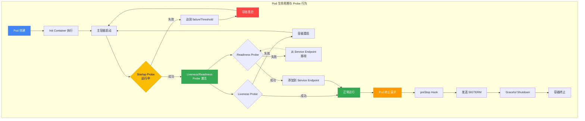

### 2.2 Probe 机制

Kubernetes 支持四种 Probe 机制。

| 机制 | 描述 | 优点 | 缺点 | 最适合 |
|----------|------|------|------|------------|
| **httpGet** | HTTP GET 请求，检查 200-399 响应码 | 标准，实现简单 | 需要 HTTP 服务器 | REST API、Web 服务 |
| **tcpSocket** | 检查 TCP 端口连通性 | 轻量快速 | 无法验证应用逻辑 | gRPC、数据库 |
| **exec** | 在容器内执行命令，检查退出码是否为 0 | 灵活，可自定义逻辑 | 开销较高 | 批处理 Worker、基于文件的检查 |
| **grpc** | 使用 gRPC Health Check Protocol（K8s 1.27+ GA） | 原生 gRPC 支持 | 仅适用于 gRPC 应用 | gRPC 微服务 |

#### httpGet 示例

```yaml
livenessProbe:
  httpGet:
    path: /healthz
    port: 8080
    httpHeaders:
    - name: X-Custom-Header
      value: HealthCheck
    scheme: HTTP  # 或 HTTPS
  initialDelaySeconds: 30
  periodSeconds: 10
```

#### tcpSocket 示例

```yaml
livenessProbe:
  tcpSocket:
    port: 5432  # PostgreSQL
  initialDelaySeconds: 15
  periodSeconds: 10
```

#### exec 示例

```yaml
livenessProbe:
  exec:
    command:
    - /bin/sh
    - -c
    - test -f /tmp/healthy
  initialDelaySeconds: 5
  periodSeconds: 5
```

#### grpc 示例（Kubernetes 1.27+）

```yaml
livenessProbe:
  grpc:
    port: 9090
    service: myservice  # 可选
  initialDelaySeconds: 10
  periodSeconds: 5
```

:::tip gRPC Health Check Protocol
gRPC 服务必须实现 [gRPC Health Checking Protocol](https://github.com/grpc/grpc/blob/master/doc/health-checking.md)。Go 语言使用 `google.golang.org/grpc/health`，Java 使用 `grpc-health-check` 库。
:::

### 2.3 Probe 时间设计

Probe 时间参数决定了故障检测速度和稳定性之间的平衡。

| 参数 | 描述 | 默认值 | 建议范围 |
|----------|------|--------|----------|
| `initialDelaySeconds` | 容器启动到首次 Probe 的等待时间 | 0 | 10-30s（使用 Startup Probe 时可设为 0） |
| `periodSeconds` | Probe 执行间隔 | 10 | 5-15s |
| `timeoutSeconds` | Probe 响应等待时间 | 1 | 3-10s |
| `failureThreshold` | 判定失败前的连续失败次数 | 3 | Liveness: 3, Readiness: 1-3, Startup: 30+ |
| `successThreshold` | 判定成功前的连续成功次数（仅 Readiness 可 >1） | 1 | 1-2 |

#### 时间设计公式

```
最大检测时间 = failureThreshold × periodSeconds
最短恢复时间 = successThreshold × periodSeconds
```

**示例：**
- `failureThreshold: 3, periodSeconds: 10` → 最多 30 秒后检测到故障
- `successThreshold: 2, periodSeconds: 5` → 至少 10 秒后判定恢复（仅 Readiness）

#### 按工作负载类型的建议时间

| 工作负载类型 | initialDelaySeconds | periodSeconds | failureThreshold | 理由 |
|--------------|-------------------|---------------|-----------------|------|
| Web 服务（Node.js、Python） | 10 | 5 | 3 | 启动快，需要快速检测 |
| JVM 应用（Spring Boot） | 0（使用 Startup Probe） | 10 | 3 | 启动慢，由 Startup Probe 保护 |
| 数据库（PostgreSQL） | 30 | 10 | 5 | 初始化时间长 |
| 批处理 Worker | 5 | 15 | 2 | 周期性任务，检测要求宽松 |
| ML 推理服务 | 0（Startup: 60） | 10 | 3 | 模型加载时间长 |

### 2.4 按工作负载的 Probe 模式

#### 模式 1：Web 服务（REST API）

```yaml
apiVersion: apps/v1
kind: Deployment
metadata:
  name: rest-api
spec:
  replicas: 3
  selector:
    matchLabels:
      app: rest-api
  template:
    metadata:
      labels:
        app: rest-api
    spec:
      containers:
      - name: api
        image: myapp/rest-api:v1.2.3
        ports:
        - containerPort: 8080
          protocol: TCP
        resources:
          requests:
            cpu: 200m
            memory: 256Mi
          limits:
            cpu: 500m
            memory: 512Mi
        # Startup Probe：验证在 30 秒内完成启动
        startupProbe:
          httpGet:
            path: /healthz
            port: 8080
          failureThreshold: 6
          periodSeconds: 5
        # Liveness Probe：仅内部健康检查（排除外部依赖）
        livenessProbe:
          httpGet:
            path: /healthz
            port: 8080
          initialDelaySeconds: 10
          periodSeconds: 10
          timeoutSeconds: 5
          failureThreshold: 3
        # Readiness Probe：可以包含外部依赖
        readinessProbe:
          httpGet:
            path: /ready
            port: 8080
          initialDelaySeconds: 5
          periodSeconds: 5
          timeoutSeconds: 3
          failureThreshold: 2
          successThreshold: 1
        lifecycle:
          preStop:
            exec:
              command:
              - /bin/sh
              - -c
              - sleep 5 && kill -TERM 1
      terminationGracePeriodSeconds: 60
```

**健康检查端点实现（Node.js/Express）：**

```javascript
// /healthz - Liveness：仅检查应用自身状态
app.get('/healthz', (req, res) => {
  // 仅检查内部状态（内存、CPU 等）
  const memUsage = process.memoryUsage();
  if (memUsage.heapUsed / memUsage.heapTotal > 0.95) {
    return res.status(500).json({ status: 'unhealthy', reason: 'memory_pressure' });
  }
  res.status(200).json({ status: 'ok' });
});

// /ready - Readiness：包括外部依赖的检查
app.get('/ready', async (req, res) => {
  try {
    // 验证 DB 连接
    await db.ping();
    // 验证 Redis 连接
    await redis.ping();
    res.status(200).json({ status: 'ready' });
  } catch (err) {
    res.status(503).json({ status: 'not_ready', reason: err.message });
  }
});
```

#### 模式 2：gRPC 服务

```yaml
apiVersion: apps/v1
kind: Deployment
metadata:
  name: grpc-service
spec:
  replicas: 3
  selector:
    matchLabels:
      app: grpc-service
  template:
    metadata:
      labels:
        app: grpc-service
    spec:
      containers:
      - name: grpc-server
        image: myapp/grpc-service:v2.1.0
        ports:
        - containerPort: 9090
          name: grpc
        resources:
          requests:
            cpu: 300m
            memory: 512Mi
          limits:
            cpu: 1
            memory: 1Gi
        # gRPC 原生探针（K8s 1.27+）
        startupProbe:
          grpc:
            port: 9090
            service: myapp.HealthService  # 可选
          failureThreshold: 30
          periodSeconds: 10
        livenessProbe:
          grpc:
            port: 9090
          periodSeconds: 10
          timeoutSeconds: 5
          failureThreshold: 3
        readinessProbe:
          grpc:
            port: 9090
          periodSeconds: 5
          timeoutSeconds: 3
          failureThreshold: 2
      terminationGracePeriodSeconds: 45
```

**gRPC 健康检查实现（Go）：**

```go
package main

import (
    "context"
    "google.golang.org/grpc"
    "google.golang.org/grpc/health"
    "google.golang.org/grpc/health/grpc_health_v1"
)

func main() {
    server := grpc.NewServer()

    // 注册健康检查服务
    healthServer := health.NewServer()
    grpc_health_v1.RegisterHealthServer(server, healthServer)

    // 设置服务状态为 SERVING
    healthServer.SetServingStatus("myapp.HealthService", grpc_health_v1.HealthCheckResponse_SERVING)

    // 依赖检查后可以更改为 NOT_SERVING
    // healthServer.SetServingStatus("myapp.HealthService", grpc_health_v1.HealthCheckResponse_NOT_SERVING)

    // 启动 gRPC 服务器
    lis, _ := net.Listen("tcp", ":9090")
    server.Serve(lis)
}
```

#### 模式 3：Worker/批处理

批处理 Worker 没有 HTTP 服务器，因此使用 `exec` Probe。

```yaml
apiVersion: apps/v1
kind: Deployment
metadata:
  name: batch-worker
spec:
  replicas: 2
  selector:
    matchLabels:
      app: batch-worker
  template:
    metadata:
      labels:
        app: batch-worker
    spec:
      containers:
      - name: worker
        image: myapp/batch-worker:v3.0.1
        resources:
          requests:
            cpu: 500m
            memory: 1Gi
          limits:
            cpu: 2
            memory: 4Gi
        # Startup Probe：验证 Worker 初始化
        startupProbe:
          exec:
            command:
            - /bin/sh
            - -c
            - test -f /tmp/worker-ready
          failureThreshold: 12
          periodSeconds: 5
        # Liveness Probe：检查心跳文件
        livenessProbe:
          exec:
            command:
            - /bin/sh
            - -c
            - find /tmp/heartbeat -mmin -2 | grep -q heartbeat
          initialDelaySeconds: 10
          periodSeconds: 30
          failureThreshold: 3
        # Readiness Probe：验证作业队列连接
        readinessProbe:
          exec:
            command:
            - /app/check-queue-connection.sh
          periodSeconds: 10
          failureThreshold: 3
      terminationGracePeriodSeconds: 120
```

**Worker 应用（Python）：**

```python
import os
import time
from pathlib import Path

HEARTBEAT_FILE = Path("/tmp/heartbeat")
READY_FILE = Path("/tmp/worker-ready")

def worker_loop():
    # 标记初始化完成
    READY_FILE.touch()

    while True:
        # 定期更新心跳
        HEARTBEAT_FILE.touch()

        # 处理作业
        process_jobs()
        time.sleep(5)

def process_jobs():
    # 实际作业逻辑
    pass

if __name__ == "__main__":
    worker_loop()
```

#### 模式 4：启动缓慢的应用（Spring Boot、JVM）

JVM 应用启动可能需要 30 秒或更长时间。使用 Startup Probe 进行保护。

```yaml
apiVersion: apps/v1
kind: Deployment
metadata:
  name: spring-boot-app
spec:
  replicas: 4
  selector:
    matchLabels:
      app: spring-boot
  template:
    metadata:
      labels:
        app: spring-boot
    spec:
      containers:
      - name: app
        image: myapp/spring-boot:v2.7.0
        ports:
        - containerPort: 8080
        resources:
          requests:
            cpu: 1
            memory: 2Gi
          limits:
            cpu: 2
            memory: 4Gi
        env:
        - name: JAVA_OPTS
          value: "-Xms1g -Xmx3g"
        # Startup Probe：最长等待 5 分钟（30 x 10s）
        startupProbe:
          httpGet:
            path: /actuator/health/liveness
            port: 8080
          failureThreshold: 30
          periodSeconds: 10
        # Liveness Probe：Startup 成功后激活
        livenessProbe:
          httpGet:
            path: /actuator/health/liveness
            port: 8080
          periodSeconds: 10
          timeoutSeconds: 5
          failureThreshold: 3
        # Readiness Probe：包含外部依赖
        readinessProbe:
          httpGet:
            path: /actuator/health/readiness
            port: 8080
          periodSeconds: 5
          timeoutSeconds: 3
          failureThreshold: 2
      terminationGracePeriodSeconds: 60
```

**Spring Boot Actuator 配置：**

```yaml
# application.yml
management:
  endpoints:
    web:
      exposure:
        include: health
  health:
    livenessState:
      enabled: true
    readinessState:
      enabled: true
  endpoint:
    health:
      probes:
        enabled: true
      show-details: when-authorized
```

#### 模式 5：Sidecar 模式（Istio Proxy + App）

在 Sidecar 模式中，应为主容器和 Sidecar 都配置 Probe。

```yaml
apiVersion: apps/v1
kind: Deployment
metadata:
  name: app-with-sidecar
spec:
  replicas: 3
  selector:
    matchLabels:
      app: myapp
  template:
    metadata:
      labels:
        app: myapp
    spec:
      containers:
      # 主应用容器
      - name: app
        image: myapp/app:v1.0.0
        ports:
        - containerPort: 8080
        startupProbe:
          httpGet:
            path: /healthz
            port: 8080
          failureThreshold: 10
          periodSeconds: 5
        livenessProbe:
          httpGet:
            path: /healthz
            port: 8080
          periodSeconds: 10
        readinessProbe:
          httpGet:
            path: /ready
            port: 8080
          periodSeconds: 5
      # Istio sidecar（Istio 在自动注入时会自动添加 Probe）
      # 手动配置示例：
      - name: istio-proxy
        image: istio/proxyv2:1.22.0
        ports:
        - containerPort: 15090
          name: http-envoy-prom
        startupProbe:
          httpGet:
            path: /healthz/ready
            port: 15021
          failureThreshold: 30
          periodSeconds: 1
        livenessProbe:
          httpGet:
            path: /healthz/ready
            port: 15021
          periodSeconds: 10
        readinessProbe:
          httpGet:
            path: /healthz/ready
            port: 15021
          periodSeconds: 2
      terminationGracePeriodSeconds: 90
```

:::tip Istio Sidecar 注入
当 Istio 使用自动注入（`istio-injection=enabled` 标签）时，Istio 会自动为 Sidecar 添加适当的 Probe，无需手动配置。
:::

#### 2.4.6 Windows 容器 Probe 注意事项

EKS 支持基于 Windows Server 2019/2022 的 Windows 节点，Windows 容器与 Linux 容器相比具有不同的 Probe 行为特征。

##### Windows 与 Linux Probe 行为差异

| 项目 | Linux 容器 | Windows 容器 | 影响 |
|------|---------------|-----------------|------|
| **容器运行时** | containerd | containerd (1.6+) | 相同运行时，不同 OS 层 |
| **exec Probe 执行** | `/bin/sh -c` | `cmd.exe /c` 或 `powershell.exe` | 脚本语法差异 |
| **httpGet Probe** | 相同 | 相同 | 无差异 |
| **tcpSocket Probe** | 相同 | 相同 | 无差异 |
| **冷启动时间** | 快（几秒） | 慢（10-30 秒） | 需要增加 Startup Probe failureThreshold |
| **内存开销** | 低（50-100MB） | 高（200-500MB） | 需要增加 Resource request |
| **Probe 超时** | 通常 1-5 秒 | 建议 3-10 秒 | 需考虑 Windows I/O 延迟 |

##### Windows 工作负载 Probe 配置示例

**IIS/.NET Framework 应用：**

```yaml
apiVersion: apps/v1
kind: Deployment
metadata:
  name: iis-app
  namespace: windows-workloads
spec:
  replicas: 2
  selector:
    matchLabels:
      app: iis-app
  template:
    metadata:
      labels:
        app: iis-app
    spec:
      nodeSelector:
        kubernetes.io/os: windows
        kubernetes.io/arch: amd64
      containers:
      - name: iis
        image: mcr.microsoft.com/windows/servercore/iis:windowsservercore-ltsc2022
        ports:
        - containerPort: 80
        resources:
          requests:
            cpu: 500m
            memory: 512Mi
          limits:
            cpu: 2000m
            memory: 2Gi
        # Startup Probe：考虑 Windows 冷启动
        startupProbe:
          httpGet:
            path: /
            port: 80
            scheme: HTTP
          initialDelaySeconds: 10
          periodSeconds: 5
          timeoutSeconds: 5
          failureThreshold: 12  # 是 Linux 的 2 倍（最长 60 秒）
          successThreshold: 1
        # Liveness Probe：IIS 进程状态
        livenessProbe:
          httpGet:
            path: /healthz
            port: 80
          initialDelaySeconds: 30
          periodSeconds: 10
          timeoutSeconds: 5
          failureThreshold: 3
        # Readiness Probe：ASP.NET 应用就绪
        readinessProbe:
          httpGet:
            path: /ready
            port: 80
          initialDelaySeconds: 15
          periodSeconds: 5
          timeoutSeconds: 5
          failureThreshold: 3
          successThreshold: 1
      terminationGracePeriodSeconds: 60
```

**ASP.NET Core 健康检查端点实现：**

```csharp
// Program.cs (ASP.NET Core 6+)
using Microsoft.AspNetCore.Diagnostics.HealthChecks;
using Microsoft.Extensions.Diagnostics.HealthChecks;

var builder = WebApplication.CreateBuilder(args);

// 添加健康检查
builder.Services.AddHealthChecks()
    .AddCheck("self", () => HealthCheckResult.Healthy())
    .AddSqlServer(
        connectionString: builder.Configuration.GetConnectionString("DefaultConnection"),
        name: "sqlserver",
        tags: new[] { "ready" }
    );

var app = builder.Build();

// /healthz - Liveness：仅检查应用自身
app.MapHealthChecks("/healthz", new HealthCheckOptions
{
    Predicate = check => check.Tags.Contains("self") || check.Tags.Count == 0
});

// /ready - Readiness：包括外部依赖
app.MapHealthChecks("/ready", new HealthCheckOptions
{
    Predicate = _ => true  // 所有健康检查
});

app.Run();
```

##### Windows 工作负载 Probe 超时注意事项

Windows 容器可能出现较长的 Probe 超时，原因如下：

1. **Windows 内核开销**: 较重的 Windows OS 层导致系统调用延迟
2. **磁盘 I/O 性能**: NTFS 文件系统元数据开销
3. **.NET Framework 预热**: CLR JIT 编译和程序集加载时间
4. **Windows Defender**: 实时扫描导致进程启动延迟

**建议的 Probe 时间（Windows）：**

```yaml
startupProbe:
  timeoutSeconds: 5-10      # Linux: 3-5s
  periodSeconds: 5
  failureThreshold: 12-20   # Linux: 6-10

livenessProbe:
  timeoutSeconds: 5-10      # Linux: 3-5s
  periodSeconds: 10-15      # Linux: 10s
  failureThreshold: 3

readinessProbe:
  timeoutSeconds: 5-10      # Linux: 3-5s
  periodSeconds: 5-10       # Linux: 5s
  failureThreshold: 3
```

##### CloudWatch Container Insights for Windows（2025-08）

AWS 于 2025 年 8 月宣布 CloudWatch Container Insights 支持 Windows 工作负载。

**在 Windows 节点上安装 Container Insights：**

```bash
# CloudWatch Agent ConfigMap（Windows）
kubectl apply -f - <<EOF
apiVersion: v1
kind: ConfigMap
metadata:
  name: cwagentconfig-windows
  namespace: amazon-cloudwatch
data:
  cwagentconfig.json: |
    {
      "logs": {
        "metrics_collected": {
          "kubernetes": {
            "cluster_name": "my-eks-cluster",
            "metrics_collection_interval": 60
          }
        }
      },
      "metrics": {
        "namespace": "ContainerInsights",
        "metrics_collected": {
          "statsd": {
            "service_address": ":8125"
          }
        }
      }
    }
EOF

# 部署 Windows DaemonSet
kubectl apply -f https://raw.githubusercontent.com/aws-samples/amazon-cloudwatch-container-insights/latest/k8s-deployment-manifest-templates/deployment-mode/daemonset/container-insights-monitoring/cwagent/cwagent-daemonset-windows.yaml
```

**验证 Container Insights 指标：**

```bash
# Windows 节点指标
aws cloudwatch get-metric-statistics \
  --namespace ContainerInsights \
  --metric-name node_memory_utilization \
  --dimensions Name=ClusterName,Value=my-eks-cluster Name=NodeName,Value=windows-node-1 \
  --start-time 2026-02-12T00:00:00Z \
  --end-time 2026-02-12T23:59:59Z \
  --period 300 \
  --statistics Average

# Windows Pod 指标
aws cloudwatch get-metric-statistics \
  --namespace ContainerInsights \
  --metric-name pod_cpu_utilization \
  --dimensions Name=ClusterName,Value=my-eks-cluster Name=Namespace,Value=windows-workloads \
  --start-time 2026-02-12T00:00:00Z \
  --end-time 2026-02-12T23:59:59Z \
  --period 60 \
  --statistics Average
```

##### 混合集群（Linux + Windows）统一监控策略

**1. 基于 Node Selector 的分离：**

```yaml
apiVersion: v1
kind: Service
metadata:
  name: unified-app
spec:
  selector:
    app: unified-app  # 与 OS 无关
  ports:
  - port: 80
    targetPort: 8080
---
# Linux Deployment
apiVersion: apps/v1
kind: Deployment
metadata:
  name: unified-app-linux
spec:
  replicas: 3
  selector:
    matchLabels:
      app: unified-app
      os: linux
  template:
    metadata:
      labels:
        app: unified-app
        os: linux
    spec:
      nodeSelector:
        kubernetes.io/os: linux
      containers:
      - name: app
        image: myapp:linux-v1
        readinessProbe:
          httpGet:
            path: /ready
            port: 8080
          periodSeconds: 5
          timeoutSeconds: 3
---
# Windows Deployment
apiVersion: apps/v1
kind: Deployment
metadata:
  name: unified-app-windows
spec:
  replicas: 2
  selector:
    matchLabels:
      app: unified-app
      os: windows
  template:
    metadata:
      labels:
        app: unified-app
        os: windows
    spec:
      nodeSelector:
        kubernetes.io/os: windows
      containers:
      - name: app
        image: myapp:windows-v1
        readinessProbe:
          httpGet:
            path: /ready
            port: 8080
          periodSeconds: 10      # Windows：较长间隔
          timeoutSeconds: 10     # Windows：较长超时
```

**2. CloudWatch Logs Insights 统一查询：**

```sql
-- 同时搜索 Linux 和 Windows Pod 日志
fields @timestamp, kubernetes.namespace_name, kubernetes.pod_name, kubernetes.host, @message
| filter kubernetes.labels.app = "unified-app"
| sort @timestamp desc
| limit 100
```

**3. Grafana Dashboard 集成：**

```yaml
# Prometheus 查询（混合集群）
# Linux + Windows Pod CPU 利用率
sum(rate(container_cpu_usage_seconds_total{namespace="default", pod=~"unified-app-.*"}[5m])) by (pod, node, os)

# 按 OS 聚合
sum(rate(container_cpu_usage_seconds_total{namespace="default", pod=~"unified-app-.*"}[5m])) by (os)
```

:::warning Windows 容器限制
- **镜像大小**: Windows 镜像有几个 GB（Linux 是几十 MB）
- **许可证成本**: 适用 Windows Server 许可证费用（包含在 EC2 实例费用中）
- **节点启动时间**: Windows 节点启动较慢（5-10 分钟）
- **特权容器**: Windows 不支持 Linux `privileged` 模式
- **HostProcess 容器**: 从 Windows Server 2022（1.22+）开始支持
:::

:::info 参考资料
- [AWS 博客：CloudWatch Container Insights for Windows](https://aws.amazon.com/blogs/mt/announcing-amazon-cloudwatch-container-insights-for-amazon-eks-windows-workloads-monitoring)
- [EKS Windows 容器官方文档](https://docs.aws.amazon.com/eks/latest/userguide/windows-support.html)
- [Kubernetes Windows 容器指南](https://kubernetes.io/docs/concepts/windows/)
:::

### 2.5 Probe 反模式与陷阱

#### 反模式 1：在 Liveness Probe 中包含外部依赖

**问题：**

```yaml
livenessProbe:
  httpGet:
    path: /health  # 包含 DB、Redis 连接检查
    port: 8080
```

**结果：**
- DB 故障时所有 Pod 同时重启 → 级联故障
- 即使是临时的网络延迟也会导致 Pod 重启

**正确配置：**

```yaml
# Liveness：仅检查应用自身状态
livenessProbe:
  httpGet:
    path: /healthz  # 仅检查内部状态
    port: 8080

# Readiness：包含外部依赖
readinessProbe:
  httpGet:
    path: /ready  # 检查 DB、Redis 等
    port: 8080
```

#### 反模式 2：不使用 Startup Probe 却设置过高的 initialDelaySeconds

**问题：**

```yaml
livenessProbe:
  httpGet:
    path: /healthz
    port: 8080
  initialDelaySeconds: 120  # 等待 2 分钟
  periodSeconds: 10
```

**结果：**
- 即使应用在 30 秒内完成启动，也有 90 秒没有健康检查
- 启动期间的崩溃最多 2 分钟内无法检测

**正确配置：**

```yaml
# 使用 Startup Probe 保护启动
startupProbe:
  httpGet:
    path: /healthz
    port: 8080
  failureThreshold: 12  # 最长等待 120 秒
  periodSeconds: 10

# Liveness 在 Startup 成功后立即激活
livenessProbe:
  httpGet:
    path: /healthz
    port: 8080
  initialDelaySeconds: 0  # Startup 成功后立即开始
  periodSeconds: 10
```

#### 反模式 3：Liveness 和 Readiness 使用相同端点

**问题：**

```yaml
livenessProbe:
  httpGet:
    path: /health
    port: 8080

readinessProbe:
  httpGet:
    path: /health  # 相同端点
    port: 8080
```

**结果：**
- 如果 `/health` 检查外部依赖，Liveness 会失败导致不必要的重启
- 角色分离模糊，增加调试难度

**正确配置：**

```yaml
livenessProbe:
  httpGet:
    path: /healthz  # 仅内部状态
    port: 8080

readinessProbe:
  httpGet:
    path: /ready  # 包含外部依赖
    port: 8080
```

#### 反模式 4：过于激进的 failureThreshold

**问题：**

```yaml
livenessProbe:
  httpGet:
    path: /healthz
    port: 8080
  periodSeconds: 5
  failureThreshold: 1  # 仅 1 次失败就重启
```

**结果：**
- 临时网络延迟、GC 暂停等会导致不必要的重启
- 可能出现重启循环

**正确配置：**

```yaml
livenessProbe:
  httpGet:
    path: /healthz
    port: 8080
  periodSeconds: 10
  failureThreshold: 3  # 30 秒后重启（3 x 10s）
  timeoutSeconds: 5
```

#### 反模式 5：过长的 timeoutSeconds

**问题：**

```yaml
livenessProbe:
  httpGet:
    path: /healthz
    port: 8080
  timeoutSeconds: 30  # 等待 30 秒
  periodSeconds: 10
```

**结果：**
- Probe 阻塞 30 秒，延迟下一次 Probe 执行
- 故障检测变慢

**正确配置：**

```yaml
livenessProbe:
  httpGet:
    path: /healthz
    port: 8080
  timeoutSeconds: 5  # 要求 5 秒内响应
  periodSeconds: 10
  failureThreshold: 3
```

### 2.6 ALB/NLB 健康检查与 Probe 集成

使用 AWS Load Balancer Controller 时，必须同步 ALB/NLB 健康检查与 Kubernetes Readiness Probe，以实现零停机部署。

#### ALB Target Group 健康检查 vs Readiness Probe

| 类别 | ALB/NLB 健康检查 | Kubernetes Readiness Probe |
|------|-----------------|---------------------------|
| **执行方** | AWS Load Balancer | kubelet |
| **检查目标** | Target Group IP:Port | Pod 容器 |
| **失败时的行为** | 从 Target 移除（阻止流量） | 从 Service Endpoints 移除 |
| **默认间隔** | 30 秒 | 10 秒 |
| **超时时间** | 5 秒 | 1 秒 |

#### 健康检查时间同步策略

在滚动更新期间，会发生以下序列：

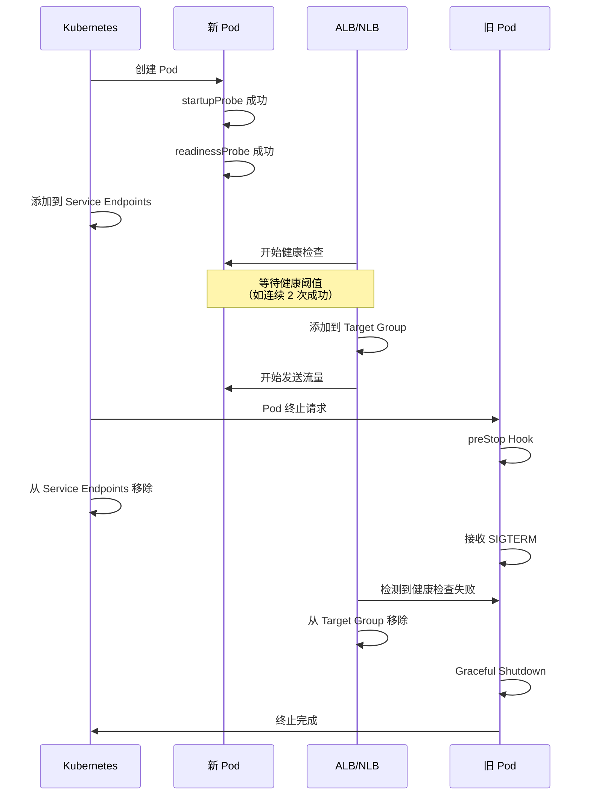

**建议配置：**

```yaml
apiVersion: v1
kind: Service
metadata:
  name: myapp
  annotations:
    # ALB 健康检查配置
    alb.ingress.kubernetes.io/healthcheck-path: /ready
    alb.ingress.kubernetes.io/healthcheck-interval-seconds: "10"
    alb.ingress.kubernetes.io/healthcheck-timeout-seconds: "5"
    alb.ingress.kubernetes.io/healthy-threshold-count: "2"
    alb.ingress.kubernetes.io/unhealthy-threshold-count: "2"
spec:
  type: NodePort
  ports:
  - port: 80
    targetPort: 8080
  selector:
    app: myapp
---
apiVersion: apps/v1
kind: Deployment
metadata:
  name: myapp
spec:
  replicas: 3
  template:
    spec:
      containers:
      - name: app
        image: myapp:v1
        ports:
        - containerPort: 8080
        readinessProbe:
          httpGet:
            path: /ready  # 与 ALB 相同的路径
            port: 8080
          periodSeconds: 5  # 比 ALB 更短的间隔
          failureThreshold: 2
          successThreshold: 1
      terminationGracePeriodSeconds: 60
```

#### Pod Readiness Gates（保证零停机部署）

AWS Load Balancer Controller v2.5+ 支持 Pod Readiness Gates，它会延迟 Pod 转换为 `Ready` 状态，直到 Pod 注册为 ALB/NLB 目标并通过健康检查。

**启用方式：**

```yaml
# 通过向 Namespace 添加标签启用自动注入
apiVersion: v1
kind: Namespace
metadata:
  name: production
  labels:
    elbv2.k8s.aws/pod-readiness-gate-inject: enabled
```

**验证操作：**

```bash
# 检查 Pod 的 Readiness Gates
kubectl get pod myapp-xyz -o yaml | grep -A 10 readinessGates

# 示例输出：
# readinessGates:
# - conditionType: target-health.alb.ingress.k8s.aws/my-target-group-hash

# 检查 Pod Conditions
kubectl get pod myapp-xyz -o jsonpath='{.status.conditions}' | jq
```

**优势：**
- 在滚动更新期间，旧 Pod 在从 Target 移除之前会被保留
- 新 Pod 只有在通过 ALB 健康检查后才会接收流量
- 完全零停机部署，无流量损失

:::info 详细信息
有关 Pod Readiness Gates 的更多详情，请参阅 [EKS 高可用架构指南](/docs/operations-observability/eks-resiliency-guide) 中的"Pod Readiness Gates"章节。
:::

#### 2.6.4 Gateway API 健康检查集成（ALB Controller v2.14+）

AWS Load Balancer Controller v2.14+ 原生集成 Kubernetes Gateway API v1.4，与 Ingress 相比提供了增强的按路由健康检查映射。

##### Gateway API vs Ingress 健康检查比较

| 类别 | Ingress | Gateway API |
|------|---------|-------------|
| **健康检查配置位置** | Service/Ingress 注解 | HealthCheckPolicy CRD |
| **按路由健康检查** | 有限（基于注解） | 原生支持（按 HTTPRoute/GRPCRoute） |
| **L4/L7 协议支持** | 仅 HTTP/HTTPS | TCP/UDP/TLS/HTTP/GRPC 全部支持 |
| **多租户角色分离** | 单一 Ingress 对象 | Gateway（基础设施）/ Route（应用）分离 |
| **加权金丝雀部署** | 困难或不可能 | HTTPRoute 原生支持 |

##### Gateway API 架构与健康检查

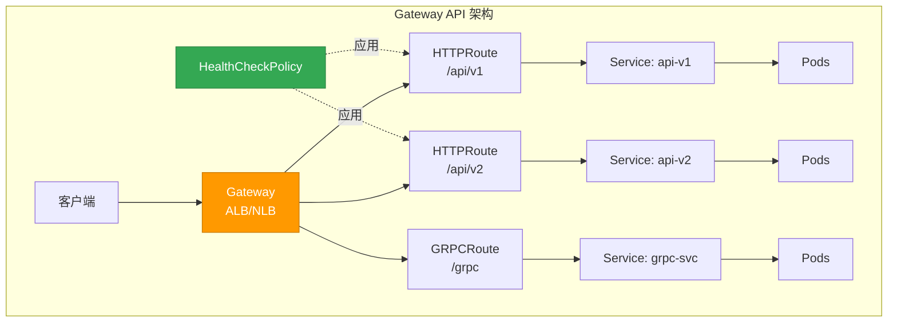

##### L7 健康检查：HTTPRoute/GRPCRoute 与 ALB

**HealthCheckPolicy CRD 示例：**

```yaml
apiVersion: gateway.networking.k8s.io/v1
kind: Gateway
metadata:
  name: prod-gateway
  namespace: production
spec:
  gatewayClassName: alb
  listeners:
  - name: http
    protocol: HTTP
    port: 80
---
apiVersion: gateway.networking.k8s.io/v1
kind: HTTPRoute
metadata:
  name: api-v1-route
  namespace: production
spec:
  parentRefs:
  - name: prod-gateway
  hostnames:
  - api.example.com
  rules:
  - matches:
    - path:
        type: PathPrefix
        value: /api/v1
    backendRefs:
    - name: api-v1-service
      port: 8080
---
# HealthCheckPolicy（AWS Load Balancer Controller v2.14+）
apiVersion: elbv2.k8s.aws/v1beta1
kind: HealthCheckPolicy
metadata:
  name: api-v1-healthcheck
  namespace: production
spec:
  targetGroupARN: arn:aws:elasticloadbalancing:region:account:targetgroup/name/id
  healthCheckConfig:
    protocol: HTTP
    path: /api/v1/healthz  # 按路由健康检查
    port: 8080
    intervalSeconds: 10
    timeoutSeconds: 5
    healthyThresholdCount: 2
    unhealthyThresholdCount: 2
    matcher:
      httpCode: "200-299"
```

**GRPCRoute 健康检查示例：**

```yaml
apiVersion: gateway.networking.k8s.io/v1alpha2
kind: GRPCRoute
metadata:
  name: grpc-service-route
  namespace: production
spec:
  parentRefs:
  - name: prod-gateway
  hostnames:
  - grpc.example.com
  rules:
  - matches:
    - method:
        service: myservice.v1.MyService
    backendRefs:
    - name: grpc-backend
      port: 9090
---
apiVersion: elbv2.k8s.aws/v1beta1
kind: HealthCheckPolicy
metadata:
  name: grpc-healthcheck
  namespace: production
spec:
  targetGroupARN: arn:aws:elasticloadbalancing:region:account:targetgroup/grpc/id
  healthCheckConfig:
    protocol: HTTP  # gRPC 健康检查基于 HTTP/2
    path: /grpc.health.v1.Health/Check
    port: 9090
    intervalSeconds: 10
    timeoutSeconds: 5
    healthyThresholdCount: 2
    unhealthyThresholdCount: 2
    matcher:
      grpcCode: "0"  # gRPC OK 状态
```

##### L4 健康检查：TCPRoute/UDPRoute 与 NLB

```yaml
apiVersion: gateway.networking.k8s.io/v1alpha2
kind: TCPRoute
metadata:
  name: tcp-service-route
  namespace: production
spec:
  parentRefs:
  - name: nlb-gateway
    sectionName: tcp-listener
  rules:
  - backendRefs:
    - name: tcp-backend
      port: 5432
---
apiVersion: elbv2.k8s.aws/v1beta1
kind: HealthCheckPolicy
metadata:
  name: tcp-healthcheck
  namespace: production
spec:
  targetGroupARN: arn:aws:elasticloadbalancing:region:account:targetgroup/tcp/id
  healthCheckConfig:
    protocol: TCP  # 仅 TCP 连接检查
    port: 5432
    intervalSeconds: 30
    timeoutSeconds: 10
    healthyThresholdCount: 3
    unhealthyThresholdCount: 3
```

##### Gateway API Pod Readiness Gates

Gateway API 以与 Ingress 相同的方式支持 Pod Readiness Gates：

```yaml
apiVersion: v1
kind: Namespace
metadata:
  name: production
  labels:
    elbv2.k8s.aws/pod-readiness-gate-inject: enabled
```

**验证操作：**

```bash
# 检查 Gateway 状态
kubectl get gateway prod-gateway -n production

# 检查 HTTPRoute 状态
kubectl get httproute api-v1-route -n production -o yaml

# 检查 Pod 的 Readiness Gates
kubectl get pod -n production -l app=api-v1 \
  -o jsonpath='{range .items[*]}{.metadata.name}{"\t"}{.status.conditions[?(@.type=="target-health.gateway.networking.k8s.io")].status}{"\n"}{end}'
```

##### 健康检查迁移清单：Ingress 到 Gateway API

| 步骤 | Ingress | Gateway API | 验证项目 |
|------|---------|-------------|----------|
| 1. 健康检查路径映射 | 基于注解 | HealthCheckPolicy CRD | 按路由策略分离 |
| 2. 协议配置 | 仅 HTTP/HTTPS | HTTP/HTTPS/GRPC/TCP/UDP | 验证协议类型 |
| 3. Pod Readiness Gates | Namespace 标签 | Namespace 标签（相同） | 零停机部署保证 |
| 4. 健康检查时间 | Service 注解 | HealthCheckPolicy | 验证 interval/timeout |
| 5. 多路径健康检查 | 仅单一路径 | 按路由独立配置 | 验证每条路由 |

**迁移示例（Ingress 到 Gateway API）：**

```yaml
# 迁移前（Ingress）
apiVersion: v1
kind: Service
metadata:
  name: myapp
  annotations:
    alb.ingress.kubernetes.io/healthcheck-path: /healthz
    alb.ingress.kubernetes.io/healthcheck-interval-seconds: "10"
---
apiVersion: networking.k8s.io/v1
kind: Ingress
metadata:
  name: myapp-ingress
spec:
  rules:
  - host: api.example.com
    http:
      paths:
      - path: /
        pathType: Prefix
        backend:
          service:
            name: myapp
            port:
              number: 8080
```

```yaml
# 迁移后（Gateway API）
apiVersion: gateway.networking.k8s.io/v1
kind: HTTPRoute
metadata:
  name: myapp-route
spec:
  parentRefs:
  - name: prod-gateway
  hostnames:
  - api.example.com
  rules:
  - matches:
    - path:
        type: PathPrefix
        value: /
    backendRefs:
    - name: myapp
      port: 8080
---
apiVersion: elbv2.k8s.aws/v1beta1
kind: HealthCheckPolicy
metadata:
  name: myapp-healthcheck
spec:
  targetGroupARN: <auto-discovered-or-explicit>
  healthCheckConfig:
    protocol: HTTP
    path: /healthz
    port: 8080
    intervalSeconds: 10
    timeoutSeconds: 5
    healthyThresholdCount: 2
    unhealthyThresholdCount: 2
```

:::tip Gateway API 迁移策略
- **渐进式迁移**: 可以在同一个 ALB 上同时使用 Ingress 和 Gateway API（不同的 Listener）
- **金丝雀部署**: 使用 HTTPRoute 的基于权重的流量分割进行安全过渡
- **回滚计划**: 迁移完成后保留 Ingress 对象一段时间
:::

:::info 参考资料
- [Kubernetes Gateway API v1.4 Release](https://kubernetes.io/blog/2025/11/06/gateway-api-v1-4/)
- [AWS Load Balancer Controller Gateway API 指南](https://kubernetes-sigs.github.io/aws-load-balancer-controller/latest/guide/gateway/gateway/)
- [Gateway API 迁移实践指南](https://medium.com/@gudiwada.chaithu/zero-downtime-migration-from-kubernetes-ingress-to-gateway-api-on-aws-eks-642f3432d394)
:::

### 2.7 2025-2026 EKS 新特性与 Probe 集成

AWS re:Invent 2025 上发布的新的可观测性和控制特性进一步增强了基于 Probe 的健康检查。本节介绍如何将最新的 EKS 特性与 Probe 集成，以实现更精确和主动的健康监控。

#### 2.7.1 使用 Container Network Observability 验证 Probe 连通性

**概述：**

Container Network Observability（2025 年 11 月发布）提供细粒度的网络指标，包括 Pod 到 Pod 的通信模式、延迟和丢包率。它能够清晰区分 Probe 失败是由网络问题还是应用级别问题引起的。

**主要特性：**
- Pod 到 Pod 通信路径可视化
- 网络延迟、丢包率和重传率监控
- 实时网络流量异常检测
- 与 CloudWatch Container Insights 集成

**启用方式：**

```bash
# 在 VPC CNI 中启用网络可观测性
kubectl set env daemonset aws-node \
  -n kube-system \
  ENABLE_NETWORK_OBSERVABILITY=true

# 或通过 ConfigMap 配置
kubectl apply -f - <<EOF
apiVersion: v1
kind: ConfigMap
metadata:
  name: amazon-vpc-cni
  namespace: kube-system
data:
  enable-network-observability: "true"
EOF
```

**Probe 连通性验证示例：**

```yaml
apiVersion: apps/v1
kind: Deployment
metadata:
  name: api-gateway
  annotations:
    # 启用网络可观测性指标收集
    network-observability.amazonaws.com/enabled: "true"
spec:
  replicas: 3
  template:
    spec:
      containers:
      - name: gateway
        image: myapp/gateway:v2
        ports:
        - containerPort: 8080
        # Readiness Probe：检查外部 DB 连接
        readinessProbe:
          httpGet:
            path: /ready
            port: 8080
          periodSeconds: 5
          failureThreshold: 2
          timeoutSeconds: 3
        livenessProbe:
          httpGet:
            path: /healthz
            port: 8080
          periodSeconds: 10
          failureThreshold: 3
```

**CloudWatch Insights 查询 - 关联 Probe 失败与网络延迟：**

```sql
-- 检查 Probe 失败时的网络延迟
fields @timestamp, pod_name, probe_type, network_latency_ms, packet_loss_percent
| filter namespace = "production"
| filter probe_result = "failed"
| filter network_latency_ms > 100 or packet_loss_percent > 1
| sort @timestamp desc
| limit 100
```

**告警配置示例：**

```yaml
# CloudWatch Alarm：Probe 失败与网络异常同时发生
apiVersion: v1
kind: ConfigMap
metadata:
  name: probe-network-alert
  namespace: monitoring
data:
  alarm-config: |
    {
      "AlarmName": "ProbeFailureWithNetworkIssue",
      "MetricName": "ReadinessProbeFailure",
      "Namespace": "ContainerInsights",
      "Statistic": "Sum",
      "Period": 60,
      "EvaluationPeriods": 2,
      "Threshold": 3,
      "ComparisonOperator": "GreaterThanThreshold",
      "Dimensions": [
        {"Name": "ClusterName", "Value": "production-eks"},
        {"Name": "Namespace", "Value": "production"}
      ],
      "AlarmDescription": "Readiness Probe 失败时检查网络延迟"
    }
```

**诊断工作流：**

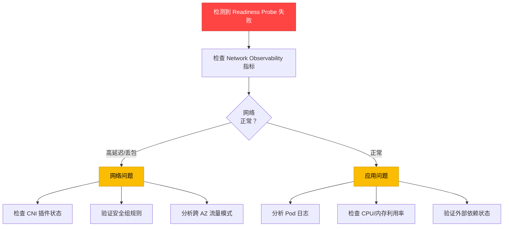

:::tip Pod 到 Pod 路径可视化
Container Network Observability 与 CloudWatch Logs Insights 集成，可追踪 Probe 请求的完整网络路径。当 Readiness Probe 检查外部数据库时，您可以在从 Pod 到 Service 到 Endpoint 再到 DB Pod 的整个路径中识别瓶颈段。
:::

---

#### 2.7.2 CloudWatch Observability Operator + Control Plane Metrics

**概述：**

CloudWatch Observability Operator（2025 年 12 月发布）自动收集 EKS Control Plane 指标，能够主动检测 API Server 性能下降如何影响 Probe 响应。

**安装：**

```bash
# 安装 CloudWatch Observability Operator
kubectl apply -f https://raw.githubusercontent.com/aws-observability/aws-cloudwatch-observability-operator/main/bundle.yaml

# 启用 EKS Control Plane 指标收集
kubectl apply -f - <<EOF
apiVersion: cloudwatch.aws.amazon.com/v1alpha1
kind: EKSControlPlaneMetrics
metadata:
  name: production-control-plane
  namespace: amazon-cloudwatch
spec:
  clusterName: production-eks
  region: ap-northeast-2
  metricsCollectionInterval: 60s
  enabledMetrics:
    - apiserver_request_duration_seconds
    - apiserver_request_total
    - apiserver_storage_objects
    - etcd_request_duration_seconds
    - rest_client_requests_total
EOF
```

**关键 Control Plane 指标：**

| 指标 | 描述 | Probe 相关性 | 阈值示例 |
|--------|------|-------------|------------|
| `apiserver_request_duration_seconds` | API Server 请求延迟 | Probe 请求处理速度 | p99 &lt; 1s |
| `apiserver_request_total` (code=5xx) | API Server 5xx 错误计数 | Probe 失败率增加 | &lt; 1% |
| `apiserver_storage_objects` | etcd 存储的对象数量 | 集群规模限制 | &lt; 150,000 |
| `etcd_request_duration_seconds` | etcd 读写延迟 | Pod 状态更新延迟 | p99 &lt; 100ms |
| `rest_client_requests_total` (code=429) | API Rate Limiting 发生次数 | kubelet-apiserver 通信节流 | &lt; 10/min |

**Probe 超时预测告警：**

```yaml
apiVersion: cloudwatch.amazonaws.com/v1alpha1
kind: Alarm
metadata:
  name: apiserver-slow-probe-risk
spec:
  alarmName: "EKS-APIServer-SlowProbeRisk"
  metrics:
    - id: m1
      metricStat:
        metric:
          namespace: AWS/EKS
          metricName: apiserver_request_duration_seconds
          dimensions:
            - name: ClusterName
              value: production-eks
            - name: verb
              value: GET
        period: 60
        stat: p99
    - id: e1
      expression: "IF(m1 > 0.5, 1, 0)"
      label: "API Server 响应延迟 > 500ms"
  evaluationPeriods: 2
  threshold: 1
  comparisonOperator: GreaterThanOrEqualToThreshold
  alarmDescription: "由于 API Server 性能下降导致 Probe 超时风险"
  alarmActions:
    - arn:aws:sns:ap-northeast-2:123456789012:eks-ops-alerts
```

**大规模集群中保证 Probe 性能：**

```yaml
# 1000+ 节点集群的 Probe 配置优化
apiVersion: apps/v1
kind: Deployment
metadata:
  name: large-scale-api
spec:
  replicas: 100
  template:
    spec:
      containers:
      - name: api
        image: myapp/api:v1
        # Probe 时间调整：考虑 API Server 负载
        startupProbe:
          httpGet:
            path: /healthz
            port: 8080
          failureThreshold: 30
          periodSeconds: 5  # 允许额外启动时间
        livenessProbe:
          httpGet:
            path: /healthz
            port: 8080
          periodSeconds: 15  # 大规模时增加间隔
          failureThreshold: 3
          timeoutSeconds: 5
        readinessProbe:
          httpGet:
            path: /ready
            port: 8080
          periodSeconds: 10
          failureThreshold: 2
          timeoutSeconds: 3
```

**CloudWatch Dashboard - Control Plane 与 Probe 关联分析：**

```json
{
  "widgets": [
    {
      "type": "metric",
      "properties": {
        "title": "API Server 延迟 vs Probe 失败率",
        "metrics": [
          ["AWS/EKS", "apiserver_request_duration_seconds", {"stat": "p99", "label": "API Server p99 延迟"}],
          ["ContainerInsights", "ReadinessProbeFailure", {"stat": "Sum", "yAxis": "right"}]
        ],
        "period": 60,
        "region": "ap-northeast-2",
        "yAxis": {
          "left": {"label": "延迟（秒）", "min": 0},
          "right": {"label": "Probe 失败次数", "min": 0}
        }
      }
    }
  ]
}
```

:::warning 大规模集群中的 API Server 负载
在 1000+ 节点的集群中，所有 kubelet 的 Probe 请求可能集中在 API Server 上。将 `periodSeconds` 增加到 10-15 秒，并将 `timeoutSeconds` 设置为 5 秒或更多，以分散 API Server 负载。使用 Provisioned Control Plane（2.7.3 节）可以从根本上解决此问题。
:::

---

#### 2.7.3 使用 Provisioned Control Plane 保证 Probe 性能

**概述：**

Provisioned Control Plane（2025 年 11 月发布）通过预分配的 Control Plane 容量保证可预测的高性能 Kubernetes 操作。它确保大规模集群中的 Probe 请求不会受到 API Server 性能下降的影响。

**各 Tier 的性能特征：**

| Tier | API 并发 | Pod 调度速度 | 最大节点数 | Probe 处理保证 | 适合的工作负载 |
|------|----------|---------------|------------|--------------|-------------|
| **XL** | 高 | ~500 Pods/min | 1,000 | 99.9% &lt; 100ms | AI 训练、HPC |
| **2XL** | 极高 | ~1,000 Pods/min | 2,500 | 99.9% &lt; 80ms | 大规模批处理 |
| **4XL** | 超快 | ~2,000 Pods/min | 5,000 | 99.9% &lt; 50ms | 超大规模 ML |

**Standard vs Provisioned Control Plane：**

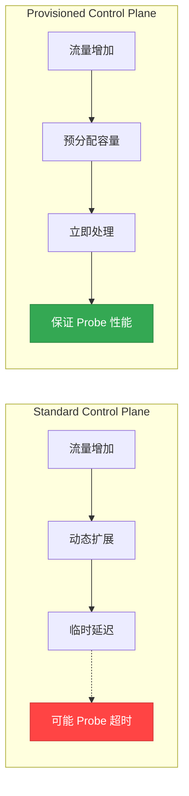

**创建 Provisioned Control Plane：**

```bash
# 创建 Provisioned Control Plane 集群（AWS CLI）
aws eks create-cluster \
  --name production-provisioned \
  --region ap-northeast-2 \
  --kubernetes-version 1.32 \
  --role-arn arn:aws:iam::123456789012:role/eks-cluster-role \
  --resources-vpc-config subnetIds=subnet-xxx,subnet-yyy,securityGroupIds=sg-zzz \
  --control-plane-type PROVISIONED \
  --control-plane-tier XL
```

**大规模 Probe 优化示例：**

```yaml
# AI/ML 训练集群（1000+ GPU 节点）
apiVersion: apps/v1
kind: Deployment
metadata:
  name: training-coordinator
  annotations:
    # 针对 Provisioned Control Plane 优化的 Probe 配置
    eks.amazonaws.com/control-plane-tier: "XL"
spec:
  replicas: 50
  template:
    spec:
      containers:
      - name: coordinator
        image: ml-training/coordinator:v3
        resources:
          requests:
            cpu: 4
            memory: 16Gi
        # Provisioned Control Plane 可以使用更短的间隔
        startupProbe:
          httpGet:
            path: /healthz
            port: 9090
          failureThreshold: 30
          periodSeconds: 3  # 快速检测
        livenessProbe:
          httpGet:
            path: /healthz
            port: 9090
          periodSeconds: 5  # 比 Standard 更短
          failureThreshold: 2
          timeoutSeconds: 2
        readinessProbe:
          httpGet:
            path: /ready
            port: 9090
          periodSeconds: 3
          failureThreshold: 1
          timeoutSeconds: 2
```

**使用案例：AI/ML 训练集群**

- **问题**: 在 1,000 个 GPU 节点上同时启动数百个 Training Pod 时，Standard Control Plane 出现 API Server 响应延迟
- **解决方案**: 使用 Provisioned Control Plane XL tier
- **成果**:
  - Pod 调度时间减少 70%（平均从 45 秒降至 13 秒）
  - Readiness Probe 超时减少 99.8%
  - Training Job 启动可靠性提升

**成本与性能考虑：**

```yaml
# Provisioned Control Plane 成本优化策略
# 1. 日常操作：Standard Control Plane
# 2. 训练期间：升级到 Provisioned Control Plane XL
# （目前在集群创建时选择；未来计划支持动态切换）
```

:::tip HPC 和大规模批处理工作负载
Provisioned Control Plane 针对在短时间内同时启动数千个 Pod 的工作负载进行了优化。它为 AI/ML 训练、科学模拟和大规模数据处理保证 Probe 性能，减少 Job 启动时间。
:::

---

#### 2.7.4 GuardDuty Extended Threat Detection 集成

**概述：**

GuardDuty Extended Threat Detection（EKS 支持：2025 年 6 月）可检测 Probe 端点的异常访问模式，识别恶意工作负载试图绕过或操纵健康检查的攻击。

**主要特性：**
- EKS 审计日志 + 运行时行为 + 恶意软件执行 + AWS API 活动的关联分析
- 基于 AI/ML 的多阶段攻击序列检测
- Probe 端点异常访问模式识别
- 自动检测加密挖矿等恶意工作负载

**启用：**

```bash
# 为 EKS 启用 GuardDuty Extended Threat Detection（AWS CLI）
aws guardduty update-detector \
  --detector-id <detector-id> \
  --features '[
    {
      "Name": "EKS_AUDIT_LOGS",
      "Status": "ENABLED"
    },
    {
      "Name": "EKS_RUNTIME_MONITORING",
      "Status": "ENABLED",
      "AdditionalConfiguration": [
        {
          "Name": "EKS_ADDON_MANAGEMENT",
          "Status": "ENABLED"
        }
      ]
    }
  ]'
```

**Probe 端点安全模式：**

```yaml
apiVersion: apps/v1
kind: Deployment
metadata:
  name: secure-api
spec:
  replicas: 3
  template:
    spec:
      containers:
      - name: api
        image: myapp/secure-api:v2
        ports:
        - containerPort: 8080
        # 健康检查端点
        livenessProbe:
          httpGet:
            path: /healthz
            port: 8080
            httpHeaders:
            - name: X-Health-Check-Token
              value: "SECRET_TOKEN_FROM_ENV"
          periodSeconds: 10
        readinessProbe:
          httpGet:
            path: /ready
            port: 8080
            httpHeaders:
            - name: X-Health-Check-Token
              value: "SECRET_TOKEN_FROM_ENV"
          periodSeconds: 5
        env:
        - name: HEALTH_CHECK_TOKEN
          valueFrom:
            secretKeyRef:
              name: api-secrets
              key: health-token
```

**GuardDuty 检测场景：**

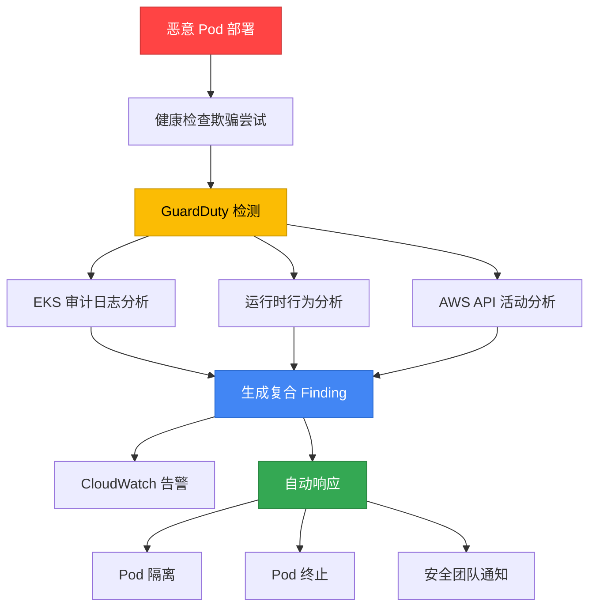

**真实检测案例 - 加密挖矿攻击：**

在 2025 年 11 月 2 日 GuardDuty 检测到的加密挖矿攻击中，攻击者按以下方式绕过健康检查：

1. 伪装为合法容器镜像
2. 在 startupProbe 成功后下载恶意二进制文件
3. livenessProbe 返回正常响应，同时在后台运行挖矿程序
4. GuardDuty 检测到异常网络流量 + CPU 使用模式

**检测后的自动响应：**

```yaml
# EventBridge Rule：GuardDuty Finding → Lambda → Pod 隔离
apiVersion: v1
kind: ConfigMap
metadata:
  name: guardduty-response
  namespace: security
data:
  eventbridge-rule: |
    {
      "source": ["aws.guardduty"],
      "detail-type": ["GuardDuty Finding"],
      "detail": {
        "service": {
          "serviceName": ["EKS"]
        },
        "severity": [7, 8, 9]  # High, Critical
      }
    }
  lambda-action: |
    import boto3
    eks = boto3.client('eks')

    def isolate_pod(cluster_name, namespace, pod_name):
        # 使用 NetworkPolicy 隔离 Pod
        kubectl_command = f"""
        kubectl apply -f - <<EOF
        apiVersion: networking.k8s.io/v1
        kind: NetworkPolicy
        metadata:
          name: isolate-{pod_name}
          namespace: {namespace}
        spec:
          podSelector:
            matchLabels:
              pod: {pod_name}
          policyTypes:
          - Ingress
          - Egress
        EOF
        """
        # 执行逻辑...
```

**安全监控 Dashboard：**

```yaml
# CloudWatch Dashboard：GuardDuty + Probe 状态
apiVersion: cloudwatch.amazonaws.com/v1alpha1
kind: Dashboard
metadata:
  name: security-probe-monitoring
spec:
  widgets:
    - type: metric
      title: "GuardDuty 检测 vs Probe 失败"
      metrics:
        - namespace: AWS/GuardDuty
          metricName: FindingCount
          dimensions:
            - name: ClusterName
              value: production-eks
        - namespace: ContainerInsights
          metricName: ProbeFailure
          dimensions:
            - name: Namespace
              value: production
```

:::warning 健康检查端点安全
Probe 端点（`/healthz`、`/ready`）通常在没有身份验证的情况下公开暴露，这可能成为攻击面。启用 GuardDuty Extended Threat Detection，并在可能的情况下向健康检查请求添加简单的 Token Header，以限制未授权访问。
:::

**相关文档：**
- [AWS 博客：GuardDuty Extended Threat Detection for EKS](https://aws.amazon.com/blogs/aws/amazon-guardduty-expands-extended-threat-detection-coverage-to-amazon-eks-clusters/)
- [AWS 博客：加密挖矿攻击检测](https://aws.amazon.com/blogs/security/cryptomining-campaign-targeting-amazon-ec2-and-amazon-ecs/)
- [EKS 安全最佳实践](https://docs.aws.amazon.com/eks/latest/best-practices/security.html)

---
## 3. Graceful Shutdown 完整指南

Graceful Shutdown 是一种在 Pod 终止时安全完成正在处理的请求并停止接受新请求的模式。它对于零停机部署和数据完整性至关重要。

### 3.1 Pod 终止序列详解

在 Kubernetes 中，Pod 终止按以下顺序进行。

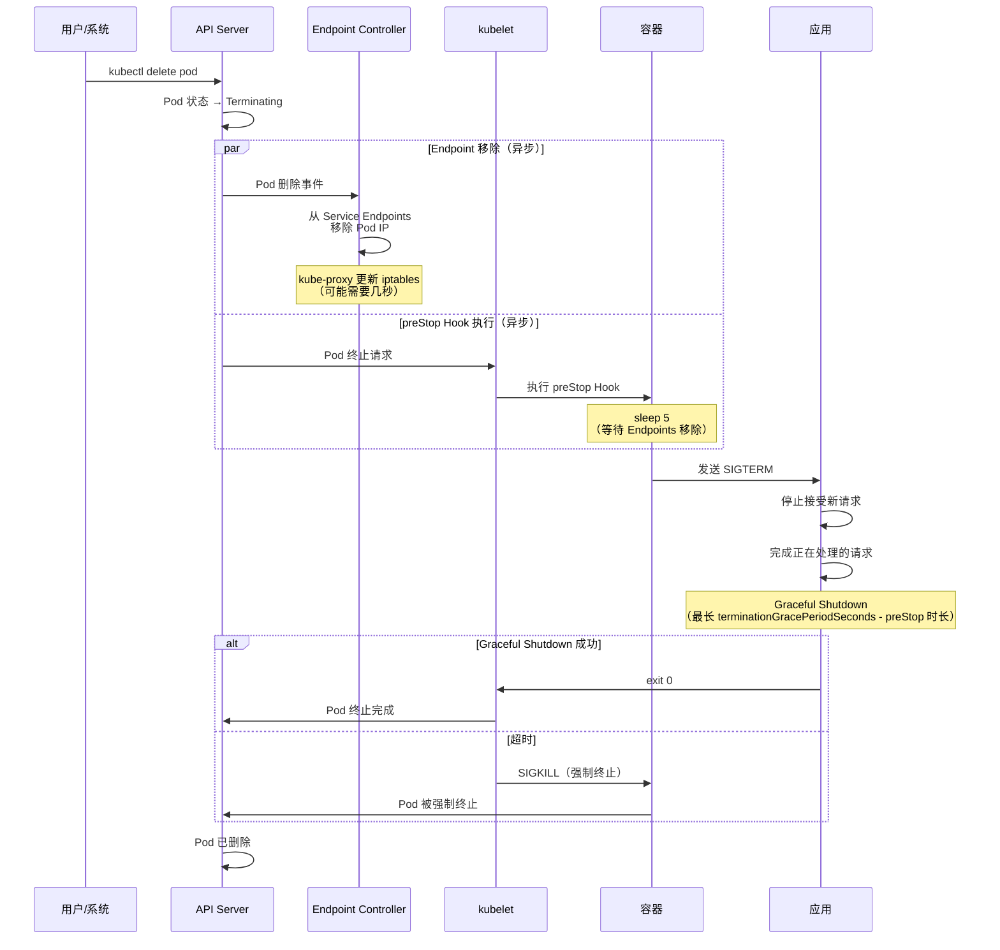

**时间详情：**

1. **T+0s**: 通过 `kubectl delete pod` 或滚动更新请求删除 Pod
2. **T+0s**: API Server 将 Pod 状态更改为 `Terminating`
3. **T+0s**: 两个操作**异步**并行开始：
   - Endpoint Controller 从 Service Endpoints 移除 Pod IP
   - kubelet 执行 preStop Hook
4. **T+0~5s**: preStop Hook 执行 `sleep 5`（等待 Endpoints 移除）
5. **T+5s**: preStop Hook 执行 `kill -TERM 1` → 发送 SIGTERM
6. **T+5s**: 应用接收 SIGTERM，开始 Graceful Shutdown
7. **T+5~60s**: 应用完成正在处理的请求并执行清理任务
8. **T+60s**: 达到 `terminationGracePeriodSeconds` 时发送 SIGKILL（强制终止）

:::tip 为什么需要 preStop sleep
Endpoint 移除和 preStop Hook 执行是**异步**发生的。在 preStop 中添加 5 秒的 sleep 可确保 Endpoint Controller 和 kube-proxy 有时间更新 iptables，使新流量不再路由到正在终止的 Pod。如果没有此模式，流量可能会继续发送到正在终止的 Pod，导致 502/503 错误。
:::

### 3.2 各语言的 SIGTERM 处理模式

#### Node.js (Express)

```javascript
const express = require('express');
const app = express();
const server = app.listen(8080);

// 状态标志
let isShuttingDown = false;

// 健康检查端点
app.get('/healthz', (req, res) => {
  res.status(200).json({ status: 'ok' });
});

app.get('/ready', (req, res) => {
  if (isShuttingDown) {
    return res.status(503).json({ status: 'shutting_down' });
  }
  res.status(200).json({ status: 'ready' });
});

// 业务逻辑
app.get('/api/data', (req, res) => {
  if (isShuttingDown) {
    return res.status(503).send('Service Unavailable');
  }
  // 实际逻辑
  res.json({ data: 'example' });
});

// Graceful Shutdown 处理器
function gracefulShutdown(signal) {
  console.log(`${signal} received, starting graceful shutdown`);
  isShuttingDown = true;

  // 拒绝新连接
  server.close(() => {
    console.log('HTTP server closed');

    // 关闭 DB 连接
    // db.close();

    // 退出进程
    process.exit(0);
  });

  // 设置超时（在 SIGKILL 之前完成）
  setTimeout(() => {
    console.error('Graceful shutdown timeout, forcing exit');
    process.exit(1);
  }, 50000); // terminationGracePeriodSeconds - preStop 时长 - 5s 缓冲
}

// 处理 SIGTERM、SIGINT
process.on('SIGTERM', () => gracefulShutdown('SIGTERM'));
process.on('SIGINT', () => gracefulShutdown('SIGINT'));

console.log('Server started on port 8080');
```

**Deployment 配置：**

```yaml
apiVersion: apps/v1
kind: Deployment
metadata:
  name: nodejs-app
spec:
  replicas: 3
  template:
    spec:
      containers:
      - name: app
        image: myapp/nodejs:v1
        ports:
        - containerPort: 8080
        readinessProbe:
          httpGet:
            path: /ready
            port: 8080
          periodSeconds: 5
        lifecycle:
          preStop:
            exec:
              command: ["/bin/sh", "-c", "sleep 5"]
      terminationGracePeriodSeconds: 60
```

#### Java/Spring Boot

Spring Boot 2.3+ 原生支持 Graceful Shutdown。

**application.yml：**

```yaml
server:
  shutdown: graceful  # 启用 Graceful Shutdown

spring:
  lifecycle:
    timeout-per-shutdown-phase: 50s  # 最大等待时间
management:
  endpoints:
    web:
      exposure:
        include: health
  endpoint:
    health:
      probes:
        enabled: true
  health:
    livenessState:
      enabled: true
    readinessState:
      enabled: true
```

**自定义关闭逻辑（如果需要）：**

```java
import org.springframework.context.event.ContextClosedEvent;
import org.springframework.context.event.EventListener;
import org.springframework.stereotype.Component;

@Component
public class GracefulShutdownListener {

    @EventListener
    public void onApplicationEvent(ContextClosedEvent event) {
        System.out.println("Graceful shutdown initiated");

        // 自定义清理任务
        // 例如，刷新消息队列、等待批处理作业完成
        try {
            // 最多等待 50 秒
            cleanupResources();
        } catch (Exception e) {
            System.err.println("Cleanup error: " + e.getMessage());
        }
    }

    private void cleanupResources() throws InterruptedException {
        // 资源清理逻辑
        Thread.sleep(5000); // 示例：5 秒清理任务
        System.out.println("Cleanup completed");
    }
}
```

**Deployment 配置：**

```yaml
apiVersion: apps/v1
kind: Deployment
metadata:
  name: spring-boot-app
spec:
  replicas: 3
  template:
    spec:
      containers:
      - name: app
        image: myapp/spring-boot:v2.7
        ports:
        - containerPort: 8080
        env:
        - name: JAVA_OPTS
          value: "-Xms1g -Xmx2g"
        readinessProbe:
          httpGet:
            path: /actuator/health/readiness
            port: 8080
          periodSeconds: 5
        lifecycle:
          preStop:
            exec:
              command: ["/bin/sh", "-c", "sleep 5"]
      terminationGracePeriodSeconds: 60
```

#### Go

```go
package main

import (
    "context"
    "fmt"
    "log"
    "net/http"
    "os"
    "os/signal"
    "syscall"
    "time"
)

var isShuttingDown = false

func main() {
    // HTTP 服务器设置
    mux := http.NewServeMux()

    mux.HandleFunc("/healthz", func(w http.ResponseWriter, r *http.Request) {
        w.WriteHeader(http.StatusOK)
        fmt.Fprintln(w, "ok")
    })

    mux.HandleFunc("/ready", func(w http.ResponseWriter, r *http.Request) {
        if isShuttingDown {
            w.WriteHeader(http.StatusServiceUnavailable)
            fmt.Fprintln(w, "shutting down")
            return
        }
        w.WriteHeader(http.StatusOK)
        fmt.Fprintln(w, "ready")
    })

    mux.HandleFunc("/api/data", func(w http.ResponseWriter, r *http.Request) {
        if isShuttingDown {
            w.WriteHeader(http.StatusServiceUnavailable)
            return
        }
        // 业务逻辑
        fmt.Fprintln(w, `{"data":"example"}`)
    })

    server := &http.Server{
        Addr:    ":8080",
        Handler: mux,
    }

    // 在单独的 goroutine 中启动服务器
    go func() {
        log.Println("Server starting on :8080")
        if err := server.ListenAndServe(); err != nil && err != http.ErrServerClosed {
            log.Fatalf("Server error: %v", err)
        }
    }()

    // 等待 SIGTERM/SIGINT
    quit := make(chan os.Signal, 1)
    signal.Notify(quit, syscall.SIGTERM, syscall.SIGINT)
    <-quit

    log.Println("Graceful shutdown initiated")
    isShuttingDown = true

    // 带超时的 Graceful Shutdown
    ctx, cancel := context.WithTimeout(context.Background(), 50*time.Second)
    defer cancel()

    if err := server.Shutdown(ctx); err != nil {
        log.Fatalf("Server forced to shutdown: %v", err)
    }

    log.Println("Server exited gracefully")
}
```

**Deployment 配置：**

```yaml
apiVersion: apps/v1
kind: Deployment
metadata:
  name: go-app
spec:
  replicas: 3
  template:
    spec:
      containers:
      - name: app
        image: myapp/go-app:v1
        ports:
        - containerPort: 8080
        readinessProbe:
          httpGet:
            path: /ready
            port: 8080
          periodSeconds: 5
        lifecycle:
          preStop:
            exec:
              command: ["/bin/sh", "-c", "sleep 5"]
      terminationGracePeriodSeconds: 60
```

#### Python (Flask)

```python
from flask import Flask, jsonify
import signal
import sys
import time
import threading

app = Flask(__name__)
is_shutting_down = False

@app.route('/healthz')
def healthz():
    return jsonify({"status": "ok"}), 200

@app.route('/ready')
def ready():
    if is_shutting_down:
        return jsonify({"status": "shutting_down"}), 503
    return jsonify({"status": "ready"}), 200

@app.route('/api/data')
def api_data():
    if is_shutting_down:
        return jsonify({"error": "service unavailable"}), 503
    return jsonify({"data": "example"}), 200

def graceful_shutdown(signum, frame):
    global is_shutting_down
    print(f"Signal {signum} received, starting graceful shutdown")
    is_shutting_down = True

    # 清理任务（如关闭 DB 连接）
    # db.close()

    print("Graceful shutdown completed")
    sys.exit(0)

# 注册 SIGTERM 处理器
signal.signal(signal.SIGTERM, graceful_shutdown)
signal.signal(signal.SIGINT, graceful_shutdown)

if __name__ == '__main__':
    app.run(host='0.0.0.0', port=8080)
```

**Deployment 配置：**

```yaml
apiVersion: apps/v1
kind: Deployment
metadata:
  name: python-app
spec:
  replicas: 3
  template:
    spec:
      containers:
      - name: app
        image: myapp/python-flask:v1
        ports:
        - containerPort: 8080
        readinessProbe:
          httpGet:
            path: /ready
            port: 8080
          periodSeconds: 5
        lifecycle:
          preStop:
            exec:
              command: ["/bin/sh", "-c", "sleep 5"]
      terminationGracePeriodSeconds: 60
```

### 3.3 Connection Draining 模式

Connection Draining 是一种在关闭期间安全清理现有连接的模式。

#### HTTP Keep-Alive 连接处理

```javascript
// Node.js Express with Connection Draining
const express = require('express');
const app = express();
const server = app.listen(8080);

let isShuttingDown = false;
const activeConnections = new Set();

// 跟踪连接
server.on('connection', (conn) => {
  activeConnections.add(conn);
  conn.on('close', () => {
    activeConnections.delete(conn);
  });
});

function gracefulShutdown(signal) {
  console.log(`${signal} received`);
  isShuttingDown = true;

  // 拒绝新连接
  server.close(() => {
    console.log('Server closed, no new connections');
  });

  // 关闭现有连接
  console.log(`Closing ${activeConnections.size} active connections`);
  activeConnections.forEach((conn) => {
    conn.destroy(); // 强制关闭（或使用 conn.end() 优雅关闭）
  });

  // 清理后退出
  setTimeout(() => {
    console.log('Graceful shutdown complete');
    process.exit(0);
  }, 5000);
}

process.on('SIGTERM', () => gracefulShutdown('SIGTERM'));
```

#### WebSocket 连接清理

```javascript
// WebSocket graceful shutdown
const WebSocket = require('ws');
const wss = new WebSocket.Server({ port: 8080 });

const clients = new Set();

wss.on('connection', (ws) => {
  clients.add(ws);

  ws.on('close', () => {
    clients.delete(ws);
  });

  ws.on('message', (message) => {
    // 处理消息
  });
});

function gracefulShutdown() {
  console.log(`Closing ${clients.size} WebSocket connections`);

  clients.forEach((ws) => {
    // 通知客户端关闭
    ws.send(JSON.stringify({ type: 'server_shutdown' }));
    ws.close(1001, 'Server shutting down');
  });

  wss.close(() => {
    console.log('WebSocket server closed');
    process.exit(0);
  });
}

process.on('SIGTERM', gracefulShutdown);
```

#### gRPC Graceful Shutdown

```go
package main

import (
    "context"
    "log"
    "net"
    "os"
    "os/signal"
    "syscall"
    "time"

    "google.golang.org/grpc"
    pb "myapp/proto"
)

type server struct {
    pb.UnimplementedMyServiceServer
}

func main() {
    lis, err := net.Listen("tcp", ":9090")
    if err != nil {
        log.Fatalf("Failed to listen: %v", err)
    }

    s := grpc.NewServer()
    pb.RegisterMyServiceServer(s, &server{})

    go func() {
        log.Println("gRPC server starting on :9090")
        if err := s.Serve(lis); err != nil {
            log.Fatalf("Failed to serve: %v", err)
        }
    }()

    // 等待 SIGTERM
    quit := make(chan os.Signal, 1)
    signal.Notify(quit, syscall.SIGTERM, syscall.SIGINT)
    <-quit

    log.Println("Graceful shutdown initiated")

    // GracefulStop：等待正在处理的 RPC 完成
    done := make(chan struct{})
    go func() {
        s.GracefulStop()
        close(done)
    }()

    // 处理超时
    select {
    case <-done:
        log.Println("gRPC server stopped gracefully")
    case <-time.After(50 * time.Second):
        log.Println("Graceful stop timeout, forcing stop")
        s.Stop() // 强制停止
    }
}
```

#### 数据库连接池清理

```python
# Python with psycopg2 connection pool
import psycopg2
from psycopg2 import pool
import signal
import sys

# 连接池
db_pool = psycopg2.pool.SimpleConnectionPool(
    minconn=1,
    maxconn=10,
    host='db.example.com',
    database='mydb',
    user='user',
    password='password'
)

def graceful_shutdown(signum, frame):
    print("Closing database connections...")

    # 关闭所有连接
    db_pool.closeall()

    print("Database connections closed")
    sys.exit(0)

signal.signal(signal.SIGTERM, graceful_shutdown)

# 应用逻辑
def query_database():
    conn = db_pool.getconn()
    try:
        cur = conn.cursor()
        cur.execute("SELECT * FROM users")
        return cur.fetchall()
    finally:
        db_pool.putconn(conn)
```

### 3.4 与 Karpenter/Node Drain 的交互

当 Karpenter 进行节点整合或 Spot 实例被终止时，节点上的所有 Pod 必须被安全迁移。

#### Karpenter Disruption 与 Graceful Shutdown

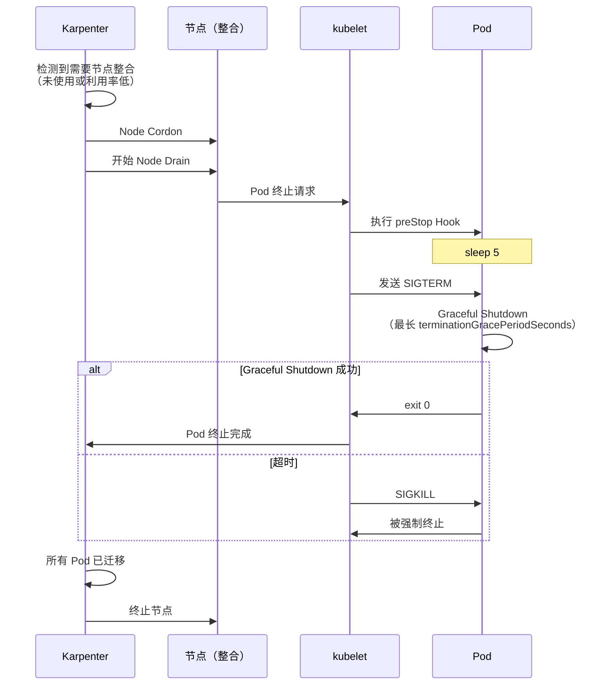

**Karpenter NodePool 配置：**

```yaml
apiVersion: karpenter.sh/v1
kind: NodePool
metadata:
  name: default
spec:
  disruption:
    consolidationPolicy: WhenEmptyOrUnderutilized
    consolidateAfter: 5m
    # Disruption 预算：限制并发节点中断
    budgets:
    - nodes: "20%"
      schedule: "0 9-17 * * MON-FRI"  # 工作时间 20%
    - nodes: "50%"
      schedule: "0 0-8,18-23 * * *"   # 非工作时间 50%
```

:::warning PDB 与 Karpenter 的交互
如果 PodDisruptionBudget 过于严格（例如 `minAvailable` 等于副本数），Karpenter 将无法 Drain 节点。将 PDB 设置为 `minAvailable: replica - 1` 或 `maxUnavailable: 1`，以确保至少一个 Pod 可以被迁移。
:::

#### 3.4.3 ARC + Karpenter 集成 AZ 疏散模式

**概述：**

AWS Application Recovery Controller (ARC) 与 Karpenter 的集成（2025 年发布）提供了一种高可用模式，在可用区 (AZ) 故障期间自动将工作负载迁移到不同的 AZ。这确保了 AZ 故障或灰色故障场景下的 Graceful Shutdown，最大程度减少服务中断。

**什么是 ARC Zonal Shift：**

Zonal Shift 是一种自动将流量从故障或性能降级的 AZ 重定向到其他健康 AZ 的能力。当与 EKS 集成时，它还能自动化 Pod 的安全迁移。

**架构组件：**

| 组件 | 角色 | 行为 |
|-----------|------|----------|
| **ARC Zonal Autoshift** | 自动 AZ 故障检测和流量切换决策 | 基于 CloudWatch Alarms 的自动 Shift |
| **Karpenter** | 在新 AZ 中配置节点 | 基于 NodePool 配置在健康 AZ 中创建节点 |
| **AWS Load Balancer** | 流量路由控制 | 移除故障 AZ 中的 Target |
| **PodDisruptionBudget** | 确保 Pod 迁移期间的可用性 | 维持最小可用 Pod 数 |

**AZ 疏散序列：**

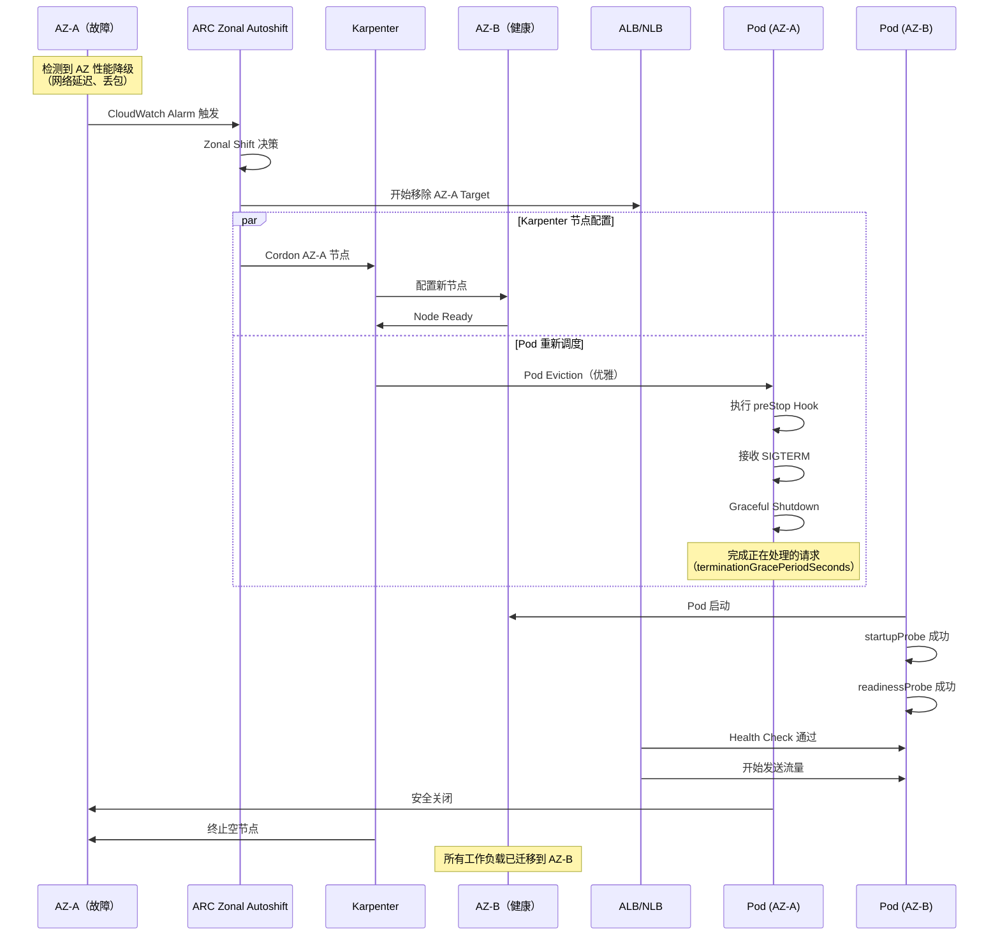

**配置示例：**

**1. 启用 ARC Zonal Autoshift：**

```bash
# 在 Load Balancer 上启用 Zonal Autoshift
aws arc-zonal-shift create-autoshift-observer-notification-configuration \
  --resource-identifier arn:aws:elasticloadbalancing:ap-northeast-2:123456789012:loadbalancer/app/production-alb/1234567890abcdef

# 配置 Zonal Autoshift
aws arc-zonal-shift update-zonal-autoshift-configuration \
  --resource-identifier arn:aws:elasticloadbalancing:ap-northeast-2:123456789012:loadbalancer/app/production-alb/1234567890abcdef \
  --zonal-autoshift-status ENABLED
```

**2. Karpenter NodePool - AZ 感知配置：**

```yaml
apiVersion: karpenter.sh/v1
kind: NodePool
metadata:
  name: default
spec:
  disruption:
    consolidationPolicy: WhenEmptyOrUnderutilized
    consolidateAfter: 30s
    # AZ 故障时快速响应
    budgets:
    - nodes: "100%"
      reasons:
      - "Drifted"  # AZ 被 Cordon 时立即替换
  template:
    spec:
      requirements:
      - key: "topology.kubernetes.io/zone"
        operator: In
        values:
        - ap-northeast-2a
        - ap-northeast-2b
        - ap-northeast-2c
      - key: karpenter.sh/capacity-type
        operator: In
        values:
        - on-demand  # AZ 故障响应推荐使用 On-Demand
      nodeClassRef:
        name: default
---
apiVersion: karpenter.k8s.aws/v1
kind: EC2NodeClass
metadata:
  name: default
spec:
  amiFamily: AL2023
  role: "KarpenterNodeRole-production"
  subnetSelectorTerms:
  - tags:
      karpenter.sh/discovery: "production-eks"
  securityGroupSelectorTerms:
  - tags:
      karpenter.sh/discovery: "production-eks"
  # AZ 故障时自动检测
  metadataOptions:
    httpTokens: required
    httpPutResponseHopLimit: 2
```

**3. 带 PDB 的 Deployment - AZ 分布：**

```yaml
apiVersion: apps/v1
kind: Deployment
metadata:
  name: critical-api
spec:
  replicas: 6
  selector:
    matchLabels:
      app: critical-api
  template:
    metadata:
      labels:
        app: critical-api
    spec:
      # 确保 AZ 分布
      topologySpreadConstraints:
      - maxSkew: 1
        topologyKey: topology.kubernetes.io/zone
        whenUnsatisfiable: DoNotSchedule
        labelSelector:
          matchLabels:
            app: critical-api
      # 防止同节点共置
      affinity:
        podAntiAffinity:
          preferredDuringSchedulingIgnoredDuringExecution:
          - weight: 100
            podAffinityTerm:
              labelSelector:
                matchLabels:
                  app: critical-api
              topologyKey: kubernetes.io/hostname
      containers:
      - name: api
        image: myapp/critical-api:v3
        ports:
        - containerPort: 8080
        resources:
          requests:
            cpu: 500m
            memory: 1Gi
        readinessProbe:
          httpGet:
            path: /ready
            port: 8080
          periodSeconds: 5
          failureThreshold: 2
        livenessProbe:
          httpGet:
            path: /healthz
            port: 8080
          periodSeconds: 10
        lifecycle:
          preStop:
            exec:
              command:
              - /bin/sh
              - -c
              - sleep 5
      terminationGracePeriodSeconds: 60
---
apiVersion: policy/v1
kind: PodDisruptionBudget
metadata:
  name: critical-api-pdb
spec:
  minAvailable: 4  # 6 个中保持至少 4 个（AZ 故障时从 2 个 AZ 运行）
  selector:
    matchLabels:
      app: critical-api
```

**4. CloudWatch Alarm - AZ 性能降级检测：**

```yaml
apiVersion: v1
kind: ConfigMap
metadata:
  name: az-health-monitoring
  namespace: monitoring
data:
  cloudwatch-alarm: |
    {
      "AlarmName": "AZ-A-NetworkLatency-High",
      "MetricName": "NetworkLatency",
      "Namespace": "AWS/EC2",
      "Statistic": "Average",
      "Period": 60,
      "EvaluationPeriods": 3,
      "Threshold": 100,
      "ComparisonOperator": "GreaterThanThreshold",
      "Dimensions": [
        {"Name": "AvailabilityZone", "Value": "ap-northeast-2a"}
      ],
      "AlarmDescription": "AZ-A 网络延迟增加 - Zonal Shift 触发",
      "AlarmActions": [
        "arn:aws:arc-zonal-shift:ap-northeast-2:123456789012:autoshift-observer-notification"
      ]
    }
```

**结合 Istio Service Mesh 的端到端 AZ 恢复：**

与 Istio Service Mesh 集成可在 AZ 疏散期间实现更精细的流量控制：

```yaml
# Istio DestinationRule：基于 AZ 的流量路由
apiVersion: networking.istio.io/v1beta1
kind: DestinationRule
metadata:
  name: critical-api-az-routing
spec:
  host: critical-api.production.svc.cluster.local
  trafficPolicy:
    loadBalancer:
      localityLbSetting:
        enabled: true
        distribute:
        - from: ap-northeast-2a/*
          to:
            "ap-northeast-2b/*": 50
            "ap-northeast-2c/*": 50
        - from: ap-northeast-2b/*
          to:
            "ap-northeast-2a/*": 50
            "ap-northeast-2c/*": 50
        - from: ap-northeast-2c/*
          to:
            "ap-northeast-2a/*": 50
            "ap-northeast-2b/*": 50
    outlierDetection:
      consecutiveErrors: 3
      interval: 10s
      baseEjectionTime: 30s
      maxEjectionPercent: 50
---
# VirtualService：AZ 故障时的自动重路由
apiVersion: networking.istio.io/v1beta1
kind: VirtualService
metadata:
  name: critical-api-failover
spec:
  hosts:
  - critical-api.production.svc.cluster.local
  http:
  - match:
    - sourceLabels:
        topology.kubernetes.io/zone: ap-northeast-2a
    route:
    - destination:
        host: critical-api.production.svc.cluster.local
        subset: az-b
      weight: 50
    - destination:
        host: critical-api.production.svc.cluster.local
        subset: az-c
      weight: 50
    timeout: 3s
    retries:
      attempts: 3
      perTryTimeout: 1s
```

**灰色故障处理策略：**

灰色故障是性能降级而非完全中断的状态，难以检测。可以使用 ARC + Karpenter + Istio 组合来应对：

| 灰色故障症状 | 检测方法 | 自动响应 |
|---------------------|-----------------|-------------------|
| 网络延迟增加（50-200ms） | Container Network Observability | Istio Outlier Detection → 流量绕行 |
| 间歇性丢包（1-5%） | CloudWatch Network Metrics | ARC Zonal Shift 触发 |
| 磁盘 I/O 降级 | EBS CloudWatch Metrics | Karpenter 节点替换 |
| API Server 响应延迟 | Control Plane Metrics | Provisioned Control Plane 自动扩展 |

**测试与验证：**

```bash
# AZ 故障模拟（混沌工程）
kubectl apply -f - <<EOF
apiVersion: v1
kind: ConfigMap
metadata:
  name: az-failure-test
  namespace: chaos
data:
  experiment: |
    # 1. 为 AZ-A 的所有节点添加 Taint（模拟 AZ 故障）
    kubectl taint nodes -l topology.kubernetes.io/zone=ap-northeast-2a \
      az-failure=true:NoSchedule

    # 2. 验证 Karpenter 在 AZ-B、AZ-C 创建新节点
    kubectl get nodes -l topology.kubernetes.io/zone=ap-northeast-2b,ap-northeast-2c

    # 3. 监控 Pod 迁移
    kubectl get pods -o wide --watch

    # 4. 验证 PDB 合规（minAvailable 维持）
    kubectl get pdb critical-api-pdb

    # 5. 检查 Graceful Shutdown 日志
    kubectl logs <pod-name> --previous

    # 6. 恢复（移除 Taint）
    kubectl taint nodes -l topology.kubernetes.io/zone=ap-northeast-2a \
      az-failure-
EOF
```

**监控 Dashboard：**

```yaml
# Grafana Dashboard：AZ 健康和疏散状态
apiVersion: v1
kind: ConfigMap
metadata:
  name: az-failover-dashboard
  namespace: monitoring
data:
  dashboard.json: |
    {
      "panels": [
        {
          "title": "Pod Distribution by AZ",
          "targets": [
            {
              "expr": "count(kube_pod_info) by (node, zone)"
            }
          ]
        },
        {
          "title": "Network Latency by AZ",
          "targets": [
            {
              "expr": "avg(container_network_latency_ms) by (availability_zone)"
            }
          ]
        },
        {
          "title": "Karpenter Node Provisioning Rate",
          "targets": [
            {
              "expr": "rate(karpenter_nodes_created_total[5m])"
            }
          ]
        },
        {
          "title": "Graceful Shutdown Success Rate",
          "targets": [
            {
              "expr": "rate(pod_termination_graceful_total[5m]) / rate(pod_termination_total[5m])"
            }
          ]
        }
      ]
    }
```

**相关资源：**
- [AWS 博客：ARC + Karpenter 高可用集成](https://aws.amazon.com/blogs/containers/enhance-kubernetes-high-availability-with-amazon-application-recovery-controller-and-karpenter-integration/)
- [AWS 博客：基于 Istio 的端到端 AZ 恢复](https://aws.amazon.com/blogs/containers/)
- [AWS re:Invent 2025: Supercharge your Karpenter](https://www.youtube.com/watch?v=kUQ4Q11F4iQ)

:::tip 运维最佳实践
AZ 疏散是自动化的，但需要通过定期的混沌工程测试来验证。至少每季度进行一次 AZ 故障模拟，以验证 PDB、Karpenter 和 Graceful Shutdown 是否按预期工作。特别是在生产环境中测量 `terminationGracePeriodSeconds` 是否足够长于实际关闭时间。
:::

#### Spot 实例 2 分钟预警处理

AWS Spot 实例在终止前提供 2 分钟预警。处理此预警以确保 Graceful Shutdown。

**安装 AWS Node Termination Handler：**

```bash
helm repo add eks https://aws.github.io/eks-charts
helm repo update

helm install aws-node-termination-handler \
  --namespace kube-system \
  eks/aws-node-termination-handler \
  --set enableSpotInterruptionDraining=true \
  --set enableScheduledEventDraining=true
```

**工作原理：**
1. 检测 2 分钟 Spot 终止预警
2. 立即 Cordon 节点（阻止新 Pod 调度）
3. Drain 节点上的所有 Pod
4. 在 Pod 的 `terminationGracePeriodSeconds` 内完成 Graceful Shutdown

**建议的 terminationGracePeriodSeconds：**
- 一般 Web 服务：30-60 秒
- 长时间运行的任务（批处理、ML 推理）：90-120 秒
- 最大设置为 2 分钟以内（考虑 Spot 预警时间）

---
### 3.4.4 Node Readiness Controller -- 节点级就绪管理

#### 概述

Node Readiness Controller (NRC) 是 2026 年 2 月在 Kubernetes 官方博客上发布的 alpha 特性（v0.1.1）。它是一种用于声明式管理节点级基础设施就绪状态的新机制。

现有的 Kubernetes 节点 `Ready` 条件仅提供简单的二元状态（Ready/NotReady），无法准确反映 CNI 插件初始化、GPU 驱动加载和存储驱动就绪等复杂的基础设施依赖。NRC 通过提供 `NodeReadinessRule` CRD 来解决这些限制，允许声明式定义自定义就绪门控。

**核心价值：**
- **细粒度节点状态控制**: 按基础设施组件独立管理就绪状态
- **自动化 Taint 管理**: 条件不满足时自动应用 NoSchedule Taint
- **灵活的监控模式**: 支持仅引导、持续监控和 dry-run 模式
- **选择性应用**: 使用 nodeSelector 仅将规则应用于特定节点组

**API 信息：**
- API Group: `readiness.node.x-k8s.io/v1alpha1`
- Kind: `NodeReadinessRule`
- 官方文档: https://node-readiness-controller.sigs.k8s.io/

#### 核心特性

##### 1. Continuous 模式 - 持续监控

在整个节点生命周期中持续监控指定条件。如果基础设施组件在运行时故障（如 GPU 驱动崩溃），会立即应用 Taint 以阻止新的 Pod 调度。

**使用场景：**
- GPU 驱动状态监控
- 网络插件持续健康检查
- 存储驱动可用性验证

##### 2. Bootstrap-only 模式 - 仅初始化

仅在节点初始化阶段检查条件，条件满足后停止监控。引导完成后，不再对条件变化做出反应。

**使用场景：**
- CNI 插件初始引导
- 容器镜像预拉取完成验证
- 等待初始安全扫描完成

##### 3. Dry-run 模式 - 安全验证

模拟规则行为但不实际应用 Taint。适用于在生产部署前验证规则。

**使用场景：**
- 测试新的 NodeReadinessRule
- 分析条件变化的影响
- 调试和问题诊断

##### 4. nodeSelector - 目标节点选择

基于标签仅将规则应用于特定节点组。可以对 GPU 节点和通用节点应用不同的就绪规则。

#### YAML 示例

##### CNI 引导 - Bootstrap-only 模式

```yaml
apiVersion: readiness.node.x-k8s.io/v1alpha1
kind: NodeReadinessRule
metadata:
  name: network-readiness-rule
  namespace: kube-system
spec:
  # 要检查的节点条件
  conditions:
    - type: "cniplugin.example.net/NetworkReady"
      requiredStatus: "True"

  # 条件不满足时应用的 Taint
  taint:
    key: "readiness.k8s.io/acme.com/network-unavailable"
    effect: "NoSchedule"
    value: "pending"

  # 引导完成后停止监控
  enforcementMode: "bootstrap-only"

  # 仅应用于 Worker 节点
  nodeSelector:
    matchLabels:
      node-role.kubernetes.io/worker: ""
```

**行为流程：**
1. 新节点加入集群时，NRC 自动应用 Taint
2. CNI 插件完成初始化后，设置 `NetworkReady=True` 条件
3. NRC 验证条件并移除 Taint
4. Pod 调度变为可用（后续 CNI 状态变化被忽略）

##### GPU 节点持续监控

```yaml
apiVersion: readiness.node.x-k8s.io/v1alpha1
kind: NodeReadinessRule
metadata:
  name: gpu-driver-readiness
  namespace: kube-system
spec:
  conditions:
    - type: "nvidia.com/gpu-driver-ready"
      requiredStatus: "True"

  taint:
    key: "readiness.k8s.io/gpu-unavailable"
    effect: "NoSchedule"
    value: "driver-not-ready"

  # 运行时持续监控
  enforcementMode: "continuous"

  # 仅应用于 GPU 节点
  nodeSelector:
    matchLabels:
      nvidia.com/gpu.present: "true"
```

**行为流程：**
1. GPU 节点启动时自动应用 Taint
2. NVIDIA 驱动守护进程在 GPU 初始化完成后设置条件
3. NRC 移除 Taint，启用 AI 工作负载调度
4. **如果运行时发生驱动崩溃：**
   - 条件变为 `False`
   - NRC 立即重新应用 Taint
   - 现有 Pod 保持运行，但新 Pod 调度被阻止

##### EBS CSI 驱动就绪检查

```yaml
apiVersion: readiness.node.x-k8s.io/v1alpha1
kind: NodeReadinessRule
metadata:
  name: ebs-csi-readiness
  namespace: kube-system
spec:
  conditions:
    - type: "ebs.csi.aws.com/VolumeAttachReady"
      requiredStatus: "True"

  taint:
    key: "readiness.k8s.io/storage-unavailable"
    effect: "NoSchedule"
    value: "csi-not-ready"

  enforcementMode: "bootstrap-only"

  # 仅应用于存储工作负载专用节点
  nodeSelector:
    matchLabels:
      workload-type: "stateful"
```

##### Dry-run 模式 - 测试规则

```yaml
apiVersion: readiness.node.x-k8s.io/v1alpha1
kind: NodeReadinessRule
metadata:
  name: test-custom-condition
  namespace: kube-system
spec:
  conditions:
    - type: "example.com/CustomHealthCheck"
      requiredStatus: "True"

  taint:
    key: "readiness.k8s.io/test-condition"
    effect: "NoSchedule"
    value: "testing"

  # 仅记录行为，不实际应用 Taint
  enforcementMode: "dry-run"

  nodeSelector:
    matchLabels:
      environment: "staging"
```

#### EKS 应用场景

##### 1. VPC CNI 初始化等待

**问题：**
如果在节点加入集群后、VPC CNI 插件完全初始化之前就调度 Pod，会发生网络连接故障。

**解决方案：**
```yaml
apiVersion: readiness.node.x-k8s.io/v1alpha1
kind: NodeReadinessRule
metadata:
  name: vpc-cni-readiness
  namespace: kube-system
spec:
  conditions:
    - type: "vpc.amazonaws.com/CNIReady"
      requiredStatus: "True"
  taint:
    key: "node.eks.amazonaws.com/network-unavailable"
    effect: "NoSchedule"
    value: "vpc-cni-initializing"
  enforcementMode: "bootstrap-only"
```

**在 VPC CNI DaemonSet 中设置条件：**
```yaml
# aws-node DaemonSet 中的 Init 容器
initContainers:
- name: set-node-condition
  image: bitnami/kubectl:latest
  command:
  - /bin/sh
  - -c
  - |
    # 等待 CNI 初始化
    until [ -f /host/etc/cni/net.d/10-aws.conflist ]; do
      echo "Waiting for CNI config..."
      sleep 2
    done

    # 设置 Node Condition
    kubectl patch node $NODE_NAME --type=json -p='[
      {
        "op": "add",
        "path": "/status/conditions/-",
        "value": {
          "type": "vpc.amazonaws.com/CNIReady",
          "status": "True",
          "lastTransitionTime": "'$(date -u +"%Y-%m-%dT%H:%M:%SZ")'",
          "reason": "CNIInitialized",
          "message": "VPC CNI is ready"
        }
      }
    ]'
  env:
  - name: NODE_NAME
    valueFrom:
      fieldRef:
        fieldPath: spec.nodeName
```

##### 2. GPU 节点 NVIDIA 驱动就绪

**问题：**
如果在 NVIDIA 驱动加载完成之前调度 GPU 工作负载，CUDA 初始化失败，Pod 进入 CrashLoopBackOff 状态。

**解决方案：**
```yaml
apiVersion: readiness.node.x-k8s.io/v1alpha1
kind: NodeReadinessRule
metadata:
  name: nvidia-gpu-readiness
  namespace: kube-system
spec:
  conditions:
    - type: "nvidia.com/gpu-driver-ready"
      requiredStatus: "True"
    - type: "nvidia.com/gpu-device-plugin-ready"
      requiredStatus: "True"
  taint:
    key: "nvidia.com/gpu-not-ready"
    effect: "NoSchedule"
    value: "driver-loading"
  enforcementMode: "continuous"
  nodeSelector:
    matchLabels:
      node.kubernetes.io/instance-type: "g5.xlarge"
```

**在 NVIDIA Device Plugin 中设置条件：**
```go
// NVIDIA Device Plugin 中的健康检查逻辑
func updateNodeCondition(nodeName string) error {
    // 检查 GPU 驱动状态
    version, err := nvml.SystemGetDriverVersion()
    if err != nil {
        return setCondition(nodeName, "nvidia.com/gpu-driver-ready", "False")
    }

    // 检查 Device Plugin 状态
    devices, err := nvml.DeviceGetCount()
    if err != nil || devices == 0 {
        return setCondition(nodeName, "nvidia.com/gpu-device-plugin-ready", "False")
    }

    // 一切正常则设置为 True
    setCondition(nodeName, "nvidia.com/gpu-driver-ready", "True")
    setCondition(nodeName, "nvidia.com/gpu-device-plugin-ready", "True")
    return nil
}
```

##### 3. Node Problem Detector 集成

**问题：**
即使节点上发生硬件错误、内核死锁或网络问题，Kubernetes 也不会自动阻止 Pod 调度。

**解决方案：**
```yaml
apiVersion: readiness.node.x-k8s.io/v1alpha1
kind: NodeReadinessRule
metadata:
  name: node-problem-detector-readiness
  namespace: kube-system
spec:
  conditions:
    - type: "KernelDeadlock"
      requiredStatus: "False"  # False 表示健康
    - type: "DiskPressure"
      requiredStatus: "False"
    - type: "NetworkUnavailable"
      requiredStatus: "False"
  taint:
    key: "node.kubernetes.io/problem-detected"
    effect: "NoSchedule"
    value: "true"
  enforcementMode: "continuous"
```

#### 工作流图

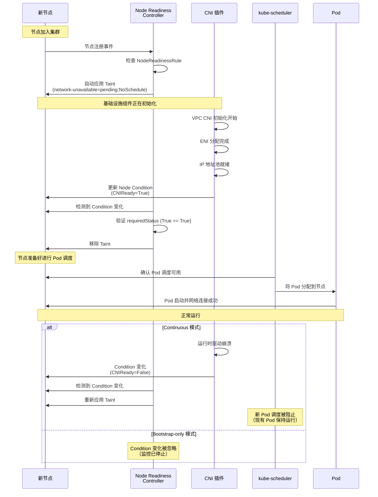

#### 与 Pod Readiness 的关系

Kubernetes Readiness 机制现在形成了完整的 3 层结构：

| 层级 | 机制 | 范围 | 失败行为 | 使用场景 |
|-------|-----------|-------|-----------------|----------|
| **1. 容器** | Readiness Probe | 容器内部健康检查 | 从 Service Endpoint 移除 | 验证应用就绪 |
| **2. Pod** | Readiness Gate | Pod 级别外部条件 | 从 Service Endpoint 移除 | ALB/NLB 健康检查集成 |
| **3. 节点** | Node Readiness Controller | 节点基础设施条件 | 阻止 Pod 调度（Taint） | CNI、GPU、存储就绪验证 |

**集成场景 - 完整的流量安全：**

```yaml
apiVersion: apps/v1
kind: Deployment
metadata:
  name: critical-service
spec:
  replicas: 3
  template:
    spec:
      # 应用 3 层 Readiness
      containers:
      - name: app
        image: myapp:v2
        # 第 1 层：容器 Readiness Probe
        readinessProbe:
          httpGet:
            path: /ready
            port: 8080
          periodSeconds: 5
          failureThreshold: 2

      # 第 2 层：Pod Readiness Gate
      readinessGates:
      - conditionType: "target-health.alb.ingress.k8s.aws/production-alb"

      # 第 3 层：Node Readiness（由 NodeReadinessRule 自动处理）
      # - 检查节点上的 CNI、GPU、存储就绪状态
      # - Pod 仅调度到没有 Taint 的节点
```

**流量接收检查清单：**

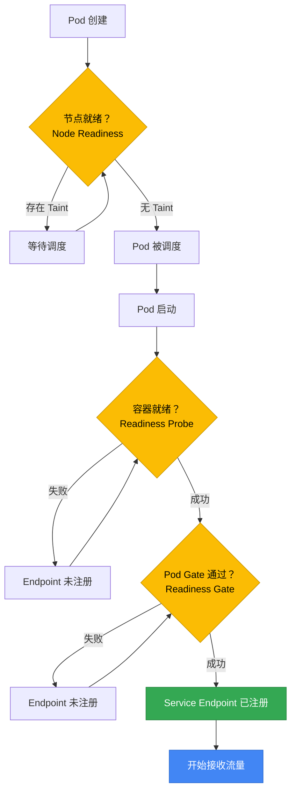

#### 安装和配置

##### 1. 安装 Node Readiness Controller

```bash
# 通过 Helm 安装
helm repo add node-readiness-controller https://node-readiness-controller.sigs.k8s.io
helm repo update

helm install node-readiness-controller \
  node-readiness-controller/node-readiness-controller \
  --namespace kube-system \
  --create-namespace

# 或通过 Kustomize 安装
kubectl apply -k https://github.com/kubernetes-sigs/node-readiness-controller/config/default
```

##### 2. 验证安装

```bash
# 检查 Controller Pod 状态
kubectl get pods -n kube-system -l app=node-readiness-controller

# 验证 CRD
kubectl get crd nodereadinessrules.readiness.node.x-k8s.io

# 应用示例规则
kubectl apply -f https://raw.githubusercontent.com/kubernetes-sigs/node-readiness-controller/main/examples/basic-rule.yaml

# 列出规则
kubectl get nodereadinessrules -A
```

##### 3. 验证节点状态

```bash
# 检查特定节点的 Condition
kubectl get node <node-name> -o jsonpath='{.status.conditions}' | jq

# 过滤特定 Condition
kubectl get node <node-name> -o jsonpath='{.status.conditions[?(@.type=="CNIReady")]}' | jq

# 检查所有节点的 Taint
kubectl get nodes -o custom-columns=NAME:.metadata.name,TAINTS:.spec.taints
```

#### 调试与故障排查

##### Taint 未被移除时

```bash
# 1. 检查 NodeReadinessRule 事件
kubectl describe nodereadinessrule <rule-name> -n kube-system

# 2. 检查节点 Condition 状态
kubectl get node <node-name> -o yaml | grep -A 10 conditions

# 3. 检查 Controller 日志
kubectl logs -n kube-system -l app=node-readiness-controller --tail=100

# 4. 手动设置 Condition（用于测试）
kubectl patch node <node-name> --type=json -p='[
  {
    "op": "add",
    "path": "/status/conditions/-",
    "value": {
      "type": "CNIReady",
      "status": "True",
      "lastTransitionTime": "'$(date -u +"%Y-%m-%dT%H:%M:%SZ")'",
      "reason": "ManualSet",
      "message": "Manually set for testing"
    }
  }
]'
```

##### 使用 Dry-run 模式测试规则

```bash
# 将现有规则更改为 dry-run
kubectl patch nodereadinessrule <rule-name> -n kube-system \
  --type=merge \
  -p '{"spec":{"enforcementMode":"dry-run"}}'

# 在 Controller 日志中验证行为
kubectl logs -n kube-system -l app=node-readiness-controller -f | grep "dry-run"

# 测试后恢复原始模式
kubectl patch nodereadinessrule <rule-name> -n kube-system \
  --type=merge \
  -p '{"spec":{"enforcementMode":"continuous"}}'
```

:::info Alpha 特性提醒
Node Readiness Controller 目前处于 v0.1.1 alpha 阶段。在应用到生产环境之前：
- 在 Staging 环境中进行充分测试
- 使用 dry-run 模式验证规则行为
- 设置 Controller 日志监控
- 准备在出现问题时手动移除 Taint 的程序
:::

:::tip 运维最佳实践
1. **优先使用 bootstrap-only**: 大多数情况下 bootstrap-only 模式就足够了。仅对运行时频繁故障的组件（如 GPU 驱动）使用 continuous 模式。
2. **积极使用 nodeSelector**: 不要将相同规则应用于所有节点；而是按工作负载类型进行细分。
3. **与 Node Problem Detector 集成**: 将 NRC 与 NPD 结合使用，可以自动响应硬件/OS 级别的问题。
4. **监控和告警**: 在 CloudWatch 或 Prometheus 中收集 Taint 应用/移除事件，并在 Taint 持续时间过长时配置告警。
:::

:::warning 注意 PDB 冲突
当 Node Readiness Controller 应用 Taint 时，不会在该节点上创建新的 Pod。如果同时对多个节点应用 Taint 且 PodDisruptionBudget 配置过于严格，可能会阻止整个集群的工作负载分配。请将 PDB 策略与规则设计一起审查。
:::

#### 参考资料

- **官方文档**: [Node Readiness Controller](https://node-readiness-controller.sigs.k8s.io/)
- **Kubernetes 博客**: [Introducing Node Readiness Controller](https://kubernetes.io/blog/2026/02/03/introducing-node-readiness-controller/)
- **GitHub 仓库**: [kubernetes-sigs/node-readiness-controller](https://github.com/kubernetes-sigs/node-readiness-controller)

---

### 3.5 Fargate Pod 生命周期特殊注意事项

AWS Fargate 是一种无服务器计算引擎，无需节点管理即可运行 Pod。Fargate Pod 与基于 EC2 的 Pod 相比具有不同的生命周期特征。

#### Fargate vs EC2 vs Auto Mode 架构比较

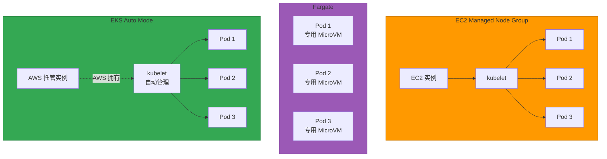

#### Fargate Pod OS 补丁自动驱逐

Fargate 会定期自动驱逐 Pod 以进行安全补丁。

**工作原理：**

1. **补丁可用性检测**: AWS 检测到新的 OS/运行时补丁
2. **优雅驱逐**: Fargate 向 Pod 发送 SIGTERM → 在 `terminationGracePeriodSeconds` 内等待关闭
3. **强制终止**: 超时后发送 SIGKILL
4. **重新调度**: Kubernetes 重新调度到新的 Fargate Pod（使用更新后的运行时）

**关键特征：**

- **不可预测的时间**: 用户无法控制（AWS 管理）
- **无提前通知**: 与 EC2 Scheduled Events 不同，没有预先警告
- **自动重启**: 尊重 PodDisruptionBudget (PDB)，但安全补丁具有更高优先级

**缓解策略：**

```yaml
apiVersion: apps/v1
kind: Deployment
metadata:
  name: fargate-app
  namespace: fargate-namespace
spec:
  replicas: 3  # 建议至少 3 个（应对自动驱逐）
  selector:
    matchLabels:
      app: fargate-app
  template:
    metadata:
      labels:
        app: fargate-app
    spec:
      containers:
      - name: app
        image: myapp:v1
        resources:
          requests:
            cpu: 500m
            memory: 1Gi
        startupProbe:
          httpGet:
            path: /healthz
            port: 8080
          failureThreshold: 10
          periodSeconds: 5
        readinessProbe:
          httpGet:
            path: /ready
            port: 8080
          periodSeconds: 5
        livenessProbe:
          httpGet:
            path: /healthz
            port: 8080
          periodSeconds: 10
        lifecycle:
          preStop:
            exec:
              command:
              - /bin/sh
              - -c
              - sleep 10  # Fargate 驱逐时等待更长时间
      # Fargate 启动时间可能更长
      terminationGracePeriodSeconds: 60
---
# PDB 限制并发驱逐（尽力而为；安全补丁可能忽略）
apiVersion: policy/v1
kind: PodDisruptionBudget
metadata:
  name: fargate-app-pdb
  namespace: fargate-namespace
spec:
  minAvailable: 2
  selector:
    matchLabels:
      app: fargate-app
```

:::warning Fargate PDB 限制
Fargate 仅以**尽力而为**的方式尊重 PDB。对于关键安全补丁，可能会忽略 PDB 并强制驱逐。因此，在 Fargate 环境中，请确保使用**至少 3 个副本**实现高可用性。
:::

#### Fargate Pod 启动时间特征

Fargate Pod 的启动时间比基于 EC2 的 Pod 更长。

| 阶段 | EC2（Managed Node） | Fargate | 原因 |
|-------|-------------------|---------|--------|
| **节点配置** | 0s（已在运行） | 20-40s | MicroVM 创建 + ENI 附加 |
| **镜像拉取** | 5-30s | 10-60s | 无层缓存（首次运行时） |
| **容器启动** | 1-5s | 1-5s | 相同 |
| **总启动时间** | 6-35s | 31-105s | Fargate 额外开销 |

**Startup Probe 调整示例：**

```yaml
# EC2 Pod
startupProbe:
  httpGet:
    path: /healthz
    port: 8080
  failureThreshold: 6   # 6 x 5s = 30s
  periodSeconds: 5

# Fargate Pod（允许更长时间）
startupProbe:
  httpGet:
    path: /healthz
    port: 8080
  failureThreshold: 20  # 20 x 5s = 100s
  periodSeconds: 5
```

**镜像拉取优化（Fargate）：**

```yaml
apiVersion: v1
kind: Pod
metadata:
  name: fargate-pod
  namespace: fargate-namespace
spec:
  containers:
  - name: app
    image: 123456789012.dkr.ecr.us-east-1.amazonaws.com/myapp:v1
    imagePullPolicy: IfNotPresent  # 建议 IfNotPresent 而非 Always
  imagePullSecrets:
  - name: ecr-secret
```

:::tip Fargate 镜像缓存
Fargate 在重复使用相同镜像时会进行层缓存，但**缓存在 Pod 被驱逐时会丢失**。使用 ECR Image Scanning 和 Image Replication 来减少镜像拉取时间。
:::

#### 由于 Fargate DaemonSet 限制的 Sidecar 模式

Fargate 不支持 DaemonSet，因此在需要节点级代理时必须使用 Sidecar 模式。

**EC2 vs Fargate 监控模式比较：**

| 功能 | EC2（DaemonSet） | Fargate（Sidecar） |
|---------|----------------|-------------------|
| **日志收集** | Fluent Bit DaemonSet | Fluent Bit Sidecar + FireLens |
| **指标收集** | CloudWatch Agent DaemonSet | CloudWatch Agent Sidecar |
| **安全扫描** | Falco DaemonSet | Fargate 由 AWS 管理（用户无法控制） |
| **网络策略** | Calico/Cilium DaemonSet | 不支持 NetworkPolicy（使用 Security Groups for Pods） |

**Fargate 日志模式（FireLens）：**

```yaml
apiVersion: apps/v1
kind: Deployment
metadata:
  name: fargate-logging-app
  namespace: fargate-namespace
spec:
  replicas: 2
  selector:
    matchLabels:
      app: logging-app
  template:
    metadata:
      labels:
        app: logging-app
    spec:
      containers:
      # 主应用
      - name: app
        image: myapp:v1
        ports:
        - containerPort: 8080
        resources:
          requests:
            cpu: 500m
            memory: 512Mi
      # FireLens 日志路由器（sidecar）
      - name: log-router
        image: public.ecr.aws/aws-observability/aws-for-fluent-bit:stable
        resources:
          requests:
            cpu: 100m
            memory: 128Mi
          limits:
            cpu: 200m
            memory: 256Mi
        env:
        - name: FLB_LOG_LEVEL
          value: "info"
        firelensConfiguration:
          type: fluentbit
          options:
            enable-ecs-log-metadata: "true"
```

:::info Fargate 上的 CloudWatch Container Insights
Fargate **原生支持** CloudWatch Container Insights，无需单独的 Sidecar 即可自动收集指标。创建 Fargate Profile 时自动启用。

```bash
aws eks create-fargate-profile \
  --cluster-name my-cluster \
  --fargate-profile-name my-profile \
  --pod-execution-role-arn arn:aws:iam::123456789012:role/FargatePodExecutionRole \
  --selectors namespace=fargate-namespace \
  --tags 'EnableContainerInsights=enabled'
```
:::

#### Fargate Graceful Shutdown 时间建议

由于自动驱逐和较长的启动时间，Fargate 需要与 EC2 不同的 Graceful Shutdown 策略。

| 场景 | terminationGracePeriodSeconds | preStop sleep | 原因 |
|----------|------------------------------|---------------|--------|
| **EC2 Pod** | 30-60s | 5s | 等待 Endpoints 移除 |
| **Fargate Pod（一般）** | 60-90s | 10-15s | 较长的网络传播时间 |
| **Fargate + ALB** | 90-120s | 15-20s | 考虑 ALB 注销延迟 |
| **Fargate 长时间运行任务** | 120-300s | 10s | 允许批处理作业完成 |

**Fargate 优化示例：**

```yaml
apiVersion: apps/v1
kind: Deployment
metadata:
  name: fargate-web-app
  namespace: fargate-namespace
spec:
  replicas: 3
  selector:
    matchLabels:
      app: web-app
  template:
    metadata:
      labels:
        app: web-app
    spec:
      containers:
      - name: app
        image: myapp:v1
        ports:
        - containerPort: 8080
        readinessProbe:
          httpGet:
            path: /ready
            port: 8080
          periodSeconds: 5
          failureThreshold: 3
          successThreshold: 1
        lifecycle:
          preStop:
            exec:
              command:
              - /bin/sh
              - -c
              - |
                # Fargate 网络传播可能较慢
                echo "PreStop: Waiting for network propagation..."
                sleep 15

                # Readiness 失败信号（可选）
                # curl -X POST http://localhost:8080/shutdown

                echo "PreStop: Graceful shutdown initiated"
      terminationGracePeriodSeconds: 90  # EC2 使用 60s，Fargate 使用 90s
```

#### Fargate vs EC2 vs Auto Mode 比较：Probe 视角

| 项目 | EC2 Managed Node Group | Fargate | EKS Auto Mode |
|------|------------------------|---------|---------------|
| **节点管理** | 用户管理 | AWS 管理 | AWS 管理 |
| **Pod 密度** | 高（多个 Pod/节点） | 低（1 Pod = 1 MicroVM） | 中等（AWS 优化） |
| **启动时间** | 快（5-35s） | 慢（30-105s） | 快（10-40s） |
| **Startup Probe failureThreshold** | 6-10 | 15-20 | 8-12 |
| **terminationGracePeriodSeconds** | 30-60s | 60-120s | 30-60s |
| **preStop sleep** | 5s | 10-15s | 5-10s |
| **自动 OS 补丁** | 手动（AMI 更新） | 自动（不可预测的驱逐） | 自动（计划性驱逐） |
| **PDB 支持** | 完全支持 | 有限（尽力而为） | 完全支持 |
| **DaemonSet 支持** | 完全支持 | 不支持（需要 Sidecar） | 有限（AWS 管理） |
| **成本模型** | 按实例（始终运行） | 按 Pod（仅运行时） | 按 Pod（优化） |
| **Spot 支持** | 完全支持（Termination Handler） | Fargate Spot 有限 | 自动优化 |
| **网络策略** | Calico/Cilium 支持 | 仅 Security Groups for Pods | AWS 管理的网络策略 |

**选择指南：**

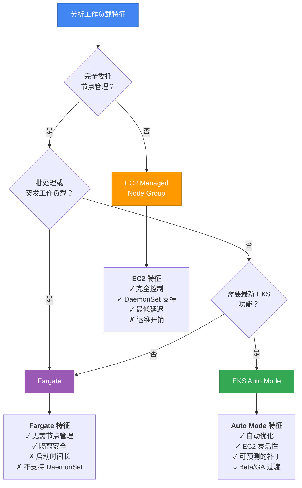

:::tip Fargate 生产检查清单
- [ ] **副本数**: 至少 3 个（应对自动驱逐）
- [ ] **Startup Probe**: 将 failureThreshold 设置为 15-20（考虑较长的启动时间）
- [ ] **terminationGracePeriodSeconds**: 设置为 60-120 秒
- [ ] **preStop sleep**: 设置为 10-15 秒（等待网络传播）
- [ ] **PDB**: 配置 minAvailable（尽力而为但推荐）
- [ ] **镜像优化**: 使用 ECR，最小化层数
- [ ] **日志**: FireLens Sidecar 或 CloudWatch Logs 集成
- [ ] **监控**: 启用 CloudWatch Container Insights
- [ ] **成本优化**: 考虑 Fargate Spot（适用于容错工作负载）
:::

:::info 参考资料
- [AWS Fargate on EKS 官方文档](https://docs.aws.amazon.com/eks/latest/userguide/fargate.html)
- [Fargate Pod 补丁和安全更新](https://docs.aws.amazon.com/eks/latest/userguide/fargate-pod-patching.html)
- [EKS Auto Mode 概述](https://aws.amazon.com/blogs/aws/streamline-kubernetes-cluster-management-with-new-amazon-eks-auto-mode/)
- [Fargate vs EC2 比较指南](https://aws.amazon.com/blogs/containers/)
:::

---


## 4. Init Container 最佳实践

Init Container 在主容器启动之前运行，执行初始化任务。

### 4.1 Init Container 工作原理

- Init Container **按顺序**执行（不支持并发执行）
- 每个 Init Container 必须成功退出后，下一个 Init Container 才会启动
- 所有 Init Container 必须完成后，主容器才会启动
- 如果 Init Container 失败，将根据 Pod 的 `restartPolicy` 重新启动

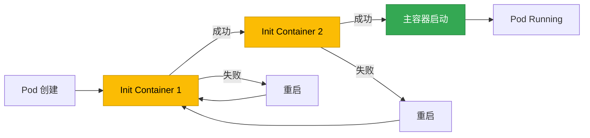

### 4.2 Init Container 使用场景

#### 场景 1：数据库迁移

```yaml
apiVersion: apps/v1
kind: Deployment
metadata:
  name: web-app
spec:
  replicas: 3
  template:
    spec:
      # Init Container: 数据库迁移
      initContainers:
      - name: db-migration
        image: myapp/migrator:v1
        command:
        - /bin/sh
        - -c
        - |
          echo "Running database migrations..."
          /app/migrate up
          echo "Migrations completed"
        env:
        - name: DATABASE_URL
          valueFrom:
            secretKeyRef:
              name: db-secret
              key: url
      # 主应用程序
      containers:
      - name: app
        image: myapp/web-app:v1
        ports:
        - containerPort: 8080
```

#### 场景 2：配置文件生成（ConfigMap 转换）

```yaml
apiVersion: v1
kind: ConfigMap
metadata:
  name: app-config-template
data:
  config.template: |
    server:
      port: {{ PORT }}
      host: {{ HOST }}
    database:
      url: {{ DB_URL }}
---
apiVersion: apps/v1
kind: Deployment
metadata:
  name: app-with-config
spec:
  template:
    spec:
      initContainers:
      - name: config-generator
        image: busybox
        command:
        - /bin/sh
        - -c
        - |
          # 从模板生成实际配置文件
          sed -e "s/{{ PORT }}/$PORT/g" \
              -e "s/{{ HOST }}/$HOST/g" \
              -e "s|{{ DB_URL }}|$DB_URL|g" \
              /config-template/config.template > /config/config.yaml
          echo "Config file generated"
          cat /config/config.yaml
        env:
        - name: PORT
          value: "8080"
        - name: HOST
          value: "0.0.0.0"
        - name: DB_URL
          valueFrom:
            secretKeyRef:
              name: db-secret
              key: url
        volumeMounts:
        - name: config-template
          mountPath: /config-template
        - name: config
          mountPath: /config
      containers:
      - name: app
        image: myapp/app:v1
        volumeMounts:
        - name: config
          mountPath: /app/config
      volumes:
      - name: config-template
        configMap:
          name: app-config-template
      - name: config
        emptyDir: {}
```

#### 场景 3：等待依赖服务就绪

```yaml
apiVersion: apps/v1
kind: Deployment
metadata:
  name: backend-api
spec:
  template:
    spec:
      initContainers:
      # Init Container 1: 等待数据库连接
      - name: wait-for-db
        image: busybox
        command:
        - /bin/sh
        - -c
        - |
          echo "Waiting for database..."
          until nc -z postgres-service 5432; do
            echo "Database not ready, sleeping..."
            sleep 2
          done
          echo "Database is ready"
      # Init Container 2: 等待 Redis 连接
      - name: wait-for-redis
        image: busybox
        command:
        - /bin/sh
        - -c
        - |
          echo "Waiting for Redis..."
          until nc -z redis-service 6379; do
            echo "Redis not ready, sleeping..."
            sleep 2
          done
          echo "Redis is ready"
      containers:
      - name: api
        image: myapp/backend-api:v1
        ports:
        - containerPort: 8080
```

:::tip 更好的替代方案：readinessProbe
等待依赖服务就绪通过主容器的 Readiness Probe 处理比使用 Init Container 更加灵活。由于 Init Container 只运行一次，如果主容器运行期间依赖服务宕机，它无法做出响应。
:::

#### 场景 4：Volume 权限设置

```yaml
apiVersion: apps/v1
kind: Deployment
metadata:
  name: app-with-volume
spec:
  template:
    spec:
      securityContext:
        fsGroup: 1000
      initContainers:
      - name: volume-permissions
        image: busybox
        command:
        - /bin/sh
        - -c
        - |
          echo "Setting up volume permissions..."
          chown -R 1000:1000 /data
          chmod -R 755 /data
          echo "Permissions set"
        volumeMounts:
        - name: data
          mountPath: /data
        securityContext:
          runAsUser: 0  # 以 root 运行（用于权限变更）
      containers:
      - name: app
        image: myapp/app:v1
        securityContext:
          runAsUser: 1000
          runAsNonRoot: true
        volumeMounts:
        - name: data
          mountPath: /app/data
      volumes:
      - name: data
        persistentVolumeClaim:
          claimName: app-data-pvc
```

### 4.3 Init Container 与 Sidecar Container 对比（Kubernetes 1.29+）

Kubernetes 1.29+ 引入了原生 Sidecar Container。

| 特性 | Init Container | Sidecar Container (1.29+) |
|------|---------------|---------------------------|
| **执行时机** | 在主容器之前按顺序执行 | 与主容器并发执行 |
| **生命周期** | 完成后退出 | 与主容器一起运行 |
| **重启** | 失败时整个 Pod 重启 | 可单独重启 |
| **使用场景** | 一次性初始化任务 | 持续性辅助任务（日志收集、代理等） |

**Sidecar Container 示例（K8s 1.29+）：**

```yaml
apiVersion: v1
kind: Pod
metadata:
  name: app-with-sidecar
spec:
  initContainers:
  # 原生 sidecar：将 restartPolicy 设置为 Always
  - name: log-collector
    image: fluent/fluent-bit:2.0
    restartPolicy: Always  # 作为 sidecar 运行
    volumeMounts:
    - name: logs
      mountPath: /var/log/app
  containers:
  - name: app
    image: myapp/app:v1
    volumeMounts:
    - name: logs
      mountPath: /app/logs
  volumes:
  - name: logs
    emptyDir: {}
```

---
## 5. Pod 生命周期 Hook

Lifecycle Hook 在容器生命周期的特定时间点执行自定义逻辑。

### 5.1 PostStart Hook

PostStart Hook 在容器创建后立即执行。

**特性：**
- 与容器的 ENTRYPOINT **异步**运行
- 如果 Hook 失败，容器将被终止
- 容器不会等待 Hook 完成即进入 `Running` 状态

```yaml
apiVersion: v1
kind: Pod
metadata:
  name: poststart-example
spec:
  containers:
  - name: app
    image: nginx
    lifecycle:
      postStart:
        exec:
          command:
          - /bin/sh
          - -c
          - |
            echo "Container started at $(date)" >> /var/log/lifecycle.log
            # 初始设置任务
            mkdir -p /app/cache
            chown -R nginx:nginx /app/cache
```

**使用场景：**
- 发送应用启动通知
- 初始缓存预热
- 记录元数据

:::warning PostStart Hook 注意事项
PostStart Hook 与容器启动**异步**运行，因此应用可能在 Hook 完成之前就已启动。如果应用依赖于 Hook 的工作结果，请改用 Init Container。
:::

### 5.2 PreStop Hook

PreStop Hook 在容器收到终止请求时、SIGTERM 之前执行。

**特性：**
- **同步**运行（SIGTERM 的发送会被延迟，直到 Hook 完成）
- Hook 执行时间计入 `terminationGracePeriodSeconds`
- 无论 Hook 成功或失败，都会发送 SIGTERM

```yaml
apiVersion: v1
kind: Pod
metadata:
  name: prestop-example
spec:
  containers:
  - name: app
    image: myapp/app:v1
    lifecycle:
      preStop:
        exec:
          command:
          - /bin/sh
          - -c
          - |
            # 1. 等待 Endpoint 移除
            sleep 5

            # 2. 保存应用状态
            curl -X POST http://localhost:8080/admin/save-state

            # 3. 刷新日志
            kill -USR1 1  # 向应用发送 USR1 信号

            # 4. 发送 SIGTERM（PID 1）
            kill -TERM 1
  terminationGracePeriodSeconds: 60
```

**使用场景：**
- 等待 Endpoint 移除（零宕机部署）
- 保存进行中的工作状态
- 通知外部系统关闭
- 刷新日志缓冲区

### 5.3 Hook 执行机制

Kubernetes 通过两种机制执行 Hook。

| 机制 | 说明 | 优点 | 缺点 |
|------|------|------|------|
| **exec** | 在容器内部执行命令 | 可访问容器文件系统 | 开销较大 |
| **httpGet** | 发送 HTTP GET 请求 | 基于网络，轻量级 | 应用必须支持 HTTP |

#### exec Hook 示例

```yaml
lifecycle:
  preStop:
    exec:
      command:
      - /bin/bash
      - -c
      - |
        echo "Shutting down" | tee /var/log/shutdown.log
        /app/cleanup.sh
```

#### httpGet Hook 示例

```yaml
lifecycle:
  preStop:
    httpGet:
      path: /shutdown
      port: 8080
      scheme: HTTP
      httpHeaders:
      - name: X-Shutdown-Token
        value: "secret-token"
```

:::warning Hook 执行为"至少一次"
Kubernetes 保证 Hook 至少执行一次，但可能会执行多次。Hook 逻辑必须是**幂等**的。
:::

---

## 6. 容器镜像优化与启动时间

容器镜像的大小和结构直接影响 Pod 启动时间。

### 6.1 Multi-Stage Build

使用 Multi-Stage Build 最小化最终镜像大小。

#### Go 应用

```dockerfile
# 构建阶段
FROM golang:1.22-alpine AS builder

WORKDIR /app
COPY go.mod go.sum ./
RUN go mod download

COPY . .
RUN CGO_ENABLED=0 GOOS=linux go build -a -installsuffix cgo -ldflags="-s -w" -o main .

# 运行时阶段（scratch：小于 5MB）
FROM scratch

COPY --from=builder /app/main /main
COPY --from=builder /etc/ssl/certs/ca-certificates.crt /etc/ssl/certs/

USER 65534:65534
ENTRYPOINT ["/main"]
```

**效果：**
- 构建镜像：300MB+
- 最终镜像：5-10MB
- 启动时间：1 秒以内

#### Node.js 应用

```dockerfile
# 构建阶段
FROM node:20-alpine AS builder

WORKDIR /app
COPY package*.json ./
RUN npm ci --only=production

COPY . .

# 运行时阶段
FROM node:20-alpine

# 安全：非 root 用户
RUN addgroup -g 1001 -S nodejs && \
    adduser -S nodejs -u 1001

WORKDIR /app

# 仅复制生产依赖
COPY --from=builder --chown=nodejs:nodejs /app/node_modules ./node_modules
COPY --chown=nodejs:nodejs . .

USER nodejs

EXPOSE 8080
CMD ["node", "server.js"]
```

**优化建议：**
- 使用 `npm ci`（比 npm install 更快更可靠）
- 使用 `--only=production` 排除 devDependencies
- 利用层缓存（先 COPY package*.json）

#### Java/Spring Boot 应用

```dockerfile
# 构建阶段
FROM maven:3.9-eclipse-temurin-21 AS builder

WORKDIR /app
COPY pom.xml .
RUN mvn dependency:go-offline

COPY src ./src
RUN mvn clean package -DskipTests

# 运行时阶段
FROM eclipse-temurin:21-jre-alpine

RUN addgroup -S spring && adduser -S spring -G spring
USER spring:spring

WORKDIR /app
COPY --from=builder /app/target/*.jar app.jar

EXPOSE 8080
ENTRYPOINT ["java", "-Xms512m", "-Xmx1g", "-jar", "app.jar"]
```

### 6.2 镜像预拉取策略

在 EKS 中利用镜像预拉取来缩短 Pod 启动时间。

#### Karpenter 镜像预拉取

```yaml
apiVersion: karpenter.k8s.aws/v1beta1
kind: EC2NodeClass
metadata:
  name: default
spec:
  amiFamily: AL2
  userData: |
    #!/bin/bash
    # 预拉取常用镜像
    docker pull myapp/backend:v2.1.0
    docker pull myapp/frontend:v1.5.3
    docker pull redis:7-alpine
    docker pull postgres:16-alpine
```

#### 使用 DaemonSet 预拉取镜像

```yaml
apiVersion: apps/v1
kind: DaemonSet
metadata:
  name: image-prepuller
  namespace: kube-system
spec:
  selector:
    matchLabels:
      app: image-prepuller
  template:
    metadata:
      labels:
        app: image-prepuller
    spec:
      initContainers:
      # 为每个需要预拉取的镜像添加一个 init container
      - name: prepull-backend
        image: myapp/backend:v2.1.0
        command: ["sh", "-c", "echo 'Image pulled'"]
      - name: prepull-frontend
        image: myapp/frontend:v1.5.3
        command: ["sh", "-c", "echo 'Image pulled'"]
      containers:
      - name: pause
        image: registry.k8s.io/pause:3.9
        resources:
          requests:
            cpu: 1m
            memory: 1Mi
```

### 6.3 Distroless 和 Scratch 镜像

Google 的 Distroless 镜像仅包含运行应用所需的最少文件。

#### Distroless 示例

```dockerfile
FROM golang:1.22-alpine AS builder
WORKDIR /app
COPY . .
RUN CGO_ENABLED=0 go build -o main .

# distroless 基础镜像
FROM gcr.io/distroless/static-debian12

COPY --from=builder /app/main /main
USER 65534:65534
ENTRYPOINT ["/main"]
```

**Distroless 优势：**
- 最小攻击面（无 shell、无包管理器）
- 镜像体积小
- 减少 CVE 漏洞

**scratch 与 distroless 对比：**

| 镜像 | 大小 | 包含内容 | 最适合 |
|------|------|---------|--------|
| **scratch** | 0MB | 空文件系统 | 完全静态链接的二进制文件（Go、Rust） |
| **distroless/static** | ~2MB | CA 证书、tzdata | 需要 TLS/时区的静态二进制文件 |
| **distroless/base** | ~20MB | glibc、libssl | 动态链接的二进制文件 |

### 6.4 启动时间基准测试

各种镜像策略的启动时间对比（EKS 1.30，m6i.xlarge）：

| 应用 | 基础镜像 | 镜像大小 | 拉取时间 | 启动时间 | 总时间 |
|------|---------|---------|---------|---------|--------|
| Go API | ubuntu:22.04 | 150MB | 8s | 0.5s | **8.5s** |
| Go API | alpine:3.19 | 15MB | 2s | 0.5s | **2.5s** |
| Go API | distroless/static | 5MB | 1s | 0.5s | **1.5s** |
| Go API | scratch | 3MB | 0.8s | 0.5s | **1.3s** |
| Node.js API | node:20 | 350MB | 15s | 2s | **17s** |
| Node.js API | node:20-alpine | 120MB | 6s | 2s | **8s** |
| Spring Boot | eclipse-temurin:21 | 450MB | 20s | 15s | **35s** |
| Spring Boot | eclipse-temurin:21-jre-alpine | 180MB | 10s | 15s | **25s** |
| Python Flask | python:3.12 | 400MB | 18s | 3s | **21s** |
| Python Flask | python:3.12-slim | 130MB | 7s | 3s | **10s** |
| Python Flask | python:3.12-alpine | 50MB | 3s | 3s | **6s** |

**优化建议：**
1. 使用 **Multi-Stage Build** — 减少 50-90% 的镜像大小
2. 选择 **alpine 或 distroless** — 减少 50-80% 的拉取时间
3. 启用**镜像缓存** — 重新部署时拉取时间接近零
4. 配置 **Startup Probe** — 保护启动缓慢的应用


## 7. 综合检查清单与参考资料

### 7.1 生产部署前检查清单

#### Pod 健康检查

| 项目 | 验证内容 | 优先级 |
|------|---------|--------|
| **Startup Probe** | 为启动缓慢的应用（30 秒以上）配置 Startup Probe | 高 |
| **Liveness Probe** | 排除外部依赖，仅检查内部状态 | 必须 |
| **Readiness Probe** | 包含外部依赖，验证流量就绪状态 | 必须 |
| **Probe 时序** | 验证 failureThreshold x periodSeconds 是否合适 | 中 |
| **Probe 路径** | 分离 `/healthz`（liveness）和 `/ready`（readiness） | 高 |
| **ALB Health Check** | 确认路径与 Readiness Probe 一致 | 高 |
| **Pod Readiness Gates** | 使用 ALB/NLB 时启用 | 中 |

#### 优雅关闭

| 项目 | 验证内容 | 优先级 |
|------|---------|--------|
| **preStop Hook** | 添加 `sleep 5` 等待 Endpoint 移除 | 必须 |
| **SIGTERM 处理** | 在应用中实现 SIGTERM 处理程序 | 必须 |
| **terminationGracePeriodSeconds** | 考虑 preStop + 关闭时间进行设置（30-120 秒） | 必须 |
| **Connection Draining** | HTTP Keep-Alive、WebSocket 连接清理逻辑 | 高 |
| **数据清理** | 清理数据库连接、消息队列、文件句柄 | 高 |
| **Readiness 失败** | 关闭开始时返回 Readiness Probe 失败 | 中 |

#### 资源与镜像

| 项目 | 验证内容 | 优先级 |
|------|---------|--------|
| **Resource requests/limits** | 设置 CPU/内存 requests（HPA、VPA 的基础） | 必须 |
| **镜像大小** | 通过 Multi-Stage Build 最小化（目标 100MB 以下） | 中 |
| **镜像标签** | 不使用 `latest` 标签，使用语义化版本号 | 必须 |
| **安全扫描** | 使用 Trivy、Grype 进行 CVE 扫描 | 高 |
| **非 root 用户** | 以非 root 用户运行容器 | 高 |

#### 高可用性

| 项目 | 验证内容 | 优先级 |
|------|---------|--------|
| **PodDisruptionBudget** | 配置 minAvailable 或 maxUnavailable | 必须 |
| **Topology Spread** | 配置 Multi-AZ 分布 | 高 |
| **副本数量** | 最少 2 个（生产环境 3 个以上） | 必须 |
| **Affinity/Anti-Affinity** | 防止在同一节点上共置 | 中 |

### 7.2 相关文档

- [EKS 故障排除与事件响应指南](/docs/operations-observability/eks-debugging-guide) — Probe 调试、Pod 故障排除
- [EKS 高可用架构指南](/docs/operations-observability/eks-resiliency-guide) — PDB、优雅关闭、Pod Readiness Gates
- [Karpenter 超高速自动扩缩容](/docs/infrastructure-optimization/karpenter-autoscaling) — Karpenter Disruption、Spot 实例管理

### 7.3 外部参考资料

#### Kubernetes 官方文档

- [Configure Liveness, Readiness and Startup Probes](https://kubernetes.io/docs/tasks/configure-pod-container/configure-liveness-readiness-startup-probes/)
- [Pod Lifecycle](https://kubernetes.io/docs/concepts/workloads/pods/pod-lifecycle/)
- [Init Containers](https://kubernetes.io/docs/concepts/workloads/pods/init-containers/)
- [Container Lifecycle Hooks](https://kubernetes.io/docs/concepts/containers/container-lifecycle-hooks/)
- [Termination of Pods](https://kubernetes.io/docs/concepts/workloads/pods/pod-lifecycle/#pod-termination)

#### AWS 官方文档

- [EKS Best Practices - Application Health Checks](https://docs.aws.amazon.com/eks/latest/best-practices/reliability.html)
- [AWS Load Balancer Controller - Pod Readiness Gate](https://kubernetes-sigs.github.io/aws-load-balancer-controller/v2.7/deploy/pod_readiness_gate/)
- [EKS Workshop - Health Checks](https://www.eksworkshop.com/docs/fundamentals/managed-node-groups/health-checks/)

#### Red Hat OpenShift 文档

- [Monitoring Application Health by Using Health Checks](https://docs.openshift.com/container-platform/4.18/applications/application-health.html) — Liveness、Readiness、Startup Probe 配置
- [Using Init Containers](https://docs.openshift.com/container-platform/4.18/nodes/containers/nodes-containers-init.html) — Init Container 模式与操作
- [Graceful Cluster Shutdown](https://docs.openshift.com/container-platform/4.18/backup_and_restore/graceful-cluster-shutdown.html) — 优雅关闭流程

#### 其他参考资料

- [gRPC Health Checking Protocol](https://github.com/grpc/grpc/blob/master/doc/health-checking.md)
- [Google Distroless Images](https://github.com/GoogleContainerTools/distroless)
- [AWS Prescriptive Guidance - Container Image Optimization](https://docs.aws.amazon.com/prescriptive-guidance/latest/patterns/optimize-docker-images-for-eks.html)
- [Learnk8s - Graceful Shutdown](https://learnk8s.io/graceful-shutdown)

### 7.4 EKS Auto Mode 环境检查清单

EKS Auto Mode 自动化 Kubernetes 运维以减少基础设施管理开销。但是，在 Probe 配置和 Pod 生命周期管理方面有 Auto Mode 特定的注意事项。

#### 什么是 EKS Auto Mode？

EKS Auto Mode（2024 年 12 月发布，持续改进中）自动化以下内容：
- 计算实例选择与配置
- 动态资源扩缩容
- 操作系统补丁和安全更新
- 核心插件管理（VPC CNI、CoreDNS、kube-proxy 等）
- Graviton + Spot 优化

#### Auto Mode 特性对 Probe 的影响

| 项目 | Auto Mode | 手动管理 | Probe 配置建议 |
|------|----------|---------|---------------|
| **节点替换频率** | 频繁（操作系统补丁、优化） | 仅在显式升级时 | `terminationGracePeriodSeconds`：90 秒以上 |
| **节点多样性** | 自动实例选择（多种类型） | 固定类型 | 将 `startupProbe` failureThreshold 设置较高（不同实例类型启动时间不同） |
| **Spot 集成** | 自动 Spot/On-Demand 混合 | 手动配置 | `preStop` sleep 对于 Spot 中断处理是必须的 |
| **网络优化** | 自动 VPC CNI 调优 | 手动配置 | 建议启用 Container Network Observability |

#### Auto Mode 环境 Probe 检查清单

| 项目 | 验证内容 | 优先级 | Auto Mode 特有事项 |
|------|---------|--------|-------------------|
| **Startup Probe failureThreshold** | 设置为 30 或更高（考虑实例多样性） | 高 | Auto Mode 自动选择实例类型，启动时间差异显著 |
| **terminationGracePeriodSeconds** | 90 秒以上（应对频繁的节点替换） | 必须 | 操作系统补丁期间自动驱逐频率更高 |
| **readinessProbe periodSeconds** | 5 秒（快速流量切换） | 高 | 节点替换期间需要快速的 Pod Ready 状态转换 |
| **Container Network Observability** | 启用（早期检测网络异常） | 中 | 验证 VPC CNI 自动调优效果 |
| **PodDisruptionBudget** | 必须配置（确保节点替换期间的可用性） | 必须 | Auto Mode 节点替换期间遵守 PDB |
| **Topology Spread Constraints** | 明确指定节点/AZ 分布 | 高 | Auto Mode 选择实例但分布是用户的责任 |

#### Probe 配置差异：Auto Mode 与手动管理

**手动管理集群：**

```yaml
apiVersion: apps/v1
kind: Deployment
metadata:
  name: api-manual-cluster
spec:
  replicas: 3
  template:
    spec:
      nodeSelector:
        node.kubernetes.io/instance-type: m5.xlarge  # 固定类型
      containers:
      - name: api
        image: myapp/api:v1
        # 固定实例类型，启动时间可预测
        startupProbe:
          httpGet:
            path: /healthz
            port: 8080
          failureThreshold: 10  # 可以设置较低
          periodSeconds: 5
        readinessProbe:
          httpGet:
            path: /ready
            port: 8080
          periodSeconds: 5
        lifecycle:
          preStop:
            exec:
              command: ["/bin/sh", "-c", "sleep 5"]
      terminationGracePeriodSeconds: 60  # 标准设置
```

**Auto Mode 集群：**

```yaml
apiVersion: apps/v1
kind: Deployment
metadata:
  name: api-auto-mode
  annotations:
    # Auto Mode 优化提示
    eks.amazonaws.com/compute-type: "auto"
spec:
  replicas: 3
  template:
    metadata:
      labels:
        app: api
        # Auto Mode 自动选择最优实例
    spec:
      # 不设置 nodeSelector - Auto Mode 自动选择
      topologySpreadConstraints:
      - maxSkew: 1
        topologyKey: topology.kubernetes.io/zone
        whenUnsatisfiable: DoNotSchedule
        labelSelector:
          matchLabels:
            app: api
      containers:
      - name: api
        image: myapp/api:v1
        resources:
          requests:
            cpu: 500m
            memory: 1Gi
          # Auto Mode 选择最优实例
        # 考虑实例多样性，延长启动时间
        startupProbe:
          httpGet:
            path: /healthz
            port: 8080
          failureThreshold: 30  # 设置较高（应对各种实例类型）
          periodSeconds: 5
        readinessProbe:
          httpGet:
            path: /ready
            port: 8080
          periodSeconds: 5
          failureThreshold: 2
        livenessProbe:
          httpGet:
            path: /healthz
            port: 8080
          periodSeconds: 10
          failureThreshold: 3
        lifecycle:
          preStop:
            exec:
              command: ["/bin/sh", "-c", "sleep 10"]  # 预留额外时间
      terminationGracePeriodSeconds: 90  # 应对自动操作系统补丁驱逐
---
apiVersion: policy/v1
kind: PodDisruptionBudget
metadata:
  name: api-pdb
spec:
  minAvailable: 2  # 确保 Auto Mode 节点替换期间的可用性
  selector:
    matchLabels:
      app: api
```

#### 处理 Auto Mode 中的自动操作系统补丁驱逐

Auto Mode 会定期替换节点以进行操作系统补丁。在此过程中会自动发生 Pod 驱逐。

**操作系统补丁驱逐场景：**

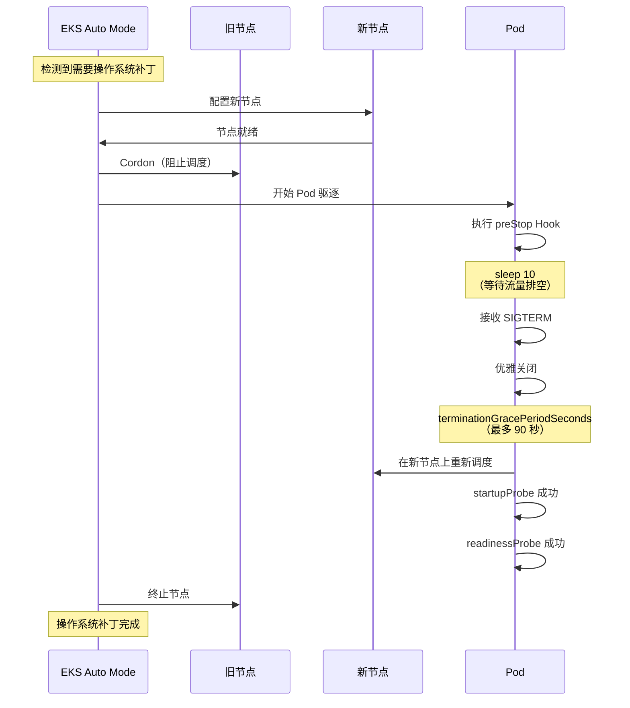

**监控示例：**

```bash
# 跟踪 Auto Mode 节点替换事件
kubectl get events --field-selector reason=Evicted --watch

# 检查每个节点的操作系统版本
kubectl get nodes -o custom-columns=\
NAME:.metadata.name,\
OS_IMAGE:.status.nodeInfo.osImage,\
KERNEL:.status.nodeInfo.kernelVersion

# 检查 Auto Mode 管理状态
kubectl get nodes -L eks.amazonaws.com/compute-type
```

:::tip Auto Mode 节点替换频率
Auto Mode 为了安全补丁、性能优化和成本降低，比手动管理更频繁地替换节点（平均每两周一次）。将 `terminationGracePeriodSeconds` 设置为 90 秒以上，并始终配置 PDB，以确保在不中断服务的情况下进行节点替换。
:::

#### 验证 Auto Mode 是否已启用

```bash
# 检查集群是否处于 Auto Mode
aws eks describe-cluster --name production-eks \
  --query 'cluster.computeConfig.enabled' \
  --output text

# 检查 Auto Mode 节点
kubectl get nodes -L eks.amazonaws.com/compute-type
# 示例输出：
# NAME                    COMPUTE-TYPE
# ip-10-0-1-100.ec2.internal   auto
# ip-10-0-2-200.ec2.internal   auto
```

**相关文档：**
- [AWS Blog: Getting started with EKS Auto Mode](https://aws.amazon.com/blogs/containers/getting-started-with-amazon-eks-auto-mode)
- [AWS Blog: How to build highly available Kubernetes applications with EKS Auto Mode](https://aws.amazon.com/blogs/containers/how-to-build-highly-available-kubernetes-applications-with-amazon-eks-auto-mode/)
- [AWS Blog: Maximize EKS efficiency - Auto Mode, Graviton, and Spot](https://aws.amazon.com/blogs/containers/maximize-amazon-eks-efficiency-how-auto-mode-graviton-and-spot-work-together/)

---

### 7.5 基于 AI/Agentic 的 Probe 优化

本节介绍如何利用 AWS re:Invent 2025 CNS421 会议中介绍的基于 Agentic AI 的 EKS 运维模式，自动优化 Probe 配置并诊断故障。

#### CNS421 会议要点 - Agentic AI 用于 EKS 运维

**会议概述：**

"Streamline Amazon EKS Operations with Agentic AI" 会议通过现场代码演示展示了如何使用 Model Context Protocol（MCP）和 AI 代理自动化 EKS 集群管理。

**核心能力：**
- 实时问题诊断（自动 Probe 故障根因分析）
- 引导修复（逐步解决指南）
- Tribal Knowledge 利用（从过往问题模式中学习）
- 自动修复（自动解决简单问题）

**架构：**

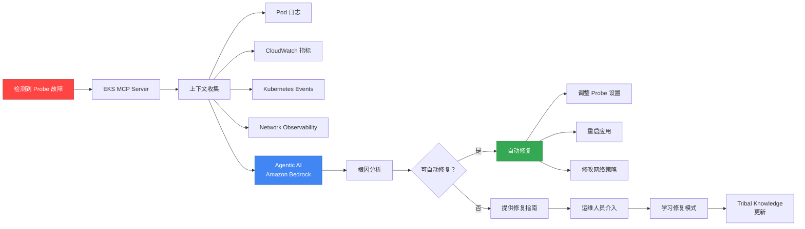

#### 使用 Kiro + EKS MCP 自动优化 Probe

**什么是 Kiro：**

Kiro 是一个由 AWS AI 驱动的运维工具，通过 MCP（Model Context Protocol）服务器与 AWS 资源进行交互。

**安装和设置：**

```bash
# 安装 Kiro CLI（macOS）
brew install aws/tap/kiro

# 配置 EKS MCP Server
kiro mcp add eks \
  --server-type eks \
  --cluster-name production-eks \
  --region ap-northeast-2

# 启用 Probe 优化代理
kiro agent create probe-optimizer \
  --type eks-health-check \
  --auto-remediate true
```

**Probe 故障自动诊断工作流：**

```yaml
# Kiro Agent 配置 - 自动 Probe 故障响应
apiVersion: kiro.aws/v1alpha1
kind: Agent
metadata:
  name: probe-failure-analyzer
spec:
  cluster: production-eks
  triggers:
    - type: ProbeFailure
      conditions:
        - probeType: readiness
          failureThreshold: 3
          duration: 5m
  actions:
    - name: collect-context
      steps:
        - getPodLogs:
            namespace: ${event.namespace}
            podName: ${event.podName}
            tailLines: 500
        - getCloudWatchMetrics:
            namespace: ContainerInsights
            metricName: pod_cpu_utilization
            dimensions:
              - name: PodName
                value: ${event.podName}
            period: 300
        - getNetworkObservability:
            podName: ${event.podName}
            metrics:
              - latency
              - packetLoss
              - connectionErrors
        - getKubernetesEvents:
            namespace: ${event.namespace}
            fieldSelector: involvedObject.name=${event.podName}

    - name: analyze-root-cause
      llm:
        model: anthropic.claude-3-5-sonnet-20241022-v2:0
        prompt: |
          Analyze the following Kubernetes Readiness Probe failure:

          Pod: ${event.podName}
          Namespace: ${event.namespace}
          Probe Config:
          ${context.probeConfig}

          Pod Logs (last 500 lines):
          ${context.podLogs}

          CloudWatch Metrics (last 5 minutes):
          ${context.metrics}

          Network Observability:
          ${context.networkMetrics}

          Kubernetes Events:
          ${context.events}

          Determine the root cause and suggest:
          1. Is this a network issue, application issue, or configuration issue?
          2. Recommended Probe settings (periodSeconds, failureThreshold, timeoutSeconds)
          3. Auto-remediation actions if applicable

    - name: auto-remediate
      conditions:
        - type: RootCauseIdentified
          confidence: ">0.8"
      steps:
        - applyProbeOptimization:
            when: ${analysis.recommendedAction == "adjust_probe_settings"}
            patchDeployment:
              name: ${event.deploymentName}
              namespace: ${event.namespace}
              patch:
                spec:
                  template:
                    spec:
                      containers:
                        - name: ${event.containerName}
                          readinessProbe:
                            periodSeconds: ${analysis.recommendedPeriod}
                            failureThreshold: ${analysis.recommendedThreshold}
                            timeoutSeconds: ${analysis.recommendedTimeout}

        - restartPod:
            when: ${analysis.recommendedAction == "restart_pod"}
            namespace: ${event.namespace}
            podName: ${event.podName}

        - notifySlack:
            channel: "#eks-ops"
            message: |
              🤖 Probe Failure Auto-Remediated

              Pod: ${event.podName}
              Root Cause: ${analysis.rootCause}
              Action Taken: ${analysis.appliedAction}
              Confidence: ${analysis.confidence}

              Details: ${analysis.explanation}

    - name: manual-guide
      conditions:
        - type: RootCauseIdentified
          confidence: "<0.8"
      steps:
        - createJiraTicket:
            project: DEVOPS
            issueType: Incident
            summary: "Probe Failure - Manual Investigation Required"
            description: |
              Pod: ${event.podName}
              Potential Causes: ${analysis.possibleCauses}
              Investigation Steps: ${analysis.investigationSteps}
              Context: ${context}
```

**实际示例 - 自动优化 Probe 超时：**

```bash
# 通过 Kiro 进行交互式 Probe 优化
$ kiro chat --agent probe-optimizer

User: My readiness probe is failing intermittently on pod api-gateway-xyz.
      Can you diagnose and fix it?

Kiro: 🔍 Analyzing probe failures for pod api-gateway-xyz...

      ✅ Root Cause Identified (Confidence: 92%)
      - Issue: Network latency spikes to external database
      - Current Probe: periodSeconds=5, timeoutSeconds=3, failureThreshold=2
      - Network metrics show p99 latency: 2.8 seconds

      📊 Recommendation:
      1. Increase timeoutSeconds from 3 to 5 seconds
      2. Increase failureThreshold from 2 to 3
      3. Enable Container Network Observability for ongoing monitoring

      🤖 Auto-Remediation Available
      Shall I apply these changes? (yes/no)

User: yes

Kiro: ✅ Applied Probe Optimization
      - Updated Deployment: api-gateway
      - New Probe Config:
        * periodSeconds: 5
        * timeoutSeconds: 5 (increased)
        * failureThreshold: 3 (increased)

      📈 Monitoring for 5 minutes to verify stability...

      ✅ Verification Complete
      - Probe failures reduced from 12/hour to 0/hour
      - Network latency p99: 2.8s (within new 5s timeout)
      - Recommendation recorded in tribal knowledge

      💡 Suggestion: Consider moving database to same VPC
          to reduce network latency permanently.
```

#### 使用 Amazon Q Developer 调试 Probe 问题

Amazon Q Developer 是一个 IDE 集成的 AI 助手，支持 Probe 配置代码审查和实时调试。

**VS Code 集成示例：**

```yaml
# 开发者正在编写的 Deployment YAML
apiVersion: apps/v1
kind: Deployment
metadata:
  name: myapp
spec:
  template:
    spec:
      containers:
      - name: app
        image: myapp:v1
        readinessProbe:
          httpGet:
            path: /health  # ⚠️ Q Developer 警告
            port: 8080
          periodSeconds: 10
          timeoutSeconds: 1  # ⚠️ Q Developer 警告
```

**Q Developer 建议：**

```
💡 Amazon Q Developer 建议

问题 1：Liveness 和 Readiness 使用相同的端点。
建议：
- Liveness Probe：/healthz（仅检查内部状态）
- Readiness Probe：/ready（包含外部依赖）

问题 2：timeoutSeconds 设置过短。
建议：
- 将 timeoutSeconds 增加到 3-5 秒
- 在 EKS 环境中 1 秒可能因网络延迟而超时

问题 3：缺少 Startup Probe。
建议：
- 如果应用启动时间超过 30 秒，添加 Startup Probe
- failureThreshold: 30，periodSeconds: 10

应用建议？[是] [否] [详细说明]
```

**实时代码执行验证（Amazon Q Developer）：**

```bash
# Q Developer 在本地验证 Probe 配置
$ q-dev validate deployment.yaml --cluster production-eks

✅ 语法有效
⚠️  最佳实践检查：
    - 启动缓慢的应用缺少 Startup Probe（15 个警告）
    - Liveness Probe 包含外部依赖（严重）
    - terminationGracePeriodSeconds 应至少为 60 秒（警告）

🧪 模拟结果：
    - Probe 成功率：94%（目标：>99%）
    - 预计 Pod 启动时间：45 秒
    - 预计优雅关闭时间：25 秒

📊 建议：
    应用 Q Developer 建议的配置？(Y/n)
```

#### 基于 Tribal Knowledge 的 Probe 模式学习

Agentic AI 从过去的 Probe 问题解决模式中学习，在类似情况下立即响应。

**Tribal Knowledge 示例：**

```yaml
# 组织的 Probe 解决模式库
apiVersion: kiro.aws/v1alpha1
kind: TribalKnowledge
metadata:
  name: probe-failure-patterns
spec:
  patterns:
    - id: pattern-001
      name: "Database Connection Timeout"
      symptoms:
        - probeType: readiness
          errorPattern: "connection timeout"
          frequency: intermittent
      rootCause: "数据库在不同 AZ 导致高延迟"
      solution:
        - action: increaseTimeout
          from: 3
          to: 5
        - action: addRetry
          retries: 2
      confidence: 0.95
      resolvedCount: 47
      lastSeen: "2026-02-10"

    - id: pattern-002
      name: "Slow JVM Startup"
      symptoms:
        - probeType: startup
          errorPattern: "probe failed"
          timing: "first 60 seconds"
      rootCause: "JVM 初始化耗时超过 30 秒"
      solution:
        - action: addStartupProbe
          failureThreshold: 30
          periodSeconds: 10
      confidence: 0.98
      resolvedCount: 123
      lastSeen: "2026-02-11"

    - id: pattern-003
      name: "Network Policy Blocking Health Check"
      symptoms:
        - probeType: liveness
          errorPattern: "connection refused"
          timing: "after deployment"
      rootCause: "NetworkPolicy 未允许 kubelet 访问"
      solution:
        - action: updateNetworkPolicy
          allowFrom:
            - podSelector: {}  # 允许命名空间内所有 Pod
            - namespaceSelector:
                matchLabels:
                  name: kube-system
      confidence: 0.92
      resolvedCount: 34
      lastSeen: "2026-02-08"
```

**自动模式匹配：**

```bash
# 新 Probe 故障发生时自动匹配
$ kiro diagnose probe-failure \
  --pod api-backend-abc \
  --namespace production

🔍 正在分析 Probe 故障...

✅ 模式匹配："Database Connection Timeout"（pattern-001）
   置信度：89%
   此模式已成功解决 47 次

📋 建议操作（来自 Tribal Knowledge）：
   1. 将 readinessProbe.timeoutSeconds 从 3 增加到 5
   2. 添加 2 次重试逻辑
   3. 考虑将数据库放置在同一 AZ

🤖 自动应用？(yes/no)
```

#### Probe 优化集成仪表板

```yaml
# Grafana Dashboard - AI 驱动的 Probe 优化状态
apiVersion: v1
kind: ConfigMap
metadata:
  name: ai-probe-optimization-dashboard
  namespace: monitoring
data:
  dashboard.json: |
    {
      "title": "AI-Driven Probe Optimization",
      "panels": [
        {
          "title": "Auto-Remediation Success Rate",
          "targets": [{
            "expr": "rate(kiro_auto_remediation_success[1h]) / rate(kiro_auto_remediation_total[1h])"
          }]
        },
        {
          "title": "Tribal Knowledge Pattern Matching",
          "targets": [{
            "expr": "kiro_pattern_match_count"
          }]
        },
        {
          "title": "Probe Failure Rate Trend (Before/After AI)",
          "targets": [
            {"expr": "rate(probe_failures_total[1h])", "legendFormat": "Before AI"},
            {"expr": "rate(probe_failures_ai_optimized_total[1h])", "legendFormat": "After AI"}
          ]
        },
        {
          "title": "Mean Time to Resolution (MTTR)",
          "targets": [{
            "expr": "avg(kiro_remediation_duration_seconds)"
          }]
        }
      ]
    }
```

**ROI 衡量示例：**

| 指标 | AI 引入前 | AI 引入后 | 改善幅度 |
|------|----------|----------|---------|
| Probe 故障次数 | 120 次/周 | 12 次/周 | 减少 90% |
| 平均解决时间（MTTR） | 45 分钟 | 3 分钟 | 减少 93% |
| 需要运维人员介入的案例 | 120 次/周 | 12 次/周 | 减少 90% |
| Probe 配置优化时间 | 2 小时/案例 | 5 分钟/案例 | 减少 96% |

:::tip 采用 Agentic AI 的最佳实践
不要从一开始就追求 Agentic AI 的 100% 自动化。在前 3 个月以"建议模式"运行，由运维人员审查和批准 AI 建议。当 Tribal Knowledge 积累充分且置信度达到 90% 以上时，再转换为"自动修复模式"。
:::

**相关资源：**
- [YouTube: CNS421 - Streamline Amazon EKS operations with Agentic AI](https://www.youtube.com/watch?v=4s-a0jY4kSE)
- [AWS Blog: Agentic Cloud Modernization with Kiro](https://aws.amazon.com/blogs/migration-and-modernization/agentic-cloud-modernization-accelerating-modernization-with-aws-mcps-and-kiro/)
- [AWS Blog: AWS IaC MCP Server](https://aws.amazon.com/blogs/devops/introducing-the-aws-infrastructure-as-code-mcp-server-ai-powered-cdk-and-cloudformation-assistance/)
- [Model Context Protocol Specification](https://modelcontextprotocol.io/)

---

**文档贡献**：欢迎通过 GitHub Issues 提交对本文档的反馈、错误报告和改进建议。
