# EKS Pod å¥åº·æ£€æŸ¥ä¸ç”Ÿå‘½å‘¨æœŸç®¡ç†

> 📅 **撰写日期**: 2025-10-15 | **修改日期**: 2026-02-14 | â±ï¸ **阅读时间**: 约 28 分钟

> **📌 å‚考ç¯å¢ƒ**: EKS 1.30+, Kubernetes 1.30+, AWS Load Balancer Controller v2.7+

## 1. 概述

Pod å¥åº·æ£€æŸ¥ä¸ç”Ÿå‘½å‘¨æœŸç®¡ç†æ˜¯æœåŠ¡ç¨³å®šæ€§å’Œå¯ç”¨æ€§çš„基础。正确é…ç½® Probe 并å®ç° Graceful Shutdown å¯ä»¥ç¡®ä¿ä»¥ä¸‹å‡ ç‚¹ï¼š

- **零åœæœºéƒ¨ç½²**: 在滚动更新期间防止æµé‡ä¸¢å¤±
- **快速故障检测**: 自动隔离和é‡å¯ä¸å¥åº·çš„ Pod
- **资æºä¼˜åŒ–**: 防止å¯åŠ¨ç¼“慢的应用被过早é‡å¯
- **æ•°æ®å®Œæ•´æ€§**: 在关闭期间安全完æˆæ­£åœ¨å¤„ç†çš„请求

本文档涵盖了 Pod çš„å®Œæ•´ç”Ÿå‘½å‘¨æœŸï¼Œä» Kubernetes Probe 的工作åŸç†ï¼Œåˆ°å„语言的 Graceful Shutdown å®ç°ã€Init Container 的使用方法以åŠå®¹å™¨é•œåƒä¼˜åŒ–。

:::info 相关文档
- **Probe 调试**: 请å‚阅 [EKS æ•…éšœæ’查ä¸äº‹ä»¶å“应指å—](/docs/operations-observability/eks-debugging-guide) 中的"Probe 调试ä¸æœ€ä½³å®è·µ"章节
- **高å¯ç”¨è®¾è®¡**: 请å‚阅 [EKS 高å¯ç”¨æ¶æ„指å—](/docs/operations-observability/eks-resiliency-guide) 中的"Graceful Shutdown"ã€"PDB"å’Œ"Pod Readiness Gates"章节
:::

---

## 2. Kubernetes Probe 深入指å—

### 2.1 ä¸‰ç§ Probe ç±»å‹åŠå·¥ä½œåŸç†

Kubernetes æ供三ç§ç±»å‹çš„ Probe æ¥ç›‘æ§ Pod 状æ€ã€‚

| Probe ç±»å‹ | 目的 | 失败时的行为 | 激活时机 |
|-----------|------|-------------|-------------|
| **Startup Probe** | 验è¯åº”用åˆå§‹åŒ–是å¦å®Œæˆ | é‡å¯ Pod（达到 failureThreshold 时） | Pod å¯åŠ¨åç«‹å³æ‰§è¡Œ |
| **Liveness Probe** | 检测应用死é”/æŒ‚èµ·çŠ¶æ€ | é‡å¯å®¹å™¨ | Startup Probe æˆåŠŸå |
| **Readiness Probe** | 验è¯æ˜¯å¦å‡†å¤‡å¥½æ¥æ”¶æµé‡ | ä» Service Endpoints 中移除（ä¸é‡å¯ï¼‰ | Startup Probe æˆåŠŸå |

#### Startup Probe：ä¿æŠ¤å¯åŠ¨ç¼“慢的应用

Startup Probe 会延迟 Liveness/Readiness Probe 的执行，直到应用完全å¯åŠ¨ã€‚å®ƒå¯¹äº Spring Bootã€JVM 应用和 ML 模å‹åŠ è½½ç­‰å¯åŠ¨ç¼“慢的应用至关é‡è¦ã€‚

**工作åŸç†ï¼š**
- Startup Probe è¿è¡ŒæœŸé—´ï¼ŒLiveness/Readiness Probe 被ç¦ç”¨
- Startup Probe æˆåŠŸ → 激活 Liveness/Readiness Probe
- Startup Probe 失败（达到 failureThreshold） → é‡å¯å®¹å™¨

#### Liveness Probe：检测死é”

Liveness Probe 检查应用是å¦å­˜æ´»ã€‚失败时，kubelet 会é‡å¯å®¹å™¨ã€‚

**使用场景：**
- 检测无é™å¾ªç¯å’Œæ­»é”状æ€
- ä¸å¯æ¢å¤çš„应用错误
- ç”±äºå†…存泄æ¼å¯¼è‡´çš„æ— å“应状æ€

**注æ„事项：**
- **ä¸è¦åœ¨ Liveness Probe 中包å«å¤–部ä¾èµ–**（DBã€Redis 等）
- 外部æœåŠ¡æ•…éšœå¯èƒ½å¯¼è‡´æ‰€æœ‰ Pod åŒæ—¶é‡å¯çš„级è”æ•…éšœ

#### Readiness Probe：æ§åˆ¶æµé‡æ¥æ”¶

Readiness Probe 检查 Pod 是å¦å‡†å¤‡å¥½æ¥æ”¶æµé‡ã€‚失败时，Pod ä» Service çš„ Endpoints 中移除，但容器ä¸ä¼šé‡å¯ã€‚

**使用场景：**
- 验è¯ä¾èµ–æœåŠ¡è¿æ¥ï¼ˆDBã€ç¼“存）
- 确认åˆå§‹æ•°æ®åŠ è½½å®Œæˆ
- 部署期间的æ¸è¿›å¼æµé‡æ¥æ”¶

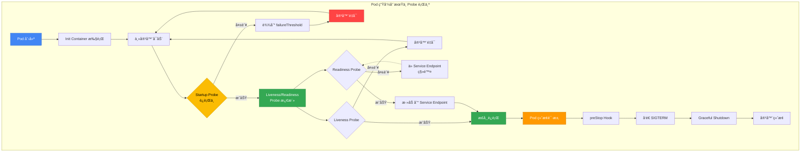

### 2.2 Probe 机制

Kubernetes 支æŒå››ç§ Probe 机制。

| 机制 | æè¿° | 优点 | 缺点 | æœ€é€‚åˆ |
|----------|------|------|------|------------|
| **httpGet** | HTTP GET 请求，检查 200-399 å“åº”ç  | 标准，å®ç°ç®€å• | éœ€è¦ HTTP æœåŠ¡å™¨ | REST APIã€Web æœåŠ¡ |
| **tcpSocket** | 检查 TCP 端å£è¿é€šæ€§ | è½»é‡å¿«é€Ÿ | 无法验è¯åº”用逻辑 | gRPCã€æ•°æ®åº“ |
| **exec** | 在容器内执行命令，检查退出ç æ˜¯å¦ä¸º 0 | çµæ´»ï¼Œå¯è‡ªå®šä¹‰é€»è¾‘ | 开销较高 | æ‰¹å¤„ç† Workerã€åŸºäºæ–‡ä»¶çš„检查 |
| **grpc** | 使用 gRPC Health Check Protocol（K8s 1.27+ GA） | åŸç”Ÿ gRPC æ”¯æŒ | ä»…é€‚ç”¨äº gRPC 应用 | gRPC å¾®æœåŠ¡ |

#### httpGet 示例

```yaml
livenessProbe:
  httpGet:
    path: /healthz
    port: 8080
    httpHeaders:
    - name: X-Custom-Header
      value: HealthCheck
    scheme: HTTP  # 或 HTTPS
  initialDelaySeconds: 30
  periodSeconds: 10
```

#### tcpSocket 示例

```yaml
livenessProbe:
  tcpSocket:
    port: 5432  # PostgreSQL
  initialDelaySeconds: 15
  periodSeconds: 10
```

#### exec 示例

```yaml
livenessProbe:
  exec:
    command:
    - /bin/sh
    - -c
    - test -f /tmp/healthy
  initialDelaySeconds: 5
  periodSeconds: 5
```

#### grpc 示例（Kubernetes 1.27+）

```yaml
livenessProbe:
  grpc:
    port: 9090
    service: myservice  # å¯é€‰
  initialDelaySeconds: 10
  periodSeconds: 5
```

:::tip gRPC Health Check Protocol
gRPC æœåŠ¡å¿…é¡»å®ç° [gRPC Health Checking Protocol](https://github.com/grpc/grpc/blob/master/doc/health-checking.md)。Go 语言使用 `google.golang.org/grpc/health`，Java 使用 `grpc-health-check` 库。
:::

### 2.3 Probe 时间设计

Probe 时间å‚数决定了故障检测速度和稳定性之间的平衡。

| å‚æ•° | æè¿° | 默认值 | 建议范围 |
|----------|------|--------|----------|
| `initialDelaySeconds` | 容器å¯åŠ¨åˆ°é¦–次 Probe 的等待时间 | 0 | 10-30s（使用 Startup Probe æ—¶å¯è®¾ä¸º 0） |
| `periodSeconds` | Probe 执行间隔 | 10 | 5-15s |
| `timeoutSeconds` | Probe å“应等待时间 | 1 | 3-10s |
| `failureThreshold` | 判定失败å‰çš„è¿ç»­å¤±è´¥æ¬¡æ•° | 3 | Liveness: 3, Readiness: 1-3, Startup: 30+ |
| `successThreshold` | 判定æˆåŠŸå‰çš„è¿ç»­æˆåŠŸæ¬¡æ•°ï¼ˆä»… Readiness å¯ >1） | 1 | 1-2 |

#### 时间设计公å¼

```
最大检测时间 = failureThreshold × periodSeconds
最短æ¢å¤æ—¶é—´ = successThreshold × periodSeconds
```

**示例：**
- `failureThreshold: 3, periodSeconds: 10` → 最多 30 秒å检测到故障
- `successThreshold: 2, periodSeconds: 5` → 至少 10 秒å判定æ¢å¤ï¼ˆä»… Readiness）

#### 按工作负载类å‹çš„建议时间

| å·¥ä½œè´Ÿè½½ç±»å‹ | initialDelaySeconds | periodSeconds | failureThreshold | ç†ç”± |
|--------------|-------------------|---------------|-----------------|------|
| Web æœåŠ¡ï¼ˆNode.jsã€Python） | 10 | 5 | 3 | å¯åŠ¨å¿«ï¼Œéœ€è¦å¿«é€Ÿæ£€æµ‹ |
| JVM 应用（Spring Boot） | 0（使用 Startup Probe） | 10 | 3 | å¯åŠ¨æ…¢ï¼Œç”± Startup Probe ä¿æŠ¤ |
| æ•°æ®åº“（PostgreSQL） | 30 | 10 | 5 | åˆå§‹åŒ–时间长 |
| æ‰¹å¤„ç† Worker | 5 | 15 | 2 | 周期性任务，检测è¦æ±‚å®½æ¾ |
| ML æ¨ç†æœåŠ¡ | 0（Startup: 60） | 10 | 3 | 模å‹åŠ è½½æ—¶é—´é•¿ |

### 2.4 按工作负载的 Probe 模å¼

#### æ¨¡å¼ 1：Web æœåŠ¡ï¼ˆREST API）

```yaml
apiVersion: apps/v1
kind: Deployment
metadata:
  name: rest-api
spec:
  replicas: 3
  selector:
    matchLabels:
      app: rest-api
  template:
    metadata:
      labels:
        app: rest-api
    spec:
      containers:
      - name: api
        image: myapp/rest-api:v1.2.3
        ports:
        - containerPort: 8080
          protocol: TCP
        resources:
          requests:
            cpu: 200m
            memory: 256Mi
          limits:
            cpu: 500m
            memory: 512Mi
        # Startup Probe：验è¯åœ¨ 30 秒内完æˆå¯åŠ¨
        startupProbe:
          httpGet:
            path: /healthz
            port: 8080
          failureThreshold: 6
          periodSeconds: 5
        # Liveness Probe：仅内部å¥åº·æ£€æŸ¥ï¼ˆæ’除外部ä¾èµ–）
        livenessProbe:
          httpGet:
            path: /healthz
            port: 8080
          initialDelaySeconds: 10
          periodSeconds: 10
          timeoutSeconds: 5
          failureThreshold: 3
        # Readiness Probe：å¯ä»¥åŒ…å«å¤–部ä¾èµ–
        readinessProbe:
          httpGet:
            path: /ready
            port: 8080
          initialDelaySeconds: 5
          periodSeconds: 5
          timeoutSeconds: 3
          failureThreshold: 2
          successThreshold: 1
        lifecycle:
          preStop:
            exec:
              command:
              - /bin/sh
              - -c
              - sleep 5 && kill -TERM 1
      terminationGracePeriodSeconds: 60
```

**å¥åº·æ£€æŸ¥ç«¯ç‚¹å®ç°ï¼ˆNode.js/Express）：**

```javascript
// /healthz - Liveness：仅检查应用自身状æ€
app.get('/healthz', (req, res) => {
  // 仅检查内部状æ€ï¼ˆå†…å­˜ã€CPU 等）
  const memUsage = process.memoryUsage();
  if (memUsage.heapUsed / memUsage.heapTotal > 0.95) {
    return res.status(500).json({ status: 'unhealthy', reason: 'memory_pressure' });
  }
  res.status(200).json({ status: 'ok' });
});

// /ready - Readiness：包括外部ä¾èµ–的检查
app.get('/ready', async (req, res) => {
  try {
    // éªŒè¯ DB è¿æ¥
    await db.ping();
    // éªŒè¯ Redis è¿æ¥
    await redis.ping();
    res.status(200).json({ status: 'ready' });
  } catch (err) {
    res.status(503).json({ status: 'not_ready', reason: err.message });
  }
});
```

#### æ¨¡å¼ 2：gRPC æœåŠ¡

```yaml
apiVersion: apps/v1
kind: Deployment
metadata:
  name: grpc-service
spec:
  replicas: 3
  selector:
    matchLabels:
      app: grpc-service
  template:
    metadata:
      labels:
        app: grpc-service
    spec:
      containers:
      - name: grpc-server
        image: myapp/grpc-service:v2.1.0
        ports:
        - containerPort: 9090
          name: grpc
        resources:
          requests:
            cpu: 300m
            memory: 512Mi
          limits:
            cpu: 1
            memory: 1Gi
        # gRPC åŸç”Ÿæ¢é’ˆï¼ˆK8s 1.27+）
        startupProbe:
          grpc:
            port: 9090
            service: myapp.HealthService  # å¯é€‰
          failureThreshold: 30
          periodSeconds: 10
        livenessProbe:
          grpc:
            port: 9090
          periodSeconds: 10
          timeoutSeconds: 5
          failureThreshold: 3
        readinessProbe:
          grpc:
            port: 9090
          periodSeconds: 5
          timeoutSeconds: 3
          failureThreshold: 2
      terminationGracePeriodSeconds: 45
```

**gRPC å¥åº·æ£€æŸ¥å®ç°ï¼ˆGo）：**

```go
package main

import (
    "context"
    "google.golang.org/grpc"
    "google.golang.org/grpc/health"
    "google.golang.org/grpc/health/grpc_health_v1"
)

func main() {
    server := grpc.NewServer()

    // 注册å¥åº·æ£€æŸ¥æœåŠ¡
    healthServer := health.NewServer()
    grpc_health_v1.RegisterHealthServer(server, healthServer)

    // 设置æœåŠ¡çŠ¶æ€ä¸º SERVING
    healthServer.SetServingStatus("myapp.HealthService", grpc_health_v1.HealthCheckResponse_SERVING)

    // ä¾èµ–检查åå¯ä»¥æ›´æ”¹ä¸º NOT_SERVING
    // healthServer.SetServingStatus("myapp.HealthService", grpc_health_v1.HealthCheckResponse_NOT_SERVING)

    // å¯åŠ¨ gRPC æœåŠ¡å™¨
    lis, _ := net.Listen("tcp", ":9090")
    server.Serve(lis)
}
```

#### æ¨¡å¼ 3：Worker/批处ç†

æ‰¹å¤„ç† Worker 没有 HTTP æœåŠ¡å™¨ï¼Œå› æ­¤ä½¿ç”¨ `exec` Probe。

```yaml
apiVersion: apps/v1
kind: Deployment
metadata:
  name: batch-worker
spec:
  replicas: 2
  selector:
    matchLabels:
      app: batch-worker
  template:
    metadata:
      labels:
        app: batch-worker
    spec:
      containers:
      - name: worker
        image: myapp/batch-worker:v3.0.1
        resources:
          requests:
            cpu: 500m
            memory: 1Gi
          limits:
            cpu: 2
            memory: 4Gi
        # Startup Probeï¼šéªŒè¯ Worker åˆå§‹åŒ–
        startupProbe:
          exec:
            command:
            - /bin/sh
            - -c
            - test -f /tmp/worker-ready
          failureThreshold: 12
          periodSeconds: 5
        # Liveness Probe：检查心跳文件
        livenessProbe:
          exec:
            command:
            - /bin/sh
            - -c
            - find /tmp/heartbeat -mmin -2 | grep -q heartbeat
          initialDelaySeconds: 10
          periodSeconds: 30
          failureThreshold: 3
        # Readiness Probe：验è¯ä½œä¸šé˜Ÿåˆ—è¿æ¥
        readinessProbe:
          exec:
            command:
            - /app/check-queue-connection.sh
          periodSeconds: 10
          failureThreshold: 3
      terminationGracePeriodSeconds: 120
```

**Worker 应用（Python）：**

```python
import os
import time
from pathlib import Path

HEARTBEAT_FILE = Path("/tmp/heartbeat")
READY_FILE = Path("/tmp/worker-ready")

def worker_loop():
    # 标记åˆå§‹åŒ–完æˆ
    READY_FILE.touch()

    while True:
        # 定期更新心跳
        HEARTBEAT_FILE.touch()

        # 处ç†ä½œä¸š
        process_jobs()
        time.sleep(5)

def process_jobs():
    # å®é™…作业逻辑
    pass

if __name__ == "__main__":
    worker_loop()
```

#### æ¨¡å¼ 4：å¯åŠ¨ç¼“慢的应用（Spring Bootã€JVM）

JVM 应用å¯åŠ¨å¯èƒ½éœ€è¦ 30 秒或更长时间。使用 Startup Probe 进行ä¿æŠ¤ã€‚

```yaml
apiVersion: apps/v1
kind: Deployment
metadata:
  name: spring-boot-app
spec:
  replicas: 4
  selector:
    matchLabels:
      app: spring-boot
  template:
    metadata:
      labels:
        app: spring-boot
    spec:
      containers:
      - name: app
        image: myapp/spring-boot:v2.7.0
        ports:
        - containerPort: 8080
        resources:
          requests:
            cpu: 1
            memory: 2Gi
          limits:
            cpu: 2
            memory: 4Gi
        env:
        - name: JAVA_OPTS
          value: "-Xms1g -Xmx3g"
        # Startup Probe：最长等待 5 分钟（30 x 10s）
        startupProbe:
          httpGet:
            path: /actuator/health/liveness
            port: 8080
          failureThreshold: 30
          periodSeconds: 10
        # Liveness Probe：Startup æˆåŠŸå激活
        livenessProbe:
          httpGet:
            path: /actuator/health/liveness
            port: 8080
          periodSeconds: 10
          timeoutSeconds: 5
          failureThreshold: 3
        # Readiness Probe：包å«å¤–部ä¾èµ–
        readinessProbe:
          httpGet:
            path: /actuator/health/readiness
            port: 8080
          periodSeconds: 5
          timeoutSeconds: 3
          failureThreshold: 2
      terminationGracePeriodSeconds: 60
```

**Spring Boot Actuator é…置：**

```yaml
# application.yml
management:
  endpoints:
    web:
      exposure:
        include: health
  health:
    livenessState:
      enabled: true
    readinessState:
      enabled: true
  endpoint:
    health:
      probes:
        enabled: true
      show-details: when-authorized
```

#### æ¨¡å¼ 5：Sidecar 模å¼ï¼ˆIstio Proxy + App）

在 Sidecar 模å¼ä¸­ï¼Œåº”为主容器和 Sidecar 都é…ç½® Probe。

```yaml
apiVersion: apps/v1
kind: Deployment
metadata:
  name: app-with-sidecar
spec:
  replicas: 3
  selector:
    matchLabels:
      app: myapp
  template:
    metadata:
      labels:
        app: myapp
    spec:
      containers:
      # 主应用容器
      - name: app
        image: myapp/app:v1.0.0
        ports:
        - containerPort: 8080
        startupProbe:
          httpGet:
            path: /healthz
            port: 8080
          failureThreshold: 10
          periodSeconds: 5
        livenessProbe:
          httpGet:
            path: /healthz
            port: 8080
          periodSeconds: 10
        readinessProbe:
          httpGet:
            path: /ready
            port: 8080
          periodSeconds: 5
      # Istio sidecar（Istio 在自动注入时会自动添加 Probe）
      # 手动é…置示例：
      - name: istio-proxy
        image: istio/proxyv2:1.22.0
        ports:
        - containerPort: 15090
          name: http-envoy-prom
        startupProbe:
          httpGet:
            path: /healthz/ready
            port: 15021
          failureThreshold: 30
          periodSeconds: 1
        livenessProbe:
          httpGet:
            path: /healthz/ready
            port: 15021
          periodSeconds: 10
        readinessProbe:
          httpGet:
            path: /healthz/ready
            port: 15021
          periodSeconds: 2
      terminationGracePeriodSeconds: 90
```

:::tip Istio Sidecar 注入
当 Istio 使用自动注入（`istio-injection=enabled` 标签）时，Istio 会自动为 Sidecar 添加适当的 Probe，无需手动é…置。
:::

#### 2.4.6 Windows 容器 Probe 注æ„事项

EKS 支æŒåŸºäº Windows Server 2019/2022 çš„ Windows 节点，Windows å®¹å™¨ä¸ Linux 容器相比具有ä¸åŒçš„ Probe 行为特å¾ã€‚

##### Windows ä¸ Linux Probe 行为差异

| 项目 | Linux 容器 | Windows 容器 | å½±å“ |
|------|---------------|-----------------|------|
| **容器è¿è¡Œæ—¶** | containerd | containerd (1.6+) | 相åŒè¿è¡Œæ—¶ï¼Œä¸åŒ OS 层 |
| **exec Probe 执行** | `/bin/sh -c` | `cmd.exe /c` 或 `powershell.exe` | 脚本语法差异 |
| **httpGet Probe** | ç›¸åŒ | ç›¸åŒ | 无差异 |
| **tcpSocket Probe** | ç›¸åŒ | ç›¸åŒ | 无差异 |
| **冷å¯åŠ¨æ—¶é—´** | 快（几秒） | 慢（10-30 秒） | 需è¦å¢åŠ  Startup Probe failureThreshold |
| **内存开销** | ä½ï¼ˆ50-100MB） | 高（200-500MB） | 需è¦å¢åŠ  Resource request |
| **Probe 超时** | 通常 1-5 秒 | 建议 3-10 秒 | 需考虑 Windows I/O 延迟 |

##### Windows 工作负载 Probe é…置示例

**IIS/.NET Framework 应用：**

```yaml
apiVersion: apps/v1
kind: Deployment
metadata:
  name: iis-app
  namespace: windows-workloads
spec:
  replicas: 2
  selector:
    matchLabels:
      app: iis-app
  template:
    metadata:
      labels:
        app: iis-app
    spec:
      nodeSelector:
        kubernetes.io/os: windows
        kubernetes.io/arch: amd64
      containers:
      - name: iis
        image: mcr.microsoft.com/windows/servercore/iis:windowsservercore-ltsc2022
        ports:
        - containerPort: 80
        resources:
          requests:
            cpu: 500m
            memory: 512Mi
          limits:
            cpu: 2000m
            memory: 2Gi
        # Startup Probe：考虑 Windows 冷å¯åŠ¨
        startupProbe:
          httpGet:
            path: /
            port: 80
            scheme: HTTP
          initialDelaySeconds: 10
          periodSeconds: 5
          timeoutSeconds: 5
          failureThreshold: 12  # 是 Linux çš„ 2 å€ï¼ˆæœ€é•¿ 60 秒）
          successThreshold: 1
        # Liveness Probe：IIS 进程状æ€
        livenessProbe:
          httpGet:
            path: /healthz
            port: 80
          initialDelaySeconds: 30
          periodSeconds: 10
          timeoutSeconds: 5
          failureThreshold: 3
        # Readiness Probe：ASP.NET 应用就绪
        readinessProbe:
          httpGet:
            path: /ready
            port: 80
          initialDelaySeconds: 15
          periodSeconds: 5
          timeoutSeconds: 5
          failureThreshold: 3
          successThreshold: 1
      terminationGracePeriodSeconds: 60
```

**ASP.NET Core å¥åº·æ£€æŸ¥ç«¯ç‚¹å®ç°ï¼š**

```csharp
// Program.cs (ASP.NET Core 6+)
using Microsoft.AspNetCore.Diagnostics.HealthChecks;
using Microsoft.Extensions.Diagnostics.HealthChecks;

var builder = WebApplication.CreateBuilder(args);

// 添加å¥åº·æ£€æŸ¥
builder.Services.AddHealthChecks()
    .AddCheck("self", () => HealthCheckResult.Healthy())
    .AddSqlServer(
        connectionString: builder.Configuration.GetConnectionString("DefaultConnection"),
        name: "sqlserver",
        tags: new[] { "ready" }
    );

var app = builder.Build();

// /healthz - Liveness：仅检查应用自身
app.MapHealthChecks("/healthz", new HealthCheckOptions
{
    Predicate = check => check.Tags.Contains("self") || check.Tags.Count == 0
});

// /ready - Readiness：包括外部ä¾èµ–
app.MapHealthChecks("/ready", new HealthCheckOptions
{
    Predicate = _ => true  // 所有å¥åº·æ£€æŸ¥
});

app.Run();
```

##### Windows 工作负载 Probe 超时注æ„事项

Windows 容器å¯èƒ½å‡ºç°è¾ƒé•¿çš„ Probe 超时，åŸå› å¦‚下：

1. **Windows 内核开销**: 较é‡çš„ Windows OS 层导致系统调用延迟
2. **ç£ç›˜ I/O 性能**: NTFS 文件系统元数æ®å¼€é”€
3. **.NET Framework 预热**: CLR JIT 编译和程åºé›†åŠ è½½æ—¶é—´
4. **Windows Defender**: å®æ—¶æ‰«æ导致进程å¯åŠ¨å»¶è¿Ÿ

**建议的 Probe 时间（Windows）：**

```yaml
startupProbe:
  timeoutSeconds: 5-10      # Linux: 3-5s
  periodSeconds: 5
  failureThreshold: 12-20   # Linux: 6-10

livenessProbe:
  timeoutSeconds: 5-10      # Linux: 3-5s
  periodSeconds: 10-15      # Linux: 10s
  failureThreshold: 3

readinessProbe:
  timeoutSeconds: 5-10      # Linux: 3-5s
  periodSeconds: 5-10       # Linux: 5s
  failureThreshold: 3
```

##### CloudWatch Container Insights for Windows（2025-08）

AWS äº 2025 å¹´ 8 月宣布 CloudWatch Container Insights æ”¯æŒ Windows 工作负载。

**在 Windows 节点上安装 Container Insights：**

```bash
# CloudWatch Agent ConfigMap（Windows）
kubectl apply -f - <<EOF
apiVersion: v1
kind: ConfigMap
metadata:
  name: cwagentconfig-windows
  namespace: amazon-cloudwatch
data:
  cwagentconfig.json: |
    {
      "logs": {
        "metrics_collected": {
          "kubernetes": {
            "cluster_name": "my-eks-cluster",
            "metrics_collection_interval": 60
          }
        }
      },
      "metrics": {
        "namespace": "ContainerInsights",
        "metrics_collected": {
          "statsd": {
            "service_address": ":8125"
          }
        }
      }
    }
EOF

# 部署 Windows DaemonSet
kubectl apply -f https://raw.githubusercontent.com/aws-samples/amazon-cloudwatch-container-insights/latest/k8s-deployment-manifest-templates/deployment-mode/daemonset/container-insights-monitoring/cwagent/cwagent-daemonset-windows.yaml
```

**éªŒè¯ Container Insights 指标：**

```bash
# Windows 节点指标
aws cloudwatch get-metric-statistics \
  --namespace ContainerInsights \
  --metric-name node_memory_utilization \
  --dimensions Name=ClusterName,Value=my-eks-cluster Name=NodeName,Value=windows-node-1 \
  --start-time 2026-02-12T00:00:00Z \
  --end-time 2026-02-12T23:59:59Z \
  --period 300 \
  --statistics Average

# Windows Pod 指标
aws cloudwatch get-metric-statistics \
  --namespace ContainerInsights \
  --metric-name pod_cpu_utilization \
  --dimensions Name=ClusterName,Value=my-eks-cluster Name=Namespace,Value=windows-workloads \
  --start-time 2026-02-12T00:00:00Z \
  --end-time 2026-02-12T23:59:59Z \
  --period 60 \
  --statistics Average
```

##### æ··åˆé›†ç¾¤ï¼ˆLinux + Windows）统一监æ§ç­–ç•¥

**1. åŸºäº Node Selector 的分离：**

```yaml
apiVersion: v1
kind: Service
metadata:
  name: unified-app
spec:
  selector:
    app: unified-app  # ä¸ OS æ— å…³
  ports:
  - port: 80
    targetPort: 8080
---
# Linux Deployment
apiVersion: apps/v1
kind: Deployment
metadata:
  name: unified-app-linux
spec:
  replicas: 3
  selector:
    matchLabels:
      app: unified-app
      os: linux
  template:
    metadata:
      labels:
        app: unified-app
        os: linux
    spec:
      nodeSelector:
        kubernetes.io/os: linux
      containers:
      - name: app
        image: myapp:linux-v1
        readinessProbe:
          httpGet:
            path: /ready
            port: 8080
          periodSeconds: 5
          timeoutSeconds: 3
---
# Windows Deployment
apiVersion: apps/v1
kind: Deployment
metadata:
  name: unified-app-windows
spec:
  replicas: 2
  selector:
    matchLabels:
      app: unified-app
      os: windows
  template:
    metadata:
      labels:
        app: unified-app
        os: windows
    spec:
      nodeSelector:
        kubernetes.io/os: windows
      containers:
      - name: app
        image: myapp:windows-v1
        readinessProbe:
          httpGet:
            path: /ready
            port: 8080
          periodSeconds: 10      # Windows：较长间隔
          timeoutSeconds: 10     # Windows：较长超时
```

**2. CloudWatch Logs Insights 统一查询：**

```sql
-- åŒæ—¶æœç´¢ Linux å’Œ Windows Pod 日志
fields @timestamp, kubernetes.namespace_name, kubernetes.pod_name, kubernetes.host, @message
| filter kubernetes.labels.app = "unified-app"
| sort @timestamp desc
| limit 100
```

**3. Grafana Dashboard 集æˆï¼š**

```yaml
# Prometheus 查询（混åˆé›†ç¾¤ï¼‰
# Linux + Windows Pod CPU 利用ç‡
sum(rate(container_cpu_usage_seconds_total{namespace="default", pod=~"unified-app-.*"}[5m])) by (pod, node, os)

# 按 OS èšåˆ
sum(rate(container_cpu_usage_seconds_total{namespace="default", pod=~"unified-app-.*"}[5m])) by (os)
```

:::warning Windows 容器é™åˆ¶
- **é•œåƒå¤§å°**: Windows é•œåƒæœ‰å‡ ä¸ª GB（Linux 是几å MB）
- **许å¯è¯æˆæœ¬**: 适用 Windows Server 许å¯è¯è´¹ç”¨ï¼ˆåŒ…å«åœ¨ EC2 å®ä¾‹è´¹ç”¨ä¸­ï¼‰
- **节点å¯åŠ¨æ—¶é—´**: Windows 节点å¯åŠ¨è¾ƒæ…¢ï¼ˆ5-10 分钟）
- **特æƒå®¹å™¨**: Windows ä¸æ”¯æŒ Linux `privileged` 模å¼
- **HostProcess 容器**: ä» Windows Server 2022（1.22+）开始支æŒ
:::

:::info å‚考资料
- [AWS åšå®¢ï¼šCloudWatch Container Insights for Windows](https://aws.amazon.com/blogs/mt/announcing-amazon-cloudwatch-container-insights-for-amazon-eks-windows-workloads-monitoring)
- [EKS Windows 容器官方文档](https://docs.aws.amazon.com/eks/latest/userguide/windows-support.html)
- [Kubernetes Windows 容器指å—](https://kubernetes.io/docs/concepts/windows/)
:::

### 2.5 Probe å模å¼ä¸é™·é˜±

#### åæ¨¡å¼ 1：在 Liveness Probe 中包å«å¤–部ä¾èµ–

**问题：**

```yaml
livenessProbe:
  httpGet:
    path: /health  # åŒ…å« DBã€Redis è¿æ¥æ£€æŸ¥
    port: 8080
```

**结æœï¼š**
- DB 故障时所有 Pod åŒæ—¶é‡å¯ → 级è”æ•…éšœ
- å³ä½¿æ˜¯ä¸´æ—¶çš„网络延迟也会导致 Pod é‡å¯

**正确é…置：**

```yaml
# Liveness：仅检查应用自身状æ€
livenessProbe:
  httpGet:
    path: /healthz  # 仅检查内部状æ€
    port: 8080

# Readiness：包å«å¤–部ä¾èµ–
readinessProbe:
  httpGet:
    path: /ready  # 检查 DBã€Redis ç­‰
    port: 8080
```

#### åæ¨¡å¼ 2：ä¸ä½¿ç”¨ Startup Probe å´è®¾ç½®è¿‡é«˜çš„ initialDelaySeconds

**问题：**

```yaml
livenessProbe:
  httpGet:
    path: /healthz
    port: 8080
  initialDelaySeconds: 120  # 等待 2 分钟
  periodSeconds: 10
```

**结æœï¼š**
- å³ä½¿åº”用在 30 秒内完æˆå¯åŠ¨ï¼Œä¹Ÿæœ‰ 90 秒没有å¥åº·æ£€æŸ¥
- å¯åŠ¨æœŸé—´çš„崩溃最多 2 分钟内无法检测

**正确é…置：**

```yaml
# 使用 Startup Probe ä¿æŠ¤å¯åŠ¨
startupProbe:
  httpGet:
    path: /healthz
    port: 8080
  failureThreshold: 12  # 最长等待 120 秒
  periodSeconds: 10

# Liveness 在 Startup æˆåŠŸåç«‹å³æ¿€æ´»
livenessProbe:
  httpGet:
    path: /healthz
    port: 8080
  initialDelaySeconds: 0  # Startup æˆåŠŸåç«‹å³å¼€å§‹
  periodSeconds: 10
```

#### åæ¨¡å¼ 3：Liveness å’Œ Readiness 使用相åŒç«¯ç‚¹

**问题：**

```yaml
livenessProbe:
  httpGet:
    path: /health
    port: 8080

readinessProbe:
  httpGet:
    path: /health  # 相åŒç«¯ç‚¹
    port: 8080
```

**结æœï¼š**
- å¦‚æœ `/health` 检查外部ä¾èµ–，Liveness 会失败导致ä¸å¿…è¦çš„é‡å¯
- 角色分离模糊，å¢åŠ è°ƒè¯•éš¾åº¦

**正确é…置：**

```yaml
livenessProbe:
  httpGet:
    path: /healthz  # 仅内部状æ€
    port: 8080

readinessProbe:
  httpGet:
    path: /ready  # 包å«å¤–部ä¾èµ–
    port: 8080
```

#### åæ¨¡å¼ 4：过äºæ¿€è¿›çš„ failureThreshold

**问题：**

```yaml
livenessProbe:
  httpGet:
    path: /healthz
    port: 8080
  periodSeconds: 5
  failureThreshold: 1  # ä»… 1 次失败就é‡å¯
```

**结æœï¼š**
- 临时网络延迟ã€GC æš‚åœç­‰ä¼šå¯¼è‡´ä¸å¿…è¦çš„é‡å¯
- å¯èƒ½å‡ºç°é‡å¯å¾ªç¯

**正确é…置：**

```yaml
livenessProbe:
  httpGet:
    path: /healthz
    port: 8080
  periodSeconds: 10
  failureThreshold: 3  # 30 秒åé‡å¯ï¼ˆ3 x 10s）
  timeoutSeconds: 5
```

#### åæ¨¡å¼ 5：过长的 timeoutSeconds

**问题：**

```yaml
livenessProbe:
  httpGet:
    path: /healthz
    port: 8080
  timeoutSeconds: 30  # 等待 30 秒
  periodSeconds: 10
```

**结æœï¼š**
- Probe é˜»å¡ 30 秒，延迟下一次 Probe 执行
- 故障检测å˜æ…¢

**正确é…置：**

```yaml
livenessProbe:
  httpGet:
    path: /healthz
    port: 8080
  timeoutSeconds: 5  # è¦æ±‚ 5 秒内å“应
  periodSeconds: 10
  failureThreshold: 3
```

### 2.6 ALB/NLB å¥åº·æ£€æŸ¥ä¸ Probe 集æˆ

使用 AWS Load Balancer Controller 时，必须åŒæ­¥ ALB/NLB å¥åº·æ£€æŸ¥ä¸ Kubernetes Readiness Probe，以å®ç°é›¶åœæœºéƒ¨ç½²ã€‚

#### ALB Target Group å¥åº·æ£€æŸ¥ vs Readiness Probe

| 类别 | ALB/NLB å¥åº·æ£€æŸ¥ | Kubernetes Readiness Probe |
|------|-----------------|---------------------------|
| **执行方** | AWS Load Balancer | kubelet |
| **检查目标** | Target Group IP:Port | Pod 容器 |
| **失败时的行为** | ä» Target 移除（阻止æµé‡ï¼‰ | ä» Service Endpoints 移除 |
| **默认间隔** | 30 秒 | 10 秒 |
| **超时时间** | 5 秒 | 1 秒 |

#### å¥åº·æ£€æŸ¥æ—¶é—´åŒæ­¥ç­–ç•¥

在滚动更新期间，会å‘生以下åºåˆ—：

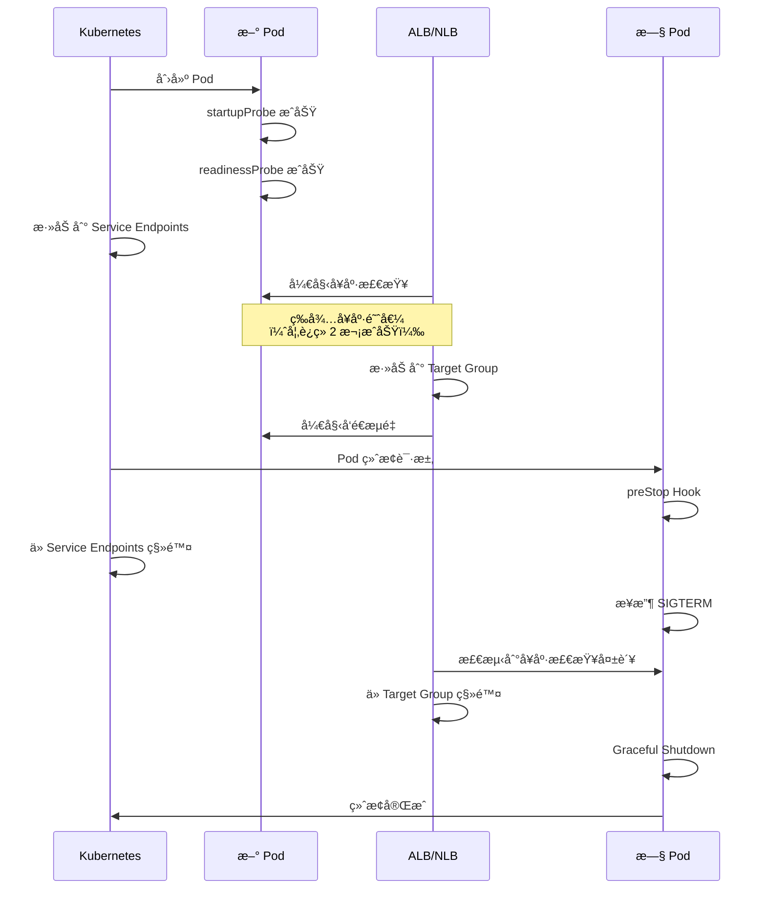

**建议é…置：**

```yaml
apiVersion: v1
kind: Service
metadata:
  name: myapp
  annotations:
    # ALB å¥åº·æ£€æŸ¥é…ç½®
    alb.ingress.kubernetes.io/healthcheck-path: /ready
    alb.ingress.kubernetes.io/healthcheck-interval-seconds: "10"
    alb.ingress.kubernetes.io/healthcheck-timeout-seconds: "5"
    alb.ingress.kubernetes.io/healthy-threshold-count: "2"
    alb.ingress.kubernetes.io/unhealthy-threshold-count: "2"
spec:
  type: NodePort
  ports:
  - port: 80
    targetPort: 8080
  selector:
    app: myapp
---
apiVersion: apps/v1
kind: Deployment
metadata:
  name: myapp
spec:
  replicas: 3
  template:
    spec:
      containers:
      - name: app
        image: myapp:v1
        ports:
        - containerPort: 8080
        readinessProbe:
          httpGet:
            path: /ready  # ä¸ ALB 相åŒçš„路径
            port: 8080
          periodSeconds: 5  # 比 ALB 更短的间隔
          failureThreshold: 2
          successThreshold: 1
      terminationGracePeriodSeconds: 60
```

#### Pod Readiness Gates（ä¿è¯é›¶åœæœºéƒ¨ç½²ï¼‰

AWS Load Balancer Controller v2.5+ æ”¯æŒ Pod Readiness Gates，它会延迟 Pod 转æ¢ä¸º `Ready` 状æ€ï¼Œç›´åˆ° Pod 注册为 ALB/NLB 目标并通过å¥åº·æ£€æŸ¥ã€‚

**å¯ç”¨æ–¹å¼ï¼š**

```yaml
# é€šè¿‡å‘ Namespace 添加标签å¯ç”¨è‡ªåŠ¨æ³¨å…¥
apiVersion: v1
kind: Namespace
metadata:
  name: production
  labels:
    elbv2.k8s.aws/pod-readiness-gate-inject: enabled
```

**验è¯æ“作：**

```bash
# 检查 Pod 的 Readiness Gates
kubectl get pod myapp-xyz -o yaml | grep -A 10 readinessGates

# 示例输出：
# readinessGates:
# - conditionType: target-health.alb.ingress.k8s.aws/my-target-group-hash

# 检查 Pod Conditions
kubectl get pod myapp-xyz -o jsonpath='{.status.conditions}' | jq
```

**优势：**
- 在滚动更新期间，旧 Pod åœ¨ä» Target 移除之å‰ä¼šè¢«ä¿ç•™
- æ–° Pod åªæœ‰åœ¨é€šè¿‡ ALB å¥åº·æ£€æŸ¥åæ‰ä¼šæ¥æ”¶æµé‡
- 完全零åœæœºéƒ¨ç½²ï¼Œæ— æµé‡æŸå¤±

:::info 详细信æ¯
有关 Pod Readiness Gates 的更多详情，请å‚阅 [EKS 高å¯ç”¨æ¶æ„指å—](/docs/operations-observability/eks-resiliency-guide) 中的"Pod Readiness Gates"章节。
:::

#### 2.6.4 Gateway API å¥åº·æ£€æŸ¥é›†æˆï¼ˆALB Controller v2.14+）

AWS Load Balancer Controller v2.14+ åŸç”Ÿé›†æˆ Kubernetes Gateway API v1.4ï¼Œä¸ Ingress 相比æ供了å¢å¼ºçš„按路由å¥åº·æ£€æŸ¥æ˜ å°„。

##### Gateway API vs Ingress å¥åº·æ£€æŸ¥æ¯”较

| 类别 | Ingress | Gateway API |
|------|---------|-------------|
| **å¥åº·æ£€æŸ¥é…ç½®ä½ç½®** | Service/Ingress 注解 | HealthCheckPolicy CRD |
| **按路由å¥åº·æ£€æŸ¥** | 有é™ï¼ˆåŸºäºæ³¨è§£ï¼‰ | åŸç”Ÿæ”¯æŒï¼ˆæŒ‰ HTTPRoute/GRPCRoute） |
| **L4/L7 å议支æŒ** | ä»… HTTP/HTTPS | TCP/UDP/TLS/HTTP/GRPC å…¨éƒ¨æ”¯æŒ |
| **多租户角色分离** | å•ä¸€ Ingress 对象 | Gateway（基础设施）/ Route（应用）分离 |
| **加æƒé‡‘ä¸é›€éƒ¨ç½²** | 困难或ä¸å¯èƒ½ | HTTPRoute åŸç”Ÿæ”¯æŒ |

##### Gateway API æ¶æ„ä¸å¥åº·æ£€æŸ¥

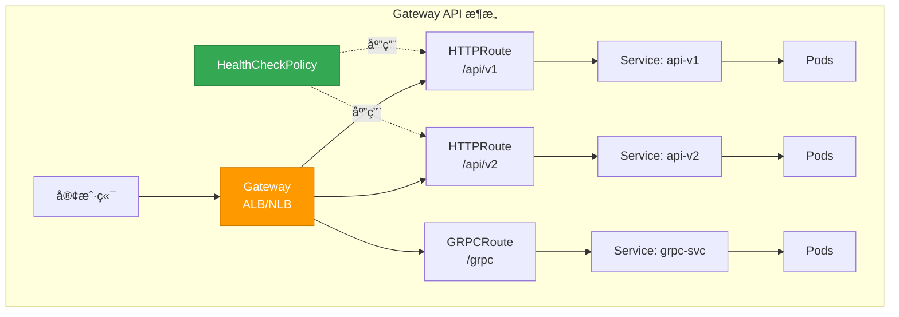

##### L7 å¥åº·æ£€æŸ¥ï¼šHTTPRoute/GRPCRoute ä¸ ALB

**HealthCheckPolicy CRD 示例：**

```yaml
apiVersion: gateway.networking.k8s.io/v1
kind: Gateway
metadata:
  name: prod-gateway
  namespace: production
spec:
  gatewayClassName: alb
  listeners:
  - name: http
    protocol: HTTP
    port: 80
---
apiVersion: gateway.networking.k8s.io/v1
kind: HTTPRoute
metadata:
  name: api-v1-route
  namespace: production
spec:
  parentRefs:
  - name: prod-gateway
  hostnames:
  - api.example.com
  rules:
  - matches:
    - path:
        type: PathPrefix
        value: /api/v1
    backendRefs:
    - name: api-v1-service
      port: 8080
---
# HealthCheckPolicy（AWS Load Balancer Controller v2.14+）
apiVersion: elbv2.k8s.aws/v1beta1
kind: HealthCheckPolicy
metadata:
  name: api-v1-healthcheck
  namespace: production
spec:
  targetGroupARN: arn:aws:elasticloadbalancing:region:account:targetgroup/name/id
  healthCheckConfig:
    protocol: HTTP
    path: /api/v1/healthz  # 按路由å¥åº·æ£€æŸ¥
    port: 8080
    intervalSeconds: 10
    timeoutSeconds: 5
    healthyThresholdCount: 2
    unhealthyThresholdCount: 2
    matcher:
      httpCode: "200-299"
```

**GRPCRoute å¥åº·æ£€æŸ¥ç¤ºä¾‹ï¼š**

```yaml
apiVersion: gateway.networking.k8s.io/v1alpha2
kind: GRPCRoute
metadata:
  name: grpc-service-route
  namespace: production
spec:
  parentRefs:
  - name: prod-gateway
  hostnames:
  - grpc.example.com
  rules:
  - matches:
    - method:
        service: myservice.v1.MyService
    backendRefs:
    - name: grpc-backend
      port: 9090
---
apiVersion: elbv2.k8s.aws/v1beta1
kind: HealthCheckPolicy
metadata:
  name: grpc-healthcheck
  namespace: production
spec:
  targetGroupARN: arn:aws:elasticloadbalancing:region:account:targetgroup/grpc/id
  healthCheckConfig:
    protocol: HTTP  # gRPC å¥åº·æ£€æŸ¥åŸºäº HTTP/2
    path: /grpc.health.v1.Health/Check
    port: 9090
    intervalSeconds: 10
    timeoutSeconds: 5
    healthyThresholdCount: 2
    unhealthyThresholdCount: 2
    matcher:
      grpcCode: "0"  # gRPC OK 状æ€
```

##### L4 å¥åº·æ£€æŸ¥ï¼šTCPRoute/UDPRoute ä¸ NLB

```yaml
apiVersion: gateway.networking.k8s.io/v1alpha2
kind: TCPRoute
metadata:
  name: tcp-service-route
  namespace: production
spec:
  parentRefs:
  - name: nlb-gateway
    sectionName: tcp-listener
  rules:
  - backendRefs:
    - name: tcp-backend
      port: 5432
---
apiVersion: elbv2.k8s.aws/v1beta1
kind: HealthCheckPolicy
metadata:
  name: tcp-healthcheck
  namespace: production
spec:
  targetGroupARN: arn:aws:elasticloadbalancing:region:account:targetgroup/tcp/id
  healthCheckConfig:
    protocol: TCP  # ä»… TCP è¿æ¥æ£€æŸ¥
    port: 5432
    intervalSeconds: 30
    timeoutSeconds: 10
    healthyThresholdCount: 3
    unhealthyThresholdCount: 3
```

##### Gateway API Pod Readiness Gates

Gateway API ä»¥ä¸ Ingress 相åŒçš„æ–¹å¼æ”¯æŒ Pod Readiness Gates：

```yaml
apiVersion: v1
kind: Namespace
metadata:
  name: production
  labels:
    elbv2.k8s.aws/pod-readiness-gate-inject: enabled
```

**验è¯æ“作：**

```bash
# 检查 Gateway 状æ€
kubectl get gateway prod-gateway -n production

# 检查 HTTPRoute 状æ€
kubectl get httproute api-v1-route -n production -o yaml

# 检查 Pod 的 Readiness Gates
kubectl get pod -n production -l app=api-v1 \
  -o jsonpath='{range .items[*]}{.metadata.name}{"\t"}{.status.conditions[?(@.type=="target-health.gateway.networking.k8s.io")].status}{"\n"}{end}'
```

##### å¥åº·æ£€æŸ¥è¿ç§»æ¸…å•ï¼šIngress 到 Gateway API

| 步骤 | Ingress | Gateway API | 验è¯é¡¹ç›® |
|------|---------|-------------|----------|
| 1. å¥åº·æ£€æŸ¥è·¯å¾„映射 | 基äºæ³¨è§£ | HealthCheckPolicy CRD | 按路由策略分离 |
| 2. åè®®é…ç½® | ä»… HTTP/HTTPS | HTTP/HTTPS/GRPC/TCP/UDP | 验è¯åè®®ç±»å‹ |
| 3. Pod Readiness Gates | Namespace 标签 | Namespace 标签（相åŒï¼‰ | 零åœæœºéƒ¨ç½²ä¿è¯ |
| 4. å¥åº·æ£€æŸ¥æ—¶é—´ | Service 注解 | HealthCheckPolicy | éªŒè¯ interval/timeout |
| 5. 多路径å¥åº·æ£€æŸ¥ | ä»…å•ä¸€è·¯å¾„ | 按路由独立é…ç½® | 验è¯æ¯æ¡è·¯ç”± |

**è¿ç§»ç¤ºä¾‹ï¼ˆIngress 到 Gateway API）：**

```yaml
# è¿ç§»å‰ï¼ˆIngress）
apiVersion: v1
kind: Service
metadata:
  name: myapp
  annotations:
    alb.ingress.kubernetes.io/healthcheck-path: /healthz
    alb.ingress.kubernetes.io/healthcheck-interval-seconds: "10"
---
apiVersion: networking.k8s.io/v1
kind: Ingress
metadata:
  name: myapp-ingress
spec:
  rules:
  - host: api.example.com
    http:
      paths:
      - path: /
        pathType: Prefix
        backend:
          service:
            name: myapp
            port:
              number: 8080
```

```yaml
# è¿ç§»å（Gateway API）
apiVersion: gateway.networking.k8s.io/v1
kind: HTTPRoute
metadata:
  name: myapp-route
spec:
  parentRefs:
  - name: prod-gateway
  hostnames:
  - api.example.com
  rules:
  - matches:
    - path:
        type: PathPrefix
        value: /
    backendRefs:
    - name: myapp
      port: 8080
---
apiVersion: elbv2.k8s.aws/v1beta1
kind: HealthCheckPolicy
metadata:
  name: myapp-healthcheck
spec:
  targetGroupARN: <auto-discovered-or-explicit>
  healthCheckConfig:
    protocol: HTTP
    path: /healthz
    port: 8080
    intervalSeconds: 10
    timeoutSeconds: 5
    healthyThresholdCount: 2
    unhealthyThresholdCount: 2
```

:::tip Gateway API è¿ç§»ç­–ç•¥
- **æ¸è¿›å¼è¿ç§»**: å¯ä»¥åœ¨åŒä¸€ä¸ª ALB 上åŒæ—¶ä½¿ç”¨ Ingress å’Œ Gateway API（ä¸åŒçš„ Listener）
- **金ä¸é›€éƒ¨ç½²**: 使用 HTTPRoute 的基äºæƒé‡çš„æµé‡åˆ†å‰²è¿›è¡Œå®‰å…¨è¿‡æ¸¡
- **å›æ»šè®¡åˆ’**: è¿ç§»å®Œæˆåä¿ç•™ Ingress 对象一段时间
:::

:::info å‚考资料
- [Kubernetes Gateway API v1.4 Release](https://kubernetes.io/blog/2025/11/06/gateway-api-v1-4/)
- [AWS Load Balancer Controller Gateway API 指å—](https://kubernetes-sigs.github.io/aws-load-balancer-controller/latest/guide/gateway/gateway/)
- [Gateway API è¿ç§»å®è·µæŒ‡å—](https://medium.com/@gudiwada.chaithu/zero-downtime-migration-from-kubernetes-ingress-to-gateway-api-on-aws-eks-642f3432d394)
:::

### 2.7 2025-2026 EKS æ–°ç‰¹æ€§ä¸ Probe 集æˆ

AWS re:Invent 2025 上å‘布的新的å¯è§‚测性和æ§åˆ¶ç‰¹æ€§è¿›ä¸€æ­¥å¢å¼ºäº†åŸºäº Probe çš„å¥åº·æ£€æŸ¥ã€‚本节介ç»å¦‚何将最新的 EKS ç‰¹æ€§ä¸ Probe 集æˆï¼Œä»¥å®ç°æ›´ç²¾ç¡®å’Œä¸»åŠ¨çš„å¥åº·ç›‘æ§ã€‚

#### 2.7.1 使用 Container Network Observability éªŒè¯ Probe è¿é€šæ€§

**概述：**

Container Network Observability（2025 å¹´ 11 月å‘布）æ供细粒度的网络指标，包括 Pod 到 Pod 的通信模å¼ã€å»¶è¿Ÿå’Œä¸¢åŒ…ç‡ã€‚它能够清晰区分 Probe 失败是由网络问题还是应用级别问题引起的。

**主è¦ç‰¹æ€§ï¼š**
- Pod 到 Pod 通信路径å¯è§†åŒ–
- 网络延迟ã€ä¸¢åŒ…ç‡å’Œé‡ä¼ ç‡ç›‘æ§
- å®æ—¶ç½‘络æµé‡å¼‚常检测
- ä¸ CloudWatch Container Insights 集æˆ

**å¯ç”¨æ–¹å¼ï¼š**

```bash
# 在 VPC CNI 中å¯ç”¨ç½‘络å¯è§‚测性
kubectl set env daemonset aws-node \
  -n kube-system \
  ENABLE_NETWORK_OBSERVABILITY=true

# 或通过 ConfigMap é…ç½®
kubectl apply -f - <<EOF
apiVersion: v1
kind: ConfigMap
metadata:
  name: amazon-vpc-cni
  namespace: kube-system
data:
  enable-network-observability: "true"
EOF
```

**Probe è¿é€šæ€§éªŒè¯ç¤ºä¾‹ï¼š**

```yaml
apiVersion: apps/v1
kind: Deployment
metadata:
  name: api-gateway
  annotations:
    # å¯ç”¨ç½‘络å¯è§‚测性指标收集
    network-observability.amazonaws.com/enabled: "true"
spec:
  replicas: 3
  template:
    spec:
      containers:
      - name: gateway
        image: myapp/gateway:v2
        ports:
        - containerPort: 8080
        # Readiness Probe：检查外部 DB è¿æ¥
        readinessProbe:
          httpGet:
            path: /ready
            port: 8080
          periodSeconds: 5
          failureThreshold: 2
          timeoutSeconds: 3
        livenessProbe:
          httpGet:
            path: /healthz
            port: 8080
          periodSeconds: 10
          failureThreshold: 3
```

**CloudWatch Insights 查询 - å…³è” Probe 失败ä¸ç½‘络延迟：**

```sql
-- 检查 Probe 失败时的网络延迟
fields @timestamp, pod_name, probe_type, network_latency_ms, packet_loss_percent
| filter namespace = "production"
| filter probe_result = "failed"
| filter network_latency_ms > 100 or packet_loss_percent > 1
| sort @timestamp desc
| limit 100
```

**å‘Šè­¦é…置示例：**

```yaml
# CloudWatch Alarm：Probe 失败ä¸ç½‘络异常åŒæ—¶å‘生
apiVersion: v1
kind: ConfigMap
metadata:
  name: probe-network-alert
  namespace: monitoring
data:
  alarm-config: |
    {
      "AlarmName": "ProbeFailureWithNetworkIssue",
      "MetricName": "ReadinessProbeFailure",
      "Namespace": "ContainerInsights",
      "Statistic": "Sum",
      "Period": 60,
      "EvaluationPeriods": 2,
      "Threshold": 3,
      "ComparisonOperator": "GreaterThanThreshold",
      "Dimensions": [
        {"Name": "ClusterName", "Value": "production-eks"},
        {"Name": "Namespace", "Value": "production"}
      ],
      "AlarmDescription": "Readiness Probe 失败时检查网络延迟"
    }
```

**诊断工作æµï¼š**

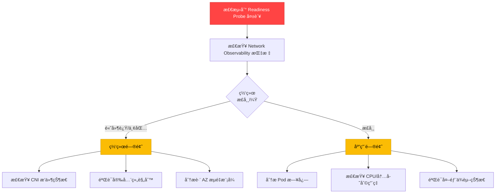

:::tip Pod 到 Pod 路径å¯è§†åŒ–
Container Network Observability ä¸ CloudWatch Logs Insights 集æˆï¼Œå¯è¿½è¸ª Probe 请求的完整网络路径。当 Readiness Probe 检查外部数æ®åº“时，您å¯ä»¥åœ¨ä» Pod 到 Service 到 Endpoint å†åˆ° DB Pod 的整个路径中识别瓶颈段。
:::

---

#### 2.7.2 CloudWatch Observability Operator + Control Plane Metrics

**概述：**

CloudWatch Observability Operator（2025 å¹´ 12 月å‘布）自动收集 EKS Control Plane 指标，能够主动检测 API Server 性能下é™å¦‚ä½•å½±å“ Probe å“应。

**安装：**

```bash
# 安装 CloudWatch Observability Operator
kubectl apply -f https://raw.githubusercontent.com/aws-observability/aws-cloudwatch-observability-operator/main/bundle.yaml

# å¯ç”¨ EKS Control Plane 指标收集
kubectl apply -f - <<EOF
apiVersion: cloudwatch.aws.amazon.com/v1alpha1
kind: EKSControlPlaneMetrics
metadata:
  name: production-control-plane
  namespace: amazon-cloudwatch
spec:
  clusterName: production-eks
  region: ap-northeast-2
  metricsCollectionInterval: 60s
  enabledMetrics:
    - apiserver_request_duration_seconds
    - apiserver_request_total
    - apiserver_storage_objects
    - etcd_request_duration_seconds
    - rest_client_requests_total
EOF
```

**关键 Control Plane 指标：**

| 指标 | æè¿° | Probe 相关性 | 阈值示例 |
|--------|------|-------------|------------|
| `apiserver_request_duration_seconds` | API Server 请求延迟 | Probe 请求处ç†é€Ÿåº¦ | p99 &lt; 1s |
| `apiserver_request_total` (code=5xx) | API Server 5xx 错误计数 | Probe 失败ç‡å¢åŠ  | &lt; 1% |
| `apiserver_storage_objects` | etcd å­˜å‚¨çš„å¯¹è±¡æ•°é‡ | 集群规模é™åˆ¶ | &lt; 150,000 |
| `etcd_request_duration_seconds` | etcd 读写延迟 | Pod 状æ€æ›´æ–°å»¶è¿Ÿ | p99 &lt; 100ms |
| `rest_client_requests_total` (code=429) | API Rate Limiting å‘生次数 | kubelet-apiserver é€šä¿¡èŠ‚æµ | &lt; 10/min |

**Probe 超时预测告警：**

```yaml
apiVersion: cloudwatch.amazonaws.com/v1alpha1
kind: Alarm
metadata:
  name: apiserver-slow-probe-risk
spec:
  alarmName: "EKS-APIServer-SlowProbeRisk"
  metrics:
    - id: m1
      metricStat:
        metric:
          namespace: AWS/EKS
          metricName: apiserver_request_duration_seconds
          dimensions:
            - name: ClusterName
              value: production-eks
            - name: verb
              value: GET
        period: 60
        stat: p99
    - id: e1
      expression: "IF(m1 > 0.5, 1, 0)"
      label: "API Server å“应延迟 > 500ms"
  evaluationPeriods: 2
  threshold: 1
  comparisonOperator: GreaterThanOrEqualToThreshold
  alarmDescription: "ç”±äº API Server 性能下é™å¯¼è‡´ Probe 超时é£é™©"
  alarmActions:
    - arn:aws:sns:ap-northeast-2:123456789012:eks-ops-alerts
```

**大规模集群中ä¿è¯ Probe 性能：**

```yaml
# 1000+ 节点集群的 Probe é…置优化
apiVersion: apps/v1
kind: Deployment
metadata:
  name: large-scale-api
spec:
  replicas: 100
  template:
    spec:
      containers:
      - name: api
        image: myapp/api:v1
        # Probe 时间调整：考虑 API Server 负载
        startupProbe:
          httpGet:
            path: /healthz
            port: 8080
          failureThreshold: 30
          periodSeconds: 5  # å…许é¢å¤–å¯åŠ¨æ—¶é—´
        livenessProbe:
          httpGet:
            path: /healthz
            port: 8080
          periodSeconds: 15  # 大规模时å¢åŠ é—´éš”
          failureThreshold: 3
          timeoutSeconds: 5
        readinessProbe:
          httpGet:
            path: /ready
            port: 8080
          periodSeconds: 10
          failureThreshold: 2
          timeoutSeconds: 3
```

**CloudWatch Dashboard - Control Plane ä¸ Probe å…³è”分æ：**

```json
{
  "widgets": [
    {
      "type": "metric",
      "properties": {
        "title": "API Server 延迟 vs Probe 失败ç‡",
        "metrics": [
          ["AWS/EKS", "apiserver_request_duration_seconds", {"stat": "p99", "label": "API Server p99 延迟"}],
          ["ContainerInsights", "ReadinessProbeFailure", {"stat": "Sum", "yAxis": "right"}]
        ],
        "period": 60,
        "region": "ap-northeast-2",
        "yAxis": {
          "left": {"label": "延迟（秒）", "min": 0},
          "right": {"label": "Probe 失败次数", "min": 0}
        }
      }
    }
  ]
}
```

:::warning 大规模集群中的 API Server 负载
在 1000+ 节点的集群中，所有 kubelet çš„ Probe 请求å¯èƒ½é›†ä¸­åœ¨ API Server 上。将 `periodSeconds` å¢åŠ åˆ° 10-15 秒，并将 `timeoutSeconds` 设置为 5 秒或更多，以分散 API Server 负载。使用 Provisioned Control Plane（2.7.3 节）å¯ä»¥ä»æ ¹æœ¬ä¸Šè§£å†³æ­¤é—®é¢˜ã€‚
:::

---

#### 2.7.3 使用 Provisioned Control Plane ä¿è¯ Probe 性能

**概述：**

Provisioned Control Plane（2025 å¹´ 11 月å‘布）通过预分é…çš„ Control Plane 容é‡ä¿è¯å¯é¢„测的高性能 Kubernetes æ“作。它确ä¿å¤§è§„模集群中的 Probe 请求ä¸ä¼šå—到 API Server 性能下é™çš„å½±å“。

**å„ Tier 的性能特å¾ï¼š**

| Tier | API å¹¶å‘ | Pod 调度速度 | 最大节点数 | Probe 处ç†ä¿è¯ | 适åˆçš„工作负载 |
|------|----------|---------------|------------|--------------|-------------|
| **XL** | 高 | ~500 Pods/min | 1,000 | 99.9% &lt; 100ms | AI 训练ã€HPC |
| **2XL** | æ高 | ~1,000 Pods/min | 2,500 | 99.9% &lt; 80ms | å¤§è§„æ¨¡æ‰¹å¤„ç† |
| **4XL** | 超快 | ~2,000 Pods/min | 5,000 | 99.9% &lt; 50ms | 超大规模 ML |

**Standard vs Provisioned Control Plane：**

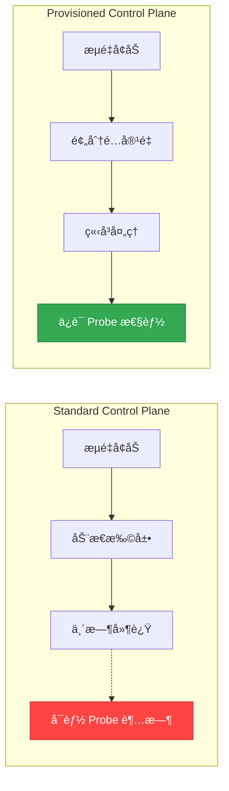

**创建 Provisioned Control Plane：**

```bash
# 创建 Provisioned Control Plane 集群（AWS CLI）
aws eks create-cluster \
  --name production-provisioned \
  --region ap-northeast-2 \
  --kubernetes-version 1.32 \
  --role-arn arn:aws:iam::123456789012:role/eks-cluster-role \
  --resources-vpc-config subnetIds=subnet-xxx,subnet-yyy,securityGroupIds=sg-zzz \
  --control-plane-type PROVISIONED \
  --control-plane-tier XL
```

**大规模 Probe 优化示例：**

```yaml
# AI/ML 训练集群（1000+ GPU 节点）
apiVersion: apps/v1
kind: Deployment
metadata:
  name: training-coordinator
  annotations:
    # 针对 Provisioned Control Plane 优化的 Probe é…ç½®
    eks.amazonaws.com/control-plane-tier: "XL"
spec:
  replicas: 50
  template:
    spec:
      containers:
      - name: coordinator
        image: ml-training/coordinator:v3
        resources:
          requests:
            cpu: 4
            memory: 16Gi
        # Provisioned Control Plane å¯ä»¥ä½¿ç”¨æ›´çŸ­çš„é—´éš”
        startupProbe:
          httpGet:
            path: /healthz
            port: 9090
          failureThreshold: 30
          periodSeconds: 3  # 快速检测
        livenessProbe:
          httpGet:
            path: /healthz
            port: 9090
          periodSeconds: 5  # 比 Standard 更短
          failureThreshold: 2
          timeoutSeconds: 2
        readinessProbe:
          httpGet:
            path: /ready
            port: 9090
          periodSeconds: 3
          failureThreshold: 1
          timeoutSeconds: 2
```

**使用案例：AI/ML 训练集群**

- **问题**: 在 1,000 个 GPU 节点上åŒæ—¶å¯åŠ¨æ•°ç™¾ä¸ª Training Pod 时，Standard Control Plane å‡ºç° API Server å“应延迟
- **解决方案**: 使用 Provisioned Control Plane XL tier
- **æˆæœ**:
  - Pod 调度时间å‡å°‘ 70%（平å‡ä» 45 秒é™è‡³ 13 秒）
  - Readiness Probe 超时å‡å°‘ 99.8%
  - Training Job å¯åŠ¨å¯é æ€§æå‡

**æˆæœ¬ä¸æ€§èƒ½è€ƒè™‘：**

```yaml
# Provisioned Control Plane æˆæœ¬ä¼˜åŒ–ç­–ç•¥
# 1. 日常æ“作：Standard Control Plane
# 2. 训练期间：å‡çº§åˆ° Provisioned Control Plane XL
# （目å‰åœ¨é›†ç¾¤åˆ›å»ºæ—¶é€‰æ‹©ï¼›æœªæ¥è®¡åˆ’支æŒåŠ¨æ€åˆ‡æ¢ï¼‰
```

:::tip HPC 和大规模批处ç†å·¥ä½œè´Ÿè½½
Provisioned Control Plane 针对在短时间内åŒæ—¶å¯åŠ¨æ•°åƒä¸ª Pod 的工作负载进行了优化。它为 AI/ML 训练ã€ç§‘学模拟和大规模数æ®å¤„ç†ä¿è¯ Probe 性能，å‡å°‘ Job å¯åŠ¨æ—¶é—´ã€‚
:::

---

#### 2.7.4 GuardDuty Extended Threat Detection 集æˆ

**概述：**

GuardDuty Extended Threat Detection（EKS 支æŒï¼š2025 å¹´ 6 月）å¯æ£€æµ‹ Probe 端点的异常访问模å¼ï¼Œè¯†åˆ«æ¶æ„工作负载试图绕过或æ“纵å¥åº·æ£€æŸ¥çš„攻击。

**主è¦ç‰¹æ€§ï¼š**
- EKS 审计日志 + è¿è¡Œæ—¶è¡Œä¸º + æ¶æ„软件执行 + AWS API 活动的关è”分æ
- åŸºäº AI/ML 的多阶段攻击åºåˆ—检测
- Probe 端点异常访问模å¼è¯†åˆ«
- 自动检测加密挖矿等æ¶æ„工作负载

**å¯ç”¨ï¼š**

```bash
# 为 EKS å¯ç”¨ GuardDuty Extended Threat Detection（AWS CLI）
aws guardduty update-detector \
  --detector-id <detector-id> \
  --features '[
    {
      "Name": "EKS_AUDIT_LOGS",
      "Status": "ENABLED"
    },
    {
      "Name": "EKS_RUNTIME_MONITORING",
      "Status": "ENABLED",
      "AdditionalConfiguration": [
        {
          "Name": "EKS_ADDON_MANAGEMENT",
          "Status": "ENABLED"
        }
      ]
    }
  ]'
```

**Probe 端点安全模å¼ï¼š**

```yaml
apiVersion: apps/v1
kind: Deployment
metadata:
  name: secure-api
spec:
  replicas: 3
  template:
    spec:
      containers:
      - name: api
        image: myapp/secure-api:v2
        ports:
        - containerPort: 8080
        # å¥åº·æ£€æŸ¥ç«¯ç‚¹
        livenessProbe:
          httpGet:
            path: /healthz
            port: 8080
            httpHeaders:
            - name: X-Health-Check-Token
              value: "SECRET_TOKEN_FROM_ENV"
          periodSeconds: 10
        readinessProbe:
          httpGet:
            path: /ready
            port: 8080
            httpHeaders:
            - name: X-Health-Check-Token
              value: "SECRET_TOKEN_FROM_ENV"
          periodSeconds: 5
        env:
        - name: HEALTH_CHECK_TOKEN
          valueFrom:
            secretKeyRef:
              name: api-secrets
              key: health-token
```

**GuardDuty 检测场景：**

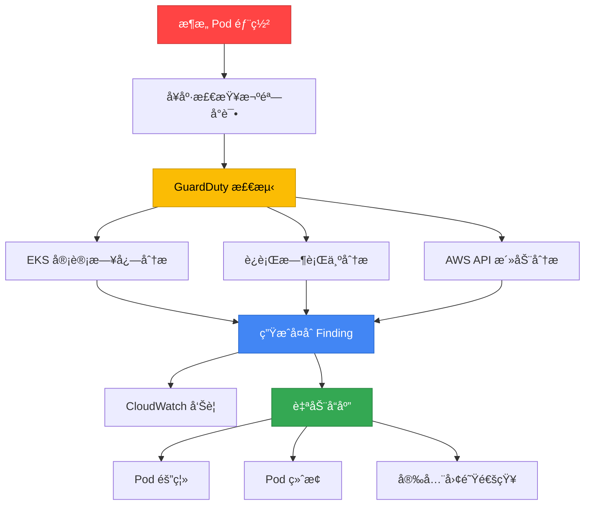

**真å®æ£€æµ‹æ¡ˆä¾‹ - 加密挖矿攻击：**

在 2025 å¹´ 11 月 2 æ—¥ GuardDuty 检测到的加密挖矿攻击中，攻击者按以下方å¼ç»•è¿‡å¥åº·æ£€æŸ¥ï¼š

1. 伪装为åˆæ³•å®¹å™¨é•œåƒ
2. 在 startupProbe æˆåŠŸå下载æ¶æ„二进制文件
3. livenessProbe è¿”å›æ­£å¸¸å“应，åŒæ—¶åœ¨åå°è¿è¡ŒæŒ–矿程åº
4. GuardDuty 检测到异常网络æµé‡ + CPU 使用模å¼

**检测å的自动å“应：**

```yaml
# EventBridge Rule：GuardDuty Finding → Lambda → Pod 隔离
apiVersion: v1
kind: ConfigMap
metadata:
  name: guardduty-response
  namespace: security
data:
  eventbridge-rule: |
    {
      "source": ["aws.guardduty"],
      "detail-type": ["GuardDuty Finding"],
      "detail": {
        "service": {
          "serviceName": ["EKS"]
        },
        "severity": [7, 8, 9]  # High, Critical
      }
    }
  lambda-action: |
    import boto3
    eks = boto3.client('eks')

    def isolate_pod(cluster_name, namespace, pod_name):
        # 使用 NetworkPolicy 隔离 Pod
        kubectl_command = f"""
        kubectl apply -f - <<EOF
        apiVersion: networking.k8s.io/v1
        kind: NetworkPolicy
        metadata:
          name: isolate-{pod_name}
          namespace: {namespace}
        spec:
          podSelector:
            matchLabels:
              pod: {pod_name}
          policyTypes:
          - Ingress
          - Egress
        EOF
        """
        # 执行逻辑...
```

**å®‰å…¨ç›‘æ§ Dashboard：**

```yaml
# CloudWatch Dashboard：GuardDuty + Probe 状æ€
apiVersion: cloudwatch.amazonaws.com/v1alpha1
kind: Dashboard
metadata:
  name: security-probe-monitoring
spec:
  widgets:
    - type: metric
      title: "GuardDuty 检测 vs Probe 失败"
      metrics:
        - namespace: AWS/GuardDuty
          metricName: FindingCount
          dimensions:
            - name: ClusterName
              value: production-eks
        - namespace: ContainerInsights
          metricName: ProbeFailure
          dimensions:
            - name: Namespace
              value: production
```

:::warning å¥åº·æ£€æŸ¥ç«¯ç‚¹å®‰å…¨
Probe 端点（`/healthz`ã€`/ready`）通常在没有身份验è¯çš„情况下公开暴露，这å¯èƒ½æˆä¸ºæ”»å‡»é¢ã€‚å¯ç”¨ GuardDuty Extended Threat Detection，并在å¯èƒ½çš„情况下å‘å¥åº·æ£€æŸ¥è¯·æ±‚添加简å•çš„ Token Header，以é™åˆ¶æœªæˆæƒè®¿é—®ã€‚
:::

**相关文档：**
- [AWS åšå®¢ï¼šGuardDuty Extended Threat Detection for EKS](https://aws.amazon.com/blogs/aws/amazon-guardduty-expands-extended-threat-detection-coverage-to-amazon-eks-clusters/)
- [AWS åšå®¢ï¼šåŠ å¯†æŒ–矿攻击检测](https://aws.amazon.com/blogs/security/cryptomining-campaign-targeting-amazon-ec2-and-amazon-ecs/)
- [EKS 安全最佳å®è·µ](https://docs.aws.amazon.com/eks/latest/best-practices/security.html)

---
## 3. Graceful Shutdown 完整指å—

Graceful Shutdown 是一ç§åœ¨ Pod 终止时安全完æˆæ­£åœ¨å¤„ç†çš„请求并åœæ­¢æ¥å—新请求的模å¼ã€‚它对äºé›¶åœæœºéƒ¨ç½²å’Œæ•°æ®å®Œæ•´æ€§è‡³å…³é‡è¦ã€‚

### 3.1 Pod 终止åºåˆ—详解

在 Kubernetes 中，Pod 终止按以下顺åºè¿›è¡Œã€‚

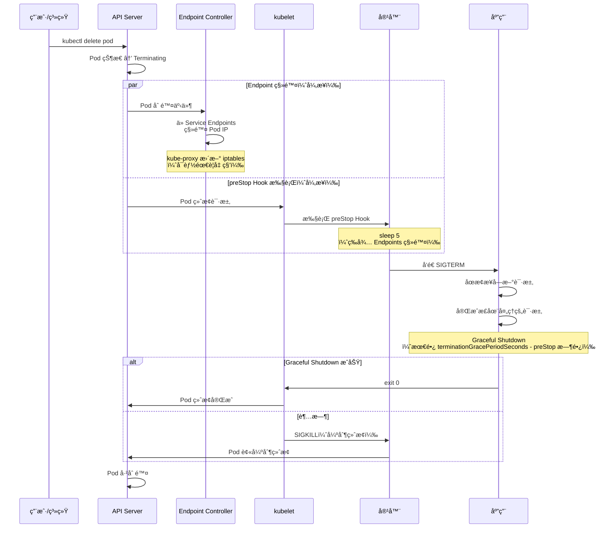

**时间详情：**

1. **T+0s**: 通过 `kubectl delete pod` 或滚动更新请求删除 Pod
2. **T+0s**: API Server å°† Pod 状æ€æ›´æ”¹ä¸º `Terminating`
3. **T+0s**: 两个æ“作**异步**并行开始：
   - Endpoint Controller ä» Service Endpoints 移除 Pod IP
   - kubelet 执行 preStop Hook
4. **T+0~5s**: preStop Hook 执行 `sleep 5`（等待 Endpoints 移除）
5. **T+5s**: preStop Hook 执行 `kill -TERM 1` → å‘é€ SIGTERM
6. **T+5s**: 应用æ¥æ”¶ SIGTERM，开始 Graceful Shutdown
7. **T+5~60s**: 应用完æˆæ­£åœ¨å¤„ç†çš„请求并执行清ç†ä»»åŠ¡
8. **T+60s**: 达到 `terminationGracePeriodSeconds` æ—¶å‘é€ SIGKILL（强制终止）

:::tip ä¸ºä»€ä¹ˆéœ€è¦ preStop sleep
Endpoint 移除和 preStop Hook 执行是**异步**å‘生的。在 preStop 中添加 5 秒的 sleep å¯ç¡®ä¿ Endpoint Controller å’Œ kube-proxy 有时间更新 iptables，使新æµé‡ä¸å†è·¯ç”±åˆ°æ­£åœ¨ç»ˆæ­¢çš„ Pod。如æœæ²¡æœ‰æ­¤æ¨¡å¼ï¼Œæµé‡å¯èƒ½ä¼šç»§ç»­å‘é€åˆ°æ­£åœ¨ç»ˆæ­¢çš„ Pod，导致 502/503 错误。
:::

### 3.2 å„语言的 SIGTERM 处ç†æ¨¡å¼

#### Node.js (Express)

```javascript
const express = require('express');
const app = express();
const server = app.listen(8080);

// 状æ€æ ‡å¿—
let isShuttingDown = false;

// å¥åº·æ£€æŸ¥ç«¯ç‚¹
app.get('/healthz', (req, res) => {
  res.status(200).json({ status: 'ok' });
});

app.get('/ready', (req, res) => {
  if (isShuttingDown) {
    return res.status(503).json({ status: 'shutting_down' });
  }
  res.status(200).json({ status: 'ready' });
});

// 业务逻辑
app.get('/api/data', (req, res) => {
  if (isShuttingDown) {
    return res.status(503).send('Service Unavailable');
  }
  // å®é™…逻辑
  res.json({ data: 'example' });
});

// Graceful Shutdown 处ç†å™¨
function gracefulShutdown(signal) {
  console.log(`${signal} received, starting graceful shutdown`);
  isShuttingDown = true;

  // æ‹’ç»æ–°è¿æ¥
  server.close(() => {
    console.log('HTTP server closed');

    // 关闭 DB è¿æ¥
    // db.close();

    // 退出进程
    process.exit(0);
  });

  // 设置超时（在 SIGKILL 之å‰å®Œæˆï¼‰
  setTimeout(() => {
    console.error('Graceful shutdown timeout, forcing exit');
    process.exit(1);
  }, 50000); // terminationGracePeriodSeconds - preStop 时长 - 5s 缓冲
}

// å¤„ç† SIGTERMã€SIGINT
process.on('SIGTERM', () => gracefulShutdown('SIGTERM'));
process.on('SIGINT', () => gracefulShutdown('SIGINT'));

console.log('Server started on port 8080');
```

**Deployment é…置：**

```yaml
apiVersion: apps/v1
kind: Deployment
metadata:
  name: nodejs-app
spec:
  replicas: 3
  template:
    spec:
      containers:
      - name: app
        image: myapp/nodejs:v1
        ports:
        - containerPort: 8080
        readinessProbe:
          httpGet:
            path: /ready
            port: 8080
          periodSeconds: 5
        lifecycle:
          preStop:
            exec:
              command: ["/bin/sh", "-c", "sleep 5"]
      terminationGracePeriodSeconds: 60
```

#### Java/Spring Boot

Spring Boot 2.3+ åŸç”Ÿæ”¯æŒ Graceful Shutdown。

**application.yml：**

```yaml
server:
  shutdown: graceful  # å¯ç”¨ Graceful Shutdown

spring:
  lifecycle:
    timeout-per-shutdown-phase: 50s  # 最大等待时间
management:
  endpoints:
    web:
      exposure:
        include: health
  endpoint:
    health:
      probes:
        enabled: true
  health:
    livenessState:
      enabled: true
    readinessState:
      enabled: true
```

**自定义关闭逻辑（如æœéœ€è¦ï¼‰ï¼š**

```java
import org.springframework.context.event.ContextClosedEvent;
import org.springframework.context.event.EventListener;
import org.springframework.stereotype.Component;

@Component
public class GracefulShutdownListener {

    @EventListener
    public void onApplicationEvent(ContextClosedEvent event) {
        System.out.println("Graceful shutdown initiated");

        // 自定义清ç†ä»»åŠ¡
        // 例如，刷新消æ¯é˜Ÿåˆ—ã€ç­‰å¾…批处ç†ä½œä¸šå®Œæˆ
        try {
            // 最多等待 50 秒
            cleanupResources();
        } catch (Exception e) {
            System.err.println("Cleanup error: " + e.getMessage());
        }
    }

    private void cleanupResources() throws InterruptedException {
        // 资æºæ¸…ç†é€»è¾‘
        Thread.sleep(5000); // 示例：5 秒清ç†ä»»åŠ¡
        System.out.println("Cleanup completed");
    }
}
```

**Deployment é…置：**

```yaml
apiVersion: apps/v1
kind: Deployment
metadata:
  name: spring-boot-app
spec:
  replicas: 3
  template:
    spec:
      containers:
      - name: app
        image: myapp/spring-boot:v2.7
        ports:
        - containerPort: 8080
        env:
        - name: JAVA_OPTS
          value: "-Xms1g -Xmx2g"
        readinessProbe:
          httpGet:
            path: /actuator/health/readiness
            port: 8080
          periodSeconds: 5
        lifecycle:
          preStop:
            exec:
              command: ["/bin/sh", "-c", "sleep 5"]
      terminationGracePeriodSeconds: 60
```

#### Go

```go
package main

import (
    "context"
    "fmt"
    "log"
    "net/http"
    "os"
    "os/signal"
    "syscall"
    "time"
)

var isShuttingDown = false

func main() {
    // HTTP æœåŠ¡å™¨è®¾ç½®
    mux := http.NewServeMux()

    mux.HandleFunc("/healthz", func(w http.ResponseWriter, r *http.Request) {
        w.WriteHeader(http.StatusOK)
        fmt.Fprintln(w, "ok")
    })

    mux.HandleFunc("/ready", func(w http.ResponseWriter, r *http.Request) {
        if isShuttingDown {
            w.WriteHeader(http.StatusServiceUnavailable)
            fmt.Fprintln(w, "shutting down")
            return
        }
        w.WriteHeader(http.StatusOK)
        fmt.Fprintln(w, "ready")
    })

    mux.HandleFunc("/api/data", func(w http.ResponseWriter, r *http.Request) {
        if isShuttingDown {
            w.WriteHeader(http.StatusServiceUnavailable)
            return
        }
        // 业务逻辑
        fmt.Fprintln(w, `{"data":"example"}`)
    })

    server := &http.Server{
        Addr:    ":8080",
        Handler: mux,
    }

    // 在å•ç‹¬çš„ goroutine 中å¯åŠ¨æœåŠ¡å™¨
    go func() {
        log.Println("Server starting on :8080")
        if err := server.ListenAndServe(); err != nil && err != http.ErrServerClosed {
            log.Fatalf("Server error: %v", err)
        }
    }()

    // 等待 SIGTERM/SIGINT
    quit := make(chan os.Signal, 1)
    signal.Notify(quit, syscall.SIGTERM, syscall.SIGINT)
    <-quit

    log.Println("Graceful shutdown initiated")
    isShuttingDown = true

    // 带超时的 Graceful Shutdown
    ctx, cancel := context.WithTimeout(context.Background(), 50*time.Second)
    defer cancel()

    if err := server.Shutdown(ctx); err != nil {
        log.Fatalf("Server forced to shutdown: %v", err)
    }

    log.Println("Server exited gracefully")
}
```

**Deployment é…置：**

```yaml
apiVersion: apps/v1
kind: Deployment
metadata:
  name: go-app
spec:
  replicas: 3
  template:
    spec:
      containers:
      - name: app
        image: myapp/go-app:v1
        ports:
        - containerPort: 8080
        readinessProbe:
          httpGet:
            path: /ready
            port: 8080
          periodSeconds: 5
        lifecycle:
          preStop:
            exec:
              command: ["/bin/sh", "-c", "sleep 5"]
      terminationGracePeriodSeconds: 60
```

#### Python (Flask)

```python
from flask import Flask, jsonify
import signal
import sys
import time
import threading

app = Flask(__name__)
is_shutting_down = False

@app.route('/healthz')
def healthz():
    return jsonify({"status": "ok"}), 200

@app.route('/ready')
def ready():
    if is_shutting_down:
        return jsonify({"status": "shutting_down"}), 503
    return jsonify({"status": "ready"}), 200

@app.route('/api/data')
def api_data():
    if is_shutting_down:
        return jsonify({"error": "service unavailable"}), 503
    return jsonify({"data": "example"}), 200

def graceful_shutdown(signum, frame):
    global is_shutting_down
    print(f"Signal {signum} received, starting graceful shutdown")
    is_shutting_down = True

    # 清ç†ä»»åŠ¡ï¼ˆå¦‚关闭 DB è¿æ¥ï¼‰
    # db.close()

    print("Graceful shutdown completed")
    sys.exit(0)

# 注册 SIGTERM 处ç†å™¨
signal.signal(signal.SIGTERM, graceful_shutdown)
signal.signal(signal.SIGINT, graceful_shutdown)

if __name__ == '__main__':
    app.run(host='0.0.0.0', port=8080)
```

**Deployment é…置：**

```yaml
apiVersion: apps/v1
kind: Deployment
metadata:
  name: python-app
spec:
  replicas: 3
  template:
    spec:
      containers:
      - name: app
        image: myapp/python-flask:v1
        ports:
        - containerPort: 8080
        readinessProbe:
          httpGet:
            path: /ready
            port: 8080
          periodSeconds: 5
        lifecycle:
          preStop:
            exec:
              command: ["/bin/sh", "-c", "sleep 5"]
      terminationGracePeriodSeconds: 60
```

### 3.3 Connection Draining 模å¼

Connection Draining 是一ç§åœ¨å…³é—­æœŸé—´å®‰å…¨æ¸…ç†ç°æœ‰è¿æ¥çš„模å¼ã€‚

#### HTTP Keep-Alive è¿æ¥å¤„ç†

```javascript
// Node.js Express with Connection Draining
const express = require('express');
const app = express();
const server = app.listen(8080);

let isShuttingDown = false;
const activeConnections = new Set();

// 跟踪è¿æ¥
server.on('connection', (conn) => {
  activeConnections.add(conn);
  conn.on('close', () => {
    activeConnections.delete(conn);
  });
});

function gracefulShutdown(signal) {
  console.log(`${signal} received`);
  isShuttingDown = true;

  // æ‹’ç»æ–°è¿æ¥
  server.close(() => {
    console.log('Server closed, no new connections');
  });

  // 关闭ç°æœ‰è¿æ¥
  console.log(`Closing ${activeConnections.size} active connections`);
  activeConnections.forEach((conn) => {
    conn.destroy(); // 强制关闭（或使用 conn.end() 优雅关闭）
  });

  // 清ç†å退出
  setTimeout(() => {
    console.log('Graceful shutdown complete');
    process.exit(0);
  }, 5000);
}

process.on('SIGTERM', () => gracefulShutdown('SIGTERM'));
```

#### WebSocket è¿æ¥æ¸…ç†

```javascript
// WebSocket graceful shutdown
const WebSocket = require('ws');
const wss = new WebSocket.Server({ port: 8080 });

const clients = new Set();

wss.on('connection', (ws) => {
  clients.add(ws);

  ws.on('close', () => {
    clients.delete(ws);
  });

  ws.on('message', (message) => {
    // 处ç†æ¶ˆæ¯
  });
});

function gracefulShutdown() {
  console.log(`Closing ${clients.size} WebSocket connections`);

  clients.forEach((ws) => {
    // 通知客户端关闭
    ws.send(JSON.stringify({ type: 'server_shutdown' }));
    ws.close(1001, 'Server shutting down');
  });

  wss.close(() => {
    console.log('WebSocket server closed');
    process.exit(0);
  });
}

process.on('SIGTERM', gracefulShutdown);
```

#### gRPC Graceful Shutdown

```go
package main

import (
    "context"
    "log"
    "net"
    "os"
    "os/signal"
    "syscall"
    "time"

    "google.golang.org/grpc"
    pb "myapp/proto"
)

type server struct {
    pb.UnimplementedMyServiceServer
}

func main() {
    lis, err := net.Listen("tcp", ":9090")
    if err != nil {
        log.Fatalf("Failed to listen: %v", err)
    }

    s := grpc.NewServer()
    pb.RegisterMyServiceServer(s, &server{})

    go func() {
        log.Println("gRPC server starting on :9090")
        if err := s.Serve(lis); err != nil {
            log.Fatalf("Failed to serve: %v", err)
        }
    }()

    // 等待 SIGTERM
    quit := make(chan os.Signal, 1)
    signal.Notify(quit, syscall.SIGTERM, syscall.SIGINT)
    <-quit

    log.Println("Graceful shutdown initiated")

    // GracefulStop：等待正在处ç†çš„ RPC 完æˆ
    done := make(chan struct{})
    go func() {
        s.GracefulStop()
        close(done)
    }()

    // 处ç†è¶…æ—¶
    select {
    case <-done:
        log.Println("gRPC server stopped gracefully")
    case <-time.After(50 * time.Second):
        log.Println("Graceful stop timeout, forcing stop")
        s.Stop() // 强制åœæ­¢
    }
}
```

#### æ•°æ®åº“è¿æ¥æ± æ¸…ç†

```python
# Python with psycopg2 connection pool
import psycopg2
from psycopg2 import pool
import signal
import sys

# è¿æ¥æ± 
db_pool = psycopg2.pool.SimpleConnectionPool(
    minconn=1,
    maxconn=10,
    host='db.example.com',
    database='mydb',
    user='user',
    password='password'
)

def graceful_shutdown(signum, frame):
    print("Closing database connections...")

    # 关闭所有è¿æ¥
    db_pool.closeall()

    print("Database connections closed")
    sys.exit(0)

signal.signal(signal.SIGTERM, graceful_shutdown)

# 应用逻辑
def query_database():
    conn = db_pool.getconn()
    try:
        cur = conn.cursor()
        cur.execute("SELECT * FROM users")
        return cur.fetchall()
    finally:
        db_pool.putconn(conn)
```

### 3.4 ä¸ Karpenter/Node Drain 的交互

当 Karpenter 进行节点整åˆæˆ– Spot å®ä¾‹è¢«ç»ˆæ­¢æ—¶ï¼ŒèŠ‚点上的所有 Pod 必须被安全è¿ç§»ã€‚

#### Karpenter Disruption ä¸ Graceful Shutdown

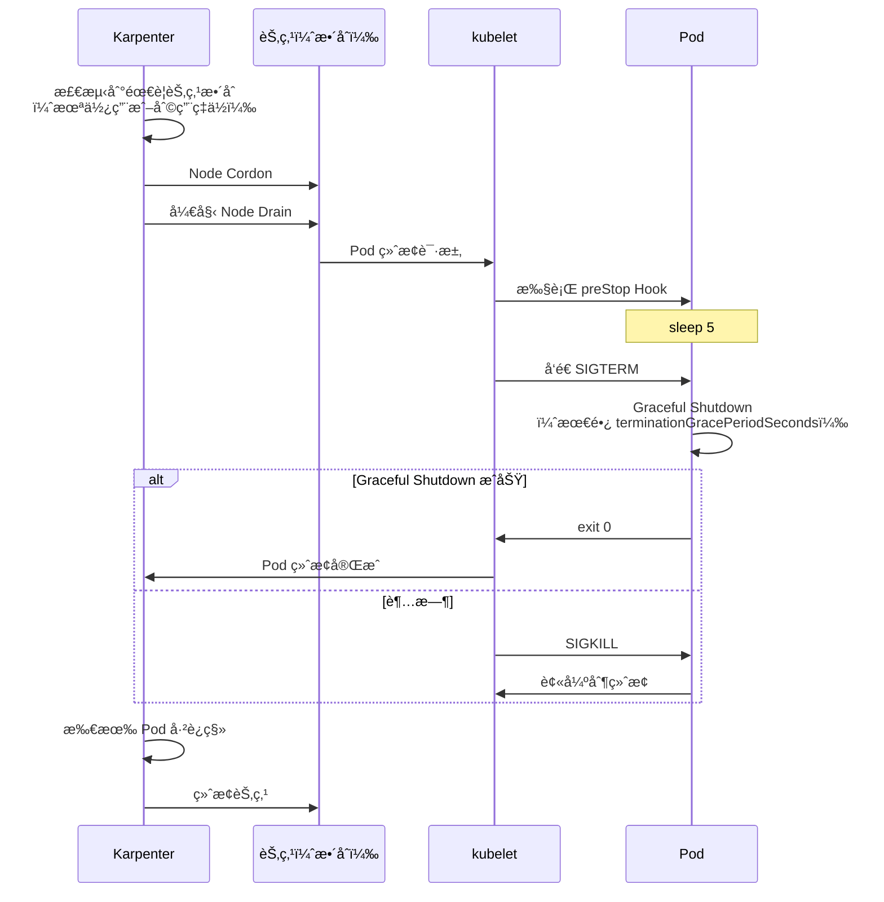

**Karpenter NodePool é…置：**

```yaml
apiVersion: karpenter.sh/v1
kind: NodePool
metadata:
  name: default
spec:
  disruption:
    consolidationPolicy: WhenEmptyOrUnderutilized
    consolidateAfter: 5m
    # Disruption 预算：é™åˆ¶å¹¶å‘节点中断
    budgets:
    - nodes: "20%"
      schedule: "0 9-17 * * MON-FRI"  # 工作时间 20%
    - nodes: "50%"
      schedule: "0 0-8,18-23 * * *"   # é工作时间 50%
```

:::warning PDB ä¸ Karpenter 的交互
å¦‚æœ PodDisruptionBudget 过äºä¸¥æ ¼ï¼ˆä¾‹å¦‚ `minAvailable` ç­‰äºå‰¯æœ¬æ•°ï¼‰ï¼ŒKarpenter 将无法 Drain 节点。将 PDB 设置为 `minAvailable: replica - 1` 或 `maxUnavailable: 1`，以确ä¿è‡³å°‘一个 Pod å¯ä»¥è¢«è¿ç§»ã€‚
:::

#### 3.4.3 ARC + Karpenter é›†æˆ AZ ç–散模å¼

**概述：**

AWS Application Recovery Controller (ARC) ä¸ Karpenter 的集æˆï¼ˆ2025 å¹´å‘布）æ供了一ç§é«˜å¯ç”¨æ¨¡å¼ï¼Œåœ¨å¯ç”¨åŒº (AZ) 故障期间自动将工作负载è¿ç§»åˆ°ä¸åŒçš„ AZ。这确ä¿äº† AZ 故障或ç°è‰²æ•…障场景下的 Graceful Shutdown，最大程度å‡å°‘æœåŠ¡ä¸­æ–­ã€‚

**什么是 ARC Zonal Shift：**

Zonal Shift 是一ç§è‡ªåŠ¨å°†æµé‡ä»æ•…障或性能é™çº§çš„ AZ é‡å®šå‘到其他å¥åº· AZ çš„èƒ½åŠ›ã€‚å½“ä¸ EKS 集æˆæ—¶ï¼Œå®ƒè¿˜èƒ½è‡ªåŠ¨åŒ– Pod 的安全è¿ç§»ã€‚

**æ¶æ„组件：**

| 组件 | 角色 | 行为 |
|-----------|------|----------|
| **ARC Zonal Autoshift** | 自动 AZ 故障检测和æµé‡åˆ‡æ¢å†³ç­– | åŸºäº CloudWatch Alarms 的自动 Shift |
| **Karpenter** | 在新 AZ 中é…置节点 | åŸºäº NodePool é…置在å¥åº· AZ 中创建节点 |
| **AWS Load Balancer** | æµé‡è·¯ç”±æ§åˆ¶ | 移除故障 AZ 中的 Target |
| **PodDisruptionBudget** | ç¡®ä¿ Pod è¿ç§»æœŸé—´çš„å¯ç”¨æ€§ | ç»´æŒæœ€å°å¯ç”¨ Pod æ•° |

**AZ ç–æ•£åºåˆ—：**

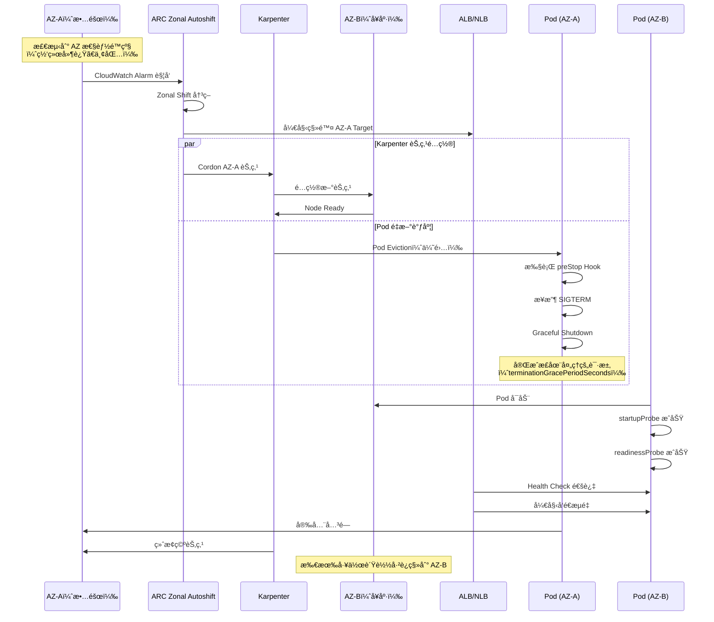

**é…置示例：**

**1. å¯ç”¨ ARC Zonal Autoshift：**

```bash
# 在 Load Balancer 上å¯ç”¨ Zonal Autoshift
aws arc-zonal-shift create-autoshift-observer-notification-configuration \
  --resource-identifier arn:aws:elasticloadbalancing:ap-northeast-2:123456789012:loadbalancer/app/production-alb/1234567890abcdef

# é…ç½® Zonal Autoshift
aws arc-zonal-shift update-zonal-autoshift-configuration \
  --resource-identifier arn:aws:elasticloadbalancing:ap-northeast-2:123456789012:loadbalancer/app/production-alb/1234567890abcdef \
  --zonal-autoshift-status ENABLED
```

**2. Karpenter NodePool - AZ 感知é…置：**

```yaml
apiVersion: karpenter.sh/v1
kind: NodePool
metadata:
  name: default
spec:
  disruption:
    consolidationPolicy: WhenEmptyOrUnderutilized
    consolidateAfter: 30s
    # AZ 故障时快速å“应
    budgets:
    - nodes: "100%"
      reasons:
      - "Drifted"  # AZ 被 Cordon 时立å³æ›¿æ¢
  template:
    spec:
      requirements:
      - key: "topology.kubernetes.io/zone"
        operator: In
        values:
        - ap-northeast-2a
        - ap-northeast-2b
        - ap-northeast-2c
      - key: karpenter.sh/capacity-type
        operator: In
        values:
        - on-demand  # AZ æ•…éšœå“应æ¨è使用 On-Demand
      nodeClassRef:
        name: default
---
apiVersion: karpenter.k8s.aws/v1
kind: EC2NodeClass
metadata:
  name: default
spec:
  amiFamily: AL2023
  role: "KarpenterNodeRole-production"
  subnetSelectorTerms:
  - tags:
      karpenter.sh/discovery: "production-eks"
  securityGroupSelectorTerms:
  - tags:
      karpenter.sh/discovery: "production-eks"
  # AZ 故障时自动检测
  metadataOptions:
    httpTokens: required
    httpPutResponseHopLimit: 2
```

**3. 带 PDB 的 Deployment - AZ 分布：**

```yaml
apiVersion: apps/v1
kind: Deployment
metadata:
  name: critical-api
spec:
  replicas: 6
  selector:
    matchLabels:
      app: critical-api
  template:
    metadata:
      labels:
        app: critical-api
    spec:
      # ç¡®ä¿ AZ 分布
      topologySpreadConstraints:
      - maxSkew: 1
        topologyKey: topology.kubernetes.io/zone
        whenUnsatisfiable: DoNotSchedule
        labelSelector:
          matchLabels:
            app: critical-api
      # 防止åŒèŠ‚点共置
      affinity:
        podAntiAffinity:
          preferredDuringSchedulingIgnoredDuringExecution:
          - weight: 100
            podAffinityTerm:
              labelSelector:
                matchLabels:
                  app: critical-api
              topologyKey: kubernetes.io/hostname
      containers:
      - name: api
        image: myapp/critical-api:v3
        ports:
        - containerPort: 8080
        resources:
          requests:
            cpu: 500m
            memory: 1Gi
        readinessProbe:
          httpGet:
            path: /ready
            port: 8080
          periodSeconds: 5
          failureThreshold: 2
        livenessProbe:
          httpGet:
            path: /healthz
            port: 8080
          periodSeconds: 10
        lifecycle:
          preStop:
            exec:
              command:
              - /bin/sh
              - -c
              - sleep 5
      terminationGracePeriodSeconds: 60
---
apiVersion: policy/v1
kind: PodDisruptionBudget
metadata:
  name: critical-api-pdb
spec:
  minAvailable: 4  # 6 个中ä¿æŒè‡³å°‘ 4 个（AZ æ•…éšœæ—¶ä» 2 个 AZ è¿è¡Œï¼‰
  selector:
    matchLabels:
      app: critical-api
```

**4. CloudWatch Alarm - AZ 性能é™çº§æ£€æµ‹ï¼š**

```yaml
apiVersion: v1
kind: ConfigMap
metadata:
  name: az-health-monitoring
  namespace: monitoring
data:
  cloudwatch-alarm: |
    {
      "AlarmName": "AZ-A-NetworkLatency-High",
      "MetricName": "NetworkLatency",
      "Namespace": "AWS/EC2",
      "Statistic": "Average",
      "Period": 60,
      "EvaluationPeriods": 3,
      "Threshold": 100,
      "ComparisonOperator": "GreaterThanThreshold",
      "Dimensions": [
        {"Name": "AvailabilityZone", "Value": "ap-northeast-2a"}
      ],
      "AlarmDescription": "AZ-A 网络延迟å¢åŠ  - Zonal Shift 触å‘",
      "AlarmActions": [
        "arn:aws:arc-zonal-shift:ap-northeast-2:123456789012:autoshift-observer-notification"
      ]
    }
```

**ç»“åˆ Istio Service Mesh 的端到端 AZ æ¢å¤ï¼š**

ä¸ Istio Service Mesh 集æˆå¯åœ¨ AZ ç–散期间å®ç°æ›´ç²¾ç»†çš„æµé‡æ§åˆ¶ï¼š

```yaml
# Istio DestinationRuleï¼šåŸºäº AZ çš„æµé‡è·¯ç”±
apiVersion: networking.istio.io/v1beta1
kind: DestinationRule
metadata:
  name: critical-api-az-routing
spec:
  host: critical-api.production.svc.cluster.local
  trafficPolicy:
    loadBalancer:
      localityLbSetting:
        enabled: true
        distribute:
        - from: ap-northeast-2a/*
          to:
            "ap-northeast-2b/*": 50
            "ap-northeast-2c/*": 50
        - from: ap-northeast-2b/*
          to:
            "ap-northeast-2a/*": 50
            "ap-northeast-2c/*": 50
        - from: ap-northeast-2c/*
          to:
            "ap-northeast-2a/*": 50
            "ap-northeast-2b/*": 50
    outlierDetection:
      consecutiveErrors: 3
      interval: 10s
      baseEjectionTime: 30s
      maxEjectionPercent: 50
---
# VirtualService：AZ 故障时的自动é‡è·¯ç”±
apiVersion: networking.istio.io/v1beta1
kind: VirtualService
metadata:
  name: critical-api-failover
spec:
  hosts:
  - critical-api.production.svc.cluster.local
  http:
  - match:
    - sourceLabels:
        topology.kubernetes.io/zone: ap-northeast-2a
    route:
    - destination:
        host: critical-api.production.svc.cluster.local
        subset: az-b
      weight: 50
    - destination:
        host: critical-api.production.svc.cluster.local
        subset: az-c
      weight: 50
    timeout: 3s
    retries:
      attempts: 3
      perTryTimeout: 1s
```

**ç°è‰²æ•…障处ç†ç­–略：**

ç°è‰²æ•…障是性能é™çº§è€Œé完全中断的状æ€ï¼Œéš¾ä»¥æ£€æµ‹ã€‚å¯ä»¥ä½¿ç”¨ ARC + Karpenter + Istio 组åˆæ¥åº”对：

| ç°è‰²æ•…障症状 | 检测方法 | 自动å“应 |
|---------------------|-----------------|-------------------|
| 网络延迟å¢åŠ ï¼ˆ50-200ms） | Container Network Observability | Istio Outlier Detection → æµé‡ç»•è¡Œ |
| 间歇性丢包（1-5%） | CloudWatch Network Metrics | ARC Zonal Shift è§¦å‘ |
| ç£ç›˜ I/O é™çº§ | EBS CloudWatch Metrics | Karpenter èŠ‚ç‚¹æ›¿æ¢ |
| API Server å“应延迟 | Control Plane Metrics | Provisioned Control Plane 自动扩展 |

**测试ä¸éªŒè¯ï¼š**

```bash
# AZ 故障模拟（混沌工程）
kubectl apply -f - <<EOF
apiVersion: v1
kind: ConfigMap
metadata:
  name: az-failure-test
  namespace: chaos
data:
  experiment: |
    # 1. 为 AZ-A 的所有节点添加 Taint（模拟 AZ 故障）
    kubectl taint nodes -l topology.kubernetes.io/zone=ap-northeast-2a \
      az-failure=true:NoSchedule

    # 2. éªŒè¯ Karpenter 在 AZ-Bã€AZ-C 创建新节点
    kubectl get nodes -l topology.kubernetes.io/zone=ap-northeast-2b,ap-northeast-2c

    # 3. ç›‘æ§ Pod è¿ç§»
    kubectl get pods -o wide --watch

    # 4. éªŒè¯ PDB åˆè§„（minAvailable ç»´æŒï¼‰
    kubectl get pdb critical-api-pdb

    # 5. 检查 Graceful Shutdown 日志
    kubectl logs <pod-name> --previous

    # 6. æ¢å¤ï¼ˆç§»é™¤ Taint）
    kubectl taint nodes -l topology.kubernetes.io/zone=ap-northeast-2a \
      az-failure-
EOF
```

**ç›‘æ§ Dashboard：**

```yaml
# Grafana Dashboard：AZ å¥åº·å’Œç–散状æ€
apiVersion: v1
kind: ConfigMap
metadata:
  name: az-failover-dashboard
  namespace: monitoring
data:
  dashboard.json: |
    {
      "panels": [
        {
          "title": "Pod Distribution by AZ",
          "targets": [
            {
              "expr": "count(kube_pod_info) by (node, zone)"
            }
          ]
        },
        {
          "title": "Network Latency by AZ",
          "targets": [
            {
              "expr": "avg(container_network_latency_ms) by (availability_zone)"
            }
          ]
        },
        {
          "title": "Karpenter Node Provisioning Rate",
          "targets": [
            {
              "expr": "rate(karpenter_nodes_created_total[5m])"
            }
          ]
        },
        {
          "title": "Graceful Shutdown Success Rate",
          "targets": [
            {
              "expr": "rate(pod_termination_graceful_total[5m]) / rate(pod_termination_total[5m])"
            }
          ]
        }
      ]
    }
```

**相关资æºï¼š**
- [AWS åšå®¢ï¼šARC + Karpenter 高å¯ç”¨é›†æˆ](https://aws.amazon.com/blogs/containers/enhance-kubernetes-high-availability-with-amazon-application-recovery-controller-and-karpenter-integration/)
- [AWS åšå®¢ï¼šåŸºäº Istio 的端到端 AZ æ¢å¤](https://aws.amazon.com/blogs/containers/)
- [AWS re:Invent 2025: Supercharge your Karpenter](https://www.youtube.com/watch?v=kUQ4Q11F4iQ)

:::tip è¿ç»´æœ€ä½³å®è·µ
AZ ç–散是自动化的，但需è¦é€šè¿‡å®šæœŸçš„混沌工程测试æ¥éªŒè¯ã€‚至少æ¯å­£åº¦è¿›è¡Œä¸€æ¬¡ AZ æ•…éšœæ¨¡æ‹Ÿï¼Œä»¥éªŒè¯ PDBã€Karpenter å’Œ Graceful Shutdown 是å¦æŒ‰é¢„期工作。特别是在生产ç¯å¢ƒä¸­æµ‹é‡ `terminationGracePeriodSeconds` 是å¦è¶³å¤Ÿé•¿äºå®é™…关闭时间。
:::

#### Spot å®ä¾‹ 2 分钟预警处ç†

AWS Spot å®ä¾‹åœ¨ç»ˆæ­¢å‰æä¾› 2 分钟预警。处ç†æ­¤é¢„è­¦ä»¥ç¡®ä¿ Graceful Shutdown。

**安装 AWS Node Termination Handler：**

```bash
helm repo add eks https://aws.github.io/eks-charts
helm repo update

helm install aws-node-termination-handler \
  --namespace kube-system \
  eks/aws-node-termination-handler \
  --set enableSpotInterruptionDraining=true \
  --set enableScheduledEventDraining=true
```

**工作åŸç†ï¼š**
1. 检测 2 分钟 Spot 终止预警
2. ç«‹å³ Cordon 节点（阻止新 Pod 调度）
3. Drain 节点上的所有 Pod
4. 在 Pod çš„ `terminationGracePeriodSeconds` å†…å®Œæˆ Graceful Shutdown

**建议的 terminationGracePeriodSeconds：**
- 一般 Web æœåŠ¡ï¼š30-60 秒
- 长时间è¿è¡Œçš„任务（批处ç†ã€ML æ¨ç†ï¼‰ï¼š90-120 秒
- 最大设置为 2 分钟以内（考虑 Spot 预警时间）

---
### 3.4.4 Node Readiness Controller -- 节点级就绪管ç†

#### 概述

Node Readiness Controller (NRC) 是 2026 å¹´ 2 月在 Kubernetes 官方åšå®¢ä¸Šå‘布的 alpha 特性（v0.1.1）。它是一ç§ç”¨äºå£°æ˜å¼ç®¡ç†èŠ‚点级基础设施就绪状æ€çš„新机制。

ç°æœ‰çš„ Kubernetes 节点 `Ready` æ¡ä»¶ä»…æ供简å•çš„二元状æ€ï¼ˆReady/NotReady），无法准确å映 CNI æ’件åˆå§‹åŒ–ã€GPU 驱动加载和存储驱动就绪等å¤æ‚的基础设施ä¾èµ–。NRC 通过æä¾› `NodeReadinessRule` CRD æ¥è§£å†³è¿™äº›é™åˆ¶ï¼Œå…许声æ˜å¼å®šä¹‰è‡ªå®šä¹‰å°±ç»ªé—¨æ§ã€‚

**核心价值：**
- **细粒度节点状æ€æ§åˆ¶**: 按基础设施组件独立管ç†å°±ç»ªçŠ¶æ€
- **自动化 Taint 管ç†**: æ¡ä»¶ä¸æ»¡è¶³æ—¶è‡ªåŠ¨åº”用 NoSchedule Taint
- **çµæ´»çš„监æ§æ¨¡å¼**: 支æŒä»…引导ã€æŒç»­ç›‘æ§å’Œ dry-run 模å¼
- **选择性应用**: 使用 nodeSelector 仅将规则应用äºç‰¹å®šèŠ‚点组

**API ä¿¡æ¯ï¼š**
- API Group: `readiness.node.x-k8s.io/v1alpha1`
- Kind: `NodeReadinessRule`
- 官方文档: https://node-readiness-controller.sigs.k8s.io/

#### 核心特性

##### 1. Continuous æ¨¡å¼ - æŒç»­ç›‘æ§

在整个节点生命周期中æŒç»­ç›‘æ§æŒ‡å®šæ¡ä»¶ã€‚如æœåŸºç¡€è®¾æ–½ç»„件在è¿è¡Œæ—¶æ•…障（如 GPU 驱动崩溃），会立å³åº”用 Taint 以阻止新的 Pod 调度。

**使用场景：**
- GPU 驱动状æ€ç›‘æ§
- 网络æ’件æŒç»­å¥åº·æ£€æŸ¥
- 存储驱动å¯ç”¨æ€§éªŒè¯

##### 2. Bootstrap-only æ¨¡å¼ - ä»…åˆå§‹åŒ–

仅在节点åˆå§‹åŒ–阶段检查æ¡ä»¶ï¼Œæ¡ä»¶æ»¡è¶³ååœæ­¢ç›‘æ§ã€‚引导完æˆå，ä¸å†å¯¹æ¡ä»¶å˜åŒ–åšå‡ºå应。

**使用场景：**
- CNI æ’件åˆå§‹å¼•å¯¼
- 容器镜åƒé¢„拉å–完æˆéªŒè¯
- 等待åˆå§‹å®‰å…¨æ‰«æ完æˆ

##### 3. Dry-run æ¨¡å¼ - 安全验è¯

模拟规则行为但ä¸å®é™…应用 Taint。适用äºåœ¨ç”Ÿäº§éƒ¨ç½²å‰éªŒè¯è§„则。

**使用场景：**
- 测试新的 NodeReadinessRule
- 分ææ¡ä»¶å˜åŒ–çš„å½±å“
- 调试和问题诊断

##### 4. nodeSelector - 目标节点选择

基äºæ ‡ç­¾ä»…将规则应用äºç‰¹å®šèŠ‚点组。å¯ä»¥å¯¹ GPU 节点和通用节点应用ä¸åŒçš„就绪规则。

#### YAML 示例

##### CNI 引导 - Bootstrap-only 模å¼

```yaml
apiVersion: readiness.node.x-k8s.io/v1alpha1
kind: NodeReadinessRule
metadata:
  name: network-readiness-rule
  namespace: kube-system
spec:
  # è¦æ£€æŸ¥çš„节点æ¡ä»¶
  conditions:
    - type: "cniplugin.example.net/NetworkReady"
      requiredStatus: "True"

  # æ¡ä»¶ä¸æ»¡è¶³æ—¶åº”用的 Taint
  taint:
    key: "readiness.k8s.io/acme.com/network-unavailable"
    effect: "NoSchedule"
    value: "pending"

  # 引导完æˆååœæ­¢ç›‘æ§
  enforcementMode: "bootstrap-only"

  # ä»…åº”ç”¨äº Worker 节点
  nodeSelector:
    matchLabels:
      node-role.kubernetes.io/worker: ""
```

**行为æµç¨‹ï¼š**
1. 新节点加入集群时，NRC 自动应用 Taint
2. CNI æ’件完æˆåˆå§‹åŒ–å，设置 `NetworkReady=True` æ¡ä»¶
3. NRC 验è¯æ¡ä»¶å¹¶ç§»é™¤ Taint
4. Pod 调度å˜ä¸ºå¯ç”¨ï¼ˆåç»­ CNI 状æ€å˜åŒ–被忽略）

##### GPU 节点æŒç»­ç›‘æ§

```yaml
apiVersion: readiness.node.x-k8s.io/v1alpha1
kind: NodeReadinessRule
metadata:
  name: gpu-driver-readiness
  namespace: kube-system
spec:
  conditions:
    - type: "nvidia.com/gpu-driver-ready"
      requiredStatus: "True"

  taint:
    key: "readiness.k8s.io/gpu-unavailable"
    effect: "NoSchedule"
    value: "driver-not-ready"

  # è¿è¡Œæ—¶æŒç»­ç›‘æ§
  enforcementMode: "continuous"

  # ä»…åº”ç”¨äº GPU 节点
  nodeSelector:
    matchLabels:
      nvidia.com/gpu.present: "true"
```

**行为æµç¨‹ï¼š**
1. GPU 节点å¯åŠ¨æ—¶è‡ªåŠ¨åº”用 Taint
2. NVIDIA 驱动守护进程在 GPU åˆå§‹åŒ–完æˆå设置æ¡ä»¶
3. NRC 移除 Taint，å¯ç”¨ AI 工作负载调度
4. **如æœè¿è¡Œæ—¶å‘生驱动崩溃：**
   - æ¡ä»¶å˜ä¸º `False`
   - NRC ç«‹å³é‡æ–°åº”用 Taint
   - ç°æœ‰ Pod ä¿æŒè¿è¡Œï¼Œä½†æ–° Pod 调度被阻止

##### EBS CSI 驱动就绪检查

```yaml
apiVersion: readiness.node.x-k8s.io/v1alpha1
kind: NodeReadinessRule
metadata:
  name: ebs-csi-readiness
  namespace: kube-system
spec:
  conditions:
    - type: "ebs.csi.aws.com/VolumeAttachReady"
      requiredStatus: "True"

  taint:
    key: "readiness.k8s.io/storage-unavailable"
    effect: "NoSchedule"
    value: "csi-not-ready"

  enforcementMode: "bootstrap-only"

  # 仅应用äºå­˜å‚¨å·¥ä½œè´Ÿè½½ä¸“用节点
  nodeSelector:
    matchLabels:
      workload-type: "stateful"
```

##### Dry-run æ¨¡å¼ - 测试规则

```yaml
apiVersion: readiness.node.x-k8s.io/v1alpha1
kind: NodeReadinessRule
metadata:
  name: test-custom-condition
  namespace: kube-system
spec:
  conditions:
    - type: "example.com/CustomHealthCheck"
      requiredStatus: "True"

  taint:
    key: "readiness.k8s.io/test-condition"
    effect: "NoSchedule"
    value: "testing"

  # 仅记录行为，ä¸å®é™…应用 Taint
  enforcementMode: "dry-run"

  nodeSelector:
    matchLabels:
      environment: "staging"
```

#### EKS 应用场景

##### 1. VPC CNI åˆå§‹åŒ–等待

**问题：**
如æœåœ¨èŠ‚点加入集群åã€VPC CNI æ’件完全åˆå§‹åŒ–之å‰å°±è°ƒåº¦ Pod，会å‘生网络è¿æ¥æ•…障。

**解决方案：**
```yaml
apiVersion: readiness.node.x-k8s.io/v1alpha1
kind: NodeReadinessRule
metadata:
  name: vpc-cni-readiness
  namespace: kube-system
spec:
  conditions:
    - type: "vpc.amazonaws.com/CNIReady"
      requiredStatus: "True"
  taint:
    key: "node.eks.amazonaws.com/network-unavailable"
    effect: "NoSchedule"
    value: "vpc-cni-initializing"
  enforcementMode: "bootstrap-only"
```

**在 VPC CNI DaemonSet 中设置æ¡ä»¶ï¼š**
```yaml
# aws-node DaemonSet 中的 Init 容器
initContainers:
- name: set-node-condition
  image: bitnami/kubectl:latest
  command:
  - /bin/sh
  - -c
  - |
    # 等待 CNI åˆå§‹åŒ–
    until [ -f /host/etc/cni/net.d/10-aws.conflist ]; do
      echo "Waiting for CNI config..."
      sleep 2
    done

    # 设置 Node Condition
    kubectl patch node $NODE_NAME --type=json -p='[
      {
        "op": "add",
        "path": "/status/conditions/-",
        "value": {
          "type": "vpc.amazonaws.com/CNIReady",
          "status": "True",
          "lastTransitionTime": "'$(date -u +"%Y-%m-%dT%H:%M:%SZ")'",
          "reason": "CNIInitialized",
          "message": "VPC CNI is ready"
        }
      }
    ]'
  env:
  - name: NODE_NAME
    valueFrom:
      fieldRef:
        fieldPath: spec.nodeName
```

##### 2. GPU 节点 NVIDIA 驱动就绪

**问题：**
如æœåœ¨ NVIDIA 驱动加载完æˆä¹‹å‰è°ƒåº¦ GPU 工作负载，CUDA åˆå§‹åŒ–失败，Pod 进入 CrashLoopBackOff 状æ€ã€‚

**解决方案：**
```yaml
apiVersion: readiness.node.x-k8s.io/v1alpha1
kind: NodeReadinessRule
metadata:
  name: nvidia-gpu-readiness
  namespace: kube-system
spec:
  conditions:
    - type: "nvidia.com/gpu-driver-ready"
      requiredStatus: "True"
    - type: "nvidia.com/gpu-device-plugin-ready"
      requiredStatus: "True"
  taint:
    key: "nvidia.com/gpu-not-ready"
    effect: "NoSchedule"
    value: "driver-loading"
  enforcementMode: "continuous"
  nodeSelector:
    matchLabels:
      node.kubernetes.io/instance-type: "g5.xlarge"
```

**在 NVIDIA Device Plugin 中设置æ¡ä»¶ï¼š**
```go
// NVIDIA Device Plugin 中的å¥åº·æ£€æŸ¥é€»è¾‘
func updateNodeCondition(nodeName string) error {
    // 检查 GPU 驱动状æ€
    version, err := nvml.SystemGetDriverVersion()
    if err != nil {
        return setCondition(nodeName, "nvidia.com/gpu-driver-ready", "False")
    }

    // 检查 Device Plugin 状æ€
    devices, err := nvml.DeviceGetCount()
    if err != nil || devices == 0 {
        return setCondition(nodeName, "nvidia.com/gpu-device-plugin-ready", "False")
    }

    // 一切正常则设置为 True
    setCondition(nodeName, "nvidia.com/gpu-driver-ready", "True")
    setCondition(nodeName, "nvidia.com/gpu-device-plugin-ready", "True")
    return nil
}
```

##### 3. Node Problem Detector 集æˆ

**问题：**
å³ä½¿èŠ‚点上å‘生硬件错误ã€å†…核死é”或网络问题，Kubernetes 也ä¸ä¼šè‡ªåŠ¨é˜»æ­¢ Pod 调度。

**解决方案：**
```yaml
apiVersion: readiness.node.x-k8s.io/v1alpha1
kind: NodeReadinessRule
metadata:
  name: node-problem-detector-readiness
  namespace: kube-system
spec:
  conditions:
    - type: "KernelDeadlock"
      requiredStatus: "False"  # False 表示å¥åº·
    - type: "DiskPressure"
      requiredStatus: "False"
    - type: "NetworkUnavailable"
      requiredStatus: "False"
  taint:
    key: "node.kubernetes.io/problem-detected"
    effect: "NoSchedule"
    value: "true"
  enforcementMode: "continuous"
```

#### 工作æµå›¾

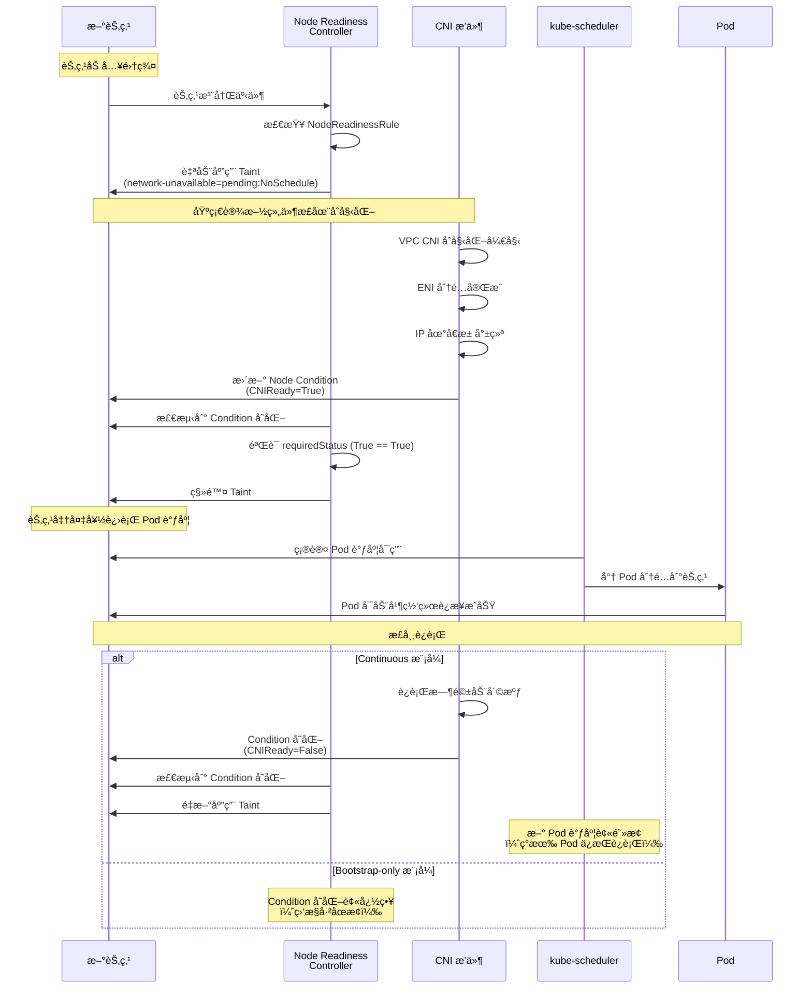

#### ä¸ Pod Readiness 的关系

Kubernetes Readiness 机制ç°åœ¨å½¢æˆäº†å®Œæ•´çš„ 3 层结æ„：

| 层级 | 机制 | 范围 | 失败行为 | 使用场景 |
|-------|-----------|-------|-----------------|----------|
| **1. 容器** | Readiness Probe | 容器内部å¥åº·æ£€æŸ¥ | ä» Service Endpoint 移除 | 验è¯åº”用就绪 |
| **2. Pod** | Readiness Gate | Pod 级别外部æ¡ä»¶ | ä» Service Endpoint 移除 | ALB/NLB å¥åº·æ£€æŸ¥é›†æˆ |
| **3. 节点** | Node Readiness Controller | 节点基础设施æ¡ä»¶ | 阻止 Pod 调度（Taint） | CNIã€GPUã€å­˜å‚¨å°±ç»ªéªŒè¯ |

**集æˆåœºæ™¯ - 完整的æµé‡å®‰å…¨ï¼š**

```yaml
apiVersion: apps/v1
kind: Deployment
metadata:
  name: critical-service
spec:
  replicas: 3
  template:
    spec:
      # 应用 3 层 Readiness
      containers:
      - name: app
        image: myapp:v2
        # 第 1 层：容器 Readiness Probe
        readinessProbe:
          httpGet:
            path: /ready
            port: 8080
          periodSeconds: 5
          failureThreshold: 2

      # 第 2 层：Pod Readiness Gate
      readinessGates:
      - conditionType: "target-health.alb.ingress.k8s.aws/production-alb"

      # 第 3 层：Node Readiness（由 NodeReadinessRule 自动处ç†ï¼‰
      # - 检查节点上的 CNIã€GPUã€å­˜å‚¨å°±ç»ªçŠ¶æ€
      # - Pod 仅调度到没有 Taint 的节点
```

**æµé‡æ¥æ”¶æ£€æŸ¥æ¸…å•ï¼š**

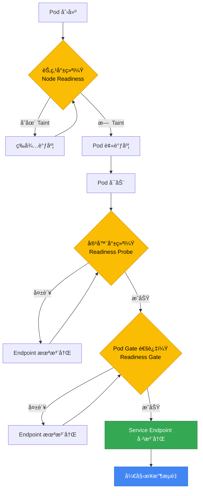

#### 安装和é…ç½®

##### 1. 安装 Node Readiness Controller

```bash
# 通过 Helm 安装
helm repo add node-readiness-controller https://node-readiness-controller.sigs.k8s.io
helm repo update

helm install node-readiness-controller \
  node-readiness-controller/node-readiness-controller \
  --namespace kube-system \
  --create-namespace

# 或通过 Kustomize 安装
kubectl apply -k https://github.com/kubernetes-sigs/node-readiness-controller/config/default
```

##### 2. 验è¯å®‰è£…

```bash
# 检查 Controller Pod 状æ€
kubectl get pods -n kube-system -l app=node-readiness-controller

# éªŒè¯ CRD
kubectl get crd nodereadinessrules.readiness.node.x-k8s.io

# 应用示例规则
kubectl apply -f https://raw.githubusercontent.com/kubernetes-sigs/node-readiness-controller/main/examples/basic-rule.yaml

# 列出规则
kubectl get nodereadinessrules -A
```

##### 3. 验è¯èŠ‚点状æ€

```bash
# 检查特定节点的 Condition
kubectl get node <node-name> -o jsonpath='{.status.conditions}' | jq

# 过滤特定 Condition
kubectl get node <node-name> -o jsonpath='{.status.conditions[?(@.type=="CNIReady")]}' | jq

# 检查所有节点的 Taint
kubectl get nodes -o custom-columns=NAME:.metadata.name,TAINTS:.spec.taints
```

#### 调试ä¸æ•…éšœæ’查

##### Taint 未被移除时

```bash
# 1. 检查 NodeReadinessRule 事件
kubectl describe nodereadinessrule <rule-name> -n kube-system

# 2. 检查节点 Condition 状æ€
kubectl get node <node-name> -o yaml | grep -A 10 conditions

# 3. 检查 Controller 日志
kubectl logs -n kube-system -l app=node-readiness-controller --tail=100

# 4. 手动设置 Condition（用äºæµ‹è¯•ï¼‰
kubectl patch node <node-name> --type=json -p='[
  {
    "op": "add",
    "path": "/status/conditions/-",
    "value": {
      "type": "CNIReady",
      "status": "True",
      "lastTransitionTime": "'$(date -u +"%Y-%m-%dT%H:%M:%SZ")'",
      "reason": "ManualSet",
      "message": "Manually set for testing"
    }
  }
]'
```

##### 使用 Dry-run 模å¼æµ‹è¯•è§„则

```bash
# å°†ç°æœ‰è§„则更改为 dry-run
kubectl patch nodereadinessrule <rule-name> -n kube-system \
  --type=merge \
  -p '{"spec":{"enforcementMode":"dry-run"}}'

# 在 Controller 日志中验è¯è¡Œä¸º
kubectl logs -n kube-system -l app=node-readiness-controller -f | grep "dry-run"

# 测试åæ¢å¤åŸå§‹æ¨¡å¼
kubectl patch nodereadinessrule <rule-name> -n kube-system \
  --type=merge \
  -p '{"spec":{"enforcementMode":"continuous"}}'
```

:::info Alpha 特性æ醒
Node Readiness Controller ç›®å‰å¤„äº v0.1.1 alpha 阶段。在应用到生产ç¯å¢ƒä¹‹å‰ï¼š
- 在 Staging ç¯å¢ƒä¸­è¿›è¡Œå……分测试
- 使用 dry-run 模å¼éªŒè¯è§„则行为
- 设置 Controller 日志监æ§
- 准备在出ç°é—®é¢˜æ—¶æ‰‹åŠ¨ç§»é™¤ Taint 的程åº
:::

:::tip è¿ç»´æœ€ä½³å®è·µ
1. **优先使用 bootstrap-only**: 大多数情况下 bootstrap-only 模å¼å°±è¶³å¤Ÿäº†ã€‚仅对è¿è¡Œæ—¶é¢‘ç¹æ•…障的组件（如 GPU 驱动）使用 continuous 模å¼ã€‚
2. **积æ使用 nodeSelector**: ä¸è¦å°†ç›¸åŒè§„则应用äºæ‰€æœ‰èŠ‚点；而是按工作负载类å‹è¿›è¡Œç»†åˆ†ã€‚
3. **ä¸ Node Problem Detector 集æˆ**: å°† NRC ä¸ NPD 结åˆä½¿ç”¨ï¼Œå¯ä»¥è‡ªåŠ¨å“应硬件/OS 级别的问题。
4. **监æ§å’Œå‘Šè­¦**: 在 CloudWatch 或 Prometheus 中收集 Taint 应用/移除事件，并在 Taint æŒç»­æ—¶é—´è¿‡é•¿æ—¶é…置告警。
:::

:::warning æ³¨æ„ PDB 冲çª
当 Node Readiness Controller 应用 Taint 时，ä¸ä¼šåœ¨è¯¥èŠ‚点上创建新的 Pod。如æœåŒæ—¶å¯¹å¤šä¸ªèŠ‚点应用 Taint 且 PodDisruptionBudget é…置过äºä¸¥æ ¼ï¼Œå¯èƒ½ä¼šé˜»æ­¢æ•´ä¸ªé›†ç¾¤çš„工作负载分é…。请将 PDB ç­–ç•¥ä¸è§„则设计一起审查。
:::

#### å‚考资料

- **官方文档**: [Node Readiness Controller](https://node-readiness-controller.sigs.k8s.io/)
- **Kubernetes åšå®¢**: [Introducing Node Readiness Controller](https://kubernetes.io/blog/2026/02/03/introducing-node-readiness-controller/)
- **GitHub 仓库**: [kubernetes-sigs/node-readiness-controller](https://github.com/kubernetes-sigs/node-readiness-controller)

---

### 3.5 Fargate Pod 生命周期特殊注æ„事项

AWS Fargate 是一ç§æ— æœåŠ¡å™¨è®¡ç®—引æ“，无需节点管ç†å³å¯è¿è¡Œ Pod。Fargate Pod ä¸åŸºäº EC2 çš„ Pod 相比具有ä¸åŒçš„生命周期特å¾ã€‚

#### Fargate vs EC2 vs Auto Mode æ¶æ„比较

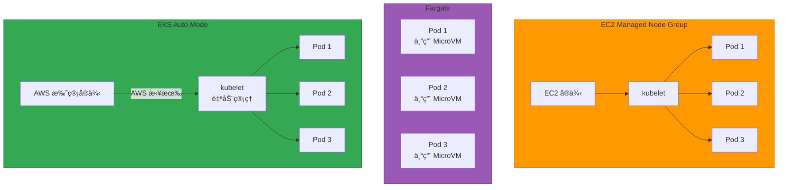

#### Fargate Pod OS è¡¥ä¸è‡ªåŠ¨é©±é€

Fargate ä¼šå®šæœŸè‡ªåŠ¨é©±é€ Pod 以进行安全补ä¸ã€‚

**工作åŸç†ï¼š**

1. **è¡¥ä¸å¯ç”¨æ€§æ£€æµ‹**: AWS 检测到新的 OS/è¿è¡Œæ—¶è¡¥ä¸
2. **优雅驱é€**: Fargate å‘ Pod å‘é€ SIGTERM → 在 `terminationGracePeriodSeconds` 内等待关闭
3. **强制终止**: 超时åå‘é€ SIGKILL
4. **é‡æ–°è°ƒåº¦**: Kubernetes é‡æ–°è°ƒåº¦åˆ°æ–°çš„ Fargate Pod（使用更新åçš„è¿è¡Œæ—¶ï¼‰

**关键特å¾ï¼š**

- **ä¸å¯é¢„测的时间**: 用户无法æ§åˆ¶ï¼ˆAWS 管ç†ï¼‰
- **æ— æå‰é€šçŸ¥**: ä¸ EC2 Scheduled Events ä¸åŒï¼Œæ²¡æœ‰é¢„先警告
- **自动é‡å¯**: å°Šé‡ PodDisruptionBudget (PDB)，但安全补ä¸å…·æœ‰æ›´é«˜ä¼˜å…ˆçº§

**缓解策略：**

```yaml
apiVersion: apps/v1
kind: Deployment
metadata:
  name: fargate-app
  namespace: fargate-namespace
spec:
  replicas: 3  # 建议至少 3 个（应对自动驱é€ï¼‰
  selector:
    matchLabels:
      app: fargate-app
  template:
    metadata:
      labels:
        app: fargate-app
    spec:
      containers:
      - name: app
        image: myapp:v1
        resources:
          requests:
            cpu: 500m
            memory: 1Gi
        startupProbe:
          httpGet:
            path: /healthz
            port: 8080
          failureThreshold: 10
          periodSeconds: 5
        readinessProbe:
          httpGet:
            path: /ready
            port: 8080
          periodSeconds: 5
        livenessProbe:
          httpGet:
            path: /healthz
            port: 8080
          periodSeconds: 10
        lifecycle:
          preStop:
            exec:
              command:
              - /bin/sh
              - -c
              - sleep 10  # Fargate 驱é€æ—¶ç­‰å¾…更长时间
      # Fargate å¯åŠ¨æ—¶é—´å¯èƒ½æ›´é•¿
      terminationGracePeriodSeconds: 60
---
# PDB é™åˆ¶å¹¶å‘驱é€ï¼ˆå°½åŠ›è€Œä¸ºï¼›å®‰å…¨è¡¥ä¸å¯èƒ½å¿½ç•¥ï¼‰
apiVersion: policy/v1
kind: PodDisruptionBudget
metadata:
  name: fargate-app-pdb
  namespace: fargate-namespace
spec:
  minAvailable: 2
  selector:
    matchLabels:
      app: fargate-app
```

:::warning Fargate PDB é™åˆ¶
Fargate 仅以**尽力而为**çš„æ–¹å¼å°Šé‡ PDB。对äºå…³é”®å®‰å…¨è¡¥ä¸ï¼Œå¯èƒ½ä¼šå¿½ç•¥ PDB 并强制驱é€ã€‚因此，在 Fargate ç¯å¢ƒä¸­ï¼Œè¯·ç¡®ä¿ä½¿ç”¨**至少 3 个副本**å®ç°é«˜å¯ç”¨æ€§ã€‚
:::

#### Fargate Pod å¯åŠ¨æ—¶é—´ç‰¹å¾

Fargate Pod çš„å¯åŠ¨æ—¶é—´æ¯”åŸºäº EC2 çš„ Pod 更长。

| 阶段 | EC2（Managed Node） | Fargate | åŸå›  |
|-------|-------------------|---------|--------|
| **节点é…ç½®** | 0s（已在è¿è¡Œï¼‰ | 20-40s | MicroVM 创建 + ENI 附加 |
| **é•œåƒæ‹‰å–** | 5-30s | 10-60s | 无层缓存（首次è¿è¡Œæ—¶ï¼‰ |
| **容器å¯åŠ¨** | 1-5s | 1-5s | ç›¸åŒ |
| **总å¯åŠ¨æ—¶é—´** | 6-35s | 31-105s | Fargate é¢å¤–开销 |

**Startup Probe 调整示例：**

```yaml
# EC2 Pod
startupProbe:
  httpGet:
    path: /healthz
    port: 8080
  failureThreshold: 6   # 6 x 5s = 30s
  periodSeconds: 5

# Fargate Pod（å…许更长时间）
startupProbe:
  httpGet:
    path: /healthz
    port: 8080
  failureThreshold: 20  # 20 x 5s = 100s
  periodSeconds: 5
```

**é•œåƒæ‹‰å–优化（Fargate）：**

```yaml
apiVersion: v1
kind: Pod
metadata:
  name: fargate-pod
  namespace: fargate-namespace
spec:
  containers:
  - name: app
    image: 123456789012.dkr.ecr.us-east-1.amazonaws.com/myapp:v1
    imagePullPolicy: IfNotPresent  # 建议 IfNotPresent 而é Always
  imagePullSecrets:
  - name: ecr-secret
```

:::tip Fargate é•œåƒç¼“å­˜
Fargate 在é‡å¤ä½¿ç”¨ç›¸åŒé•œåƒæ—¶ä¼šè¿›è¡Œå±‚缓存，但**缓存在 Pod 被驱é€æ—¶ä¼šä¸¢å¤±**。使用 ECR Image Scanning å’Œ Image Replication æ¥å‡å°‘é•œåƒæ‹‰å–时间。
:::

#### ç”±äº Fargate DaemonSet é™åˆ¶çš„ Sidecar 模å¼

Fargate ä¸æ”¯æŒ DaemonSet，因此在需è¦èŠ‚点级代ç†æ—¶å¿…须使用 Sidecar 模å¼ã€‚

**EC2 vs Fargate 监æ§æ¨¡å¼æ¯”较：**

| 功能 | EC2（DaemonSet） | Fargate（Sidecar） |
|---------|----------------|-------------------|
| **日志收集** | Fluent Bit DaemonSet | Fluent Bit Sidecar + FireLens |
| **指标收集** | CloudWatch Agent DaemonSet | CloudWatch Agent Sidecar |
| **安全扫æ** | Falco DaemonSet | Fargate ç”± AWS 管ç†ï¼ˆç”¨æˆ·æ— æ³•æ§åˆ¶ï¼‰ |
| **网络策略** | Calico/Cilium DaemonSet | ä¸æ”¯æŒ NetworkPolicy（使用 Security Groups for Pods） |

**Fargate 日志模å¼ï¼ˆFireLens）：**

```yaml
apiVersion: apps/v1
kind: Deployment
metadata:
  name: fargate-logging-app
  namespace: fargate-namespace
spec:
  replicas: 2
  selector:
    matchLabels:
      app: logging-app
  template:
    metadata:
      labels:
        app: logging-app
    spec:
      containers:
      # 主应用
      - name: app
        image: myapp:v1
        ports:
        - containerPort: 8080
        resources:
          requests:
            cpu: 500m
            memory: 512Mi
      # FireLens 日志路由器（sidecar）
      - name: log-router
        image: public.ecr.aws/aws-observability/aws-for-fluent-bit:stable
        resources:
          requests:
            cpu: 100m
            memory: 128Mi
          limits:
            cpu: 200m
            memory: 256Mi
        env:
        - name: FLB_LOG_LEVEL
          value: "info"
        firelensConfiguration:
          type: fluentbit
          options:
            enable-ecs-log-metadata: "true"
```

:::info Fargate 上的 CloudWatch Container Insights
Fargate **åŸç”Ÿæ”¯æŒ** CloudWatch Container Insights，无需å•ç‹¬çš„ Sidecar å³å¯è‡ªåŠ¨æ”¶é›†æŒ‡æ ‡ã€‚创建 Fargate Profile 时自动å¯ç”¨ã€‚

```bash
aws eks create-fargate-profile \
  --cluster-name my-cluster \
  --fargate-profile-name my-profile \
  --pod-execution-role-arn arn:aws:iam::123456789012:role/FargatePodExecutionRole \
  --selectors namespace=fargate-namespace \
  --tags 'EnableContainerInsights=enabled'
```
:::

#### Fargate Graceful Shutdown 时间建议

ç”±äºè‡ªåŠ¨é©±é€å’Œè¾ƒé•¿çš„å¯åŠ¨æ—¶é—´ï¼ŒFargate 需è¦ä¸ EC2 ä¸åŒçš„ Graceful Shutdown 策略。

| 场景 | terminationGracePeriodSeconds | preStop sleep | åŸå›  |
|----------|------------------------------|---------------|--------|
| **EC2 Pod** | 30-60s | 5s | 等待 Endpoints 移除 |
| **Fargate Pod（一般）** | 60-90s | 10-15s | 较长的网络传播时间 |
| **Fargate + ALB** | 90-120s | 15-20s | 考虑 ALB 注销延迟 |
| **Fargate 长时间è¿è¡Œä»»åŠ¡** | 120-300s | 10s | å…许批处ç†ä½œä¸šå®Œæˆ |

**Fargate 优化示例：**

```yaml
apiVersion: apps/v1
kind: Deployment
metadata:
  name: fargate-web-app
  namespace: fargate-namespace
spec:
  replicas: 3
  selector:
    matchLabels:
      app: web-app
  template:
    metadata:
      labels:
        app: web-app
    spec:
      containers:
      - name: app
        image: myapp:v1
        ports:
        - containerPort: 8080
        readinessProbe:
          httpGet:
            path: /ready
            port: 8080
          periodSeconds: 5
          failureThreshold: 3
          successThreshold: 1
        lifecycle:
          preStop:
            exec:
              command:
              - /bin/sh
              - -c
              - |
                # Fargate 网络传播å¯èƒ½è¾ƒæ…¢
                echo "PreStop: Waiting for network propagation..."
                sleep 15

                # Readiness 失败信å·ï¼ˆå¯é€‰ï¼‰
                # curl -X POST http://localhost:8080/shutdown

                echo "PreStop: Graceful shutdown initiated"
      terminationGracePeriodSeconds: 90  # EC2 使用 60s，Fargate 使用 90s
```

#### Fargate vs EC2 vs Auto Mode 比较：Probe 视角

| 项目 | EC2 Managed Node Group | Fargate | EKS Auto Mode |
|------|------------------------|---------|---------------|
| **节点管ç†** | ç”¨æˆ·ç®¡ç† | AWS ç®¡ç† | AWS ç®¡ç† |
| **Pod 密度** | 高（多个 Pod/节点） | ä½ï¼ˆ1 Pod = 1 MicroVM） | 中等（AWS 优化） |
| **å¯åŠ¨æ—¶é—´** | 快（5-35s） | 慢（30-105s） | 快（10-40s） |
| **Startup Probe failureThreshold** | 6-10 | 15-20 | 8-12 |
| **terminationGracePeriodSeconds** | 30-60s | 60-120s | 30-60s |
| **preStop sleep** | 5s | 10-15s | 5-10s |
| **自动 OS è¡¥ä¸** | 手动（AMI 更新） | 自动（ä¸å¯é¢„测的驱é€ï¼‰ | 自动（计划性驱é€ï¼‰ |
| **PDB 支æŒ** | å®Œå…¨æ”¯æŒ | 有é™ï¼ˆå°½åŠ›è€Œä¸ºï¼‰ | å®Œå…¨æ”¯æŒ |
| **DaemonSet 支æŒ** | å®Œå…¨æ”¯æŒ | ä¸æ”¯æŒï¼ˆéœ€è¦ Sidecar） | 有é™ï¼ˆAWS 管ç†ï¼‰ |
| **æˆæœ¬æ¨¡å‹** | 按å®ä¾‹ï¼ˆå§‹ç»ˆè¿è¡Œï¼‰ | 按 Pod（仅è¿è¡Œæ—¶ï¼‰ | 按 Pod（优化） |
| **Spot 支æŒ** | 完全支æŒï¼ˆTermination Handler） | Fargate Spot æœ‰é™ | 自动优化 |
| **网络策略** | Calico/Cilium æ”¯æŒ | ä»… Security Groups for Pods | AWS 管ç†çš„网络策略 |

**选择指å—：**

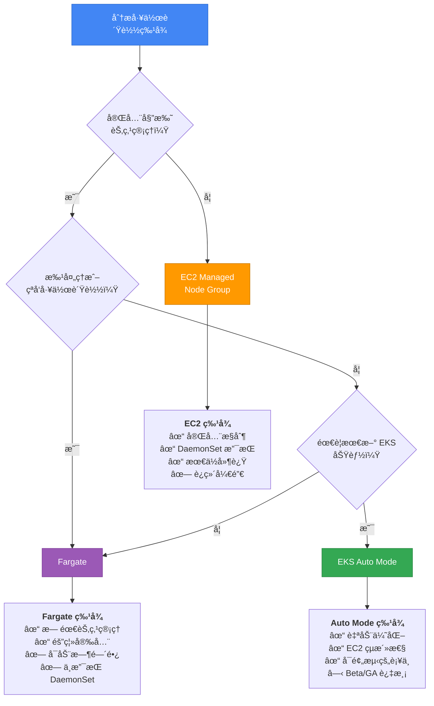

:::tip Fargate 生产检查清å•
- [ ] **副本数**: 至少 3 个（应对自动驱é€ï¼‰
- [ ] **Startup Probe**: å°† failureThreshold 设置为 15-20（考虑较长的å¯åŠ¨æ—¶é—´ï¼‰
- [ ] **terminationGracePeriodSeconds**: 设置为 60-120 秒
- [ ] **preStop sleep**: 设置为 10-15 秒（等待网络传播）
- [ ] **PDB**: é…ç½® minAvailable（尽力而为但æ¨è）
- [ ] **é•œåƒä¼˜åŒ–**: 使用 ECR，最å°åŒ–层数
- [ ] **日志**: FireLens Sidecar 或 CloudWatch Logs 集æˆ
- [ ] **监æ§**: å¯ç”¨ CloudWatch Container Insights
- [ ] **æˆæœ¬ä¼˜åŒ–**: 考虑 Fargate Spot（适用äºå®¹é”™å·¥ä½œè´Ÿè½½ï¼‰
:::

:::info å‚考资料
- [AWS Fargate on EKS 官方文档](https://docs.aws.amazon.com/eks/latest/userguide/fargate.html)
- [Fargate Pod è¡¥ä¸å’Œå®‰å…¨æ›´æ–°](https://docs.aws.amazon.com/eks/latest/userguide/fargate-pod-patching.html)
- [EKS Auto Mode 概述](https://aws.amazon.com/blogs/aws/streamline-kubernetes-cluster-management-with-new-amazon-eks-auto-mode/)
- [Fargate vs EC2 比较指å—](https://aws.amazon.com/blogs/containers/)
:::

---


## 4. Init Container 最佳å®è·µ

Init Container 在主容器å¯åŠ¨ä¹‹å‰è¿è¡Œï¼Œæ‰§è¡Œåˆå§‹åŒ–任务。

### 4.1 Init Container 工作åŸç†

- Init Container **按顺åº**执行（ä¸æ”¯æŒå¹¶å‘执行）
- æ¯ä¸ª Init Container å¿…é¡»æˆåŠŸé€€å‡ºå，下一个 Init Container æ‰ä¼šå¯åŠ¨
- 所有 Init Container 必须完æˆå，主容器æ‰ä¼šå¯åŠ¨
- å¦‚æœ Init Container å¤±è´¥ï¼Œå°†æ ¹æ® Pod çš„ `restartPolicy` é‡æ–°å¯åŠ¨

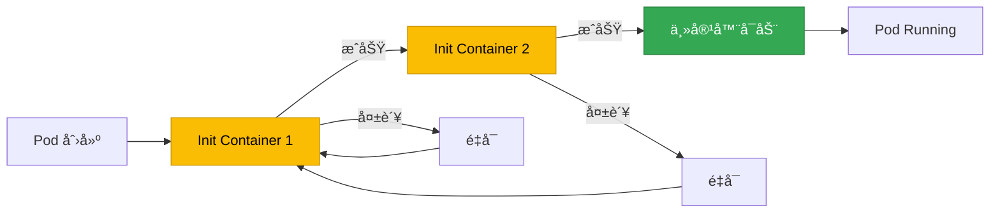

### 4.2 Init Container 使用场景

#### 场景 1：数æ®åº“è¿ç§»

```yaml
apiVersion: apps/v1
kind: Deployment
metadata:
  name: web-app
spec:
  replicas: 3
  template:
    spec:
      # Init Container: æ•°æ®åº“è¿ç§»
      initContainers:
      - name: db-migration
        image: myapp/migrator:v1
        command:
        - /bin/sh
        - -c
        - |
          echo "Running database migrations..."
          /app/migrate up
          echo "Migrations completed"
        env:
        - name: DATABASE_URL
          valueFrom:
            secretKeyRef:
              name: db-secret
              key: url
      # 主应用程åº
      containers:
      - name: app
        image: myapp/web-app:v1
        ports:
        - containerPort: 8080
```

#### 场景 2：é…置文件生æˆï¼ˆConfigMap 转æ¢ï¼‰

```yaml
apiVersion: v1
kind: ConfigMap
metadata:
  name: app-config-template
data:
  config.template: |
    server:
      port: {{ PORT }}
      host: {{ HOST }}
    database:
      url: {{ DB_URL }}
---
apiVersion: apps/v1
kind: Deployment
metadata:
  name: app-with-config
spec:
  template:
    spec:
      initContainers:
      - name: config-generator
        image: busybox
        command:
        - /bin/sh
        - -c
        - |
          # ä»æ¨¡æ¿ç”Ÿæˆå®é™…é…置文件
          sed -e "s/{{ PORT }}/$PORT/g" \
              -e "s/{{ HOST }}/$HOST/g" \
              -e "s|{{ DB_URL }}|$DB_URL|g" \
              /config-template/config.template > /config/config.yaml
          echo "Config file generated"
          cat /config/config.yaml
        env:
        - name: PORT
          value: "8080"
        - name: HOST
          value: "0.0.0.0"
        - name: DB_URL
          valueFrom:
            secretKeyRef:
              name: db-secret
              key: url
        volumeMounts:
        - name: config-template
          mountPath: /config-template
        - name: config
          mountPath: /config
      containers:
      - name: app
        image: myapp/app:v1
        volumeMounts:
        - name: config
          mountPath: /app/config
      volumes:
      - name: config-template
        configMap:
          name: app-config-template
      - name: config
        emptyDir: {}
```

#### 场景 3：等待ä¾èµ–æœåŠ¡å°±ç»ª

```yaml
apiVersion: apps/v1
kind: Deployment
metadata:
  name: backend-api
spec:
  template:
    spec:
      initContainers:
      # Init Container 1: 等待数æ®åº“è¿æ¥
      - name: wait-for-db
        image: busybox
        command:
        - /bin/sh
        - -c
        - |
          echo "Waiting for database..."
          until nc -z postgres-service 5432; do
            echo "Database not ready, sleeping..."
            sleep 2
          done
          echo "Database is ready"
      # Init Container 2: 等待 Redis è¿æ¥
      - name: wait-for-redis
        image: busybox
        command:
        - /bin/sh
        - -c
        - |
          echo "Waiting for Redis..."
          until nc -z redis-service 6379; do
            echo "Redis not ready, sleeping..."
            sleep 2
          done
          echo "Redis is ready"
      containers:
      - name: api
        image: myapp/backend-api:v1
        ports:
        - containerPort: 8080
```

:::tip 更好的替代方案：readinessProbe
等待ä¾èµ–æœåŠ¡å°±ç»ªé€šè¿‡ä¸»å®¹å™¨çš„ Readiness Probe 处ç†æ¯”使用 Init Container 更加çµæ´»ã€‚ç”±äº Init Container åªè¿è¡Œä¸€æ¬¡ï¼Œå¦‚æœä¸»å®¹å™¨è¿è¡ŒæœŸé—´ä¾èµ–æœåŠ¡å®•æœºï¼Œå®ƒæ— æ³•åšå‡ºå“应。
:::

#### 场景 4：Volume æƒé™è®¾ç½®

```yaml
apiVersion: apps/v1
kind: Deployment
metadata:
  name: app-with-volume
spec:
  template:
    spec:
      securityContext:
        fsGroup: 1000
      initContainers:
      - name: volume-permissions
        image: busybox
        command:
        - /bin/sh
        - -c
        - |
          echo "Setting up volume permissions..."
          chown -R 1000:1000 /data
          chmod -R 755 /data
          echo "Permissions set"
        volumeMounts:
        - name: data
          mountPath: /data
        securityContext:
          runAsUser: 0  # 以 root è¿è¡Œï¼ˆç”¨äºæƒé™å˜æ›´ï¼‰
      containers:
      - name: app
        image: myapp/app:v1
        securityContext:
          runAsUser: 1000
          runAsNonRoot: true
        volumeMounts:
        - name: data
          mountPath: /app/data
      volumes:
      - name: data
        persistentVolumeClaim:
          claimName: app-data-pvc
```

### 4.3 Init Container ä¸ Sidecar Container 对比（Kubernetes 1.29+）

Kubernetes 1.29+ 引入了åŸç”Ÿ Sidecar Container。

| 特性 | Init Container | Sidecar Container (1.29+) |
|------|---------------|---------------------------|
| **执行时机** | 在主容器之å‰æŒ‰é¡ºåºæ‰§è¡Œ | ä¸ä¸»å®¹å™¨å¹¶å‘执行 |
| **生命周期** | 完æˆå退出 | ä¸ä¸»å®¹å™¨ä¸€èµ·è¿è¡Œ |
| **é‡å¯** | 失败时整个 Pod é‡å¯ | å¯å•ç‹¬é‡å¯ |
| **使用场景** | 一次性åˆå§‹åŒ–任务 | æŒç»­æ€§è¾…助任务（日志收集ã€ä»£ç†ç­‰ï¼‰ |

**Sidecar Container 示例（K8s 1.29+）：**

```yaml
apiVersion: v1
kind: Pod
metadata:
  name: app-with-sidecar
spec:
  initContainers:
  # åŸç”Ÿ sidecar：将 restartPolicy 设置为 Always
  - name: log-collector
    image: fluent/fluent-bit:2.0
    restartPolicy: Always  # 作为 sidecar è¿è¡Œ
    volumeMounts:
    - name: logs
      mountPath: /var/log/app
  containers:
  - name: app
    image: myapp/app:v1
    volumeMounts:
    - name: logs
      mountPath: /app/logs
  volumes:
  - name: logs
    emptyDir: {}
```

---
## 5. Pod 生命周期 Hook

Lifecycle Hook 在容器生命周期的特定时间点执行自定义逻辑。

### 5.1 PostStart Hook

PostStart Hook 在容器创建åç«‹å³æ‰§è¡Œã€‚

**特性：**
- ä¸å®¹å™¨çš„ ENTRYPOINT **异步**è¿è¡Œ
- å¦‚æœ Hook 失败，容器将被终止
- 容器ä¸ä¼šç­‰å¾… Hook 完æˆå³è¿›å…¥ `Running` 状æ€

```yaml
apiVersion: v1
kind: Pod
metadata:
  name: poststart-example
spec:
  containers:
  - name: app
    image: nginx
    lifecycle:
      postStart:
        exec:
          command:
          - /bin/sh
          - -c
          - |
            echo "Container started at $(date)" >> /var/log/lifecycle.log
            # åˆå§‹è®¾ç½®ä»»åŠ¡
            mkdir -p /app/cache
            chown -R nginx:nginx /app/cache
```

**使用场景：**
- å‘é€åº”用å¯åŠ¨é€šçŸ¥
- åˆå§‹ç¼“存预热
- 记录元数æ®

:::warning PostStart Hook 注æ„事项
PostStart Hook ä¸å®¹å™¨å¯åŠ¨**异步**è¿è¡Œï¼Œå› æ­¤åº”用å¯èƒ½åœ¨ Hook 完æˆä¹‹å‰å°±å·²å¯åŠ¨ã€‚如æœåº”用ä¾èµ–äº Hook 的工作结æœï¼Œè¯·æ”¹ç”¨ Init Container。
:::

### 5.2 PreStop Hook

PreStop Hook 在容器收到终止请求时ã€SIGTERM 之å‰æ‰§è¡Œã€‚

**特性：**
- **åŒæ­¥**è¿è¡Œï¼ˆSIGTERM çš„å‘é€ä¼šè¢«å»¶è¿Ÿï¼Œç›´åˆ° Hook 完æˆï¼‰
- Hook 执行时间计入 `terminationGracePeriodSeconds`
- 无论 Hook æˆåŠŸæˆ–失败，都会å‘é€ SIGTERM

```yaml
apiVersion: v1
kind: Pod
metadata:
  name: prestop-example
spec:
  containers:
  - name: app
    image: myapp/app:v1
    lifecycle:
      preStop:
        exec:
          command:
          - /bin/sh
          - -c
          - |
            # 1. 等待 Endpoint 移除
            sleep 5

            # 2. ä¿å­˜åº”用状æ€
            curl -X POST http://localhost:8080/admin/save-state

            # 3. 刷新日志
            kill -USR1 1  # å‘应用å‘é€ USR1 ä¿¡å·

            # 4. å‘é€ SIGTERM（PID 1）
            kill -TERM 1
  terminationGracePeriodSeconds: 60
```

**使用场景：**
- 等待 Endpoint 移除（零宕机部署）
- ä¿å­˜è¿›è¡Œä¸­çš„工作状æ€
- 通知外部系统关闭
- 刷新日志缓冲区

### 5.3 Hook 执行机制

Kubernetes 通过两ç§æœºåˆ¶æ‰§è¡Œ Hook。

| 机制 | è¯´æ˜ | 优点 | 缺点 |
|------|------|------|------|
| **exec** | 在容器内部执行命令 | å¯è®¿é—®å®¹å™¨æ–‡ä»¶ç³»ç»Ÿ | 开销较大 |
| **httpGet** | å‘é€ HTTP GET 请求 | 基äºç½‘络，轻é‡çº§ | åº”ç”¨å¿…é¡»æ”¯æŒ HTTP |

#### exec Hook 示例

```yaml
lifecycle:
  preStop:
    exec:
      command:
      - /bin/bash
      - -c
      - |
        echo "Shutting down" | tee /var/log/shutdown.log
        /app/cleanup.sh
```

#### httpGet Hook 示例

```yaml
lifecycle:
  preStop:
    httpGet:
      path: /shutdown
      port: 8080
      scheme: HTTP
      httpHeaders:
      - name: X-Shutdown-Token
        value: "secret-token"
```

:::warning Hook 执行为"至少一次"
Kubernetes ä¿è¯ Hook 至少执行一次，但å¯èƒ½ä¼šæ‰§è¡Œå¤šæ¬¡ã€‚Hook 逻辑必须是**幂等**的。
:::

---

## 6. 容器镜åƒä¼˜åŒ–ä¸å¯åŠ¨æ—¶é—´

容器镜åƒçš„大å°å’Œç»“æ„ç›´æ¥å½±å“ Pod å¯åŠ¨æ—¶é—´ã€‚

### 6.1 Multi-Stage Build

使用 Multi-Stage Build 最å°åŒ–最终镜åƒå¤§å°ã€‚

#### Go 应用

```dockerfile
# æ„建阶段
FROM golang:1.22-alpine AS builder

WORKDIR /app
COPY go.mod go.sum ./
RUN go mod download

COPY . .
RUN CGO_ENABLED=0 GOOS=linux go build -a -installsuffix cgo -ldflags="-s -w" -o main .

# è¿è¡Œæ—¶é˜¶æ®µï¼ˆscratch：å°äº 5MB）
FROM scratch

COPY --from=builder /app/main /main
COPY --from=builder /etc/ssl/certs/ca-certificates.crt /etc/ssl/certs/

USER 65534:65534
ENTRYPOINT ["/main"]
```

**效æœï¼š**
- æ„建镜åƒï¼š300MB+
- 最终镜åƒï¼š5-10MB
- å¯åŠ¨æ—¶é—´ï¼š1 秒以内

#### Node.js 应用

```dockerfile
# æ„建阶段
FROM node:20-alpine AS builder

WORKDIR /app
COPY package*.json ./
RUN npm ci --only=production

COPY . .

# è¿è¡Œæ—¶é˜¶æ®µ
FROM node:20-alpine

# 安全：é root 用户
RUN addgroup -g 1001 -S nodejs && \
    adduser -S nodejs -u 1001

WORKDIR /app

# ä»…å¤åˆ¶ç”Ÿäº§ä¾èµ–
COPY --from=builder --chown=nodejs:nodejs /app/node_modules ./node_modules
COPY --chown=nodejs:nodejs . .

USER nodejs

EXPOSE 8080
CMD ["node", "server.js"]
```

**优化建议：**
- 使用 `npm ci`（比 npm install æ›´å¿«æ›´å¯é ï¼‰
- 使用 `--only=production` æ’除 devDependencies
- 利用层缓存（先 COPY package*.json）

#### Java/Spring Boot 应用

```dockerfile
# æ„建阶段
FROM maven:3.9-eclipse-temurin-21 AS builder

WORKDIR /app
COPY pom.xml .
RUN mvn dependency:go-offline

COPY src ./src
RUN mvn clean package -DskipTests

# è¿è¡Œæ—¶é˜¶æ®µ
FROM eclipse-temurin:21-jre-alpine

RUN addgroup -S spring && adduser -S spring -G spring
USER spring:spring

WORKDIR /app
COPY --from=builder /app/target/*.jar app.jar

EXPOSE 8080
ENTRYPOINT ["java", "-Xms512m", "-Xmx1g", "-jar", "app.jar"]
```

### 6.2 é•œåƒé¢„拉å–ç­–ç•¥

在 EKS 中利用镜åƒé¢„拉å–æ¥ç¼©çŸ­ Pod å¯åŠ¨æ—¶é—´ã€‚

#### Karpenter é•œåƒé¢„拉å–

```yaml
apiVersion: karpenter.k8s.aws/v1beta1
kind: EC2NodeClass
metadata:
  name: default
spec:
  amiFamily: AL2
  userData: |
    #!/bin/bash
    # 预拉å–常用镜åƒ
    docker pull myapp/backend:v2.1.0
    docker pull myapp/frontend:v1.5.3
    docker pull redis:7-alpine
    docker pull postgres:16-alpine
```

#### 使用 DaemonSet 预拉å–é•œåƒ

```yaml
apiVersion: apps/v1
kind: DaemonSet
metadata:
  name: image-prepuller
  namespace: kube-system
spec:
  selector:
    matchLabels:
      app: image-prepuller
  template:
    metadata:
      labels:
        app: image-prepuller
    spec:
      initContainers:
      # 为æ¯ä¸ªéœ€è¦é¢„拉å–çš„é•œåƒæ·»åŠ ä¸€ä¸ª init container
      - name: prepull-backend
        image: myapp/backend:v2.1.0
        command: ["sh", "-c", "echo 'Image pulled'"]
      - name: prepull-frontend
        image: myapp/frontend:v1.5.3
        command: ["sh", "-c", "echo 'Image pulled'"]
      containers:
      - name: pause
        image: registry.k8s.io/pause:3.9
        resources:
          requests:
            cpu: 1m
            memory: 1Mi
```

### 6.3 Distroless å’Œ Scratch é•œåƒ

Google çš„ Distroless é•œåƒä»…包å«è¿è¡Œåº”用所需的最少文件。

#### Distroless 示例

```dockerfile
FROM golang:1.22-alpine AS builder
WORKDIR /app
COPY . .
RUN CGO_ENABLED=0 go build -o main .

# distroless 基础镜åƒ
FROM gcr.io/distroless/static-debian12

COPY --from=builder /app/main /main
USER 65534:65534
ENTRYPOINT ["/main"]
```

**Distroless 优势：**
- 最å°æ”»å‡»é¢ï¼ˆæ—  shellã€æ— åŒ…管ç†å™¨ï¼‰
- é•œåƒä½“积å°
- å‡å°‘ CVE æ¼æ´

**scratch ä¸ distroless 对比：**

| é•œåƒ | å¤§å° | 包å«å†…容 | æœ€é€‚åˆ |
|------|------|---------|--------|
| **scratch** | 0MB | 空文件系统 | 完全é™æ€é“¾æ¥çš„二进制文件（Goã€Rust） |
| **distroless/static** | ~2MB | CA è¯ä¹¦ã€tzdata | éœ€è¦ TLS/时区的é™æ€äºŒè¿›åˆ¶æ–‡ä»¶ |
| **distroless/base** | ~20MB | glibcã€libssl | 动æ€é“¾æ¥çš„二进制文件 |

### 6.4 å¯åŠ¨æ—¶é—´åŸºå‡†æµ‹è¯•

å„ç§é•œåƒç­–略的å¯åŠ¨æ—¶é—´å¯¹æ¯”（EKS 1.30，m6i.xlarge）：

| 应用 | åŸºç¡€é•œåƒ | é•œåƒå¤§å° | 拉å–时间 | å¯åŠ¨æ—¶é—´ | 总时间 |
|------|---------|---------|---------|---------|--------|
| Go API | ubuntu:22.04 | 150MB | 8s | 0.5s | **8.5s** |
| Go API | alpine:3.19 | 15MB | 2s | 0.5s | **2.5s** |
| Go API | distroless/static | 5MB | 1s | 0.5s | **1.5s** |
| Go API | scratch | 3MB | 0.8s | 0.5s | **1.3s** |
| Node.js API | node:20 | 350MB | 15s | 2s | **17s** |
| Node.js API | node:20-alpine | 120MB | 6s | 2s | **8s** |
| Spring Boot | eclipse-temurin:21 | 450MB | 20s | 15s | **35s** |
| Spring Boot | eclipse-temurin:21-jre-alpine | 180MB | 10s | 15s | **25s** |
| Python Flask | python:3.12 | 400MB | 18s | 3s | **21s** |
| Python Flask | python:3.12-slim | 130MB | 7s | 3s | **10s** |
| Python Flask | python:3.12-alpine | 50MB | 3s | 3s | **6s** |

**优化建议：**
1. 使用 **Multi-Stage Build** — å‡å°‘ 50-90% çš„é•œåƒå¤§å°
2. 选择 **alpine 或 distroless** — å‡å°‘ 50-80% 的拉å–时间
3. å¯ç”¨**é•œåƒç¼“å­˜** — é‡æ–°éƒ¨ç½²æ—¶æ‹‰å–时间æ¥è¿‘零
4. é…ç½® **Startup Probe** — ä¿æŠ¤å¯åŠ¨ç¼“慢的应用


## 7. 综åˆæ£€æŸ¥æ¸…å•ä¸å‚考资料

### 7.1 生产部署å‰æ£€æŸ¥æ¸…å•

#### Pod å¥åº·æ£€æŸ¥

| 项目 | 验è¯å†…容 | 优先级 |
|------|---------|--------|
| **Startup Probe** | 为å¯åŠ¨ç¼“慢的应用（30 秒以上）é…ç½® Startup Probe | 高 |
| **Liveness Probe** | æ’除外部ä¾èµ–ï¼Œä»…æ£€æŸ¥å†…éƒ¨çŠ¶æ€ | å¿…é¡» |
| **Readiness Probe** | 包å«å¤–部ä¾èµ–，验è¯æµé‡å°±ç»ªçŠ¶æ€ | å¿…é¡» |
| **Probe æ—¶åº** | éªŒè¯ failureThreshold x periodSeconds 是å¦åˆé€‚ | 中 |
| **Probe 路径** | 分离 `/healthz`（liveness）和 `/ready`（readiness） | 高 |
| **ALB Health Check** | ç¡®è®¤è·¯å¾„ä¸ Readiness Probe 一致 | 高 |
| **Pod Readiness Gates** | 使用 ALB/NLB æ—¶å¯ç”¨ | 中 |

#### 优雅关闭

| 项目 | 验è¯å†…容 | 优先级 |
|------|---------|--------|
| **preStop Hook** | 添加 `sleep 5` 等待 Endpoint 移除 | 必须 |
| **SIGTERM 处ç†** | 在应用中å®ç° SIGTERM 处ç†ç¨‹åº | å¿…é¡» |
| **terminationGracePeriodSeconds** | 考虑 preStop + 关闭时间进行设置（30-120 秒） | 必须 |
| **Connection Draining** | HTTP Keep-Aliveã€WebSocket è¿æ¥æ¸…ç†é€»è¾‘ | 高 |
| **æ•°æ®æ¸…ç†** | 清ç†æ•°æ®åº“è¿æ¥ã€æ¶ˆæ¯é˜Ÿåˆ—ã€æ–‡ä»¶å¥æŸ„ | 高 |
| **Readiness 失败** | å…³é—­å¼€å§‹æ—¶è¿”å› Readiness Probe 失败 | 中 |

#### 资æºä¸é•œåƒ

| 项目 | 验è¯å†…容 | 优先级 |
|------|---------|--------|
| **Resource requests/limits** | 设置 CPU/内存 requests（HPAã€VPA 的基础） | å¿…é¡» |
| **é•œåƒå¤§å°** | 通过 Multi-Stage Build 最å°åŒ–（目标 100MB 以下） | 中 |
| **é•œåƒæ ‡ç­¾** | ä¸ä½¿ç”¨ `latest` æ ‡ç­¾ï¼Œä½¿ç”¨è¯­ä¹‰åŒ–ç‰ˆæœ¬å· | å¿…é¡» |
| **安全扫æ** | 使用 Trivyã€Grype 进行 CVE 扫æ | 高 |
| **é root 用户** | 以é root 用户è¿è¡Œå®¹å™¨ | 高 |

#### 高å¯ç”¨æ€§

| 项目 | 验è¯å†…容 | 优先级 |
|------|---------|--------|
| **PodDisruptionBudget** | é…ç½® minAvailable 或 maxUnavailable | å¿…é¡» |
| **Topology Spread** | é…ç½® Multi-AZ 分布 | 高 |
| **副本数é‡** | 最少 2 个（生产ç¯å¢ƒ 3 个以上） | å¿…é¡» |
| **Affinity/Anti-Affinity** | 防止在åŒä¸€èŠ‚点上共置 | 中 |

### 7.2 相关文档

- [EKS æ•…éšœæ’除ä¸äº‹ä»¶å“应指å—](/docs/operations-observability/eks-debugging-guide) — Probe 调试ã€Pod æ•…éšœæ’除
- [EKS 高å¯ç”¨æ¶æ„指å—](/docs/operations-observability/eks-resiliency-guide) — PDBã€ä¼˜é›…关闭ã€Pod Readiness Gates
- [Karpenter 超高速自动扩缩容](/docs/infrastructure-optimization/karpenter-autoscaling) — Karpenter Disruptionã€Spot å®ä¾‹ç®¡ç†

### 7.3 外部å‚考资料

#### Kubernetes 官方文档

- [Configure Liveness, Readiness and Startup Probes](https://kubernetes.io/docs/tasks/configure-pod-container/configure-liveness-readiness-startup-probes/)
- [Pod Lifecycle](https://kubernetes.io/docs/concepts/workloads/pods/pod-lifecycle/)
- [Init Containers](https://kubernetes.io/docs/concepts/workloads/pods/init-containers/)
- [Container Lifecycle Hooks](https://kubernetes.io/docs/concepts/containers/container-lifecycle-hooks/)
- [Termination of Pods](https://kubernetes.io/docs/concepts/workloads/pods/pod-lifecycle/#pod-termination)

#### AWS 官方文档

- [EKS Best Practices - Application Health Checks](https://docs.aws.amazon.com/eks/latest/best-practices/reliability.html)
- [AWS Load Balancer Controller - Pod Readiness Gate](https://kubernetes-sigs.github.io/aws-load-balancer-controller/v2.7/deploy/pod_readiness_gate/)
- [EKS Workshop - Health Checks](https://www.eksworkshop.com/docs/fundamentals/managed-node-groups/health-checks/)

#### Red Hat OpenShift 文档

- [Monitoring Application Health by Using Health Checks](https://docs.openshift.com/container-platform/4.18/applications/application-health.html) — Livenessã€Readinessã€Startup Probe é…ç½®
- [Using Init Containers](https://docs.openshift.com/container-platform/4.18/nodes/containers/nodes-containers-init.html) — Init Container 模å¼ä¸æ“作
- [Graceful Cluster Shutdown](https://docs.openshift.com/container-platform/4.18/backup_and_restore/graceful-cluster-shutdown.html) — 优雅关闭æµç¨‹

#### 其他å‚考资料

- [gRPC Health Checking Protocol](https://github.com/grpc/grpc/blob/master/doc/health-checking.md)
- [Google Distroless Images](https://github.com/GoogleContainerTools/distroless)
- [AWS Prescriptive Guidance - Container Image Optimization](https://docs.aws.amazon.com/prescriptive-guidance/latest/patterns/optimize-docker-images-for-eks.html)
- [Learnk8s - Graceful Shutdown](https://learnk8s.io/graceful-shutdown)

### 7.4 EKS Auto Mode ç¯å¢ƒæ£€æŸ¥æ¸…å•

EKS Auto Mode 自动化 Kubernetes è¿ç»´ä»¥å‡å°‘基础设施管ç†å¼€é”€ã€‚但是，在 Probe é…置和 Pod 生命周期管ç†æ–¹é¢æœ‰ Auto Mode 特定的注æ„事项。

#### 什么是 EKS Auto Mode？

EKS Auto Mode（2024 å¹´ 12 月å‘布，æŒç»­æ”¹è¿›ä¸­ï¼‰è‡ªåŠ¨åŒ–以下内容：
- 计算å®ä¾‹é€‰æ‹©ä¸é…ç½®
- 动æ€èµ„æºæ‰©ç¼©å®¹
- æ“作系统补ä¸å’Œå®‰å…¨æ›´æ–°
- 核心æ’件管ç†ï¼ˆVPC CNIã€CoreDNSã€kube-proxy 等）
- Graviton + Spot 优化

#### Auto Mode 特性对 Probe çš„å½±å“

| 项目 | Auto Mode | æ‰‹åŠ¨ç®¡ç† | Probe é…置建议 |
|------|----------|---------|---------------|
| **节点替æ¢é¢‘ç‡** | 频ç¹ï¼ˆæ“作系统补ä¸ã€ä¼˜åŒ–） | 仅在显å¼å‡çº§æ—¶ | `terminationGracePeriodSeconds`：90 秒以上 |
| **节点多样性** | 自动å®ä¾‹é€‰æ‹©ï¼ˆå¤šç§ç±»å‹ï¼‰ | å›ºå®šç±»å‹ | å°† `startupProbe` failureThreshold 设置较高（ä¸åŒå®ä¾‹ç±»å‹å¯åŠ¨æ—¶é—´ä¸åŒï¼‰ |
| **Spot 集æˆ** | 自动 Spot/On-Demand æ··åˆ | 手动é…ç½® | `preStop` sleep å¯¹äº Spot 中断处ç†æ˜¯å¿…须的 |
| **网络优化** | 自动 VPC CNI 调优 | 手动é…ç½® | 建议å¯ç”¨ Container Network Observability |

#### Auto Mode ç¯å¢ƒ Probe 检查清å•

| 项目 | 验è¯å†…容 | 优先级 | Auto Mode 特有事项 |
|------|---------|--------|-------------------|
| **Startup Probe failureThreshold** | 设置为 30 或更高（考虑å®ä¾‹å¤šæ ·æ€§ï¼‰ | 高 | Auto Mode 自动选择å®ä¾‹ç±»å‹ï¼Œå¯åŠ¨æ—¶é—´å·®å¼‚显著 |
| **terminationGracePeriodSeconds** | 90 秒以上（应对频ç¹çš„节点替æ¢ï¼‰ | å¿…é¡» | æ“作系统补ä¸æœŸé—´è‡ªåŠ¨é©±é€é¢‘ç‡æ›´é«˜ |
| **readinessProbe periodSeconds** | 5 秒（快速æµé‡åˆ‡æ¢ï¼‰ | 高 | 节点替æ¢æœŸé—´éœ€è¦å¿«é€Ÿçš„ Pod Ready 状æ€è½¬æ¢ |
| **Container Network Observability** | å¯ç”¨ï¼ˆæ—©æœŸæ£€æµ‹ç½‘络异常） | 中 | éªŒè¯ VPC CNI è‡ªåŠ¨è°ƒä¼˜æ•ˆæœ |
| **PodDisruptionBudget** | å¿…é¡»é…置（确ä¿èŠ‚点替æ¢æœŸé—´çš„å¯ç”¨æ€§ï¼‰ | å¿…é¡» | Auto Mode 节点替æ¢æœŸé—´éµå®ˆ PDB |
| **Topology Spread Constraints** | æ˜ç¡®æŒ‡å®šèŠ‚点/AZ 分布 | 高 | Auto Mode 选择å®ä¾‹ä½†åˆ†å¸ƒæ˜¯ç”¨æˆ·çš„责任 |

#### Probe é…置差异：Auto Mode ä¸æ‰‹åŠ¨ç®¡ç†

**手动管ç†é›†ç¾¤ï¼š**

```yaml
apiVersion: apps/v1
kind: Deployment
metadata:
  name: api-manual-cluster
spec:
  replicas: 3
  template:
    spec:
      nodeSelector:
        node.kubernetes.io/instance-type: m5.xlarge  # 固定类å‹
      containers:
      - name: api
        image: myapp/api:v1
        # 固定å®ä¾‹ç±»å‹ï¼Œå¯åŠ¨æ—¶é—´å¯é¢„测
        startupProbe:
          httpGet:
            path: /healthz
            port: 8080
          failureThreshold: 10  # å¯ä»¥è®¾ç½®è¾ƒä½
          periodSeconds: 5
        readinessProbe:
          httpGet:
            path: /ready
            port: 8080
          periodSeconds: 5
        lifecycle:
          preStop:
            exec:
              command: ["/bin/sh", "-c", "sleep 5"]
      terminationGracePeriodSeconds: 60  # 标准设置
```

**Auto Mode 集群：**

```yaml
apiVersion: apps/v1
kind: Deployment
metadata:
  name: api-auto-mode
  annotations:
    # Auto Mode 优化æ示
    eks.amazonaws.com/compute-type: "auto"
spec:
  replicas: 3
  template:
    metadata:
      labels:
        app: api
        # Auto Mode 自动选择最优å®ä¾‹
    spec:
      # ä¸è®¾ç½® nodeSelector - Auto Mode 自动选择
      topologySpreadConstraints:
      - maxSkew: 1
        topologyKey: topology.kubernetes.io/zone
        whenUnsatisfiable: DoNotSchedule
        labelSelector:
          matchLabels:
            app: api
      containers:
      - name: api
        image: myapp/api:v1
        resources:
          requests:
            cpu: 500m
            memory: 1Gi
          # Auto Mode 选择最优å®ä¾‹
        # 考虑å®ä¾‹å¤šæ ·æ€§ï¼Œå»¶é•¿å¯åŠ¨æ—¶é—´
        startupProbe:
          httpGet:
            path: /healthz
            port: 8080
          failureThreshold: 30  # 设置较高（应对å„ç§å®ä¾‹ç±»å‹ï¼‰
          periodSeconds: 5
        readinessProbe:
          httpGet:
            path: /ready
            port: 8080
          periodSeconds: 5
          failureThreshold: 2
        livenessProbe:
          httpGet:
            path: /healthz
            port: 8080
          periodSeconds: 10
          failureThreshold: 3
        lifecycle:
          preStop:
            exec:
              command: ["/bin/sh", "-c", "sleep 10"]  # 预留é¢å¤–时间
      terminationGracePeriodSeconds: 90  # 应对自动æ“作系统补ä¸é©±é€
---
apiVersion: policy/v1
kind: PodDisruptionBudget
metadata:
  name: api-pdb
spec:
  minAvailable: 2  # ç¡®ä¿ Auto Mode 节点替æ¢æœŸé—´çš„å¯ç”¨æ€§
  selector:
    matchLabels:
      app: api
```

#### å¤„ç† Auto Mode 中的自动æ“作系统补ä¸é©±é€

Auto Mode 会定期替æ¢èŠ‚点以进行æ“作系统补ä¸ã€‚在此过程中会自动å‘生 Pod 驱é€ã€‚

**æ“作系统补ä¸é©±é€åœºæ™¯ï¼š**

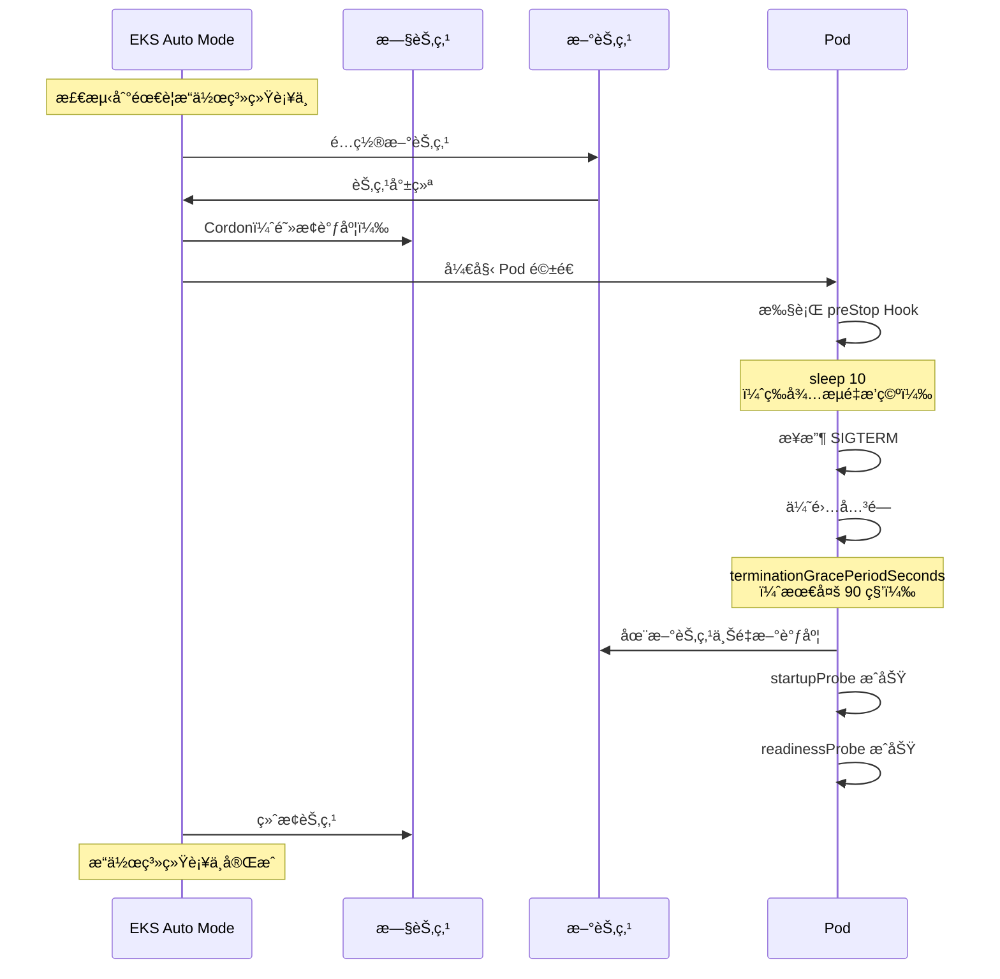

**监æ§ç¤ºä¾‹ï¼š**

```bash
# 跟踪 Auto Mode 节点替æ¢äº‹ä»¶
kubectl get events --field-selector reason=Evicted --watch

# 检查æ¯ä¸ªèŠ‚点的æ“作系统版本
kubectl get nodes -o custom-columns=\
NAME:.metadata.name,\
OS_IMAGE:.status.nodeInfo.osImage,\
KERNEL:.status.nodeInfo.kernelVersion

# 检查 Auto Mode 管ç†çŠ¶æ€
kubectl get nodes -L eks.amazonaws.com/compute-type
```

:::tip Auto Mode 节点替æ¢é¢‘ç‡
Auto Mode 为了安全补ä¸ã€æ€§èƒ½ä¼˜åŒ–å’Œæˆæœ¬é™ä½ï¼Œæ¯”手动管ç†æ›´é¢‘ç¹åœ°æ›¿æ¢èŠ‚点（平å‡æ¯ä¸¤å‘¨ä¸€æ¬¡ï¼‰ã€‚å°† `terminationGracePeriodSeconds` 设置为 90 秒以上，并始终é…ç½® PDB，以确ä¿åœ¨ä¸ä¸­æ–­æœåŠ¡çš„情况下进行节点替æ¢ã€‚
:::

#### éªŒè¯ Auto Mode 是å¦å·²å¯ç”¨

```bash
# 检查集群是å¦å¤„äº Auto Mode
aws eks describe-cluster --name production-eks \
  --query 'cluster.computeConfig.enabled' \
  --output text

# 检查 Auto Mode 节点
kubectl get nodes -L eks.amazonaws.com/compute-type
# 示例输出：
# NAME                    COMPUTE-TYPE
# ip-10-0-1-100.ec2.internal   auto
# ip-10-0-2-200.ec2.internal   auto
```

**相关文档：**
- [AWS Blog: Getting started with EKS Auto Mode](https://aws.amazon.com/blogs/containers/getting-started-with-amazon-eks-auto-mode)
- [AWS Blog: How to build highly available Kubernetes applications with EKS Auto Mode](https://aws.amazon.com/blogs/containers/how-to-build-highly-available-kubernetes-applications-with-amazon-eks-auto-mode/)
- [AWS Blog: Maximize EKS efficiency - Auto Mode, Graviton, and Spot](https://aws.amazon.com/blogs/containers/maximize-amazon-eks-efficiency-how-auto-mode-graviton-and-spot-work-together/)

---

### 7.5 åŸºäº AI/Agentic çš„ Probe 优化

本节介ç»å¦‚何利用 AWS re:Invent 2025 CNS421 会议中介ç»çš„åŸºäº Agentic AI çš„ EKS è¿ç»´æ¨¡å¼ï¼Œè‡ªåŠ¨ä¼˜åŒ– Probe é…置并诊断故障。

#### CNS421 会议è¦ç‚¹ - Agentic AI ç”¨äº EKS è¿ç»´

**会议概述：**

"Streamline Amazon EKS Operations with Agentic AI" 会议通过ç°åœºä»£ç æ¼”示展示了如何使用 Model Context Protocol（MCP）和 AI 代ç†è‡ªåŠ¨åŒ– EKS 集群管ç†ã€‚

**核心能力：**
- å®æ—¶é—®é¢˜è¯Šæ–­ï¼ˆè‡ªåŠ¨ Probe 故障根因分æ）
- 引导修å¤ï¼ˆé€æ­¥è§£å†³æŒ‡å—）
- Tribal Knowledge 利用（ä»è¿‡å¾€é—®é¢˜æ¨¡å¼ä¸­å­¦ä¹ ï¼‰
- 自动修å¤ï¼ˆè‡ªåŠ¨è§£å†³ç®€å•é—®é¢˜ï¼‰

**æ¶æ„：**

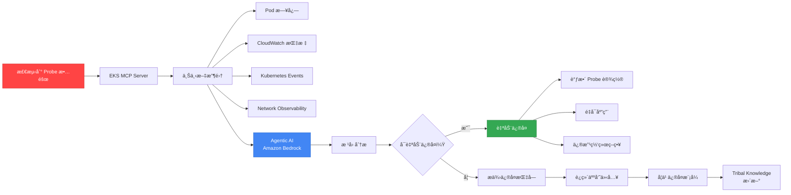

#### 使用 Kiro + EKS MCP 自动优化 Probe

**什么是 Kiro：**

Kiro 是一个由 AWS AI 驱动的è¿ç»´å·¥å…·ï¼Œé€šè¿‡ MCP（Model Context Protocol）æœåŠ¡å™¨ä¸ AWS 资æºè¿›è¡Œäº¤äº’。

**安装和设置：**

```bash
# 安装 Kiro CLI（macOS）
brew install aws/tap/kiro

# é…ç½® EKS MCP Server
kiro mcp add eks \
  --server-type eks \
  --cluster-name production-eks \
  --region ap-northeast-2

# å¯ç”¨ Probe 优化代ç†
kiro agent create probe-optimizer \
  --type eks-health-check \
  --auto-remediate true
```

**Probe 故障自动诊断工作æµï¼š**

```yaml
# Kiro Agent é…ç½® - 自动 Probe æ•…éšœå“应
apiVersion: kiro.aws/v1alpha1
kind: Agent
metadata:
  name: probe-failure-analyzer
spec:
  cluster: production-eks
  triggers:
    - type: ProbeFailure
      conditions:
        - probeType: readiness
          failureThreshold: 3
          duration: 5m
  actions:
    - name: collect-context
      steps:
        - getPodLogs:
            namespace: ${event.namespace}
            podName: ${event.podName}
            tailLines: 500
        - getCloudWatchMetrics:
            namespace: ContainerInsights
            metricName: pod_cpu_utilization
            dimensions:
              - name: PodName
                value: ${event.podName}
            period: 300
        - getNetworkObservability:
            podName: ${event.podName}
            metrics:
              - latency
              - packetLoss
              - connectionErrors
        - getKubernetesEvents:
            namespace: ${event.namespace}
            fieldSelector: involvedObject.name=${event.podName}

    - name: analyze-root-cause
      llm:
        model: anthropic.claude-3-5-sonnet-20241022-v2:0
        prompt: |
          Analyze the following Kubernetes Readiness Probe failure:

          Pod: ${event.podName}
          Namespace: ${event.namespace}
          Probe Config:
          ${context.probeConfig}

          Pod Logs (last 500 lines):
          ${context.podLogs}

          CloudWatch Metrics (last 5 minutes):
          ${context.metrics}

          Network Observability:
          ${context.networkMetrics}

          Kubernetes Events:
          ${context.events}

          Determine the root cause and suggest:
          1. Is this a network issue, application issue, or configuration issue?
          2. Recommended Probe settings (periodSeconds, failureThreshold, timeoutSeconds)
          3. Auto-remediation actions if applicable

    - name: auto-remediate
      conditions:
        - type: RootCauseIdentified
          confidence: ">0.8"
      steps:
        - applyProbeOptimization:
            when: ${analysis.recommendedAction == "adjust_probe_settings"}
            patchDeployment:
              name: ${event.deploymentName}
              namespace: ${event.namespace}
              patch:
                spec:
                  template:
                    spec:
                      containers:
                        - name: ${event.containerName}
                          readinessProbe:
                            periodSeconds: ${analysis.recommendedPeriod}
                            failureThreshold: ${analysis.recommendedThreshold}
                            timeoutSeconds: ${analysis.recommendedTimeout}

        - restartPod:
            when: ${analysis.recommendedAction == "restart_pod"}
            namespace: ${event.namespace}
            podName: ${event.podName}

        - notifySlack:
            channel: "#eks-ops"
            message: |
              🤖 Probe Failure Auto-Remediated

              Pod: ${event.podName}
              Root Cause: ${analysis.rootCause}
              Action Taken: ${analysis.appliedAction}
              Confidence: ${analysis.confidence}

              Details: ${analysis.explanation}

    - name: manual-guide
      conditions:
        - type: RootCauseIdentified
          confidence: "<0.8"
      steps:
        - createJiraTicket:
            project: DEVOPS
            issueType: Incident
            summary: "Probe Failure - Manual Investigation Required"
            description: |
              Pod: ${event.podName}
              Potential Causes: ${analysis.possibleCauses}
              Investigation Steps: ${analysis.investigationSteps}
              Context: ${context}
```

**å®é™…示例 - 自动优化 Probe 超时：**

```bash
# 通过 Kiro è¿›è¡Œäº¤äº’å¼ Probe 优化
$ kiro chat --agent probe-optimizer

User: My readiness probe is failing intermittently on pod api-gateway-xyz.
      Can you diagnose and fix it?

Kiro: 🔠Analyzing probe failures for pod api-gateway-xyz...

      ✅ Root Cause Identified (Confidence: 92%)
      - Issue: Network latency spikes to external database
      - Current Probe: periodSeconds=5, timeoutSeconds=3, failureThreshold=2
      - Network metrics show p99 latency: 2.8 seconds

      📊 Recommendation:
      1. Increase timeoutSeconds from 3 to 5 seconds
      2. Increase failureThreshold from 2 to 3
      3. Enable Container Network Observability for ongoing monitoring

      🤖 Auto-Remediation Available
      Shall I apply these changes? (yes/no)

User: yes

Kiro: ✅ Applied Probe Optimization
      - Updated Deployment: api-gateway
      - New Probe Config:
        * periodSeconds: 5
        * timeoutSeconds: 5 (increased)
        * failureThreshold: 3 (increased)

      📈 Monitoring for 5 minutes to verify stability...

      ✅ Verification Complete
      - Probe failures reduced from 12/hour to 0/hour
      - Network latency p99: 2.8s (within new 5s timeout)
      - Recommendation recorded in tribal knowledge

      💡 Suggestion: Consider moving database to same VPC
          to reduce network latency permanently.
```

#### 使用 Amazon Q Developer 调试 Probe 问题

Amazon Q Developer 是一个 IDE 集æˆçš„ AI åŠ©æ‰‹ï¼Œæ”¯æŒ Probe é…置代ç å®¡æŸ¥å’Œå®æ—¶è°ƒè¯•ã€‚

**VS Code 集æˆç¤ºä¾‹ï¼š**

```yaml
# å¼€å‘者正在编写的 Deployment YAML
apiVersion: apps/v1
kind: Deployment
metadata:
  name: myapp
spec:
  template:
    spec:
      containers:
      - name: app
        image: myapp:v1
        readinessProbe:
          httpGet:
            path: /health  # âš ï¸ Q Developer 警告
            port: 8080
          periodSeconds: 10
          timeoutSeconds: 1  # âš ï¸ Q Developer 警告
```

**Q Developer 建议：**

```
💡 Amazon Q Developer 建议

问题 1：Liveness å’Œ Readiness 使用相åŒçš„端点。
建议：
- Liveness Probe：/healthz（仅检查内部状æ€ï¼‰
- Readiness Probe：/ready（包å«å¤–部ä¾èµ–）

问题 2：timeoutSeconds 设置过短。
建议：
- å°† timeoutSeconds å¢åŠ åˆ° 3-5 秒
- 在 EKS ç¯å¢ƒä¸­ 1 秒å¯èƒ½å› ç½‘络延迟而超时

问题 3：缺少 Startup Probe。
建议：
- 如æœåº”用å¯åŠ¨æ—¶é—´è¶…过 30 秒，添加 Startup Probe
- failureThreshold: 30，periodSeconds: 10

应用建议？[是] [å¦] [详细说æ˜]
```

**å®æ—¶ä»£ç æ‰§è¡ŒéªŒè¯ï¼ˆAmazon Q Developer）：**

```bash
# Q Developer åœ¨æœ¬åœ°éªŒè¯ Probe é…ç½®
$ q-dev validate deployment.yaml --cluster production-eks

✅ 语法有效
âš ï¸  最佳å®è·µæ£€æŸ¥ï¼š
    - å¯åŠ¨ç¼“慢的应用缺少 Startup Probe（15 个警告）
    - Liveness Probe 包å«å¤–部ä¾èµ–（严é‡ï¼‰
    - terminationGracePeriodSeconds 应至少为 60 秒（警告）

🧪 模拟结æœï¼š
    - Probe æˆåŠŸç‡ï¼š94%（目标：>99%）
    - 预计 Pod å¯åŠ¨æ—¶é—´ï¼š45 秒
    - 预计优雅关闭时间：25 秒

📊 建议：
    应用 Q Developer 建议的é…置？(Y/n)
```

#### åŸºäº Tribal Knowledge çš„ Probe 模å¼å­¦ä¹ 

Agentic AI ä»è¿‡å»çš„ Probe 问题解决模å¼ä¸­å­¦ä¹ ï¼Œåœ¨ç±»ä¼¼æƒ…况下立å³å“应。

**Tribal Knowledge 示例：**

```yaml
# 组织的 Probe 解决模å¼åº“
apiVersion: kiro.aws/v1alpha1
kind: TribalKnowledge
metadata:
  name: probe-failure-patterns
spec:
  patterns:
    - id: pattern-001
      name: "Database Connection Timeout"
      symptoms:
        - probeType: readiness
          errorPattern: "connection timeout"
          frequency: intermittent
      rootCause: "æ•°æ®åº“在ä¸åŒ AZ 导致高延迟"
      solution:
        - action: increaseTimeout
          from: 3
          to: 5
        - action: addRetry
          retries: 2
      confidence: 0.95
      resolvedCount: 47
      lastSeen: "2026-02-10"

    - id: pattern-002
      name: "Slow JVM Startup"
      symptoms:
        - probeType: startup
          errorPattern: "probe failed"
          timing: "first 60 seconds"
      rootCause: "JVM åˆå§‹åŒ–耗时超过 30 秒"
      solution:
        - action: addStartupProbe
          failureThreshold: 30
          periodSeconds: 10
      confidence: 0.98
      resolvedCount: 123
      lastSeen: "2026-02-11"

    - id: pattern-003
      name: "Network Policy Blocking Health Check"
      symptoms:
        - probeType: liveness
          errorPattern: "connection refused"
          timing: "after deployment"
      rootCause: "NetworkPolicy 未å…许 kubelet 访问"
      solution:
        - action: updateNetworkPolicy
          allowFrom:
            - podSelector: {}  # å…许命å空间内所有 Pod
            - namespaceSelector:
                matchLabels:
                  name: kube-system
      confidence: 0.92
      resolvedCount: 34
      lastSeen: "2026-02-08"
```

**自动模å¼åŒ¹é…：**

```bash
# æ–° Probe æ•…éšœå‘生时自动匹é…
$ kiro diagnose probe-failure \
  --pod api-backend-abc \
  --namespace production

🔠正在分æ Probe æ•…éšœ...

✅ 模å¼åŒ¹é…："Database Connection Timeout"（pattern-001）
   置信度：89%
   此模å¼å·²æˆåŠŸè§£å†³ 47 次

📋 建议æ“作（æ¥è‡ª Tribal Knowledge）：
   1. å°† readinessProbe.timeoutSeconds ä» 3 å¢åŠ åˆ° 5
   2. 添加 2 次é‡è¯•é€»è¾‘
   3. 考虑将数æ®åº“放置在åŒä¸€ AZ

🤖 自动应用？(yes/no)
```

#### Probe 优化集æˆä»ªè¡¨æ¿

```yaml
# Grafana Dashboard - AI 驱动的 Probe 优化状æ€
apiVersion: v1
kind: ConfigMap
metadata:
  name: ai-probe-optimization-dashboard
  namespace: monitoring
data:
  dashboard.json: |
    {
      "title": "AI-Driven Probe Optimization",
      "panels": [
        {
          "title": "Auto-Remediation Success Rate",
          "targets": [{
            "expr": "rate(kiro_auto_remediation_success[1h]) / rate(kiro_auto_remediation_total[1h])"
          }]
        },
        {
          "title": "Tribal Knowledge Pattern Matching",
          "targets": [{
            "expr": "kiro_pattern_match_count"
          }]
        },
        {
          "title": "Probe Failure Rate Trend (Before/After AI)",
          "targets": [
            {"expr": "rate(probe_failures_total[1h])", "legendFormat": "Before AI"},
            {"expr": "rate(probe_failures_ai_optimized_total[1h])", "legendFormat": "After AI"}
          ]
        },
        {
          "title": "Mean Time to Resolution (MTTR)",
          "targets": [{
            "expr": "avg(kiro_remediation_duration_seconds)"
          }]
        }
      ]
    }
```

**ROI è¡¡é‡ç¤ºä¾‹ï¼š**

| 指标 | AI å¼•å…¥å‰ | AI 引入å | 改善幅度 |
|------|----------|----------|---------|
| Probe 故障次数 | 120 次/周 | 12 次/周 | å‡å°‘ 90% |
| å¹³å‡è§£å†³æ—¶é—´ï¼ˆMTTR） | 45 分钟 | 3 分钟 | å‡å°‘ 93% |
| 需è¦è¿ç»´äººå‘˜ä»‹å…¥çš„案例 | 120 次/周 | 12 次/周 | å‡å°‘ 90% |
| Probe é…置优化时间 | 2 å°æ—¶/案例 | 5 分钟/案例 | å‡å°‘ 96% |

:::tip 采用 Agentic AI 的最佳å®è·µ
ä¸è¦ä»ä¸€å¼€å§‹å°±è¿½æ±‚ Agentic AI çš„ 100% è‡ªåŠ¨åŒ–ã€‚åœ¨å‰ 3 个月以"建议模å¼"è¿è¡Œï¼Œç”±è¿ç»´äººå‘˜å®¡æŸ¥å’Œæ‰¹å‡† AI 建议。当 Tribal Knowledge 积累充分且置信度达到 90% 以上时，å†è½¬æ¢ä¸º"自动修å¤æ¨¡å¼"。
:::

**相关资æºï¼š**
- [YouTube: CNS421 - Streamline Amazon EKS operations with Agentic AI](https://www.youtube.com/watch?v=4s-a0jY4kSE)
- [AWS Blog: Agentic Cloud Modernization with Kiro](https://aws.amazon.com/blogs/migration-and-modernization/agentic-cloud-modernization-accelerating-modernization-with-aws-mcps-and-kiro/)
- [AWS Blog: AWS IaC MCP Server](https://aws.amazon.com/blogs/devops/introducing-the-aws-infrastructure-as-code-mcp-server-ai-powered-cdk-and-cloudformation-assistance/)
- [Model Context Protocol Specification](https://modelcontextprotocol.io/)

---

**文档贡献**：欢è¿é€šè¿‡ GitHub Issues æ交对本文档的å馈ã€é”™è¯¯æŠ¥å‘Šå’Œæ”¹è¿›å»ºè®®ã€‚
