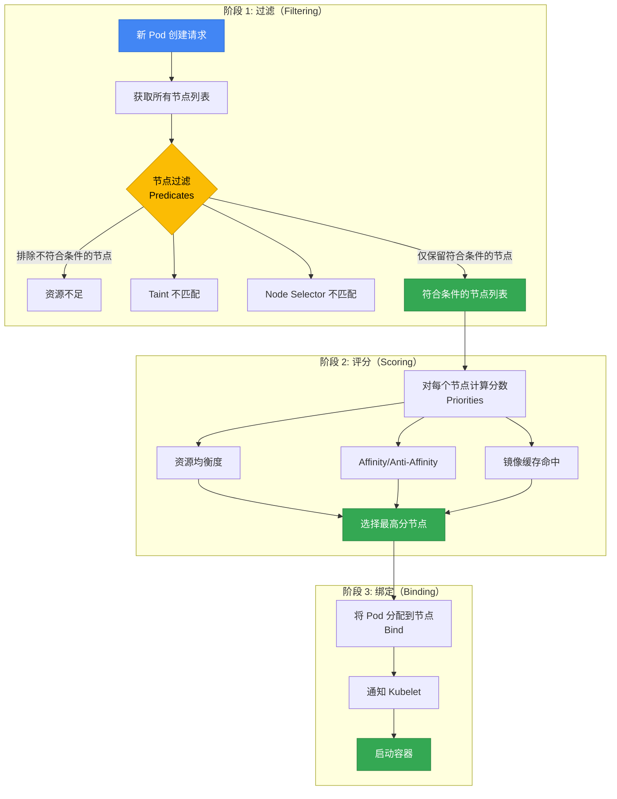
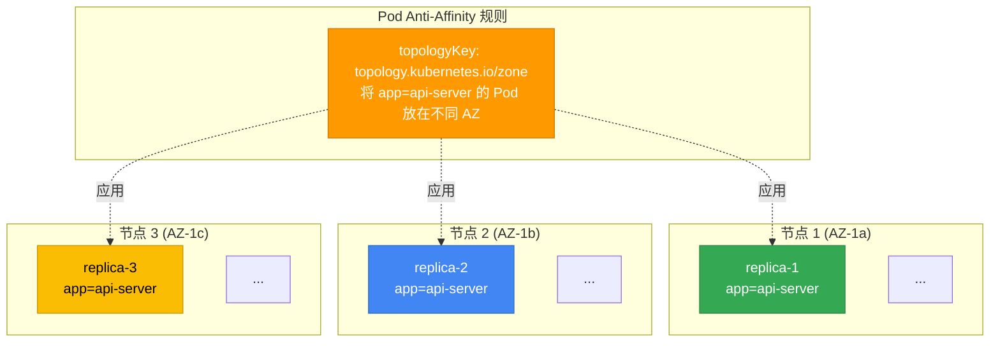
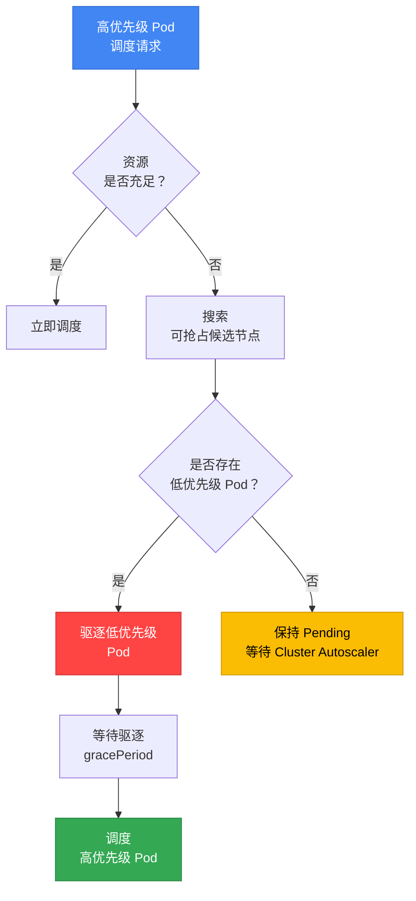
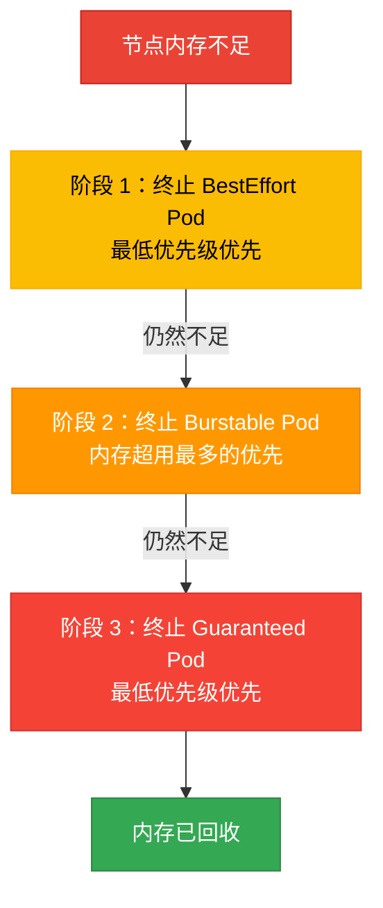
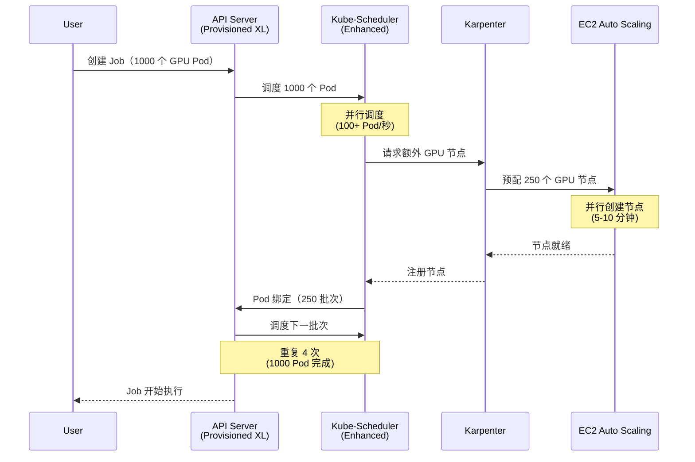
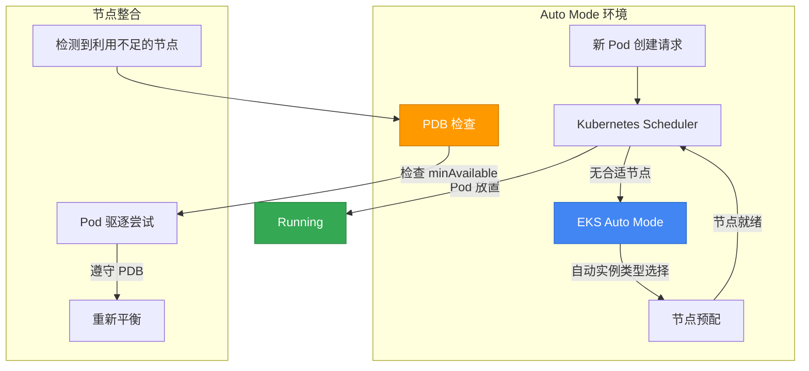
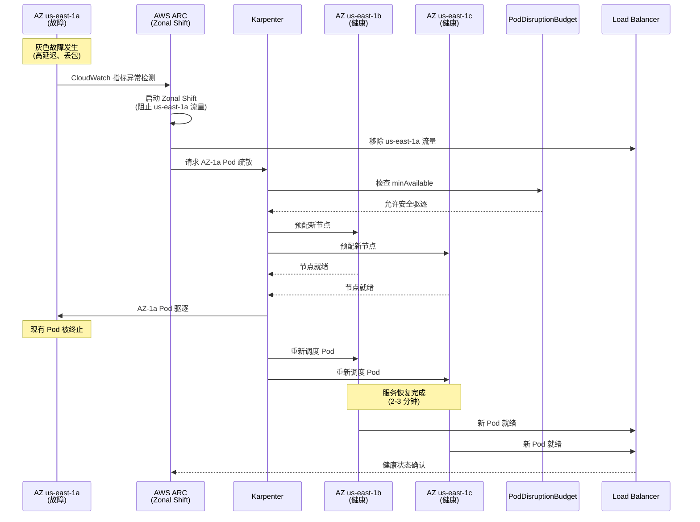
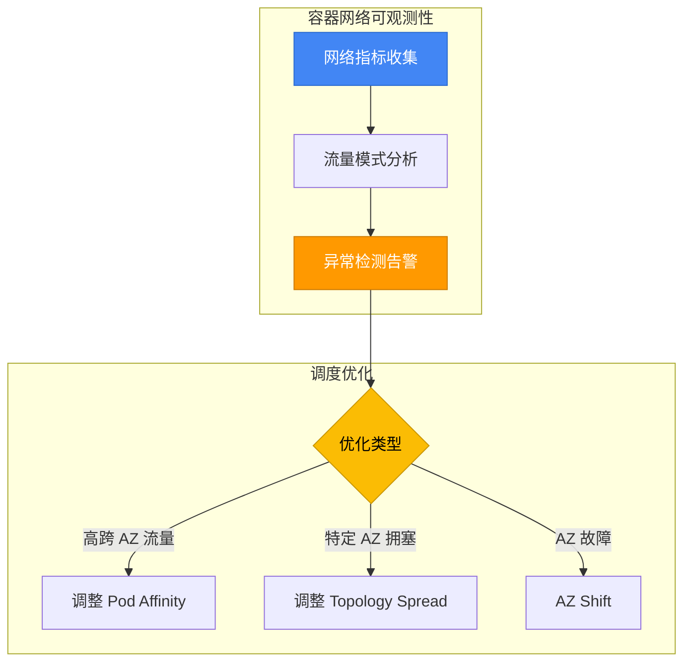
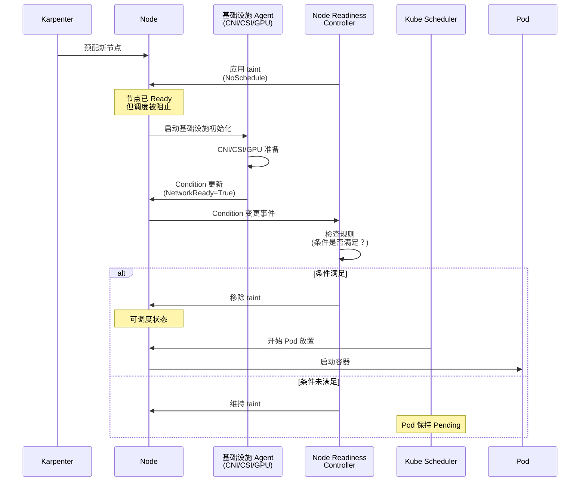
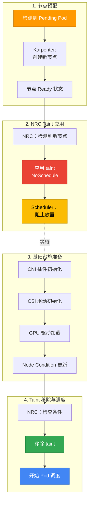

# EKS Pod 调度与可用性模式

> 📅 **撰写日期**: 2025-10-15 | **修改日期**: 2026-02-14 | ⏱️ **阅读时间**: 约 30 分钟

> **📌 参考环境**: EKS 1.30+、Karpenter v1.x、Kubernetes 1.30+

## 1. 概述

Kubernetes Pod 调度是直接影响服务可用性、性能和成本效率的核心机制。应用正确的调度策略可获得以下收益：

- **高可用性**：通过故障域隔离最大限度减少服务中断
- **性能优化**：将工作负载放置在合适的节点上以提升响应速度
- **资源效率**：通过均衡利用节点资源降低成本
- **稳定运维**：通过基于优先级的调度和抢占控制确保关键工作负载获得资源

本文涵盖从 Pod 调度核心概念到高级模式的全部内容，为 EKS 环境提供生产就绪的 YAML 示例和决策指南。

:::info 高可用架构参考
本文档专注于 **Pod 级别** 的调度模式。有关集群级高可用架构（Multi-AZ 策略、Topology Spread、Cell Architecture），请参阅 [EKS 高可用架构指南](/docs/operations-observability/eks-resiliency-guide)。
:::

### 为什么调度如此重要

| 场景 | 不当调度 | 合理调度 |
|---------|----------------|----------------|
| **故障隔离** | 所有副本在同一节点 → 节点故障时完全中断 | Anti-Affinity 分布到多个节点 → 仅部分故障 |
| **资源争用** | CPU 密集型 Pod 集中在一个节点 → 性能下降 | Node Affinity 分离工作负载 → 性能稳定 |
| **成本优化** | 不需要 GPU 的 Pod 被放置在 GPU 节点 → 成本浪费 | Taints/Tolerations 隔离专用节点 → 节省成本 |
| **升级安全** | 未配置 PDB → 滚动更新时服务中断 | 配置 PDB → 保证最低可用 Pod 数量 |
| **紧急响应** | 未设置优先级 → 关键工作负载卡在 Pending 状态 | 配置 PriorityClass → 关键 Pod 优先调度 |

---

## 2. Kubernetes 调度基础

### 2.1 调度流程

Kubernetes 调度器通过三阶段流程将 Pod 放置到节点上：



**1. 过滤（Predicates）**：排除不满足要求的节点
- 资源不足（CPU、Memory）
- Taints/Tolerations 不匹配
- Node Selector 条件不满足
- 卷拓扑约束（EBS AZ-Pinning）
- 端口冲突

**2. 评分（Priorities）**：对剩余节点打分以选择最优节点
- 资源均衡度（均匀利用）
- Pod Affinity/Anti-Affinity 满足度
- 镜像缓存命中
- Topology Spread 均匀度
- 节点偏好（PreferredDuringScheduling）

**3. 绑定**：将 Pod 分配到最高分节点并通知 Kubelet

:::tip 调度失败调试
如果 Pod 持续处于 `Pending` 状态，请使用 `kubectl describe pod <pod-name>` 检查 Events 部分。`Insufficient cpu`、`No nodes available` 或 `Taint not tolerated` 等消息有助于确定失败原因。
:::

### 2.2 影响调度的因素

| 因素 | 类型 | 影响阶段 | 约束强度 | 主要使用场景 |
|------|------|-----------|--------|---------------|
| **Node Selector** | Pod | 过滤 | 硬性 | 指定特定节点类型（GPU、ARM） |
| **Node Affinity** | Pod | 过滤/评分 | 硬性/软性 | 细粒度节点选择条件 |
| **Pod Affinity** | Pod | 评分 | 硬性/软性 | 将相关 Pod 放在一起 |
| **Pod Anti-Affinity** | Pod | 过滤/评分 | 硬性/软性 | 将 Pod 分散开来 |
| **Taints/Tolerations** | 节点 + Pod | 过滤 | 硬性 | 专用节点隔离 |
| **Topology Spread** | Pod | 评分 | 硬性/软性 | 跨 AZ/节点均匀分布 |
| **PriorityClass** | Pod | 抢占 | 硬性 | 基于优先级的资源抢占 |
| **Resource Requests** | Pod | 过滤 | 硬性 | 保证最低资源 |
| **PDB** | Pod 组 | 驱逐 | 硬性 | 保证最低可用 Pod 数量 |

**硬性 vs 软性约束：**
- **硬性（Required）**：不满足条件则调度失败 → `Pending` 状态
- **软性（Preferred）**：优先满足条件，但即使不满足也会继续调度 → 允许回退

---

## 3. Node Affinity 与 Anti-Affinity

### 3.1 Node Selector（基础）

Node Selector 是最简单的节点选择机制，仅支持基于标签的精确匹配。

```yaml
apiVersion: apps/v1
kind: Deployment
metadata:
  name: gpu-workload
spec:
  replicas: 2
  selector:
    matchLabels:
      app: ml-training
  template:
    metadata:
      labels:
        app: ml-training
    spec:
      nodeSelector:
        node.kubernetes.io/instance-type: g5.2xlarge
        workload-type: gpu
      containers:
      - name: trainer
        image: ml/trainer:v2.0
        resources:
          requests:
            nvidia.com/gpu: 1
```

**限制**：Node Selector 仅支持 `AND` 条件，不支持 `OR`、`NOT` 或比较运算符。需要复杂条件时请使用 Node Affinity。

### 3.2 Node Affinity 详解

Node Affinity 是 Node Selector 的扩展版本，可以表达复杂的逻辑条件和偏好。

#### Required vs Preferred

| 类型 | 行为 | 使用时机 |
|------|------|----------|
| `requiredDuringSchedulingIgnoredDuringExecution` | 必须满足条件（硬性） | Pod 必须放置在特定节点上时 |
| `preferredDuringSchedulingIgnoredDuringExecution` | 优先满足条件（软性，基于权重） | 希望优先但可接受替代方案时 |

:::info IgnoredDuringExecution 的含义
`IgnoredDuringExecution` 表示即使 Pod **已经运行**后节点标签发生变化，Pod 也不会被驱逐。未来引入 `RequiredDuringExecution` 后，如果运行期间条件不再满足，Pod 将被重新调度。
:::

#### Operator 类型

| Operator | 说明 | 示例 |
|--------|------|------|
| `In` | 值在列表中 | `values: ["t3.xlarge", "t3.2xlarge"]` |
| `NotIn` | 值不在列表中 | `values: ["t2.micro", "t2.small"]` |
| `Exists` | 键存在（值无关） | 仅检查标签是否存在 |
| `DoesNotExist` | 键不存在 | 选择没有特定标签的节点 |
| `Gt` | 值大于（数值型） | `values: ["100"]`（如 CPU 核心数） |
| `Lt` | 值小于（数值型） | `values: ["10"]` |

#### 按使用场景的 YAML 示例

**示例 1：将 ML 工作负载放置在 GPU 节点上（硬性）**

```yaml
apiVersion: apps/v1
kind: Deployment
metadata:
  name: ml-training
spec:
  replicas: 3
  selector:
    matchLabels:
      app: ml-training
  template:
    metadata:
      labels:
        app: ml-training
    spec:
      affinity:
        nodeAffinity:
          requiredDuringSchedulingIgnoredDuringExecution:
            nodeSelectorTerms:
            - matchExpressions:
              - key: node.kubernetes.io/instance-type
                operator: In
                values:
                - g5.xlarge
                - g5.2xlarge
                - g5.4xlarge
              - key: karpenter.sh/capacity-type
                operator: NotIn
                values:
                - spot  # GPU 工作负载排除 Spot
      containers:
      - name: trainer
        image: ml/trainer:v3.0
        resources:
          requests:
            nvidia.com/gpu: 1
            cpu: "4"
            memory: 16Gi
```

**示例 2：实例系列偏好（软性，带权重）**

```yaml
apiVersion: apps/v1
kind: Deployment
metadata:
  name: api-server
spec:
  replicas: 6
  selector:
    matchLabels:
      app: api-server
  template:
    metadata:
      labels:
        app: api-server
    spec:
      affinity:
        nodeAffinity:
          # 必须：仅使用 On-Demand 节点
          requiredDuringSchedulingIgnoredDuringExecution:
            nodeSelectorTerms:
            - matchExpressions:
              - key: karpenter.sh/capacity-type
                operator: In
                values:
                - on-demand
          # 优先：按 c7i > c6i > m6i 顺序偏好
          preferredDuringSchedulingIgnoredDuringExecution:
          - weight: 100
            preference:
              matchExpressions:
              - key: node.kubernetes.io/instance-type
                operator: In
                values:
                - c7i.xlarge
                - c7i.2xlarge
          - weight: 80
            preference:
              matchExpressions:
              - key: node.kubernetes.io/instance-type
                operator: In
                values:
                - c6i.xlarge
                - c6i.2xlarge
          - weight: 50
            preference:
              matchExpressions:
              - key: node.kubernetes.io/instance-type
                operator: In
                values:
                - m6i.xlarge
                - m6i.2xlarge
      containers:
      - name: api
        image: api-server:v2.5
        resources:
          requests:
            cpu: "1"
            memory: 2Gi
```

**示例 3：指定特定 AZ（数据库客户端）**

```yaml
apiVersion: apps/v1
kind: Deployment
metadata:
  name: db-client
spec:
  replicas: 4
  selector:
    matchLabels:
      app: db-client
  template:
    metadata:
      labels:
        app: db-client
    spec:
      affinity:
        nodeAffinity:
          # 放置在与 RDS 实例相同的 AZ（us-east-1a）以减少跨 AZ 流量成本
          requiredDuringSchedulingIgnoredDuringExecution:
            nodeSelectorTerms:
            - matchExpressions:
              - key: topology.kubernetes.io/zone
                operator: In
                values:
                - us-east-1a
      containers:
      - name: client
        image: db-client:v1.2
        env:
        - name: DB_ENDPOINT
          value: "mydb.us-east-1a.rds.amazonaws.com"
```

### 3.3 Node Anti-Affinity

Node Anti-Affinity 没有显式语法，而是通过 Node Affinity 的 `NotIn` 和 `DoesNotExist` 运算符来实现。

```yaml
apiVersion: apps/v1
kind: Deployment
metadata:
  name: avoid-spot
spec:
  replicas: 3
  selector:
    matchLabels:
      app: critical-service
  template:
    metadata:
      labels:
        app: critical-service
    spec:
      affinity:
        nodeAffinity:
          requiredDuringSchedulingIgnoredDuringExecution:
            nodeSelectorTerms:
            - matchExpressions:
              # 避开 Spot 节点
              - key: karpenter.sh/capacity-type
                operator: NotIn
                values:
                - spot
              # 避开 ARM 架构
              - key: kubernetes.io/arch
                operator: NotIn
                values:
                - arm64
      containers:
      - name: app
        image: critical-service:v1.0
```

---

## 4. Pod Affinity 与 Anti-Affinity

Pod Affinity 和 Anti-Affinity 基于 **Pod 之间的关系** 做出调度决策。这使您可以将相关 Pod 放在一起（Affinity）或分散开来（Anti-Affinity）。

### 4.1 Pod Affinity

Pod Affinity 将 Pod 放置在运行特定 Pod 的同一拓扑域（节点、AZ、区域）中。

**主要使用场景：**
- **缓存局部性**：将缓存服务器和应用放在同一节点以最小化延迟
- **数据局部性**：将数据处理工作负载放在靠近数据源的位置
- **通信密集型**：将频繁通信的微服务放在同一 AZ

```yaml
apiVersion: apps/v1
kind: Deployment
metadata:
  name: cache-client
spec:
  replicas: 3
  selector:
    matchLabels:
      app: cache-client
  template:
    metadata:
      labels:
        app: cache-client
    spec:
      affinity:
        podAffinity:
          # 硬性：与 Redis Pod 放在同一节点（超低延迟需求）
          requiredDuringSchedulingIgnoredDuringExecution:
          - labelSelector:
              matchExpressions:
              - key: app
                operator: In
                values:
                - redis
            topologyKey: kubernetes.io/hostname
      containers:
      - name: client
        image: cache-client:v1.0
```

**topologyKey 说明：**

| topologyKey | 范围 | 说明 |
|-------------|------|------|
| `kubernetes.io/hostname` | 节点 | 放在同一节点（最强共置） |
| `topology.kubernetes.io/zone` | AZ | 放在同一 AZ |
| `topology.kubernetes.io/region` | 区域 | 放在同一区域 |
| 自定义标签 | 用户自定义 | 例如 `rack`、`datacenter` |

**软性 Affinity 示例（优先满足，允许替代）：**

```yaml
apiVersion: apps/v1
kind: Deployment
metadata:
  name: web-frontend
spec:
  replicas: 6
  selector:
    matchLabels:
      app: web-frontend
  template:
    metadata:
      labels:
        app: web-frontend
    spec:
      affinity:
        podAffinity:
          # 软性：优先与 API 服务器在同一 AZ（减少跨 AZ 流量成本）
          preferredDuringSchedulingIgnoredDuringExecution:
          - weight: 100
            podAffinityTerm:
              labelSelector:
                matchExpressions:
                - key: app
                  operator: In
                  values:
                  - api-server
              topologyKey: topology.kubernetes.io/zone
      containers:
      - name: frontend
        image: web-frontend:v2.0
```

### 4.2 Pod Anti-Affinity

Pod Anti-Affinity 防止 Pod 与特定其他 Pod 被放置在同一拓扑域中。它是确保高可用性的关键模式。



#### 硬性 Anti-Affinity（故障域隔离）

```yaml
apiVersion: apps/v1
kind: Deployment
metadata:
  name: api-server
spec:
  replicas: 6
  selector:
    matchLabels:
      app: api-server
  template:
    metadata:
      labels:
        app: api-server
    spec:
      affinity:
        podAntiAffinity:
          # 硬性：每个节点最多放置 1 个副本（节点故障隔离）
          requiredDuringSchedulingIgnoredDuringExecution:
          - labelSelector:
              matchExpressions:
              - key: app
                operator: In
                values:
                - api-server
            topologyKey: kubernetes.io/hostname
      containers:
      - name: api
        image: api-server:v3.0
        resources:
          requests:
            cpu: "1"
            memory: 2Gi
```

:::warning 硬性 Anti-Affinity 注意事项
当使用 `kubernetes.io/hostname` 应用硬性 Anti-Affinity 时，如果副本数超过节点数，部分 Pod 将保持 `Pending` 状态。例如，在 3 个节点上部署 5 个副本将导致 2 个无法调度。此情况下请使用软性 Anti-Affinity。
:::

#### 软性 Anti-Affinity（推荐模式）

```yaml
apiVersion: apps/v1
kind: Deployment
metadata:
  name: worker
spec:
  replicas: 10
  selector:
    matchLabels:
      app: worker
  template:
    metadata:
      labels:
        app: worker
    spec:
      affinity:
        podAntiAffinity:
          # 软性：尽可能分散到不同节点（灵活性）
          preferredDuringSchedulingIgnoredDuringExecution:
          - weight: 100
            podAffinityTerm:
              labelSelector:
                matchExpressions:
                - key: app
                  operator: In
                  values:
                  - worker
              topologyKey: kubernetes.io/hostname
      containers:
      - name: worker
        image: worker:v2.1
        resources:
          requests:
            cpu: "500m"
            memory: 1Gi
```

#### 硬性 vs 软性选择标准

| 场景 | 建议 | 原因 |
|---------|------|------|
| 副本数 &lt;= 节点数 | 硬性 | 可以精确实现每节点 1 个 |
| 副本数 > 节点数 | 软性 | 允许部分节点放置 2 个以上 |
| 关键任务服务 | 硬性（AZ 级别） | 完全故障域隔离 |
| 一般工作负载 | 软性 | 调度灵活性 |
| 需要快速扩展 | 软性 | 避免 Pending 状态 |

### 4.3 Affinity/Anti-Affinity vs Topology Spread 对比

| 对比项 | Pod Anti-Affinity | Topology Spread Constraints |
|----------|-------------------|----------------------------|
| **目的** | Pod 之间的分离 | Pod 的均匀分布 |
| **粒度** | 按 Pod 控制 | 跨域的均衡控制 |
| **复杂度** | 低 | 中 |
| **灵活性** | 硬性/软性选择 | 通过 maxSkew 实现容差范围 |
| **主要用途** | 分离同一应用的副本 | 多应用间的整体均衡 |
| **AZ 分布** | 可以 | 更精细（minDomains） |
| **节点分布** | 可以 | 更精细（maxSkew） |
| **推荐组合** | Topology Spread (AZ) + Anti-Affinity (节点) | |

:::info Topology Spread Constraints 参考
Topology Spread Constraints 提供比 Pod Anti-Affinity 更精细的分布控制。详细信息和 YAML 示例请参阅 [EKS 高可用架构指南](/docs/operations-observability/eks-resiliency-guide#pod-topology-spread-constraints)。
:::

#### 4.3.1 Topology Spread Constraints 实战模式

Topology Spread Constraints 可以优雅地解决复杂的分布需求。以下是生产环境中常用的模式及 YAML 示例。

##### 模式 1：Multi-AZ 均匀分布（基础）

最常见的模式，将所有副本均匀分布到各 AZ。

```yaml
apiVersion: apps/v1
kind: Deployment
metadata:
  name: multi-az-app
  namespace: production
spec:
  replicas: 9
  selector:
    matchLabels:
      app: multi-az-app
  template:
    metadata:
      labels:
        app: multi-az-app
    spec:
      topologySpreadConstraints:
      - maxSkew: 1
        topologyKey: topology.kubernetes.io/zone
        whenUnsatisfiable: DoNotSchedule
        labelSelector:
          matchLabels:
            app: multi-az-app
      containers:
      - name: app
        image: myapp:v1.0
        resources:
          requests:
            cpu: 500m
            memory: 512Mi
```

**工作原理：**
- `maxSkew: 1`：各 AZ 之间的 Pod 数量差异最多允许为 1
- 9 个副本 → us-east-1a(3)、us-east-1b(3)、us-east-1c(3)
- `whenUnsatisfiable: DoNotSchedule`：违反约束时保持 Pod 为 Pending 状态

**使用场景：**
- 关键任务服务的 AZ 故障应对
- 客户端流量从所有 AZ 均匀到达时
- 需要数据中心级故障隔离时

##### 模式 2：使用 minDomains（最小 AZ 保证）

`minDomains` 保证 Pod 必须分布到的最少域（AZ）数量。它可以防止在 AZ 减少场景中 Pod 堆积在一个位置。

```yaml
apiVersion: apps/v1
kind: Deployment
metadata:
  name: ha-critical-service
  namespace: production
spec:
  replicas: 6
  selector:
    matchLabels:
      app: ha-critical-service
      tier: critical
  template:
    metadata:
      labels:
        app: ha-critical-service
        tier: critical
    spec:
      topologySpreadConstraints:
      - maxSkew: 1
        minDomains: 3  # 必须分布到至少 3 个 AZ
        topologyKey: topology.kubernetes.io/zone
        whenUnsatisfiable: DoNotSchedule
        labelSelector:
          matchLabels:
            app: ha-critical-service
      containers:
      - name: service
        image: critical-service:v2.5
        resources:
          requests:
            cpu: "1"
            memory: 1Gi
          limits:
            cpu: "2"
            memory: 2Gi
```

**工作原理：**
- `minDomains: 3`：保证 Pod 分布到至少 3 个 AZ
- 6 个副本 → 每个 AZ 至少 2 个
- 即使特定 AZ 缺少资源，Pod 也不会全部汇聚到其他 AZ

**使用场景：**
- 金融和支付系统等超高可用服务
- 需要 99.99% 以上 SLA 时
- AZ 缩减（Zonal Shift）期间维持最低可用性

:::warning 设置 minDomains 时的注意事项
当设置了 `minDomains` 但所需数量的域不存在或缺少资源时，Pod 将保持 Pending 状态。配置前请确认集群中实际可用的 AZ 数量。
:::

##### 模式 3：Anti-Affinity + Topology Spread 组合

确保每个节点最多 1 个副本，同时保证跨 AZ 均匀分布的模式。

```yaml
apiVersion: apps/v1
kind: Deployment
metadata:
  name: combined-constraints-app
  namespace: production
spec:
  replicas: 12
  selector:
    matchLabels:
      app: combined-app
  template:
    metadata:
      labels:
        app: combined-app
        version: v3.0
    spec:
      # 1. Topology Spread：跨 AZ 均匀分布（硬性）
      topologySpreadConstraints:
      - maxSkew: 1
        minDomains: 3
        topologyKey: topology.kubernetes.io/zone
        whenUnsatisfiable: DoNotSchedule
        labelSelector:
          matchLabels:
            app: combined-app

      # 2. Anti-Affinity：跨节点分布（硬性）
      affinity:
        podAntiAffinity:
          requiredDuringSchedulingIgnoredDuringExecution:
          - labelSelector:
              matchExpressions:
              - key: app
                operator: In
                values:
                - combined-app
            topologyKey: kubernetes.io/hostname

      containers:
      - name: app
        image: combined-app:v3.0
        resources:
          requests:
            cpu: "2"
            memory: 4Gi
```

**工作原理：**
- **第一层（AZ）**：12 个副本 → 每个 AZ 均匀分布 4 个
- **第二层（节点）**：每个节点最多 1 个 Pod

**效果：**
- 节点故障最多影响 1 个 Pod
- AZ 故障最多影响 4 个 Pod
- 12 个中的 8 个（66.7%）始终可用

**使用场景：**
- 完全消除单点故障
- 兼顾硬件和数据中心故障的弹性
- 高流量 API 服务器、支付网关

##### 模式 4：多级 Topology Spread（Zone + Node）

在单个 Pod Spec 中同时控制多个拓扑级别的分布。

```yaml
apiVersion: apps/v1
kind: Deployment
metadata:
  name: multi-level-spread
  namespace: production
spec:
  replicas: 18
  selector:
    matchLabels:
      app: multi-level-app
  template:
    metadata:
      labels:
        app: multi-level-app
    spec:
      topologySpreadConstraints:
      # 约束 1：AZ 级别分布（硬性）
      - maxSkew: 1
        minDomains: 3
        topologyKey: topology.kubernetes.io/zone
        whenUnsatisfiable: DoNotSchedule
        labelSelector:
          matchLabels:
            app: multi-level-app

      # 约束 2：节点级别分布（软性）
      - maxSkew: 2
        topologyKey: kubernetes.io/hostname
        whenUnsatisfiable: ScheduleAnyway
        labelSelector:
          matchLabels:
            app: multi-level-app

      containers:
      - name: app
        image: multi-level-app:v1.5
        resources:
          requests:
            cpu: "1"
            memory: 2Gi
```

**工作原理：**
- **步骤 1（AZ）**：18 → us-east-1a(6)、us-east-1b(6)、us-east-1c(6)
- **步骤 2（节点）**：每个 AZ 内，各节点的 Pod 数量差异最多为 2
- 节点约束设为软性（`ScheduleAnyway`）以防止调度失败

**使用场景：**
- 大规模副本部署（10+ 副本）
- 动态节点数量的环境（Karpenter 自动伸缩）
- AZ 分布是必须的，节点分布是优先的

##### 模式对比表

| 模式 | maxSkew | minDomains | whenUnsatisfiable | 附加约束 | 复杂度 | 推荐副本数 |
|------|---------|------------|-------------------|----------|--------|----------------|
| **模式 1：基础 Multi-AZ** | 1 | - | DoNotSchedule | 无 | 低 | 3~12 |
| **模式 2：minDomains** | 1 | 3 | DoNotSchedule | 无 | 中 | 6~20 |
| **模式 3：Anti-Affinity 组合** | 1 | 3 | DoNotSchedule | 硬性 Anti-Affinity | 高 | 12~50 |
| **模式 4：多级 Spread** | 1, 2 | 3 | 混合 | 2 级 Topology | 高 | 15+ |

##### 故障排除：Topology Spread 失败原因

| 症状 | 原因 | 解决方案 |
|------|------|----------|
| Pod 卡在 Pending 状态 | `maxSkew` 超限或 `minDomains` 不满足 | 使用 `kubectl describe pod` 检查 Events，调整副本数或添加节点 |
| Pod 集中在特定 AZ | 使用了 `whenUnsatisfiable: ScheduleAnyway` | 改为 `DoNotSchedule` 硬性约束 |
| 添加新 AZ 后未重新均衡 | 调度器不会重新均衡已有 Pod | 使用 Descheduler 或 Rolling Restart |
| 设置 `minDomains` 后所有 Pod Pending | 集群缺少所需数量的 AZ | 将 `minDomains` 调整为实际 AZ 数量 |

:::tip Topology Spread 调试命令
```bash
# 检查已放置 Pod 的 AZ 分布
kubectl get pods -n production -l app=multi-az-app \
  -o custom-columns=NAME:.metadata.name,NODE:.spec.nodeName,ZONE:.spec.nodeSelector.topology\.kubernetes\.io/zone

# 检查每个节点的 Pod 数量
kubectl get pods -A -o wide --no-headers | \
  awk '{print $8}' | sort | uniq -c | sort -rn
```
:::

**推荐组合模式：**

```yaml
apiVersion: apps/v1
kind: Deployment
metadata:
  name: best-practice-app
spec:
  replicas: 6
  selector:
    matchLabels:
      app: best-practice-app
  template:
    metadata:
      labels:
        app: best-practice-app
    spec:
      # Topology Spread：跨 AZ 均匀分布（硬性）
      topologySpreadConstraints:
      - maxSkew: 1
        topologyKey: topology.kubernetes.io/zone
        whenUnsatisfiable: DoNotSchedule
        labelSelector:
          matchLabels:
            app: best-practice-app
        minDomains: 3
      # Anti-Affinity：跨节点分布（软性）
      affinity:
        podAntiAffinity:
          preferredDuringSchedulingIgnoredDuringExecution:
          - weight: 100
            podAffinityTerm:
              labelSelector:
                matchExpressions:
                - key: app
                  operator: In
                  values:
                  - best-practice-app
              topologyKey: kubernetes.io/hostname
      containers:
      - name: app
        image: app:v1.0
```

---

## 5. Taints 与 Tolerations

Taints 和 Tolerations 是**节点级排斥机制**。当节点上应用了 Taint 后，只有容忍该 Taint 的 Pod 才会被调度到该节点。

**概念：**
- **Taint**：应用于节点（例如，"该节点是 GPU 专用的"）
- **Toleration**：应用于 Pod（例如，"我可以容忍 GPU 节点"）

### 5.1 Taint 效果

| 效果 | 行为 | 对已有 Pod 的影响 | 使用时机 |
|--------|------|--------------|----------|
| `NoSchedule` | 阻止新 Pod 调度 | 已有 Pod 保留 | 创建新的专用节点时 |
| `PreferNoSchedule` | 尽可能阻止调度（软性） | 已有 Pod 保留 | 优先避开（允许替代） |
| `NoExecute` | 阻止调度 + 驱逐已有 Pod | 已有 Pod 立即被驱逐 | 节点维护、紧急疏散 |

**Taint 应用命令：**

```bash
# NoSchedule：阻止新 Pod 调度
kubectl taint nodes node1 workload-type=gpu:NoSchedule

# NoExecute：阻止新调度 + 驱逐已有 Pod
kubectl taint nodes node1 maintenance=true:NoExecute

# 移除 Taint（末尾加 '-'）
kubectl taint nodes node1 workload-type=gpu:NoSchedule-
```

### 5.2 常见 Taint 模式

#### 模式 1：专用节点组（GPU、高内存）

```yaml
# 在节点上应用 Taint（kubectl 或 Karpenter）
# kubectl taint nodes gpu-node-1 nvidia.com/gpu=present:NoSchedule

# GPU Pod 声明 Toleration
apiVersion: v1
kind: Pod
metadata:
  name: gpu-job
spec:
  tolerations:
  - key: nvidia.com/gpu
    operator: Equal
    value: present
    effect: NoSchedule
  nodeSelector:
    node.kubernetes.io/instance-type: g5.2xlarge
  containers:
  - name: trainer
    image: ml/trainer:v1.0
    resources:
      limits:
        nvidia.com/gpu: 1
```

#### 模式 2：系统工作负载隔离

```yaml
# 使用 Karpenter 创建系统专用 NodePool
apiVersion: karpenter.sh/v1
kind: NodePool
metadata:
  name: system-pool
spec:
  template:
    spec:
      requirements:
      - key: node.kubernetes.io/instance-type
        operator: In
        values: ["c6i.large", "c6i.xlarge"]
      taints:
      - key: workload-type
        value: system
        effect: NoSchedule
  limits:
    cpu: "20"
---
# 系统 DaemonSet（监控代理）
apiVersion: apps/v1
kind: DaemonSet
metadata:
  name: monitoring-agent
spec:
  selector:
    matchLabels:
      app: monitoring-agent
  template:
    metadata:
      labels:
        app: monitoring-agent
    spec:
      tolerations:
      - key: workload-type
        operator: Equal
        value: system
        effect: NoSchedule
      # 由于必须部署在所有节点上，还需容忍默认 Taint
      - key: node.kubernetes.io/not-ready
        operator: Exists
        effect: NoExecute
      - key: node.kubernetes.io/unreachable
        operator: Exists
        effect: NoExecute
      containers:
      - name: agent
        image: monitoring-agent:v2.0
```

#### 模式 3：节点维护（Drain 准备）

```bash
# 步骤 1：在节点上应用 NoExecute Taint
kubectl taint nodes node-1 maintenance=true:NoExecute

# 结果：所有没有匹配 Toleration 的 Pod 立即被驱逐并迁移到其他节点
# 如果配置了 PDB，驱逐会遵守 minAvailable 并按顺序进行

# 步骤 2：维护完成后移除 Taint
kubectl taint nodes node-1 maintenance=true:NoExecute-
kubectl uncordon node-1
```

### 5.3 Toleration 配置

#### Operator：Equal vs Exists

```yaml
# Equal：需要精确的 key=value 匹配
tolerations:
- key: workload-type
  operator: Equal
  value: gpu
  effect: NoSchedule

# Exists：仅需 key 存在（忽略 value）
tolerations:
- key: workload-type
  operator: Exists
  effect: NoSchedule

# 容忍所有 Taint（用于 DaemonSet 等）
tolerations:
- operator: Exists
```

#### tolerationSeconds（仅限 NoExecute）

当应用 `NoExecute` Taint 时，Pod 默认立即被驱逐，但 `tolerationSeconds` 可以提供宽限期。

```yaml
apiVersion: v1
kind: Pod
metadata:
  name: resilient-app
spec:
  tolerations:
  # 即使节点变为 NotReady 也停留 300 秒（瞬态故障应对）
  - key: node.kubernetes.io/not-ready
    operator: Exists
    effect: NoExecute
    tolerationSeconds: 300
  # 即使节点变为 Unreachable 也停留 300 秒
  - key: node.kubernetes.io/unreachable
    operator: Exists
    effect: NoExecute
    tolerationSeconds: 300
  containers:
  - name: app
    image: app:v1.0
```

**默认值**：未指定 `tolerationSeconds` 时，Kubernetes 使用以下默认值：
- `node.kubernetes.io/not-ready`：300 秒
- `node.kubernetes.io/unreachable`：300 秒

### 5.4 EKS 默认 Taint

EKS 自动对某些节点应用 Taint：

| Taint | 应用对象 | 效果 | 应对方式 |
|-------|----------|------|----------|
| `node.kubernetes.io/not-ready` | 未就绪的节点 | NoExecute | 自动 Toleration（kubelet） |
| `node.kubernetes.io/unreachable` | 不可达的节点 | NoExecute | 自动 Toleration（kubelet） |
| `node.kubernetes.io/disk-pressure` | 磁盘空间不足的节点 | NoSchedule | 仅 DaemonSet 容忍 |
| `node.kubernetes.io/memory-pressure` | 内存不足的节点 | NoSchedule | 仅 DaemonSet 容忍 |
| `node.kubernetes.io/pid-pressure` | PID 不足的节点 | NoSchedule | 仅 DaemonSet 容忍 |
| `node.kubernetes.io/network-unavailable` | 网络未配置的节点 | NoSchedule | 由 CNI 插件移除 |

### 5.5 Karpenter 中的 Taint 管理

Karpenter 在 NodePool 中以声明式方式管理 Taint：

```yaml
apiVersion: karpenter.sh/v1
kind: NodePool
metadata:
  name: gpu-pool
spec:
  template:
    spec:
      requirements:
      - key: node.kubernetes.io/instance-type
        operator: In
        values: ["g5.xlarge", "g5.2xlarge"]
      - key: karpenter.sh/capacity-type
        operator: In
        values: ["on-demand"]
      # 节点配置时自动应用 Taint
      taints:
      - key: nvidia.com/gpu
        value: present
        effect: NoSchedule
      - key: workload-type
        value: ml
        effect: NoSchedule
      nodeClassRef:
        group: karpenter.k8s.aws
        kind: EC2NodeClass
        name: gpu-nodes
  limits:
    cpu: "100"
    memory: 500Gi
```

由于 Taint 会自动应用到 Karpenter 配置的所有节点上，因此无需手动执行 `kubectl taint` 命令。

### 5.6 从 Cluster Autoscaler 迁移到 Karpenter

Cluster Autoscaler 和 Karpenter 都提供节点自动伸缩，但它们使用根本不同的方法。本节介绍调度行为的差异并提供迁移检查清单。

#### 5.6.1 调度行为差异

Cluster Autoscaler 和 Karpenter 的关键区别在于**节点配置方式**和**与 Pod 调度的集成程度**。

##### 行为对比

| 对比项 | Cluster Autoscaler | Karpenter |
|----------|-------------------|-----------|
| **触发方式** | 检测 Pending Pod → 请求 ASG 扩展 | 检测 Pending Pod → 立即配置 EC2 |
| **扩展速度** | 数十秒到数分钟（ASG 等待时间） | 秒级（直接 EC2 API 调用） |
| **节点选择** | 从预定义的 ASG 组中选择 | 根据 Pod 需求实时选择实例类型 |
| **实例类型多样性** | 每个 ASG 固定类型（LaunchTemplate） | 从 100+ 类型中最优选择（NodePool requirements） |
| **成本优化** | 需要手动配置 ASG | 自动 Spot/On-Demand 混合，选择最低价格 |
| **装箱效率** | 有限（ASG 级别） | 高级（感知 Pod 需求） |
| **Taints/Tolerations 感知** | 有限 | 原生集成 |
| **Topology Spread 感知** | 有限 | 原生集成 |
| **集成程度** | Kubernetes 的外部工具 | Kubernetes 原生（基于 CRD） |

##### 扩展场景示例

**场景：创建了 3 个请求 GPU 的 Pod**

**Cluster Autoscaler 行为：**
```
1. 3 个 Pod 进入 Pending 状态（GPU 请求）
2. Cluster Autoscaler 每 10 秒扫描 Pending Pod
3. 找到 GPU ASG 并请求扩展（例如 g5.2xlarge ASG）
4. AWS ASG 开始节点配置（30~90 秒）
5. 节点 Ready 后，kubelet 调度 Pod
6. 总耗时：1~2 分钟
```

**Karpenter 行为：**
```
1. 3 个 Pod 进入 Pending 状态（GPU 请求）
2. Karpenter 立即检测（1~2 秒）
3. 根据 NodePool requirements 选择最优实例（g5.xlarge、g5.2xlarge 之中）
4. 直接调用 EC2 RunInstances API
5. 节点 Ready 后调度 Pod
6. 总耗时：30~45 秒
```

##### 成本优化差异

**Cluster Autoscaler：**
- 每个 ASG 需要分别配置 Spot/On-Demand
- 更改实例类型需要手动更新 LaunchTemplate
- 可能出现过度配置

**Karpenter：**
- 在 NodePool 中声明式配置 Spot/On-Demand 优先级
- 实时选择最便宜的实例类型
- 配置精确匹配 Pod 需求的节点

**成本节约示例（实测数据）：**
```yaml
# Cluster Autoscaler：固定 ASG
# m5.2xlarge (8 vCPU, 32GB) → $0.384/小时
# → 即使 Pod 仅请求 2 vCPU 也需支付整个节点费用

# Karpenter：灵活选择
# m5.large (2 vCPU, 8GB) → $0.096/小时
# → 选择匹配 Pod 需求的较小节点
# → 成本节约 75%
```

#### 5.6.2 迁移检查清单

从 Cluster Autoscaler 安全过渡到 Karpenter 的分步指南。

##### 步骤 1：定义 NodePool（ASG → NodePool 映射）

将现有 ASG 设置转换为 Karpenter NodePool CRD。

**现有 Cluster Autoscaler 配置：**
```yaml
# ASG: eks-general-purpose-asg
# - 实例类型: m5.xlarge, m5.2xlarge
# - 容量类型: On-Demand
# - AZ: us-east-1a, us-east-1b, us-east-1c
```

**Karpenter NodePool 转换：**
```yaml
apiVersion: karpenter.sh/v1
kind: NodePool
metadata:
  name: general-purpose
spec:
  template:
    spec:
      requirements:
      # 实例类型：取自 ASG LaunchTemplate
      - key: node.kubernetes.io/instance-type
        operator: In
        values: ["m5.xlarge", "m5.2xlarge", "m5a.xlarge", "m5a.2xlarge"]

      # 容量类型：优先 On-Demand，允许 Spot
      - key: karpenter.sh/capacity-type
        operator: In
        values: ["on-demand", "spot"]

      # AZ：维持现有 ASG 的 AZ
      - key: topology.kubernetes.io/zone
        operator: In
        values: ["us-east-1a", "us-east-1b", "us-east-1c"]

      # 架构：仅 x86_64（排除 ARM）
      - key: kubernetes.io/arch
        operator: In
        values: ["amd64"]

      nodeClassRef:
        group: karpenter.k8s.aws
        kind: EC2NodeClass
        name: default

  # 资源限制：基于 ASG Max Size
  limits:
    cpu: "1000"
    memory: 1000Gi

  # 中断策略：启用 Consolidation
  disruption:
    consolidationPolicy: WhenUnderutilized
    expireAfter: 720h  # 30 天
```

**转换指南：**

| ASG 设置 | NodePool 字段 | 备注 |
|---------|--------------|------|
| LaunchTemplate 实例类型 | `requirements[instance-type]` | 建议范围更广（成本优化） |
| Spot/On-Demand | `requirements[capacity-type]` | 改为优先级数组 |
| 子网（AZ） | `requirements[zone]` | 也可使用 SubnetSelector |
| Max Size | `limits.cpu`、`limits.memory` | 转换为总 vCPU/内存 |
| 标签 | `EC2NodeClass.tags` | 用于安全、成本追踪标签 |

##### 步骤 2：验证 Taints/Tolerations 兼容性

现有 ASG 上应用的 Taint 必须在 NodePool 中同样应用。

**现有 ASG Taint（UserData 脚本）：**
```bash
# /etc/eks/bootstrap.sh 选项
--kubelet-extra-args '--register-with-taints=workload-type=batch:NoSchedule'
```

**Karpenter NodePool Taint：**
```yaml
apiVersion: karpenter.sh/v1
kind: NodePool
metadata:
  name: batch-workload
spec:
  template:
    spec:
      requirements:
      - key: karpenter.sh/capacity-type
        operator: In
        values: ["spot"]  # 批处理使用 Spot

      # 应用 Taint：与现有 ASG 相同
      taints:
      - key: workload-type
        value: batch
        effect: NoSchedule
```

**验证命令：**
```bash
# 检查现有 ASG 节点上的 Taint
kubectl get nodes -l eks.amazonaws.com/nodegroup=batch-asg \
  -o jsonpath='{.items[*].spec.taints}' | jq

# 检查 Karpenter 节点上的 Taint
kubectl get nodes -l karpenter.sh/nodepool=batch-workload \
  -o jsonpath='{.items[*].spec.taints}' | jq

# 验证是否一致
```

##### 步骤 3：验证 PDB（迁移期间最小化中断）

PodDisruptionBudget 必须正确配置，以在迁移期间最大限度减少 Pod 中断。

**检查 PDB 配置：**
```bash
# 列出所有 PDB
kubectl get pdb -A

# 检查特定 PDB 详情
kubectl describe pdb api-server-pdb -n production
```

**推荐的 PDB 配置（用于迁移）：**
```yaml
apiVersion: policy/v1
kind: PodDisruptionBudget
metadata:
  name: critical-app-pdb
  namespace: production
spec:
  minAvailable: 2  # 迁移期间至少维持 2 个
  selector:
    matchLabels:
      app: critical-app
```

**验证检查清单：**
- [ ] 验证所有生产工作负载的 PDB 配置
- [ ] 确保 `minAvailable` 或 `maxUnavailable` 设置合理
- [ ] 特别注意 StatefulSet（验证顺序关闭）

##### 步骤 4：重新验证 Topology Spread

Karpenter 原生支持 Topology Spread Constraints，但现有配置应重新验证。

**验证要点：**

| 项目 | 检查内容 |
|------|----------|
| **maxSkew** | 影响 Karpenter 在哪个 AZ 创建新节点 |
| **minDomains** | 验证是否与集群中实际 AZ 数量匹配 |
| **whenUnsatisfiable** | 使用 `DoNotSchedule` 时，即使 Karpenter 创建了节点 Pod 也可能保持 Pending |

**示例：调试 Topology Spread 问题**
```bash
# 检查 Pod 为何处于 Pending 状态
kubectl describe pod my-app-xyz -n production

# Events 部分可见的消息：
# "0/10 nodes are available: 3 node(s) didn't match pod topology spread constraints."

# 解决方案：放宽 maxSkew 或调整副本数
```

##### 步骤 5：过渡监控（指标变更）

Cluster Autoscaler 和 Karpenter 提供不同的指标。

**Cluster Autoscaler 指标：**
```promql
# 之前的指标示例
cluster_autoscaler_scaled_up_nodes_total
cluster_autoscaler_scaled_down_nodes_total
cluster_autoscaler_unschedulable_pods_count
```

**Karpenter 指标：**
```promql
# 新的指标示例
karpenter_nodes_created
karpenter_nodes_terminated
karpenter_pods_startup_duration_seconds
karpenter_disruption_queue_depth
karpenter_nodepool_usage
```

**CloudWatch Dashboard 更新：**
```yaml
# CloudWatch Container Insights widget 示例
{
  "type": "metric",
  "properties": {
    "metrics": [
      [ "AWS/Karpenter", "NodesCreated", { "stat": "Sum" } ],
      [ ".", "NodesTerminated", { "stat": "Sum" } ],
      [ ".", "PendingPods", { "stat": "Average" } ]
    ],
    "period": 300,
    "stat": "Average",
    "region": "us-east-1",
    "title": "Karpenter 节点自动伸缩"
  }
}
```

**告警过渡检查清单：**
- [ ] 禁用 Cluster Autoscaler 告警
- [ ] 基于 Karpenter 指标创建新告警
- [ ] 节点创建失败告警（`karpenter_nodeclaims_created{reason="failed"}`）
- [ ] 持续 Pending Pod 告警（`karpenter_pods_state{state="pending"} > 5`）

##### 步骤 6：分阶段迁移策略

通过按顺序迁移工作负载来最小化风险。

**阶段 1：非生产工作负载（第 1-2 周）**
```yaml
# 从 dev/staging 命名空间开始
# 1. 创建 Karpenter NodePool（dev-workload）
# 2. 在现有 ASG 节点上添加 Taint（阻止新 Pod）
kubectl taint nodes -l eks.amazonaws.com/nodegroup=dev-asg \
  migration=in-progress:NoSchedule

# 3. 滚动重启 dev 工作负载
kubectl rollout restart deployment -n dev --all

# 4. 验证新 Pod 被调度到 Karpenter 节点
kubectl get pods -n dev -o wide

# 5. 缩减现有 ASG
```

**阶段 2：生产工作负载（第 3-4 周）**
```yaml
# 金丝雀部署方式：仅将部分副本迁移到 Karpenter
apiVersion: apps/v1
kind: Deployment
metadata:
  name: api-server-karpenter
  namespace: production
spec:
  replicas: 2  # 现有 10 个中仅 2 个
  selector:
    matchLabels:
      app: api-server
      migration: karpenter
  template:
    metadata:
      labels:
        app: api-server
        migration: karpenter
    spec:
      # 移除 NodeSelector（Karpenter 自动选择）
      # nodeSelector:
      #   eks.amazonaws.com/nodegroup: prod-asg  # 移除
      containers:
      - name: api
        image: api-server:v3.0
```

**阶段 3：并行运行验证（第 5-6 周）**
- 同时运行 Cluster Autoscaler 和 Karpenter
- 监控流量模式
- 对比成本分析
- 对比扩展速度

**阶段 4：完全过渡（第 7-8 周）**
```bash
# 1. 验证所有工作负载运行在 Karpenter 节点上
kubectl get pods -A -o wide | grep -v karpenter

# 2. 禁用 Cluster Autoscaler
kubectl scale deployment cluster-autoscaler \
  -n kube-system --replicas=0

# 3. 删除现有 ASG
aws autoscaling delete-auto-scaling-group \
  --auto-scaling-group-name eks-prod-asg \
  --force-delete

# 4. 删除 Cluster Autoscaler Deployment
kubectl delete deployment cluster-autoscaler -n kube-system
```

#### 5.6.3 并行运行模式（Cluster Autoscaler + Karpenter）

在迁移期间安全地同时运行两个自动伸缩器的方法。

##### 冲突预防配置

**1. 在 NodePool 中排除节点组**

配置 Karpenter 不干预 Cluster Autoscaler 管理的节点。

```yaml
apiVersion: karpenter.sh/v1
kind: NodePool
metadata:
  name: karpenter-only
spec:
  template:
    spec:
      requirements:
      # 排除 Cluster Autoscaler 管理的节点
      - key: eks.amazonaws.com/nodegroup
        operator: DoesNotExist  # 仅管理没有 NodeGroup 标签的节点

      - key: karpenter.sh/capacity-type
        operator: In
        values: ["on-demand", "spot"]
```

**2. 在 Cluster Autoscaler 中排除节点**

配置 Cluster Autoscaler 不缩减 Karpenter 管理的节点。

```yaml
apiVersion: apps/v1
kind: Deployment
metadata:
  name: cluster-autoscaler
  namespace: kube-system
spec:
  template:
    spec:
      containers:
      - name: cluster-autoscaler
        image: registry.k8s.io/autoscaling/cluster-autoscaler:v1.30.0
        command:
        - ./cluster-autoscaler
        - --v=4
        - --cloud-provider=aws
        - --skip-nodes-with-system-pods=false
        # 排除 Karpenter 节点
        - --skip-nodes-with-local-storage=false
        - --balance-similar-node-groups
        - --node-group-auto-discovery=asg:tag=k8s.io/cluster-autoscaler/enabled,k8s.io/cluster-autoscaler/my-cluster
```

**3. 通过 Pod NodeSelector 显式分离**

显式指定特定工作负载应放置在哪个自动伸缩器的节点上。

```yaml
# 放置在 Cluster Autoscaler 节点上
apiVersion: apps/v1
kind: Deployment
metadata:
  name: legacy-app
spec:
  template:
    spec:
      nodeSelector:
        eks.amazonaws.com/nodegroup: prod-asg  # 仅 ASG 节点
---
# 放置在 Karpenter 节点上
apiVersion: apps/v1
kind: Deployment
metadata:
  name: new-app
spec:
  template:
    spec:
      nodeSelector:
        karpenter.sh/nodepool: general-purpose  # 仅 Karpenter 节点
```

##### 并行运行检查清单

- [ ] 在 NodePool 中设置 `eks.amazonaws.com/nodegroup: DoesNotExist`
- [ ] 在 Cluster Autoscaler 中添加 Karpenter 节点排除标志
- [ ] 为每个工作负载配置 NodeSelector 或 NodeAffinity
- [ ] 同时监控两个自动伸缩器的指标
- [ ] 创建成本对比仪表板
- [ ] 建立回滚计划（Karpenter 出现问题时回退到 ASG）

:::warning 并行运行注意事项
同时运行 Cluster Autoscaler 和 Karpenter 可能导致以下问题：
- 节点配置竞争条件（两个自动伸缩器同时处理相同工作负载）
- 成本预测困难（需要追踪哪个自动伸缩器创建了哪个节点）
- 调试复杂度增加

**推荐做法：**
- 并行运行期限最长 2 周
- 保持清晰的工作负载分离（必须使用 NodeSelector）
- 建立分阶段过渡计划
:::

##### 回滚流程

如果过渡到 Karpenter 后出现问题，以下是回退到 Cluster Autoscaler 的方法。

```bash
# 1. 删除 Karpenter NodePool（节点保留）
kubectl delete nodepool --all

# 2. 重新启用 Cluster Autoscaler
kubectl scale deployment cluster-autoscaler \
  -n kube-system --replicas=1

# 3. 扩展现有 ASG
aws autoscaling set-desired-capacity \
  --auto-scaling-group-name eks-prod-asg \
  --desired-capacity 10

# 4. 在 Karpenter 节点上添加 Taint（阻止新 Pod）
kubectl taint nodes -l karpenter.sh/nodepool \
  rollback=true:NoSchedule

# 5. 滚动重启工作负载
kubectl rollout restart deployment -n production --all

# 6. 删除 Karpenter 节点
kubectl delete nodes -l karpenter.sh/nodepool
```

---

## 6. PodDisruptionBudget (PDB) 高级模式

PodDisruptionBudget 在**自愿中断**期间保证最低 Pod 可用性。

### 6.1 PDB 基础回顾

:::info PDB 基本概念
PDB 的基本概念及其与 Karpenter 的交互在 [EKS 高可用架构指南](/docs/operations-observability/eks-resiliency-guide#poddisruptionbudgets-pdb) 中介绍。本节重点关注高级模式和故障排除。
:::

**自愿 vs 非自愿中断：**

| 中断类型 | 示例 | PDB 是否适用 | 缓解措施 |
|----------|------|---------|----------|
| **自愿** | Node Drain、集群升级、Karpenter Consolidation | 是 | PDB 配置 |
| **非自愿** | 节点崩溃、OOM Kill、硬件故障、AZ 故障 | 否 | 增加副本数、Anti-Affinity |

### 6.2 高级 PDB 策略

#### 策略 1：Rolling Update + PDB 组合

```yaml
apiVersion: apps/v1
kind: Deployment
metadata:
  name: api-server
spec:
  replicas: 10
  strategy:
    type: RollingUpdate
    rollingUpdate:
      maxSurge: 2         # 允许最多扩展到 12 个
      maxUnavailable: 0   # 任何时候都不允许有不可用 Pod（零停机部署）
  selector:
    matchLabels:
      app: api-server
  template:
    metadata:
      labels:
        app: api-server
    spec:
      containers:
      - name: api
        image: api-server:v3.0
---
apiVersion: policy/v1
kind: PodDisruptionBudget
metadata:
  name: api-server-pdb
spec:
  minAvailable: 8  # 始终保持至少 8 个 Pod（80% 可用性）
  selector:
    matchLabels:
      app: api-server
```

**效果：**
- Rolling Update 期间：`maxUnavailable: 0` 确保新 Pod Ready 前保留现有 Pod
- Node Drain 期间：PDB 保证最少 8 个 Pod → 最多同时驱逐 2 个 Pod

#### 策略 2：StatefulSet + PDB（数据库集群）

```yaml
apiVersion: apps/v1
kind: StatefulSet
metadata:
  name: cassandra
spec:
  serviceName: cassandra
  replicas: 5
  selector:
    matchLabels:
      app: cassandra
  template:
    metadata:
      labels:
        app: cassandra
    spec:
      containers:
      - name: cassandra
        image: cassandra:4.1
        ports:
        - containerPort: 9042
          name: cql
---
apiVersion: policy/v1
kind: PodDisruptionBudget
metadata:
  name: cassandra-pdb
spec:
  maxUnavailable: 1  # 每次仅允许 1 个节点中断（维持法定人数）
  selector:
    matchLabels:
      app: cassandra
```

**效果：**
- 在维持 Cassandra 法定人数（5 个中 3 个以上）的同时安全地 drain 节点
- Karpenter consolidation 期间逐个移除节点

#### 策略 3：基于百分比的 PDB（大规模部署）

```yaml
apiVersion: policy/v1
kind: PodDisruptionBudget
metadata:
  name: worker-pdb
spec:
  maxUnavailable: "25%"  # 每次允许最多 25% 中断
  selector:
    matchLabels:
      app: worker
```

| 副本数 | maxUnavailable: "25%" | 最大同时驱逐数 |
|-----------|---------------------|------------------|
| 4 | 1 | 1 |
| 10 | 2.5 → 2 | 2 |
| 100 | 25 | 25 |

**基于百分比 PDB 的优势：**
- 扩缩容时自动按比例调整
- 与 Cluster Autoscaler / Karpenter 自然配合

### 6.3 PDB 故障排除

#### 问题 1：Drain 永久阻塞

**症状：**
```bash
$ kubectl drain node-1 --ignore-daemonsets
error: cannot delete Pods with local storage (use --delete-emptydir-data to override)
Cannot evict pod as it would violate the pod's disruption budget.
```

**原因：** PDB 的 `minAvailable` 等于当前 `replicas`，或 PDB 目标 Pod 过度集中在该节点

```yaml
# 错误配置示例
apiVersion: apps/v1
kind: Deployment
metadata:
  name: critical-app
spec:
  replicas: 3  # 问题：与 minAvailable 相同
  # ...
---
apiVersion: policy/v1
kind: PodDisruptionBudget
metadata:
  name: critical-app-pdb
spec:
  minAvailable: 3  # 问题：与副本数相同
  selector:
    matchLabels:
      app: critical-app
```

**解决方案：**

```yaml
# 正确配置示例
apiVersion: policy/v1
kind: PodDisruptionBudget
metadata:
  name: critical-app-pdb
spec:
  minAvailable: 2  # 设置低于副本数（3）
  selector:
    matchLabels:
      app: critical-app
```

或使用百分比：

```yaml
spec:
  minAvailable: "67%"  # 3 个中的 2 个（67%）
```

:::warning PDB 配置注意事项
设置 `minAvailable: replicas` 意味着**无法 drain 任何节点**。始终设置 `minAvailable < replicas` 或 `maxUnavailable >= 1` 以允许至少 1 个 Pod 被驱逐。
:::

#### 问题 2：PDB 未被应用

**症状：** Node drain 期间 PDB 被忽略，所有 Pod 被同时驱逐

**原因：**
1. PDB 的 `selector` 与 Pod `labels` 不匹配
2. PDB 创建在不同的命名空间
3. PDB 设置了 `minAvailable: 0` 或 `maxUnavailable: "100%"`

**验证：**

```bash
# 检查 PDB 状态
kubectl get pdb -A
kubectl describe pdb <pdb-name>

# 检查 PDB 选中的 Pod 数量
# 如果 ALLOWED DISRUPTIONS 列为 0，drain 被阻塞；1 或更多表示允许
```

#### 问题 3：Karpenter Consolidation 与 PDB 冲突

**症状：** Karpenter 尝试移除节点但因 PDB 失败，节点保持 `cordoned` 状态

**原因：** PDB 过于严格，与 Karpenter 的 Disruption budget 冲突

**解决方案：**

```yaml
# 在 Karpenter NodePool 上设置 Disruption budget
apiVersion: karpenter.sh/v1
kind: NodePool
metadata:
  name: general-pool
spec:
  disruption:
    consolidationPolicy: WhenEmptyOrUnderutilized
    consolidateAfter: 5m
    # 允许同时中断最多 20% 的节点
    budgets:
    - nodes: "20%"
  # ...
```

**均衡的 PDB 示例：**

```yaml
# 应用 PDB：保证最低可用性
apiVersion: policy/v1
kind: PodDisruptionBudget
metadata:
  name: app-pdb
spec:
  maxUnavailable: "33%"  # 每次允许最多 33% 中断
  selector:
    matchLabels:
      app: my-app
```

通过此配置，Karpenter 可以灵活地进行节点 consolidation，同时仍然遵守 PDB。

---

## 7. Priority 与 Preemption

PriorityClass 定义 Pod 优先级，当资源不足时，驱逐（抢占）低优先级 Pod 以调度高优先级 Pod。

### 7.1 PriorityClass 定义

```yaml
apiVersion: scheduling.k8s.io/v1
kind: PriorityClass
metadata:
  name: high-priority
value: 1000000  # 值越高优先级越高（最大 10 亿）
globalDefault: false
description: "High priority for mission-critical services"
```

**关键属性：**

| 属性 | 说明 | 推荐值 |
|------|------|--------|
| `value` | 优先级值（整数） | 0 ~ 1,000,000,000 |
| `globalDefault` | 是否为默认 PriorityClass | `false`（推荐显式分配） |
| `preemptionPolicy` | 抢占策略 | `PreemptLowerPriority`（默认）或 `Never` |
| `description` | 描述 | 指定用途 |

:::warning 系统 PriorityClass 保留范围
10 亿及以上的值保留给 Kubernetes 系统组件（kube-system）。用户定义的 PriorityClass 应使用 10 亿以下的值。
:::

### 7.2 生产环境 4 层优先级体系

**推荐优先级层级：**

```yaml
# 第 1 层：关键系统（低于 10 亿的最高值）
apiVersion: scheduling.k8s.io/v1
kind: PriorityClass
metadata:
  name: system-critical
value: 999999000
globalDefault: false
description: "Critical system components (DNS, CNI, monitoring)"
---
# 第 2 层：业务关键（100 万）
apiVersion: scheduling.k8s.io/v1
kind: PriorityClass
metadata:
  name: business-critical
value: 1000000
globalDefault: false
description: "Revenue-impacting services (payment, checkout, auth)"
---
# 第 3 层：高优先级（10 万）
apiVersion: scheduling.k8s.io/v1
kind: PriorityClass
metadata:
  name: high-priority
value: 100000
globalDefault: false
description: "Important services (API, web frontend)"
---
# 第 4 层：标准（1 万，默认）
apiVersion: scheduling.k8s.io/v1
kind: PriorityClass
metadata:
  name: standard-priority
value: 10000
globalDefault: true  # 未指定 PriorityClass 时的默认值
description: "Standard workloads"
---
# 第 5 层：低优先级（1 千）
apiVersion: scheduling.k8s.io/v1
kind: PriorityClass
metadata:
  name: low-priority
value: 1000
globalDefault: false
preemptionPolicy: Never  # 不抢占其他 Pod
description: "Batch jobs, non-critical background tasks"
```

**使用示例：**

```yaml
apiVersion: apps/v1
kind: Deployment
metadata:
  name: payment-service
spec:
  replicas: 5
  selector:
    matchLabels:
      app: payment-service
  template:
    metadata:
      labels:
        app: payment-service
    spec:
      priorityClassName: business-critical  # 保证最高优先级
      containers:
      - name: payment
        image: payment-service:v2.0
        resources:
          requests:
            cpu: "1"
            memory: 2Gi
---
apiVersion: batch/v1
kind: CronJob
metadata:
  name: data-cleanup
spec:
  schedule: "0 2 * * *"
  jobTemplate:
    spec:
      template:
        spec:
          priorityClassName: low-priority  # 批处理任务设为低优先级
          containers:
          - name: cleanup
            image: data-cleanup:v1.0
```

### 7.3 理解抢占行为

抢占是当高优先级 Pod 无法调度时，驱逐低优先级 Pod 以释放资源的机制。



**抢占决策过程：**

1. **高优先级 Pod 调度失败**
2. **搜索可抢占候选节点**：找到通过移除低优先级 Pod 可以实现调度的节点
3. **选择受害 Pod**：从最低优先级开始选择移除目标
4. **检查 PDB**：验证受害 Pod 是否受 PDB 保护 → 如果违反 PDB，搜索其他节点
5. **优雅驱逐**：遵守 `terminationGracePeriodSeconds` 进行驱逐
6. **资源释放后调度**：放置高优先级 Pod

:::tip 抢占与 PDB 的关系
抢占**遵守** PDB。违反 PDB 的 `minAvailable` 的驱逐不会发生。这意味着即使是低优先级的 Pod，如果受 PDB 保护也可以被保留。
:::

**抢占示例场景：**

```yaml
# 当前集群状态：节点资源接近满载
# Node-1: low-priority-pod (CPU: 2, Memory: 4Gi)
# Node-2: standard-priority-pod (CPU: 2, Memory: 4Gi)

# 高优先级 Pod 创建请求
apiVersion: v1
kind: Pod
metadata:
  name: critical-payment
spec:
  priorityClassName: business-critical  # Priority: 1000000
  containers:
  - name: payment
    image: payment:v1.0
    resources:
      requests:
        cpu: "2"
        memory: 4Gi

# 结果：
# 1. 调度器检测到资源不足
# 2. 选择 low-priority-pod（priority: 1000）作为受害者
# 3. 驱逐 low-priority-pod（优雅关闭）
# 4. 调度 critical-payment Pod
```

### 7.4 PreemptionPolicy: Never

可以配置特定工作负载不抢占其他 Pod：

```yaml
apiVersion: scheduling.k8s.io/v1
kind: PriorityClass
metadata:
  name: batch-job
value: 5000
globalDefault: false
preemptionPolicy: Never  # 不抢占其他 Pod
description: "Batch jobs that wait for available resources"
```

**使用场景：**
- **批处理任务**：等待资源可用比抢占更合适时
- **测试/开发工作负载**：不能影响生产工作负载时
- **低紧急性**：不需要立即运行的任务

### 7.5 高级模式：Priority + QoS Class 组合

PriorityClass 和 QoS Class 是目的不同的机制，但配合使用可以在资源争用时确保更可预测的行为。本节介绍两个概念的交互以及经过生产验证的组合模式。

#### QoS Class 回顾

Kubernetes 根据 Pod 的资源 requests 和 limits 配置自动分配 QoS Class。

| QoS Class | 条件 | CPU 限流 | OOM 驱逐顺序 | 典型用途 |
|-----------|------|-------------|-------------------|------------|
| **Guaranteed** | 所有容器 requests = limits | 仅达到 limit 时 | 最后（最安全） | 关键任务、DB |
| **Burstable** | 至少一个容器设置了 requests，requests &lt; limits | 仅达到 limit 时 | 中间 | 一般 Web 应用、API |
| **BestEffort** | 未设置 requests/limits | 无限制 | 最先（风险） | 批处理任务、测试 |

**QoS Class 判定规则：**

```yaml
# Guaranteed：requests = limits（所有容器）
resources:
  requests:
    cpu: "1"
    memory: 2Gi
  limits:
    cpu: "1"      # 与 requests 相同
    memory: 2Gi   # 与 requests 相同

# Burstable：requests &lt; limits
resources:
  requests:
    cpu: "500m"
    memory: 1Gi
  limits:
    cpu: "2"      # 大于 requests
    memory: 4Gi   # 大于 requests

# BestEffort：什么都不设置
resources: {}
```

**检查 QoS Class：**
```bash
# 检查 Pod 的 QoS Class
kubectl get pod my-pod -o jsonpath='{.status.qosClass}'

# 检查命名空间中所有 Pod 的 QoS 分布
kubectl get pods -n production \
  -o custom-columns=NAME:.metadata.name,QOS:.status.qosClass
```

#### 推荐组合矩阵

Priority 和 QoS 的组合决定了资源保障级别和成本。

| 组合 | 优先级 | QoS | 调度优先级 | OOM 存活率 | 成本 | 推荐工作负载 | 示例 |
|------|----------|-----|-----------------|-------------|------|-------------|------|
| **第 1 层** | critical (10000) | Guaranteed | 最高 | 最高 | 高 | 关键任务 | 支付系统、DB |
| **第 2 层** | high (5000) | Guaranteed | 高 | 高 | 中高 | 核心服务 | API Gateway |
| **第 3 层** | standard (1000) | Burstable | 正常 | 中 | 中 | 一般 Web 应用 | 前端、后台 |
| **第 4 层** | low (500) | Burstable | 低 | 低 | 低 | 内部工具 | 监控、日志 |
| **第 5 层** | batch (100) | BestEffort | 最低 | 极低 | 极低 | 批处理、CI/CD | 数据管道 |

**各组合详细说明：**

##### 第 1 层：Guaranteed + critical-priority（最大保障）

**特征：**
- 调度时抢占其他 Pod 以立即放置
- CPU/Memory 保障（requests = limits）
- OOM 事件中最后被终止
- 即使在节点资源压力下也不会被驱逐

**生产 YAML：**
```yaml
apiVersion: apps/v1
kind: Deployment
metadata:
  name: payment-gateway
  namespace: production
spec:
  replicas: 6
  selector:
    matchLabels:
      app: payment-gateway
      tier: critical
  template:
    metadata:
      labels:
        app: payment-gateway
        tier: critical
    spec:
      priorityClassName: critical-priority  # Priority: 10000
      containers:
      - name: gateway
        image: payment-gateway:v3.5
        resources:
          requests:
            cpu: "2"
            memory: 4Gi
          limits:
            cpu: "2"       # 与 requests 相同 → Guaranteed
            memory: 4Gi    # 与 requests 相同 → Guaranteed
        livenessProbe:
          httpGet:
            path: /health
            port: 8080
          initialDelaySeconds: 30
          periodSeconds: 10
        readinessProbe:
          httpGet:
            path: /ready
            port: 8080
          initialDelaySeconds: 10
          periodSeconds: 5
---
apiVersion: policy/v1
kind: PodDisruptionBudget
metadata:
  name: payment-gateway-pdb
  namespace: production
spec:
  minAvailable: 4  # 6 个中始终保持至少 4 个
  selector:
    matchLabels:
      app: payment-gateway
```

**使用场景：**
- 金融交易系统（支付、转账）
- 实时订单处理
- 数据库（MySQL、PostgreSQL）
- 消息队列（Kafka、RabbitMQ）

##### 第 2 层：Guaranteed + high-priority（核心服务）

**特征：**
- 仅次于 critical 的优先级
- CPU/Memory 保障
- OOM 时在 BestEffort 和 Burstable 之后被终止
- 典型生产服务的推荐设置

**生产 YAML：**
```yaml
apiVersion: apps/v1
kind: Deployment
metadata:
  name: api-server
  namespace: production
spec:
  replicas: 10
  selector:
    matchLabels:
      app: api-server
  template:
    metadata:
      labels:
        app: api-server
    spec:
      priorityClassName: high-priority  # Priority: 5000
      containers:
      - name: api
        image: api-server:v2.8
        resources:
          requests:
            cpu: "1"
            memory: 2Gi
          limits:
            cpu: "1"       # Guaranteed
            memory: 2Gi    # Guaranteed
        env:
        - name: MAX_CONNECTIONS
          value: "1000"
```

**使用场景：**
- REST API 服务器
- GraphQL 服务器
- 认证/授权服务
- 会话管理服务

##### 第 3 层：Burstable + standard-priority（一般 Web 应用）

**特征：**
- 基础资源保障（requests）
- 空闲时可使用额外资源（limits > requests）
- 性价比高且稳定
- 适合大多数 Web 应用

**生产 YAML：**
```yaml
apiVersion: apps/v1
kind: Deployment
metadata:
  name: web-frontend
  namespace: production
spec:
  replicas: 8
  selector:
    matchLabels:
      app: web-frontend
  template:
    metadata:
      labels:
        app: web-frontend
    spec:
      priorityClassName: standard-priority  # Priority: 1000
      containers:
      - name: frontend
        image: web-frontend:v1.12
        resources:
          requests:
            cpu: "500m"    # 最低保障
            memory: 1Gi    # 最低保障
          limits:
            cpu: "2"       # 允许最多 4 倍突发
            memory: 4Gi    # 允许最多 4 倍突发
        env:
        - name: NODE_ENV
          value: "production"
```

**使用场景：**
- Web 前端（React、Vue、Angular）
- 后台管理应用
- 内部仪表板
- CMS（内容管理系统）

##### 第 4 层：Burstable + low-priority（内部工具）

**特征：**
- 最小资源保障
- 资源不足时成为抢占目标
- 成本最小化
- 服务中断时影响有限

**生产 YAML：**
```yaml
apiVersion: apps/v1
kind: Deployment
metadata:
  name: monitoring-agent
  namespace: monitoring
spec:
  replicas: 3
  selector:
    matchLabels:
      app: monitoring-agent
  template:
    metadata:
      labels:
        app: monitoring-agent
    spec:
      priorityClassName: low-priority  # Priority: 500
      containers:
      - name: agent
        image: monitoring-agent:v2.1
        resources:
          requests:
            cpu: "100m"    # 最小保障
            memory: 256Mi
          limits:
            cpu: "500m"
            memory: 1Gi
```

**使用场景：**
- 监控代理
- 日志收集器（Fluent Bit、Fluentd）
- Metrics Exporter
- 开发工具

##### 第 5 层：BestEffort + batch-priority（批处理任务）

**特征：**
- 无资源保障（仅使用空闲资源）
- OOM 事件中最先被终止
- 成本最小化（可利用 Spot 实例）
- 适合可重试的任务

**生产 YAML：**
```yaml
apiVersion: batch/v1
kind: CronJob
metadata:
  name: data-pipeline
  namespace: batch
spec:
  schedule: "0 2 * * *"  # 每天凌晨 2:00
  jobTemplate:
    spec:
      template:
        spec:
          priorityClassName: batch-priority  # Priority: 100
          restartPolicy: OnFailure
          containers:
          - name: etl
            image: data-pipeline:v1.8
            resources: {}  # BestEffort：不设置 requests/limits
            env:
            - name: BATCH_SIZE
              value: "10000"
          # 放置在 Spot 实例上
          nodeSelector:
            karpenter.sh/capacity-type: spot
          tolerations:
          - key: karpenter.sh/capacity-type
            operator: Equal
            value: spot
            effect: NoSchedule
```

**使用场景：**
- ETL 管道
- 数据分析任务
- CI/CD 构建
- 图片/视频处理

#### 驱逐顺序（OOM 事件期间）

当节点内存耗尽时，Kubelet 按以下顺序终止 Pod：



**驱逐决策因素：**

1. **QoS Class**（主要标准）
   - BestEffort → Burstable → Guaranteed 顺序

2. **Priority**（次要标准，QoS 相同时）
   - 低 Priority 优先被终止

3. **内存使用量**（第三标准，QoS + Priority 相同时）
   - 相对于 requests 内存超用最多的 Pod 优先被终止

**示例场景：**

```yaml
# 节点状态：32GB 中已使用 31GB，即将 OOM

# Pod 1：BestEffort + low-priority (500)
# - 使用中：4GB
# → 驱逐顺序：第 1

# Pod 2：Burstable + standard-priority (1000)
# - requests: 2GB, limits: 8GB
# - 使用中：6GB（超出 requests 4GB）
# → 驱逐顺序：第 2

# Pod 3：Burstable + high-priority (5000)
# - requests: 4GB, limits: 8GB
# - 使用中：5GB（超出 requests 1GB）
# → 驱逐顺序：第 3

# Pod 4：Guaranteed + critical-priority (10000)
# - requests = limits: 8GB
# - 使用中：8GB（无超用）
# → 驱逐顺序：第 4（最后）
```

#### Kubelet 驱逐配置

Kubelet 驱逐阈值在节点级别配置。在 EKS 上，可以通过 User Data 脚本自定义。

**默认设置（EKS）：**
```yaml
# /etc/kubernetes/kubelet/kubelet-config.json
{
  "evictionHard": {
    "memory.available": "100Mi",
    "nodefs.available": "10%",
    "imagefs.available": "15%"
  },
  "evictionSoft": {
    "memory.available": "500Mi",
    "nodefs.available": "15%"
  },
  "evictionSoftGracePeriod": {
    "memory.available": "1m30s",
    "nodefs.available": "2m"
  }
}
```

**自定义示例（Karpenter EC2NodeClass）：**
```yaml
apiVersion: karpenter.k8s.aws/v1
kind: EC2NodeClass
metadata:
  name: custom-eviction
spec:
  amiFamily: AL2023
  userData: |
    #!/bin/bash
    # 修改 Kubelet 配置
    cat <<EOF > /etc/kubernetes/kubelet/kubelet-config.json
    {
      "evictionHard": {
        "memory.available": "200Mi",  # 更保守的设置
        "nodefs.available": "10%"
      },
      "evictionSoft": {
        "memory.available": "1Gi",    # 提高软阈值
        "nodefs.available": "15%"
      },
      "evictionSoftGracePeriod": {
        "memory.available": "2m",     # 增加宽限期
        "nodefs.available": "3m"
      }
    }
    EOF

    systemctl restart kubelet
```

**驱逐阈值说明：**

| 设置 | 含义 | 默认值 | 推荐值（生产） |
|------|------|--------|-----------------|
| `evictionHard.memory.available` | 低于此值时立即驱逐 | 100Mi | 200~500Mi |
| `evictionSoft.memory.available` | 持续低于此值时驱逐 | 500Mi | 1Gi |
| `evictionSoftGracePeriod.memory.available` | 软阈值宽限期 | 1m30s | 2~5m |

:::warning 驱逐配置注意事项
`evictionHard` 阈值设置过低会导致 OOM Killer 先行动，使 Kubelet 的优雅驱逐失效。反之，设置过高会降低节点资源利用率并增加成本。

**推荐做法：**
- 一般工作负载：`evictionHard: 200Mi`、`evictionSoft: 1Gi`
- 内存密集型工作负载：`evictionHard: 500Mi`、`evictionSoft: 2Gi`
- 监控：跟踪 `kube_node_status_condition{condition="MemoryPressure"}` 指标
:::

#### 在实践中验证组合模式

**模式 1：多层架构**

```yaml
# 第 1 层：数据库（Guaranteed + critical）
apiVersion: apps/v1
kind: StatefulSet
metadata:
  name: postgres
spec:
  serviceName: postgres
  replicas: 3
  template:
    spec:
      priorityClassName: critical-priority
      containers:
      - name: postgres
        image: postgres:16
        resources:
          requests:
            cpu: "4"
            memory: 16Gi
          limits:
            cpu: "4"
            memory: 16Gi
---
# 第 2 层：API 服务器（Guaranteed + high）
apiVersion: apps/v1
kind: Deployment
metadata:
  name: api-server
spec:
  replicas: 10
  template:
    spec:
      priorityClassName: high-priority
      containers:
      - name: api
        resources:
          requests: { cpu: "1", memory: 2Gi }
          limits: { cpu: "1", memory: 2Gi }
---
# 第 3 层：前端（Burstable + standard）
apiVersion: apps/v1
kind: Deployment
metadata:
  name: frontend
spec:
  replicas: 8
  template:
    spec:
      priorityClassName: standard-priority
      containers:
      - name: frontend
        resources:
          requests: { cpu: "500m", memory: 1Gi }
          limits: { cpu: "2", memory: 4Gi }
---
# 第 4 层：监控（Burstable + low）
apiVersion: apps/v1
kind: DaemonSet
metadata:
  name: node-exporter
spec:
  template:
    spec:
      priorityClassName: low-priority
      containers:
      - name: exporter
        resources:
          requests: { cpu: "100m", memory: 128Mi }
          limits: { cpu: "200m", memory: 256Mi }
```

**验证命令：**
```bash
# 检查 QoS + Priority 分布
kubectl get pods -A -o custom-columns=\
NAME:.metadata.name,\
NAMESPACE:.metadata.namespace,\
QOS:.status.qosClass,\
PRIORITY:.spec.priorityClassName,\
CPU_REQ:.spec.containers[0].resources.requests.cpu,\
MEM_REQ:.spec.containers[0].resources.requests.memory

# 检查每个节点的 QoS 分布
kubectl describe node <node-name> | grep -A 10 "Non-terminated Pods"
```

#### 故障排除：QoS + Priority 组合问题

| 症状 | 原因 | 解决方案 |
|------|------|----------|
| Guaranteed Pod 被 OOM Kill | Limits 设置过低 | 分析内存使用情况并提高 limits |
| Burstable Pod 出现 CPU 限流 | 达到 limit，节点资源不足 | 提高 requests 或添加节点 |
| 低优先级 Pod 无限期 Pending | 高优先级 Pod 垄断资源 | 添加节点或重新均衡优先级 |
| BestEffort Pod 立即被终止 | 达到驱逐阈值 | 改为 Burstable 并设置 requests |

:::tip QoS + Priority 优化建议
1. **监控**：使用 Prometheus 指标 `container_memory_working_set_bytes` 和 `container_cpu_usage_seconds_total` 跟踪实际使用量
2. **合理调整**：参考 VPA（Vertical Pod Autoscaler）建议
3. **渐进过渡**：从 BestEffort → Burstable → Guaranteed 逐步应用
4. **成本均衡**：将所有 Pod 设为 Guaranteed 会增加成本；根据工作负载重要性差异化设置
:::

---

## 8. Descheduler

Descheduler 是一个**重新分配**已调度 Pod 以均衡集群的工具。由于 Kubernetes 调度器仅处理初始放置，节点不均衡会随时间逐渐加剧。

### 8.1 为什么需要 Descheduler

**场景 1：添加节点后的不均衡**
- Pod 集中在现有节点上，新添加的节点保持空闲
- Descheduler 驱逐旧 Pod → 调度器将其重新分配到新节点

**场景 2：Affinity/Anti-Affinity 违规**
- Pod 放置后节点标签发生变化，违反 Affinity 条件
- Descheduler 驱逐违规 Pod → 重新分配到满足条件的节点

**场景 3：资源碎片化**
- 某些节点 CPU 使用过高而其他节点空闲
- Descheduler 解决不均衡问题

### 8.2 Descheduler 安装（Helm）

```bash
# 添加 Descheduler Helm Chart
helm repo add descheduler https://kubernetes-sigs.github.io/descheduler/
helm repo update

# 基础安装
helm install descheduler descheduler/descheduler \
  --namespace kube-system \
  --set cronJobApiVersion="batch/v1" \
  --set schedule="*/15 * * * *"  # 每 15 分钟运行一次
```

**CronJob vs Deployment 模式：**

| 模式 | 执行频率 | 资源使用 | 推荐环境 |
|------|----------|------------|----------|
| **CronJob** | 定期（如每 15 分钟） | 仅执行期间使用资源 | 中小型集群（推荐） |
| **Deployment** | 持续运行 | 始终使用资源 | 大型集群（1000+ 节点） |

### 8.3 Descheduler 关键策略

#### 策略 1：RemoveDuplicates

**目的**：当同一 Controller（ReplicaSet、Deployment）的多个 Pod 被放置在单个节点上时进行分散

```yaml
apiVersion: v1
kind: ConfigMap
metadata:
  name: descheduler-policy
  namespace: kube-system
data:
  policy.yaml: |
    apiVersion: "descheduler/v1alpha2"
    kind: "DeschedulerPolicy"
    profiles:
      - name: default
        pluginConfig:
        - name: RemoveDuplicates
          args:
            # 每个 Controller 每个节点仅保留 1 个 Pod
            excludeOwnerKinds:
            - "ReplicaSet"
            - "StatefulSet"
        plugins:
          balance:
            enabled:
            - RemoveDuplicates
```

**效果**：如果同一 Deployment 的多个副本在同一节点上，部分会被驱逐并分散到其他节点

#### 策略 2：LowNodeUtilization

**目的**：在低利用率和高利用率节点之间实现均衡

```yaml
apiVersion: v1
kind: ConfigMap
metadata:
  name: descheduler-policy
  namespace: kube-system
data:
  policy.yaml: |
    apiVersion: "descheduler/v1alpha2"
    kind: "DeschedulerPolicy"
    profiles:
      - name: default
        pluginConfig:
        - name: LowNodeUtilization
          args:
            # 低利用率阈值（低于此值 = 利用不足）
            thresholds:
              cpu: 20
              memory: 20
              pods: 20
            # 高利用率阈值（高于此值 = 过度利用）
            targetThresholds:
              cpu: 50
              memory: 50
              pods: 50
        plugins:
          balance:
            enabled:
            - LowNodeUtilization
```

**行为：**
1. 识别 CPU/Memory/Pod 数量低于 20% 的节点（利用不足）
2. 识别高于 50% 的节点（过度利用）
3. 从过度利用的节点驱逐 Pod
4. Kubernetes 调度器将其重新分配到利用不足的节点

#### 策略 3：RemovePodsViolatingNodeAffinity

**目的**：移除违反 Node Affinity 条件的 Pod（节点标签变更后）

```yaml
apiVersion: v1
kind: ConfigMap
metadata:
  name: descheduler-policy
  namespace: kube-system
data:
  policy.yaml: |
    apiVersion: "descheduler/v1alpha2"
    kind: "DeschedulerPolicy"
    profiles:
      - name: default
        pluginConfig:
        - name: RemovePodsViolatingNodeAffinity
          args:
            nodeAffinityType:
            - requiredDuringSchedulingIgnoredDuringExecution
        plugins:
          deschedule:
            enabled:
            - RemovePodsViolatingNodeAffinity
```

**场景**：GPU 节点上的 `gpu=true` 标签被移除 → 需要 GPU 的 Pod 仍在没有该标签的节点上 → Descheduler 驱逐它们 → 重新分配到 GPU 节点

#### 策略 4：RemovePodsViolatingInterPodAntiAffinity

**目的**：移除违反 Pod Anti-Affinity 条件的 Pod

```yaml
apiVersion: v1
kind: ConfigMap
metadata:
  name: descheduler-policy
  namespace: kube-system
data:
  policy.yaml: |
    apiVersion: "descheduler/v1alpha2"
    kind: "DeschedulerPolicy"
    profiles:
      - name: default
        plugins:
          deschedule:
            enabled:
            - RemovePodsViolatingInterPodAntiAffinity
```

**场景**：最初有足够节点满足 Anti-Affinity → 节点缩减导致违规 Pod 在同一节点上 → 添加节点后 Descheduler 重新分散

#### 策略 5：RemovePodsHavingTooManyRestarts

**目的**：移除重启次数过多的问题 Pod（在不同节点上重试）

```yaml
apiVersion: v1
kind: ConfigMap
metadata:
  name: descheduler-policy
  namespace: kube-system
data:
  policy.yaml: |
    apiVersion: "descheduler/v1alpha2"
    kind: "DeschedulerPolicy"
    profiles:
      - name: default
        pluginConfig:
        - name: RemovePodsHavingTooManyRestarts
          args:
            podRestartThreshold: 10  # 超过 10 次重启后驱逐
            includingInitContainers: true
        plugins:
          deschedule:
            enabled:
            - RemovePodsHavingTooManyRestarts
```

#### 策略 6：PodLifeTime

**目的**：移除旧 Pod 以替换为最新的镜像/配置

```yaml
apiVersion: v1
kind: ConfigMap
metadata:
  name: descheduler-policy
  namespace: kube-system
data:
  policy.yaml: |
    apiVersion: "descheduler/v1alpha2"
    kind: "DeschedulerPolicy"
    profiles:
      - name: default
        pluginConfig:
        - name: PodLifeTime
          args:
            maxPodLifeTimeSeconds: 604800  # 7 天 (7 * 24 * 3600)
            # 仅针对特定状态的 Pod
            states:
            - Running
            # 排除带有特定标签的 Pod
            labelSelector:
              matchExpressions:
              - key: app
                operator: NotIn
                values:
                - stateful-db
        plugins:
          deschedule:
            enabled:
            - PodLifeTime
```

### 8.4 Descheduler vs Karpenter Consolidation 对比

| 特性 | Descheduler | Karpenter Consolidation |
|------|------------|------------------------|
| **目的** | Pod 重新分配（均衡） | 节点移除（成本降低） |
| **范围** | Pod 级别 | 节点级别 |
| **执行频率** | CronJob（如每 15 分钟） | 持续监控（实时） |
| **策略** | 多种策略（6+） | 空节点 / 利用不足节点 |
| **遵守 PDB** | 是 | 是 |
| **节点增减** | 否 | 是 |
| **Cluster Autoscaler 兼容** | 是 | N/A（替代方案） |
| **主要用途** | 解决不均衡、修复 Affinity 违规 | 成本优化、节点整合 |
| **可同时使用** | 是，可与 Karpenter 配合 | 是，可与 Descheduler 配合 |

:::tip 推荐：Descheduler + Karpenter 组合
Descheduler 专长于 Pod 重新分配，而 Karpenter 专长于节点管理。两个工具配合使用可产生协同效应：
- Descheduler 驱逐不均衡的 Pod
- Kubernetes 调度器将 Pod 重新分配到其他节点
- Karpenter 移除空节点以节省成本
:::

**组合使用配置示例：**

```yaml
# Descheduler：每 15 分钟进行均衡调整
apiVersion: batch/v1
kind: CronJob
metadata:
  name: descheduler
  namespace: kube-system
spec:
  schedule: "*/15 * * * *"
  jobTemplate:
    spec:
      template:
        spec:
          containers:
          - name: descheduler
            image: registry.k8s.io/descheduler/descheduler:v0.29.0
            command:
            - /bin/descheduler
            - --policy-config-file=/policy/policy.yaml
---
# Karpenter：持续节点整合
apiVersion: karpenter.sh/v1
kind: NodePool
metadata:
  name: general
spec:
  disruption:
    consolidationPolicy: WhenEmptyOrUnderutilized
    consolidateAfter: 5m  # 5 分钟后开始整合
    budgets:
    - nodes: "20%"
```

#### 8.4.1 Descheduler + Karpenter 实战组合模式

当 Descheduler 和 Karpenter 配合使用时，Pod 重新分配和节点整合自动协调，同时实现集群效率和成本节约。

**组合的协同原理：**

1. **阶段 1（Descheduler）**：检测资源不均衡并重新分配 Pod
   - 使用 `LowNodeUtilization` 策略从过度利用的节点驱逐 Pod
   - 使用 `RemoveDuplicates`、`RemovePodsViolatingNodeAffinity` 等重新分配不必要的 Pod

2. **阶段 2（Kubernetes 调度器）**：将驱逐的 Pod 重新调度到最优节点
   - 选择有可用资源的节点
   - 满足 Affinity/Anti-Affinity 和 Topology Spread 条件

3. **阶段 3（Karpenter）**：移除空或利用不足的节点
   - `consolidateAfter` 时间后整合空节点
   - 将多个利用不足的节点上的 Pod 整合到更少的节点上
   - 终止不必要的节点以节省成本

**时序协调示例：**

```yaml
# Descheduler：每 15 分钟运行 LowNodeUtilization
apiVersion: v1
kind: ConfigMap
metadata:
  name: descheduler-policy
  namespace: kube-system
data:
  policy.yaml: |
    apiVersion: "descheduler/v1alpha2"
    kind: "DeschedulerPolicy"
    profiles:
      - name: default
        pluginConfig:
        - name: LowNodeUtilization
          args:
            thresholds:
              cpu: 20
              memory: 20
              pods: 20
            targetThresholds:
              cpu: 50
              memory: 50
              pods: 50
        plugins:
          balance:
            enabled:
            - LowNodeUtilization
---
# Karpenter：5 分钟后整合空节点（为 Descheduler 运行后留出足够时间）
apiVersion: karpenter.sh/v1
kind: NodePool
metadata:
  name: general-pool
spec:
  disruption:
    consolidationPolicy: WhenEmptyOrUnderutilized
    consolidateAfter: 5m  # Descheduler 迁移 Pod 后等待 5 分钟
    budgets:
    - nodes: "20%"  # 同时整合最多 20% 的节点
  template:
    spec:
      requirements:
      - key: karpenter.sh/capacity-type
        operator: In
        values: ["on-demand", "spot"]
      - key: kubernetes.io/arch
        operator: In
        values: ["amd64"]
```

**实际运行场景：**

```
时间: 00:00 - Descheduler 运行（15 分钟周期）
  └─ Node-A (CPU 80%, Memory 85%) → 检测为过度利用
  └─ Node-B (CPU 15%, Memory 10%) → 检测为利用不足
  └─ 从 Node-A 驱逐 Pod-1、Pod-2

时间: 00:01 - Kubernetes 调度器重新分配
  └─ Pod-1 → 调度到 Node-B
  └─ Pod-2 → 调度到 Node-C
  └─ Node-A 现在 CPU 50%, Memory 55%（正常范围）

时间: 00:06 - Karpenter 整合（5 分钟已过）
  └─ Node-B：仍然利用不足但运行着 Pod → 保留
  └─ Node-D：检测到空节点（Pod 已被迁移走） → 终止
  └─ 实现成本节约
```

## 10. 2025-2026 AWS 创新与调度策略

AWS re:Invent 2025 发布的关键创新正在对 EKS 调度策略产生重大影响。本节介绍最新功能——Provisioned Control Plane、EKS Auto Mode、Karpenter + ARC 集成以及容器网络可观测性——如何应用于 Pod 调度和可用性。

### 10.1 Provisioned Control Plane 调度性能

**概述：**

Provisioned Control Plane 通过以预定义层级（如 XL、2XL 和 4XL）预配控制平面容量，提供可预测的高性能 Kubernetes 运维能力。

**各层级性能特征：**

| 层级 | API 并发能力 | Pod 调度速度 | 集群规模 | 适用场景 |
|------|-----------|-----------------|------------|----------|
| **Standard** | 动态扩缩 | 正常 | ~1,000 节点 | 通用工作负载 |
| **XL** | 高 | 快速 | ~2,000 节点 | 大规模部署 |
| **2XL** | 非常高 | 非常快 | ~4,000 节点 | AI/ML 训练、HPC |
| **4XL** | 最大 | 最快 | ~8,000 节点 | 超大规模集群 |

**调度性能提升：**

Provisioned Control Plane 通过以下方式提升调度性能：

1. **API Server 并发处理**：同时处理更多调度请求
2. **etcd 容量扩展**：存储更多节点和 Pod 元数据
3. **调度器吞吐量提升**：每秒处理更多 Pod 绑定
4. **可预测的延迟**：即使在流量突增期间也能保证一致的调度延迟

**大规模集群调度策略：**

```yaml
# 示例：在 Provisioned Control Plane XL 层级上进行大规模 Deployment
apiVersion: apps/v1
kind: Deployment
metadata:
  name: large-scale-app
spec:
  replicas: 1000  # 同时部署 1000 个副本
  selector:
    matchLabels:
      app: large-scale-app
  template:
    metadata:
      labels:
        app: large-scale-app
    spec:
      # Topology Spread：将 1000 个 Pod 均匀分布
      topologySpreadConstraints:
      - maxSkew: 10  # 大规模部署时增大 maxSkew 以提高灵活性
        topologyKey: topology.kubernetes.io/zone
        whenUnsatisfiable: DoNotSchedule
        labelSelector:
          matchLabels:
            app: large-scale-app
      - maxSkew: 50
        topologyKey: kubernetes.io/hostname
        whenUnsatisfiable: DoNotSchedule
        labelSelector:
          matchLabels:
            app: large-scale-app
      affinity:
        podAntiAffinity:
          preferredDuringSchedulingIgnoredDuringExecution:
          - weight: 100
            podAffinityTerm:
              labelSelector:
                matchLabels:
                  app: large-scale-app
              topologyKey: kubernetes.io/hostname
      containers:
      - name: app
        image: app:v1.0
        resources:
          requests:
            cpu: "500m"
            memory: 1Gi
```

**AI/ML 训练工作负载优化（数千个 GPU Pod）：**

Provisioned Control Plane 针对 AI/ML 训练工作负载中数千个 GPU Pod 同时调度的场景进行了优化。



**按使用场景推荐的层级：**

| 使用场景 | 推荐层级 | 原因 |
|----------|----------|------|
| **通用 Web 应用** | Standard | 动态扩缩已足够 |
| **大批量 Job（500+ Pod）** | XL | 需要快速并发调度 |
| **分布式 ML 训练（1000+ GPU Pod）** | 2XL | 超快调度 + 高 API 并发 |
| **HPC 集群（数千节点）** | 4XL | 最大规模 + 可预测性能 |
| **关键业务服务** | XL 及以上 | 即使流量突增也能保持一致延迟 |

:::tip Provisioned Control Plane 选择标准
- **节点数 > 1,000**：考虑 XL 及以上
- **频繁大规模部署（500+ Pod）**：XL 及以上
- **GPU 工作负载（100+ GPU）**：2XL 及以上
- **需要可预测性能**：任何规模都可考虑 Provisioned
:::

### 10.2 EKS Auto Mode 自动节点配置

**概述：**

EKS Auto Mode 通过全面自动化从计算、存储和网络预配到持续维护的所有环节，简化 Kubernetes 运维。

**Auto Mode 对调度的影响：**

| 功能 | 传统方式（手动） | Auto Mode |
|------|---------------|----------|
| **节点选择** | 显式 NodeSelector、Node Affinity | 自动实例类型选择 |
| **动态扩缩** | Cluster Autoscaler 或 Karpenter 配置 | 自动扩缩（无需配置） |
| **成本优化** | 手动 Spot、Graviton 配置 | 自动 Spot + Graviton 利用 |
| **AZ 放置** | 手动 Topology Spread 配置 | 自动 Multi-AZ 分布 |
| **节点升级** | 手动 AMI 更新 | 自动 OS 补丁 |

**手动 NodeSelector/Affinity 与 Auto Mode 对比：**

```yaml
# 传统方式：手动 NodeSelector + Karpenter NodePool
---
# 创建 Karpenter NodePool
apiVersion: karpenter.sh/v1
kind: NodePool
metadata:
  name: general-pool
spec:
  template:
    spec:
      requirements:
      - key: node.kubernetes.io/instance-type
        operator: In
        values: ["c6i.xlarge", "c6i.2xlarge", "c6a.xlarge"]
      - key: karpenter.sh/capacity-type
        operator: In
        values: ["on-demand", "spot"]
---
# Deployment：通过 NodeSelector 指定节点
apiVersion: apps/v1
kind: Deployment
metadata:
  name: api-server
spec:
  replicas: 10
  template:
    spec:
      nodeSelector:
        karpenter.sh/nodepool: general-pool
      containers:
      - name: api
        image: api:v1.0
        resources:
          requests:
            cpu: "1"
            memory: 2Gi
```

```yaml
# Auto Mode 方式：最小化配置
apiVersion: apps/v1
kind: Deployment
metadata:
  name: api-server
spec:
  replicas: 10
  template:
    spec:
      # 无需 NodeSelector 或 Affinity - Auto Mode 自动选择
      containers:
      - name: api
        image: api:v1.0
        resources:
          requests:
            cpu: "1"
            memory: 2Gi
      # Auto Mode 自动：
      # - 选择合适的实例类型（c6i、c6a、c7i 等）
      # - 优化 Spot 与 On-Demand 组合
      # - 跨 Multi-AZ 分布
      # - 在可用时使用 Graviton（ARM）
```

**在 Auto Mode 中仍需配置的调度设置：**

Auto Mode 自动化了节点预配，但以下调度设置**仍必须显式配置**：

| 设置项 | Auto Mode 是否自动化 | 说明 |
|------|---------------------|------|
| **Resource Requests/Limits** | ❌ 必须配置 | 必须指定工作负载资源需求 |
| **Topology Spread** | ⚠️ 提供基础分布 + 精细控制需配置 | Auto Mode 提供基础分布；精细控制需自行指定 |
| **Pod Anti-Affinity** | ❌ 必须配置 | 分散同一应用的副本必须自行指定 |
| **PDB** | ❌ 必须配置 | 最低可用性保障由应用自行负责 |
| **PriorityClass** | ❌ 必须配置 | 优先级由应用自行负责 |
| **Taints/Tolerations** | ⚠️ 仅特殊节点需要 | GPU 等特殊工作负载必须指定 |

**Auto Mode 推荐调度模式：**

```yaml
# Auto Mode 推荐最小调度配置
apiVersion: apps/v1
kind: Deployment
metadata:
  name: production-app
spec:
  replicas: 6
  selector:
    matchLabels:
      app: production-app
  template:
    metadata:
      labels:
        app: production-app
    spec:
      # 1. Resource Requests（必须）
      containers:
      - name: app
        image: app:v1.0
        resources:
          requests:
            cpu: "1"
            memory: 2Gi
          limits:
            cpu: "2"
            memory: 4Gi

      # 2. Topology Spread（精细 AZ 分布控制）
      topologySpreadConstraints:
      - maxSkew: 1
        topologyKey: topology.kubernetes.io/zone
        whenUnsatisfiable: DoNotSchedule
        labelSelector:
          matchLabels:
            app: production-app
        minDomains: 3

      # 3. Pod Anti-Affinity（节点分布）
      affinity:
        podAntiAffinity:
          preferredDuringSchedulingIgnoredDuringExecution:
          - weight: 100
            podAffinityTerm:
              labelSelector:
                matchLabels:
                  app: production-app
              topologyKey: kubernetes.io/hostname

      # 4. PriorityClass（优先级）
      priorityClassName: high-priority
---
# 5. PDB（可用性保障）
apiVersion: policy/v1
kind: PodDisruptionBudget
metadata:
  name: production-app-pdb
spec:
  minAvailable: 4
  selector:
    matchLabels:
      app: production-app
```

**Auto Mode + PDB + Karpenter 交互：**

Auto Mode 内部提供类似 Karpenter 的自动扩缩功能，并遵守 PDB。



### 10.3 ARC + Karpenter 集成 AZ 疏散

**概述：**

AWS Application Recovery Controller (ARC) 与 Karpenter 的集成，在 AZ 故障期间通过自动 Zonal Shift 将工作负载自动疏散到健康的 AZ。

**自动 AZ 故障恢复模式：**



**ARC + Karpenter 集成配置示例：**

```yaml
# Karpenter NodePool：AZ 疏散支持
apiVersion: karpenter.sh/v1
kind: NodePool
metadata:
  name: arc-enabled-pool
spec:
  template:
    spec:
      requirements:
      - key: topology.kubernetes.io/zone
        operator: In
        values:
        - us-east-1a
        - us-east-1b
        - us-east-1c
      - key: karpenter.sh/capacity-type
        operator: In
        values: ["on-demand"]  # AZ 疏散期间推荐使用 On-Demand
  disruption:
    consolidationPolicy: WhenEmptyOrUnderutilized
    consolidateAfter: 5m
    budgets:
    - nodes: "30%"  # 为 AZ 疏散期间的快速重新平衡留出余量
---
# 应用：Topology Spread + PDB
apiVersion: apps/v1
kind: Deployment
metadata:
  name: resilient-app
spec:
  replicas: 9  # 3 AZ x 3 副本
  selector:
    matchLabels:
      app: resilient-app
  template:
    metadata:
      labels:
        app: resilient-app
    spec:
      topologySpreadConstraints:
      - maxSkew: 1
        topologyKey: topology.kubernetes.io/zone
        whenUnsatisfiable: DoNotSchedule
        labelSelector:
          matchLabels:
            app: resilient-app
        minDomains: 3  # 必须跨 3 个 AZ 分布
      affinity:
        podAntiAffinity:
          preferredDuringSchedulingIgnoredDuringExecution:
          - weight: 100
            podAffinityTerm:
              labelSelector:
                matchLabels:
                  app: resilient-app
              topologyKey: kubernetes.io/hostname
      containers:
      - name: app
        image: app:v1.0
        resources:
          requests:
            cpu: "1"
            memory: 2Gi
---
# PDB：AZ 疏散期间保持 6 个 Pod（允许驱逐 9 个中的 3 个）
apiVersion: policy/v1
kind: PodDisruptionBudget
metadata:
  name: resilient-app-pdb
spec:
  minAvailable: 6
  selector:
    matchLabels:
      app: resilient-app
```

**Istio Service Mesh 集成的端到端恢复：**

将 Istio 与 ARC 结合使用时，通过在 AZ 故障期间协调流量路由和 Pod 重新平衡实现端到端恢复。

```yaml
# Istio DestinationRule：按 AZ 划分子集
apiVersion: networking.istio.io/v1beta1
kind: DestinationRule
metadata:
  name: resilient-app-dr
spec:
  host: resilient-app.default.svc.cluster.local
  trafficPolicy:
    loadBalancer:
      localityLbSetting:
        enabled: true
        failover:
        - from: us-east-1a
          to: us-east-1b
        - from: us-east-1b
          to: us-east-1c
        - from: us-east-1c
          to: us-east-1a
    outlierDetection:
      consecutiveErrors: 5
      interval: 30s
      baseEjectionTime: 30s
      maxEjectionPercent: 50
  subsets:
  - name: az-1a
    labels:
      topology.kubernetes.io/zone: us-east-1a
  - name: az-1b
    labels:
      topology.kubernetes.io/zone: us-east-1b
  - name: az-1c
    labels:
      topology.kubernetes.io/zone: us-east-1c
---
# Istio VirtualService：仅将流量路由到健康的 AZ
apiVersion: networking.istio.io/v1beta1
kind: VirtualService
metadata:
  name: resilient-app-vs
spec:
  hosts:
  - resilient-app.default.svc.cluster.local
  http:
  - route:
    - destination:
        host: resilient-app.default.svc.cluster.local
        subset: az-1b
      weight: 50
    - destination:
        host: resilient-app.default.svc.cluster.local
        subset: az-1c
      weight: 50
    # az-1a 在 ARC Zonal Shift 期间自动移除
```

**灰色故障检测模式：**

灰色故障（Gray Failure）是指虽然不是完全中断，但由于性能下降导致服务质量降低的情况。ARC 基于 CloudWatch 指标检测灰色故障。

```yaml
# CloudWatch Alarm：灰色故障检测
apiVersion: v1
kind: ConfigMap
metadata:
  name: gray-failure-detection
data:
  alarm.json: |
    {
      "AlarmName": "EKS-AZ-1a-HighLatency",
      "MetricName": "TargetResponseTime",
      "Namespace": "AWS/ApplicationELB",
      "Statistic": "Average",
      "Period": 60,
      "EvaluationPeriods": 3,
      "Threshold": 1.0,
      "ComparisonOperator": "GreaterThanThreshold",
      "Dimensions": [
        {
          "Name": "AvailabilityZone",
          "Value": "us-east-1a"
        }
      ],
      "TreatMissingData": "notBreaching"
    }
```

**AZ 疏散策略汇总：**

| 场景 | PDB 设置 | Topology Spread | Karpenter 设置 | 恢复时间 |
|---------|---------|----------------|---------------|----------|
| **AZ 完全故障** | `minAvailable: 6`（共 9 个） | `minDomains: 3` | On-Demand 优先 | 2-3 分钟 |
| **灰色故障** | `minAvailable: 6`（共 9 个） | 允许 `minDomains: 2` | 可用 Spot | 3-5 分钟 |
| **计划维护** | `maxUnavailable: 3` | 允许 `minDomains: 2` | Spot + On-Demand | 5-10 分钟 |

### 10.4 容器网络可观测性与调度

**概述：**

容器网络可观测性提供细粒度的网络指标，支持分析 Pod 放置与网络性能之间的关联，从而优化调度策略。

**Pod 放置与网络性能的关联：**

| Pod 放置模式 | 网络延迟 | 跨 AZ 流量成本 | 适用场景 |
|-------------|-------------|-------------------|----------|
| **同一节点** | ~0.1ms | $0 | 缓存服务器 + 应用 |
| **同一 AZ** | ~0.5ms | $0 | 频繁通信的微服务 |
| **跨 AZ** | ~2-5ms | $0.01/GB | 需要高可用的服务 |
| **跨 Region** | ~50-100ms | $0.02/GB | 区域分布式服务 |

**考虑跨 AZ 流量成本的调度：**

```yaml
# 示例：将 API Gateway + Backend Service 放置在同一 AZ
apiVersion: apps/v1
kind: Deployment
metadata:
  name: api-gateway
spec:
  replicas: 6
  selector:
    matchLabels:
      app: api-gateway
  template:
    metadata:
      labels:
        app: api-gateway
        network-locality: same-az  # 网络可观测性标签
    spec:
      # Topology Spread：跨 AZ 均匀分布
      topologySpreadConstraints:
      - maxSkew: 1
        topologyKey: topology.kubernetes.io/zone
        whenUnsatisfiable: DoNotSchedule
        labelSelector:
          matchLabels:
            app: api-gateway
      containers:
      - name: gateway
        image: api-gateway:v1.0
        resources:
          requests:
            cpu: "1"
            memory: 2Gi
---
# Backend Service：优先与 API Gateway 在同一 AZ
apiVersion: apps/v1
kind: Deployment
metadata:
  name: backend-service
spec:
  replicas: 6
  selector:
    matchLabels:
      app: backend-service
  template:
    metadata:
      labels:
        app: backend-service
        network-locality: same-az
    spec:
      affinity:
        # Pod Affinity：优先与 API Gateway 在同一 AZ（减少跨 AZ 成本）
        podAffinity:
          preferredDuringSchedulingIgnoredDuringExecution:
          - weight: 100
            podAffinityTerm:
              labelSelector:
                matchExpressions:
                - key: app
                  operator: In
                  values:
                  - api-gateway
              topologyKey: topology.kubernetes.io/zone
      containers:
      - name: backend
        image: backend-service:v1.0
        resources:
          requests:
            cpu: "2"
            memory: 4Gi
```

**基于网络可观测性的 Topology Spread 优化：**

分析容器网络可观测性指标以调整调度策略。

```yaml
# CloudWatch Container Insights 指标查询示例
apiVersion: v1
kind: ConfigMap
metadata:
  name: network-metrics-query
data:
  query.json: |
    {
      "MetricName": "pod_network_rx_bytes",
      "Namespace": "ContainerInsights",
      "Dimensions": [
        {"Name": "PodName", "Value": "api-gateway-*"},
        {"Name": "Namespace", "Value": "default"}
      ],
      "Period": 300,
      "Stat": "Sum"
    }
```

**基于网络可观测性的优化模式：**

1. **检测到高跨 AZ 流量** → 使用 Pod Affinity 放置在同一 AZ
2. **检测到特定 AZ 网络拥塞** → 使用 Topology Spread 分散到其他 AZ
3. **Pod 间通信模式分析** → 使用 Service Mesh（Istio）优化流量
4. **检测到网络延迟激增** → 使用 ARC Zonal Shift 疏散故障 AZ



**实战示例：ML 推理服务网络优化：**

```yaml
# ML 推理服务：低延迟 + 成本优化
apiVersion: apps/v1
kind: Deployment
metadata:
  name: ml-inference-optimized
spec:
  replicas: 9
  selector:
    matchLabels:
      app: ml-inference
  template:
    metadata:
      labels:
        app: ml-inference
    spec:
      # 1. Topology Spread：均匀 AZ 分布（高可用）
      topologySpreadConstraints:
      - maxSkew: 1
        topologyKey: topology.kubernetes.io/zone
        whenUnsatisfiable: DoNotSchedule
        labelSelector:
          matchLabels:
            app: ml-inference
        minDomains: 3

      # 2. Pod Affinity：与 API Gateway 在同一 AZ（低延迟）
      affinity:
        podAffinity:
          preferredDuringSchedulingIgnoredDuringExecution:
          - weight: 80
            podAffinityTerm:
              labelSelector:
                matchExpressions:
                - key: app
                  operator: In
                  values:
                  - api-gateway
              topologyKey: topology.kubernetes.io/zone

      containers:
      - name: inference
        image: ml-inference:v1.0
        resources:
          requests:
            cpu: "2"
            memory: 8Gi
```

**基于网络可观测性优化的成本节约：**

| 优化前 | 优化后 | 节约 |
|----------|----------|----------|
| 跨 AZ 流量：1TB/月 | 跨 AZ 流量：0.2TB/月 | 每月节省 $8 |
| 平均延迟：3ms | 平均延迟：0.5ms | 性能提升 6 倍 |
| 无 Pod Affinity | Pod Affinity 优化后 | 运维效率提升 |

---

### 10.5 Node Readiness Controller — 增强调度安全

**概述：**

Node Readiness Controller (NRC) 是 Kubernetes 1.32 中引入的 Alpha 功能，用于防止节点处于 `Ready` 状态但实际无法安全运行 Pod 的情况。它通过在 CNI 插件、CSI 驱动、GPU 驱动等基础设施组件完全就绪之前阻止 Pod 调度，显著提升了调度安全性。

**从调度角度看存在的问题：**

现有的 Kubernetes 调度器仅检查节点的 `Ready` 状态来放置 Pod。然而，在以下情况下 Pod 放置可能失败：

| 场景 | 节点状态 | 实际情况 | 结果 |
|---------|---------|----------|------|
| **CNI 插件未就绪** | `Ready` | Calico/Cilium Pod 正在启动 | Pod 网络连接失败 |
| **CSI 驱动未就绪** | `Ready` | EBS CSI Driver 正在初始化 | PVC 挂载失败 |
| **GPU 驱动未就绪** | `Ready` | NVIDIA Device Plugin 正在加载 | GPU 工作负载启动失败 |
| **镜像预拉取进行中** | `Ready` | 正在下载大型镜像（10GB） | Pod 启动延迟（5+ 分钟） |

**Node Readiness Controller 工作原理：**

NRC 使用 `NodeReadinessRule` CRD (`readiness.node.x-k8s.io/v1alpha1`)，其工作方式如下：

1. **基于条件的 Taint 管理**：在满足特定 Node Condition 之前应用 taint
2. **调度器阻止**：Pod 无法被调度到应用了 taint 的节点上
3. **自动 Taint 移除**：当条件满足时自动移除 taint，允许 Pod 调度



**两种执行模式：**

NRC 以两种模式运行，各自对调度安全有不同的影响：

| 模式 | 行为 | 调度影响 | 适用场景 |
|------|---------|-------------|----------|
| **bootstrap-only** | 仅在节点初始化期间应用 taint<br/>→ 就绪后释放，停止监控 | 确保初始调度安全<br/>运行时故障不检测 | CNI 插件、镜像预拉取<br/>（仅需检查一次） |
| **continuous** | 持续监控<br/>→ 驱动崩溃时立即重新应用 taint | 即使运行时故障也阻止新 Pod 调度 | GPU 驱动、CSI 驱动<br/>（可能发生运行时故障） |

**实战示例 1：CNI 插件就绪检查（Bootstrap-only）**

```yaml
apiVersion: readiness.node.x-k8s.io/v1alpha1
kind: NodeReadinessRule
metadata:
  name: network-readiness-rule
spec:
  # 等待 CNI 插件报告 NetworkReady Condition 为 True
  conditions:
    - type: "cniplugin.example.net/NetworkReady"
      requiredStatus: "True"

  # 在就绪之前应用此 taint
  taint:
    key: "readiness.k8s.io/network-unavailable"
    effect: "NoSchedule"
    value: "pending"

  # Bootstrap-only：就绪后停止监控
  enforcementMode: "bootstrap-only"

  # 仅应用于 worker 节点
  nodeSelector:
    matchLabels:
      node.kubernetes.io/role: worker
```

**实战示例 2：GPU 驱动持续监控（Continuous）**

```yaml
apiVersion: readiness.node.x-k8s.io/v1alpha1
kind: NodeReadinessRule
metadata:
  name: gpu-driver-readiness-rule
spec:
  # 等待 NVIDIA Device Plugin 报告 GPUReady Condition 为 True
  conditions:
    - type: "nvidia.com/gpu.present"
      requiredStatus: "True"
    - type: "nvidia.com/gpu.driver.ready"
      requiredStatus: "True"

  # 在 GPU 就绪之前应用此 taint
  taint:
    key: "readiness.k8s.io/gpu-unavailable"
    effect: "NoSchedule"
    value: "pending"

  # Continuous：GPU 驱动崩溃时重新应用 taint 阻止新 Pod 调度
  enforcementMode: "continuous"

  # 仅应用于 GPU 节点组
  nodeSelector:
    matchLabels:
      node.kubernetes.io/instance-type: "p4d.24xlarge"
```

**与 Pod Scheduling Readiness (schedulingGates) 的比较：**

Kubernetes 可以在 Pod 级别和节点级别控制调度安全：

| 比较项目 | `schedulingGates`（Pod 级别） | `NodeReadinessRule`（节点级别） |
|----------|------------------------------|--------------------------------|
| **控制目标** | 特定 Pod 的调度 | 特定节点上所有 Pod 的调度 |
| **适用场景** | 在外部条件满足前持有 Pod<br/>（例如等待数据库就绪） | 在基础设施就绪前阻止节点<br/>（例如 CNI/GPU 驱动加载） |
| **条件位置** | 在 Pod Spec 中指定 | 作为 Node Condition 报告 |
| **移除方式** | 外部控制器移除 gate | NRC 自动移除 taint |
| **影响范围** | 单个 Pod | 节点上所有新 Pod |

**组合模式：**

```yaml
# 组合 Pod 级别 + 节点级别调度安全
apiVersion: v1
kind: Pod
metadata:
  name: ml-training-job
spec:
  # Pod 级别：在数据集就绪前持有调度
  schedulingGates:
    - name: "example.com/dataset-ready"

  # 节点级别：仅放置在 GPU 驱动就绪的节点上（NodeReadinessRule 管理 taint）
  tolerations:
    - key: "readiness.k8s.io/gpu-unavailable"
      operator: "DoesNotExist"  # 仅允许没有 taint 的节点（= GPU 就绪节点）

  containers:
    - name: trainer
      image: ml-trainer:v1.0
      resources:
        limits:
          nvidia.com/gpu: 8
```

**Karpenter + NRC 集成模式：**

在使用 Karpenter 进行动态节点预配的环境中，NRC 提供以下工作流程：



**GPU 节点组实战示例：**

对于服务 AI/ML 工作负载的 GPU 节点组，使用 NRC 将 AI 工作负载调度延迟到 NVIDIA 驱动加载完成后，防止放置失败：

```yaml
# Karpenter NodePool：GPU 节点组
apiVersion: karpenter.sh/v1
kind: NodePool
metadata:
  name: gpu-pool
spec:
  template:
    spec:
      requirements:
        - key: node.kubernetes.io/instance-type
          operator: In
          values: ["p4d.24xlarge", "p5.48xlarge"]
        - key: karpenter.sh/capacity-type
          operator: In
          values: ["on-demand"]
      nodeClassRef:
        name: gpu-nodeclass
---
# NodeReadinessRule：GPU 驱动就绪检查
apiVersion: readiness.node.x-k8s.io/v1alpha1
kind: NodeReadinessRule
metadata:
  name: gpu-readiness-rule
spec:
  conditions:
    - type: "nvidia.com/gpu.driver.ready"
      requiredStatus: "True"
  taint:
    key: "readiness.k8s.io/gpu-unavailable"
    effect: "NoSchedule"
    value: "pending"
  enforcementMode: "continuous"
  nodeSelector:
    matchLabels:
      karpenter.sh/nodepool: gpu-pool
---
# AI 工作负载：通过 Toleration 仅放置在 GPU 就绪的节点上
apiVersion: batch/v1
kind: Job
metadata:
  name: ml-training
spec:
  template:
    spec:
      # 仅放置在 GPU 就绪的节点上
      tolerations:
        - key: "readiness.k8s.io/gpu-unavailable"
          operator: "DoesNotExist"

      containers:
        - name: trainer
          image: ml-trainer:v1.0
          resources:
            limits:
              nvidia.com/gpu: 8

      restartPolicy: OnFailure
```

:::tip 调度安全优化建议
- **CNI 插件**：使用 `bootstrap-only` 模式验证初始网络就绪
- **GPU 驱动**：使用 `continuous` 模式，即使运行时故障也阻止新 Pod 放置
- **CSI 驱动**：使用 `continuous` 模式处理存储驱动崩溃
- **镜像预拉取**：使用 `bootstrap-only` 模式等待大型镜像下载完成
- **Karpenter 集成**：为每个 NodePool 配置 NodeReadinessRule 以实现工作负载特定的就绪条件
:::

:::warning 使用 Alpha 功能的注意事项
Node Readiness Controller 是 Kubernetes 1.32 的 Alpha 功能：

1. **需要激活 Feature Gate**：`--feature-gates=NodeReadiness=true`（kube-apiserver、kube-controller-manager）
2. **API 可能变更**：`NodeReadinessRule` CRD schema 在 Beta/GA 过渡期间可能变更
3. **生产环境**：建议在采用前进行充分测试
4. **替代方案**：如果担心使用 Alpha 功能，可考虑手动 Node Taint 管理或 Init Container 模式
:::

**参考文献：**

- [Kubernetes Blog: Introducing Node Readiness Controller](https://kubernetes.io/blog/2026/02/03/introducing-node-readiness-controller/)
- [Node Readiness Controller GitHub](https://github.com/kubernetes-sigs/node-readiness-controller)

---

## 11. 综合检查清单与参考文献

### 11.1 综合检查清单

在生产环境部署前，使用以下检查清单验证您的调度配置。

#### 基础调度（所有工作负载）

| 项目 | 说明 | 检查 |
|------|------|------|
| **配置 Resource Requests** | 所有容器指定 CPU 和 Memory requests | [ ] |
| **分配 PriorityClass** | 与工作负载重要性匹配的 PriorityClass | [ ] |
| **Liveness/Readiness Probe** | 配置健康检查确保 Pod 稳定性 | [ ] |
| **优雅关闭** | preStop Hook + terminationGracePeriodSeconds | [ ] |
| **镜像拉取策略** | 生产环境：`IfNotPresent` 或 `Always` | [ ] |

#### 高可用（关键工作负载）

| 项目 | 说明 | 检查 |
|------|------|------|
| **副本数 >= 3** | 故障域隔离所需的最小副本数 | [ ] |
| **Topology Spread Constraints** | 跨 AZ 均匀分布（maxSkew: 1） | [ ] |
| **Pod Anti-Affinity** | 节点分布（Soft 或 Hard） | [ ] |
| **配置 PDB** | 指定 minAvailable 或 maxUnavailable | [ ] |
| **PDB 验证** | 验证 `minAvailable &lt; replicas` | [ ] |
| **Multi-AZ 部署验证** | 使用 `kubectl get pods -o wide` 验证 AZ 分布 | [ ] |

#### 资源优化

| 项目 | 说明 | 检查 |
|------|------|------|
| **Spot 节点利用** | 可重启工作负载允许使用 Spot 节点 | [ ] |
| **Node Affinity 优化** | 为工作负载选择合适的实例类型 | [ ] |
| **Taints/Tolerations** | 为 GPU、高性能等隔离专用节点 | [ ] |
| **配置 Descheduler** | 解决节点不均衡（可选） | [ ] |
| **Karpenter 集成** | 配置 disruption budget | [ ] |

#### 特殊工作负载

| 项目 | 说明 | 检查 |
|------|------|------|
| **GPU 工作负载** | GPU Taint Tolerate + GPU 资源请求 | [ ] |
| **StatefulSet** | 使用 WaitForFirstConsumer StorageClass | [ ] |
| **DaemonSet** | 配置所有 Taints Tolerate | [ ] |
| **批处理 Job** | PriorityClass: low-priority, preemptionPolicy: Never | [ ] |

### Pod 调度验证命令

```bash
# 1. 检查 Pod 放置（AZ、节点分布）
kubectl get pods -n <namespace> -o wide

# 2. 检查 Pod 调度事件（定位 Pending 原因）
kubectl describe pod <pod-name> -n <namespace>

# 3. 检查 PDB 状态
kubectl get pdb -A
kubectl describe pdb <pdb-name> -n <namespace>

# 4. 列出 PriorityClasses
kubectl get priorityclass

# 5. 检查节点 Taints
kubectl describe node <node-name> | grep Taints

# 6. 检查每个节点的 Pod 分布
kubectl get pods -A -o wide | awk '{print $8}' | sort | uniq -c

# 7. 检查每个 AZ 的 Pod 分布
kubectl get pods -A -o json | \
  jq -r '.items[] | "\(.metadata.namespace) \(.metadata.name) \(.spec.nodeName)"' | \
  while read ns pod node; do
    az=$(kubectl get node $node -o jsonpath='{.metadata.labels.topology\.kubernetes\.io/zone}')
    echo "$ns $pod $node $az"
  done | column -t

# 8. 分析 Pending Pod 原因
kubectl get events --sort-by='.lastTimestamp' -A | grep -i warning

# 9. 检查 Descheduler 日志（如已安装）
kubectl logs -n kube-system -l app=descheduler --tail=100
```

### 11.2 相关文档

**内部文档：**
- [EKS 高可用架构指南](/docs/operations-observability/eks-resiliency-guide) — Multi-AZ 策略、Topology Spread、Cell Architecture
- [Karpenter 超快速自动扩缩](/docs/infrastructure-optimization/karpenter-autoscaling) — 深入 Karpenter NodePool 配置
- [EKS 资源优化指南](/docs/infrastructure-optimization/eks-resource-optimization) — Resource Requests/Limits 优化
- [EKS Pod 健康检查与生命周期](/docs/operations-observability/eks-pod-health-lifecycle) — Probes、Lifecycle Hooks

### 11.3 外部参考文献

**Kubernetes 官方文档：**
- [Kubernetes Scheduling Framework](https://kubernetes.io/docs/concepts/scheduling-eviction/scheduling-framework/)
- [Assigning Pods to Nodes](https://kubernetes.io/docs/concepts/scheduling-eviction/assign-pod-node/)
- [Pod Priority and Preemption](https://kubernetes.io/docs/concepts/scheduling-eviction/pod-priority-preemption/)
- [Taints and Tolerations](https://kubernetes.io/docs/concepts/scheduling-eviction/taint-and-toleration/)
- [Pod Topology Spread Constraints](https://kubernetes.io/docs/concepts/scheduling-eviction/topology-spread-constraints/)
- [PodDisruptionBudget](https://kubernetes.io/docs/concepts/workloads/pods/disruptions/)

**Descheduler：**
- [Descheduler GitHub](https://github.com/kubernetes-sigs/descheduler)
- [Descheduler Strategies](https://github.com/kubernetes-sigs/descheduler#policy-and-strategies)

**AWS EKS 官方文档：**
- [EKS Best Practices — Reliability](https://docs.aws.amazon.com/eks/latest/best-practices/reliability.html)
- [Karpenter Scheduling](https://karpenter.sh/docs/concepts/scheduling/)
- [EKS Node Taints](https://docs.aws.amazon.com/eks/latest/userguide/node-taints-managed-node-groups.html)

**AWS re:Invent 2025 资源：**
- [Amazon EKS introduces Provisioned Control Plane](https://aws.amazon.com/blogs/containers/amazon-eks-introduces-provisioned-control-plane/) — XL/2XL/4XL 层级的调度性能
- [Getting started with Amazon EKS Auto Mode](https://aws.amazon.com/blogs/containers/getting-started-with-amazon-eks-auto-mode) — 自动节点配置
- [Enhance Kubernetes high availability with ARC and Karpenter](https://aws.amazon.com/blogs/containers/enhance-kubernetes-high-availability-with-amazon-application-recovery-controller-and-karpenter-integration/) — 自动 AZ 疏散模式
- [Monitor network performance across EKS clusters](https://aws.amazon.com/blogs/aws/monitor-network-performance-and-traffic-across-your-eks-clusters-with-container-network-observability/) — 容器网络可观测性
- [Proactive EKS monitoring with CloudWatch Operator](https://aws.amazon.com/blogs/containers/proactive-amazon-eks-monitoring-with-amazon-cloudwatch-operator-and-aws-control-plane-metrics/) — Control Plane 指标

**Red Hat OpenShift 文档：**
- [Controlling Pod Placement with Taints and Tolerations](https://docs.openshift.com/container-platform/4.18/nodes/scheduling/nodes-scheduler-taints-tolerations.html) — Taints/Tolerations 操作
- [Placing Pods on Specific Nodes with Pod Affinity](https://docs.openshift.com/container-platform/4.18/nodes/scheduling/nodes-scheduler-pod-affinity.html) — Pod Affinity/Anti-Affinity 配置
- [Evicting Pods Using the Descheduler](https://docs.openshift.com/container-platform/4.18/nodes/scheduling/nodes-descheduler.html) — Descheduler 策略和配置
- [Managing Pods](https://docs.openshift.com/container-platform/4.18/nodes/pods/nodes-pods-configuring.html) — Pod 管理和调度基础

**社区：**
- [CNCF Scheduler SIG](https://github.com/kubernetes/community/tree/master/sig-scheduling)
- [Kubernetes Scheduling Deep Dive (KubeCon)](https://www.youtube.com/results?search_query=kubecon+scheduling)
- [AWS re:Invent 2025 — Amazon EKS Sessions](https://aws.amazon.com/blogs/containers/guide-to-amazon-eks-and-kubernetes-sessions-at-aws-reinvent-2025/)