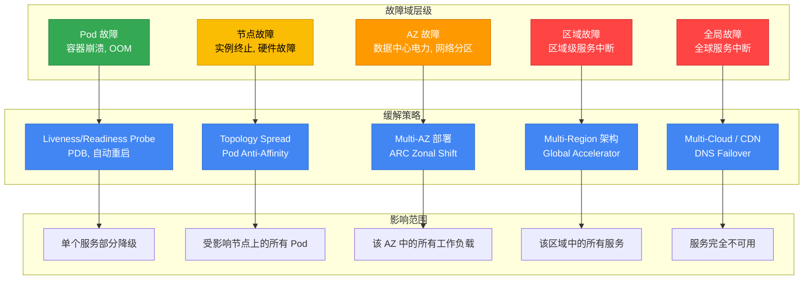
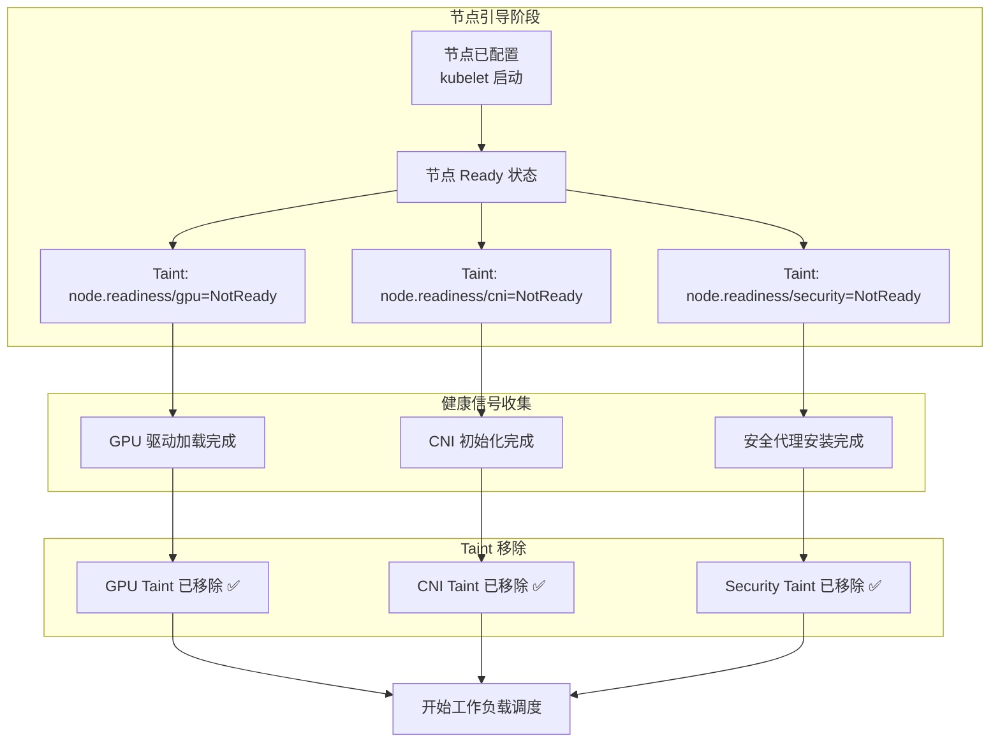
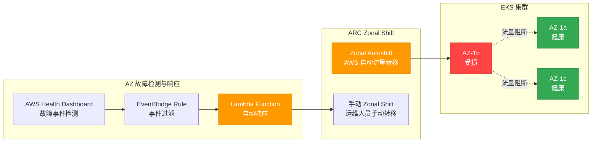
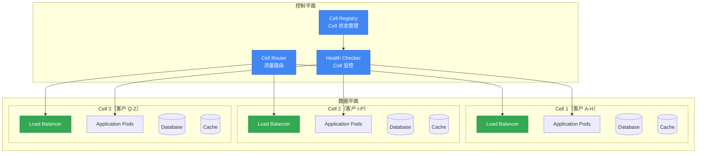
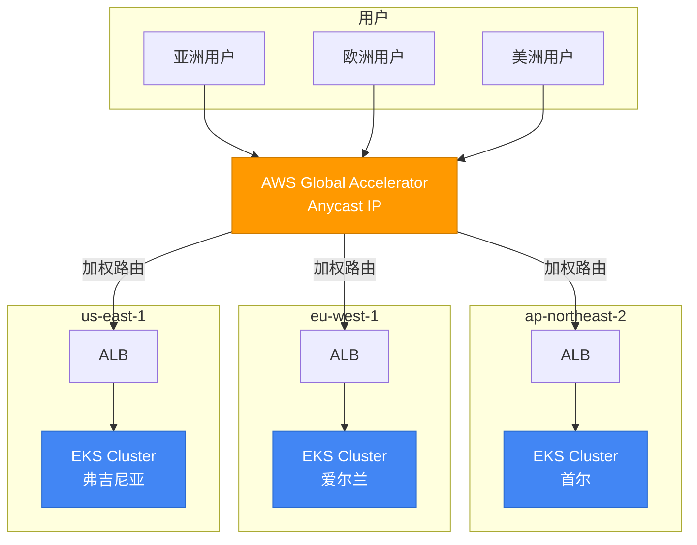
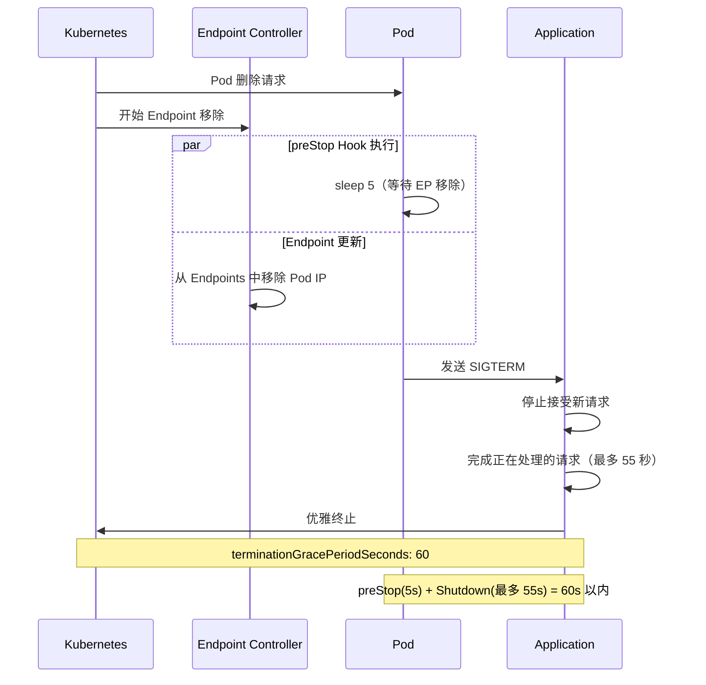

# EKS 高可用架构指南

> 📅 **撰写日期**: 2026-02-10 | **修改日期**: 2026-02-13 | ⏱️ **阅读时间**: 约 17 分钟

> **📌 参考环境**: EKS 1.30+, Karpenter v1.x, Istio 1.22+

## 1. 概述

弹性（Resiliency）是指系统在面对故障时恢复到正常状态的能力，或在最小化故障影响的同时维持服务的能力。云原生环境中弹性的核心原则很简单：**故障必然会发生——为此做好设计。**

从单个 Pod 故障到区域级中断，理解每一层的故障域（Failure Domain）并建立相应的防御策略，是 EKS 运维的关键。

### 故障域层级



### 弹性成熟度模型

组织可以将其弹性级别分为 4 个阶段，并从当前位置逐步提升。

| 级别 | 阶段 | 核心能力 | 实施项目 | 复杂度 | 成本影响 |
|-------|-------|----------|----------|--------|----------|
| **1** | 基础 | Pod 级弹性 | Probe 配置, PDB, Graceful Shutdown, Resource Limits | 低 | 最小 |
| **2** | Multi-AZ | AZ 容错 | Topology Spread, Multi-AZ NodePool, ARC Zonal Shift | 中 | 跨 AZ 流量成本 |
| **3** | Cell-Based | 爆炸半径隔离 | Cell Architecture, Shuffle Sharding, 独立部署 | 高 | 每个 Cell 的额外开销 |
| **4** | Multi-Region | 区域容错 | Active-Active 架构, Global Accelerator, 数据复制 | 极高 | 每区域基础设施成本 |

:::info 故障诊断与响应指南参考
有关运维故障排除和事件解决，请参阅 [EKS 故障诊断与响应指南](./eks-debugging-guide.md)。本文档侧重于故障的**预防**和**设计**，而实时故障排除则在故障诊断指南中介绍。
:::

---

## 2. Multi-AZ 策略

Multi-AZ 部署是 EKS 弹性中最基础但也最强大的策略。它将工作负载分布到多个可用区，使单个 AZ 故障不会导致整个服务中断。

### Pod Topology Spread Constraints

Topology Spread Constraints 将 Pod 均匀分布到 AZ、节点和自定义拓扑域中。在 K8s 1.30+ 中，`minDomains` 参数允许指定最小分布域数量。

| 参数 | 说明 | 推荐值 |
|------|------|--------|
| `maxSkew` | 域间最大 Pod 数量差异 | AZ: 1, Node: 2 |
| `topologyKey` | 分布依据的标签 | `topology.kubernetes.io/zone` |
| `whenUnsatisfiable` | 约束无法满足时的行为 | `DoNotSchedule`（硬约束）或 `ScheduleAnyway`（软约束） |
| `minDomains` | 最小分布域数量 | 与 AZ 数量相同（例如 3） |
| `labelSelector` | 目标 Pod 选择器 | 与 Deployment 的 matchLabels 相同 |

**硬约束 + 软约束组合策略**（推荐）：

```yaml
apiVersion: apps/v1
kind: Deployment
metadata:
  name: critical-app
spec:
  replicas: 6
  selector:
    matchLabels:
      app: critical-app
  template:
    metadata:
      labels:
        app: critical-app
    spec:
      topologySpreadConstraints:
      # 硬约束：跨 AZ 均匀分布（严格执行）
      - maxSkew: 1
        topologyKey: topology.kubernetes.io/zone
        whenUnsatisfiable: DoNotSchedule
        labelSelector:
          matchLabels:
            app: critical-app
        minDomains: 3
      # 软约束：跨节点分布（尽力而为）
      - maxSkew: 2
        topologyKey: kubernetes.io/hostname
        whenUnsatisfiable: ScheduleAnyway
        labelSelector:
          matchLabels:
            app: critical-app
```

:::tip maxSkew 配置提示
`maxSkew: 1` 确保最严格的均匀分布。在 3 个 AZ 中部署 6 个副本时，每个 AZ 恰好放置 2 个。如果扩容速度很重要，设置 `maxSkew: 2` 可以在较宽松的分布下提供更多调度灵活性。
:::

### AZ 感知的 Karpenter 配置

在 Karpenter v1 GA 中，Multi-AZ 分布、Disruption 预算和 Spot + On-Demand 混合策略均通过每个 NodePool 声明式配置。

```yaml
apiVersion: karpenter.sh/v1
kind: NodePool
metadata:
  name: multi-az-pool
spec:
  disruption:
    consolidationPolicy: WhenEmptyOrUnderutilized
    consolidateAfter: 5m
    # Disruption 预算：限制同时中断的节点不超过 20%
    budgets:
    - nodes: "20%"
  template:
    spec:
      requirements:
      # 跨 3 个 AZ 配置节点
      - key: topology.kubernetes.io/zone
        operator: In
        values: ["us-east-1a", "us-east-1b", "us-east-1c"]
      # 混合 Spot + On-Demand 以实现成本优化 + 稳定性
      - key: karpenter.sh/capacity-type
        operator: In
        values: ["on-demand", "spot"]
      - key: node.kubernetes.io/instance-type
        operator: In
        values:
          - c6i.xlarge
          - c6i.2xlarge
          - c6i.4xlarge
          - c7i.xlarge
          - c7i.2xlarge
          - c7i.4xlarge
          - m6i.xlarge
          - m6i.2xlarge
      nodeClassRef:
        group: karpenter.k8s.aws
        kind: EC2NodeClass
        name: multi-az
  limits:
    cpu: "1000"
    memory: 2000Gi
```

:::warning Spot 实例与 Multi-AZ
Spot 实例在每个 AZ 中有不同的容量池。指定 15 种或更多不同的实例类型可以最大限度地减少因 Spot 容量不足导致的配置失败。始终将关键任务工作负载的基础容量运行在 On-Demand 上。
:::

### 通过节点就绪机制安全放置工作负载

在 Multi-AZ 环境中，当新节点被配置时，节点可能在实际准备好接受工作负载之前就达到 `Ready` 状态。利用以下 Kubernetes 就绪机制可以防止过早调度。

#### Node Readiness Controller（2026 年 2 月发布）

[Node Readiness Controller](https://github.com/kubernetes-sigs/node-readiness-controller) 在节点引导过程中声明式管理自定义 taint，延迟工作负载调度直到所有基础设施要求得到满足——包括 GPU 驱动、CNI 插件、CSI 驱动和安全代理。



**弹性优势：**

- **AZ 故障恢复期间**：当 Karpenter 在新 AZ 中配置节点时，工作负载仅在节点完全就绪后才会被调度
- **扩容事件**：即使在快速扩容期间，工作负载也不会被放置在未完成准备的节点上
- **GPU/ML 工作负载**：防止在驱动加载完成前进行调度，避免 `CrashLoopBackOff`

#### Pod Scheduling Readiness（K8s 1.30 GA）

`schedulingGates` 允许从 Pod 侧控制调度时机。外部系统验证就绪状态后移除门控以允许调度：

```yaml
apiVersion: v1
kind: Pod
metadata:
  name: validated-pod
spec:
  schedulingGates:
    - name: "example.com/capacity-validation"
    - name: "example.com/security-clearance"
  containers:
    - name: app
      image: app:latest
      resources:
        requests:
          cpu: "4"
          memory: "8Gi"
```

**使用场景：**

- 仅在资源配额预验证通过后才允许调度
- 仅在安全审批通过后才允许调度
- 仅在自定义准入检查通过后才允许调度

#### Pod Readiness Gates（AWS LB Controller）

AWS Load Balancer Controller 的 Pod Readiness Gates 确保滚动更新期间的**零停机部署**：

```yaml
apiVersion: v1
kind: Namespace
metadata:
  name: production
  labels:
    elbv2.k8s.aws/pod-readiness-gate-inject: enabled  # 启用自动注入
```

在新 Pod 注册为 ALB/NLB 目标并通过健康检查之前，旧 Pod 不会被终止，确保部署期间零流量丢失。

:::tip 就绪特性选择指南

| 需求 | 推荐特性 | 层级 |
|------|----------|------|
| 保证节点引导完成 | Node Readiness Controller | 节点 |
| Pod 调度前的外部验证 | Pod Scheduling Readiness | Pod |
| 仅在 LB 注册后才接收流量 | Pod Readiness Gates | Pod |
| GPU/专用硬件就绪 | Node Readiness Controller | 节点 |
| 零停机滚动部署 | Pod Readiness Gates | Pod |
:::

### AZ 规避部署策略（ARC Zonal Shift）

AWS Application Recovery Controller (ARC) Zonal Shift 在检测到问题时，自动或手动将流量从某个 AZ 重定向。EKS 自 2024 年 11 月起支持 ARC Zonal Shift。



**启用和使用 ARC Zonal Shift：**

```bash
# 在 EKS 集群上启用 Zonal Shift
aws eks update-cluster-config \
  --name my-cluster \
  --zonal-shift-config enabled=true

# 启动手动 Zonal Shift（将流量从指定 AZ 重定向）
aws arc-zonal-shift start-zonal-shift \
  --resource-identifier arn:aws:eks:us-east-1:123456789012:cluster/my-cluster \
  --away-from us-east-1b \
  --expires-in 3h \
  --comment "AZ-b impairment detected via Health Dashboard"

# 检查 Zonal Shift 状态
aws arc-zonal-shift list-zonal-shifts \
  --resource-identifier arn:aws:eks:us-east-1:123456789012:cluster/my-cluster
```

:::info Zonal Shift 限制
Zonal Shift 的最大持续时间为 **3 天**，如有需要可以延长。启用 Zonal Autoshift 后，AWS 可以自动检测 AZ 级别的损伤并转移流量。
:::

**紧急 AZ 疏散脚本：**

```bash
#!/bin/bash
# az-evacuation.sh - 安全疏散受损 AZ 中的所有工作负载
IMPAIRED_AZ=$1

if [ -z "$IMPAIRED_AZ" ]; then
  echo "Usage: $0 <az-name>"
  echo "Example: $0 us-east-1b"
  exit 1
fi

echo "=== AZ 疏散: ${IMPAIRED_AZ} ==="

# 1. 封锁受影响 AZ 中的节点（阻止新 Pod 调度）
echo "[步骤 1] 正在封锁 ${IMPAIRED_AZ} 中的节点..."
kubectl get nodes -l topology.kubernetes.io/zone=${IMPAIRED_AZ} -o name | \
  xargs -I {} kubectl cordon {}

# 2. 排空受影响 AZ 中的节点（安全迁移现有 Pod）
echo "[步骤 2] 正在排空 ${IMPAIRED_AZ} 中的节点..."
kubectl get nodes -l topology.kubernetes.io/zone=${IMPAIRED_AZ} -o name | \
  xargs -I {} kubectl drain {} \
    --ignore-daemonsets \
    --delete-emptydir-data \
    --grace-period=30 \
    --timeout=120s

# 3. 验证疏散结果
echo "[步骤 3] 正在验证疏散情况..."
echo "${IMPAIRED_AZ} 中剩余的 Pod："
kubectl get pods --all-namespaces -o wide | grep ${IMPAIRED_AZ} | grep -v DaemonSet

echo "=== 疏散完成 ==="
```

### EBS AZ 绑定缓解

EBS 卷绑定到特定的 AZ。如果该 AZ 发生故障，使用该卷的 Pod 无法迁移到其他 AZ。

**WaitForFirstConsumer StorageClass**（推荐）：

```yaml
apiVersion: storage.k8s.io/v1
kind: StorageClass
metadata:
  name: topology-aware-ebs
provisioner: ebs.csi.aws.com
parameters:
  type: gp3
  encrypted: "true"
volumeBindingMode: WaitForFirstConsumer
allowVolumeExpansion: true
```

`WaitForFirstConsumer` 将卷的创建推迟到 Pod 被调度之后，确保卷在与 Pod 相同的 AZ 中创建。

**EFS 跨 AZ 替代方案**：对于即使在 AZ 故障期间也需要存储访问的工作负载，请使用 Amazon EFS。EFS 允许从所有 AZ 同时访问，消除了 AZ 绑定问题。

| 存储 | AZ 依赖性 | 故障期间行为 | 适用工作负载 |
|------|-----------|-------------|-------------|
| EBS (gp3) | 单 AZ 绑定 | AZ 故障时无法访问 | 数据库、有状态应用 |
| EFS | 跨 AZ | AZ 故障时可访问 | 共享文件、CMS、日志 |
| Instance Store | 节点绑定 | 节点终止时数据丢失 | 临时缓存、暂存空间 |

### 跨 AZ 成本优化

Multi-AZ 部署的主要成本因素是跨 AZ 网络流量。在同一区域内，AWS 的 AZ 间数据传输成本为每方向 $0.01/GB。

**Istio Locality-Aware Routing** 可以最大限度地减少跨 AZ 流量：

```yaml
apiVersion: networking.istio.io/v1
kind: DestinationRule
metadata:
  name: locality-aware-routing
spec:
  host: backend-service
  trafficPolicy:
    connectionPool:
      http:
        http2MaxRequests: 1000
    outlierDetection:
      consecutive5xxErrors: 5
      interval: 10s
      baseEjectionTime: 30s
    loadBalancer:
      localityLbSetting:
        enabled: true
        # 优先同 AZ，故障时故障转移到其他 AZ
        distribute:
        - from: "us-east-1/us-east-1a/*"
          to:
            "us-east-1/us-east-1a/*": 80
            "us-east-1/us-east-1b/*": 10
            "us-east-1/us-east-1c/*": 10
        - from: "us-east-1/us-east-1b/*"
          to:
            "us-east-1/us-east-1b/*": 80
            "us-east-1/us-east-1a/*": 10
            "us-east-1/us-east-1c/*": 10
```

:::tip 跨 AZ 成本节省
应用 Locality-Aware Routing 可将 80% 以上的流量保持在同一 AZ 内，显著降低跨 AZ 数据传输成本。对于高流量服务，这每月可节省数千美元。
:::

---

## 3. Cell-Based Architecture

Cell-Based Architecture 是 AWS Well-Architected Framework 推荐的高级弹性模式。它将系统划分为独立的 Cell，以隔离故障的爆炸半径（Blast Radius）。

### Cell 概念与设计原则

Cell 是一个可以独立运行的自包含服务单元。如果一个 Cell 发生故障，其他 Cell 不受影响。



**Cell 核心设计原则：**

1. **独立性**：每个 Cell 拥有自己的数据存储、缓存和队列
2. **隔离性**：Cell 之间没有直接通信——仅通过控制平面协调
3. **同质性**：所有 Cell 运行相同的代码和配置
4. **可扩展性**：通过添加新 Cell 而非扩展现有 Cell 来实现增长

### 在 EKS 中实现 Cell

| 实现方式 | 基于 Namespace 的 Cell | 基于 Cluster 的 Cell |
|----------|----------------------|---------------------|
| **隔离级别** | 逻辑隔离（软隔离） | 物理隔离（硬隔离） |
| **资源隔离** | ResourceQuota, LimitRange | 完全集群隔离 |
| **网络隔离** | NetworkPolicy | VPC/Subnet 级别 |
| **爆炸半径** | 同一集群内可能受影响 | Cell 之间完全隔离 |
| **运维复杂度** | 低（单集群） | 高（多集群） |
| **成本** | 低 | 高（控制平面成本 x Cell 数量） |
| **适用场景** | 中小规模、内部服务 | 大规模、合规要求 |

**基于 Namespace 的 Cell 实现示例：**

```yaml
# Cell-1 Namespace 和 ResourceQuota
apiVersion: v1
kind: Namespace
metadata:
  name: cell-1
  labels:
    cell-id: "cell-1"
    partition: "customers-a-h"
---
apiVersion: v1
kind: ResourceQuota
metadata:
  name: cell-1-quota
  namespace: cell-1
spec:
  hard:
    requests.cpu: "20"
    requests.memory: 40Gi
    limits.cpu: "40"
    limits.memory: 80Gi
    pods: "100"
---
# Cell 感知的 Deployment
apiVersion: apps/v1
kind: Deployment
metadata:
  name: api-server
  namespace: cell-1
  labels:
    cell-id: "cell-1"
spec:
  replicas: 4
  selector:
    matchLabels:
      app: api-server
      cell-id: "cell-1"
  template:
    metadata:
      labels:
        app: api-server
        cell-id: "cell-1"
    spec:
      topologySpreadConstraints:
      - maxSkew: 1
        topologyKey: topology.kubernetes.io/zone
        whenUnsatisfiable: DoNotSchedule
        labelSelector:
          matchLabels:
            app: api-server
            cell-id: "cell-1"
      containers:
      - name: api-server
        image: myapp/api-server:v2.1
        env:
        - name: CELL_ID
          value: "cell-1"
        - name: PARTITION_RANGE
          value: "A-H"
        resources:
          requests:
            cpu: "500m"
            memory: 1Gi
          limits:
            cpu: "1"
            memory: 2Gi
```

### Cell Router 实现

Cell Router 是将传入请求路由到适当 Cell 的核心组件。有三种实现方式。

**1. 基于 Route 53 ARC Routing Control：**

在 DNS 级别控制 Cell 路由。为每个 Cell 配置 Health Check 和 Routing Control，当 Cell 故障时在 DNS 级别阻断流量。

**2. 基于 ALB Target Group：**

使用 ALB Weighted Target Groups 按 Cell 分配流量。基于 Header 的路由规则实现每客户的 Cell 映射。

**3. 基于 Service Mesh（Istio）：**

使用 Istio VirtualService 基于 Header 的路由实现 Cell 路由。这是最灵活的方式，但增加了 Istio 的运维复杂性。

### 爆炸半径隔离策略

| 策略 | 说明 | 隔离标准 | 使用场景 |
|------|------|----------|----------|
| **客户分区** | 基于客户 ID 哈希的 Cell 分配 | 客户分组 | SaaS 平台 |
| **地理分区** | 基于地理位置的 Cell 分配 | 区域/国家 | 全球服务 |
| **容量分区** | 基于 Cell 容量的动态分配 | 可用资源 | 流量波动大的服务 |
| **层级分区** | 基于客户等级的 Cell 分配 | 服务级别 | 高级/标准分离 |

### Shuffle Sharding 模式

Shuffle Sharding 将每个客户（或租户）分配到从 Cell 总池中随机选择的少量 Cell。这确保单个 Cell 故障仅影响少数客户。

**原理**：有 8 个 Cell，每个客户分配 2 个 Cell 时，共有 C(8,2) = 28 种可能的组合。如果某个特定 Cell 发生故障，只有使用该 Cell 的客户受到影响，并且他们会自动故障转移到另一个分配的 Cell。

```yaml
# Shuffle Sharding ConfigMap 示例
apiVersion: v1
kind: ConfigMap
metadata:
  name: shuffle-sharding-config
data:
  sharding-config.yaml: |
    totalCells: 8
    shardsPerTenant: 2
    tenantAssignments:
      tenant-acme:
        cells: ["cell-1", "cell-5"]
        primary: "cell-1"
      tenant-globex:
        cells: ["cell-3", "cell-7"]
        primary: "cell-3"
      tenant-initech:
        cells: ["cell-2", "cell-6"]
        primary: "cell-2"
```

:::warning Cell Architecture 的权衡
Cell Architecture 提供了强大的隔离能力，但增加了运维复杂性和成本。由于每个 Cell 都有自己的数据存储，数据迁移、跨 Cell 查询和 Cell 间一致性需要额外的设计。建议从需要 99.99% 以上 SLA 的服务开始考虑采用。
:::

---

## 4. Multi-Cluster / Multi-Region

Multi-Cluster 和 Multi-Region 策略为区域级故障做好准备。

### 架构模式对比

| 模式 | 说明 | RTO | RPO | 成本 | 复杂度 | 适用场景 |
|------|------|-----|-----|------|--------|----------|
| **Active-Active** | 所有区域同时服务流量 | ~0 | ~0 | 极高 | 极高 | 全球服务、极端 SLA |
| **Active-Passive** | 仅一个区域活跃，其他待命 | 分钟到小时 | 分钟 | 高 | 高 | 大多数业务应用 |
| **区域隔离** | 每个区域独立运行，数据隔离 | 各区域独立 | N/A | 中 | 中 | 合规要求、数据主权 |
| **Hub-Spoke** | 中央 Hub 管理，Spoke 服务 | 分钟 | 秒到分钟 | 中到高 | 中 | 注重管理效率 |

### Global Accelerator + EKS

AWS Global Accelerator 利用 AWS 全球网络将流量路由到离用户最近的区域的 EKS 集群。



### ArgoCD Multi-Cluster GitOps

ArgoCD ApplicationSet Generator 自动化跨多个集群的一致部署。

```yaml
apiVersion: argoproj.io/v1alpha1
kind: ApplicationSet
metadata:
  name: multi-cluster-app
  namespace: argocd
spec:
  generators:
  # 基于集群标签的动态部署
  - clusters:
      selector:
        matchLabels:
          environment: production
          resiliency-tier: "high"
  template:
    metadata:
      name: 'myapp-{{name}}'
    spec:
      project: default
      source:
        repoURL: https://github.com/myorg/k8s-manifests.git
        targetRevision: main
        path: 'overlays/{{metadata.labels.region}}'
      destination:
        server: '{{server}}'
        namespace: production
      syncPolicy:
        automated:
          prune: true
          selfHeal: true
        syncOptions:
        - CreateNamespace=true
        retry:
          limit: 5
          backoff:
            duration: 5s
            factor: 2
            maxDuration: 3m
```

### Istio Multi-Cluster Federation

Istio Multi-Primary 设置在每个集群中运行独立的 Istio 控制平面，同时提供跨集群的服务发现和负载均衡。

```yaml
# Istio Locality-Aware Routing（Multi-Region）
apiVersion: networking.istio.io/v1
kind: DestinationRule
metadata:
  name: multi-region-routing
spec:
  host: backend-service
  trafficPolicy:
    loadBalancer:
      localityLbSetting:
        enabled: true
        # 优先同区域，故障时故障转移到其他区域
        failover:
        - from: us-east-1
          to: eu-west-1
        - from: eu-west-1
          to: us-east-1
        - from: ap-northeast-2
          to: ap-southeast-1
    outlierDetection:
      consecutive5xxErrors: 3
      interval: 10s
      baseEjectionTime: 30s
      maxEjectionPercent: 50
```

:::info Istio API 版本说明
在 Istio 1.22+ 中，`networking.istio.io/v1` 和 `networking.istio.io/v1beta1` 均受支持。新部署建议使用 `v1`，现有的 `v1beta1` 配置仍然有效。
:::

---

## 5. 应用弹性模式

除了基础设施级别的弹性外，还必须实现应用级别的容错模式。

### PodDisruptionBudgets (PDB)

PDB 确保在自愿中断（Voluntary Disruption）期间——如节点排空、集群升级和 Karpenter 整合——维持最低 Pod 可用性。

| 设置 | 行为 | 适用场景 |
|------|------|----------|
| `minAvailable: 2` | 始终保持至少 2 个 Pod | 副本数较少的服务（3-5 个） |
| `minAvailable: "50%"` | 保持至少 50% 的总量 | 副本数较多的服务 |
| `maxUnavailable: 1` | 同时最多允许 1 个中断 | 滚动更新期间的稳定性 |
| `maxUnavailable: "25%"` | 允许最多 25% 同时中断 | 需要快速部署时 |

```yaml
apiVersion: policy/v1
kind: PodDisruptionBudget
metadata:
  name: api-pdb
spec:
  minAvailable: 2
  selector:
    matchLabels:
      app: api-server
---
# 基于百分比的 PDB，适用于大型 Deployment
apiVersion: policy/v1
kind: PodDisruptionBudget
metadata:
  name: worker-pdb
spec:
  maxUnavailable: "25%"
  selector:
    matchLabels:
      app: worker
```

:::warning PDB 与 Karpenter 的交互
Karpenter 的 Disruption 预算（`budgets: - nodes: "20%"`）与 PDB 协同工作。Karpenter 在节点整合期间会遵守 PDB。如果 PDB 过于严格（例如 minAvailable 等于副本数），节点排空可能会被永久阻塞，请谨慎使用。
:::

### Graceful Shutdown

Graceful Shutdown 模式在 Pod 被终止时安全完成正在处理的请求并停止接受新请求。

```yaml
apiVersion: apps/v1
kind: Deployment
metadata:
  name: web-server
spec:
  template:
    spec:
      terminationGracePeriodSeconds: 60
      containers:
      - name: web
        image: myapp/web:v2.0
        ports:
        - containerPort: 8080
        lifecycle:
          preStop:
            exec:
              # 1. Sleep 等待 Endpoint 移除（防止 Kubelet 和 Endpoint Controller 之间的竞态）
              # 2. 发送 SIGTERM 启动应用的 Graceful Shutdown
              command: ["/bin/sh", "-c", "sleep 5 && kill -TERM 1"]
        readinessProbe:
          httpGet:
            path: /ready
            port: 8080
          periodSeconds: 5
          failureThreshold: 1
```

**Graceful Shutdown 时序设计：**



:::tip 为什么需要 preStop sleep
当 Kubernetes 删除 Pod 时，preStop Hook 执行和 Endpoint 移除是**异步**进行的。在 preStop 中添加 5 秒的 sleep 确保 Endpoint Controller 有时间从 Service 中移除 Pod IP，防止流量被路由到正在关闭的 Pod。
:::

### Circuit Breaker（Istio DestinationRule）

Circuit Breaker 阻断对故障服务的请求以防止级联故障（Cascading Failure）。它通过 Istio 的 DestinationRule 实现。

```yaml
# Istio 1.22+：v1 和 v1beta1 均受支持
apiVersion: networking.istio.io/v1
kind: DestinationRule
metadata:
  name: backend-circuit-breaker
spec:
  host: backend-service
  trafficPolicy:
    connectionPool:
      tcp:
        maxConnections: 100
        connectTimeout: 5s
      http:
        http1MaxPendingRequests: 50
        http2MaxRequests: 100
        maxRequestsPerConnection: 10
        maxRetries: 3
    outlierDetection:
      # 连续 5 次 5xx 错误后将实例从池中移除
      consecutive5xxErrors: 5
      # 每 30 秒检查一次实例健康状况
      interval: 30s
      # 被驱逐实例的最小隔离时间
      baseEjectionTime: 30s
      # 最多允许驱逐总实例的 50%
      maxEjectionPercent: 50
```

### Retry / Timeout（Istio VirtualService）

```yaml
apiVersion: networking.istio.io/v1
kind: VirtualService
metadata:
  name: backend-retry
spec:
  hosts:
  - backend-service
  http:
  - route:
    - destination:
        host: backend-service
    timeout: 10s
    retries:
      attempts: 3
      perTryTimeout: 3s
      retryOn: "5xx,reset,connect-failure,retriable-4xx"
      retryRemoteLocalities: true
```

**Retry 最佳实践：**

| 设置 | 推荐值 | 原因 |
|------|--------|------|
| `attempts` | 2-3 | 过多重试会放大负载 |
| `perTryTimeout` | 总超时的 1/3 | 允许 3 次重试在总超时内完成 |
| `retryOn` | `5xx,connect-failure` | 仅对瞬态故障重试 |
| `retryRemoteLocalities` | `true` | 也对其他 AZ 的实例进行重试 |

:::warning Rate Limiting 采用注意事项
Rate Limiting 与 Circuit Breaker 和 Retry 一样是弹性的核心要素，但配置不当可能会阻断合法流量。使用 Istio 的 EnvoyFilter 或外部 Rate Limiter（如基于 Redis 的方案）实现时，**始终分阶段采用**：监控模式、警告模式，然后才是阻断模式。
:::

---

## 6. 混沌工程

混沌工程（Chaos Engineering）是在生产环境中验证系统弹性的实用方法论。在"一切正常时"进行测试，为"故障发生时"做好准备。

### AWS Fault Injection Service (FIS)

AWS FIS 是一项托管的混沌工程服务，可以向 EC2、EKS 和 RDS 等 AWS 服务注入故障。

**场景 1：Pod 终止（应用弹性测试）**

```json
{
  "description": "EKS Pod termination test",
  "targets": {
    "eks-pods": {
      "resourceType": "aws:eks:pod",
      "resourceTags": {
        "app": "critical-api"
      },
      "selectionMode": "COUNT(3)",
      "parameters": {
        "clusterIdentifier": "arn:aws:eks:us-east-1:123456789012:cluster/prod-cluster",
        "namespace": "production"
      }
    }
  },
  "actions": {
    "terminate-pods": {
      "actionId": "aws:eks:pod-delete",
      "targets": {
        "Pods": "eks-pods"
      }
    }
  },
  "stopConditions": [
    {
      "source": "aws:cloudwatch:alarm",
      "value": "arn:aws:cloudwatch:us-east-1:123456789012:alarm:HighErrorRate"
    }
  ]
}
```

**场景 2：AZ 故障模拟**

```json
{
  "description": "Simulate AZ failure for EKS",
  "targets": {
    "eks-nodes-az1a": {
      "resourceType": "aws:ec2:instance",
      "resourceTags": {
        "kubernetes.io/cluster/my-cluster": "owned"
      },
      "filters": [
        {
          "path": "Placement.AvailabilityZone",
          "values": ["us-east-1a"]
        }
      ],
      "selectionMode": "ALL"
    }
  },
  "actions": {
    "stop-instances": {
      "actionId": "aws:ec2:stop-instances",
      "parameters": {
        "startInstancesAfterDuration": "PT10M"
      },
      "targets": {
        "Instances": "eks-nodes-az1a"
      }
    }
  },
  "stopConditions": [
    {
      "source": "aws:cloudwatch:alarm",
      "value": "arn:aws:cloudwatch:us-east-1:123456789012:alarm:CriticalServiceDown"
    }
  ]
}
```

**场景 3：网络延迟注入**

```json
{
  "description": "Inject network latency to EKS nodes",
  "targets": {
    "eks-nodes": {
      "resourceType": "aws:ec2:instance",
      "resourceTags": {
        "kubernetes.io/cluster/my-cluster": "owned",
        "app-tier": "backend"
      },
      "selectionMode": "PERCENT(50)"
    }
  },
  "actions": {
    "inject-latency": {
      "actionId": "aws:ssm:send-command",
      "parameters": {
        "documentArn": "arn:aws:ssm:us-east-1::document/AWSFIS-Run-Network-Latency",
        "documentParameters": "{\"DurationSeconds\":\"300\",\"DelayMilliseconds\":\"200\",\"Interface\":\"eth0\"}",
        "duration": "PT5M"
      },
      "targets": {
        "Instances": "eks-nodes"
      }
    }
  }
}
```

### Litmus Chaos on EKS

Litmus 是 CNCF 孵化项目，也是一个 Kubernetes 原生的混沌工程框架。

**安装：**

```bash
# 安装 Litmus ChaosCenter
helm repo add litmuschaos https://litmuschaos.github.io/litmus-helm/
helm repo update

helm install litmus litmuschaos/litmus \
  --namespace litmus --create-namespace \
  --set portal.frontend.service.type=LoadBalancer
```

**ChaosEngine 示例（Pod Delete）：**

```yaml
apiVersion: litmuschaos.io/v1alpha1
kind: ChaosEngine
metadata:
  name: pod-delete-chaos
  namespace: production
spec:
  appinfo:
    appns: production
    applabel: "app=api-server"
    appkind: deployment
  engineState: active
  chaosServiceAccount: litmus-admin
  experiments:
  - name: pod-delete
    spec:
      components:
        env:
        - name: TOTAL_CHAOS_DURATION
          value: "60"
        - name: CHAOS_INTERVAL
          value: "10"
        - name: FORCE
          value: "false"
        - name: PODS_AFFECTED_PERC
          value: "50"
```

### Chaos Mesh

Chaos Mesh 是 CNCF 孵化项目，也是一个 Kubernetes 专用的混沌工程平台，支持多种故障类型。

**安装：**

```bash
# 安装 Chaos Mesh
helm repo add chaos-mesh https://charts.chaos-mesh.org
helm repo update

helm install chaos-mesh chaos-mesh/chaos-mesh \
  --namespace chaos-mesh --create-namespace \
  --set chaosDaemon.runtime=containerd \
  --set chaosDaemon.socketPath=/run/containerd/containerd.sock
```

**NetworkChaos 示例（网络分区）：**

```yaml
apiVersion: chaos-mesh.org/v1alpha1
kind: NetworkChaos
metadata:
  name: network-partition
  namespace: chaos-mesh
spec:
  action: partition
  mode: all
  selector:
    namespaces:
    - production
    labelSelectors:
      "app": "frontend"
  direction: both
  target:
    selector:
      namespaces:
      - production
      labelSelectors:
        "app": "backend"
    mode: all
  duration: "5m"
  scheduler:
    cron: "@every 24h"
```

**PodChaos 示例（Pod Kill）：**

```yaml
apiVersion: chaos-mesh.org/v1alpha1
kind: PodChaos
metadata:
  name: pod-kill-test
  namespace: chaos-mesh
spec:
  action: pod-kill
  mode: fixed-percent
  value: "30"
  selector:
    namespaces:
    - production
    labelSelectors:
      "app": "api-server"
  duration: "1m"
  gracePeriod: 0
```

### 混沌工程工具对比

| 特性 | AWS FIS | Litmus Chaos | Chaos Mesh |
|------|---------|-------------|------------|
| **类型** | 托管服务 | 开源（CNCF） | 开源（CNCF） |
| **范围** | AWS 基础设施 + K8s | 仅 Kubernetes | 仅 Kubernetes |
| **故障类型** | EC2, EKS, RDS, 网络 | Pod, Node, 网络, DNS | Pod, 网络, I/O, 时间, JVM |
| **AZ 故障模拟** | 原生支持 | 有限（Pod/Node 级别） | 有限（Pod/Node 级别） |
| **仪表板** | AWS Console | Litmus Portal（Web UI） | Chaos Dashboard（Web UI） |
| **成本** | 按执行次数付费 | 免费（仅基础设施成本） | 免费（仅基础设施成本） |
| **停止条件** | CloudWatch Alarm 集成 | 手动 / API | 手动 / API |
| **运维复杂度** | 低 | 中 | 中 |
| **GitOps 集成** | CloudFormation / CDK | 基于 CRD（兼容 ArgoCD） | 基于 CRD（兼容 ArgoCD） |
| **推荐场景** | 基础设施级别故障测试 | K8s 原生测试 | 需要细粒度故障注入时 |

:::tip 工具选择指南
从 AWS FIS 开始进行基础设施级别的故障测试（AZ、网络），然后使用 Litmus 或 Chaos Mesh 进行细粒度的应用级别故障测试。推荐采用**混合方式**。AWS FIS 的停止条件功能（基于 CloudWatch Alarm）对于在生产环境中安全测试至关重要。
:::

### Game Day 运行手册模板

Game Day 是团队集合在一起执行计划的故障场景，发现系统和流程中弱点的演练。

**5 阶段 Game Day 执行框架：**

```mermaid
flowchart LR
    subgraph "阶段 1：准备"
        P1[制定假设<br/>例如：AZ 故障时自动恢复]
        P2[定义成功标准<br/>例如：5 分钟内恢复]
        P3[设置中止标准<br/>CloudWatch Alarm]
    end

    subgraph "阶段 2：执行"
        E1[记录稳态<br/>采集当前指标]
        E2[注入故障<br/>启动 FIS 实验]
        E3[观察和记录<br/>实时监控]
    end

    subgraph "阶段 3：分析"
        A1[测量恢复时间<br/>实际 RTO]
        A2[评估数据丢失<br/>实际 RPO]
        A3[分析用户影响]
    end

    subgraph "阶段 4：改进"
        I1[编录发现的弱点]
        I2[创建改进工单]
        I3[更新运行手册]
    end

    subgraph "阶段 5：迭代"
        R1[安排下次 Game Day]
        R2[扩展场景]
        R3[扩展自动化]
    end

    P1 --> P2 --> P3
    P3 --> E1 --> E2 --> E3
    E3 --> A1 --> A2 --> A3
    A3 --> I1 --> I2 --> I3
    I3 --> R1 --> R2 --> R3

    style P1 fill:#4286f4,stroke:#2a6acf,color:#fff
    style E2 fill:#ff4444,stroke:#cc3636,color:#fff
    style A1 fill:#fbbc04,stroke:#c99603,color:#000
    style I1 fill:#34a853,stroke:#2a8642,color:#fff
    style R1 fill:#4286f4,stroke:#2a6acf,color:#fff
```



**Game Day 自动化脚本：**

```bash
#!/bin/bash
# game-day.sh - Game Day 执行自动化
set -euo pipefail

CLUSTER_NAME=$1
SCENARIO=$2
NAMESPACE=${3:-production}

echo "============================================"
echo " Game Day: ${SCENARIO}"
echo " 集群: ${CLUSTER_NAME}"
echo " 命名空间: ${NAMESPACE}"
echo " 时间: $(date -u '+%Y-%m-%d %H:%M:%S UTC')"
echo "============================================"

# 阶段 1：记录稳态
echo ""
echo "[阶段 1] 正在记录稳态..."
echo "--- Pod 状态 ---"
kubectl get pods -n ${NAMESPACE} -o wide | head -20

echo "--- 节点状态 ---"
kubectl get nodes -o custom-columns=\
NAME:.metadata.name,\
STATUS:.status.conditions[-1].type,\
AZ:.metadata.labels.topology\\.kubernetes\\.io/zone

echo "--- Service Endpoints ---"
kubectl get endpoints -n ${NAMESPACE}

# 阶段 2：注入故障（按场景）
echo ""
echo "[阶段 2] 正在注入故障: ${SCENARIO}..."

case ${SCENARIO} in
  "az-failure")
    echo "使用 ARC Zonal Shift 模拟 AZ 故障..."
    # 执行 ARC Zonal Shift（1 小时）
    aws arc-zonal-shift start-zonal-shift \
      --resource-identifier arn:aws:eks:us-east-1:$(aws sts get-caller-identity --query Account --output text):cluster/${CLUSTER_NAME} \
      --away-from us-east-1a \
      --expires-in 1h \
      --comment "Game Day: AZ failure simulation"
    ;;

  "pod-delete")
    echo "正在删除 ${NAMESPACE} 中 30% 的 Pod..."
    TOTAL=$(kubectl get pods -n ${NAMESPACE} -l app=api-server --no-headers | wc -l)
    DELETE_COUNT=$(( TOTAL * 30 / 100 ))
    DELETE_COUNT=$(( DELETE_COUNT < 1 ? 1 : DELETE_COUNT ))
    kubectl get pods -n ${NAMESPACE} -l app=api-server -o name | \
      shuf | head -n ${DELETE_COUNT} | \
      xargs kubectl delete -n ${NAMESPACE}
    ;;

  "node-drain")
    echo "正在排空一个随机节点..."
    NODE=$(kubectl get nodes --no-headers | shuf -n 1 | awk '{print $1}')
    kubectl cordon ${NODE}
    kubectl drain ${NODE} --ignore-daemonsets --delete-emptydir-data --timeout=120s
    ;;

  *)
    echo "未知场景: ${SCENARIO}"
    echo "可用场景: az-failure, pod-delete, node-drain"
    exit 1
    ;;
esac

# 阶段 3：观察恢复
echo ""
echo "[阶段 3] 正在观察恢复..."
echo "等待 60 秒以观察恢复..."
sleep 60

echo "--- 故障后 Pod 状态 ---"
kubectl get pods -n ${NAMESPACE} -o wide | head -20

echo "--- Pod 重启次数 ---"
kubectl get pods -n ${NAMESPACE} -o custom-columns=\
NAME:.metadata.name,\
RESTARTS:.status.containerStatuses[0].restartCount,\
STATUS:.status.phase

echo ""
echo "============================================"
echo " Game Day 阶段 3 完成"
echo " 请审查结果并继续分析"
echo "============================================"
```

---

## 7. 弹性检查清单与参考资料

### 弹性实施检查清单

使用以下检查清单评估当前弹性级别并确定下一步实施计划。

**Level 1 -- 基础**

| 项目 | 说明 | 完成 |
|------|------|------|
| Liveness/Readiness Probe 配置 | 所有 Deployment 配置了适当的 Probe | [ ] |
| Resource Requests/Limits 配置 | 指定了 CPU 和 Memory 资源约束 | [ ] |
| PodDisruptionBudget 配置 | 保证最低可用 Pod 数量 | [ ] |
| Graceful Shutdown 实现 | preStop Hook + terminationGracePeriodSeconds | [ ] |
| Startup Probe 配置 | 为启动缓慢的应用提供初始化保护 | [ ] |
| 自动重启策略 | 确认 restartPolicy: Always | [ ] |

**Level 2 -- Multi-AZ**

| 项目 | 说明 | 完成 |
|------|------|------|
| Topology Spread Constraints | 跨 AZ 均匀分布 Pod | [ ] |
| Multi-AZ Karpenter NodePool | 跨 3 个以上 AZ 配置节点 | [ ] |
| WaitForFirstConsumer StorageClass | 防止 EBS AZ 绑定 | [ ] |
| ARC Zonal Shift 已启用 | AZ 故障时自动流量转移 | [ ] |
| 跨 AZ 流量优化 | 配置了 Locality-Aware 路由 | [ ] |
| AZ 疏散运行手册已准备 | 紧急 AZ 疏散程序已文档化 | [ ] |

**Level 3 -- Cell-Based**

| 项目 | 说明 | 完成 |
|------|------|------|
| Cell 边界定义 | 基于 Namespace 或 Cluster 的 Cell 配置 | [ ] |
| Cell Router 实现 | 请求路由到适当的 Cell | [ ] |
| Cell 间隔离验证 | 通过 NetworkPolicy 或 VPC 级别的隔离 | [ ] |
| Shuffle Sharding 已应用 | 每个租户多样化的 Cell 分配 | [ ] |
| Cell 健康监控 | 监控各个 Cell 健康状况的仪表板 | [ ] |
| Cell Failover 测试 | 通过混沌工程验证 Cell 故障 | [ ] |

**Level 4 -- Multi-Region**

| 项目 | 说明 | 完成 |
|------|------|------|
| Multi-Region 架构设计 | Active-Active 或 Active-Passive 决策 | [ ] |
| Global Accelerator 配置 | 跨区域流量路由 | [ ] |
| 数据复制策略 | 跨区域数据同步 | [ ] |
| ArgoCD Multi-Cluster GitOps | 基于 ApplicationSet 的多集群部署 | [ ] |
| Multi-Region 混沌测试 | 区域故障模拟 Game Day | [ ] |
| RTO/RPO 测量与验证 | 实际恢复时间/数据丢失与目标的对比验证 | [ ] |

### 成本优化技巧

| 优化领域 | 策略 | 预期节省 |
|----------|------|----------|
| **跨 AZ 流量** | Istio Locality-Aware 路由将 80% 以上流量保持在同一 AZ 内 | AZ 间传输成本降低 60-80% |
| **Spot 实例** | 对非关键工作负载使用 Spot（Karpenter capacity-type 混合） | 计算成本降低 60-90% |
| **Cell 利用率** | 合理设计 Cell 大小以减少资源浪费 | 过量配置减少 20-40% |
| **Multi-Region** | Active-Passive 模式下以最低容量运行 Passive 区域 | Passive 区域成本降低 50-70% |
| **Karpenter 整合** | WhenEmptyOrUnderutilized 策略自动移除未使用的节点 | 消除空闲资源成本 |
| **选择性使用 EFS** | 仅在需要跨 AZ 时使用 EFS；其他情况使用 EBS gp3 | 存储成本节省 |

:::danger 成本与弹性的权衡
更高的弹性级别伴随着更高的成本。Multi-Region Active-Active 需要比单区域多一倍以上的基础设施成本。根据业务需求（SLA、合规要求）与成本进行平衡，选择适当的弹性级别。并非每个服务都需要达到 Level 4。
:::

### 相关文档

- [EKS 故障诊断与响应指南](./eks-debugging-guide.md) -- 运维故障排除与事件解决
- [基于 GitOps 的 EKS 集群运维](./gitops-cluster-operation.md) -- ArgoCD、KRO 基础的集群管理
- [Karpenter 超快速自动扩缩容](/docs/infrastructure-optimization/karpenter-autoscaling) -- 深入 Karpenter 配置与 HPA 优化

### 外部参考资料

- [AWS Well-Architected -- Cell-Based Architecture](https://docs.aws.amazon.com/wellarchitected/latest/reducing-scope-of-impact-with-cell-based-architecture/reducing-scope-of-impact-with-cell-based-architecture.html)
- [AWS Cell-Based Architecture Guidance](https://aws.amazon.com/solutions/guidance/cell-based-architecture-on-aws/)
- [AWS Shuffle Sharding](https://aws.amazon.com/blogs/architecture/shuffle-sharding-massive-and-magical-fault-isolation/)
- [EKS Reliability Best Practices](https://docs.aws.amazon.com/eks/latest/best-practices/reliability.html)
- [EKS + ARC Zonal Shift](https://docs.aws.amazon.com/eks/latest/userguide/zone-shift.html)
- [Kubernetes PDB](https://kubernetes.io/docs/concepts/workloads/pods/disruptions/)
- [Kubernetes Topology Spread Constraints](https://kubernetes.io/docs/concepts/scheduling-eviction/topology-spread-constraints/)
- [Istio Circuit Breaking](https://istio.io/latest/docs/tasks/traffic-management/circuit-breaking/)
- [Karpenter Documentation](https://karpenter.sh/docs/)
- [AWS FIS](https://aws.amazon.com/fis/)
- [Litmus Chaos](https://litmuschaos.io/)
- [Chaos Mesh](https://chaos-mesh.org/)
- [Route 53 ARC](https://docs.aws.amazon.com/r53recovery/latest/dg/routing-control.html)
