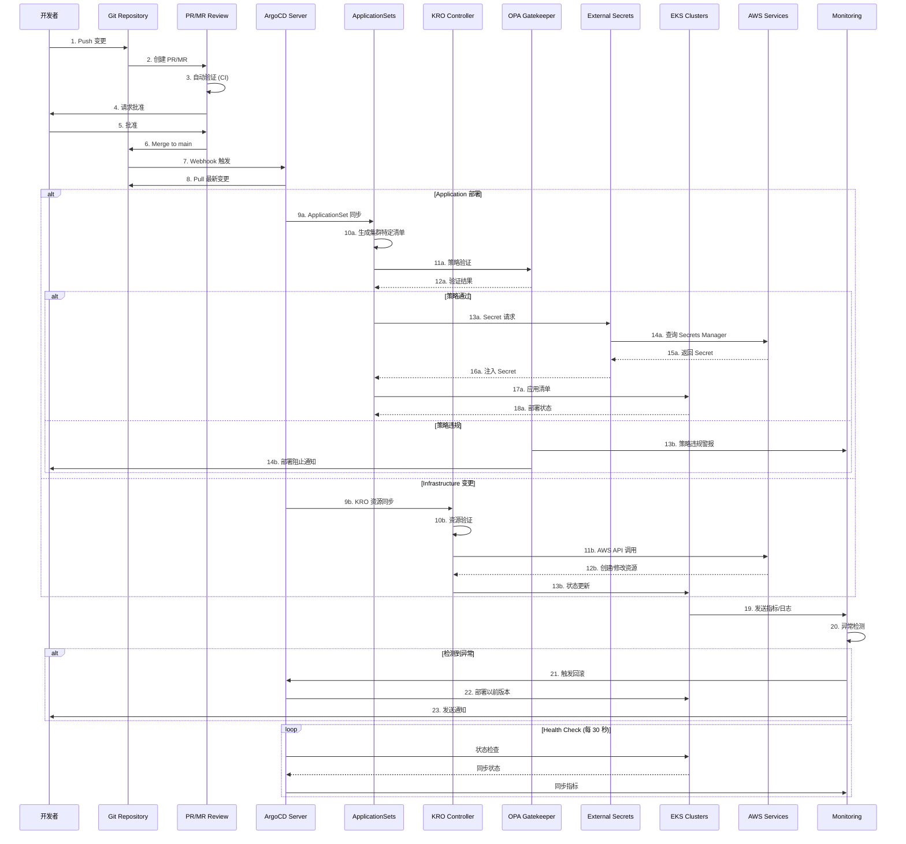

# 基于 GitOps 的 EKS 集群运维

> 📅 **撰写日期**: 2025-02-09 | **修改日期**: 2026-02-13 | ⏱️ **阅读时间**: 约 7 分钟

> **📌 基准版本**: ArgoCD v2.13+ / v3（预发布版），EKS Capability for Argo CD (GA)，Kubernetes 1.32

## 概述

为了稳定且可扩展地运维大规模 EKS 集群，遵循 GitOps 原则的自动化部署和管理策略是必不可少的。本文档说明如何使用 ArgoCD、KRO/ACK 和 Infrastructure as Code 模式构建生产级集群运维环境。

### 问题解决

传统的 EKS 集群运维存在以下问题：

- 手动配置导致环境间不一致
- 难以追踪基础设施变更历史
- 大规模多集群管理的复杂性
- 缺乏部署验证和回滚流程
- 策略合规自动化不足

本架构旨在解决这些问题。

## 技术考虑事项和架构摘要

### 核心建议

**1. GitOps 平台选择**

- 使用 ArgoCD ApplicationSets 进行多集群管理
- 集成 Flagger 实现渐进式交付

:::tip ArgoCD 作为 EKS Capability（re:Invent 2025）
ArgoCD 以 **EKS Capability** 形式提供。与传统 EKS Add-on 不同，EKS Capability 在 AWS 托管账户中**工作节点外部**运行，安装、升级、扩缩容和高可用性均由 AWS 完全管理。可通过 EKS 控制台的 **Capabilities** 选项卡或 AWS CLI/API 激活。

```bash
# 创建 ArgoCD EKS Capability
aws eks create-capability \
  --cluster-name my-cluster \
  --capability-type ARGOCD \
  --role-arn arn:aws:iam::123456789012:role/eks-argocd-capability-role
```

**核心区别（Add-on vs Capability）：**
- **Add-on**：在集群内部运行，用户管理资源
- **Capability**：在 AWS 托管账户中运行，零运维开销
- 原生集成 AWS Identity Center SSO、Secrets Manager、ECR 和 CodeConnections
:::

**2. Infrastructure as Code 策略**

- **建议采用 ACK/KRO（Kubernetes Resource Orchestrator）**
  - 可与现有 Terraform 状态进行渐进式迁移
  - 通过 Kubernetes 原生方式确保运维一致性
  - 相比 Helm 提供更灵活的资源编排

**3. 自动化核心要素**

- Blue/Green 方式的 EKS 升级自动化
- 用于 Addon 版本管理的自动化测试管道
- 基于 Policy as Code（OPA/Gatekeeper）的治理

**4. 安全和合规**

- External Secrets Operator + AWS Secrets Manager 组合
- Git 签名和基于 RBAC 的批准工作流
- 实时合规监控仪表板

### 预期 ROI

| 效果 | 改进 |
|------|------|
| 运维负担 | 通过自动化减少手动工作 |
| 升级频率 | 从每年 1 次到每季度可能 |
| 故障恢复 | 通过自动回滚改善时间 |

## 架构概述

基于 GitOps 的 EKS 集群运维以 Git 作为单一真实来源，通过声明式配置管理自动同步集群状态。

### GitOps 工作流



## 多集群管理策略

### 基于 ApplicationSets 的集群管理

ArgoCD ApplicationSets 是在多集群环境中管理一致部署的核心工具。

**核心策略：**

#### 1. Cluster Generator

- 基于集群注册表的动态应用程序生成
- 基于标签的集群分组（按环境、区域、用途）

#### 2. Git Directory Generator

- 按环境配置管理（dev/staging/prod）
- 集群特定覆盖设置

#### 3. Matrix Generator

- 集群 × 应用程序组合管理
- 应用条件部署规则

## 多集群自动化

### EKS 集群升级自动化

使用 Blue/Green 部署模式实现无中断集群升级。

**准备阶段**

- 新集群配置（KRO）
- Addon 兼容性验证
- 安全策略同步

**迁移阶段**

- 渐进式工作负载迁移
- 流量权重调整（0% → 100%）
- 实时监控

**验证和完成**

- 自动化 smoke test
- 性能指标比较
- 旧集群移除

## 安全和治理

### Git Repository 结构设计

有效的 GitOps 实施需要适当的仓库结构。

**Monorepo vs Polyrepo 建议：**

| 对象 | 推荐方式 | 原因 |
|------|---------|------|
| 应用程序代码 | Polyrepo | 保证团队独立性 |
| 基础设施配置 | Monorepo | 中央管理和一致性 |
| 策略定义 | Monorepo | 强制全公司标准化 |

### Secret 管理架构

:::info External Secrets Operator (ESO) 推荐

**主要特点：**

- 集中式 Secret 存储
- 支持自动轮换
- 细粒度访问控制（IRSA）
- 无需在 Git 中加密存储

与 AWS Secrets Manager 配合使用，可以有效实施组织的安全策略。

:::

## 从 Terraform 到 KRO 的迁移策略

从现有 Terraform 环境逐步过渡到 KRO。这种方法在持续提供价值的同时最小化风险。

### 第 1 阶段：试点（2 个月）

- 针对 1 个 Dev 环境集群
- 仅迁移基本资源（VPC、Subnets、Security Groups）
- Terraform 状态导入和验证

### 第 2 阶段：扩大应用（3 个月）

- 包括 Staging 环境
- 添加 EKS 集群和 Addon 管理
- 构建自动化管道

### 第 3 阶段：完整迁移（4 个月）

- 依次应用到 Production 环境
- 所有 AWS 资源由 KRO 管理
- 完全移除 Terraform

### KRO 资源定义示例

以下是使用 KRO 的 EKS 集群和节点组定义示例。

```yaml
apiVersion: kro.run/v1alpha1
kind: ResourceGroup
metadata:
  name: eks-cluster-us-east-1-prod
spec:
  schema:
    apiVersion: v1alpha1
    kind: EKSClusterStack
    spec:
      clusterName: string
      region: string | default="us-east-1"
      version: string | default="1.32"
  resources:
    # EKS 集群定义（ACK EKS Controller）
    - id: cluster
      template:
        apiVersion: eks.services.k8s.aws/v1alpha1
        kind: Cluster
        metadata:
          name: ${schema.spec.clusterName}
        spec:
          name: ${schema.spec.clusterName}
          version: ${schema.spec.version}
          roleARN: arn:aws:iam::123456789012:role/eks-cluster-role
          resourcesVPCConfig:
            subnetIDs:
              - subnet-0a1b2c3d4e5f00001
              - subnet-0a1b2c3d4e5f00002
            endpointPrivateAccess: true
            endpointPublicAccess: false

    # 节点组定义（ACK EKS Controller）
    - id: nodegroup
      template:
        apiVersion: eks.services.k8s.aws/v1alpha1
        kind: Nodegroup
        metadata:
          name: ${schema.spec.clusterName}-nodegroup
        spec:
          clusterName: ${schema.spec.clusterName}
          nodegroupName: ${schema.spec.clusterName}-ng-01
          instanceTypes:
            - c7i.8xlarge
          scalingConfig:
            minSize: 3
            maxSize: 50
            desiredSize: 10
          amiType: AL2023_x86_64_STANDARD
```

## EKS Capabilities：完全托管的平台功能（re:Invent 2025）

在 AWS re:Invent 2025 上发布的 **EKS Capabilities** 是一种由 AWS 完全管理 Kubernetes 原生平台功能的新方式。与在集群内部运行的传统 EKS Add-on 不同，EKS Capabilities **在 AWS 托管账户中在工作节点外部运行**。

### 发布时的 3 个核心 Capability

| Capability | 基础项目 | 角色 |
|-----------|---------|------|
| **Argo CD** | CNCF Argo CD | 声明式 GitOps 持续部署 |
| **ACK** | AWS Controllers for Kubernetes | Kubernetes 原生 AWS 资源管理 |
| **kro** | Kube Resource Orchestrator | 高级 Kubernetes/AWS 资源编排 |

### EKS Capability for Argo CD 主要特点

**零运维开销：**
- AWS 管理所有安装、升级、补丁、高可用性和扩缩容
- 无需管理 Argo CD 控制器、Redis 或 Application Controller
- 自动备份和灾难恢复

**Hub-and-Spoke 架构：**
- 在专用 Hub 集群上创建 Argo CD Capability
- 从中心集中管理多个 Spoke 集群
- AWS 处理跨集群通信

**AWS 服务原生集成：**
- **AWS Identity Center**：基于 SSO 的身份验证，RBAC 角色映射
- **AWS Secrets Manager**：自动密钥同步
- **Amazon ECR**：原生私有注册表访问
- **AWS CodeConnections**：Git 仓库连接

### Self-managed vs EKS Capability 比较

| 项目 | Self-managed ArgoCD | EKS Capability for ArgoCD |
|------|-------------------|--------------------------|
| 安装和升级 | 手动管理（Helm/Kustomize） | AWS 完全管理 |
| 运行位置 | 集群内部（工作节点） | AWS 托管账户（外部） |
| HA 配置 | 手动设置（Redis HA 等） | 自动（Multi-AZ） |
| 身份验证 | 手动配置（Dex、OIDC 等） | AWS Identity Center 集成 |
| 多集群 | 手动管理 kubeconfig | AWS 原生跨集群 |
| 密钥管理 | 单独安装 ESO | 原生 Secrets Manager 集成 |
| 成本 | EC2 资源消耗 | 单独 Capability 定价 |

:::warning 从 Self-managed 迁移
从 Self-managed ArgoCD 迁移到 EKS Capability 时，现有 Application/ApplicationSet 资源兼容。但如果使用了自定义 CRD 扩展或自定义插件，请事先验证兼容性。
:::

### 启用 EKS Capabilities

**控制台：**
1. EKS 控制台 → 集群 → **Capabilities** 选项卡
2. 点击 **Create capabilities**
3. 选择 Argo CD 复选框 → 指定 Capability Role
4. 配置 AWS Identity Center 身份验证

**CLI：**
```bash
# 创建 Argo CD Capability
aws eks create-capability \
  --cluster-name prod-hub-cluster \
  --capability-type ARGOCD \
  --role-arn arn:aws:iam::123456789012:role/eks-argocd-role \
  --configuration '{
    "identityCenterConfig": {
      "instanceArn": "arn:aws:sso:::instance/ssoins-xxxxxxxxx"
    }
  }'

# 创建 ACK Capability
aws eks create-capability \
  --cluster-name prod-hub-cluster \
  --capability-type ACK \
  --role-arn arn:aws:iam::123456789012:role/eks-ack-role

# 创建 kro Capability
aws eks create-capability \
  --cluster-name prod-hub-cluster \
  --capability-type KRO \
  --role-arn arn:aws:iam::123456789012:role/eks-kro-role
```

## ArgoCD v3 更新（2025）

ArgoCD v3 在 KubeCon EU 2025 预发布，主要改进如下：

### 可扩展性改进

- **大规模集群支持**：改善管理数千个 Application 资源的性能
- **改进分片**：增强 Application Controller 的水平扩展
- **内存优化**：处理大型清单时减少内存使用

### 安全增强

- **RBAC 改进**：更细粒度的权限控制
- **审计日志**：增强所有操作的审计日志
- **密钥管理**：改进与 External Secrets Operator 的集成

### 迁移指南

从 ArgoCD v2.x 迁移到 v3：

1. 首先升级到 v2.13（确认兼容性）
2. 检查并更新废弃的 API
3. 在 v3 预发布版中测试功能
4. 执行生产环境升级

:::warning 注意事项
ArgoCD v3 在 2025 年上半年处于预发布状态。在生产环境中使用稳定版本（v2.13+），并在 v3 GA 发布后确认再进行迁移。
:::

## 结论

基于 GitOps 的大规模 EKS 集群运维策略可以显著减少手动管理负担，大幅提高稳定性和可扩展性。

:::tip 核心建议

**1. 利用 EKS Capabilities（ArgoCD + ACK + kro）**

- 通过 EKS Capability 运行 ArgoCD，消除运维开销
- 通过 ACK/kro 实现 Kubernetes 原生基础设施管理
- 通过 AWS Identity Center 集成实现基于 SSO 的访问控制

**2. 使用 ArgoCD ApplicationSets 进行多集群管理**

- Hub-and-Spoke 架构实现集中管理
- 集群间一致的部署及按环境自定义

**3. 使用自动化 Blue/Green 升级策略**

- 无中断集群升级
- 自动回滚功能

**4. 基于 Policy as Code 的治理**

- 通过 OPA/Gatekeeper 强制策略
- 合规自动化

:::

通过分阶段迁移方法，可以在最小化风险的同时快速实现价值。