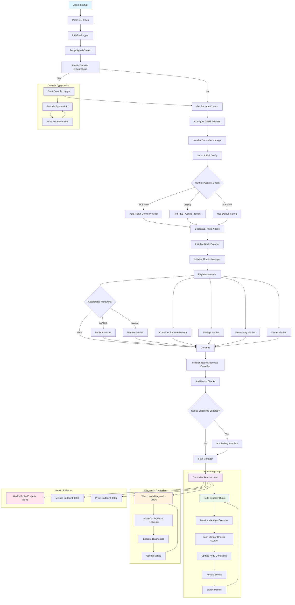

# EKS 节点监控代理

> 📅 **作成日期**: 2025-08-26 | ⏱️ **阅读时间**: 约 9 分钟


## 概述

EKS Node Monitoring Agent（NMA）是 AWS 提供的节点状态监控工具。它自动检测和报告 EKS 集群节点中发生的硬件和系统级问题。这项于 2024 年正式发布的服务与节点自动修复（Node Auto Repair）功能配合工作，提高集群的稳定性。

### 问题解决

传统的 EKS 集群运维存在以下问题：

- 缺乏硬件故障的早期检测
- 需要手动监控系统级问题
- 对节点状态变化的响应延迟
- 问题检测与自动恢复的集成缺失

NMA 旨在解决这些问题。

### 什么是 EKS Node Monitoring Agent

### 主要特点

- **基于日志的问题检测**：实时分析系统日志进行模式匹配
- **自动事件生成**：检测到问题时自动生成 Kubernetes Events 和 Node Conditions
- **CloudWatch 集成**：将检测到的问题发送到 CloudWatch 进行集中监控
- **EKS Add-on 支持**：简便的安装和管理

:::warning 重要
NMA 是自动检测节点状态问题的有用工具，但单独使用无法成为完整的监控解决方案。需要考虑以下限制并设定适当的期望，同时使用补充工具。
:::

:::tip 核心建议

**✅ 推荐用法**

- 将 NMA 用作节点状态检测层
- 用 Container Insights 或 Prometheus 补充指标收集
- 与 Node Auto Repair 配合使用实现自动恢复
- 根据环境特性调整阈值

**❌ 应避免的用法**

- 不能仅依赖 NMA 进行全面监控
- 无法应对突发硬件故障

:::

## 1. 设计目标

### 1.1 全面的节点状态监控

NMA 监控 EKS 节点的各种系统组件：

- **Container Runtime**：检查 Docker/containerd 的状态
- **Storage System**：监控磁盘空间和 I/O 性能
- **Networking**：验证网络连接性和配置
- **Kernel**：检查内核模块和系统状态
- **Accelerated Hardware**：GPU（NVIDIA）和 Neuron 芯片状态（硬件检测时）

### 1.2 Kubernetes 原生集成

NMA 使用 controller-runtime 与 Kubernetes 紧密集成：

```go
mgr, err := controllerruntime.NewManager(controllerruntime.GetConfigOrDie(), controllerruntime.Options{
    Logger:                 log.FromContext(ctx),
    Scheme:                 scheme.Scheme,
    HealthProbeBindAddress: controllerHealthProbeAddress,
    BaseContext:            func() context.Context { return ctx },
    Metrics:                server.Options{BindAddress: controllerMetricsAddress},
})
```

### 1.3 支持多种 EKS 环境

从 REST 配置逻辑可以看出，NMA 支持多种 EKS 环境：

- **EKS Auto**：使用特殊的用户模拟流程
- **Legacy RBAC**：支持现有权限模型
- **Standard**：标准基于 Pod 的认证

## 2. 架构和工作原理

### 2.1 Agent 启动和初始化流程

以下图表展示了 NMA 的启动过程和监控循环的整体流程。



### 2.2 监控器注册和管理

NMA 通过监控器配置管理各个子系统。以下展示了监控器注册的结构。

```go
var monitorConfigs = []monitorConfig{
    {
        Monitor:       &runtime.RuntimeMonitor{},
        ConditionType: rules.ContainerRuntimeReady,
    },
    {
        Monitor:       storage.NewStorageMonitor(),
        ConditionType: rules.StorageReady,
    },
    // ... 其他监控器
}
```

每个监控器都与相应的 Node Condition 关联，报告状态。

### 2.3 基于 Node Condition 的状态报告

NMA 利用 Kubernetes 的 Node Condition 机制报告各子系统的状态：

- `ContainerRuntimeReady`：容器运行时状态
- `StorageReady`：存储系统状态
- `NetworkingReady`：网络状态
- `KernelReady`：内核状态
- `AcceleratedHardwareReady`：GPU/Neuron 硬件状态（有条件）

### 2.4 实时诊断功能

通过 NodeDiagnostic CRD 执行按需诊断：

```go
diagnosticController := controllers.NewNodeDiagnosticController(mgr.GetClient(), hostname, runtimeContext)
```

通过这个功能，运维人员可以在特定节点上实时执行诊断命令。

### 2.5 可观测性（Observability）

NMA 通过各种端点提供可观测性：

- **Health Probe**（`:8081`）：Kubernetes 健康检查
- **Metrics**（`:8080`）：暴露 Prometheus 指标
- **PProf**（`:8082`）：Go 分析（可选）

### 2.6 控制台诊断日志

启用 `-console-diagnostics` 标志时，定期将系统信息记录到 `/dev/console`：

```go
if enableConsoleDiagnostics {
    startConsoleDiagnostics(ctx)
}
```

这提供了实例级别的可见性。

### 2.7 部署和运维特性

#### 2.7.1 基于 DaemonSet 的部署

如 `agent.tpl.yaml` 所示，NMA 作为 DaemonSet 部署，在所有工作节点上运行：

```yaml
kind: DaemonSet
apiVersion: apps/v1
metadata:
  name: eks-node-monitoring-agent
  namespace: kube-system
```

#### 2.7.2 节点选择和约束

通过 `values.yaml` 的 affinity 设置限制只在特定节点类型上运行：

- 排除 Fargate 节点
- 排除 EKS Auto 计算类型
- 排除 HyperPod 节点
- 仅支持 AMD64/ARM64 架构

#### 2.7.3 权限管理

通过 `agent.tpl.yaml` 的 RBAC 设置应用最小权限原则：

```yaml
rules:
  # monitoring permissions
  - apiGroups: [""]
    resources: ["events"]
    verbs: ["create", "patch"]
  # nodediagnostic permissions
  - apiGroups: ["eks.amazonaws.com"]
    resources: ["nodediagnostics"]
    verbs: ["get", "watch", "list"]
```

#### 2.7.4 资源效率

`values.yaml` 中定义的资源限制实现轻量级运维：

```yaml
resources:
  requests:
    cpu: 10m
    memory: 30Mi
  limits:
    cpu: 250m
    memory: 100Mi
```

### 2.8 可检测的问题类型

#### 2.8.1 Conditions（自动恢复目标）

- `DiskPressure`：磁盘空间不足
- `MemoryPressure`：内存不足
- `PIDPressure`：进程 ID 耗尽
- `NetworkUnavailable`：网络接口问题
- `KubeletUnhealthy`：Kubelet 服务异常
- `ContainerRuntimeUnhealthy`：Docker/containerd 问题

#### 2.8.2 Events（警告用途）

- 内核软锁定
- I/O 延迟
- 文件系统错误
- 网络数据包丢失
- 硬件错误迹象（Network、Storage、GPU、CPU、Memory）

## 3. 部署方式差异

### 3.1 Manual Mode（DaemonSet）

**优点：**

- 灵活的版本管理
- 基于 ConfigMap 的配置更改
- 可自定义设置

**缺点：**

- 对 kubelet 的依赖性高
- 节点引导时延迟
- 受 kubelet 故障影响

### 3.2 EKS Auto Mode

**优点：**

- 直接内置在 AMI 中
- 独立于 kubelet 运行
- 更高的可用性
- 快速问题检测

**缺点：**

- 更新时需要更换 AMI
- 自定义受限

## 4. 技术限制

### 4.1 指标收集限制

- **NMA 不是指标收集工具**：无法收集性能指标（CPU、内存使用率等）
- **日志解析方式**：不使用 cAdvisor，纯粹基于日志分析
- **Prometheus 端点**：仅暴露有限的健康状态指标（端口 8080）

### 4.2 使用替代后端时的限制

:::warning 使用 CloudWatch 以外的后端时

- 没有原生 ADOT 集成
- Prometheus 指标范围非常有限
- 缺乏配置更改选项
- 缺乏官方文档和支持

:::

### 4.3 硬件故障检测限制

**可检测：**

- ✅ 渐进性能下降
- ✅ I/O 错误增加
- ✅ 内存 ECC 错误

**不可检测：**

- ❌ 突然断电
- ❌ 即时硬件故障
- ❌ 网络完全断开

## 5. 推荐实施策略

### 5.1 多层监控架构

```
集成监控栈：
├── L1: 状态检测 (NMA)
│   └── 节点问题早期检测
├── L2: 指标收集 (Container Insights/Prometheus)
│   └── 详细性能数据
├── L3: 自动响应 (Node Auto Repair)
│   └── 问题节点自动替换
└── L4: 集成仪表板 (CloudWatch/Grafana)
    └── 综合监控视图
```

### 5.2 使用 Prometheus 时的推荐配置

同时使用 NMA 和 Node Exporter 时，推荐以下配置。

```yaml
apiVersion: v1
kind: Service
metadata:
  name: monitoring-stack
spec:
  components:
    - name: nma
      purpose: "节点状态事件"
      port: 8080
    - name: node-exporter
      purpose: "详细系统指标"
      port: 9100
    - name: kube-state-metrics
      purpose: "集群状态指标"
      port: 8080
```

## 6. 成本和性能考虑

### 6.1 资源使用量

NMA 是非常轻量的组件。

| 资源 | 要求 |
|--------|---------|
| CPU | 100m-200m（平时） |
| Memory | 200Mi-400Mi |
| Network | 1-2MB/min（CloudWatch 传输） |
| 日志存储 | 最大 100MB |

### 6.2 CloudWatch 成本

| 项目 | 成本 |
|------|------|
| 自定义指标 | $0.30/metric/month |
| 事件 | $1.00/million events |
| 日志 | $0.50/GB ingested |

## 7. 最佳实践

### 7.1 生产部署

1. **分阶段推出**：Dev → Staging → Production
2. **调整警报阈值**：考虑环境特性
3. **谨慎启用自动恢复**：初期仅监控
4. **定期测试**：每月故障模拟

### 7.2 与其他工具的集成

| 组合 | 说明 |
|------|------|
| NMA + Container Insights | 完整的 AWS 原生可见性 |
| NMA + Prometheus + Grafana | 基于开源的监控栈 |
| NMA + Datadog/New Relic | 企业级监控解决方案 |