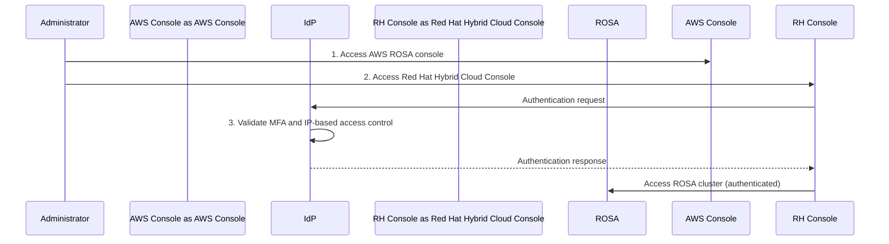

# ROSA 安全合规控制台访问控制

> 📅 **撰写日期**: 2025-02-05 | **修改日期**: 2026-02-13 | ⏱️ **阅读时间**: 约 3 分钟


## 概述

在金融机构部署 ROSA (Red Hat OpenShift Service on AWS) 时，Red Hat Hybrid Cloud Console 的访问控制是一个重要的安全要求。本指南说明了使用 IdP (Identity Provider)、MFA 和基于 IP 的访问控制实现安全管理员访问控制的策略。

:::warning 注意
本文档针对金融行业安全要求。实际实施需要 Red Hat 和 AWS 的咨询。
:::

---

## 客户情况

一家实施 ROSA (Red Hat OpenShift Service on AWS) 的韩国金融机构对 Red Hat Hybrid Cloud Console 的访问控制提出了安全顾虑。这与已满足要求的 ROSA 集群网络架构是分开的。

## 当前理解

- ROSA 集群私有网络配置已被充分理解且可实施
- 合规问题仅限于 Red Hat Hybrid Cloud Console 的访问模式，而非 ROSA 集群本身
- 创建 ROSA 集群后，管理员通过 Red Hat Hybrid Cloud Console 访问，目前不满足安全要求

## 当前障碍

Red Hat Hybrid Cloud Console 的默认公共访问模式不满足金融行业监管要求。虽然 ROSA 集群本身可以通过私有网络配置得到适当保护，但控制台访问必须单独管理。

## 安全要求

### 控制台访问控制需求

客户需要以下内容：

1. Red Hat Hybrid Cloud Console 访问的 IdP (Identity Provider) 集成
2. 通过 IdP 实施 MFA (Multi-Factor Authentication)
3. 控制台的基于 IP 的访问控制

### 重要说明

- 这些要求仅适用于 Red Hat Hybrid Cloud Console 访问
- 与 ROSA 集群本身的 OIDC/SAML 配置完全不同
- 顾虑不在于 ROSA 集群网络架构，实施私有网络配置（包括 Zero Egress 配置）后已验证合规

## 建议的访问控制工作流

客户提出的安全访问工作流如下：

1. 管理员访问 AWS ROSA 控制台
2. 访问 Red Hat Hybrid Cloud Console 时，通过在 AWS 中配置的 IdP 处理认证
3. IdP 执行：
   - 多因素认证 (MFA)
   - 基于 IP 的访问控制

此工作流确保管理员访问受到严格控制，满足安全要求。



### 完整架构

```mermaid
graph TB
    subgraph Customer[\"Customer Environment\"]
        Admin[Administrator]
        IdP[Corporate IdP<br/>with MFA and IP Control]
    end

    subgraph AWS[\"AWS Cloud\"]
        AWSC[AWS Console]
        subgraph Private[\"Private Network\"]
            ROSA[ROSA Cluster<br/>Zero Egress Configuration]
        end
    end

    subgraph RedHat[\"Red Hat\"]
        HCC[Hybrid Cloud Console<br/>IdP Integration Required]
    end

    Admin -->|1. Access| AWSC
    Admin -->|2. Access| HCC
    HCC -->|3. Authentication Request| IdP
    IdP -->|4. MFA + IP Validation| IdP
    IdP -->|5. Authentication Response| HCC
    HCC -->|6. Management| ROSA

    style IdP fill:#ff9900,stroke:#232f3e,stroke-width:2px
    style HCC fill:#EE0000,stroke:#232f3e,stroke-width:2px
```

---

## 所需响应

1. 类似金融行业案例的信息
2. 已实施的管理员访问控制解决方案
3. 其他金融行业实施的最佳实践

## 后续步骤

- 验证建议的工作流是否满足 Red Hat 技术能力
- 提供 Red Hat Hybrid Cloud Console IdP 集成文档
- 分享其他金融行业实施的案例研究
- 提供实施的技术指导

:::tip 参考
实际实施需要与 Red Hat 和 AWS 进行详细协调。
:::
