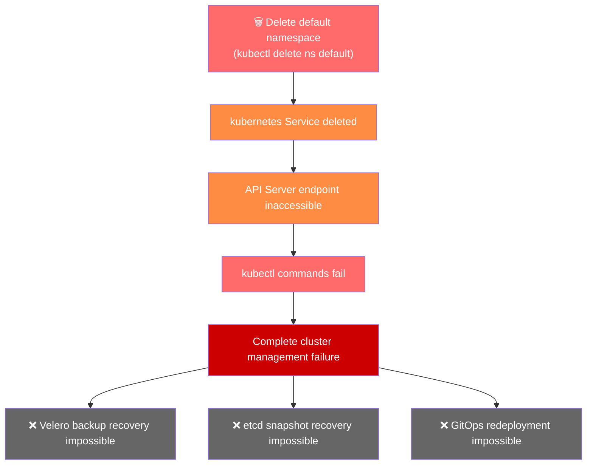
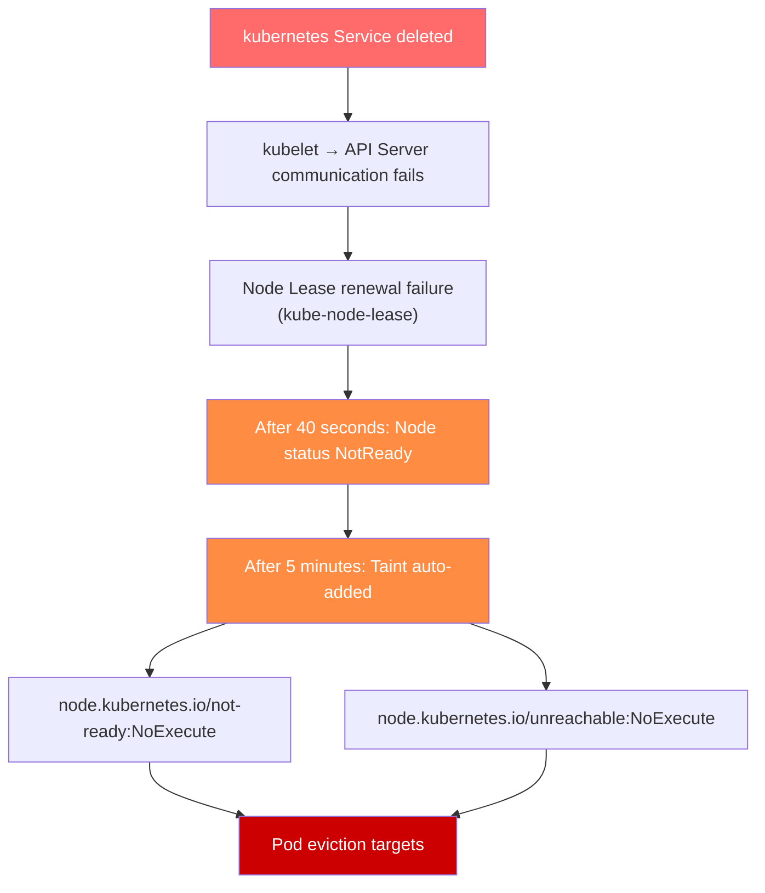

# EKS Default 命名空间删除事件响应指南

> 📅 **撰写日期**: 2025-01-07 | **修改日期**: 2026-02-14 | ⏱️ **阅读时间**: 约 10 分钟


## 1. 概述 (TL;DR)

:::danger 严重警告
在 EKS 集群中删除 default 命名空间会阻止所有对控制平面的访问。kubectl 命令将失败，且无法通过 Velero 或 etcd 备份进行恢复。default 命名空间是必须受到保护的关键集群资源，强烈建议使用 Admission Controller 或其他访问控制机制来谨慎管理此资源。
:::

- **根因**: 删除 `default` 命名空间会移除 `kubernetes` Service
- **影响范围**: API Server 访问失败 → 集群全面管理失败 → 服务中断（若持续时间较长）
- **恢复方法**: **必须提交 AWS Support 工单**（严重级别：Critical）

:::tip 恢复摘要
提交 Critical 级别的 AWS Support 工单，并将您的 Account Team 和 WWSO Specialist 作为参考联系人添加，以请求快速恢复。
:::

---

## 2. 根因分析

### 2.1 Default 命名空间的角色

`default` 命名空间不仅仅是用户工作负载的基本空间。此命名空间中存在关键的集群资源。

**default 命名空间中的关键资源**：

:::warning 注意
kubernetes Service 是从集群内部访问 API Server 的唯一路径。如果此 Service 被删除，所有 Kubernetes 组件都将失去与控制平面的连接。
:::

### 2.2 事件产生机制

让我们来分析删除 `default` 命名空间时的级联故障过程。



**事件序列**：

1. **执行命名空间删除命令**: `kubectl delete namespace default`
2. **级联删除**: 命名空间中的所有资源被一并删除
3. **kubernetes Service 删除**: API Server 端点消失
4. **连接中断**: 集群内部组件无法与 API Server 通信
5. **管理不可能**: 无法执行任何 kubectl 命令

### Worker Node 的影响

API Server 端点的长时间丢失会对 Worker Node 产生级联影响。



**节点状态随时间变化**：

:::warning 重要
在这种情况下，控制平面本身不可访问，因此 Node Controller 实际上无法更新节点状态或添加污点。结果是，整个集群进入"冻结"状态，现有 Pod 继续运行，但新的调度和状态变更变得不可能。
:::

### 冻结状态下的服务影响

当集群进入冻结状态时，**现有工作负载会短暂继续运行，但服务退化会随时间增加**。

**即时影响**：

- ❌ 新 Pod 调度不可能
- ❌ Pod 重启/重新部署不可能
- ❌ ConfigMap 和 Secret 变更无法反映
- ❌ HPA (Horizontal Pod Autoscaler) 扩缩容不可能

**随时间推移的服务影响**：

:::danger 特别危险的场景

- 当 DNS 缓存过期或 TLS 证书过期时，服务发现失败，通信变得不可能
- 如果 Pod 因 OOMKilled 或崩溃，**无法重启**
- 如果节点发生故障，**该节点上的所有工作负载将丢失**
- ALB/NLB Target Group 更新失败，导致**流量路由故障**

随着时间推移，事件影响范围会扩大，因此**请尽快联系 AWS Support**。
:::

---

## 3. 事件响应流程

### 步骤 1: 确认事件情况

如果怀疑事件是由 default 命名空间删除引起的，首先验证集群状态。

### 1-1. 测试 kubectl 访问

首先，验证 kubectl 命令是否正常工作。

```bash
# 尝试获取集群信息
kubectl cluster-info

# 预期错误信息
# Unable to connect to the server: dial tcp: lookup kubernetes on 10.100.0.10:53: no such host
# or
# The connection to the server <cluster-endpoint> was refused
```

:::warning 注意
如果看到上述错误，说明 kubernetes Service 已被删除，API Server 不可访问。
:::

### 1-2. 通过 AWS CLI 检查集群状态

即使 kubectl 失败，仍可使用 AWS CLI 检查 EKS 集群状态。

```bash
# 检查集群状态
aws eks describe-cluster \
  --name <cluster-name> \
  --query 'cluster.{Name:name,Status:status,Endpoint:endpoint,Version:version}' \
  --output table

# 预期输出（集群本身为 ACTIVE）
# -------------------------------------------------------------------
# |                        DescribeCluster                          |
# +----------+------------------------------------------------------+
# |  Name    |  my-eks-cluster                                      |
# |  Status  |  ACTIVE                                              |
# |  Endpoint|  https://XXXXX.gr7.ap-northeast-2.eks.amazonaws.com  |
# |  Version |  1.31                                                |
# +----------+------------------------------------------------------+
```

```bash
# 检查节点组状态
aws eks list-nodegroups --cluster-name <cluster-name>

aws eks describe-nodegroup \
  --cluster-name <cluster-name> \
  --nodegroup-name <nodegroup-name> \
  --query 'nodegroup.{Name:nodegroupName,Status:status,DesiredSize:scalingConfig.desiredSize}' \
  --output table
```

### 1-3. 事件情况评估标准

:::tip 关键点
如果集群在 AWS 控制台或 CLI 中显示为 ACTIVE，但 kubectl 命令完全失败，请怀疑 default 命名空间被删除。
:::

✅ **检查点**: 如果确认上述症状，请立即进入**步骤 2: 提交 AWS Support 工单**。

### 步骤 2: 提交 AWS Support 工单

default 命名空间删除事件**只能通过 AWS Support 恢复**。请立即提交工单。

### 2-1. 工单提交信息

### 2-2. 工单正文模板

将以下模板复制粘贴到工单正文中。

```text
[URGENT] EKS Cluster Control Plane Access Failure Due to Default Namespace Deletion

■ Cluster Information
- Cluster Name: <Cluster Name>
- Region: <Region>
- Account ID: <AWS Account ID>
- Cluster Version: <Kubernetes Version>

■ Incident Situation
- Incident Time: <YYYY-MM-DD HH:MM UTC>
- Symptoms: kubectl commands fail after default namespace deletion
- Impact Scope: Entire cluster management impossible

■ Confirmed Details
- Cluster status via AWS CLI: ACTIVE
- kubectl cluster-info result: Connection failed
- kubectl get ns default result: Connection failed

■ Request
Please restore the default namespace and kubernetes Service.
Urgent recovery is needed for production environment.

■ Contact Information
- Contact Person: <Name>
- Phone: <Phone Number>
- Email: <Email>
```

### 2-3. 在 AWS 控制台中提交工单的方法

1. 访问 AWS Support Center
2. 点击 **Create case**
3. 选择 **Technical**
4. Service: 选择 **Elastic Kubernetes Service (EKS)**
5. Category: 选择 **Cluster Issue**
6. Severity: 选择 **Critical - Business-critical system down**（仅限 Enterprise Support 计划）
7. 将上述模板粘贴到正文中
8. 联系选项: 选择 **Phone**（响应更快）
9. 点击 **Submit**

:::warning 重要
提交后记录工单 ID。联系 Account Team 和 WWSO Specialist 时需要使用。
:::

### 步骤 3: 联系 Account Team/WWSO Specialist

在提交 AWS Support 工单的同时，联系您的 Account Team 和 WWSO (Worldwide Specialist Organization) Specialist 以加快恢复速度。

### 3-1. 将参考联系人添加到工单

将 Account Team 和 WWSO Specialist 作为参考联系人添加到您的 AWS Support 工单中。

1. 导航到已提交工单的 **Correspondence** 部分
2. 点击 **Reply** 按钮
3. 添加以下内容以请求参考

```text
CC Request:
- AWS Account Team: <Account Manager Name/Email>
- WWSO EKS Specialist: <Specialist Name/Email (if known)>

Urgent recovery needed for production environment.
Please support this case with Account Team and EKS Specialist.
```

### 3-2. 直接联系 Account Team

除 AWS Support 工单外，直接联系您的 Account Team。

**邮件模板**：

```text
Subject: [URGENT] EKS Cluster Incident - Support Case #<Case ID>

Hello,

I am contacting you regarding an urgent incident in our production EKS cluster.

■ Incident Summary
- Cluster: <Cluster Name>
- Symptoms: Control Plane access failure due to default namespace deletion
- Support Case ID: <Case ID>

■ Request
Please escalate this case and connect with an EKS Specialist.

Thank you,
<Your Name>
<Phone Number>
```

**Slack/SMS 消息**（如可用）：

```text
🚨 [URGENT] EKS Cluster Incident

- Account: <Account ID>
- Cluster: <Cluster Name>
- Issue: Control Plane access failure - default namespace deleted
- Support Case: #<Case ID>

Production environment - urgent support needed.
```

### 3-3. 联系 WWSO Specialist

如果您认识 WWSO EKS Specialist，请直接联系。直接联系专家可通过内部管线路由工单，提升重要性并直接分配给负责的工程师。

### 3-4. 联系检查清单

### 步骤 4: 恢复后验证

在 AWS Support 恢复 `default` 命名空间后，验证集群是否正常运行。

### 4-1. 基本连接验证

```bash
# 1. 验证集群连接
kubectl cluster-info

# 预期输出：
# Kubernetes control plane is running at https://XXXXX.gr7.ap-northeast-2.eks.amazonaws.com
# CoreDNS is running at https://XXXXX.gr7.ap-northeast-2.eks.amazonaws.com/api/v1/namespaces/kube-system/services/kube-dns:dns/proxy
```

```bash
# 2. 验证 default 命名空间存在
kubectl get namespace default

# 预期输出：
# NAME      STATUS   AGE
# default   Active   <hours>
```

```bash
# 3. 验证 kubernetes Service
kubectl get svc kubernetes -n default

# 预期输出：
# NAME         TYPE        CLUSTER-IP   EXTERNAL-IP   PORT(S)   AGE
# kubernetes   ClusterIP   10.100.0.1   <none>        443/TCP   <hours>
```

### 4-2. 关键组件状态验证

```bash
# 4. 检查节点状态
kubectl get nodes

# 验证所有节点为 Ready
```

```bash
# 5. 检查系统 Pod 状态
kubectl get pods -n kube-system

# 验证所有 Pod 为 Running
# 特别验证 coredns、kube-proxy、aws-node
```

```bash
# 6. 检查所有命名空间
kubectl get namespaces

# 验证 default、kube-system、kube-public、kube-node-lease 存在
```

### 4-3. API Server 功能验证

```bash
# 7. 测试 API 资源获取
kubectl api-resources | head -20

# 8. 简单资源创建/删除测试（可选）
kubectl run test-pod --image=nginx --restart=Never -n default
kubectl get pod test-pod -n default
kubectl delete pod test-pod -n default
```

✅ **验证检查清单**：

### 步骤 5: 工作负载检查

恢复后，检查现有工作负载是否正常运行。

### 5-1. 工作负载状态检查

```bash
# 1. 检查所有命名空间的 Pod 状态
kubectl get pods --all-namespaces | grep -v Running | grep -v Completed

# 找出不在 Running 或 Completed 状态的 Pod
```

```bash
# 2. 检查 Deployment 状态
kubectl get deployments --all-namespaces

# 验证 READY 列显示期望的副本数
```

```bash
# 3. 检查 StatefulSet 状态
kubectl get statefulsets --all-namespaces
```

```bash
# 4. 检查 DaemonSet 状态
kubectl get daemonsets --all-namespaces

# 验证 DESIRED 和 READY 数量匹配
```

### 5-2. 服务连接检查

```bash
# 5. 验证 Service 和 Endpoint
kubectl get svc --all-namespaces
kubectl get endpoints --all-namespaces

# 验证 Endpoint 有 IP 分配
```

```bash
# 6. 检查 Ingress 状态（如使用）
kubectl get ingress --all-namespaces
```

### 5-3. 存储检查

```bash
# 7. 检查 PersistentVolumeClaim 状态
kubectl get pvc --all-namespaces

# 验证所有 PVC 为 Bound
```

```bash
# 8. 检查 PersistentVolume 状态
kubectl get pv

# 验证所有 PV 为 Bound
```

### 5-4. 事件和日志检查

```bash
# 9. 检查最近的 Warning 事件
kubectl get events --all-namespaces --field-selector type=Warning --sort-by='.lastTimestamp' | tail -20
```

```bash
# 10. 检查有问题的 Pod 日志
kubectl logs <pod-name> -n <namespace> --tail=100
```

### 5-5. 工作负载检查清单

:::tip
在事件期间可能有失败的 Job 或 CronJob。如有必要请手动重新运行。
:::

```bash
# 检查失败的 Job
kubectl get jobs --all-namespaces --field-selector status.successful=0
```

✅ **最终检查点**: 当所有工作负载验证正常时，事件响应完成。之后请查看**预防措施**。

---

## 4. 关键资源列表

### 4.1 关键命名空间

除 default 命名空间外，还有一些系统命名空间，如果被删除将对集群产生严重影响。这些命名空间绝不能删除。

:::danger 严重警告
default 和 kube-system 命名空间如果被删除，kubectl 访问本身将变得不可能，因此无法手动恢复。恢复必须通过 AWS Support 完成。
:::

**各命名空间的详细角色**：

**default**：

- `kubernetes` Service：从集群内部访问 API Server 的端点
- `default` ServiceAccount：未指定 ServiceAccount 时 Pod 的默认认证主体

**kube-system**：

- 所有集群运行所需的基本系统组件部署的命名空间
- EKS Add-on（CoreDNS、kube-proxy、VPC CNI）和控制器所在位置

**kube-public**：

- 存储未认证用户也可读取的公共信息
- `cluster-info` ConfigMap 包含集群 CA 证书和 API Server 地址

**kube-node-lease**：

- 每个节点的 Lease 对象存储在此处，作为心跳信号
- Node Controller 根据此信息判断节点状态

### 4.2 kube-system 关键组件

`kube-system` 命名空间包含集群运行所必需的组件。单独删除或修改这些组件可能导致严重故障。

### EKS 关键 Add-on

### EKS 存储组件

### 网络和负载均衡组件

:::tip
作为 EKS Add-on 管理的组件（CoreDNS、kube-proxy、VPC CNI、EBS CSI Driver）可以从 AWS 控制台或 CLI 重新安装 Add-on 来恢复。
:::

```bash
# 检查 EKS Add-on 状态
aws eks list-addons --cluster-name <cluster-name>

# 重新安装 Add-on 示例（CoreDNS）
aws eks create-addon \
  --cluster-name <cluster-name> \
  --addon-name coredns \
  --resolve-conflicts OVERWRITE
```

:::warning 注意
上述恢复方法仅在 kube-system 命名空间存在且 kubectl 访问可用时有效。如果命名空间本身被删除，则需要 AWS Support。
:::

### 4.3 集群级别资源

不属于任何命名空间的集群级别资源，如果被删除或修改，也可能影响整个集群。

### RBAC 相关资源

:::warning 特别危险的 ClusterRole/ClusterRoleBinding

- `system:node` / `system:node` binding：删除会导致**所有节点失去与 API Server 的通信**
- `system:kube-controller-manager`：删除会导致 **Controller Manager 停止**
- `system:kube-scheduler`：删除会导致 **Pod 调度停止**
:::

### CRD (Custom Resource Definition)

:::warning CRD 删除注意
删除 CRD 会级联删除从该 CRD 创建的所有 Custom Resource。例如，删除 Cert-Manager 的 Certificate CRD 会删除集群中所有的 Certificate 资源。
:::

### 存储相关资源

### 节点和网络相关资源

### EKS 特有资源

:::tip 最佳实践
在修改或删除集群级别资源之前，务必先创建备份。
:::

```bash
# ClusterRole 备份示例
kubectl get clusterrole <role-name> -o yaml > clusterrole-backup.yaml

# 备份所有 ClusterRole
kubectl get clusterroles -o yaml > all-clusterroles-backup.yaml

# 备份 CRD（不含 CR）
kubectl get crd <crd-name> -o yaml > crd-backup.yaml
```

---

## 5. 预防策略

### 5.1 通过 Admission Controller 保护资源

Kubernetes Admission Controller 可以防止关键资源被意外删除。这里介绍使用 Kyverno 的示例。

### 使用 Kyverno 防止关键命名空间删除

```yaml
apiVersion: kyverno.io/v1
kind: ClusterPolicy
metadata:
  name: protect-critical-namespaces
spec:
  validationFailureAction: Enforce
  background: false
  rules:
    - name: block-critical-namespace-deletion
      match:
        any:
          - resources:
              kinds:
                - Namespace
              names:
                - default
                - kube-system
                - kube-public
                - kube-node-lease
      exclude:
        any:
          - clusterRoles:
              - cluster-admin
      validate:
        message: "Deletion of critical namespace '{{request.object.metadata.name}}' is blocked."
        deny:
          conditions:
            all:
              - key: "{{request.operation}}"
                operator: Equals
                value: DELETE
```

使用此策略后，非 cluster-admin 用户尝试删除关键命名空间时，其请求将被拒绝。

### 替代 Admission Controller 选项

除 Kyverno 外，还可以使用各种 Admission Controller。

:::tip 建议
根据您团队的技术栈和策略复杂度进行选择。对于简单的资源保护策略，Kyverno 可以快速部署。
:::

### 5.2 基于 GitOps 和 KRMOps 的运维

采用 GitOps 和 KRMOps（Kubernetes Resource Model Operations）方法可以实现声明式资源管理，并从意外变更中快速恢复。

### EKS Auto Mode 的 ArgoCD 功能

EKS Auto Mode 默认提供 ArgoCD，使基于 GitOps 的运维易于开始。

```yaml
# ArgoCD Application 示例 - 关键资源管理
apiVersion: argoproj.io/v1alpha1
kind: Application
metadata:
  name: cluster-critical-resources
  namespace: argocd
spec:
  project: default
  source:
    repoURL: https://github.com/your-org/k8s-manifests.git
    targetRevision: main
    path: cluster-critical
  destination:
    server: https://kubernetes.default.svc
    namespace: default
  syncPolicy:
    automated:
      prune: false      # 防止自动删除关键资源
      selfHeal: true    # 检测到漂移时自动恢复
    syncOptions:
      - CreateNamespace=false
```

**GitOps 预防优势**：

:::tip
将关键命名空间和资源分离到专用的 ArgoCD Application 中，并设置 prune: false 和 selfHeal: true 来保护它们。
:::

### 基于 ACK 和 KRO 的 KRMOps 策略

使用 **ACK (AWS Controllers for Kubernetes)** 和 **KRO (Kube Resource Orchestrator)** 可以利用 Kubernetes Resource Model 管理 AWS 基础设施。

**通过 ACK 管理 AWS 资源**：

```yaml
# 示例：通过 ACK 声明式管理 S3 存储桶
apiVersion: s3.services.k8s.aws/v1alpha1
kind: Bucket
metadata:
  name: my-app-bucket
  namespace: default
spec:
  name: my-app-bucket-12345
  tagging:
    tagSet:
      - key: Environment
        value: Production
```

**通过 KRO 进行复杂资源编排**：

```yaml
# KRO ResourceGroup 示例 - 定义应用程序栈
apiVersion: kro.run/v1alpha1
kind: ResourceGroup
metadata:
  name: web-application
spec:
  schema:
    apiVersion: v1alpha1
    kind: WebApplication
    spec:
      name: string
      replicas: integer | default=2
  resources:
    - id: deployment
      template:
        apiVersion: apps/v1
        kind: Deployment
        metadata:
          name: ${schema.spec.name}
        spec:
          replicas: ${schema.spec.replicas}
          # ... 省略
    - id: service
      template:
        apiVersion: v1
        kind: Service
        # ... 省略
```

**KRMOps 优势**：

:::tip 建议
结合使用 ACK 和 KRO，不仅可以统一管理 EKS 集群，还可以以 Kubernetes 原生方式统一管理关联的 AWS 资源（VPC、IAM、RDS 等）。
:::

**参考资料**：

- AWS Controllers for Kubernetes (ACK)
- Kube Resource Orchestrator (KRO)
- EKS Auto Mode 文档

### 5.3 基于 EKS Access Entry 的访问控制

EKS Access Entry 克服了 aws-auth ConfigMap 的局限性，提供更安全的集群访问管理。

### aws-auth ConfigMap 的问题

传统的 aws-auth ConfigMap 方法存在以下风险：

:::warning 注意
如果 aws-auth ConfigMap 被删除或损坏，所有基于 IAM 的认证将失败，导致无法访问集群。恢复也需要 AWS Support。
:::

### 过渡到 EKS Access Entry

EKS Access Entry 通过 AWS API 管理集群访问，消除了 aws-auth ConfigMap 的风险。

**Access Entry 创建示例**：

```bash
# 创建管理员 Access Entry
aws eks create-access-entry \
  --cluster-name my-cluster \
  --principal-arn arn:aws:iam::XXXXXXXXXXXX:role/EKSAdminRole \
  --type STANDARD

# 关联集群管理员权限
aws eks associate-access-policy \
  --cluster-name my-cluster \
  --principal-arn arn:aws:iam::XXXXXXXXXXXX:role/EKSAdminRole \
  --policy-arn arn:aws:eks::aws:cluster-access-policy/AmazonEKSClusterAdminPolicy \
  --access-scope type=cluster
```

**命名空间级别的访问控制**：

```bash
# 设置开发人员命名空间范围的访问权限
aws eks create-access-entry \
  --cluster-name my-cluster \
  --principal-arn arn:aws:iam::XXXXXXXXXXXX:role/DevTeamRole \
  --type STANDARD

aws eks associate-access-policy \
  --cluster-name my-cluster \
  --principal-arn arn:aws:iam::XXXXXXXXXXXX:role/DevTeamRole \
  --policy-arn arn:aws:eks::aws:cluster-access-policy/AmazonEKSEditPolicy \
  --access-scope type=namespace,namespaces=dev,staging
```

**EKS Access Entry 优势**：

**预定义的访问策略**：

:::tip 建议

1. **新集群**: 从一开始就只使用 EKS Access Entry（使用 `-bootstrap-cluster-creator-admin-permissions` 选项）
2. **现有集群**: 逐步迁移到 Access Entry，然后消除 aws-auth ConfigMap 依赖
3. **最小权限**: 使用命名空间范围的权限而非集群范围的权限
4. **紧急恢复**: 通过 Access Entry 配置单独的具有集群管理员权限的 IAM Role，作为锁定保护
:::

**迁移检查清单**：

**参考资料**：

- EKS Cluster Access Management
- 从 aws-auth ConfigMap 迁移

---

## 6. 总结

### 6.1 关键要点

:::danger 核心信息
default 和 kube-system 命名空间如果被删除，kubectl 访问本身将变得不可能，因此无法手动恢复。恢复必须通过 AWS Support 完成。
:::

### 6.2 参考资料

### EKS 官方文档

- Amazon EKS 最佳实践指南
- EKS Cluster Access Management
- 从 aws-auth ConfigMap 迁移到 Access Entry
- EKS Add-on
- EKS Auto Mode

### Kubernetes 官方文档

- Kubernetes RBAC Authorization
- Kubernetes Namespaces
- Admission Controllers Reference

### Admission Controller 工具

- Kyverno - Kubernetes 原生策略管理
- OPA Gatekeeper - Kubernetes 策略控制器

### GitOps 和 KRMOps 工具

- ArgoCD - Kubernetes 声明式 GitOps CD
- AWS Controllers for Kubernetes (ACK)
- Kube Resource Orchestrator (KRO)
