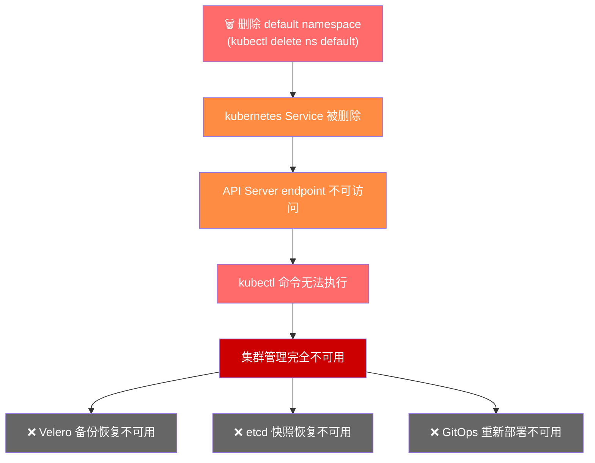
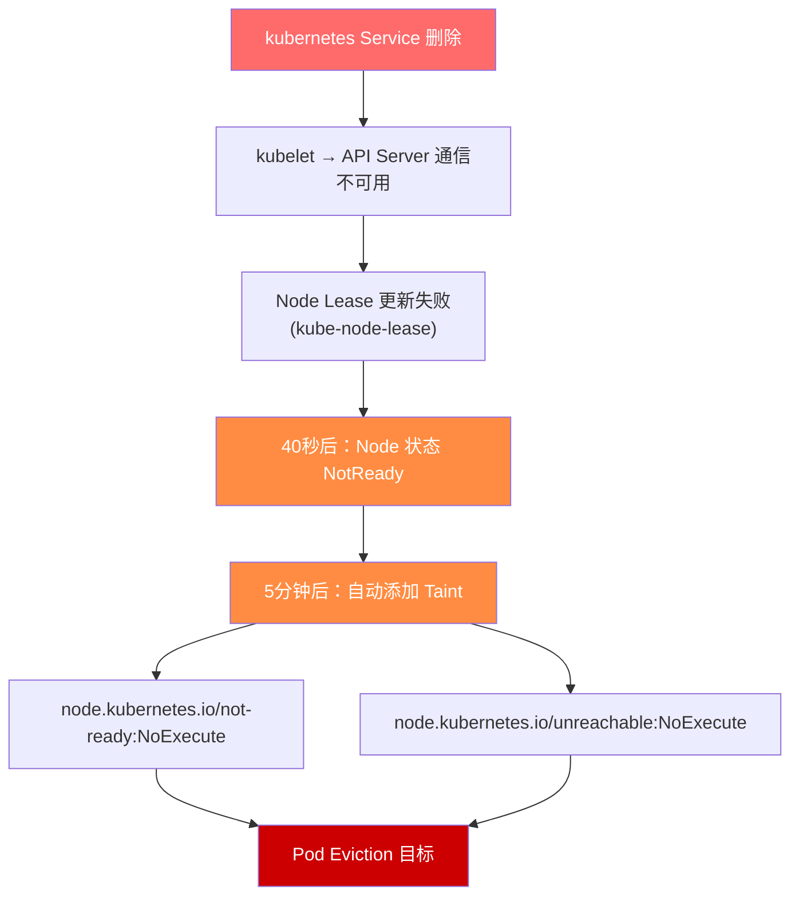

# EKS Default Namespace 删除故障应对指南

> 📅 **编写日期**: 2025-01-07 | **修改日期**: 2026-02-14 | ⏱️ **阅读时间**: 约 12 分钟


## 1. 概述（TL;DR）

:::danger 严重警告
在 EKS 集群中删除 default namespace 会阻断对 Control Plane 的所有访问。kubectl 命令将无法工作，Velero 或 etcd 备份也无法恢复。Default Namespace 是集群必须防止删除的核心资源。因此强烈建议使用 Admission Controller 或其他访问控制机制进行谨慎管理。
:::

- **故障原因**：删除 `default` namespace 时 `kubernetes` Service 会一并被删除
- **影响范围**：API Server 不可访问 → 集群整体管理不可用 → （长期化时）引发服务故障
- **恢复方法**：**必须开启 AWS Support 案例**（Severity: Critical）

:::tip 一句话恢复方法
向 AWS Support 开启 Critical 案例，并将 Account Team 和 WWSO Specialist 添加为工单参考人以请求快速恢复。
:::

---

## 2. 故障原因分析

### 2.1 Default Namespace 的作用

`default` namespace 不仅仅是部署用户工作负载的默认空间。Kubernetes 集群的核心资源存在于此 namespace 中。

**default namespace 中包含的核心资源**：

:::warning 注意
kubernetes Service 是集群内部访问 API Server 的唯一路径。如果此 Service 被删除，所有 Kubernetes 组件都将无法与 Control Plane 通信。
:::

### 2.2 故障发生机制

删除 `default` namespace 时发生的连锁故障过程如下图所示。


```mermaid
flowchart TD
    A["🗑️ 删除 default namespace<br/>(kubectl delete ns default)"] --> B["kubernetes Service 被删除"]
    B --> C["API Server endpoint 不可访问"]
    C --> D["kubectl 命令无法执行"]
    D --> E["集群管理完全不可用"]

    E --> F["❌ Velero 备份恢复不可用"]
    E --> G["❌ etcd 快照恢复不可用"]
    E --> H["❌ GitOps 重新部署不可用"]

    style A fill:#ff6b6b,color:#fff
    style B fill:#ff8c42,color:#fff
    style C fill:#ff8c42,color:#fff
    style D fill:#ff6b6b,color:#fff
    style E fill:#cc0000,color:#fff
    style F fill:#666,color:#fff
    style G fill:#666,color:#fff
    style H fill:#666,color:#fff
```

**故障发生顺序**：

1. **执行 namespace 删除命令**：`kubectl delete namespace default`
2. **级联删除**：namespace 内所有资源一并被删除
3. **kubernetes Service 删除**：API Server endpoint 消失
4. **连接断开**：集群内部组件无法与 API Server 通信
5. **管理不可用状态**：任何 kubectl 命令都无法执行

### Worker 节点受到的影响

API Server endpoint 消失状态持续时，Worker 节点也会受到连锁影响。


```mermaid
flowchart TD
    A["kubernetes Service 删除"] --> B["kubelet → API Server 通信不可用"]
    B --> C["Node Lease 更新失败<br/>(kube-node-lease)"]
    C --> D["40秒后：Node 状态 NotReady"]
    D --> E["5分钟后：自动添加 Taint"]
    E --> F["node.kubernetes.io/not-ready:NoExecute"]
    E --> G["node.kubernetes.io/unreachable:NoExecute"]
    F --> H["Pod Eviction 目标"]
    G --> H

    style A fill:#ff6b6b,color:#fff
    style D fill:#ff8c42,color:#fff
    style E fill:#ff8c42,color:#fff
    style H fill:#cc0000,color:#fff
```

**随时间变化的节点状态**：

:::warning 重要
在此情况下，由于 Control Plane 本身不可访问，Node Controller 也实际上无法执行更新节点状态或添加 taint 的操作。结果整个集群进入"frozen"状态，现有运行中的 Pod 继续运行，但新的调度或状态变更不可能。
:::

### Frozen 状态下的服务影响

集群进入 frozen 状态后，**现有工作负载会继续运行一段时间**，但随着时间推移会对服务产生严重影响。

**立即受影响的部分**：

- ❌ 无法调度新 Pod
- ❌ 无法重启/重新部署 Pod
- ❌ 无法反映 ConfigMap、Secret 变更
- ❌ HPA（Horizontal Pod Autoscaler）无法扩缩

**随时间推移的服务影响**：

:::danger 特别危险的场景

- DNS 缓存过期或 TLS 证书过期时，因服务发现失败导致通信不可用
- Pod 被 OOMKilled 或 crash 时**无法重启**
- 节点故障时该节点的**所有工作负载丢失**
- ALB/NLB Target Group 无法更新导致**流量路由失败**

随着时间推移故障范围会扩大，因此**尽快联系 AWS Support** 非常重要。
:::

---

## 3. 故障应对流程

### Step 1：确认故障状况

怀疑因 `default` namespace 删除导致故障时，首先需要确认集群状态。

### 1-1. kubectl 访问测试

首先确认 kubectl 命令是否正常工作。

```bash
# 尝试查询集群信息
kubectl cluster-info

# 预期的错误消息
# Unable to connect to the server: dial tcp: lookup kubernetes on 10.100.0.10:53: no such host
# 或
# The connection to the server <cluster-endpoint> was refused
```

:::warning 注意
如果出现上述错误，说明 kubernetes Service 已被删除，无法访问 API Server。
:::

### 1-2. 通过 AWS CLI 确认集群状态

即使 kubectl 不工作，也可以通过 AWS CLI 确认 EKS 集群的状态。

```bash
# 确认集群状态
aws eks describe-cluster \
  --name <cluster-name> \
  --query 'cluster.{Name:name,Status:status,Endpoint:endpoint,Version:version}' \
  --output table

# 预期输出（集群本身为 ACTIVE 状态）
# -------------------------------------------------------------------
# |                        DescribeCluster                          |
# +----------+------------------------------------------------------+
# |  Name    |  my-eks-cluster                                      |
# |  Status  |  ACTIVE                                              |
# |  Endpoint|  https://XXXXX.gr7.ap-northeast-2.eks.amazonaws.com  |
# |  Version |  1.31                                                |
# +----------+------------------------------------------------------+
```

```bash
# 确认节点组状态
aws eks list-nodegroups --cluster-name <cluster-name>

aws eks describe-nodegroup \
  --cluster-name <cluster-name> \
  --nodegroup-name <nodegroup-name> \
  --query 'nodegroup.{Name:nodegroupName,Status:status,DesiredSize:scalingConfig.desiredSize}' \
  --output table
```

### 1-3. 故障判断标准

:::tip 核心要点
如果在 AWS 控制台或 CLI 中集群显示为 ACTIVE 状态，但 kubectl 命令完全不工作，应怀疑 default namespace 被删除。
:::

✅ **检查点**：确认上述症状后，立即进入 **Step 2：开启 AWS Support 案例**。

### Step 2：开启 AWS Support 案例

因 `default` namespace 删除导致的故障**只能通过 AWS Support 恢复**。请立即开启案例。

### 2-1. 案例开启信息

### 2-2. 案例正文模板

复制以下模板粘贴到案例正文中。

```text
[紧急] EKS 集群 default namespace 删除导致 Control Plane 不可访问

■ 集群信息
- Cluster Name: <集群名称>
- Region: <区域>
- Account ID: <AWS 账号 ID>
- Cluster Version: <Kubernetes 版本>

■ 故障状况
- 发生时间: <YYYY-MM-DD HH:MM KST>
- 症状: 删除 default namespace 后 kubectl 命令无法执行
- 影响范围: 集群整体管理不可用

■ 已确认事项
- 通过 AWS CLI 确认集群状态: ACTIVE
- kubectl cluster-info 执行结果: 连接失败
- kubectl get ns default 执行结果: 连接失败

■ 请求事项
请求恢复 default namespace 及 kubernetes Service。
这是生产环境，需要紧急恢复。

■ 联系方式
- 负责人: <姓名>
- 电话: <联系电话>
- 邮箱: <邮箱>
```

### 2-3. 在 AWS 控制台开启案例的方法

1. 访问 AWS Support Center
2. 点击 **Create case**
3. 选择 **Technical**
4. Service：选择 **Elastic Kubernetes Service (EKS)**
5. Category：选择 **Cluster Issue**
6. Severity：选择 **Critical - Business-critical system down**（仅 Enterprise Support 计划可用）
7. 将上述模板粘贴到正文中
8. 在 Contact options 中选择 **Phone**（更快响应）
9. 点击 **Submit**

:::warning 重要
开启案例后务必记录案例 ID。联系 Account Team 和 WWSO Specialist 时需要使用。
:::

### Step 3：联系 Account Team/WWSO Specialist

在开启 AWS Support 案例的同时，联系 Account Team 和 WWSO（Worldwide Specialist Organization）Specialist 以加速恢复。

### 3-1. 在工单中添加参考人

在 AWS Support 案例中添加 Account Team 和 WWSO Specialist 作为参考人。

1. 进入已开启案例的 **Correspondence** 部分
2. 点击 **Reply** 按钮
3. 添加以下内容请求参考

```text
CC 请求：
- AWS Account Team: <Account Manager 姓名/邮箱>
- WWSO EKS Specialist: <Specialist 姓名/邮箱（如果知道）>

这是需要紧急恢复的生产环境。
请求 Account Team 和 EKS Specialist 的支持。
```

### 3-2. 直接联系 Account Team

除 AWS Support 案例外，直接联系 Account Team。

**邮件模板**：

```text
主题: [紧急] EKS 集群故障 - Support Case #<案例 ID>

您好，

因生产 EKS 集群发生紧急故障，特此联系。

■ 故障摘要
- 集群: <集群名称>
- 症状: 因删除 default namespace 导致 Control Plane 不可访问
- Support Case ID: <案例 ID>

■ 请求事项
请求提升该案例的优先级并连接 EKS Specialist。

谢谢。
<姓名>
<联系方式>
```

**Slack/SMS 消息**（如果有 Account Team 频道）：

```text
🚨 [紧急] EKS 集群故障发生

- Account: <账号 ID>
- Cluster: <集群名称>
- Issue: 因删除 default namespace 导致 Control Plane 不可访问
- Support Case: #<案例 ID>

这是生产环境，请求紧急支持。
```

### 3-3. 联系 WWSO Specialist

如果知道 WWSO EKS Specialist，可以直接联系。Specialist 联系后会利用内部工单提升工单重要度，并通过内部管道直接向分配的工程师传达工作请求。

### 3-4. 联系检查清单

### Step 4：恢复后验证

通过 AWS Support 恢复 `default` namespace 后，验证集群是否正常工作。

### 4-1. 基本连接验证

```bash
# 1. 确认集群连接
kubectl cluster-info

# 预期输出：
# Kubernetes control plane is running at https://XXXXX.gr7.ap-northeast-2.eks.amazonaws.com
# CoreDNS is running at https://XXXXX.gr7.ap-northeast-2.eks.amazonaws.com/api/v1/namespaces/kube-system/services/kube-dns:dns/proxy
```

```bash
# 2. 确认 default namespace 存在
kubectl get namespace default

# 预期输出：
# NAME      STATUS   AGE
# default   Active   <时间>
```

```bash
# 3. 确认 kubernetes Service
kubectl get svc kubernetes -n default

# 预期输出：
# NAME         TYPE        CLUSTER-IP   EXTERNAL-IP   PORT(S)   AGE
# kubernetes   ClusterIP   10.100.0.1   <none>        443/TCP   <时间>
```

### 4-2. 核心组件状态验证

```bash
# 4. 确认节点状态
kubectl get nodes

# 确认所有节点是否为 Ready 状态
```

```bash
# 5. 确认系统 Pod 状态
kubectl get pods -n kube-system

# 确认所有 Pod 是否为 Running 状态
# 特别检查 coredns、kube-proxy、aws-node
```

```bash
# 6. 确认所有 namespace
kubectl get namespaces

# 确认 default、kube-system、kube-public、kube-node-lease 存在
```

### 4-3. API Server 功能验证

```bash
# 7. API 资源查询测试
kubectl api-resources | head -20

# 8. 简单的资源创建/删除测试（可选）
kubectl run test-pod --image=nginx --restart=Never -n default
kubectl get pod test-pod -n default
kubectl delete pod test-pod -n default
```

✅ **验证检查清单**：

### Step 5：工作负载检查

恢复后检查现有工作负载是否正常运行。

### 5-1. 工作负载状态检查

```bash
# 1. 确认所有 namespace 的 Pod 状态
kubectl get pods --all-namespaces | grep -v Running | grep -v Completed

# 确认非 Running、Completed 状态的 Pod
```

```bash
# 2. 确认 Deployment 状态
kubectl get deployments --all-namespaces

# 确认 READY 列中期望的 replica 数与实际数是否一致
```

```bash
# 3. 确认 StatefulSet 状态
kubectl get statefulsets --all-namespaces
```

```bash
# 4. 确认 DaemonSet 状态
kubectl get daemonsets --all-namespaces

# 确认 DESIRED 和 READY 数是否一致
```

### 5-2. 服务连接检查

```bash
# 5. 确认 Service 和 Endpoints
kubectl get svc --all-namespaces
kubectl get endpoints --all-namespaces

# 确认 Endpoints 是否正常分配了 IP
```

```bash
# 6. 确认 Ingress 状态（如果使用的话）
kubectl get ingress --all-namespaces
```

### 5-3. 存储检查

```bash
# 7. 确认 PersistentVolumeClaim 状态
kubectl get pvc --all-namespaces

# 确认所有 PVC 是否为 Bound 状态
```

```bash
# 8. 确认 PersistentVolume 状态
kubectl get pv

# 确认所有 PV 是否为 Bound 状态
```

### 5-4. 事件和日志确认

```bash
# 9. 确认最近的 Warning 事件
kubectl get events --all-namespaces --field-selector type=Warning --sort-by='.lastTimestamp' | tail -20
```

```bash
# 10. 确认有问题的 Pod 日志
kubectl logs <pod-name> -n <namespace> --tail=100
```

### 5-5. 工作负载检查清单

:::tip
在故障发生期间可能有失败的 Job 或 CronJob。如有需要请手动重新执行。
:::

```bash
# 确认失败的 Job
kubectl get jobs --all-namespaces --field-selector status.successful=0
```

✅ **最终检查点**：确认所有工作负载正常后，故障应对完成。之后请检查**再发防止对策**。

---

## 4. Critical 资源列表

### 4.1 Critical Namespaces

除 `default` namespace 外，还有删除时会对集群造成致命影响的系统 namespace。这些 namespace 绝对不能删除。

:::danger 严重警告
default 和 kube-system namespace 删除时 kubectl 访问本身就不可用，因此无法手动恢复。必须通过 AWS Support 恢复。
:::

**各 Namespace 的详细作用**：

**default**：

- `kubernetes` Service：集群内部访问 API Server 的 endpoint
- `default` ServiceAccount：namespace 中未指定 ServiceAccount 的 Pod 的默认认证主体

**kube-system**：

- 部署集群运维所必需的所有系统组件的 namespace
- EKS Add-on（CoreDNS、kube-proxy、VPC CNI）及控制器所在位置

**kube-public**：

- 存储未认证用户也可读取的公开信息
- `cluster-info` ConfigMap 包含集群 CA 证书和 API Server 地址

**kube-node-lease**：

- 存储各节点的 Lease 对象，执行 heartbeat 作用
- Node Controller 基于此信息判断节点状态

### 4.2 kube-system 核心组件

`kube-system` namespace 中部署了集群运维所必需的组件。单独删除或修改这些组件可能导致严重故障。

### EKS 核心 Add-on

### EKS 存储组件

### 网络及负载均衡组件

:::tip
由 EKS Add-on 管理的组件（CoreDNS、kube-proxy、VPC CNI、EBS CSI Driver）可以通过 AWS 控制台或 CLI 重新安装 Add-on 来恢复。
:::

```bash
# 确认 EKS Add-on 状态
aws eks list-addons --cluster-name <cluster-name>

# Add-on 重新安装示例（CoreDNS）
aws eks create-addon \
  --cluster-name <cluster-name> \
  --addon-name coredns \
  --resolve-conflicts OVERWRITE
```

:::warning 注意
上述恢复方法仅在 kube-system namespace 存在且 kubectl 访问可用时才能使用。如果 namespace 本身被删除，则需要 AWS Support。
:::

### 4.3 Cluster-Scoped 资源

不属于任何 Namespace 的 Cluster-Scoped 资源在删除或修改时也可能影响整个集群。

### RBAC 相关资源

:::warning 特别危险的 ClusterRole/ClusterRoleBinding

- `system:node` / `system:node` binding：删除时**所有节点无法与 API Server 通信**
- `system:kube-controller-manager`：删除时**Controller Manager 停止运行**
- `system:kube-scheduler`：删除时**Pod 调度停止**
:::

### CRD（Custom Resource Definition）

:::warning CRD 删除注意
删除 CRD 时，该 CRD 创建的所有 Custom Resource 将被级联删除。例如，删除 Cert-Manager 的 Certificate CRD 将删除集群中所有 Certificate 资源。
:::

### 存储相关资源

### 节点及网络相关资源

### EKS 特有资源

:::tip 最佳实践
在修改或删除 Cluster-Scoped 资源之前，请务必创建备份。
:::

```bash
# ClusterRole 备份示例
kubectl get clusterrole <role-name> -o yaml > clusterrole-backup.yaml

# 所有 ClusterRole 备份
kubectl get clusterroles -o yaml > all-clusterroles-backup.yaml

# CRD 备份（不含 CR）
kubectl get crd <crd-name> -o yaml > crd-backup.yaml
```

---

## 5. 再发防止方向

### 5.1 通过 Admission Controller 保护资源

利用 Kubernetes Admission Controller 可以预先阻止 Critical 资源的删除。这里介绍使用 Kyverno 的示例。

### 使用 Kyverno 防止 Critical Namespace 删除

```yaml
apiVersion: kyverno.io/v1
kind: ClusterPolicy
metadata:
  name: protect-critical-namespaces
spec:
  validationFailureAction: Enforce
  background: false
  rules:
    - name: block-critical-namespace-deletion
      match:
        any:
          - resources:
              kinds:
                - Namespace
              names:
                - default
                - kube-system
                - kube-public
                - kube-node-lease
      exclude:
        any:
          - clusterRoles:
              - cluster-admin
      validate:
        message: "Critical namespace '{{request.object.metadata.name}}' 的删除已被阻止。"
        deny:
          conditions:
            all:
              - key: "{{request.operation}}"
                operator: Equals
                value: DELETE
```

应用上述策略后，非 `cluster-admin` 角色的用户尝试删除 Critical Namespace 时请求将被拒绝。

### 其他 Admission Controller 选项

除 Kyverno 外，还可以使用各种 Admission Controller。

:::tip 推荐
根据团队的技术栈和策略复杂度进行选择。如果是简单的资源保护策略，Kyverno 可以快速应用。
:::

### 5.2 基于 GitOps 和 KRMOps 的运维

引入 GitOps 和 KRMOps（Kubernetes Resource Model Operations）运维方式，可以声明式管理集群资源，并从意外变更中快速恢复。

### EKS Auto Mode 的 ArgoCD Capability

EKS Auto Mode 默认提供 ArgoCD，可以轻松开始基于 GitOps 的运维。

```yaml
# ArgoCD Application 示例 - Critical 资源管理
apiVersion: argoproj.io/v1alpha1
kind: Application
metadata:
  name: cluster-critical-resources
  namespace: argocd
spec:
  project: default
  source:
    repoURL: https://github.com/your-org/k8s-manifests.git
    targetRevision: main
    path: cluster-critical
  destination:
    server: https://kubernetes.default.svc
    namespace: default
  syncPolicy:
    automated:
      prune: false      # 防止自动删除 Critical 资源
      selfHeal: true    # Drift 发生时自动恢复
    syncOptions:
      - CreateNamespace=false
```

**GitOps 的再发防止效果**：

:::tip
将 Critical Namespace 和资源分离为单独的 ArgoCD Application，设置 prune: false 和 selfHeal: true 进行保护。
:::

### 使用 ACK 和 KRO 的 KRMOps 策略

通过 **ACK（AWS Controllers for Kubernetes）** 和 **KRO（Kube Resource Orchestrator）**，可以用 Kubernetes Resource Model 管理 AWS 基础设施。

**通过 ACK 管理 AWS 资源**：

```yaml
# 使用 ACK 声明式管理 S3 Bucket 的示例
apiVersion: s3.services.k8s.aws/v1alpha1
kind: Bucket
metadata:
  name: my-app-bucket
  namespace: default
spec:
  name: my-app-bucket-12345
  tagging:
    tagSet:
      - key: Environment
        value: Production
```

**通过 KRO 编排复合资源**：

```yaml
# KRO ResourceGroup 示例 - 应用栈定义
apiVersion: kro.run/v1alpha1
kind: ResourceGroup
metadata:
  name: web-application
spec:
  schema:
    apiVersion: v1alpha1
    kind: WebApplication
    spec:
      name: string
      replicas: integer | default=2
  resources:
    - id: deployment
      template:
        apiVersion: apps/v1
        kind: Deployment
        metadata:
          name: ${schema.spec.name}
        spec:
          replicas: ${schema.spec.replicas}
          # ... 省略
    - id: service
      template:
        apiVersion: v1
        kind: Service
        # ... 省略
```

**KRMOps 的优势**：

:::tip 推荐
结合使用 ACK 和 KRO，不仅可以管理 EKS 集群，还可以用 Kubernetes 方式统一管理相关的 AWS 资源（VPC、IAM、RDS 等）。
:::

**参考资料**：

- AWS Controllers for Kubernetes (ACK)
- Kube Resource Orchestrator (KRO)
- EKS Auto Mode 文档

### 5.3 基于 EKS Access Entry 的访问控制

EKS Access Entry 克服了 `aws-auth` ConfigMap 的局限性，提供更安全的集群访问管理。

### aws-auth ConfigMap 的问题

现有的 `aws-auth` ConfigMap 方式存在以下风险：

:::warning 注意
如果 aws-auth ConfigMap 被删除或损坏，所有基于 IAM 的认证将失败，无法访问集群。这种情况也需要通过 AWS Support 恢复。
:::

### 转换到 EKS Access Entry

EKS Access Entry 通过 AWS API 管理集群访问，消除了 `aws-auth` ConfigMap 的风险。

**Access Entry 创建示例**：

```bash
# 创建管理员 Access Entry
aws eks create-access-entry \
  --cluster-name my-cluster \
  --principal-arn arn:aws:iam::XXXXXXXXXXXX:role/EKSAdminRole \
  --type STANDARD

# 关联集群管理员权限
aws eks associate-access-policy \
  --cluster-name my-cluster \
  --principal-arn arn:aws:iam::XXXXXXXXXXXX:role/EKSAdminRole \
  --policy-arn arn:aws:eks::aws:cluster-access-policy/AmazonEKSClusterAdminPolicy \
  --access-scope type=cluster
```

**Namespace 级别访问控制**：

```bash
# 设置只能访问特定 namespace 的开发者权限
aws eks create-access-entry \
  --cluster-name my-cluster \
  --principal-arn arn:aws:iam::XXXXXXXXXXXX:role/DevTeamRole \
  --type STANDARD

aws eks associate-access-policy \
  --cluster-name my-cluster \
  --principal-arn arn:aws:iam::XXXXXXXXXXXX:role/DevTeamRole \
  --policy-arn arn:aws:eks::aws:cluster-access-policy/AmazonEKSEditPolicy \
  --access-scope type=namespace,namespaces=dev,staging
```

**EKS Access Entry 的优势**：

**预定义的 Access Policy**：

:::tip 建议

1. **新集群**：从一开始只使用 EKS Access Entry（利用 `-bootstrap-cluster-creator-admin-permissions` 选项）
2. **现有集群**：渐进迁移到 Access Entry 后移除 `aws-auth` ConfigMap 依赖
3. **最小权限原则**：使用 namespace 范围权限代替集群全局权限
4. **紧急恢复账号**：在单独的 IAM Role 上通过 Access Entry 设置集群管理员权限，以防锁定
:::

**迁移检查清单**：

**参考资料**：

- EKS Cluster Access Management
- Migrating from aws-auth ConfigMap

---

## 6. 总结

### 6.1 核心内容摘要

:::danger 核心信息
default、kube-system namespace 删除时 kubectl 访问本身就不可用，因此无法手动恢复。只能通过 AWS Support 恢复。
:::

### 6.2 参考资料

### EKS 官方文档

- Amazon EKS Best Practices Guide
- EKS Cluster Access Management
- Migrating from aws-auth ConfigMap to Access Entries
- EKS Add-ons
- EKS Auto Mode

### Kubernetes 官方文档

- Kubernetes RBAC Authorization
- Kubernetes Namespaces
- Admission Controllers Reference

### Admission Controller 工具

- Kyverno - Kubernetes Native Policy Management
- OPA Gatekeeper - Policy Controller for Kubernetes

### GitOps 和 KRMOps 工具

- ArgoCD - Declarative GitOps CD for Kubernetes
- AWS Controllers for Kubernetes (ACK)
- Kube Resource Orchestrator (KRO)
