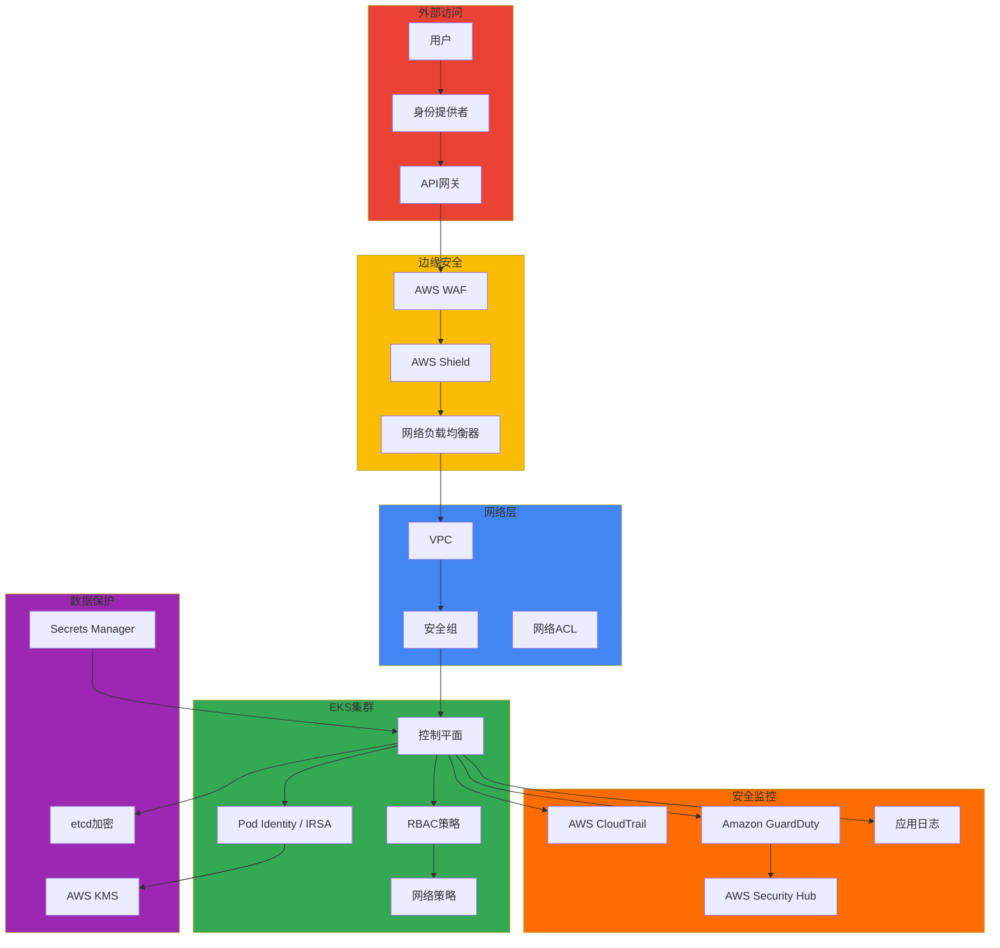

# 安全与治理

> 📅 **编写日期**: 2025-02-05 | ⏱️ **阅读时间**: 约3分钟

在现代云环境中，安全不仅仅是建立防火墙，还需要多层防御策略和持续的安全态势评估。Amazon EKS环境中的安全强化需要从集群级别的访问控制到网络隔离、数据加密和运行时安全监控的全面方法。本节涵盖基于纵深防御原则的安全架构设计和实施方法。

安全治理超越了技术控制，是将组织的政策、流程和合规要求内嵌到代码和基础设施中的过程。在包括金融业在内的受监管行业中，遵守PCI-DSS、SOC 2、ISO 27001等合规框架是必不可少的，这需要自动化的策略执行、持续的审计日志记录和实时威胁检测系统。在Kubernetes环境中，可以通过整合RBAC、Network Policy、Pod Security Standards等原生安全功能与AWS的IAM、KMS、GuardDuty等云原生服务来构建强大的安全态势。

事件响应能力是安全策略的核心要素。在完美防御不可能的前提下，在发生安全事件时具备快速检测、准确分析、有效隔离和系统化恢复流程非常重要。通过CloudTrail进行API审计日志、通过VPC Flow Logs进行网络流量分析、通过Falco等运行时安全工具进行异常行为检测是事件响应的基础。此外，通过事后分析识别根本原因并自动化预防措施，持续改进安全态势。

安全不是一次性设置就能完成的，而是需要持续评估和改进的领域。必须通过定期的漏洞扫描、基于CIS基准的安全评估和渗透测试来主动发现和修复安全漏洞。应用零信任原则，默认拒绝所有访问，只允许明确验证的请求，这是现代安全架构的基础。

## 主要文档

**运营安全和事件管理**

[1. Default Namespace事件响应](./default-namespace-incident.md) - 默认命名空间安全威胁分析、事件检测和响应程序、事后分析和改进方案、安全监控自动化

**身份和访问管理**

[2. 身份优先安全架构](./identity-first-security.md) - 基于EKS Pod Identity的零信任访问控制、从IRSA到Pod Identity的迁移、最小权限原则自动化

**威胁检测与响应**

[3. GuardDuty扩展威胁检测](./guardduty-extended-threat-detection.md) - EC2/ECS主机和容器信号相关分析、MITRE ATT&CK映射、自动化威胁响应

**策略管理**

[4. 基于Kyverno的策略管理](./kyverno-policy-management.md) - Kyverno v1.16 CEL基础策略、命名空间级别策略、策略异常管理、与OPA Gatekeeper比较

**供应链安全**

[5. 容器供应链安全](./supply-chain-security.md) - ECR镜像扫描和签名、Sigstore/Cosign集成、SBOM生成和管理、CI/CD安全网关

## 架构模式

## 安全领域

安全架构由集群级别、工作负载级别和数据级别三个层次组成。集群安全以身份验证和权限管理为中心，通过AWS IAM和Kubernetes RBAC的集成来实现。利用IRSA（IAM Roles for Service Accounts），可以在Pod级别授予细粒度的AWS资源访问权限，并通过应用最小权限原则来最小化攻击面。通过与OIDC提供者集成，可以与企业现有的SSO系统连接，并通过应用MFA来加强用户身份验证安全。

:::info EKS Pod Identity（2025推荐）
EKS Pod Identity是IRSA的进化形式，提供更简单的设置和增强的安全性。无需OIDC提供者设置即可直接将IAM角色绑定到Pod，并简化了跨账户访问。对于新项目，请优先考虑Pod Identity。
:::

网络安全是多层防御的核心要素，通过Kubernetes Network Policy控制Pod间通信并实现命名空间间隔离。引入服务网格（Istio、Linkerd）可以自动配置mTLS，加密所有服务间通信并自动化证书管理。在VPC级别，分离公共子网和私有子网，通过NAT网关控制出站流量，并通过VPC Flow Logs持续监控网络流量。

工作负载安全通过Pod Security Standards加强容器执行环境的安全。应用Restricted级别可以阻止root权限执行、限制主机网络访问并删除危险的Capabilities。通过Security Context设置强制只读文件系统并最小化执行权限。容器镜像使用Trivy等工具在CI/CD管道中扫描，提前阻止漏洞，并执行策略只使用来自批准注册表的签名镜像。

密钥管理通过AWS Secrets Manager和External Secrets Operator集成进行集中管理。不直接将密钥存储为Kubernetes Secret，而是保存在外部密钥存储中，通过自动轮换和定期同步最小化密钥暴露风险。利用KMS的信封加密保护数据加密密钥，并应用密钥轮换策略管理长期密钥暴露风险。

数据安全包括对静态数据和传输数据的加密。EBS卷通过基于KMS的加密在块级别受到保护，etcd与AWS KMS集成透明地加密Kubernetes配置数据库。在应用程序级别，实现对敏感数据的端到端加密，提供多层保护。传输数据通过TLS/mTLS加密，API服务器受TLS保护，通过服务网格自动应用Pod间通信的mTLS。在入口级别强制HTTPS，并通过Let's Encrypt和Cert Manager自动更新证书。

## 合规框架

合规遵守需要技术实施和组织流程的集成。SOC 2涵盖数据安全、可用性和处理完整性，在EKS环境中通过高可用架构、数据加密和访问控制来实现。PCI-DSS是处理支付卡数据的必要标准，需要网络隔离、数据加密、访问控制和定期安全评估。HIPAA是医疗信息保护的法规，数据加密和审计日志记录是核心。GDPR要求数据最小化、用户权利保障和数据处理透明度以保护个人信息，ISO 27001提供信息安全管理系统的整体框架。

在EKS环境中，合规要求映射到技术控制。访问控制要求通过AWS IAM和Kubernetes RBAC的组合实现，加密要求通过TLS/mTLS和AWS KMS满足。审计要求通过CloudTrail的API调用日志记录和应用程序日志收集来实现，监控要求通过GuardDuty和Security Hub的实时威胁检测来满足。策略执行通过OPA Gatekeeper在准入控制阶段自动化，提前阻止策略违规。

合规工具实现自动化评估和持续监控。AWS Config持续监控资源配置并检测策略违规，Security Hub整合多个安全服务的结果提供中央仪表板。GuardDuty通过基于机器学习的威胁检测识别异常行为，CloudTrail记录所有API调用提供审计跟踪。Inspector评估EC2实例和容器镜像的漏洞并提供安全建议。

## 安全工具和技术

开源安全工具是加强Kubernetes环境安全的核心要素。Falco在系统调用级别监控运行时安全，实时检测异常行为。检测意外的进程执行、敏感文件访问、网络连接尝试等并发出警报。OPA Gatekeeper提供基于策略的控制，作为准入webhook运行，在Pod创建时验证安全策略，违规时阻止部署。Trivy扫描容器镜像和文件系统以检测已知漏洞，集成到CI/CD管道中防止易受攻击的镜像部署到生产环境。Kube-bench根据CIS Kubernetes基准评估集群安全设置并提供建议，kube-hunter对集群执行渗透测试以发现潜在的安全漏洞。

AWS原生安全服务提供针对云环境优化的安全功能。AWS WAF作为Web应用程序防火墙阻止SQL注入、XSS等常见Web攻击，并通过自定义规则实现特定于应用程序的安全策略。AWS Shield为所有AWS服务自动提供基本DDoS保护，Shield Advanced提供针对大规模DDoS攻击的高级保护和24/7 DDoS响应团队支持。Amazon Inspector持续评估EC2实例和容器镜像的漏洞，并提供基于CVE的安全建议，AWS Systems Manager自动化操作系统和应用程序补丁以快速解决漏洞。

## 安全监控和响应

实时安全监控是早期检测威胁并快速响应的必要要素。安全事件日志从CloudTrail、VPC Flow Logs、应用程序日志、容器日志等多个来源收集并整合到集中日志存储中。异常行为检测通过基于机器学习的分析和基于规则的警报实现，GuardDuty自动检测异常的API调用模式、可疑的网络活动和受损的实例行为。自动化安全响应工作流通过EventBridge和Lambda实现，在发生特定安全事件时自动执行隔离、通知和恢复操作。

事件响应流程通过系统化和可重复的程序最小化安全事件的影响。在检测阶段，安全监控工具自动识别异常迹象并发出警报。在分析阶段，安全团队评估事件的严重性、影响范围和攻击向量，并确定响应优先级。在隔离阶段，将受影响的资源从网络中分离并防止进一步的损害扩散。在恢复阶段，将受损系统恢复到正常状态并恢复服务。在事后分析阶段，识别根本原因并重建攻击路径，在改进阶段，基于吸取的教训加强安全策略和技术控制以防止再次发生。

取证分析是理解安全事件的完整背景并收集证据的过程。通过CloudTrail日志分析跟踪攻击者的API调用模式和权限提升尝试，通过审查VPC Flow Logs识别异常网络流量和数据泄露尝试。收集容器日志分析应用程序级别的攻击痕迹，通过网络流量分析检测与C&C服务器的通信或内部侦察活动。这些取证数据可以在需要法律响应时用作证据，并提供改进安全态势的见解。

## 2025安全路线图

### 最新安全功能（AWS re:Invent 2025）

| 功能 | 状态 | 影响 |
|------|------|------|
| GuardDuty扩展威胁检测 | GA | 增强容器威胁检测 |
| IAM Policy Autopilot | 预览 | 基于代码的最小权限策略生成 |
| EKS Pod Identity | GA | IRSA替代/补充 |
| Security Hub Analytics | GA | 实时风险量化 |
| ECR增强扫描 | GA | 加强供应链安全 |

### Kyverno v1.16主要更新

- **基于CEL的策略（Beta）**：使用Common Expression Language代替Rego
- **命名空间CEL策略**：团队自主策略管理
- **精细的策略异常**：细粒度异常处理
- **增强的可观察性**：策略应用指标和仪表板

## 相关类别

[混合基础设施](/docs/hybrid-infrastructure) - 混合环境安全

[运营与可观察性](/docs/operations-observability) - 安全监控

[基础设施优化](/docs/infrastructure-optimization) - 网络安全