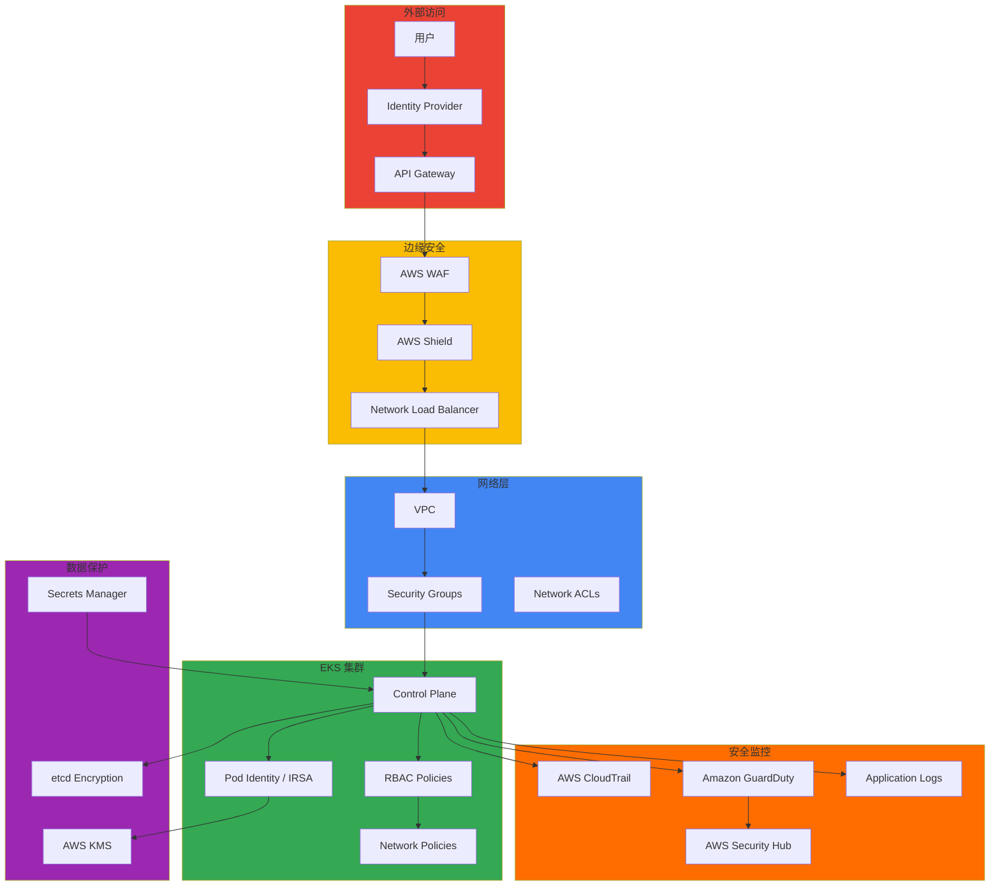

# Security & Governance

> 📅 **编写日期**: 2025-02-05 | **修改日期**: 2026-02-13 | ⏱️ **阅读时间**: 约 10 分钟

在现代云环境中，安全不仅仅是构建简单的防御壁垒，还需要多层防御战略和持续的安全态势评估。在 Amazon EKS 环境中强化安全，需要从集群级别的访问控制到网络隔离、数据加密、运行时安全监控等全面的方法。本节介绍基于纵深防御（Defense in Depth）原则的安全架构设计与实现方法。

安全治理不仅限于技术控制，还涉及将组织的策略、流程和合规要求内化到代码和基础设施中的过程。在金融等受监管行业中，遵从 PCI-DSS、SOC 2、ISO 27001 等合规框架是必需的，为此需要建立自动化策略执行、持续审计日志记录和实时威胁检测体系。在 Kubernetes 环境中，可以通过整合 RBAC、Network Policy、Pod Security Standards 等原生安全功能与 AWS 的 IAM、KMS、GuardDuty 等云原生服务来构建强大的安全态势。

事件响应能力是安全战略的核心要素。在"完美防御不可能"的前提下，重要的是在安全事件发生时具备快速检测、准确分析、有效隔离和系统化恢复流程。通过 CloudTrail 的 API 审计日志、VPC Flow Logs 的网络流量分析、Falco 等运行时安全工具的异常行为检测，构成事件响应的基础。此外，通过事后分析确定根本原因并自动化预防措施，持续改进安全态势。

安全不是一次性配置就能完成的，而是需要持续评估和改进的领域。需要通过定期漏洞扫描、基于 CIS 基准的安全评估和渗透测试，主动发现和修补安全漏洞。应用 Zero Trust 原则，默认拒绝所有访问，只允许经过明确验证的请求，这是现代安全架构的基本原则。

## 主要文档

**运维安全与事件管理**

[1. Default Namespace 事件响应](./default-namespace-incident.md) - 默认命名空间安全威胁分析、事件检测与响应流程、事后分析与改进方案、安全监控自动化

**Identity & Access Management**

[2. Identity-First Security 架构](./identity-first-security.md) - 基于 EKS Pod Identity 的零信任访问控制、从 IRSA 迁移到 Pod Identity、最小权限原则自动化

**威胁检测与响应**

[3. GuardDuty Extended Threat Detection](./guardduty-extended-threat-detection.md) - EC2/ECS 主机和容器信号关联分析、MITRE ATT&CK 映射、自动化威胁响应

**策略管理**

[4. 基于 Kyverno 的策略管理](./kyverno-policy-management.md) - Kyverno v1.16 CEL 策略、命名空间级策略、策略异常管理、OPA Gatekeeper 比较

**供应链安全**

[5. 容器供应链安全](./supply-chain-security.md) - ECR 镜像扫描与签名、Sigstore/Cosign 集成、SBOM 生成与管理、CI/CD 安全门禁

## 架构模式

```mermaid
graph TB
    subgraph External["外部访问"]
        Users["用户"]
        IdP["Identity Provider"]
        API["API Gateway"]
    end
    
    subgraph EdgeSecurity["边缘安全"]
        WAF["AWS WAF"]
        Shield["AWS Shield"]
        NLB["Network Load Balancer"]
    end
    
    subgraph Network["网络层"]
        VPC["VPC"]
        SG["Security Groups"]
        NACL["Network ACLs"]
    end
    
    subgraph EKS["EKS 集群"]
        CP["Control Plane"]
        RBAC["RBAC Policies"]
        NetworkPolicy["Network Policies"]
        IRSA["Pod Identity / IRSA"]
    end
    
    subgraph DataProtection["数据保护"]
        KMS["AWS KMS"]
        Secrets["Secrets Manager"]
        Encryption["etcd Encryption"]
    end
    
    subgraph Monitoring["安全监控"]
        CloudTrail["AWS CloudTrail"]
        GuardDuty["Amazon GuardDuty"]
        SecurityHub["AWS Security Hub"]
        Logs["Application Logs"]
    end
    
    Users --> IdP
    IdP --> API
    API --> WAF
    WAF --> Shield
    Shield --> NLB
    NLB --> VPC
    VPC --> SG
    SG --> CP
    CP --> RBAC
    RBAC --> NetworkPolicy
    CP --> IRSA
    IRSA --> KMS
    Secrets --> CP
    CP --> Encryption
    CP --> CloudTrail
    CP --> GuardDuty
    GuardDuty --> SecurityHub
    CP --> Logs
    
    style External fill:#ea4335
    style EdgeSecurity fill:#fbbc04
    style Network fill:#4286f4
    style EKS fill:#34a853
    style DataProtection fill:#9c27b0
    style Monitoring fill:#ff6d00
```

## 安全领域

安全架构由集群级、工作负载级和数据级三个层次组成。集群安全以认证和权限管理为核心，通过 AWS IAM 和 Kubernetes RBAC 的集成来实现。利用 IRSA（IAM Roles for Service Accounts）可以在 Pod 级别授予细粒度的 AWS 资源访问权限，应用最小权限原则以最小化攻击面。通过 OIDC Provider 集成与企业现有 SSO 系统对接并应用 MFA，可以增强用户认证安全。

:::info EKS Pod Identity（2025 推荐）
EKS Pod Identity 是 IRSA 的演进形态，提供更简单的配置和增强的安全性。无需配置 OIDC Provider 即可直接将 IAM 角色绑定到 Pod，跨账号访问也得到简化。新项目应优先考虑 Pod Identity。
:::

网络安全是多层防御的核心要素，通过 Kubernetes Network Policy 控制 Pod 间通信并实现命名空间间隔离。引入服务网格（Istio、Linkerd）可以自动配置 mTLS，加密所有服务间通信并自动化证书管理。在 VPC 层面，将公有子网和私有子网分离，通过 NAT Gateway 控制出站流量，并通过 VPC Flow Logs 持续监控网络流量。

工作负载安全通过 Pod Security Standards 强化容器执行环境的安全。应用 Restricted 级别可以阻止 root 权限执行、限制主机网络访问并移除危险的 Capabilities。通过 Security Context 设置强制只读文件系统并最小化执行权限。容器镜像通过 Trivy 等工具在 CI/CD 流水线中扫描以预先阻止漏洞，并执行策略确保仅使用来自批准的注册表的签名镜像。

密钥管理通过集成 AWS Secrets Manager 和 External Secrets Operator 进行集中管理。不直接将密钥存储为 Kubernetes Secret，而是保管在外部密钥存储中，通过自动轮换和定期同步最小化密钥泄露风险。利用 KMS 的信封加密保护数据加密密钥，并应用密钥轮换策略管理长期密钥泄露风险。

数据安全包括对静态数据和传输中数据的加密。EBS 卷通过基于 KMS 的加密在块级别得到保护，etcd 与 AWS KMS 集成透明地加密 Kubernetes 配置数据库。在应用层面，对敏感数据实现端到端加密以提供多层保护。传输中的数据通过 TLS/mTLS 加密，API 服务器由 TLS 保护，通过服务网格自动对 Pod 间通信应用 mTLS。在入口层面强制 HTTPS，并通过 Let's Encrypt 和 Cert Manager 自动更新证书。

## 合规框架

合规遵从需要技术实现和组织流程的整合。SOC 2 涵盖数据安全、可用性和处理完整性，在 EKS 环境中通过高可用架构、数据加密和访问控制来实现。PCI-DSS 是处理支付卡数据的必要标准，要求网络隔离、数据加密、访问控制和定期安全评估。HIPAA 是保护医疗信息的法规，数据加密和审计日志记录是核心。GDPR 要求数据最小化、保障用户权利和数据处理透明度，ISO 27001 提供信息安全管理系统的总体框架。

在 EKS 环境中，合规要求映射到技术控制。访问控制要求通过 AWS IAM 和 Kubernetes RBAC 的组合来实现，加密要求通过 TLS/mTLS 和 AWS KMS 满足。审计要求通过 CloudTrail 的 API 调用日志和应用日志收集来实现，监控要求通过 GuardDuty 和 Security Hub 的实时威胁检测来满足。策略执行通过 OPA Gatekeeper 在准入控制阶段自动化，预先阻止策略违规。

合规工具使自动化评估和持续监控成为可能。AWS Config 持续监控资源配置并检测策略违规，Security Hub 整合多个安全服务的结果提供中央仪表板。GuardDuty 通过基于机器学习的威胁检测识别异常行为，CloudTrail 记录所有 API 调用提供审计追踪。Inspector 评估 EC2 实例和容器镜像的漏洞并提供安全建议。

## 安全工具与技术

开源安全工具是增强 Kubernetes 环境安全的核心要素。Falco 在系统调用级别监控运行时安全，实时检测异常行为。检测意外进程执行、敏感文件访问、网络连接尝试等并生成告警。OPA Gatekeeper 提供基于策略的控制，作为准入 webhook 运行，在 Pod 创建时验证安全策略并在违规时阻止部署。Trivy 扫描容器镜像和文件系统以检测已知漏洞，集成到 CI/CD 流水线中防止脆弱镜像部署到生产环境。kube-bench 基于 CIS Kubernetes 基准评估集群安全设置并提供建议，kube-hunter 对集群进行渗透测试以发现潜在安全漏洞。

AWS 原生安全服务提供针对云环境优化的安全功能。AWS WAF 是 Web 应用防火墙，阻止 SQL 注入、XSS 等常见 Web 攻击，并通过自定义规则实现应用特定的安全策略。AWS Shield 为所有 AWS 服务自动提供基本 DDoS 保护，Shield Advanced 提供对大规模 DDoS 攻击的高级保护和 24/7 DDoS 响应团队支持。Amazon Inspector 持续评估 EC2 实例和容器镜像的漏洞并提供基于 CVE 的安全建议，AWS Systems Manager 自动化操作系统和应用补丁以快速解决漏洞。

## 安全监控与响应

实时安全监控是早期检测威胁和快速响应的必要要素。安全事件日志从 CloudTrail、VPC Flow Logs、应用日志、容器日志等多个来源收集并整合到集中式日志存储。异常行为检测通过基于机器学习的分析和基于规则的告警来实现，GuardDuty 自动检测异常 API 调用模式、可疑网络活动和受损实例行为。自动化安全响应工作流通过 EventBridge 和 Lambda 实现，在特定安全事件发生时自动执行隔离、告警和恢复操作。

事件响应流程通过系统化和可重复的程序最小化安全事件的影响。在检测阶段，安全监控工具自动识别异常征兆并生成告警。在分析阶段，安全团队评估事件的严重性、影响范围和攻击向量，确定响应优先级。在隔离阶段，将受影响的资源从网络中分离，防止进一步扩散。在恢复阶段，将受损系统恢复到正常状态并恢复服务。在事后分析阶段，确定根本原因并重建攻击路径，在改进阶段，基于所学教训强化安全策略和技术控制以防止复发。

取证分析是理解安全事件的完整背景和收集证据的过程。通过 CloudTrail 日志分析追踪攻击者的 API 调用模式和权限提升尝试，审查 VPC Flow Logs 以识别异常网络流量和数据泄露尝试。收集容器日志分析应用级别的攻击痕迹，通过网络流量分析检测与 C&C 服务器的通信或内部侦察活动。这些取证数据在需要法律应对时可作为证据使用，并为改进安全态势提供洞察。

## 安全路线图 2025

### 最新安全功能（AWS re:Invent 2025）

| 功能 | 状态 | 影响度 |
|------|------|--------|
| GuardDuty Extended Threat Detection | GA | 增强容器威胁检测 |
| IAM Policy Autopilot | Preview | 基于代码的最小权限策略生成 |
| EKS Pod Identity | GA | 替代/补充 IRSA |
| Security Hub Analytics | GA | 实时风险量化 |
| ECR Enhanced Scanning | GA | 增强供应链安全 |

### Kyverno v1.16 主要更新

- **基于 CEL 的策略（Beta）**：使用 Common Expression Language 替代 Rego
- **命名空间 CEL 策略**：团队自主策略管理
- **精确策略异常**：细粒度异常处理
- **增强可观测性**：策略应用指标和仪表板

## 相关分类

[Hybrid Infrastructure](/docs/hybrid-infrastructure) - 混合环境安全

[EKS Best Practices](/docs/eks-best-practices) - 安全监控与网络安全
