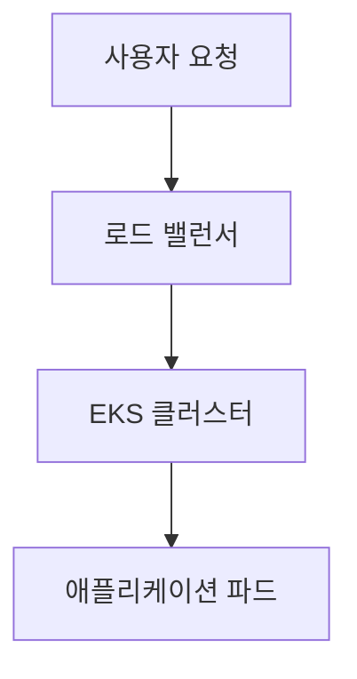

# EKS Engineering Playbook 문서 작성 가이드라인

이 가이드라인은 EKS Engineering Playbook의 모든 기여자가 일관성 있고 고품질의 문서를 작성할 수 있도록 돕습니다.

## 문서 구조

### 기본 구조

모든 기술 문서는 다음 구조를 따라야 합니다:

1. **Frontmatter** - 메타데이터
2. **개요** - 문서의 목적과 범위
3. **목표** - 학습 목표 체크리스트
4. **사전 요구사항** - 필요한 지식과 도구
5. **아키텍처 개요** - 시스템 구조 설명
6. **단계별 구현 가이드** - 실습 중심의 구현 방법
7. **모니터링 및 검증** - 구현 결과 확인 방법
8. **문제 해결** - 일반적인 문제와 해결책
9. **모범 사례** - 권장사항과 주의사항
10. **참고 자료** - 추가 학습 자료

### 섹션별 작성 가이드

#### 개요 섹션
- 문서의 목적을 명확히 설명
- 독자가 얻을 수 있는 가치 제시
- 2-3 문단으로 간결하게 작성

#### 목표 섹션
- 체크박스 형태로 학습 목표 나열
- 구체적이고 측정 가능한 목표 설정
- 3-5개의 목표 권장

#### 단계별 구현 가이드
- 번호가 있는 단계별 구성
- 각 단계마다 명확한 제목
- 코드 예제와 설명을 균형있게 배치

## 작성 스타일

### 톤앤매너

- **전문적이면서 친근한 톤** 사용
- **존댓말** 사용 (한국어 문서)
- **기술적 정확성**을 최우선으로 함
- **실무 중심**의 접근 방식

### 언어 사용

#### 한국어 문서
- 표준 한국어 사용
- 전문 용어는 영어 병기 (예: 컨테이너(Container))
- 존댓말 사용 ("~합니다", "~하세요")

#### 영어 문서
- 미국식 영어 사용
- 기술 문서 표준 스타일 준수
- 능동태 우선 사용

### 코드 스타일

#### YAML 파일
```yaml
# 주석은 한국어로 작성
apiVersion: v1
kind: ConfigMap
metadata:
  name: example-config
  namespace: default
data:
  key: "value"
```

#### Bash 명령어
```bash
# 설명 주석
kubectl apply -f config.yaml

# 결과 확인
kubectl get pods -n namespace
```

#### 다이어그램
- Mermaid 문법 사용
- 한국어 라벨 사용
- 색상은 일관성 있게 적용



## 콘텐츠 가이드라인

### 기술적 정확성

1. **검증된 정보만 포함**
   - 실제 테스트된 설정과 명령어
   - 최신 버전 정보 확인
   - 공식 문서 참조

2. **버전 명시**
   - Kubernetes 버전
   - EKS 버전
   - 도구 버전

3. **환경 정보 제공**
   - 테스트 환경 명시
   - 필요한 권한 설명
   - 비용 정보 (해당시)

### 사용자 경험

1. **단계별 접근**
   - 복잡한 내용을 작은 단위로 분할
   - 각 단계의 완료 기준 제시
   - 중간 검증 포인트 제공

2. **실습 중심**
   - 이론보다 실습 우선
   - 복사-붙여넣기 가능한 코드
   - 예상 결과 제시

3. **문제 해결 지원**
   - 일반적인 오류 상황 다루기
   - 디버깅 방법 제시
   - 추가 도움말 링크 제공

## 미디어 가이드라인

### 이미지

1. **파일 형식**
   - 스크린샷: PNG
   - 다이어그램: SVG 또는 PNG
   - 사진: WebP 권장

2. **파일 명명**
   - 영어 소문자 사용
   - 하이픈으로 단어 구분
   - 의미있는 이름 사용
   - 예: `eks-cluster-architecture.png`

3. **파일 위치**
   - `/static/img/docs/[category]/` 하위에 저장
   - 블로그 이미지: `/static/img/blog/`

4. **이미지 최적화**
   - 적절한 해상도 (최대 1920px 너비)
   - 파일 크기 최소화
   - Alt 텍스트 필수 포함

### 다이어그램

1. **Mermaid 사용**
   - 코드로 관리 가능한 다이어그램
   - 버전 관리 용이
   - 일관된 스타일 적용

2. **다이어그램 타입**
   - 플로우차트: 프로세스 설명
   - 시퀀스 다이어그램: 상호작용 설명
   - 클래스 다이어그램: 구조 설명

## 메타데이터 작성

### 태그 선정

1. **필수 태그**
   - `eks`: 모든 EKS 관련 문서
   - `kubernetes`: 모든 Kubernetes 관련 문서

2. **카테고리 태그**
   - 해당 기술 도메인 태그 포함
   - 구체적인 기술 스택 태그

3. **태그 개수**
   - 최소 2개, 최대 5개 권장
   - 너무 많은 태그는 검색 효율성 저하

### 설명 작성

1. **길이**: 120-150자 권장
2. **내용**: 문서의 핵심 가치 제시
3. **키워드**: 검색 최적화 고려

## 품질 체크리스트

### 작성 완료 전 확인사항

- [ ] 메타데이터 스키마 준수
- [ ] 모든 코드 예제 테스트 완료
- [ ] 이미지 alt 텍스트 작성
- [ ] 내부 링크 정상 작동 확인
- [ ] 외부 링크 유효성 확인
- [ ] 맞춤법 및 문법 검토
- [ ] 목차 구조 적절성 확인

### 리뷰 기준

1. **기술적 정확성**
   - 명령어 실행 가능성
   - 설정 파일 유효성
   - 버전 호환성

2. **문서 구조**
   - 논리적 흐름
   - 적절한 섹션 분할
   - 일관된 스타일

3. **사용자 경험**
   - 이해하기 쉬운 설명
   - 실습 가능성
   - 문제 해결 지원

## 협업 가이드라인

### Git 워크플로우

1. **브랜치 명명**
   - `docs/[category]/[topic]`
   - 예: `docs/performance/dns-optimization`

2. **커밋 메시지**
   - 한국어 사용
   - 명확한 변경 내용 설명
   - 예: "docs: EKS DNS 최적화 가이드 추가"

3. **Pull Request**
   - 템플릿 사용
   - 변경 사항 요약
   - 리뷰어 지정

### 리뷰 프로세스

1. **자동 검사**
   - 링크 체크
   - 메타데이터 검증
   - 빌드 테스트

2. **수동 리뷰**
   - 기술적 정확성
   - 문서 품질
   - 스타일 일관성

## 도구 및 리소스

### 권장 도구

1. **에디터**
   - VS Code + Markdown 확장
   - 실시간 미리보기 기능

2. **이미지 편집**
   - 스크린샷: Snagit, LightShot
   - 다이어그램: Draw.io, Lucidchart

3. **검증 도구**
   - 맞춤법: Grammarly (영어)
   - 링크 체크: markdown-link-check

### 참고 자료

- [Docusaurus 공식 문서](https://docusaurus.io/)
- [Markdown 가이드](https://www.markdownguide.org/)
- [Mermaid 문법](https://mermaid-js.github.io/mermaid/)
- [AWS 문서 스타일 가이드](https://docs.aws.amazon.com/styleguide/)

---

이 가이드라인은 지속적으로 업데이트됩니다. 개선 제안이나 질문이 있으시면 GitHub Issues를 통해 알려주세요.