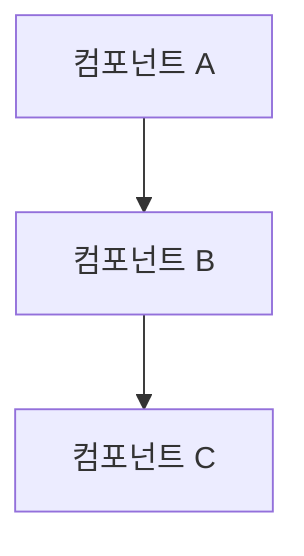

# [문서 제목]

## 개요

[문서의 목적과 다룰 내용에 대한 간단한 소개]

## 목표

이 문서를 통해 다음을 학습할 수 있습니다:

- [ ] [학습 목표 1]
- [ ] [학습 목표 2]
- [ ] [학습 목표 3]

## 사전 요구사항

- [필요한 도구나 지식 1]
- [필요한 도구나 지식 2]

## 아키텍처 개요

[시스템 아키텍처에 대한 설명]



## 단계별 구현 가이드

### 1단계: [단계 제목]

[단계에 대한 설명]

```yaml
# 설정 예제
apiVersion: v1
kind: ConfigMap
metadata:
  name: example-config
data:
  key: value
```

### 2단계: [단계 제목]

[단계에 대한 설명]

```bash
# 실행 명령어 예제
kubectl apply -f config.yaml
```

## 모니터링 및 검증

### 상태 확인

```bash
# 상태 확인 명령어
kubectl get pods -n namespace
```

### 메트릭 모니터링

[모니터링 방법 설명]

## 문제 해결

### 일반적인 문제들

#### 문제 1: [문제 설명]

**증상:**
- [증상 설명]

**원인:**
- [원인 분석]

**해결 방법:**
```bash
# 해결 명령어
kubectl logs pod-name
```

## 모범 사례

- ✅ [권장사항 1]
- ✅ [권장사항 2]
- ❌ [피해야 할 사항 1]
- ❌ [피해야 할 사항 2]

## 성능 최적화

[성능 최적화 팁과 권장사항]

## 보안 고려사항

[보안 관련 주의사항과 권장사항]

## 참고 자료

- [공식 문서 링크]
- [관련 블로그 포스트]
- [GitHub 리포지토리]

## 다음 단계

이 문서를 완료한 후 다음 문서들을 참고하세요:

- [관련 문서 1](../path/to/doc1.md)
- [관련 문서 2](../path/to/doc2.md)

---

**마지막 업데이트:** [날짜]  
**검토자:** [검토자 이름]  
**버전:** 1.0