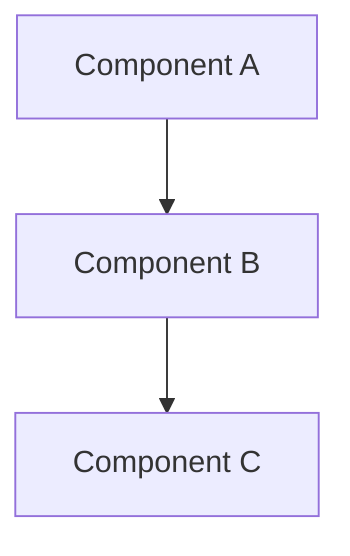

# 문서 제목

## 개요

이 문서에서 다룰 내용에 대한 간단한 소개를 작성합니다.

## 전제 조건

이 가이드를 따르기 전에 필요한 사항들:

- [ ] EKS 클러스터가 구성되어 있어야 합니다
- [ ] kubectl이 설치되어 있어야 합니다
- [ ] 기타 필요한 도구나 권한

## 아키텍처 개요



시스템 아키텍처에 대한 설명을 여기에 작성합니다.

## 구현 단계

### 1단계: 초기 설정

구체적인 구현 단계를 설명합니다.

```yaml
# 설정 예제
apiVersion: v1
kind: ConfigMap
metadata:
  name: example-config
data:
  key: value
```

### 2단계: 구성 및 배포

다음 단계에 대한 설명을 작성합니다.

```bash
# 실행 명령어 예제
kubectl apply -f config.yaml
```

## 검증 및 테스트

구현이 올바르게 되었는지 확인하는 방법:

```bash
# 상태 확인 명령어
kubectl get pods -n namespace
```

## 모니터링 및 관찰성

시스템 모니터링 방법과 주요 메트릭:

- **메트릭 1**: 설명
- **메트릭 2**: 설명
- **로그 위치**: `/var/log/example`

## 문제 해결

### 일반적인 문제들

**문제**: 설명
**해결책**: 해결 방법

**문제**: 설명  
**해결책**: 해결 방법

## 성능 최적화

성능 향상을 위한 권장사항:

1. **최적화 방법 1**: 설명
2. **최적화 방법 2**: 설명

## 보안 고려사항

보안과 관련된 중요한 사항들:

- 권한 설정
- 네트워크 정책
- 암호화 설정

## 참고 자료

- [공식 문서 링크](https://example.com)
- [관련 GitHub 저장소](https://github.com/example)
- [추가 읽을거리](https://example.com)

## 다음 단계

이 문서를 완료한 후 다음으로 읽어볼 문서들:

- [관련 문서 1](../category/document1.md)
- [관련 문서 2](../category/document2.md)

---

**💡 팁**: 실제 환경에 적용하기 전에 테스트 환경에서 먼저 검증해보세요.

**⚠️ 주의**: 프로덕션 환경에서는 백업을 먼저 수행하세요.