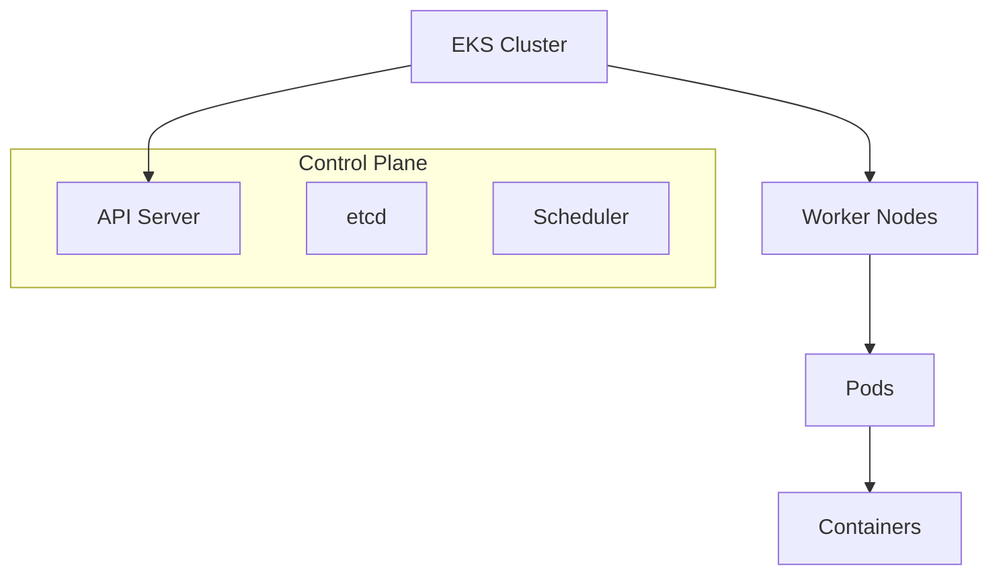

# 문서 작성 가이드라인

EKS Engineering Playbook의 일관성 있고 고품질의 문서 작성을 위한 가이드라인입니다.

## 📝 문서 구조

### 기본 구조

모든 문서는 다음 구조를 따라야 합니다:

```markdown
---
[메타데이터 frontmatter]
---

# 문서 제목

## 개요
## 전제 조건  
## 아키텍처 개요
## 구현 단계
## 검증 및 테스트
## 모니터링 및 관찰성
## 문제 해결
## 성능 최적화
## 보안 고려사항
## 참고 자료
## 다음 단계
```

### 섹션별 가이드라인

#### 1. 개요 (필수)
- 문서의 목적과 범위를 명확히 설명
- 독자가 얻을 수 있는 가치 제시
- 2-3문단으로 구성

#### 2. 전제 조건 (필수)
- 체크리스트 형태로 작성
- 필요한 도구, 권한, 사전 지식 명시
- 버전 정보 포함 (해당하는 경우)

#### 3. 아키텍처 개요 (권장)
- Mermaid 다이어그램 활용
- 시스템 구성 요소 간 관계 설명
- 데이터 플로우 또는 네트워크 토폴로지 포함

#### 4. 구현 단계 (필수)
- 단계별로 명확히 구분
- 실행 가능한 코드 예제 포함
- 각 단계의 목적과 결과 설명

#### 5. 검증 및 테스트 (필수)
- 구현 결과 확인 방법
- 예상 출력 결과 제시
- 실패 시 대응 방법

## 🎨 스타일 가이드

### 언어 사용

- **주 언어**: 한국어
- **기술 용어**: 영어 원문 병기 권장
  - 예: "파드(Pod)", "서비스(Service)"
- **명령어 및 코드**: 영어 그대로 사용

### 제목 작성

```markdown
# H1: 문서 제목 (문서당 1개)
## H2: 주요 섹션 (개요, 구현 단계 등)
### H3: 하위 섹션 (1단계, 2단계 등)
#### H4: 세부 항목 (필요시에만)
```

### 코드 블록

#### YAML 설정 파일
```yaml
# 주석으로 설명 추가
apiVersion: v1
kind: ConfigMap
metadata:
  name: example-config
  namespace: default
data:
  key: value
```

#### 쉘 명령어
```bash
# 명령어 설명
kubectl apply -f config.yaml

# 결과 확인
kubectl get configmap example-config
```

#### 다중 언어 코드
````markdown
```yaml title="config.yaml"
apiVersion: v1
kind: Service
```

```bash title="실행 명령어"
kubectl apply -f config.yaml
```
````

### 다이어그램

#### Mermaid 다이어그램 사용


#### 이미지 사용
- 스크린샷은 `static/img/` 디렉토리에 저장
- 파일명은 `domain-topic-description.png` 형식
- Alt 텍스트 필수 포함

```markdown

```

## 📋 콘텐츠 가이드라인

### 실용성 중심

- **실행 가능한 예제**: 모든 코드는 실제 실행 가능해야 함
- **단계별 접근**: 복잡한 내용을 단계별로 분해
- **검증 방법**: 각 단계마다 결과 확인 방법 제시

### 완성도

- **전체 워크플로우**: 시작부터 완료까지 전 과정 포함
- **문제 해결**: 예상 가능한 문제와 해결책 제시
- **성능 고려**: 성능 최적화 방안 포함

### 접근성

- **다양한 수준**: 초급자도 따라할 수 있도록 상세 설명
- **참고 자료**: 추가 학습을 위한 링크 제공
- **연관 문서**: 관련 문서로의 링크 포함

## 🔧 기술적 요구사항

### 메타데이터

- [메타데이터 스키마](./metadata-schema.md) 준수
- 모든 필수 필드 포함
- 적절한 태그 및 카테고리 설정

### 링크 관리

#### 내부 링크
```markdown
[관련 문서](../category/document.md)
[같은 카테고리 문서](./other-document.md)
```

#### 외부 링크
```markdown
[Kubernetes 공식 문서](https://kubernetes.io/docs/)
[AWS EKS 가이드](https://docs.aws.amazon.com/eks/)
```

### 코드 품질

- **문법 검사**: 모든 YAML, JSON 파일 문법 검증
- **실행 테스트**: 제공된 명령어는 실제 테스트 완료
- **버전 호환성**: 사용된 도구의 버전 명시

## ✅ 품질 체크리스트

문서 작성 완료 후 다음 항목을 확인하세요:

### 구조 및 형식
- [ ] 메타데이터 frontmatter 완성
- [ ] 필수 섹션 모두 포함
- [ ] 제목 계층 구조 올바름
- [ ] 코드 블록 언어 지정

### 내용 품질
- [ ] 실행 가능한 예제 포함
- [ ] 단계별 설명 명확함
- [ ] 검증 방법 제시
- [ ] 문제 해결 섹션 포함

### 기술적 정확성
- [ ] 모든 명령어 테스트 완료
- [ ] YAML/JSON 문법 검증
- [ ] 링크 유효성 확인
- [ ] 이미지 파일 존재 확인

### 사용자 경험
- [ ] 초급자도 이해 가능한 설명
- [ ] 관련 문서 링크 제공
- [ ] 다음 단계 안내
- [ ] 팁과 주의사항 포함

## 🚀 고급 기능

### 인터랙티브 요소

#### 탭 사용
```markdown
import Tabs from '@theme/Tabs';
import TabItem from '@theme/TabItem';

<Tabs>
  <TabItem value="yaml" label="YAML">
    ```yaml
    # YAML 설정
    ```
  </TabItem>
  <TabItem value="json" label="JSON">
    ```json
    // JSON 설정
    ```
  </TabItem>
</Tabs>
```

#### 알림 박스
```markdown
:::tip 팁
유용한 팁을 여기에 작성하세요.
:::

:::warning 주의
주의해야 할 사항을 여기에 작성하세요.
:::

:::danger 위험
중요한 경고사항을 여기에 작성하세요.
:::
```

### SEO 최적화

- **메타 설명**: description 필드 최적화
- **키워드**: 관련 키워드를 자연스럽게 포함
- **구조화된 데이터**: 적절한 제목 계층 구조 사용

## 📚 참고 자료

- [Docusaurus 문서 작성 가이드](https://docusaurus.io/docs/markdown-features)
- [Mermaid 다이어그램 문법](https://mermaid-js.github.io/mermaid/)
- [Kubernetes 문서 스타일 가이드](https://kubernetes.io/docs/contribute/style/style-guide/)

---

**💡 기억하세요**: 좋은 문서는 독자가 실제로 따라할 수 있고, 문제를 해결할 수 있는 문서입니다!